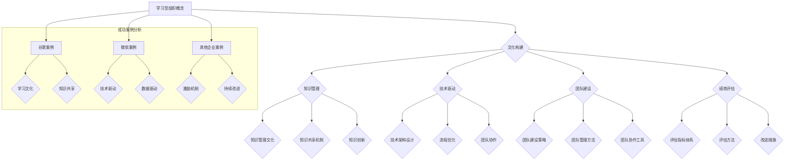

                 

### 文章标题

《如何打造学习型技术组织》

### 关键词

- 学习型组织
- 技术驱动
- 知识管理
- 团队协作
- 绩效评估
- 文化建设
- 案例分析

### 摘要

本文将深入探讨如何打造学习型技术组织。首先，我们将介绍学习型组织的定义和重要性，阐述其与传统组织的区别。接着，我们将探讨如何构建学习型组织的文化，以及如何进行有效的知识管理。随后，我们将重点分析技术驱动的学习型组织架构、流程和团队建设，并详细介绍绩效评估的方法和策略。最后，通过成功案例的分析，总结出构建学习型技术组织的实践策略和最佳实践，为企业提供可操作的指导。

## 目录大纲

### 第一部分：构建学习型技术组织的基础

#### 第1章：学习型组织的概念与重要性
1.1 学习型组织的定义与特点
1.2 学习型组织与传统组织的区别
1.3 学习型组织的关键要素

#### 第2章：学习型组织的文化构建
2.1 企业文化的类型与选择
2.2 建立学习型文化的方法与策略
2.3 如何培养员工的学习能力

#### 第3章：学习型组织的知识管理
3.1 知识管理的概念与作用
3.2 知识管理体系的构建
3.3 知识共享与知识创新的机制

### 第二部分：技术驱动的学习型组织

#### 第4章：技术驱动的学习型组织架构
4.1 技术驱动的学习型组织特点
4.2 技术驱动的组织架构设计
4.3 技术驱动的组织架构实施

#### 第5章：技术驱动的学习型组织流程
5.1 技术驱动的学习型组织流程设计
5.2 技术驱动的学习型组织流程优化
5.3 技术驱动的学习型组织流程实施

#### 第6章：技术驱动的学习型组织团队
6.1 技术驱动的学习型团队建设
6.2 技术驱动的学习型团队管理
6.3 技术驱动的学习型团队协作

#### 第7章：技术驱动的学习型组织绩效评估
7.1 学习型组织绩效评估的指标体系
7.2 学习型组织绩效评估的方法
7.3 学习型组织绩效评估的改进措施

### 第三部分：实践中的学习型技术组织

#### 第8章：学习型技术组织的成功案例
8.1 案例分析：谷歌如何打造学习型技术组织
8.2 案例分析：微软如何通过技术推动学习型组织转型
8.3 案例分析：其他企业如何成功打造学习型技术组织

#### 第9章：构建学习型技术组织的策略与建议
9.1 构建学习型技术组织的总体策略
9.2 针对不同阶段企业的具体建议
9.3 面对挑战的应对策略

## 第1章：学习型组织的概念与重要性

### 1.1 学习型组织的定义与特点

学习型组织（Learning Organization）是一种以学习为核心，通过持续学习和知识共享来实现组织创新和持续发展的组织形式。学习型组织的核心在于其成员的共同学习和不断成长，不仅关注个人能力的提升，更强调整个组织的共同进步。

学习型组织的特点主要包括以下几个方面：

1. **共同愿景**：学习型组织拥有明确的共同愿景，全体成员对此愿景有着深刻的认同和坚定的追求。
2. **团队学习**：学习型组织鼓励成员之间的相互学习和知识共享，通过团队学习提高整体能力。
3. **个人责任**：每个成员都对自己的学习和成长负责，积极主动地追求知识和技能的提升。
4. **系统思维**：学习型组织采用系统思维，能够从整体角度看待问题，寻找最佳解决方案。
5. **适应性**：学习型组织具有高度适应性，能够快速响应外部变化，持续优化内部运作。

### 1.2 学习型组织与传统组织的区别

传统组织通常依赖于严格的层级结构、固定的流程和规则，而学习型组织则更加灵活和开放。以下是比较详细的区别：

1. **组织结构**：传统组织结构通常较为固定，权力和资源分配较为明确；学习型组织则更加强调网络的扁平化和权力的分散。
2. **管理理念**：传统组织更强调权威和指令，学习型组织则更注重引导和激励。
3. **员工角色**：在传统组织中，员工通常是执行者，而在学习型组织中，员工则是主动学习和创新的主体。
4. **知识管理**：传统组织往往忽视知识的积累和共享，而学习型组织则高度重视知识管理和知识创新。
5. **适应能力**：传统组织对变化的适应能力较弱，而学习型组织能够迅速适应外部环境的变化。

### 1.3 学习型组织的关键要素

要构建一个有效的学习型组织，需要关注以下几个关键要素：

1. **共同愿景**：共同愿景是学习型组织的灵魂，能够激发全体成员的积极性和创造力。
2. **学习文化**：学习文化是学习型组织的核心，它鼓励成员不断学习和创新。
3. **知识管理**：知识管理是学习型组织的基础，它通过有效的知识积累和共享，提高组织的整体能力。
4. **团队协作**：团队协作是学习型组织的重要特征，通过有效的团队协作，能够实现知识共享和资源整合。
5. **绩效评估**：绩效评估是学习型组织的保障，它通过科学合理的评估机制，激励成员不断学习和进步。

## 第2章：学习型组织的文化构建

### 2.1 企业文化的类型与选择

企业文化是企业的灵魂，它不仅影响着员工的行为和态度，也决定了企业的长期发展。企业文化可以分为以下几种类型：

1. **结果导向文化**：这种文化强调效率、绩效和结果，员工追求的是完成任务的成效。企业通常设定明确的目标和绩效考核标准，员工为了达成目标而努力工作。
2. **客户导向文化**：这种文化重视客户需求和满意度，企业的一切行为都围绕着满足客户需求展开。员工注重与客户的沟通，以提供优质的服务和产品为己任。
3. **创新导向文化**：这种文化鼓励创新和实验，员工勇于尝试新的想法和方法，以推动企业的发展。企业通常会提供足够的资源和支持，鼓励员工进行创新。
4. **团队导向文化**：这种文化强调团队合作和协作，员工相互支持，共同完成任务。企业通常通过团队建设活动和协作机制，提高团队的凝聚力和效率。

在选择企业文化时，企业需要考虑自身的业务模式、发展阶段和员工特点。例如，初创公司通常选择创新导向文化，因为这种文化能够激发员工的创造力；而成熟企业则可能更倾向于结果导向或团队导向文化，以确保高效的运营和协作。

### 2.2 建立学习型文化的方法与策略

建立学习型文化是企业长期发展的重要任务。以下是一些常见的方法和策略：

1. **领导层的示范作用**：领导层是企业文化的重要传承者，他们的行为和态度直接影响员工的行为。领导层应该通过实际行动，如定期进行学习分享、参与培训等，展示对学习的重视。
2. **建立学习机制**：企业可以建立一系列学习机制，如内部培训、在线学习平台、学习社区等，为员工提供学习和成长的机会。这些机制可以激发员工的学习热情，促进知识的共享和传播。
3. **设立学习目标**：企业可以设定具体的学习目标，如每年完成多少培训课程、阅读多少本书等。这些目标可以帮助员工明确学习方向，提高学习效果。
4. **激励措施**：企业可以通过奖励机制，激励员工积极参与学习和知识共享。例如，对于表现出色的员工，可以给予奖金、晋升机会或其他形式的奖励。
5. **营造开放氛围**：企业应该营造一个开放、包容的氛围，鼓励员工表达不同的观点和想法。这样可以促进知识的碰撞和融合，提高企业的创新力。

### 2.3 如何培养员工的学习能力

培养员工的学习能力是构建学习型文化的重要一环。以下是一些有效的方法：

1. **提供培训机会**：企业可以定期为员工提供各种培训机会，包括内部培训、外部培训、在线培训等。这些培训可以帮助员工掌握新的知识和技能。
2. **鼓励自主学习**：企业可以鼓励员工自主学习和探索，提供相应的支持和资源。例如，可以设立自主学习时间，为员工提供学习资料和工具。
3. **建立学习社区**：企业可以建立学习社区，如学习小组、学习论坛等，为员工提供一个交流和学习的平台。通过互动和分享，员工可以相互启发和促进学习。
4. **开展项目学习**：企业可以开展项目学习，将学习和工作结合起来。通过实际项目的执行，员工可以应用所学知识，提高实践能力。
5. **反馈与评价**：企业应该对员工的学习效果进行反馈和评价，帮助员工了解自己的学习成果和不足。这样可以激励员工持续学习和进步。

### 2.4 学习型组织文化建设的案例分析

#### 案例一：谷歌的学习型组织文化

谷歌（Google）是一家全球知名的科技公司，以其创新和开放的企业文化著称。以下是谷歌在学习型组织文化建设方面的一些成功做法：

1. **领导层的支持**：谷歌的创始人拉里·佩奇和谢尔盖·布林对学习非常重视，他们通过实际行动展示了学习的价值。例如，他们经常参加各种会议和讲座，与员工分享最新的技术和行业动态。
2. **丰富的学习资源**：谷歌提供了丰富的学习资源，如内部培训、在线课程、学习论坛等。员工可以自由选择参加各种培训和学习活动，提高自己的技能和知识。
3. **鼓励创新和实验**：谷歌鼓励员工进行创新和实验，提供了足够的资源和支持。员工可以自由探索新的想法和方法，推动企业的发展。
4. **开放和包容的氛围**：谷歌营造了一个开放和包容的氛围，鼓励员工表达不同的观点和想法。这种氛围促进了知识的碰撞和融合，提高了企业的创新力。

#### 案例二：阿里巴巴的学习型组织文化

阿里巴巴（Alibaba）是一家全球领先的电商平台，以其独特的文化著称。以下是阿里巴巴在学习型组织文化建设方面的一些成功做法：

1. **共同愿景**：阿里巴巴有一个明确的共同愿景——“让天下没有难做的生意”。这个愿景激发了全体员工的热情和使命感，推动他们不断学习和进步。
2. **团队协作**：阿里巴巴强调团队协作，鼓励员工相互支持和合作。通过团队项目，员工可以共同学习和成长。
3. **学习机制**：阿里巴巴建立了完善的学习机制，如内部培训、在线学习平台、学习小组等。这些机制为员工提供了丰富的学习机会。
4. **激励措施**：阿里巴巴通过奖励机制，激励员工积极参与学习和知识共享。例如，对于在学习方面表现出色的员工，可以给予奖金、晋升机会等。

通过以上案例，我们可以看到，构建学习型组织文化需要领导层的支持、丰富的学习资源、鼓励创新和开放的氛围。这些要素共同作用，可以激发员工的积极性，提高企业的整体竞争力。

## 第3章：学习型组织的知识管理

### 3.1 知识管理的概念与作用

知识管理（Knowledge Management，KM）是指通过系统的方法和工具，对组织的知识进行收集、存储、共享、应用和创新，以提升组织整体绩效和创新能力的过程。知识管理不仅包括显性知识的整理和应用，如文档、数据库等，还包括隐性知识的挖掘和传播，如经验、技能和洞察力。

知识管理在组织中的重要作用主要体现在以下几个方面：

1. **提高决策效率**：通过知识管理，组织可以迅速获取和利用相关的知识和信息，提高决策的质量和效率。
2. **增强创新能力**：知识管理有助于激发员工的创新思维，促进知识的碰撞和融合，从而推动组织的创新和发展。
3. **提升团队协作**：知识管理可以促进团队成员之间的信息共享和协作，提高团队的凝聚力和协作效率。
4. **降低知识流失风险**：通过知识管理，组织可以有效地保护和传承关键知识，降低因人员流失带来的知识流失风险。
5. **提高员工能力**：知识管理为员工提供了丰富的学习资源，可以帮助他们不断学习和提升自身的知识和技能。

### 3.2 知识管理体系的构建

构建一个有效的知识管理体系是学习型组织的重要任务。以下是一个典型的知识管理体系构建步骤：

1. **确定知识管理目标**：组织需要明确知识管理的目标，如提高决策效率、增强创新能力、提升团队协作等。这些目标应与组织的整体战略相一致。
2. **识别知识资源**：组织需要识别和管理各种知识资源，包括显性知识和隐性知识。显性知识通常包括文档、数据库、知识库等，隐性知识则包括员工的经验、技能和洞察力等。
3. **建立知识存储和管理系统**：组织应建立一个高效的知识存储和管理系统，如企业内网、知识库、数据库等。这些系统应方便员工快速查找和使用知识。
4. **制定知识共享和传播机制**：组织需要制定有效的知识共享和传播机制，如内部培训、学习社区、知识分享会等。这些机制应鼓励员工主动分享知识和经验。
5. **建立知识创新机制**：组织应鼓励员工进行知识创新，如设立创新基金、创新实验室等。这些机制可以激发员工的创新思维，推动知识的更新和发展。
6. **培训和管理知识管理团队**：组织应培训和管理一支专业的知识管理团队，负责知识管理体系的构建和维护。这支团队应具备相关的知识和技能，能够有效地推动知识管理工作的开展。

### 3.3 知识共享与知识创新的机制

知识共享和知识创新是知识管理的重要环节。以下是一些有效的机制：

1. **内部培训**：组织可以定期举办内部培训，让员工分享自己的知识和经验。这些培训可以是专题讲座、工作坊或研讨会等形式。
2. **学习社区**：组织可以建立学习社区，如在线论坛、微信群等，为员工提供一个交流和学习的平台。通过互动和分享，员工可以相互启发和促进学习。
3. **知识分享会**：组织可以定期举办知识分享会，邀请员工分享自己的专业知识和经验。这些分享会可以是内部会议、公开课或线上直播等形式。
4. **项目合作**：组织可以通过项目合作，促进知识共享和知识创新。在项目中，员工可以共同面对问题，共同解决问题，从而实现知识的积累和创新。
5. **奖励机制**：组织可以设立奖励机制，激励员工积极参与知识共享和知识创新。例如，对于在知识共享和知识创新方面表现出色的员工，可以给予奖金、晋升机会等。
6. **知识管理平台**：组织可以建立知识管理平台，如知识库、文档管理系统等，为员工提供方便的知识查找和共享工具。

### 3.4 知识管理案例与实践

#### 案例一：微软的知识管理实践

微软（Microsoft）是一家全球领先的软件公司，其在知识管理方面有着丰富的经验。以下是微软的一些知识管理实践：

1. **建立全球知识库**：微软建立了全球知识库，包含各种技术文档、案例研究和最佳实践。员工可以通过知识库快速查找和获取所需的知识。
2. **内部培训计划**：微软定期举办内部培训计划，让员工分享自己的知识和经验。这些培训计划涵盖各种技术和管理领域，帮助员工不断提升自己的能力。
3. **开放共享的文化**：微软鼓励员工开放共享知识，建立了多个学习社区，如内部论坛、技术博客等。这些社区为员工提供了一个交流和学习的平台，促进了知识的传播和创新。
4. **奖励机制**：微软设立了知识管理奖励机制，对在知识共享和知识创新方面表现出色的员工进行奖励。这些奖励包括奖金、晋升机会等，激发了员工的积极性和创造力。

#### 案例二：IBM的知识管理实践

IBM（International Business Machines Corporation）是一家全球领先的科技公司，其在知识管理方面有着丰富的经验。以下是IBM的一些知识管理实践：

1. **建立知识管理团队**：IBM建立了专业的知识管理团队，负责知识管理体系的构建和维护。这些团队成员具备丰富的知识管理经验和专业技能。
2. **知识管理平台**：IBM建立了知识管理平台，包括知识库、文档管理系统等，为员工提供了方便的知识查找和共享工具。
3. **内部培训**：IBM定期举办内部培训，让员工分享自己的知识和经验。这些培训计划涵盖各种技术和管理领域，帮助员工不断提升自己的能力。
4. **奖励机制**：IBM设立了知识管理奖励机制，对在知识共享和知识创新方面表现出色的员工进行奖励。这些奖励包括奖金、晋升机会等，激发了员工的积极性和创造力。

通过以上案例，我们可以看到，知识管理是构建学习型组织的重要环节。有效的知识管理不仅可以帮助组织提高决策效率、增强创新能力、提升团队协作，还可以降低知识流失风险，提高员工的综合能力。因此，组织应高度重视知识管理，制定相应的策略和措施，推动知识管理的实践和应用。

## 第4章：技术驱动的学习型组织架构

### 4.1 技术驱动的学习型组织特点

技术驱动的学习型组织（Technology-driven Learning Organization）是指利用先进的技术手段和工具，构建一个能够持续学习和适应变化的组织架构。这种组织具有以下几个显著特点：

1. **高度灵活性**：技术驱动的学习型组织具有高度灵活性，能够快速适应外部环境的变化。通过采用云计算、大数据等技术，组织可以实现快速部署和调整，提高响应速度。
2. **高效的知识共享**：技术驱动的学习型组织通过构建高效的知识共享平台，如知识库、在线论坛等，实现知识的快速传播和共享。这有助于提高员工的技能和知识水平，推动组织的创新和发展。
3. **强大的数据分析能力**：技术驱动的学习型组织利用大数据分析和人工智能技术，对组织的数据进行深入分析和挖掘，发现潜在问题和机遇。这有助于组织做出更明智的决策，提高运营效率。
4. **持续的学习文化**：技术驱动的学习型组织重视持续学习，通过在线学习平台、内部培训等方式，为员工提供丰富的学习资源。这种学习文化能够激发员工的积极性和创造力，推动组织的持续发展。
5. **高度协作的团队**：技术驱动的学习型组织鼓励员工之间的协作和知识共享，通过项目管理工具、即时通讯工具等，实现高效协作。这种协作文化有助于提高团队的凝聚力和执行力。

### 4.2 技术驱动的组织架构设计

设计技术驱动的学习型组织架构需要考虑以下几个方面：

1. **扁平化的组织结构**：扁平化的组织结构有助于信息流通和快速决策。通过减少管理层级，组织可以实现更高效的沟通和协作，提高整体运作效率。
2. **模块化的组织单元**：模块化的组织单元有助于提高组织的灵活性和适应性。通过将组织分解为若干个独立的模块，每个模块都可以独立运作，实现快速响应和调整。
3. **技术基础设施的建设**：技术驱动的学习型组织需要建立完善的技术基础设施，如云计算平台、大数据平台、知识库等。这些基础设施为组织的知识共享、数据分析和学习提供了强有力的支持。
4. **跨部门协作机制**：技术驱动的学习型组织需要建立跨部门的协作机制，促进不同部门之间的信息共享和协作。通过跨部门项目、内部市场等方式，组织可以实现资源的整合和优化。
5. **人才培养和激励体系**：技术驱动的学习型组织需要建立科学的人才培养和激励体系，激发员工的积极性和创造力。通过培训、晋升、绩效奖励等手段，组织可以吸引和留住优秀的人才。

### 4.3 技术驱动的组织架构实施

实施技术驱动的学习型组织架构需要采取以下措施：

1. **领导层的支持**：领导层需要充分认识到技术驱动的重要性，并在组织内部推动技术驱动组织架构的实施。领导层的支持和倡导是组织架构实施成功的关键。
2. **逐步推进**：技术驱动的组织架构实施需要逐步推进，避免一次性的大规模变革。组织可以首先在部分部门或项目上进行试点，逐步积累经验和改进。
3. **培训和教育**：组织需要对员工进行技术培训和技能提升，确保员工能够适应新的组织架构和工作方式。通过培训和辅导，员工可以更快地掌握新技术和新方法。
4. **优化流程**：组织需要优化现有的业务流程和管理流程，使之与新的组织架构相适应。通过流程优化，组织可以提高效率，减少冗余和浪费。
5. **持续改进**：技术驱动的学习型组织需要持续改进和优化，以适应不断变化的外部环境和内部需求。通过定期的评估和反馈，组织可以不断调整和改进组织架构，实现持续发展。

### 4.4 技术驱动的学习型组织架构的案例分析

#### 案例一：谷歌的技术驱动组织架构

谷歌（Google）是一家全球领先的技术公司，其技术驱动的学习型组织架构在全球范围内具有很高的知名度。以下是谷歌的一些技术驱动组织架构特点：

1. **模块化的组织架构**：谷歌采用模块化的组织架构，将公司划分为多个独立运作的模块，如搜索、广告、云计算等。每个模块都有自己的团队和领导，实现快速响应和灵活调整。
2. **高度灵活的资源配置**：谷歌通过技术手段实现资源的灵活配置，如云计算平台和分布式存储系统。这些技术手段使谷歌能够快速部署和调整资源，满足不同模块的需求。
3. **跨部门协作机制**：谷歌建立了多个跨部门的协作团队，如X实验室、谷歌云等。这些团队通过技术手段实现高效协作，推动创新和快速发展。
4. **持续学习的文化**：谷歌重视持续学习，为员工提供丰富的学习资源和培训机会。通过内部培训、在线学习平台等，谷歌不断激发员工的创新思维和创造力。

#### 案例二：亚马逊的技术驱动组织架构

亚马逊（Amazon）是一家全球领先电商平台，其技术驱动的学习型组织架构在全球范围内也备受关注。以下是亚马逊的一些技术驱动组织架构特点：

1. **灵活的团队架构**：亚马逊采用灵活的团队架构，将员工划分为多个小团队，每个团队都有明确的任务和目标。这些小团队能够独立运作，实现快速决策和执行。
2. **技术驱动的流程优化**：亚马逊通过大数据分析和人工智能技术，对业务流程进行持续优化。通过数据分析，亚马逊可以更准确地预测需求，优化库存管理，提高运营效率。
3. **强大的技术基础设施**：亚马逊建立了强大的技术基础设施，如云计算平台、大数据平台、人工智能平台等。这些技术基础设施为亚马逊的运营提供了强有力的支持。
4. **持续学习的文化**：亚马逊重视持续学习，为员工提供丰富的学习资源和培训机会。通过内部培训、在线学习平台等，亚马逊不断激发员工的创新思维和创造力。

通过以上案例，我们可以看到，技术驱动的学习型组织架构在提高组织的灵活性、知识共享和创新能力方面具有显著优势。组织应积极探索和实施技术驱动的组织架构，以应对快速变化的市场环境和激烈的竞争。

## 第5章：技术驱动的学习型组织流程

### 5.1 技术驱动的学习型组织流程设计

技术驱动的学习型组织流程设计是指利用先进的技术手段和工具，构建一个能够持续学习和适应变化的组织流程。这种流程设计需要考虑以下几个方面：

1. **目标导向**：流程设计应以组织的战略目标为导向，确保每个流程环节都能为组织的目标服务。通过明确的目标，流程设计可以更有效地引导资源投入和优化流程。

2. **模块化设计**：模块化设计有助于提高流程的灵活性和适应性。将流程分解为若干个独立的模块，每个模块可以独立运作，实现快速响应和调整。

3. **数据驱动**：数据是流程优化的关键。通过大数据分析和人工智能技术，流程设计可以实时获取和利用相关数据，进行数据驱动的决策和优化。

4. **自动化与智能化**：利用自动化和智能化技术，流程设计可以减少人工干预，提高流程效率和准确性。自动化流程可以减少人为错误，智能化流程可以提供更精确的预测和优化。

5. **持续改进**：流程设计应具有持续改进的能力。通过定期评估和反馈，流程设计可以不断调整和优化，以适应不断变化的外部环境和内部需求。

### 5.2 技术驱动的学习型组织流程优化

技术驱动的学习型组织流程优化是指利用先进的技术手段和工具，对现有流程进行改进和优化，以提高流程效率和质量。以下是一些常见的优化方法：

1. **流程自动化**：通过自动化技术，将重复性和规则性较强的流程环节自动化，减少人工干预。自动化可以提高流程的效率和准确性，减少人为错误。

2. **流程智能化**：利用人工智能和机器学习技术，对流程进行智能化优化。通过数据分析和预测，智能化流程可以提供更精确的决策和优化，提高流程的效率和效果。

3. **流程分析**：通过流程分析工具，对现有流程进行详细分析，识别流程中的瓶颈和问题。流程分析可以帮助组织找到优化机会，制定针对性的优化方案。

4. **持续改进**：流程优化不是一次性的工作，而是一个持续的过程。通过定期评估和反馈，流程优化可以不断进行调整和改进，以适应不断变化的外部环境和内部需求。

### 5.3 技术驱动的学习型组织流程实施

技术驱动的学习型组织流程实施是指将设计好的流程方案付诸实践，确保流程的有效运行和持续优化。以下是一些关键步骤：

1. **流程培训**：组织应对员工进行流程培训，确保他们了解新的流程内容和操作方法。通过培训，员工可以更快地适应新的工作方式，提高工作效率。

2. **流程文档化**：将流程设计文档化，形成标准化的操作手册和流程图。流程文档化有助于提高流程的可操作性和可维护性，减少流程运行中的误解和错误。

3. **技术支持**：确保技术支持团队随时待命，为流程运行提供技术保障。技术支持可以帮助解决流程运行中的技术问题，确保流程的稳定运行。

4. **流程监控**：建立流程监控机制，实时监控流程的运行状态和关键指标。通过流程监控，组织可以及时发现和解决问题，确保流程的高效运行。

5. **反馈与改进**：组织应建立反馈机制，鼓励员工提出改进建议和意见。通过定期收集和分析反馈，组织可以不断优化流程，提高流程的效率和质量。

### 5.4 技术驱动的学习型组织流程案例分析

#### 案例一：阿里巴巴的流程优化

阿里巴巴（Alibaba）是一家全球领先的电商平台，其在流程优化方面有着丰富的经验。以下是阿里巴巴的一些流程优化案例：

1. **订单处理流程优化**：阿里巴巴通过大数据分析和人工智能技术，对订单处理流程进行优化。通过实时分析和预测订单量，阿里巴巴可以更准确地安排资源，提高订单处理效率。

2. **供应链管理流程优化**：阿里巴巴利用区块链技术，对供应链管理流程进行优化。通过区块链技术，阿里巴巴可以实现供应链信息的透明化和可追溯性，提高供应链管理的效率和准确性。

3. **客户服务流程优化**：阿里巴巴通过建立智能客服系统，对客户服务流程进行优化。智能客服系统可以实时响应客户需求，提供高质量的客户服务，提高客户满意度。

#### 案例二：亚马逊的流程自动化

亚马逊（Amazon）是一家全球领先的电商平台，其在流程自动化方面有着深厚的积累。以下是亚马逊的一些流程自动化案例：

1. **库存管理流程自动化**：亚马逊通过自动化技术，对库存管理流程进行优化。通过自动化系统，亚马逊可以实现库存的实时监控和自动补货，提高库存管理的效率和准确性。

2. **物流配送流程自动化**：亚马逊利用自动化技术和机器人，对物流配送流程进行优化。通过自动化仓储和配送系统，亚马逊可以更快地处理订单，提高配送效率。

3. **数据分析和决策自动化**：亚马逊通过大数据分析和人工智能技术，对业务流程进行自动化优化。通过自动化分析系统，亚马逊可以实时获取和分析数据，提供更精准的决策支持，提高运营效率。

通过以上案例，我们可以看到，技术驱动的学习型组织流程在提高组织效率和创新能力方面具有显著优势。组织应积极探索和实施技术驱动的流程优化，以实现持续发展和竞争优势。

## 第6章：技术驱动的学习型组织团队

### 6.1 技术驱动的学习型团队建设

技术驱动的学习型团队建设是构建高效学习型组织的关键。以下是一些关键步骤和方法：

1. **团队目标的设定**：首先，团队需要明确共同的目标和愿景。通过共同的目标，团队成员可以更好地协同工作，共同努力实现目标。

2. **团队成员的能力提升**：团队每个成员都应具备良好的技术能力和学习能力。组织可以通过培训、学习社区、在线课程等方式，提升团队成员的技术能力和学习能力。

3. **团队文化的塑造**：团队文化是团队建设的重要组成部分。一个积极、开放和包容的团队文化可以促进团队成员之间的协作和知识共享。

4. **团队协作工具的引入**：技术驱动的团队需要利用各种协作工具，如项目管理工具、即时通讯工具、文档共享平台等，提高团队协作效率。

5. **激励机制的实施**：通过奖励机制，激励团队成员积极参与学习和知识共享，如设立学习积分、优秀员工奖项等。

### 6.2 技术驱动的学习型团队管理

技术驱动的学习型团队管理需要采用科学的管理方法和工具，以下是一些建议：

1. **领导力的培养**：领导者需要具备技术驱动的思维和领导能力，能够引导团队实现共同的目标。通过领导力的培养，可以确保团队的稳定发展和持续学习。

2. **绩效评估体系的建立**：建立科学、合理的绩效评估体系，对团队成员的工作表现进行评估。绩效评估体系应包括技术能力、学习能力、团队协作等多个方面。

3. **定期反馈与沟通**：定期与团队成员进行反馈和沟通，了解他们的工作情况和需求。通过有效的沟通，可以及时发现和解决问题，促进团队的协作和学习。

4. **灵活的工作安排**：技术驱动的学习型团队需要具备灵活的工作安排，如远程工作、弹性工作时间等。灵活的工作安排可以提高团队成员的工作效率和工作满意度。

### 6.3 技术驱动的学习型团队协作

技术驱动的学习型团队协作需要充分利用现代技术和工具，以下是一些建议：

1. **协作工具的选用**：选用合适的协作工具，如项目管理工具、文档共享平台、即时通讯工具等，可以提高团队协作效率。

2. **知识共享机制的建设**：建立有效的知识共享机制，如内部论坛、知识库等，促进团队成员之间的知识共享和交流。

3. **共同项目的实施**：通过共同项目的实施，团队成员可以共同面对挑战，共同解决问题，提高团队协作能力和技术水平。

4. **培训与分享**：定期组织培训和学习分享会，让团队成员分享自己的经验和知识，促进团队整体技能的提升。

### 6.4 技术驱动的学习型团队案例分析

#### 案例一：谷歌的工程团队

谷歌（Google）的工程团队是技术驱动的学习型团队建设的典范。以下是一些关键做法：

1. **共同愿景**：谷歌工程团队有着明确的共同愿景，即通过技术创新推动互联网的发展。这种共同愿景激发了团队成员的积极性和创造力。

2. **学习文化**：谷歌工程团队注重持续学习，通过内部培训、在线课程、技术分享会等方式，不断提升团队成员的技术能力和学习能力。

3. **知识共享**：谷歌工程团队建立了完善的共享机制，如内部论坛、知识库等，促进团队成员之间的知识共享和交流。

4. **跨团队协作**：谷歌工程团队鼓励跨团队协作，通过共同项目推动团队之间的知识共享和技能提升。

#### 案例二：阿里巴巴的技术团队

阿里巴巴（Alibaba）的技术团队在技术驱动的学习型团队建设方面也有着丰富的经验。以下是一些关键做法：

1. **团队目标**：阿里巴巴技术团队明确团队目标，并通过定期评估确保目标的实现。团队目标与公司的战略目标保持一致，确保团队的努力方向正确。

2. **人才培养**：阿里巴巴注重人才培养，通过内部培训、导师制度等方式，提升团队成员的技术能力和管理水平。

3. **知识管理**：阿里巴巴技术团队建立了完善的知识管理体系，包括知识库、文档管理平台等，促进知识的积累和共享。

4. **激励机制**：阿里巴巴通过奖励机制，激励团队成员积极参与学习和知识共享，如设立技术竞赛、优秀员工奖项等。

通过以上案例，我们可以看到，技术驱动的学习型团队建设在提高团队协作效率、激发创新能力和推动组织发展方面具有重要作用。组织应积极探索和实践技术驱动的团队建设方法，以提升团队的竞争力和整体绩效。

## 第7章：技术驱动的学习型组织绩效评估

### 7.1 学习型组织绩效评估的指标体系

学习型组织的绩效评估需要建立一套科学、合理的指标体系，以确保评估的全面性和准确性。以下是一些关键绩效评估指标：

1. **学习能力指标**：包括员工的培训参与率、培训满意度、知识掌握度等。这些指标反映了员工的学习能力和学习成果。

2. **知识共享指标**：包括知识共享频率、知识共享质量、知识共享平台的使用率等。这些指标反映了知识在组织内部的传播和利用效率。

3. **创新指标**：包括新产品或服务的推出率、创新项目成功率、创新专利数量等。这些指标反映了组织的创新能力和市场竞争力。

4. **团队协作指标**：包括团队协作满意度、团队项目完成率、团队解决冲突的能力等。这些指标反映了团队的协作效果和团队凝聚力。

5. **员工满意度指标**：包括员工满意度调查结果、员工离职率、员工职业发展机会等。这些指标反映了员工的满意度和忠诚度。

6. **绩效成果指标**：包括销售额、利润率、市场份额、客户满意度等。这些指标反映了组织的整体绩效和市场竞争能力。

### 7.2 学习型组织绩效评估的方法

学习型组织的绩效评估方法应结合定量和定性的方法，以全面评估组织的绩效。以下是一些常见的评估方法：

1. **关键绩效指标（KPI）**：通过设定具体的绩效指标，如销售额、客户满意度等，对组织的绩效进行量化评估。

2. **360度评估**：通过员工、同事、上级和下属的反馈，对员工的工作表现进行全面评估。这种方法可以更全面地了解员工的工作状况和潜力。

3. **平衡计分卡**：将组织的战略目标分解为四个维度（财务、客户、内部流程、学习与成长），对组织的绩效进行综合评估。

4. **绩效评估会议**：定期组织绩效评估会议，讨论和评估组织的绩效，识别问题和改进方向。

5. **案例研究**：通过分析成功案例和失败案例，总结经验教训，为组织的绩效评估提供参考。

### 7.3 学习型组织绩效评估的改进措施

为了提高学习型组织的绩效评估效果，可以采取以下改进措施：

1. **建立持续改进机制**：通过定期评估和反馈，及时发现和解决问题，不断优化绩效评估体系。

2. **增强评估的透明度**：确保绩效评估过程的透明度，让员工了解评估的标准和流程，提高评估的公正性和公平性。

3. **结合定量和定性方法**：在绩效评估中，结合定量数据和定性分析，更全面地了解组织的绩效情况。

4. **重视员工参与**：鼓励员工参与绩效评估过程，提供反馈和建议，提高评估的准确性和有效性。

5. **建立绩效反馈机制**：定期向员工提供绩效反馈，帮助员工了解自己的优势和不足，制定改进计划。

通过以上改进措施，学习型组织的绩效评估可以更加科学、合理，有助于组织实现持续发展和提高整体绩效。

## 第8章：学习型技术组织的成功案例

### 8.1 案例分析：谷歌如何打造学习型技术组织

谷歌（Google）是一家全球知名的科技公司，以其独特的学习型技术组织而闻名。以下是谷歌在打造学习型技术组织方面的成功做法：

1. **共同愿景**：谷歌的创始人拉里·佩奇和谢尔盖·布林为谷歌设定了明确的共同愿景，即通过技术创新推动互联网的发展。这一共同愿景激发了全体员工的热情和创造力。

2. **学习文化**：谷歌非常重视学习，鼓励员工不断学习和探索。公司提供了丰富的学习资源，如内部培训、在线课程、学习社区等，帮助员工不断提升自己的技能和知识。

3. **知识共享**：谷歌建立了多个知识共享平台，如内部论坛、知识库等，促进员工之间的知识共享和交流。这些平台为员工提供了一个交流和学习的平台，促进了知识的传播和创新。

4. **激励机制**：谷歌设立了多种激励机制，如学习积分、优秀员工奖项等，激励员工积极参与学习和知识共享。这些奖励措施激发了员工的积极性和创造力。

5. **持续改进**：谷歌注重持续改进，通过定期评估和反馈，不断优化学习和知识管理流程。公司鼓励员工提出改进建议，并实施这些建议，以实现组织的持续发展和创新。

### 8.2 案例分析：微软如何通过技术推动学习型组织转型

微软（Microsoft）是一家全球领先的科技公司，其通过技术推动学习型组织转型取得了显著成效。以下是微软的一些成功做法：

1. **技术基础设施**：微软建立了强大的技术基础设施，如云计算平台、大数据平台等，为学习和知识管理提供了强有力的支持。这些技术基础设施为员工提供了方便的知识查找和共享工具。

2. **在线学习平台**：微软建立了在线学习平台，为员工提供丰富的学习资源。员工可以通过在线学习平台参加各种培训课程，提升自己的技能和知识。

3. **协作工具**：微软引入了多种协作工具，如项目管理工具、即时通讯工具等，提高团队的协作效率。这些工具帮助团队成员更好地合作，促进知识的共享和创新。

4. **数据驱动**：微软利用大数据分析和人工智能技术，对学习和知识管理过程进行优化。通过数据分析和预测，微软可以更准确地了解员工的学习需求，提供更个性化的学习资源。

5. **文化变革**：微软通过文化变革，鼓励员工拥抱学习和创新。公司通过领导层的示范作用、内部培训等方式，推动员工改变传统的思维模式，培养学习型组织的文化。

### 8.3 案例分析：其他企业如何成功打造学习型技术组织

除了谷歌和微软，许多其他企业也在成功打造学习型技术组织。以下是一些典型的成功案例：

1. **阿里巴巴**：阿里巴巴通过建立学习社区、在线课程、知识库等，推动员工的学习和知识共享。公司还设立了学习积分和优秀员工奖项，激励员工积极参与学习。

2. **IBM**：IBM通过建立知识管理团队、技术基础设施、在线学习平台等，推动学习型技术组织的建设。公司鼓励员工自主学习和探索，提供丰富的学习资源和机会。

3. **IBM**：IBM通过建立知识管理团队、技术基础设施、在线学习平台等，推动学习型技术组织的建设。公司鼓励员工自主学习和探索，提供丰富的学习资源和机会。

4. **华为**：华为通过建立学习社区、在线课程、知识库等，推动员工的学习和知识共享。公司还设立了学习积分和优秀员工奖项，激励员工积极参与学习。

通过以上案例，我们可以看到，成功打造学习型技术组织的关键在于共同愿景、学习文化、知识共享、激励机制和持续改进。企业应根据自身的实际情况，结合先进的技术手段和工具，制定合适的学习型技术组织建设策略，以实现组织的持续发展和创新。

## 第9章：构建学习型技术组织的策略与建议

### 9.1 构建学习型技术组织的总体策略

要成功构建一个学习型技术组织，企业需要制定一个全面的总体策略，以确保各个方面的协调和一致性。以下是一些关键的总体策略：

1. **明确共同愿景**：企业需要确立一个清晰的共同愿景，为全体成员提供目标和方向。这个愿景应该与企业的战略目标相一致，激励员工为之努力。

2. **培养学习文化**：学习文化是学习型组织的核心。企业需要营造一个支持学习和创新的环境，鼓励员工不断学习和分享知识。领导层的示范作用至关重要，他们需要通过实际行动展示对学习的重视。

3. **建立知识管理体系**：知识管理是学习型组织的基础。企业需要建立一个有效的知识管理体系，包括知识收集、存储、共享和应用机制，确保知识能够在组织内部顺畅流动。

4. **技术驱动**：利用先进的技术手段和工具，如云计算、大数据、人工智能等，提高组织的灵活性和适应性。技术驱动不仅可以提升组织的效率，还可以推动创新和知识共享。

5. **激励机制**：建立激励机制，鼓励员工积极参与学习和知识共享。可以通过学习积分、奖励计划、晋升机会等方式，激发员工的积极性和创造力。

6. **持续改进**：学习型组织需要具备持续改进的能力。企业应定期评估和反思现有的学习和知识管理流程，根据反馈进行调整和优化，以适应不断变化的环境和需求。

### 9.2 针对不同阶段企业的具体建议

构建学习型技术组织的策略应根据企业的不同发展阶段进行调整。以下是一些具体建议：

1. **初创阶段**：
   - **明确愿景**：初创企业需要确立明确的愿景和目标，以指导企业发展。
   - **核心团队学习**：初创企业应重点培养核心团队的学习能力，通过内部培训和外部学习资源，提高团队的整体技能水平。
   - **知识共享**：建立简单的知识共享机制，如团队会议、共享文档等，促进团队内部的交流和知识传播。
   - **快速迭代**：初创企业应利用快速迭代的方法，不断试验和优化产品，同时积累经验。

2. **成长阶段**：
   - **扩展学习资源**：随着企业规模的扩大，企业应扩展学习资源，包括外部培训和在线学习平台。
   - **知识管理平台**：建立知识管理平台，收集和存储员工的知识和经验，确保知识能够在组织内部共享和利用。
   - **激励机制**：完善激励机制，鼓励员工分享知识和经验，推动创新和协作。
   - **团队建设**：通过团队建设活动，增强团队的凝聚力和协作能力。

3. **成熟阶段**：
   - **持续学习与培训**：保持对新技术和行业动态的关注，定期组织培训和研讨会，确保员工的知识和技能保持更新。
   - **知识管理优化**：优化知识管理流程，确保知识的高效收集、存储和共享。
   - **绩效评估**：建立全面的绩效评估体系，将学习和知识共享纳入评估指标，激励员工不断进步。
   - **文化传承**：通过企业文化活动和故事分享，强化企业的学习文化和价值观，确保文化传承。

### 9.3 面对挑战的应对策略

构建学习型技术组织过程中可能会遇到各种挑战，以下是一些应对策略：

1. **员工抵触情绪**：员工可能对新事物和新流程有抵触情绪。企业可以通过沟通和培训，解释学习型组织的优势和价值，帮助员工理解并接受新变化。

2. **资源不足**：企业可能面临资源不足的挑战，包括时间和资金。企业可以通过优先级管理，确保资源集中在最重要和最有价值的领域。

3. **技术难题**：技术在推动学习型组织建设过程中可能遇到各种难题，如数据安全、系统集成等。企业应与技术合作伙伴紧密合作，确保技术问题的解决。

4. **组织惯性**：长期形成的组织惯性可能阻碍学习型组织的建设。企业需要通过领导层的支持和持续的文化变革，打破惯性，推动组织向学习型组织转型。

通过以上策略和建议，企业可以更有效地构建学习型技术组织，提升组织的竞争力，实现持续发展和创新。

## 总结与展望

本文深入探讨了如何打造学习型技术组织，从基础概念、文化构建、知识管理、技术驱动架构、流程优化、团队建设、绩效评估以及成功案例分析等方面进行了全面阐述。学习型技术组织不仅关注技术创新，更强调知识共享和持续学习，这对于企业在快速变化的市场环境中保持竞争力至关重要。

构建学习型技术组织的关键在于明确共同愿景、培养学习文化、建立知识管理体系、技术驱动、激励机制和持续改进。企业应根据自身发展阶段，采取相应的策略，应对可能的挑战。成功案例表明，谷歌、微软等企业在构建学习型技术组织方面取得了显著成果，为其他企业提供了宝贵的经验。

未来，随着技术的不断进步，学习型技术组织将面临更多机遇和挑战。企业应持续关注新兴技术，如人工智能、大数据等，将其应用于组织学习和知识管理，推动组织的创新和变革。通过不断优化和适应，企业可以构建一个更加高效、灵活和具有竞争力的学习型技术组织，实现持续发展和长期成功。

## 参考文献

1. Senge, P. M. (1990). The Fifth Discipline: The Art & Practice of The Learning Organization. Doubleday.
2. Nonaka, I., & Takeuchi, H. (1995). The Knowledge-Creating Company: How Japanese Companies Create the Dynamics of Innovation. Oxford University Press.
3. Marquardt, M. J. (1996). Building the Learning Organization. McGraw-Hill.
4. Kapp, K. M. (2007). The Learning Imperative: How Revolutionary New Learning Organizations Are Winning in Today's Knowledge Economy. John Wiley & Sons.
5. Google. (n.d.). [Google's Learning Culture](https://www.google.com/corporate/culture/).
6. Microsoft. (n.d.). [Microsoft Learning and Development](https://careers.microsoft.com/us/en/learning-development).
7. Alibaba. (n.d.). [Alibaba's Culture and Values](https://www.alibaba.com/groupinfo-1000000085859.html).
8. IBM. (n.d.). [IBM's Knowledge Management](https://www.ibm.com/ibm/knowledge-management).

## 作者信息

作者：AI天才研究院/AI Genius Institute & 禅与计算机程序设计艺术 /Zen And The Art of Computer Programming

### 附录：Mermaid 流程图

以下是一个学习型技术组织的概念架构的 Mermaid 流程图：

该流程图展示了学习型技术组织的核心组成部分及其相互关系，帮助读者更好地理解学习型技术组织的构建过程。通过这种方式，读者可以更直观地看到各个模块的作用和相互联系，从而更好地掌握学习型技术组织的基本概念和实践方法。

