                 


### 《如何打造高性能技术团队》

#### 关键词：高性能技术团队，团队构建，团队管理，技术能力提升，绩效管理，团队发展

#### 摘要：
在当今快速变化的技术环境中，打造一支高性能的技术团队是企业成功的关键。本文旨在深入探讨如何构建和维持一支高效率、创新力强的技术团队。我们将通过分步骤的分析和推理，详细解析团队构建、管理、技术能力提升、绩效管理和团队发展等关键环节，并提供实际案例和最佳实践，帮助读者理解并实践打造高性能技术团队的方法。

---

### 第一部分：引言

#### 1.1 高性能技术团队的概念与重要性

高性能技术团队是指那些能够高效地完成复杂技术任务，持续创新并保持高质量工作的团队。这类团队在技术能力、项目管理、团队协作等方面都表现出色，能够快速响应市场变化，持续交付价值。

#### 1.2 高性能技术团队的重要性

高性能技术团队对于企业来说至关重要。它们不仅能提高生产效率和产品质量，还能促进技术创新和业务增长。以下是高性能技术团队对企业的一些关键作用：

- **快速响应市场变化**：高性能技术团队能够迅速理解市场需求，并快速开发出相应的产品或解决方案。
- **持续创新**：高效的技术团队能够持续地推动技术创新，为企业保持竞争优势。
- **提高员工满意度**：一个高效的工作环境能够提升员工的职业满意度和工作幸福感。

### 第二部分：团队构建

#### 2.1 人才招募策略

人才招募是构建高性能技术团队的第一步。以下是构建高效技术团队所需的关键人才类型和招募策略：

#### 2.1.1 人才类型

- **技术专家**：具有深厚技术背景，能够解决复杂问题。
- **项目管理人才**：具备良好的项目管理技能，能够确保项目按时、按质完成。
- **跨领域人才**：能够跨越不同技术领域，促进技术创新和跨学科合作。

#### 2.1.2 招募策略

- **精准定位需求**：明确团队所需的具体技能和经验。
- **多渠道招聘**：利用内部推荐、招聘网站、社交媒体等多种渠道进行招聘。
- **面试技巧**：通过行为面试、技术面试等多种方式全面评估候选人。

#### 2.2 团队文化建设

团队文化是团队协作和高效工作的基石。以下是建立积极、协作的团队文化的关键要素：

- **共同价值观**：确保团队成员拥有共同的目标和价值观。
- **沟通机制**：建立开放的沟通渠道，鼓励团队成员分享想法和意见。
- **奖励机制**：通过奖励和认可来激励团队成员。

#### 2.3 建立高效协作机制

高效协作是高性能技术团队的关键。以下是一些有效的协作机制：

- **敏捷开发**：采用敏捷开发方法，提高团队响应速度和灵活性。
- **跨职能团队**：建立跨职能团队，促进不同领域之间的协作。
- **持续集成与持续交付（CI/CD）**：自动化测试和部署流程，提高工作效率。

### 第三部分：团队管理

#### 3.1 项目管理方法

项目管理是团队管理的重要组成部分。以下是几种有效的项目管理方法：

- **Scrum**：通过迭代和增量方式管理项目，提高团队灵活性和响应能力。
- **Kanban**：通过看板系统管理项目流程，提高透明度和协同效率。
- **六西格玛**：通过统计分析方法优化流程，提高质量。

#### 3.2 团队管理与协作

有效的团队管理是确保团队高效运行的关键。以下是一些团队管理技巧：

- **定期会议**：通过定期会议确保团队成员之间的沟通和协调。
- **冲突解决**：建立有效的冲突解决机制，避免冲突影响团队协作。
- **绩效反馈**：提供及时的绩效反馈，帮助团队成员不断改进。

#### 3.3 沟通协调与冲突解决

沟通是团队协作的基石。以下是一些提高沟通效率的技巧：

- **透明沟通**：确保信息透明，避免信息不对称。
- **有效倾听**：鼓励团队成员表达意见，并倾听他们的观点。
- **冲突管理**：通过开放对话和共识建立解决冲突。

### 第四部分：技术能力提升

#### 4.1 技术培训与分享

技术能力是技术团队的核心竞争力。以下是一些提升技术能力的策略：

- **内部培训**：组织定期的内部技术培训，提高团队成员的技能水平。
- **外部培训**：鼓励团队成员参加外部技术会议和培训，扩展视野。
- **技术分享**：通过内部技术分享会，促进知识的传播和团队间的学习。

#### 4.2 技术标准与规范

技术标准和规范是确保团队协作高效和质量稳定的关键。以下是一些制定技术标准和规范的建议：

- **代码审查**：建立代码审查机制，确保代码质量。
- **文档规范**：制定统一的文档规范，提高文档的可读性和可维护性。
- **技术债务管理**：定期评估和修复技术债务，避免技术债务累积。

#### 4.3 促进技术交流与创新

技术交流和创新是提升团队技术能力的有效途径。以下是一些促进技术交流与创新的策略：

- **技术研讨会**：定期举办技术研讨会，促进团队成员之间的技术交流和合作。
- **开源项目**：鼓励团队成员参与开源项目，提高技术水平并积累经验。
- **跨部门合作**：促进不同部门之间的技术交流和合作，推动技术创新。

### 第五部分：绩效管理

#### 5.1 绩效评估指标体系

有效的绩效评估是激励团队、提升团队绩效的关键。以下是一个基本的绩效评估指标体系：

- **质量**：评估团队成员交付的产品或服务的质量。
- **效率**：评估团队成员的工作效率和工作量。
- **创新**：评估团队成员的技术创新能力和成果。
- **协作**：评估团队成员的协作能力和团队合作精神。

#### 5.2 绩效评估与激励

有效的绩效评估和激励机制能够激发团队成员的积极性和创造力。以下是一些建议：

- **目标设定**：与团队成员共同设定清晰的目标，确保目标可衡量和可实现。
- **绩效反馈**：定期提供绩效反馈，帮助团队成员了解自己的优势和改进方向。
- **激励机制**：设置合理的激励机制，如奖金、晋升、培训等，激励团队成员。

#### 5.3 提升个人与团队绩效

提升个人和团队绩效是团队发展的关键。以下是一些策略：

- **个人发展计划**：为团队成员制定个人发展计划，确保团队成员的个人成长和团队发展的同步。
- **团队建设活动**：定期组织团队建设活动，提高团队凝聚力和协作效率。
- **持续改进**：通过定期的回顾和反思，不断改进工作流程和方法，提升团队绩效。

### 第六部分：团队发展

#### 6.1 团队愿景与战略规划

团队愿景和战略规划是团队发展的指引。以下是如何制定团队愿景和战略规划的建议：

- **共同愿景**：与团队成员共同制定团队愿景，确保团队的共同目标。
- **战略规划**：制定明确的战略规划，确保团队的战略目标和实施路径。

#### 6.2 团队发展策略

以下是一些团队发展策略：

- **人才梯队建设**：建立人才梯队，确保团队在不同阶段都有合适的人才。
- **知识管理**：建立知识管理系统，确保团队的知识积累和传承。
- **文化传承**：通过团队文化传承，确保团队的持续发展和创新。

#### 6.3 团队文化建设与优化

团队文化建设是团队发展的基础。以下是一些团队文化建设与优化的策略：

- **价值观认同**：确保团队成员对团队价值观的认同和遵循。
- **文化传承**：通过故事、仪式等方式传承团队文化，确保文化的延续性。
- **文化变革**：根据团队发展阶段和环境变化，适时调整团队文化。

### 第七部分：实战案例

#### 7.1 成功案例分享

以下是一个成功的技术团队建设案例：

- **案例背景**：某互联网公司由于快速扩张，技术团队面临人员不足、效率低下的问题。
- **解决方案**：公司通过引入敏捷开发方法、优化项目管理流程、加强团队建设活动等方式，逐步提升了技术团队的绩效和协作效率。
- **效果评估**：经过一年的努力，技术团队的工作效率提高了30%，产品交付周期缩短了40%。

#### 7.2 经验教训与启示

从成功案例中我们可以得到以下经验教训：

- **敏捷开发方法**：敏捷开发能够提高团队的灵活性和响应速度。
- **团队建设**：有效的团队建设能够提升团队的凝聚力和协作效率。
- **持续改进**：持续改进工作流程和方法是提升团队绩效的关键。

### 附录

#### 附录A：团队建设工具与资源

以下是一些团队建设工具和资源推荐：

- **项目管理工具**：如Jira、Trello等。
- **代码审查工具**：如GitLab、GitHub等。
- **文档管理工具**：如Confluence、Notion等。
- **技术学习资源**：如Pluralsight、Coursera等。

### 总结

打造高性能技术团队是企业成功的关键。通过合理的团队构建、有效的团队管理、技术能力提升、绩效管理和团队发展，企业可以构建一支高效、创新的技术团队。本文通过详细的分析和实战案例，提供了打造高性能技术团队的系统性方法和实践经验。

---

### 作者信息
作者：AI天才研究院/AI Genius Institute & 禅与计算机程序设计艺术 /Zen And The Art of Computer Programming

### 最佳实践 Tips

1. **精准人才招募**：明确团队需求，多渠道招聘，确保招到合适的人才。
2. **定期团队建设**：通过团队活动提升团队凝聚力，增强协作效率。
3. **持续学习**：鼓励团队成员持续学习，提升个人和团队技术能力。
4. **开放沟通**：建立透明、开放的沟通机制，确保信息畅通。
5. **绩效反馈**：及时提供绩效反馈，帮助团队成员成长。

### 小结

高性能技术团队是企业发展的基石。通过本文的详细分析和实战案例，读者可以了解到如何构建和维持一支高效的技术团队。希望本文能为您提供实际操作的指导，助力您的团队迈向更高性能。

### 注意事项

1. **文化认同**：确保团队成员对团队价值观的认同。
2. **激励机制**：合理设置激励机制，确保团队成员的积极性和创造力。
3. **持续改进**：不断优化团队工作流程和方法，提高团队绩效。

### 拓展阅读

1. 《敏捷开发实践指南》
2. 《团队协作：如何让团队更高效》
3. 《绩效管理：从理论到实践》

---

[GMASK]### 摘要总结

本文深入探讨了如何打造高性能技术团队。通过详细的分步骤分析和实战案例，我们了解了团队构建、团队管理、技术能力提升、绩效管理、团队发展等关键环节。我们还分享了最佳实践、注意事项和拓展阅读资源，为读者提供了全面的指导和启示。希望本文能助力读者构建并维持一支高效、创新的技术团队。

---

### Mermaid 流程图

以下是团队构建、管理和发展的核心概念和联系架构的 Mermaid 流程图：

```mermaid
graph TD
    A[团队构建] --> B[人才招募]
    A --> C[团队文化建设]
    B --> D[项目管理]
    B --> E[团队管理]
    C --> F[技术能力提升]
    C --> G[绩效管理]
    D --> H[沟通协调]
    D --> I[冲突解决]
    E --> J[项目管理方法]
    E --> K[沟通协调与冲突解决]
    F --> L[技术培训与分享]
    F --> M[技术标准与规范]
    G --> N[绩效评估与激励]
    G --> O[提升个人与团队绩效]
    H --> P[透明沟通]
    H --> Q[有效倾听]
    I --> R[冲突管理]
    J --> S[Scrum]
    J --> T[Kanban]
    J --> U[六西格玛]
    K --> V[团队愿景与战略规划]
    K --> W[团队发展策略]
    L --> X[内部培训]
    L --> Y[外部培训]
    L --> Z[技术分享]
    M --> AA[代码审查]
    M --> BB[文档规范]
    M --> CC[技术债务管理]
    N --> DD[目标设定]
    N --> EE[绩效反馈]
    N --> FF[激励机制]
    O --> GG[个人发展计划]
    O --> HH[团队建设活动]
    O --> II[持续改进]
    P --> JJ[价值观认同]
    P --> KK[文化传承]
    P --> LL[文化变革]
    Q --> MM[共同愿景]
    Q --> NN[战略规划]
    R --> OO[开放对话]
    R --> PP[共识建立]
    S --> QQ[迭代管理]
    S --> RR[增量管理]
    T --> SS[流程管理]
    T --> TT[透明度提高]
    U --> WW[统计分析]
    U --> XX[流程优化]
    V --> YY[人才梯队建设]
    V --> ZZ[知识管理]
    W --> AAA[团队文化建设]
    X --> BBB[技术交流]
    X --> CCC[技术创新]
    Y --> DDD[跨部门合作]
    Z --> EEE[开源项目]
    Z --> FFF[持续学习]
```



### 伪代码

以下是团队管理的核心算法原理讲解的伪代码：

```python
# 团队管理算法

function TeamManagement(team_members, project_details):
    # 初始化团队绩效指标
    performance_metrics = initialize_performance_metrics()

    # 设置项目目标和里程碑
    project_goals, milestones = set_project_goals(project_details)

    # 循环处理每个团队成员
    for member in team_members:
        # 分配任务和角色
        assign_tasks_and_roles(member, project_goals)

        # 持续监控成员绩效
        monitor_performance(member, performance_metrics)

        # 提供绩效反馈
        provide_feedback(member, performance_metrics)

    # 定期召开团队会议
    schedule_team_meetings(milestones)

    # 处理冲突和问题
    resolve_conflicts_and_issues()

    # 评估项目完成情况
    evaluate_project_completion(project_goals, performance_metrics)

    # 提供总结报告
    provide_summary_report()

# 辅助函数定义
function initialize_performance_metrics():
    # 初始化绩效指标
    return {"quality": 0, "efficiency": 0, "innovation": 0, "collaboration": 0}

function set_project_goals(project_details):
    # 设置项目目标和里程碑
    return {"goals": project_details["goals"], "milestones": project_details["milestones"]}

function assign_tasks_and_roles(member, project_goals):
    # 分配任务和角色
    member["tasks"] = assign_tasks(member, project_goals)
    member["role"] = assign_role(member)

function monitor_performance(member, performance_metrics):
    # 监控成员绩效
    performance_metrics["quality"] += calculate_quality(member)
    performance_metrics["efficiency"] += calculate_efficiency(member)
    performance_metrics["innovation"] += calculate_innovation(member)
    performance_metrics["collaboration"] += calculate_collaboration(member)

function provide_feedback(member, performance_metrics):
    # 提供绩效反馈
    feedback = generate_feedback(performance_metrics)
    send_feedback_to_member(member, feedback)

function resolve_conflicts_and_issues():
    # 处理冲突和问题
    conflicts = detect_conflicts()
    for conflict in conflicts:
        resolve_conflict(conflict)

function evaluate_project_completion(project_goals, performance_metrics):
    # 评估项目完成情况
    completion_status = evaluate_project_goals(project_goals, performance_metrics)
    return completion_status

function provide_summary_report():
    # 提供总结报告
    report = generate_summary_report()
    send_report_to_management(report)
```

### 数学模型和公式

以下是团队绩效评估的数学模型和公式：

```latex
\documentclass{article}
\usepackage{amsmath}
\begin{document}

\section{团队绩效评估模型}

团队绩效评估通常涉及多个维度，包括质量、效率、创新和协作。以下是一个简化的绩效评估模型：

\subsection{质量（Quality）}

质量得分（$Q$）可以通过以下公式计算：

\[ Q = \frac{\sum_{i=1}^{n} (Q_i \cdot W_i)}{\sum_{i=1}^{n} W_i} \]

其中，$Q_i$ 是第 $i$ 个任务的质量得分，$W_i$ 是第 $i$ 个任务权重。

\subsection{效率（Efficiency）}

效率得分（$E$）可以通过以下公式计算：

\[ E = \frac{\sum_{i=1}^{n} (E_i \cdot W_i)}{\sum_{i=1}^{n} W_i} \]

其中，$E_i$ 是第 $i$ 个任务的效率得分，$W_i$ 是第 $i$ 个任务权重。

\subsection{创新（Innovation）}

创新得分（$I$）可以通过以下公式计算：

\[ I = \frac{\sum_{i=1}^{n} (I_i \cdot W_i)}{\sum_{i=1}^{n} W_i} \]

其中，$I_i$ 是第 $i$ 个任务的创新得分，$W_i$ 是第 $i$ 个任务权重。

\subsection{协作（Collaboration）}

协作得分（$C$）可以通过以下公式计算：

\[ C = \frac{\sum_{i=1}^{n} (C_i \cdot W_i)}{\sum_{i=1}^{n} W_i} \]

其中，$C_i$ 是第 $i$ 个任务的协作得分，$W_i$ 是第 $i$ 个任务权重。

\subsection{总体绩效（Overall Performance）}

总体绩效得分（$P$）可以通过以下公式计算：

\[ P = \frac{Q + E + I + C}{4} \]

\end{document}
```

### 实际案例和详细讲解

#### 案例背景

某互联网公司是一家专注于移动应用开发的初创企业。公司成立两年，技术团队由最初的5人迅速扩展到20人。随着团队规模的扩大，公司面临团队协作效率低下、项目进度延误等问题。

#### 解决方案

为了解决这些问题，公司采取了以下措施：

1. **引入敏捷开发方法**：公司引入Scrum开发方法，通过每日站会、迭代回顾等方式提高团队协作效率和项目透明度。

2. **优化项目管理流程**：公司采用Kanban看板系统，将工作流程可视化，帮助团队成员更好地理解项目进度和任务分配。

3. **加强团队建设**：公司定期组织团队建设活动，如团队聚餐、户外拓展等，增强团队凝聚力。

4. **技术培训与分享**：公司每月组织一次内部技术分享会，鼓励团队成员分享自己的经验和知识，提高团队整体技术水平。

5. **绩效管理**：公司建立了一套绩效评估体系，通过目标设定、定期反馈和激励机制，提高团队成员的工作积极性和创新能力。

#### 实施过程

1. **敏捷开发引入**：

   - **每日站会**：每日站会时间控制在15分钟内，确保团队成员了解项目进度和遇到的问题。

   - **迭代回顾**：每两周进行一次迭代回顾，总结上一迭代的经验教训，为下一个迭代做准备。

2. **项目管理流程优化**：

   - **Kanban看板**：将项目任务分为“待办”、“进行中”和“已完成”三个状态，团队成员可以根据看板上的任务状态调整自己的工作计划。

   - **任务优先级**：根据项目优先级和团队成员的能力，合理分配任务，确保关键任务得到及时处理。

3. **团队建设活动**：

   - **团队聚餐**：每月组织一次团队聚餐，增进团队成员之间的了解和友谊。

   - **户外拓展**：每季度组织一次户外拓展活动，增强团队协作和凝聚力。

4. **技术培训与分享**：

   - **内部技术分享会**：每月最后一周的周五下午举行技术分享会，邀请技术团队成员分享自己的技术经验和心得。

   - **外部培训**：每年组织一次外部技术培训，让团队成员了解最新的技术趋势和行业动态。

5. **绩效管理**：

   - **目标设定**：每年年初，与团队成员共同设定工作目标和绩效指标。

   - **定期反馈**：每季度进行一次绩效评估，提供详细的绩效反馈，帮助团队成员了解自己的优势和改进方向。

   - **激励机制**：根据绩效评估结果，给予优秀团队成员奖金、晋升等激励。

#### 结果评估

经过一年的努力，技术团队取得了显著成效：

- **项目交付周期缩短**：通过敏捷开发和优化项目管理流程，项目交付周期从原来的6个月缩短到3个月。

- **团队协作效率提高**：团队建设活动和沟通机制的改进，使得团队成员之间的协作更加顺畅，项目进度更加稳定。

- **技术能力提升**：通过技术培训与分享，团队成员的技术水平得到显著提高，创新能力增强。

- **员工满意度提高**：良好的团队氛围和激励机制，使得员工满意度显著提高，离职率降低。

#### 项目小结

通过本案例，我们可以得出以下结论：

- **敏捷开发方法**：能够显著提高团队的协作效率和项目交付速度。

- **团队建设**：有助于增强团队凝聚力和协作能力。

- **技术培训与分享**：是提升团队技术能力和创新能力的重要手段。

- **绩效管理**：通过合理的绩效评估和激励机制，能够提高员工的工作积极性和团队绩效。

### 最佳实践 Tips

1. **敏捷开发**：采用敏捷开发方法，提高团队响应速度和灵活性。

2. **团队建设**：定期组织团队建设活动，增强团队凝聚力和协作能力。

3. **技术培训与分享**：通过内部培训和外部学习，持续提升团队技术能力和创新能力。

4. **绩效管理**：建立合理的绩效评估体系，激励团队成员不断提升。

### 小结

通过本案例和详细讲解，我们了解到了如何通过敏捷开发、团队建设、技术培训与分享和绩效管理等措施，构建和维持一支高效的技术团队。希望这些最佳实践能够为您的团队提供参考和启示。

### 注意事项

1. **文化认同**：确保团队成员对团队价值观的认同。

2. **激励机制**：合理设置激励机制，确保团队成员的积极性和创造力。

3. **持续改进**：不断优化团队工作流程和方法，提高团队绩效。

### 拓展阅读

1. 《敏捷开发实践指南》
2. 《团队协作：如何让团队更高效》
3. 《绩效管理：从理论到实践》

### 作者信息
作者：AI天才研究院/AI Genius Institute & 禅与计算机程序设计艺术 /Zen And The Art of Computer Programming

### 附录A：团队建设工具与资源

#### 附录A：团队建设工具与资源

以下是一些团队建设工具和资源推荐，旨在帮助您更好地构建和维持高效的技术团队。

#### 项目管理工具

- **Jira**：一款功能强大的项目管理工具，支持敏捷开发、任务追踪和报告生成。
- **Trello**：简洁易用的看板式项目管理工具，适合小型团队使用。
- **Asana**：一款全面的项目管理工具，支持任务分配、进度追踪和团队协作。

#### 代码审查工具

- **GitLab**：集代码托管、代码审查、任务管理于一体的平台。
- **GitHub**：流行的代码托管平台，提供完善的代码审查和协作功能。
- **Bitbucket**：适用于中小型团队的代码托管工具，支持Git和Mercurial。

#### 文档管理工具

- **Confluence**：一款功能强大的文档管理工具，支持团队协作和知识共享。
- **Notion**：一款灵活的知识库和项目管理工具，适合各种团队使用。
- **Google Docs**：适用于团队协作的在线文档编辑工具，支持实时协作和版本控制。

#### 技术学习资源

- **Pluralsight**：提供大量的在线技术培训课程，涵盖各种编程语言和技术领域。
- **Coursera**：全球知名的教育平台，提供由顶级大学和机构提供的大量在线课程。
- **Udemy**：提供各种主题的课程，包括编程、数据科学、人工智能等。

#### 开源社区

- **GitHub**：全球最大的开源社区，提供丰富的开源项目和资源。
- **Stack Overflow**：编程问答社区，帮助开发者解决编程问题。
- **Reddit**：包含各种技术子版块，提供技术讨论和分享。

通过使用这些工具和资源，您可以更有效地进行项目管理、代码审查、文档管理和技术学习，从而提升团队的整体绩效。希望这些推荐对您有所帮助。

