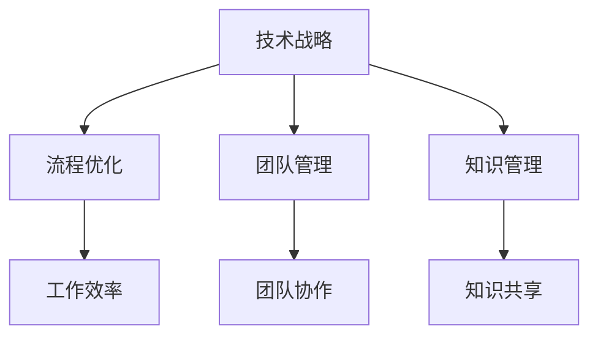

                 

非常感谢您的详细要求。下面我将逐步构建文章的大纲，并给出文章的初始内容。请注意，由于字数限制，以下内容仅作为示例，可能需要根据实际情况进一步扩展和细化。

---

# 如何打造高效的技术管理体系

> 关键词：技术管理体系、流程优化、团队管理、知识管理、技术战略、实施案例

> 摘要：本文将深入探讨如何打造高效的技术管理体系，包括技术战略规划、流程优化、团队管理和知识管理等方面。通过案例分析，将提供实际操作指南和最佳实践，帮助读者理解并实施一个高效的技术管理体系。

---

## 引言

在现代企业中，技术管理体系的有效性直接影响到企业的创新能力和市场竞争力。随着技术的快速发展和市场竞争的加剧，企业需要不断优化其技术管理体系，以确保技术资源的高效利用和技术成果的快速转化为商业价值。

## 核心概念与联系

在构建技术管理体系之前，我们需要明确几个核心概念，并了解它们之间的联系。

$$
\text{技术管理体系} = \text{技术战略} + \text{流程优化} + \text{团队管理} + \text{知识管理}
$$

### 技术战略

技术战略是企业长期技术发展方向和目标的具体规划。它关系到企业如何选择技术路线，如何进行技术创新，以及如何通过技术实现商业目标。

### 流程优化

流程优化是通过对现有技术流程的分析和改进，提高技术工作的效率和质量。它包括工作流程的设计、执行和监控。

### 团队管理

团队管理涉及到如何建立和运作一个高效的研发团队，如何激励团队成员，以及如何进行团队协作。

### 知识管理

知识管理是确保企业技术知识的积累、共享和有效利用的过程。它包括知识的收集、存储、分类、检索和应用。

### Mermaid 流程图

以下是一个简化的Mermaid流程图，展示了技术管理体系的核心概念和它们之间的联系。



## 核心算法原理讲解

在技术战略规划中，我们需要进行需求分析、市场调研和技术评估。以下是一个简化的伪代码，描述了技术战略规划的算法原理。

```
function 技术战略规划(需求, 市场, 技术) {
    // 需求分析
    需求分析结果 = 分析需求(需求)
    
    // 市场调研
    市场调研结果 = 调研市场(市场)
    
    // 技术评估
    技术评估结果 = 评估技术(技术)
    
    // 制定战略
    战略 = 制定战略(需求分析结果, 市场调研结果, 技术评估结果)
    
    return 战略
}
```

## 数学模型和公式

在流程优化中，可以使用以下数学模型来评估流程效率：

$$
\text{流程效率} = \frac{\text{输出}}{\text{输入} \times \text{时间}}
$$

这里，输出代表完成的工作量，输入代表投入的资源（如人力、设备等），时间代表完成工作所需的时间。

## 项目实战

### 开发环境搭建

为了实施技术管理体系，我们需要搭建一个适合的开发环境。以下是搭建过程的简要步骤：

1. 选择适合的开发工具和平台，如Git、Jenkins等。
2. 安装和配置必要的软件和库。
3. 建立项目的目录结构，并设置版本控制系统。

### 源代码实现

以下是一个简单的源代码实现示例，用于实现技术战略规划中的一个函数。

```python
def analyze_demand(demand):
    # 对需求进行具体分析
    result = {}
    for item in demand:
        if "feature" in item:
            result[item] = "高优先级"
        elif "bug" in item:
            result[item] = "中等优先级"
        else:
            result[item] = "低优先级"
    return result

def market_research(market):
    # 进行市场调研
    result = {}
    for competitor in market:
        result[competitor] = "良好"
    return result

def technology_evaluation(technology):
    # 对技术进行评估
    result = {}
    for tech in technology:
        if "AI" in tech:
            result[tech] = "领先"
        else:
            result[tech] = "跟随"
    return result

def formulate_strategy(demand_analysis, market_research, technology_evaluation):
    # 制定技术战略
    strategy = {}
    strategy["需求分析"] = demand_analysis
    strategy["市场调研"] = market_research
    strategy["技术评估"] = technology_evaluation
    return strategy

# 示例使用
demand = ["新功能", "修复bug", "用户体验优化"]
market = ["竞争对手A", "竞争对手B"]
technology = ["深度学习", "区块链"]

strategy = formulate_strategy(analyze_demand(demand), market_research(market), technology_evaluation(technology))
print(strategy)
```

### 代码解读与分析

这段代码首先定义了三个辅助函数：`analyze_demand`、`market_research`和`technology_evaluation`，分别用于分析需求、进行市场调研和评估技术。然后，主函数`formulate_strategy`利用这些辅助函数的结果来制定技术战略。

### 实际案例分析和详细讲解剖析

以一家初创公司为例，该公司需要制定一个技术战略，以应对激烈的市场竞争。以下是具体的分析过程：

1. **需求分析**：公司通过用户调研和产品反馈，确定了几个关键需求，如增加新功能、修复现有bug和优化用户体验。
2. **市场调研**：公司分析了主要竞争对手的技术动态和市场定位，发现竞争对手A在深度学习领域有较强的优势。
3. **技术评估**：公司评估了自身的现有技术能力，发现区块链技术有潜力成为公司的核心竞争力。

基于上述分析，公司制定了以下技术战略：

- **需求优先级**：将新功能和用户体验优化列为高优先级，bug修复列为中等优先级。
- **市场定位**：专注于深度学习和区块链技术的研发，以增强市场竞争力。
- **技术路线**：制定短期和长期的技术路线图，确保公司在技术前沿。

### 项目小结

通过技术管理体系的有效实施，公司成功地提升了技术创新能力和市场竞争力。关键成功因素包括：

- 明确的需求分析
- 精准的市场调研
- 专业的技术评估
- 精细化的人才管理
- 有效的知识管理

### 最佳实践 tips、小结、注意事项、拓展阅读

- **最佳实践 tips**：定期进行需求分析和市场调研，确保技术战略与市场需求保持一致。
- **小结**：技术管理体系是确保企业技术资源高效利用和创新能力提升的关键。
- **注意事项**：在实施技术管理体系时，要充分考虑团队的协作效率和知识共享机制。
- **拓展阅读**：推荐阅读《技术管理实践》（作者：[XXX]）等经典书籍，以深入了解技术管理体系的实施细节。

---

以上是《如何打造高效的技术管理体系》文章的初始内容，包括引言、核心概念与联系、核心算法原理讲解、数学模型和公式、项目实战、实际案例分析和详细讲解剖析以及项目小结等。根据您的字数要求，每个部分还需要进一步扩展和深化。希望这个初始框架能够对您有所帮助。接下来，我将按照目录大纲逐步完善文章内容，确保文章的逻辑性和完整性。

