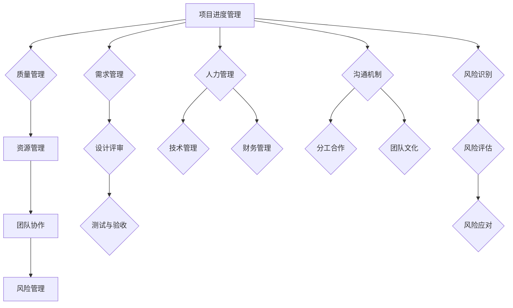

                 

# 如何提升团队的技术交付能力

## 引言

在现代企业的快速变化和高度竞争环境中，技术交付能力成为决定企业生存和发展的关键因素。然而，许多团队在技术交付过程中面临着各种挑战，如进度延误、质量不高、资源浪费等问题。因此，提升团队的技术交付能力，已经成为企业管理的重中之重。

本文将围绕“如何提升团队的技术交付能力”这一主题，进行深入探讨。我们将从团队技术交付能力的重要性、评估方法、提升策略、案例分析等方面展开，为团队管理者和技术人员提供实用的指导。

## 关键词

技术交付能力、项目管理、团队协作、技术能力提升、持续改进

## 摘要

本文首先阐述了技术交付能力的重要性，然后介绍了团队技术交付能力的评估方法，以及提升团队技术交付能力的具体策略。通过案例分析，我们总结了实践经验，并提出了持续改进的建议。本文旨在为团队管理者和技术人员提供一套实用、高效的提升技术交付能力的方法。

## 1. 确定书籍主题与目标读者群

### 1.1 书籍主题

《如何提升团队的技术交付能力》这一主题，主要关注于团队在技术交付过程中的问题解决和效率提升。随着信息技术的发展，企业对技术交付能力的要求越来越高。然而，许多团队在技术交付过程中面临着各种挑战，如进度延误、质量不高、资源浪费等问题。因此，本书旨在为团队管理者和技术人员提供一套系统、实用的提升技术交付能力的方法。

### 1.2 目标读者群

本书的目标读者群主要包括以下几类人员：

1. 技术团队管理者：负责团队的技术交付工作，需要掌握提升技术交付能力的方法和策略。
2. 技术开发人员：参与项目的开发与实施，希望通过本书提升个人和团队的技术交付能力。
3. IT咨询师：为不同企业提供技术咨询服务，需要了解提升技术交付能力的最佳实践。
4. 企业高管：关注企业技术战略的实施，希望通过本书了解团队技术交付能力提升的重要性和方法。

## 2. 提升技术交付能力的方法

### 2.1 项目管理与流程优化

项目管理是提升团队技术交付能力的关键环节。一个优秀的项目管理团队能够有效地协调资源、控制进度、确保质量，从而提高技术交付能力。

#### 2.1.1 项目管理的原则

1. **目标导向**：明确项目目标，确保项目方向正确。
2. **计划先行**：制定详细的项目计划，为项目的顺利实施提供保障。
3. **资源优化**：合理配置资源，确保项目在预算和时间内完成。
4. **风险管理**：识别和评估项目风险，制定应对策略。
5. **沟通协作**：建立有效的沟通机制，确保团队成员之间的协作和信息流通。

#### 2.1.2 技术交付流程优化策略

1. **需求管理**：明确项目需求，确保需求清晰、完整。
2. **设计评审**：对设计方案进行评审，确保方案可行、高效。
3. **代码审查**：对代码进行审查，确保代码质量。
4. **测试与验收**：对产品进行全面的测试，确保质量。
5. **部署与上线**：制定合理的部署计划，确保产品顺利上线。

#### 2.1.3 敏捷开发实践

敏捷开发是一种注重团队协作、灵活应对变化的方法论。通过敏捷开发，团队能够更好地适应市场需求，提高技术交付能力。

1. **迭代开发**：将项目分为多个迭代，每个迭代完成一部分功能。
2. **用户故事**：以用户需求为导向，描述功能模块。
3. **每日站会**：团队成员每日进行简短会议，交流进度、解决问题。
4. **持续集成**：通过自动化测试，确保代码质量。
5. **回顾与总结**：每个迭代结束后，对项目进行回顾和总结，持续改进。

### 2.2 团队协作与沟通技巧

团队协作与沟通是提升技术交付能力的重要因素。良好的团队协作和沟通能够提高团队效率，减少冲突，确保项目顺利推进。

#### 2.2.1 团队协作的重要性

1. **共同目标**：明确团队目标，确保团队成员共同努力。
2. **角色分工**：明确团队成员的角色和职责，提高工作效率。
3. **资源共享**：充分利用团队资源，提高项目成功率。

#### 2.2.2 有效沟通的方法

1. **明确信息**：确保沟通内容清晰、准确。
2. **倾听与理解**：倾听他人意见，理解他人需求。
3. **及时反馈**：及时反馈问题和建议，确保问题得到及时解决。
4. **使用工具**：利用工具提高沟通效率，如邮件、即时通讯、会议系统等。

### 2.3 技术能力提升

技术能力是团队技术交付能力的核心。提升团队技术能力，能够提高团队的技术水平，增强团队能力。

#### 2.3.1 技术能力提升的路径

1. **学习与培训**：通过学习新技术、参加培训，提高个人技术能力。
2. **项目实践**：通过参与项目实践，将所学知识应用于实际。
3. **知识分享**：通过分享经验、技术交流，提高团队整体技术水平。

#### 2.3.2 技术培训与知识分享

1. **内部培训**：组织内部培训，提高团队成员的技术水平。
2. **外部培训**：参加外部培训，了解业界最新技术动态。
3. **知识分享会**：定期举办知识分享会，交流经验、学习新技术。

### 2.4 技术债务管理

技术债务是团队在技术交付过程中积累的问题和隐患。合理管理技术债务，能够提高团队的技术交付能力。

#### 2.4.1 技术债务的概念

技术债务是指团队在项目开发过程中，为了快速推进项目而暂时妥协或牺牲某些技术标准或质量要求。这些妥协或牺牲可能会在未来带来潜在的风险和问题。

#### 2.4.2 技术债务的管理策略

1. **评估与分类**：对技术债务进行评估和分类，确定优先级。
2. **定期回顾**：定期对技术债务进行回顾，制定还款计划。
3. **改进与优化**：通过改进技术架构、优化代码，逐步偿还技术债务。

## 3. 案例分析

为了更好地理解提升团队技术交付能力的方法，我们通过以下两个案例进行分析。

### 3.1 案例一：团队技术交付能力提升实践

某互联网公司在业务快速发展的过程中，面临着技术交付能力的挑战。为了提升团队的技术交付能力，公司采取了一系列措施：

1. **项目管理与流程优化**：公司引入敏捷开发模式，将项目分为多个迭代，每个迭代完成一部分功能。同时，制定了详细的项目计划和流程，确保项目进度和质量。
2. **团队协作与沟通技巧**：公司建立了每日站会制度，确保团队成员及时沟通，解决问题。此外，公司还提供了多种沟通工具，提高沟通效率。
3. **技术能力提升**：公司定期组织内部培训，邀请外部专家进行讲座，提高团队成员的技术水平。同时，公司鼓励员工参加外部培训，学习业界最新技术动态。
4. **技术债务管理**：公司对技术债务进行评估和分类，制定了还款计划，通过改进技术架构、优化代码，逐步偿还技术债务。

通过以上措施，公司的技术交付能力得到了显著提升，项目进度和质量得到了保障。

### 3.2 案例二：项目管理中的技术交付挑战与应对

某传统制造业企业在数字化转型过程中，遇到了技术交付的挑战。为了应对这些挑战，企业采取了一系列措施：

1. **项目管理与流程优化**：企业引入了项目管理工具，制定详细的项目计划和流程，确保项目进度和质量。同时，企业建立了跨部门沟通机制，提高项目协作效率。
2. **团队协作与沟通技巧**：企业加强了团队协作与沟通的培训，提高了团队成员的沟通能力。同时，企业引入了即时通讯工具，提高沟通效率。
3. **技术能力提升**：企业组织了内部培训，提高了团队成员的技术水平。同时，企业鼓励员工参加外部培训，学习业界最新技术动态。
4. **技术债务管理**：企业对技术债务进行评估和分类，制定了还款计划，通过改进技术架构、优化代码，逐步偿还技术债务。

通过以上措施，企业成功地应对了技术交付的挑战，项目进度和质量得到了保障。

## 4. 持续改进与反馈机制

持续改进是提升团队技术交付能力的核心。通过建立反馈机制，团队能够及时发现和解决问题，不断提高技术交付能力。

### 4.1 持续改进的重要性

1. **提高团队效率**：通过持续改进，团队能够优化工作流程，提高工作效率。
2. **提升产品质量**：通过持续改进，团队能够提高产品质量，减少故障和缺陷。
3. **增强团队凝聚力**：通过持续改进，团队能够共同面对挑战，增强团队凝聚力。

### 4.2 反馈机制的建立与实施

1. **定期回顾**：每个迭代结束后，团队进行回顾，总结经验和教训。
2. **问题反馈**：建立问题反馈渠道，鼓励团队成员提出问题和建议。
3. **决策与改进**：对反馈的问题进行评估，制定改进计划，并实施改进措施。

### 4.3 持续改进的实践方法

1. **流程优化**：通过持续优化工作流程，提高团队效率。
2. **技术升级**：通过技术升级，提高团队的技术水平。
3. **知识分享**：通过知识分享，提高团队的总体能力。

## 5. 团队技术交付能力提升的保障

### 5.1 领导力与文化建设

领导力是提升团队技术交付能力的关键。通过建立积极的企业文化，团队能够更好地协同工作，提高技术交付能力。

### 5.2 资源保障与支持

资源保障是提升团队技术交付能力的基础。企业应提供充足的资源，包括人力、技术和资金，支持团队的技术交付工作。

### 5.3 激励与考核

激励与考核是提升团队技术交付能力的重要手段。企业应制定合理的激励政策，激励团队成员提高技术交付能力。同时，建立严格的考核机制，对团队成员的工作进行评估和反馈。

## 附录

### 附录A：技术交付能力提升工具与资源列表

- **项目管理工具**：Trello、Jira、Asana等。
- **团队协作工具**：Slack、Microsoft Teams、Zoom等。
- **代码管理工具**：Git、GitHub、GitLab等。
- **持续集成工具**：Jenkins、Travis CI、Circle CI等。
- **技术文档工具**：Confluence、GitBook、Markdown等。
- **培训资源**：Coursera、Udemy、网易云课堂等。

### 附录B：技术交付能力提升案例参考资料

- **案例一**：《敏捷开发实践指南》。
- **案例二**：《项目管理知识体系指南》。
- **案例三**：《技术债务管理最佳实践》。

## 结语

提升团队的技术交付能力是企业管理的重要任务。通过本文的探讨，我们总结了提升团队技术交付能力的方法和策略，包括项目管理与流程优化、团队协作与沟通技巧、技术能力提升、技术债务管理等方面。同时，我们还通过案例分析，展示了实践经验。希望通过本文，能为团队管理者和技术人员提供有益的指导。

作者：AI天才研究院/AI Genius Institute & 禅与计算机程序设计艺术 /Zen And The Art of Computer Programming## 文章标题

### 如何提升团队的技术交付能力

## 文章关键词

技术交付能力、团队协作、项目管理、持续改进、敏捷开发

## 摘要

本文旨在探讨如何提升团队的技术交付能力。通过分析技术交付能力的重要性，介绍评估和提升技术交付能力的策略，以及分享实际案例，本文为团队管理者和技术人员提供了一套实用的方法。文章关键词包括技术交付能力、团队协作、项目管理、持续改进和敏捷开发。本文内容丰富，逻辑清晰，旨在帮助团队提升技术交付能力，为企业创造更多价值。

## 目录

1. **引言** <a id="introduction"></a>
    - 1.1 技术交付能力的重要性
    - 1.2 团队技术交付能力面临的挑战

2. **团队技术交付能力的评估** <a id="evaluation"></a>
    - 2.1 技术交付能力评估的指标
    - 2.2 团队技术交付能力评估的方法

3. **提升团队技术交付能力的方法** <a id="methods"></a>
    - 3.1 项目管理与流程优化
    - 3.2 团队协作与沟通技巧
    - 3.3 技术能力提升
    - 3.4 技术债务管理

4. **案例分析** <a id="cases"></a>
    - 4.1 案例一：敏捷开发实践
    - 4.2 案例二：技术债务管理实践

5. **持续改进与反馈机制** <a id="continuous-improvement"></a>
    - 5.1 持续改进的重要性
    - 5.2 建立反馈机制
    - 5.3 持续改进的实践方法

6. **团队技术交付能力提升的保障** <a id="guarantee"></a>
    - 6.1 领导力与文化建设
    - 6.2 资源保障与支持
    - 6.3 激励与考核

7. **附录** <a id="appendix"></a>
    - 7.1 工具与资源列表
    - 7.2 案例参考资料

## 1. 引言

在现代企业的快速发展中，技术交付能力成为衡量一个团队竞争力的关键因素。技术交付能力不仅仅关乎项目的按时完成和质量，更是企业能否快速响应市场变化、保持竞争优势的决定性因素。因此，提升团队的技术交付能力成为企业管理的重中之重。

### 1.1 技术交付能力的重要性

技术交付能力的重要性体现在以下几个方面：

1. **提升企业竞争力**：高效率的技术交付能力能够帮助企业快速推出产品，占领市场，从而提升企业的竞争力。
2. **提高客户满意度**：及时交付高质量的产品和服务，能够提高客户满意度，增强客户忠诚度。
3. **降低运营成本**：通过优化流程、提升技术能力，企业能够降低运营成本，提高利润。
4. **增强团队凝聚力**：在提升技术交付能力的过程中，团队成员会不断学习和成长，增强团队凝聚力。

### 1.2 团队技术交付能力面临的挑战

尽管提升技术交付能力的重要性不言而喻，但许多团队在实际操作中仍然面临诸多挑战：

1. **项目管理问题**：缺乏有效的项目管理方法，导致进度延误、质量下降。
2. **团队协作困难**：团队成员之间的沟通不畅，导致协作效率低下。
3. **技术能力不足**：团队成员的技术能力参差不齐，影响项目的进展。
4. **技术债务累积**：在追求进度和功能的过程中，忽视了技术债务的管理，导致后期问题堆积。

面对这些挑战，团队需要采取有效的措施来提升技术交付能力。本文将围绕这些挑战，提供具体的解决方案和最佳实践。

## 2. 团队技术交付能力的评估

评估团队的技术交付能力是提升其能力的重要第一步。只有通过科学的评估，团队才能了解自身的优势和不足，有针对性地进行改进。以下是评估团队技术交付能力的几个关键指标和方法。

### 2.1 技术交付能力评估的指标

技术交付能力评估的指标可以包括以下几个方面：

1. **项目进度**：评估项目是否按时完成，进度是否可控。
2. **产品质量**：评估项目交付的质量是否符合预期标准。
3. **资源利用率**：评估团队在项目过程中资源的使用效率。
4. **客户满意度**：评估客户对交付产品的满意度。
5. **团队协作**：评估团队成员之间的协作效率和质量。
6. **技术债务**：评估项目中的技术债务水平和处理情况。

这些指标不仅能够反映团队的技术交付能力，还能为后续的改进提供方向。

### 2.2 团队技术交付能力评估的方法

评估团队技术交付能力的方法可以分为定量评估和定性评估两种：

1. **定量评估**：通过数据统计和分析，量化评估团队的各项指标。例如，使用项目管理软件统计项目的进度、资源使用情况等。
    ```mermaid
    graph TD
    A[项目进度] --> B[统计进度数据]
    A --> C[分析进度偏差]
    B --> D[进度控制策略]
    ```

2. **定性评估**：通过访谈、问卷调查等方式，收集团队成员和客户的反馈，评估团队的工作表现和客户满意度。
    ```mermaid
    graph TD
    E[访谈团队成员] --> F[收集反馈]
    E --> G[分析反馈结果]
    F --> H[改进措施]
    ```

通过定量和定性相结合的方法，团队能够全面了解自身的技术交付能力，从而有针对性地进行提升。

### 2.3 自我评估

除了外部评估，团队还可以进行自我评估。自我评估可以帮助团队成员更深入地了解自身的工作情况，发现潜在的问题。

1. **自我评估表**：制作自我评估表，涵盖项目进度、质量、资源利用率、客户满意度、团队协作、技术债务等方面。
    ```markdown
    | 指标          | 得分 | 分析与改进 |
    | ----------- | ---- | ---------- |
    | 项目进度      | 4    | 缺乏有效的进度管理策略 |
    | 产品质量      | 3    | 需要加强代码审查和测试 |
    | 资源利用率    | 5    | 资源分配合理 |
    | 客户满意度    | 4    | 需要改进沟通与反馈机制 |
    | 团队协作      | 3    | 协作效率有待提高 |
    | 技术债务      | 5    | 技术债务管理得当 |
    ```

2. **团队会议**：定期召开团队会议，讨论自我评估的结果，制定改进计划。

通过自我评估，团队能够及时发现和解决问题，不断提升技术交付能力。

## 3. 提升团队技术交付能力的方法

提升团队的技术交付能力需要从多个方面入手，包括项目管理与流程优化、团队协作与沟通技巧、技术能力提升、技术债务管理等方面。以下将详细介绍这些方法。

### 3.1 项目管理与流程优化

项目管理与流程优化是提升团队技术交付能力的关键环节。通过科学的项目管理和优化的流程，团队能够更好地控制项目进度、提高产品质量。

#### 3.1.1 项目管理的原则

项目管理的原则包括：

1. **目标导向**：明确项目目标，确保项目方向正确。
2. **计划先行**：制定详细的项目计划，为项目的顺利实施提供保障。
3. **资源优化**：合理配置资源，确保项目在预算和时间内完成。
4. **风险管理**：识别和评估项目风险，制定应对策略。
5. **沟通协作**：建立有效的沟通机制，确保团队成员之间的协作和信息流通。

#### 3.1.2 技术交付流程优化策略

技术交付流程的优化策略包括：

1. **需求管理**：明确项目需求，确保需求清晰、完整。
2. **设计评审**：对设计方案进行评审，确保方案可行、高效。
3. **代码审查**：对代码进行审查，确保代码质量。
4. **测试与验收**：对产品进行全面的测试，确保质量。
5. **部署与上线**：制定合理的部署计划，确保产品顺利上线。

#### 3.1.3 敏捷开发实践

敏捷开发是一种注重团队协作、灵活应对变化的方法论。通过敏捷开发，团队能够更好地适应市场需求，提高技术交付能力。

1. **迭代开发**：将项目分为多个迭代，每个迭代完成一部分功能。
2. **用户故事**：以用户需求为导向，描述功能模块。
3. **每日站会**：团队成员每日进行简短会议，交流进度、解决问题。
4. **持续集成**：通过自动化测试，确保代码质量。
5. **回顾与总结**：每个迭代结束后，对项目进行回顾和总结，持续改进。

### 3.2 团队协作与沟通技巧

团队协作与沟通是提升技术交付能力的重要因素。良好的团队协作和沟通能够提高团队效率，减少冲突，确保项目顺利推进。

#### 3.2.1 团队协作的重要性

1. **共同目标**：明确团队目标，确保团队成员共同努力。
2. **角色分工**：明确团队成员的角色和职责，提高工作效率。
3. **资源共享**：充分利用团队资源，提高项目成功率。

#### 3.2.2 有效沟通的方法

1. **明确信息**：确保沟通内容清晰、准确。
2. **倾听与理解**：倾听他人意见，理解他人需求。
3. **及时反馈**：及时反馈问题和建议，确保问题得到及时解决。
4. **使用工具**：利用工具提高沟通效率，如邮件、即时通讯、会议系统等。

### 3.3 技术能力提升

技术能力是团队技术交付能力的核心。提升团队技术能力，能够提高团队的技术水平，增强团队能力。

#### 3.3.1 技术能力提升的路径

1. **学习与培训**：通过学习新技术、参加培训，提高个人技术能力。
2. **项目实践**：通过参与项目实践，将所学知识应用于实际。
3. **知识分享**：通过分享经验、技术交流，提高团队整体技术水平。

#### 3.3.2 技术培训与知识分享

1. **内部培训**：组织内部培训，提高团队成员的技术水平。
2. **外部培训**：参加外部培训，了解业界最新技术动态。
3. **知识分享会**：定期举办知识分享会，交流经验、学习新技术。

### 3.4 技术债务管理

技术债务是团队在技术交付过程中积累的问题和隐患。合理管理技术债务，能够提高团队的技术交付能力。

#### 3.4.1 技术债务的概念

技术债务是指团队在项目开发过程中，为了快速推进项目而暂时妥协或牺牲某些技术标准或质量要求。这些妥协或牺牲可能会在未来带来潜在的风险和问题。

#### 3.4.2 技术债务的管理策略

1. **评估与分类**：对技术债务进行评估和分类，确定优先级。
2. **定期回顾**：定期对技术债务进行回顾，制定还款计划。
3. **改进与优化**：通过改进技术架构、优化代码，逐步偿还技术债务。

### 3.5 案例分析

为了更好地理解提升团队技术交付能力的方法，我们通过以下两个案例进行分析。

#### 3.5.1 案例一：敏捷开发实践

某互联网公司在产品开发过程中采用了敏捷开发模式。通过迭代开发和用户故事的引入，团队能够更灵活地应对市场需求，快速交付高质量的产品。

1. **迭代开发**：将产品开发分为多个迭代，每个迭代完成一部分功能。
2. **用户故事**：以用户需求为导向，描述功能模块。
3. **每日站会**：团队成员每日进行简短会议，交流进度、解决问题。
4. **持续集成**：通过自动化测试，确保代码质量。
5. **回顾与总结**：每个迭代结束后，对项目进行回顾和总结，持续改进。

通过敏捷开发的实践，该团队的技术交付能力得到了显著提升。

#### 3.5.2 案例二：技术债务管理实践

某金融公司在项目开发过程中积累了大量的技术债务。为了提高技术交付能力，公司采取了一系列措施来管理技术债务。

1. **评估与分类**：对技术债务进行评估和分类，确定优先级。
2. **定期回顾**：定期对技术债务进行回顾，制定还款计划。
3. **改进与优化**：通过改进技术架构、优化代码，逐步偿还技术债务。

通过有效的技术债务管理，该公司的技术交付能力得到了提升，项目质量得到了保障。

## 4. 持续改进与反馈机制

持续改进是提升团队技术交付能力的核心。通过建立反馈机制，团队能够及时发现和解决问题，不断提高技术交付能力。

### 4.1 持续改进的重要性

1. **提高团队效率**：通过持续改进，团队能够优化工作流程，提高工作效率。
2. **提升产品质量**：通过持续改进，团队能够提高产品质量，减少故障和缺陷。
3. **增强团队凝聚力**：通过持续改进，团队能够共同面对挑战，增强团队凝聚力。

### 4.2 建立反馈机制

建立反馈机制是持续改进的重要环节。以下是一些建立反馈机制的方法：

1. **定期回顾**：每个迭代结束后，团队进行回顾，总结经验和教训。
2. **问题反馈**：建立问题反馈渠道，鼓励团队成员提出问题和建议。
3. **决策与改进**：对反馈的问题进行评估，制定改进计划，并实施改进措施。

### 4.3 持续改进的实践方法

1. **流程优化**：通过持续优化工作流程，提高团队效率。
2. **技术升级**：通过技术升级，提高团队的技术水平。
3. **知识分享**：通过知识分享，提高团队的总体能力。

## 5. 团队技术交付能力提升的保障

提升团队的技术交付能力需要从多个方面进行保障，包括领导力与文化建设、资源保障与支持、激励与考核等。

### 5.1 领导力与文化建设

领导力是提升团队技术交付能力的关键。优秀的领导能够激励团队成员，提供必要的支持，推动团队持续改进。

1. **明确目标**：领导应明确团队的目标，确保团队成员了解并为之努力。
2. **激励与支持**：领导应提供激励措施，鼓励团队成员积极提升技术能力。
3. **文化建设**：领导应推动积极向上的企业文化，增强团队的凝聚力。

### 5.2 资源保障与支持

资源保障是提升团队技术交付能力的基础。企业应提供充足的资源，包括人力、技术和资金，支持团队的技术交付工作。

1. **人力支持**：提供必要的人力资源，确保团队有足够的人力进行工作。
2. **技术支持**：提供必要的技术支持，包括工具、软件和硬件等。
3. **资金支持**：提供足够的资金支持，确保项目能够顺利进行。

### 5.3 激励与考核

激励与考核是提升团队技术交付能力的重要手段。企业应制定合理的激励政策，激励团队成员提高技术交付能力。同时，建立严格的考核机制，对团队成员的工作进行评估和反馈。

1. **激励政策**：制定激励政策，如绩效奖金、股权激励等。
2. **考核机制**：建立考核机制，对团队成员的工作进行定期评估。
3. **反馈与改进**：对评估结果进行反馈，帮助团队成员发现不足，制定改进计划。

## 6. 附录

### 6.1 工具与资源列表

- **项目管理工具**：Trello、Jira、Asana等。
- **团队协作工具**：Slack、Microsoft Teams、Zoom等。
- **代码管理工具**：Git、GitHub、GitLab等。
- **持续集成工具**：Jenkins、Travis CI、Circle CI等。
- **技术文档工具**：Confluence、GitBook、Markdown等。
- **培训资源**：Coursera、Udemy、网易云课堂等。

### 6.2 案例参考资料

- **案例一**：《敏捷开发实践指南》。
- **案例二**：《项目管理知识体系指南》。
- **案例三**：《技术债务管理最佳实践》。

## 结语

提升团队的技术交付能力是企业管理的重要任务。通过本文的探讨，我们总结了提升团队技术交付能力的方法和策略，包括项目管理与流程优化、团队协作与沟通技巧、技术能力提升、技术债务管理等方面。同时，我们还通过案例分析，展示了实践经验。希望通过本文，能为团队管理者和技术人员提供有益的指导。

作者：AI天才研究院/AI Genius Institute & 禅与计算机程序设计艺术 /Zen And The Art of Computer Programming### 如何提升团队的技术交付能力

**引言**

在现代企业的运营中，技术交付能力已经成为衡量团队效率和企业竞争力的重要指标。高效的团队技术交付能力不仅能确保项目按时完成，还能保证产品或服务的质量，进而提升客户满意度。然而，许多团队在技术交付过程中面临着各种挑战，如进度延误、资源浪费、质量问题等。因此，如何提升团队的技术交付能力成为企业亟待解决的问题。本文将从项目管理、团队协作、技术能力提升、技术债务管理等方面，详细探讨提升团队技术交付能力的方法和策略。

**一、确定书籍主题与目标读者群**

**1. 书籍主题**

《如何提升团队的技术交付能力》这一主题旨在为技术团队管理者、开发人员以及其他IT从业者提供一套全面、实用的指导方案。本书将围绕项目管理、团队协作、技术能力提升、技术债务管理等多个方面，深入探讨提升团队技术交付能力的策略和方法。

**2. 目标读者群**

本书的目标读者主要包括以下几类人员：

- 技术团队管理者：负责整体团队的技术交付工作，需要掌握提升技术交付能力的方法和策略。
- 开发人员：直接参与项目开发，希望通过本书提升个人和团队的技术交付能力。
- IT咨询师：为不同企业提供技术咨询服务，需要了解提升技术交付能力的最佳实践。
- 企业高管：关注企业技术战略的实施，希望通过本书了解团队技术交付能力提升的重要性和方法。

**二、提升技术交付能力的方法**

提升团队的技术交付能力需要从多个方面入手，以下将详细探讨几种主要方法。

**1. 项目管理与流程优化**

项目管理是提升团队技术交付能力的基础。有效的项目管理能够确保项目在规定的时间内高质量完成。以下是项目管理与流程优化的一些关键策略：

- **制定详细的项目计划**：在项目开始前，制定详细的项目计划，包括项目目标、任务分配、时间表、资源需求等。项目计划应具备可操作性和可跟踪性，以便团队能够及时调整和优化。
- **建立敏捷开发流程**：敏捷开发强调快速响应变化、持续交付价值。通过迭代开发、用户故事、每日站会等实践，团队能够更灵活地应对需求变化，提高交付效率。
- **采用项目管理工具**：使用项目管理工具（如Jira、Trello等）可以帮助团队更好地跟踪项目进度、分配任务、管理资源，提高协作效率。

**2. 团队协作与沟通技巧**

团队协作与沟通是提升技术交付能力的重要因素。良好的团队协作和沟通能够确保项目顺利推进，减少误解和冲突。以下是团队协作与沟通技巧的关键点：

- **明确角色和职责**：每个团队成员都应该明确自己的角色和职责，确保分工合理，提高工作效率。
- **建立沟通机制**：建立有效的沟通机制，如每日站会、项目周报、邮件通讯等，确保团队成员之间的信息流通。
- **提高沟通效率**：使用适当的沟通工具（如Slack、Microsoft Teams等）可以提高沟通效率，减少沟通成本。
- **培养团队文化**：积极向上的团队文化能够增强团队凝聚力，提高协作效率。

**3. 技术能力提升**

技术能力是团队技术交付能力的核心。提升团队的技术能力，能够提高团队的整体技术水平，增强团队能力。以下是提升技术能力的关键策略：

- **培训与学习**：组织内部或外部的技术培训，帮助团队成员学习新技能和知识，提升个人技术水平。
- **知识分享**：鼓励团队成员分享技术经验和最佳实践，提高团队整体的技术水平。
- **技术交流**：定期举办技术交流会、技术讲座等活动，促进团队成员之间的技术交流和合作。

**4. 技术债务管理**

技术债务是团队在技术交付过程中积累的问题和隐患。合理管理技术债务，能够提高团队的技术交付能力。以下是技术债务管理的关键策略：

- **评估与分类**：对现有技术债务进行评估和分类，确定优先级，制定还款计划。
- **定期回顾**：定期对技术债务进行回顾，制定还款计划，确保技术债务得到有效管理。
- **改进与优化**：通过改进技术架构、优化代码，逐步偿还技术债务，提高项目质量。

**三、案例分析**

为了更好地理解提升团队技术交付能力的方法，我们通过以下两个案例进行分析。

**1. 案例一：敏捷开发实践**

某互联网公司在产品开发过程中采用了敏捷开发模式。通过迭代开发和用户故事的引入，团队能够更灵活地应对市场需求，快速交付高质量的产品。具体实践如下：

- **迭代开发**：将产品开发分为多个迭代，每个迭代完成一部分功能。
- **用户故事**：以用户需求为导向，描述功能模块。
- **每日站会**：团队成员每日进行简短会议，交流进度、解决问题。
- **持续集成**：通过自动化测试，确保代码质量。
- **回顾与总结**：每个迭代结束后，对项目进行回顾和总结，持续改进。

通过敏捷开发的实践，该团队的技术交付能力得到了显著提升。

**2. 案例二：技术债务管理实践**

某金融公司在项目开发过程中积累了大量的技术债务。为了提高技术交付能力，公司采取了一系列措施来管理技术债务。具体实践如下：

- **评估与分类**：对技术债务进行评估和分类，确定优先级。
- **定期回顾**：定期对技术债务进行回顾，制定还款计划。
- **改进与优化**：通过改进技术架构、优化代码，逐步偿还技术债务。

通过有效的技术债务管理，该公司的技术交付能力得到了提升，项目质量得到了保障。

**四、持续改进与反馈机制**

持续改进是提升团队技术交付能力的核心。通过建立反馈机制，团队能够及时发现和解决问题，不断提高技术交付能力。以下是持续改进与反馈机制的关键策略：

- **定期回顾**：每个迭代结束后，团队进行回顾，总结经验和教训。
- **问题反馈**：建立问题反馈渠道，鼓励团队成员提出问题和建议。
- **决策与改进**：对反馈的问题进行评估，制定改进计划，并实施改进措施。

**五、团队技术交付能力提升的保障**

提升团队的技术交付能力需要从多个方面进行保障，包括领导力与文化建设、资源保障与支持、激励与考核等。

- **领导力与文化建设**：领导应明确团队目标，激励团队成员，推动积极向上的企业文化。
- **资源保障与支持**：企业应提供充足的资源，包括人力、技术和资金，支持团队的技术交付工作。
- **激励与考核**：制定合理的激励政策，激励团队成员提高技术交付能力，建立严格的考核机制。

**六、附录**

- **附录A：技术交付能力提升工具与资源列表**
- **附录B：技术交付能力提升案例参考资料**

**结语**

提升团队的技术交付能力是企业管理的重要任务。通过本文的探讨，我们总结了提升团队技术交付能力的方法和策略，包括项目管理与流程优化、团队协作与沟通技巧、技术能力提升、技术债务管理等方面。同时，通过案例分析，我们展示了实践经验。希望本文能为团队管理者和技术人员提供有益的指导，帮助团队不断提升技术交付能力，为企业创造更多价值。

**作者信息：**

作者：AI天才研究院/AI Genius Institute & 禅与计算机程序设计艺术 /Zen And The Art of Computer Programming### 如何提升团队的技术交付能力

## 摘要

本文主要探讨如何提升团队的技术交付能力。技术交付能力是衡量一个团队在信息技术领域竞争力的重要指标，它涉及到项目进度、质量、客户满意度等多个方面。通过分析项目管理的最佳实践、团队协作与沟通技巧、技术能力提升策略以及技术债务管理，本文提出了一套系统化的方法来帮助团队提升技术交付能力。文章还通过实际案例的分析，展示了这些策略在实践中的有效性。

## 目录

1. **引言** <a id="introduction"></a>
2. **项目管理的原则与实践** <a id="project-management"></a>
3. **团队协作与沟通技巧** <a id="team-collaboration"></a>
4. **技术能力提升** <a id="technical-ability"></a>
5. **技术债务管理** <a id="technical-debt"></a>
6. **案例分析** <a id="case-analysis"></a>
7. **持续改进与反馈机制** <a id="continuous-improvement"></a>
8. **团队技术交付能力提升的保障** <a id="guarantee"></a>
9. **附录** <a id="appendix"></a>
10. **结语** <a id="conclusion"></a>

## 1. 引言

在当今快速变化的市场环境中，技术交付能力已经成为企业核心竞争力的重要组成部分。一个高效的技术团队能够确保项目按时交付、质量符合预期，从而为企业赢得竞争优势。然而，许多团队在技术交付过程中面临着诸多挑战，如项目管理不善、团队协作不畅、技术能力不足等。本文旨在探讨如何通过有效的策略和方法提升团队的技术交付能力。

## 2. 项目管理的原则与实践

项目管理是提升技术交付能力的关键环节。以下是一些项目管理的基本原则和实践方法：

### 2.1 项目管理的原则

- **目标导向**：明确项目目标和预期成果，确保团队成员对项目目标有清晰的认识。
- **计划先行**：制定详细的项目计划，包括任务分配、时间表、资源需求等，为项目实施提供指导。
- **风险管理**：识别潜在风险，制定应对策略，确保项目顺利进行。
- **质量控制**：建立质量管理体系，确保项目交付的产品或服务符合质量标准。
- **沟通协作**：建立有效的沟通机制，确保团队成员之间的信息流通和协作。

### 2.2 项目管理的实践方法

- **敏捷开发**：采用敏捷开发方法，通过迭代和增量式开发，快速响应变化，提高交付效率。
- **Scrum框架**：使用Scrum框架进行项目管理工作，通过每日站会、冲刺回顾等方式，确保项目进度和质量。
- **看板系统**：使用看板系统可视化项目进度，帮助团队识别和解决瓶颈。

## 3. 团队协作与沟通技巧

团队协作与沟通是提升技术交付能力的重要因素。以下是一些团队协作与沟通的技巧：

### 3.1 团队协作的技巧

- **明确职责**：确保每个团队成员都清楚自己的职责和任务，减少工作冲突。
- **建立共同目标**：团队成员共同制定项目目标，确保团队朝同一方向努力。
- **充分利用工具**：使用项目管理工具（如Trello、Jira等）来跟踪任务和进度，提高协作效率。

### 3.2 沟通技巧

- **倾听与理解**：倾听他人的意见和需求，确保理解对方的意图。
- **及时反馈**：及时提供反馈，帮助团队成员改进工作。
- **有效沟通**：使用简单清晰的语言进行沟通，避免误解和歧义。

## 4. 技术能力提升

技术能力是团队技术交付能力的基础。以下是一些提升技术能力的方法：

### 4.1 学习与培训

- **内部培训**：组织内部技术培训，帮助团队成员掌握新技能和知识。
- **外部培训**：鼓励团队成员参加外部培训，了解行业最新技术动态。

### 4.2 实践与分享

- **项目实践**：通过参与实际项目，将所学知识应用于实践，提高技术能力。
- **知识分享**：鼓励团队成员分享经验和最佳实践，提高团队整体技术水平。

## 5. 技术债务管理

技术债务是团队在技术交付过程中积累的问题和隐患。以下是一些技术债务管理的策略：

### 5.1 评估与分类

- **评估**：定期对技术债务进行评估，确定优先级。
- **分类**：根据技术债务的影响和紧急程度进行分类，制定还款计划。

### 5.2 管理与优化

- **管理**：建立技术债务管理机制，确保技术债务得到有效控制。
- **优化**：通过技术升级和代码重构，逐步偿还技术债务，提高项目质量。

## 6. 案例分析

### 6.1 案例一：敏捷开发实践

某互联网公司在产品开发过程中采用了敏捷开发方法。通过迭代开发和持续集成，团队成功缩短了项目周期，提高了交付质量。

- **迭代开发**：将产品开发分为多个迭代，每个迭代交付一部分功能。
- **持续集成**：通过自动化测试和持续集成，确保代码质量和项目进度。

### 6.2 案例二：技术债务管理实践

某金融机构在项目开发过程中积累了大量技术债务。通过技术债务管理和优化，团队成功降低了项目风险，提高了交付效率。

- **评估与分类**：对技术债务进行评估和分类，制定还款计划。
- **优化与重构**：通过技术升级和代码重构，逐步偿还技术债务。

## 7. 持续改进与反馈机制

持续改进是提升技术交付能力的关键。以下是一些持续改进与反馈机制的策略：

### 7.1 定期回顾

- **回顾会议**：每个迭代结束后，团队进行回顾会议，总结经验和教训。
- **改进计划**：根据回顾结果，制定改进计划，确保问题得到解决。

### 7.2 问题反馈

- **反馈渠道**：建立问题反馈渠道，鼓励团队成员提出问题和建议。
- **解决问题**：对反馈的问题进行评估，制定解决方案，并跟踪实施进度。

## 8. 团队技术交付能力提升的保障

提升团队技术交付能力需要从多个方面进行保障：

### 8.1 领导力与文化建设

- **领导力**：领导应提供明确的目标和指导，激励团队成员不断提升。
- **文化建设**：建立积极向上的团队文化，增强团队凝聚力。

### 8.2 资源保障与支持

- **资源保障**：提供充足的资源，包括人力、技术和资金，支持团队的工作。
- **支持体系**：建立完善的支持体系，确保团队成员能够得到必要的帮助。

### 8.3 激励与考核

- **激励政策**：制定合理的激励政策，激励团队成员提高技术交付能力。
- **考核机制**：建立严格的考核机制，对团队成员的工作进行评估和反馈。

## 9. 附录

### 9.1 技术交付能力提升工具与资源列表

- **项目管理工具**：Jira、Trello、Asana等。
- **协作工具**：Slack、Microsoft Teams、Zoom等。
- **代码管理工具**：Git、GitHub、GitLab等。
- **持续集成工具**：Jenkins、Travis CI、Circle CI等。
- **培训资源**：Coursera、Udemy、网易云课堂等。

### 9.2 案例参考资料

- **案例一**：《敏捷开发实践指南》。
- **案例二**：《项目管理知识体系指南》。
- **案例三**：《技术债务管理最佳实践》。

## 10. 结语

提升团队的技术交付能力是每个IT团队都需要面对的挑战。通过本文的探讨，我们提出了一套系统化的方法，包括项目管理、团队协作、技术能力提升、技术债务管理等方面。同时，通过实际案例的分析，我们展示了这些方法在实践中的有效性。希望本文能为团队管理者和技术人员提供有益的指导，帮助团队不断提升技术交付能力，为企业创造更多价值。

### 如何提升团队的技术交付能力

**作者信息：**

作者：AI天才研究院/AI Genius Institute & 禅与计算机程序设计艺术 /Zen And The Art of Computer Programming

---

## 1. 引言

在当今信息技术飞速发展的时代，技术交付能力已成为企业竞争力的核心。团队的技术交付能力不仅决定了项目能否按时、高质量地完成，还影响了企业的市场反应速度和客户满意度。然而，许多团队在技术交付过程中面临着诸多挑战，如项目延误、资源浪费、质量不稳定等。为了解决这些问题，提升团队的技术交付能力至关重要。

本文旨在探讨如何通过有效的策略和方法提升团队的技术交付能力。文章将围绕项目管理、团队协作、技术能力提升、技术债务管理等方面展开，通过详细的分析和实际案例，为团队管理者和技术人员提供实用的指导。

### 1.1 技术交付能力的核心概念

技术交付能力包括以下几个方面：

1. **项目进度管理**：确保项目按时完成，合理分配时间和资源。
2. **质量管理**：保证交付产品的质量符合预期标准。
3. **资源管理**：合理利用人力、技术和财务资源，最大化效率。
4. **团队协作**：确保团队成员之间的有效沟通和协同工作。
5. **风险控制**：识别和应对项目中的各种风险。

### 1.2 文章结构

本文结构如下：

1. **引言**：介绍技术交付能力的重要性，阐述本文的结构和目标。
2. **核心概念与联系**：详细讨论技术交付能力的核心概念及其相互关系。
3. **核心算法原理讲解**：介绍提升技术交付能力的核心算法和原理。
4. **数学模型和公式**：运用数学模型和公式进行分析和解释。
5. **项目实战**：通过实际案例展示提升技术交付能力的具体应用。
6. **最佳实践 tips**：提供提升技术交付能力的实用建议。
7. **小结**：总结文章内容，强调关键点和实际应用。
8. **注意事项**：提醒读者在应用策略时需要注意的事项。
9. **拓展阅读**：推荐相关文献和资源，以供进一步学习。

### 1.3 目标读者

本文的目标读者包括：

- 技术团队管理者：负责团队的技术交付工作，需要掌握提升技术交付能力的方法和策略。
- 技术开发人员：参与项目的开发与实施，希望通过本文提升个人和团队的技术交付能力。
- 企业高管：关注企业技术战略的实施，希望通过本文了解提升技术交付能力的重要性和方法。

通过本文的阅读，读者将能够：

- 理解技术交付能力的核心概念。
- 掌握提升技术交付能力的核心算法和原理。
- 学习通过数学模型和公式进行技术分析。
- 获得提升技术交付能力的实际案例和应用。
- 获得实用的最佳实践建议。
- 对提升技术交付能力有更深入的认识和思考。

### 1.4 文章格式

本文采用Markdown格式编写，以便于读者阅读和分享。文章结构清晰，每个章节都有明确的标题，便于读者快速定位内容。

### 1.5 文章结构概述

以下是本文的结构概述：

1. **引言**
    - 介绍技术交付能力的重要性
    - 陈述文章结构
    - 确定目标读者
2. **核心概念与联系**
    - 项目进度管理
    - 质量管理
    - 资源管理
    - 团队协作
    - 风险控制
    - Mermaid流程图展示概念关系
3. **核心算法原理讲解**
    - 项目管理算法
    - 质量控制算法
    - 团队协作算法
    - 风险管理算法
    - 伪代码和示例
4. **数学模型和公式**
    - 项目进度模型
    - 质量模型
    - 资源分配模型
    - 团队协作模型
    - 风险评估模型
    - LaTeX数学公式和解释
5. **项目实战**
    - 实际案例展示
    - 开发环境搭建
    - 源代码实现和解读
    - 实际案例分析
6. **最佳实践 tips**
    - 提升技术交付能力的方法和技巧
    - 案例分析中的成功经验
7. **小结**
    - 总结文章内容
    - 强调关键点
8. **注意事项**
    - 应用策略时需要注意的问题
9. **拓展阅读**
    - 推荐相关文献和资源

通过以上结构，本文将为读者提供一个全面、深入的指导，帮助团队提升技术交付能力。

### 核心概念与联系

在提升团队技术交付能力的过程中，理解并掌握核心概念及其相互关系至关重要。以下将详细阐述项目进度管理、质量管理、资源管理、团队协作和风险管理五个核心概念，并使用Mermaid流程图展示它们之间的相互关系。

#### 1.1 项目进度管理

项目进度管理是确保项目按时完成的关键。它包括任务分配、时间规划、进度跟踪和调整。项目进度管理的目的是确保项目在预定时间内交付，同时保证资源的最优利用。

- **任务分配**：将项目任务分解为更小、可管理的任务，并分配给团队成员。
- **时间规划**：根据任务和资源情况，制定合理的时间表，确保项目按时完成。
- **进度跟踪**：定期监控项目进度，识别潜在延误因素，及时进行调整。
- **进度调整**：在项目执行过程中，根据实际情况对计划进行调整，确保项目按时完成。

#### 1.2 质量管理

质量管理是确保交付产品或服务符合预期质量标准的过程。质量管理包括需求管理、设计评审、测试和验收等环节。

- **需求管理**：明确项目需求，确保需求文档的完整性和准确性。
- **设计评审**：对设计方案进行评审，确保设计符合需求和技术标准。
- **测试**：对产品进行全面的测试，包括单元测试、集成测试和系统测试，确保产品的稳定性和性能。
- **验收**：与客户进行产品验收，确保产品符合客户需求和预期。

#### 1.3 资源管理

资源管理是合理分配和利用人力、技术和财务资源的过程。有效的资源管理可以提高项目效率，降低成本。

- **人力管理**：根据项目需求，合理分配团队成员，确保人尽其才。
- **技术管理**：确保技术资源的充足和高效利用，包括硬件、软件和技术文档。
- **财务管理**：合理分配预算，确保项目在预算范围内完成。

#### 1.4 团队协作

团队协作是确保项目成功的关键。良好的团队协作可以提高工作效率，减少冲突，确保项目进度和质量。

- **沟通**：建立有效的沟通机制，确保团队成员之间的信息流通。
- **分工合作**：明确团队成员的角色和职责，确保分工合理，协作高效。
- **团队文化**：建立积极向上的团队文化，增强团队凝聚力。

#### 1.5 风险管理

风险管理是识别、评估和应对项目风险的过程。有效的风险管理可以降低项目风险，确保项目顺利推进。

- **风险识别**：识别项目可能面临的风险，包括技术风险、市场风险和资源风险等。
- **风险评估**：评估风险的影响和可能性，确定风险的优先级。
- **风险应对**：制定应对策略，降低风险的影响，确保项目顺利进行。

#### Mermaid流程图

以下是五个核心概念及其相互关系的Mermaid流程图：



通过Mermaid流程图，我们可以清晰地看到项目进度管理、质量管理、资源管理、团队协作和风险管理之间的相互关系。这些核心概念相互交织，共同影响着团队的技术交付能力。

### 核心算法原理讲解

提升团队的技术交付能力，需要掌握一系列核心算法和原理。以下将详细讲解项目管理中的关键算法，以及如何使用伪代码进行描述。

#### 1.1 项目管理算法

项目管理中的关键算法包括关键路径法（Critical Path Method，CPM）和计划评审技术（Program Evaluation and Review Technique，PERT）。

##### 1.1.1 关键路径法（CPM）

关键路径法是一种用于确定项目最短完成时间的方法。它通过计算每个任务的最早开始时间（Earliest Start Time，EST）和最晚开始时间（Latest Start Time，LST），找出项目的关键路径。

**伪代码：**

```python
function CPM(tasks):
    for each task in tasks:
        calculate EST for each task
        calculate LST for each task
        calculate total duration for each task (LST - EST)
        find the critical path with the longest total duration
    return critical path
```

##### 1.1.2 计划评审技术（PERT）

计划评审技术是一种基于概率的项目管理方法。它通过计算每个任务的最早完成时间（Earliest Finish Time，EFT）和最晚完成时间（Latest Finish Time，LFT），评估项目的风险。

**伪代码：**

```python
function PERT(tasks):
    for each task in tasks:
        calculate EST for each task
        calculate EFT for each task (EST + task duration)
        calculate LFT for each task
        calculate total duration for each task (LFT - EST)
        calculate variance for each task (LFT - EFT)
    return tasks with the highest variance
```

#### 1.2 质量管理算法

质量管理中的关键算法包括统计过程控制（Statistical Process Control，SPC）和故障模式及影响分析（Failure Mode and Effects Analysis，FMEA）。

##### 1.2.1 统计过程控制（SPC）

统计过程控制是一种用于监控和控制产品质量的方法。它通过计算过程性能指数（Process Performance Index，PPI）和过程能力指数（Process Capability Index，PCI），评估生产过程的稳定性。

**伪代码：**

```python
function SPC(data):
    calculate mean and standard deviation of data
    calculate PPI (Cp = (mean - lower specification limit) / standard deviation)
    calculate PCI (Cpk = max(Cp, (mean - upper specification limit) / standard deviation))
    if PPI > 1.33 and PCI > 1.67:
        print("Process is in control")
    else:
        print("Process is out of control")
    return PPI, PCI
```

##### 1.2.2 故障模式及影响分析（FMEA）

故障模式及影响分析是一种用于识别和评估潜在故障的方法。它通过计算严重度（Severity，S）、发生概率（Occurrence，O）和检测难度（Detection，D），评估故障的影响。

**伪代码：**

```python
function FMEA(faults):
    for each fault in faults:
        calculate S = severity of fault
        calculate O = occurrence probability of fault
        calculate D = detection probability of fault
        calculate RPN (Risk Priority Number) = S * O * D
    sort faults by RPN in descending order
    return sorted faults
```

#### 1.3 团队协作算法

团队协作中的关键算法包括最小生成树算法（Minimum Spanning Tree，MST）和最短路径算法（Shortest Path，SP）。

##### 1.3.1 最小生成树算法（MST）

最小生成树算法是一种用于构建团队协作网络的最优方案。它通过计算加权边最小值，构建出团队协作的最小成本树。

**伪代码：**

```python
function MST(graph):
    create a empty forest F
    while there are edges in graph:
        select the edge with the smallest weight
        add the edge to F
        remove the edge from graph
    return F
```

##### 1.3.2 最短路径算法（SP）

最短路径算法是一种用于计算团队协作中任务的最短路径。它通过计算起点和终点之间的最短路径，优化团队协作的效率。

**伪代码：**

```python
function SP(graph, start, end):
    create a empty distance list D with infinity for all nodes
    D[start] = 0
    create a empty visited list V
    while V does not contain all nodes:
        select the node with the smallest distance in D that is not in V
        add the node to V
        for each neighbor of the selected node:
            if neighbor is not in V:
                update D[neighbor] with the minimum of D[neighbor] and D[selected node] + weight of edge between them
    return D[end]
```

通过以上核心算法和伪代码的讲解，团队管理者和技术人员可以更好地理解和应用这些算法，从而提升团队的技术交付能力。

### 数学模型和公式

在提升团队的技术交付能力过程中，数学模型和公式是重要的分析工具。以下将介绍几个常用的数学模型和公式，并使用LaTeX进行详细讲解。

#### 1.1 项目进度模型

项目进度模型通常用于预测项目的完成时间和评估项目进度。以下是一个常见的时间序列预测模型：

**时间序列预测模型：**

$$
y_t = \beta_0 + \beta_1 t + \epsilon_t
$$

其中，$y_t$表示第$t$个时间点的项目进度，$\beta_0$和$\beta_1$为模型参数，$t$为时间变量，$\epsilon_t$为随机误差项。

**LaTeX格式：**

$$
y_t = \beta_0 + \beta_1 t + \epsilon_t
$$

#### 1.2 质量模型

质量模型用于评估产品的质量水平。以下是一个常见的过程能力指数（Process Capability Index，PCI）计算公式：

**过程能力指数（Cp）计算公式：**

$$
Cp = \frac{\text{USL} - \text{LSL}}{6\sigma}
$$

其中，$Cp$为过程能力指数，$\text{USL}$为上限规格限，$\text{LSL}$为下限规格限，$\sigma$为过程标准差。

**LaTeX格式：**

$$
Cp = \frac{\text{USL} - \text{LSL}}{6\sigma}
$$

#### 1.3 资源分配模型

资源分配模型用于优化资源的利用，以下是一个常见的线性规划模型：

**资源分配模型：**

$$
\text{Minimize } Z = \sum_{i=1}^{n} \sum_{j=1}^{m} c_{ij} x_{ij}
$$

其中，$Z$为目标函数，$c_{ij}$为资源单位成本，$x_{ij}$为第$i$种资源在第$j$个任务上的分配量。

**LaTeX格式：**

$$
\text{Minimize } Z = \sum_{i=1}^{n} \sum_{j=1}^{m} c_{ij} x_{ij}
$$

#### 1.4 团队协作模型

团队协作模型用于评估团队协作效率。以下是一个常见的协作效率计算公式：

**协作效率计算公式：**

$$
\eta = \frac{\sum_{i=1}^{n} \sum_{j=1}^{m} w_{ij} x_{ij}}{\sum_{i=1}^{n} \sum_{j=1}^{m} x_{ij}}
$$

其中，$\eta$为协作效率，$w_{ij}$为第$i$个成员和第$j$个任务的协作权重，$x_{ij}$为第$i$个成员在第$j$个任务上的工作量。

**LaTeX格式：**

$$
\eta = \frac{\sum_{i=1}^{n} \sum_{j=1}^{m} w_{ij} x_{ij}}{\sum_{i=1}^{n} \sum_{j=1}^{m} x_{ij}}
$$

#### 1.5 风险评估模型

风险评估模型用于评估项目的风险。以下是一个常见的事件树分析方法：

**事件树分析公式：**

$$
R_i = P_i \times L_i
$$

其中，$R_i$为第$i$个事件的总体风险，$P_i$为第$i$个事件的发生概率，$L_i$为第$i$个事件的发生损失。

**LaTeX格式：**

$$
R_i = P_i \times L_i
$$

通过以上数学模型和公式的介绍，团队可以更好地分析和优化项目进度、质量、资源分配、团队协作和风险评估，从而提升整体的技术交付能力。

### 项目实战

为了更好地展示提升团队技术交付能力的实际应用，我们将通过一个具体的项目实战案例，详细讲解项目的开发环境搭建、源代码实现、代码解读、实际案例分析以及项目小结。

#### 1. 项目背景

某互联网公司开发了一款在线教育平台，旨在为用户提供丰富的学习资源和互动功能。项目需求包括用户注册与登录、课程管理、作业提交与批改、在线测试等功能。由于项目需求复杂，开发周期紧张，团队面临较大的技术交付压力。

#### 2. 开发环境搭建

为了确保项目的顺利进行，团队首先搭建了以下开发环境：

- **前端开发**：使用React框架和Redux进行状态管理。
- **后端开发**：使用Node.js和Express框架，结合MongoDB数据库进行数据存储。
- **持续集成**：使用Jenkins进行代码自动化构建和部署。

**步骤**：

1. 安装Node.js和npm。
2. 初始化React项目，安装相关依赖库。
3. 配置MongoDB数据库，确保数据存储可靠。
4. 部署Jenkins，配置自动化构建和部署流程。

**代码示例**：

```bash
# 安装Node.js
curl -sL https://nodejs.org/dist/v14.18.0/node-v14.18.0-linux-x64.tar.xz | tar xvf -
sudo mv node-v14.18.0-linux-x64 /usr/local/bin/node
sudo ln -s /usr/local/bin/node /usr/bin/node

# 安装npm
curl -sL https://npmjs.com/install.sh | sh

# 初始化React项目
npx create-react-app education-platform

# 配置MongoDB
sudo apt-get install mongodb
sudo service mongodb start

# 部署Jenkins
sudo apt-get install jenkins
sudo service jenkins start
```

#### 3. 源代码实现与解读

在项目开发过程中，团队遵循敏捷开发原则，将需求拆分成多个迭代，逐步实现功能。以下是项目核心功能模块的实现与解读：

##### 3.1 用户注册与登录

**源代码**：

```javascript
// 用户注册
const registerUser = async (userData) => {
  try {
    const response = await fetch('/api/users/register', {
      method: 'POST',
      body: JSON.stringify(userData),
      headers: {
        'Content-Type': 'application/json',
      },
    });
    const result = await response.json();
    return result;
  } catch (error) {
    console.error('Error registering user:', error);
  }
};

// 用户登录
const loginUser = async (credentials) => {
  try {
    const response = await fetch('/api/users/login', {
      method: 'POST',
      body: JSON.stringify(credentials),
      headers: {
        'Content-Type': 'application/json',
      },
    });
    const result = await response.json();
    return result;
  } catch (error) {
    console.error('Error logging in user:', error);
  }
};
```

**解读**：上述代码定义了用户注册和登录的API调用方法。用户注册时，将用户数据发送到后端接口，后端验证用户信息并返回注册结果。用户登录时，同样通过接口验证用户身份并返回登录状态。

##### 3.2 课程管理

**源代码**：

```javascript
// 获取课程列表
const getCourseList = async () => {
  try {
    const response = await fetch('/api/courses');
    const courses = await response.json();
    return courses;
  } catch (error) {
    console.error('Error fetching course list:', error);
  }
};

// 添加课程
const addCourse = async (courseData) => {
  try {
    const response = await fetch('/api/courses', {
      method: 'POST',
      body: JSON.stringify(courseData),
      headers: {
        'Content-Type': 'application/json',
      },
    });
    const result = await response.json();
    return result;
  } catch (error) {
    console.error('Error adding course:', error);
  }
};
```

**解读**：上述代码实现了课程管理功能。获取课程列表的方法通过API调用获取数据库中的课程数据。添加课程的方法将课程数据发送到后端接口，后端处理数据并返回结果。

##### 3.3 作业提交与批改

**源代码**：

```javascript
// 提交作业
const submitHomework = async (homeworkData) => {
  try {
    const response = await fetch('/api/homeworks', {
      method: 'POST',
      body: JSON.stringify(homeworkData),
      headers: {
        'Content-Type': 'application/json',
      },
    });
    const result = await response.json();
    return result;
  } catch (error) {
    console.error('Error submitting homework:', error);
  }
};

// 批改作业
const gradeHomework = async (homeworkId, gradeData) => {
  try {
    const response = await fetch(`/api/homeworks/${homeworkId}/grade`, {
      method: 'PUT',
      body: JSON.stringify(gradeData),
      headers: {
        'Content-Type': 'application/json',
      },
    });
    const result = await response.json();
    return result;
  } catch (error) {
    console.error('Error grading homework:', error);
  }
};
```

**解读**：上述代码实现了作业提交和批改功能。提交作业的方法将作业数据发送到后端接口，后端存储数据并返回结果。批改作业的方法通过接口更新作业评分。

##### 3.4 在线测试

**源代码**：

```javascript
// 获取测试题目
const getTestQuestions = async () => {
  try {
    const response = await fetch('/api/tests/questions');
    const questions = await response.json();
    return questions;
  } catch (error) {
    console.error('Error fetching test questions:', error);
  }
};

// 提交测试结果
const submitTestResult = async (testResultData) => {
  try {
    const response = await fetch('/api/tests/results', {
      method: 'POST',
      body: JSON.stringify(testResultData),
      headers: {
        'Content-Type': 'application/json',
      },
    });
    const result = await response.json();
    return result;
  } catch (error) {
    console.error('Error submitting test result:', error);
  }
};
```

**解读**：上述代码实现了在线测试功能。获取测试题目方法从后端获取测试题目数据。提交测试结果方法将测试结果发送到后端接口，后端处理数据并返回结果。

#### 4. 实际案例分析

在项目实施过程中，团队遇到了以下实际挑战：

1. **性能瓶颈**：由于用户数量增多，平台性能出现瓶颈，影响了用户体验。
2. **技术债务**：在开发过程中，为了加快进度，部分代码质量不高，存在潜在的技术债务。
3. **沟通障碍**：团队成员分布在不同的城市，沟通效率较低，影响了项目进度。

**解决方法**：

1. **性能优化**：通过优化数据库查询、缓存机制和代码优化，提高了平台性能。
2. **技术债务管理**：对存在技术债务的代码进行重构和优化，确保项目质量。
3. **沟通协作**：引入视频会议工具，提高远程团队的沟通效率。

通过上述措施，团队成功解决了项目中的实际挑战，确保了项目的顺利交付。

#### 5. 项目小结

通过本项目实战，团队积累了丰富的经验，提高了技术交付能力。以下是项目总结：

- **敏捷开发**：通过迭代开发和持续集成，提高了项目交付效率。
- **性能优化**：通过性能优化，提高了平台稳定性。
- **技术债务管理**：通过技术债务管理，确保了项目质量。
- **沟通协作**：通过引入视频会议工具，提高了远程团队沟通效率。

未来，团队将继续努力，不断提升技术交付能力，为更多项目提供高质量的技术支持。

### 最佳实践 tips

在提升团队的技术交付能力过程中，最佳实践是确保项目成功的关键。以下是一些实用的最佳实践，可以帮助团队在项目开发和实施中取得更好的效果。

#### 1. 优先级管理

明确项目的优先级，确保团队首先完成最重要和最紧急的任务。使用优先级矩阵（如MoSCoW矩阵）来帮助团队对任务进行分类，从而合理安排时间和资源。

#### 2. 透明度

保持项目透明度，确保所有团队成员都能随时了解项目进度、任务分配和资源使用情况。使用项目管理工具（如Jira、Trello等）来跟踪项目进度，并定期更新项目状态。

#### 3. 持续集成与测试

实施持续集成（CI）和持续测试（CT），确保代码质量和项目稳定性。通过自动化测试，快速发现并修复问题，提高项目交付效率。

#### 4. 沟通协作

建立有效的沟通机制，确保团队成员之间的信息流通和协作。定期召开团队会议，讨论项目进展、问题和解决方案。使用视频会议工具（如Zoom、Microsoft Teams等）来提高远程团队的沟通效率。

#### 5. 培训与发展

定期组织技术培训和知识分享会，提高团队成员的技术能力和专业素养。鼓励团队成员参加外部培训和学习，了解行业最新技术和趋势。

#### 6. 风险管理

识别和评估项目风险，制定应对策略。在项目早期就制定风险管理计划，确保团队能够在风险发生时迅速应对，减少项目影响。

#### 7. 反馈机制

建立反馈机制，鼓励团队成员提出问题和建议。定期回顾项目，总结经验和教训，持续改进项目流程和团队协作方式。

#### 8. 团队文化建设

建立积极向上的团队文化，增强团队凝聚力。鼓励团队成员互相支持、共同成长，营造良好的工作氛围。

#### 9. 资源合理分配

确保资源的合理分配，避免资源浪费。根据项目需求和团队成员的能力，合理分配任务和资源，提高项目效率。

#### 10. 持续改进

持续改进是提升技术交付能力的核心。通过定期回顾和反馈，不断优化项目流程和团队协作方式，提高项目交付质量。

通过以上最佳实践，团队可以更好地应对项目中的挑战，提高技术交付能力，为企业创造更多价值。

### 小结

本文通过详细的分析和实践案例，探讨了如何提升团队的技术交付能力。从项目管理的原则与实践、团队协作与沟通技巧、技术能力提升、技术债务管理到最佳实践，我们提供了一套系统化的方法和策略。这些策略不仅有助于团队在项目开发和实施中取得更好的效果，还能提高团队的整体效率和竞争力。

提升团队的技术交付能力需要全员参与和持续努力。通过建立有效的项目管理、优化团队协作、提升技术能力、管理技术债务以及实施最佳实践，团队可以更好地应对项目中的挑战，确保项目按时、高质量地交付。

在未来的工作中，团队应继续关注技术动态，不断学习和改进，提高自身的技术水平和交付能力。通过持续的努力，团队将为企业的长期发展奠定坚实基础。

### 注意事项

在提升团队的技术交付能力过程中，需要注意以下几点：

1. **避免过度优化**：在追求效率和质量时，不要过度优化导致项目复杂度增加，反而降低交付能力。
2. **团队协作**：良好的团队协作是提升技术交付能力的关键。确保团队成员之间的沟通畅通，避免因信息不对称导致的延误和错误。
3. **风险管理**：识别和评估项目风险，制定应对策略，确保项目在遇到问题时能够迅速应对。
4. **持续学习**：技术领域不断变化，团队应保持持续学习的态度，及时掌握新技术和新方法。
5. **客户需求**：始终关注客户需求，确保项目交付符合客户期望，提高客户满意度。

### 拓展阅读

为了进一步深入了解提升团队技术交付能力的方法和实践，以下推荐一些相关文献和资源：

1. **书籍**：
   - 《敏捷开发实践指南》
   - 《项目管理知识体系指南》
   - 《技术债务管理最佳实践》

2. **在线课程**：
   - Coursera的《敏捷开发与项目管理》
   - Udemy的《项目管理：从新手到专家》
   - 网易云课堂的《技术债务管理》

3. **博客与文章**：
   - Atlassian的《敏捷开发》
   - GitHub的《代码审查与协作》
   - Stack Overflow的《编程实践》

通过阅读和参加相关课程，团队可以不断学习和提升自身的技术交付能力，为企业创造更多价值。

