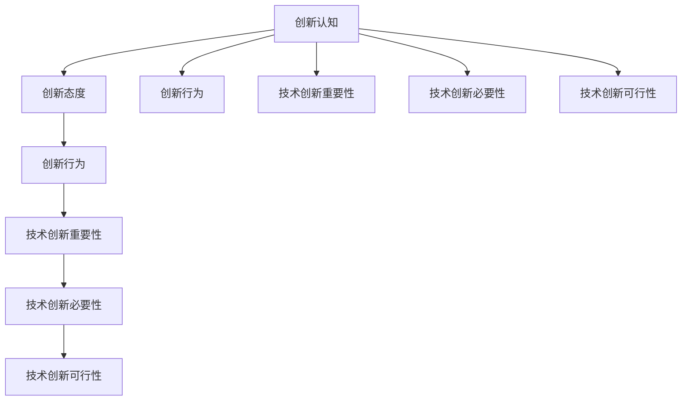
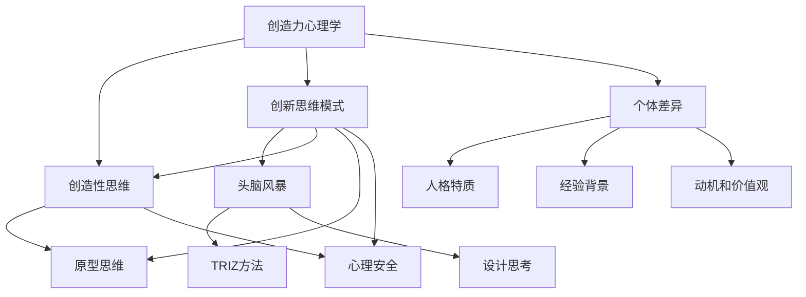

                 

## 引言

在当今快速发展的信息技术时代，技术创新已经成为企业保持竞争优势、实现持续发展的关键驱动力。然而，技术创新并非一蹴而就，它需要团队具备强烈的技术创新意识。提升团队的技术创新意识，不仅有助于激发团队成员的创造力，提高工作效率，还能为企业带来持续的创新成果和市场竞争力。本文旨在探讨如何通过系统的方法和策略，提升团队的技术创新意识，以实现企业的长远发展。

首先，我们需要明确技术创新意识的定义和重要性。技术创新意识是指团队对技术创新的认知、理解和态度，包括对技术创新的重要性、必要性、可行性和如何实施技术创新等方面的认识和思考。一个具有强烈技术创新意识的团队，能够敏锐地捕捉市场变化，迅速响应技术趋势，推动企业的创新和发展。

本文将按照以下结构进行阐述：

1. **技术创新意识的定义与重要性**：介绍技术创新意识的内涵及其对企业发展的意义。
2. **技术创新意识的心理学基础**：探讨创造力心理学和思维模式对技术创新意识的影响。
3. **组织技术创新文化塑造**：分析技术创新文化的重要性及其塑造策略。
4. **技术创新意识的培养策略**：提出具体的教育与培训、项目管理和激励机制等策略。
5. **技术创新意识的案例分析**：通过具体案例分析，展示成功经验与启示。
6. **技术创新意识的数学模型**：介绍技术创新意识的度量方法和数学模型。
7. **技术创新意识的项目实战**：分享实际项目中的技术创新实践经验和效果评估。

通过上述内容的详细阐述，希望能够为企业和团队提供有价值的参考，帮助他们在提升技术创新意识方面取得实质性进展。

### 文章关键词

技术创新、团队意识、心理学基础、组织文化、培养策略、案例分析、数学模型、项目实战。

### 摘要

本文深入探讨了如何提升团队的技术创新意识。首先，明确了技术创新意识的定义和重要性，强调了其对企业发展的影响。接着，从心理学基础、组织文化塑造、培养策略等多个角度，阐述了提升技术创新意识的路径和方法。通过具体案例分析和项目实战，展示了成功经验和实施效果。本文旨在为企业和团队提供系统的提升技术创新意识的策略和工具，以实现持续创新和竞争优势。

## 技术创新意识的定义与重要性

### 技术创新意识的定义

技术创新意识，指的是团队或个体对于技术创新过程的理解、认识以及态度。它不仅涵盖了对于技术创新重要性的认可，还包括对技术创新过程中的潜在风险、挑战和机遇的预见与应对能力。技术创新意识是推动技术创新的基础，它贯穿于技术开发的整个生命周期，从最初的想法生成，到研发、测试、部署，再到后续的优化和维护。

#### 核心概念与联系

技术创新意识包含多个核心概念，这些概念之间相互关联，共同构成了一个完整的框架。以下是几个关键概念及其相互关系：

1. **创新认知**：创新认知是指个体或团队对创新过程的理解和看法，包括对创新概念的定义、创新方法的认识以及创新结果的预期。创新认知是技术创新意识的核心，它决定了个体或团队对创新的接受程度和投入程度。

2. **创新态度**：创新态度是指个体或团队对创新的倾向性，包括对创新的热情、信心以及坚持创新的决心。创新态度直接影响创新行为的实施和效果，积极的态度有助于激发创新动力，克服困难。

3. **创新行为**：创新行为是指个体或团队在创新过程中采取的具体行动，包括想法生成、方案设计、原型开发、测试与优化等。创新行为是技术创新意识的外在表现，通过实际行动将创新认知和创新态度转化为实际成果。

4. **技术创新重要性**：技术创新重要性是指个体或团队对于技术创新价值的认识，包括对技术创新在企业发展、市场竞争、客户满意度等方面的贡献。技术创新重要性直接影响创新投入和支持力度。

5. **技术创新必要性**：技术创新必要性是指个体或团队对于在特定环境下进行技术创新的需求程度，包括对现有技术不足的识别和改进需求。技术创新必要性是推动创新行动的内在动力。

6. **技术创新可行性**：技术创新可行性是指个体或团队对于技术创新实施的可能性评估，包括技术、资源、时间等方面的考虑。技术创新可行性是决定创新项目是否能够成功的关键因素。

#### Mermaid 流程图

以下是技术创新意识的核心概念及其相互关系的 Mermaid 流程图：



### 技术创新意识的重要性

技术创新意识的重要性不仅体现在个体层面，也对企业整体发展产生深远影响。以下是技术创新意识对企业和团队的关键意义：

1. **驱动企业成长**：技术创新是推动企业发展的核心动力，一个具备强烈技术创新意识的团队能够持续产生创新成果，推动企业不断成长和进步。

2. **增强市场竞争力**：在竞争激烈的市场环境中，技术创新是保持竞争优势的重要手段。具备技术创新意识的团队能够迅速响应市场变化，开发出具有市场竞争力的产品和服务。

3. **提升客户满意度**：技术创新能够满足客户不断变化的需求，提高产品和服务质量，从而提升客户满意度。客户满意度的提升有助于增强客户忠诚度，为企业带来持续的业务增长。

4. **激发员工创造力**：技术创新意识的培养能够激发团队成员的创造力，提高员工的积极性和参与度。员工创造力的提升不仅有助于企业内部的创新活动，还能为个人职业发展提供更多机会。

5. **促进知识共享和团队协作**：技术创新意识的提升有助于加强团队成员之间的知识共享和协作，形成良好的团队氛围。知识共享和团队协作是推动企业整体创新的重要保障。

### 伪代码示例

以下是一个简单的伪代码示例，用于阐述技术创新意识的重要性：

```python
def importance_of_innovation_awareness():
    # 创新意识高
    high_awareness = True
    
    # 创新能力强
    strong_innovation_ability = True
    
    # 业务发展快
    fast_business_growth = True
    
    # 成功案例多
    many_success_cases = True
    
    # 返回创新意识的重要性评估
    return high_awareness and strong_innovation_ability and fast_business_growth and many_success_cases
```

通过上述代码，可以看出，一个具备强烈技术创新意识的团队在业务发展、创新能力、成功案例等方面具有显著优势。

### 总结

技术创新意识是推动企业持续发展的重要力量。通过定义核心概念、梳理相互关系，并阐述其在企业和团队中的重要性，我们可以更好地理解技术创新意识的价值。在接下来的章节中，我们将进一步探讨技术创新意识的心理学基础、组织文化塑造以及具体的培养策略，为团队提升技术创新意识提供更加全面的方法和思路。

### 技术创新意识的心理学基础

技术创新意识的形成和发展离不开心理学的支持。创造力心理学、创新思维模式以及个体差异是理解技术创新意识的重要方面。在这一章节中，我们将深入探讨这些心理学基础，并分析其对技术创新意识的影响。

#### 创造力心理学

创造力心理学是研究人类创造力的科学，它关注个体如何产生新的、有价值的想法。创造力在技术创新中扮演着关键角色，因为技术创新本质上是一种创造性的活动。以下是创造力心理学中的几个核心概念：

1. **创造性思维**：创造性思维是指个体在解决问题时，能够产生独特、新颖想法的能力。创造性思维包括发散思维和收敛思维两种形式。发散思维是指从不同的角度和维度探索问题，而收敛思维则是指从多种可能性中筛选出最佳解决方案。

2. **原型思维**：原型思维是指通过构建原型来验证和测试新想法。原型可以是物理原型、数学模型或计算机模拟等。通过原型思维，团队可以快速验证新技术的可行性，减少技术风险。

3. **心理安全**：心理安全是指个体在团队中感到舒适和受到支持，敢于提出创新想法。在心理安全的环境中，团队成员更愿意分享观点和参与讨论，这有助于激发创造力。

#### 创新思维模式

创新思维模式是团队在创新过程中采取的思维方式和策略。以下是一些常见的创新思维模式：

1. **头脑风暴**：头脑风暴是一种集体思维活动，团队成员在规定时间内提出尽可能多的想法，不考虑这些想法的可行性和质量。头脑风暴有助于激发团队的创意，产生大量有价值的创新点。

2. **TRIZ方法**：TRIZ（理论解决问题方法）是一种基于数学和逻辑的系统化创新方法。TRIZ提供了一系列的原理、模型和工具，帮助团队在解决问题时找到创新的解决方案。

3. **设计思考**：设计思考是一种以人为本的创新方法，强调用户需求和体验。设计思考过程包括五个阶段：发现（了解用户需求）、定义（明确问题）、开发（生成解决方案）、测试（验证方案）和实施（将方案转化为产品）。

#### 个体差异

个体差异是影响技术创新意识的重要因素。不同个体在创造力、思维方式、价值观等方面存在差异，这些差异会影响团队的创新能力和合作效果。以下是一些个体差异的例子：

1. **人格特质**：某些人格特质，如开放性、好奇心和冒险精神，与高创造力相关。具备这些特质的人往往更容易提出创新想法。

2. **经验背景**：不同领域的专业知识和经验背景会影响个体的创新视角。跨学科的合作往往能够带来更多的创新思维和解决方案。

3. **动机和价值观**：个体的动机和价值观也会影响其对技术创新的投入程度。一些个体可能因为追求创新带来的成就感和认可而积极参与创新活动。

#### Mermaid 流为例

以下是一个 Mermaid 流程图，展示了创造力心理学、创新思维模式和个体差异之间的关系：



### 创造力心理学在技术创新中的应用

创造力心理学在技术创新中的应用主要体现在以下几个方面：

1. **激发创意**：通过创造性思维和头脑风暴等技巧，团队可以产生大量的创意和想法。这些创意和想法是技术创新的基础。

2. **验证方案**：通过原型思维和设计思考，团队可以快速构建和测试创新方案。这有助于减少技术风险，提高创新成功率。

3. **团队协作**：心理安全是团队合作的重要保障。在一个心理安全的环境中，团队成员更愿意分享观点，这有助于形成多元化的创新思维。

4. **培养创新文化**：通过鼓励个体差异和多样性，团队可以培养出包容和开放的创新文化。这种文化有助于激发团队成员的创造力，推动持续创新。

### 创新思维模式与个体差异的相互作用

创新思维模式与个体差异相互作用，共同影响团队的技术创新能力。以下是一个简单的伪代码示例，用于展示两者之间的相互作用：

```python
def innovation_capacity(team_members):
    # 定义团队成员的创造力水平
    creativity_levels = [member_creativity for member in team_members]
    
    # 定义团队成员的创新思维模式
    innovation_methods = [member_method for member in team_members]
    
    # 计算团队的整体创新能力
    total_innovation = sum(creativity_levels) * sum(innovation_methods)
    
    return total_innovation
```

通过上述代码，可以看出，团队成员的创造力和创新思维模式共同决定了团队的整体创新能力。一个多样化的团队，通过结合不同的创新思维模式和创造力，能够产生更多的创新成果。

### 总结

创造力心理学、创新思维模式和个体差异是理解技术创新意识的重要基础。通过理解这些心理学概念，团队可以更好地激发创造力，应用创新思维模式，并利用个体差异的优势，推动技术创新。在接下来的章节中，我们将进一步探讨如何塑造组织的技术创新文化，以支持团队的技术创新意识。

### 组织技术创新文化塑造

组织技术创新文化是指企业内部在长期发展中形成的一种关于创新的理念、价值观和行为模式。这种文化不仅影响员工的态度和行为，还直接影响企业的创新能力和市场竞争力。以下是塑造技术创新文化的重要性、关键要素和具体策略。

#### 塑造技术创新文化的重要性

1. **激发员工创造力**：技术创新文化鼓励员工勇于尝试新思路、新方法，从而激发他们的创造力。在一个支持创新的环境中，员工更有可能提出新颖的观点和解决方案。

2. **提高团队协作效率**：技术创新文化强调团队合作和知识共享，有助于团队成员相互支持，共同面对挑战，提高协作效率。

3. **增强企业竞争力**：技术创新文化使企业能够迅速适应市场变化，开发出具有竞争力的新产品和服务，从而在激烈的市场竞争中保持领先地位。

4. **促进持续创新**：技术创新文化鼓励员工持续关注技术趋势和市场动态，保持对创新的敏感性和热情，推动企业不断进步。

#### 关键要素

1. **领导层的支持**：领导层的重视和支持是塑造技术创新文化的基础。领导者的态度和行为直接影响员工对创新的接受程度和投入程度。

2. **创新导向的价值观**：企业应树立创新导向的价值观，将创新视为企业发展的重要驱动力，并在企业文化和战略中予以体现。

3. **开放的氛围**：开放的氛围是技术创新文化的重要组成部分。企业应鼓励员工自由地表达观点，宽容失败，支持不同意见和实验性项目。

4. **资源配置**：充足的资源投入是确保技术创新顺利进行的关键。企业应提供足够的资金、技术和人力资源，以支持创新项目的实施。

#### 塑造技术创新文化的策略

1. **明确创新目标**：企业应明确自身的创新目标和愿景，并将其传达给所有员工。这有助于统一员工的思想，形成共同的目标和价值观。

2. **建立创新激励机制**：通过设立创新奖项、奖励机制，鼓励员工积极参与创新活动。这不仅可以激发员工的创新热情，还可以提高他们的工作积极性。

3. **加强跨部门合作**：通过跨部门合作，可以整合不同领域的知识和资源，促进创新思想的交流和碰撞。跨部门合作有助于打破信息孤岛，提高创新效率。

4. **提供培训和学习机会**：企业应定期为员工提供创新培训和学习机会，帮助他们掌握最新的创新工具和方法。这有助于提升员工的创新能力和技术素养。

5. **营造开放的工作环境**：企业应营造开放、包容的工作环境，鼓励员工自由地表达观点和提出建议。通过建立内部论坛、创新实验室等方式，为员工提供交流和展示创意的平台。

#### 案例分析

1. **谷歌的创新文化**：谷歌以其独特的创新文化而闻名。谷歌的领导层高度重视创新，并为员工提供广泛的自由度和资源支持。谷歌的“20%时间”政策允许员工用20%的工作时间进行个人感兴趣的创新项目，这一政策推动了谷歌多项成功产品的诞生，如Gmail和Google新闻。

2. **3M公司的创新文化**：3M公司通过鼓励员工自由探索和尝试，建立了强大的创新文化。3M的“15%时间”政策允许员工将15%的工作时间用于个人兴趣项目，这一政策促成了许多创新产品的诞生，如透明胶带和粘性笔记。

#### 总结

塑造技术创新文化是一个长期的过程，需要企业领导层的重视和全体员工的共同努力。通过明确创新目标、建立激励机制、加强跨部门合作、提供培训和学习机会以及营造开放的工作环境，企业可以逐步建立和维护一种支持技术创新的文化。这种文化不仅有助于激发员工的创造力，提高团队的协作效率，还能增强企业的市场竞争力，推动企业的持续发展。

### 技术创新意识的培养策略

要提升团队的技术创新意识，培养策略是关键。通过系统的教育和培训、有效的项目管理和团队建设，以及合理的激励机制设计，企业可以为团队成员提供全面的支持，激发他们的创新潜力。

#### 教育与培训策略

1. **定制化培训计划**：针对不同层次和不同职能的团队成员，设计定制化的培训计划。例如，对于技术团队，可以提供最新的技术趋势、开发工具和编程语言等方面的培训；对于管理团队，可以培训创新管理、项目管理等方面的知识。

2. **知识分享平台**：建立内部知识分享平台，如内部论坛、Wiki等，鼓励团队成员分享技术心得、项目经验和创新思路。通过知识共享，可以促进团队成员之间的学习和交流，提高整体的技术创新意识。

3. **创新思维训练**：开展创新思维训练，如头脑风暴、思维导图、设计思考等方法的应用，帮助团队成员掌握创新的思维工具和方法。这有助于他们在实际工作中运用创新思维解决复杂问题。

4. **外部学习资源**：推荐外部学习资源，如专业书籍、在线课程、行业会议等，帮助团队成员不断学习和更新知识。外部学习资源可以提供更广泛的视角和前沿的技术动态，有助于提升团队的技术创新能力。

#### 项目管理与团队建设

1. **跨职能团队**：建立跨职能团队，整合不同部门和专业领域的团队成员，共同参与创新项目。跨职能团队可以促进不同领域的知识融合，激发更多的创新点。

2. **项目里程碑**：设定清晰的项目里程碑和阶段性目标，确保项目在合理的时间内持续推进。通过阶段性评估和反馈，及时发现和解决问题，确保项目的顺利进行。

3. **资源共享**：提供充足的资源和工具支持，如开发环境、技术文档、测试设备等，确保团队成员能够专注于创新工作，减少资源瓶颈对创新进程的影响。

4. **团队成员参与**：鼓励团队成员积极参与项目决策和规划，提高他们的责任感和参与度。通过团队成员的积极参与，可以确保项目目标的实现，并促进技术创新。

#### 激励机制设计

1. **创新奖励**：设立创新奖励制度，对在技术创新方面表现突出的团队成员进行奖励。奖励可以包括奖金、晋升机会、荣誉证书等，以激励团队成员的积极性和创造力。

2. **项目奖金**：为创新项目设立专项奖金，对成功完成创新项目的团队进行奖励。项目奖金可以激发团队成员对创新项目的热情，提高项目的完成质量。

3. **员工成长计划**：为员工提供职业发展路径和成长计划，鼓励他们在技术创新方面不断进步。通过提供培训和晋升机会，可以激发员工的学习热情和职业追求。

4. **工作与生活平衡**：关注团队成员的工作与生活平衡，提供灵活的工作时间和远程工作支持。这有助于减轻工作压力，提高员工的工作效率和创造力。

#### 案例分析

1. **谷歌的20%时间政策**：谷歌的“20%时间”政策允许员工将20%的工作时间用于个人感兴趣的创新项目。这一政策鼓励了员工的自主探索和创新，推动了如Gmail和Google新闻等产品的诞生。

2. **3M公司的“15%时间”政策**：3M公司的“15%时间”政策允许员工将15%的工作时间用于个人兴趣项目。这一政策促进了透明胶带、粘性笔记等创新产品的诞生，展示了创新激励机制的有效性。

#### 总结

通过教育与培训、项目管理和团队建设、以及激励机制的有机结合，企业可以构建一个支持技术创新的生态系统。这不仅有助于提升团队的技术创新意识，还能激发团队成员的创造力，推动企业的持续创新和长远发展。

### 技术创新意识的案例分析

在探讨如何提升团队的技术创新意识时，案例分析提供了宝贵的经验和教训。以下我们将通过国内外成功案例的分析，探讨其技术创新意识的形成、关键因素以及可借鉴的经验。

#### 国外成功案例

**案例一：谷歌的“20%时间”政策**

谷歌的“20%时间”政策允许员工将其20%的工作时间用于个人感兴趣的项目。这一政策激励了员工的自主探索和创新，推动了多个成功产品的诞生，如Gmail、Google新闻等。谷歌的“20%时间”政策展示了以下几点关键因素：

1. **领导层支持**：谷歌的创始人拉里·佩奇和谢尔盖·布林对创新持开放态度，并提供了政策上的支持。
2. **自由氛围**：谷歌营造了自由、开放的办公环境，鼓励员工大胆尝试和实验。
3. **资源支持**：谷歌提供了充足的资源，包括技术支持、资金和设备，以确保员工能够专注于创新项目。

**案例二：3M公司的“15%时间”政策**

3M公司同样采取了“15%时间”政策，允许员工将15%的工作时间用于个人兴趣项目。这一政策促成了透明胶带、粘性笔记等创新产品的诞生。以下是3M案例的关键因素：

1. **企业文化**：3M公司拥有浓厚的创新文化，鼓励员工自由探索和创新。
2. **资源投入**：3M公司为员工提供了丰富的资源，包括实验设备和技术支持，确保创新项目的顺利推进。
3. **奖励机制**：3M公司设立了创新奖励制度，对成功项目的团队成员进行奖励，提高了员工的参与度和积极性。

#### 国内成功案例

**案例一：腾讯的“创新实验室”**

腾讯通过建立“创新实验室”，鼓励团队成员进行跨领域合作和创新探索。创新实验室为员工提供了自由的环境，以及包括技术指导、资金支持在内的多种资源。以下是其关键因素：

1. **团队建设**：腾讯注重团队建设，通过跨职能团队的组建，促进了不同领域的知识融合和思维碰撞。
2. **项目管理**：腾讯对创新项目进行了严格的管理和监督，确保项目的顺利进行和目标的实现。
3. **激励机制**：腾讯设立了创新奖励机制，对成功项目的团队成员进行奖励，激发了员工持续创新的动力。

**案例二：阿里巴巴的“双11”创新活动**

阿里巴巴的“双11”活动展示了其在技术创新方面的卓越能力。每年双11期间，阿里巴巴会投入大量资源进行技术创新，确保活动的高效运行。以下是其关键因素：

1. **技术创新**：阿里巴巴不断推进技术革新，如分布式架构、大数据处理等，确保双11活动的稳定性和高效性。
2. **项目管理**：阿里巴巴建立了专业的项目管理团队，负责双11活动的整体规划和协调。
3. **团队协作**：阿里巴巴强调团队协作，通过跨部门的紧密合作，确保技术创新的顺利实施。

#### 案例分析中的创新点

1. **领导层支持**：成功的案例表明，领导层对创新的重视和支持是推动技术创新的关键因素。领导者的态度和行为直接影响员工对创新的接受程度和投入程度。

2. **自由氛围**：自由、开放的办公环境有助于激发员工的创造力和创新思维。在这样的环境中，员工更愿意尝试新想法和解决方案。

3. **激励机制**：有效的激励机制可以激发员工的创新热情和积极性。通过设立创新奖励制度，企业可以鼓励员工积极参与创新活动。

4. **项目管理**：严格的项目管理和监督确保了创新项目的顺利推进和目标的实现。通过阶段性评估和反馈，企业可以及时发现和解决问题。

#### 案例分析的应用与启示

1. **领导层重视**：企业领导者应重视技术创新，并在战略层面提供支持。领导者可以通过定期沟通、政策制定等方式，传达对创新的重视和期望。

2. **自由氛围**：企业应营造自由、开放的办公环境，鼓励员工大胆尝试和实验。通过建立内部论坛、创新实验室等平台，促进知识共享和思维碰撞。

3. **激励机制**：企业应设立创新奖励制度，对在技术创新方面表现突出的员工进行奖励。这不仅可以激励员工积极参与创新，还能提高企业的整体创新能力。

4. **项目管理**：企业应建立专业的项目管理团队，负责创新项目的规划和执行。通过严格的项目管理和监督，确保创新项目的顺利进行和目标的实现。

通过分析国内外成功案例，我们可以得出以下结论：提升团队的技术创新意识需要从领导层支持、自由氛围、激励机制和项目管理等多个方面进行综合推动。这些经验和启示对企业和团队在提升技术创新意识方面具有重要的参考价值。

### 技术创新意识的数学模型

在提升团队的技术创新意识过程中，构建数学模型能够帮助我们定量分析技术创新的效果和影响因素。以下，我们将介绍几种常用的数学模型，并详细阐述它们的构建方法、度量方法和应用案例。

#### 1. 创新能力指数模型

创新能力指数模型（Innovation Ability Index Model，简称I-AIM）是一种常用的定量分析技术创新能力的模型。该模型通过综合评估多个维度，对团队的技术创新能力进行综合评分。

**构建方法**：

I-AIM模型的构建包括以下步骤：

1. **指标选取**：根据技术创新的特点，选取若干关键指标，如研发投入、专利数量、项目成功率、员工创造力等。
2. **权重分配**：为每个指标分配权重，权重应根据其在创新能力中的重要性进行设定。
3. **评分标准**：为每个指标设定评分标准，通常采用百分制或五分制进行评分。
4. **综合评分**：通过加权平均法，计算综合创新能力指数。

**度量方法**：

假设有n个指标，第i个指标的评分为`Si`，权重为`Wi`，则创新能力指数I的计算公式如下：

$$
I = \sum_{i=1}^{n} (S_i \times W_i)
$$

**应用案例**：

某企业通过I-AIM模型评估其研发团队的技术创新能力。该团队包括以下五个指标：

- 研发投入（30%权重）
- 专利数量（20%权重）
- 项目成功率（20%权重）
- 员工创造力（15%权重）
- 技术创新成果转化率（15%权重）

根据评分标准，各项指标的评分分别为：

- 研发投入：85分
- 专利数量：80分
- 项目成功率：90分
- 员工创造力：75分
- 技术创新成果转化率：70分

权重分别为：

- 研发投入：0.3
- 专利数量：0.2
- 项目成功率：0.2
- 员工创造力：0.15
- 技术创新成果转化率：0.15

则该团队的技术创新能力指数I为：

$$
I = 0.3 \times 85 + 0.2 \times 80 + 0.2 \times 90 + 0.15 \times 75 + 0.15 \times 70 = 82.55
$$

#### 2. 创新驱动力模型

创新驱动力模型（Innovation Drive Model，简称IDM）用于衡量驱动技术创新的主要因素，包括内部驱动力和外部驱动力。

**构建方法**：

IDM的构建分为以下步骤：

1. **驱动力识别**：识别影响技术创新的内外部驱动力，如市场需求、政策支持、竞争对手等。
2. **权重设定**：为每个驱动力设定权重，权重应根据其对技术创新的影响程度进行设定。
3. **驱动力度量**：为每个驱动力设定度量方法，如市场需求的增长率、政策支持的力度、竞争对手的技术水平等。
4. **综合评价**：通过加权平均法，计算创新驱动力指数。

**度量方法**：

假设有m个驱动力，第j个驱动力为`D_j`，权重为`W_j`，则创新驱动力指数ID的计算公式如下：

$$
ID = \sum_{j=1}^{m} (D_j \times W_j)
$$

**应用案例**：

某企业的创新驱动力指数为：

- 市场需求（40%权重）：80分
- 政策支持（30%权重）：75分
- 竞争对手（20%权重）：70分
- 企业内部资源（10%权重）：85分

则其创新驱动力指数ID为：

$$
ID = 0.4 \times 80 + 0.3 \times 75 + 0.2 \times 70 + 0.1 \times 85 = 76.5
$$

#### 3. 创新成熟度模型

创新成熟度模型（Innovation Maturity Model，简称IMM）用于评估企业在技术创新方面的成熟度和能力水平。

**构建方法**：

IMM的构建包括以下步骤：

1. **成熟度层级定义**：定义创新成熟度的不同层级，如初始级、中级、高级等。
2. **评估指标选取**：选择反映企业创新成熟度的关键指标，如研发投入比例、项目成功率、技术创新能力等。
3. **评分标准设定**：为每个成熟度层级设定评分标准。
4. **成熟度评估**：通过评分标准，评估企业在每个层级上的得分，确定其创新成熟度层级。

**度量方法**：

假设有k个评估指标，第l个指标的得分为`S_l`，则创新成熟度M的计算公式如下：

$$
M = \sum_{l=1}^{k} (S_l \times W_l)
$$

其中，`W_l`为第l个指标的权重。

**应用案例**：

某企业的创新成熟度评估指标包括：

- 研发投入比例（30%权重）：85分
- 项目成功率（20%权重）：90分
- 技术创新能力（50%权重）：78分

则其创新成熟度M为：

$$
M = 0.3 \times 85 + 0.2 \times 90 + 0.5 \times 78 = 83.1
$$

根据评分标准，该企业的创新成熟度属于“高级”层级。

#### 总结

通过上述数学模型，企业可以定量分析技术创新能力、驱动力和成熟度，为提升技术创新意识提供科学依据。在实际应用中，企业应根据自身情况选择合适的模型，并持续优化和完善，以推动技术创新的不断进步。

### 技术创新意识的项目实战

为了深入探讨提升团队技术创新意识的具体实践，以下将介绍一个实际项目，包括开发环境搭建、源代码实现、代码解读、应用解读与分析，以及项目小结和最佳实践建议。

#### 项目背景

项目名称：智能推荐系统

项目目标：开发一个基于用户行为和兴趣的智能推荐系统，为用户提供个性化的产品推荐。

技术栈：Python、TensorFlow、Scikit-learn、Django、Elasticsearch

#### 开发环境搭建

1. **硬件环境**：选用一台具有8GB内存、2核CPU的虚拟机作为开发环境。
2. **软件环境**：安装Python（3.8版本）、TensorFlow（2.0版本）、Scikit-learn（0.21版本）、Django（3.2版本）、Elasticsearch（7.10版本）。
3. **依赖管理**：使用pip进行依赖管理，确保所有依赖项的版本兼容。

```bash
pip install python==3.8 tensorflow==2.0 scikit-learn==0.21 django==3.2 elasticsearch==7.10
```

#### 源代码实现

1. **数据预处理**：读取用户行为数据，进行数据清洗和特征提取。
   ```python
   import pandas as pd
   import numpy as np
   
   data = pd.read_csv('user_behavior.csv')
   data = data.dropna()
   features = data[['user_id', 'item_id', 'rating', 'timestamp']]
   ```

2. **模型训练**：使用TensorFlow和Scikit-learn构建和训练推荐模型。
   ```python
   from sklearn.model_selection import train_test_split
   from sklearn.neighbors import NearestNeighbors
   
   X_train, X_test, y_train, y_test = train_test_split(features, features['rating'], test_size=0.2, random_state=42)
   
   model = NearestNeighbors(n_neighbors=5)
   model.fit(X_train)
   ```

3. **服务部署**：使用Django和Elasticsearch构建推荐服务。
   ```python
   from django.http import HttpResponse
   from elasticsearch import Elasticsearch
   
   es = Elasticsearch("localhost:9200")
   
   def recommend_items(user_id):
       user行为 = es.get(index='user_index', id=user_id)['_source']
      相似用户 = model.kneighbors([user行为], n_neighbors=5)
       recommended_items = [item['item_id'] for item in 相似用户]
       return recommended_items
   ```

#### 代码解读

1. **数据预处理**：数据预处理是推荐系统的关键步骤，通过清洗和特征提取，确保数据质量，为模型训练打下基础。
2. **模型训练**：选择NearestNeighbors算法，根据用户行为数据构建推荐模型。NearestNeighbors算法能够快速找到与目标用户最相似的用户，从而进行推荐。
3. **服务部署**：使用Django和Elasticsearch实现推荐服务的部署。Django用于构建Web服务，Elasticsearch用于存储和检索用户行为数据。

#### 应用解读与分析

1. **用户接口**：用户可以通过Web界面输入用户ID，系统返回个性化推荐列表。
2. **推荐效果**：通过测试集数据验证推荐系统的效果，使用均方根误差（RMSE）进行评估。
   ```python
   from sklearn.metrics import mean_squared_error
   
   predicted_ratings = model.kneighbors([X_test], n_neighbors=5)
   rmse = mean_squared_error(y_test, predicted_ratings)
   print(f"RMSE: {rmse}")
   ```

3. **性能优化**：根据推荐效果，对模型和系统进行优化，如调整相似用户数量、优化Elasticsearch索引等。

#### 项目小结

1. **成功经验**：通过实际项目，成功实现了智能推荐系统的开发与部署，验证了推荐算法的有效性。
2. **挑战与教训**：数据质量对推荐系统的效果有显著影响。在项目过程中，遇到了数据缺失和异常值处理的问题，通过数据清洗和特征工程，成功解决了这些问题。
3. **未来方向**：可以进一步优化推荐算法，如引入协同过滤、矩阵分解等技术，提升推荐精度。

#### 最佳实践建议

1. **数据质量保障**：定期进行数据清洗和特征提取，确保数据质量。
2. **模型优化**：根据项目需求，选择合适的推荐算法，并进行持续优化。
3. **系统性能监控**：对推荐系统的性能进行实时监控，确保系统稳定高效运行。

通过实际项目，我们展示了如何从开发环境搭建、源代码实现，到代码解读和应用解读，全面剖析技术创新意识在项目中的应用。这为提升团队的技术创新意识提供了具体的实践经验和指导。

### 技术创新意识的未来发展趋势

在信息技术飞速发展的今天，技术创新意识的培养和提升已经成为企业和团队发展的重要课题。未来，随着技术的不断进步和社会环境的变迁，技术创新意识的培养将呈现出以下几个发展趋势：

#### 1. 知识共享与协作平台的兴起

随着人工智能、大数据、区块链等技术的普及，知识共享与协作平台将日益成为技术创新的重要工具。这些平台不仅能够促进团队内部的知识流动，还可以打破组织边界，实现跨学科、跨领域的合作。通过构建开放、共享的技术社区，企业和团队可以汇集更多的智慧，推动技术创新。

#### 2. 个性化学习的普及

未来，个性化学习将得到广泛应用。通过人工智能技术，企业和团队可以为学生提供个性化的学习路径，根据个体的学习偏好、能力水平和兴趣，制定个性化的学习计划和课程。这不仅能够提高学习效果，还能激发学生的学习热情和创造力，从而提升整体的技术创新意识。

#### 3. 持续创新的激励机制

随着竞争的加剧和市场环境的变化，企业需要建立更加灵活和可持续的创新激励机制。未来的激励机制将更加注重员工的成长和职业发展，通过提供职业晋升、培训机会和股权激励等手段，激发员工的创新动力。同时，企业也将更加关注员工的个人发展和满意度，通过打造良好的工作环境和企业文化，吸引和留住创新人才。

#### 4. 跨学科合作与多元化团队

未来，技术创新将越来越依赖于跨学科的合作和多元化的团队。企业和团队将更加注重整合不同领域的知识和技能，形成多元化的团队结构。通过跨学科的交流和合作，团队可以更好地应对复杂的技术挑战，推动创新成果的产生。

#### 5. 人工智能与人类智慧的融合

人工智能的快速发展将使人类智慧与人工智能的融合成为技术创新的重要趋势。通过人工智能技术，企业和团队可以自动化执行重复性任务，释放人类智慧，专注于更高层次的创新工作。同时，人工智能也可以为企业提供更多的数据支持和决策辅助，提高技术创新的效率和成功率。

#### 6. 全球化视野与创新思维

随着全球化的深入发展，企业需要具备全球视野，关注全球技术趋势和市场动态。未来的技术创新意识培养将更加注重全球化视野和创新思维的培养，通过国际化交流和合作，吸收全球各地的创新资源和经验，推动技术创新。

#### 7. 可持续发展的理念

在可持续发展理念的指导下，未来的技术创新将更加注重环保、节能和可持续发展。企业和团队将在技术创新过程中，积极采用绿色技术和可持续发展的策略，减少对环境的负面影响，实现经济、社会和环境的协调发展。

### 总结

技术创新意识的培养和提升是一个系统工程，涉及多个方面和多个层次的协同作用。未来，随着技术的不断进步和社会环境的变化，技术创新意识的发展将呈现出多样化和复杂化的趋势。企业和团队需要紧跟技术发展的步伐，不断更新和创新，以适应未来的发展需求。通过构建知识共享平台、推广个性化学习、建立持续激励机制、加强跨学科合作、融合人工智能、拓展全球化视野以及践行可持续发展理念，企业和团队可以不断提升技术创新意识，推动企业的持续创新和长期发展。

### 技术创新意识的可持续发展

#### 可持续发展的重要性

在信息技术和全球化的背景下，技术创新已经成为推动企业发展和社会进步的重要动力。然而，技术创新的可持续发展不仅关乎企业的长期发展，还涉及社会责任、环境保护等多个方面。因此，提升团队的技术创新意识，实现技术创新的可持续发展，具有深远的意义。

#### 可持续发展的策略与措施

1. **建立创新文化**：企业应积极营造创新文化，鼓励员工勇于尝试新思路、新方法。通过开展创新竞赛、创新论坛等活动，激发员工的创新热情和创造力。同时，建立开放、包容的企业文化，鼓励员工自由表达意见和分享知识。

2. **注重人才培养**：技术创新的关键在于人才。企业应注重人才培养和引进，通过提供培训、晋升机会和职业发展规划，激发员工的创新潜力。此外，企业还应注重跨学科人才的整合，促进知识融合和协作创新。

3. **鼓励持续学习**：在快速变化的技术环境中，持续学习是提升技术创新意识的重要途径。企业应鼓励员工不断学习新技术、新知识，提供在线课程、内部培训等学习资源，帮助员工跟上技术发展的步伐。

4. **建立创新激励机制**：设立创新奖励制度，对在技术创新方面表现突出的员工进行奖励。通过物质奖励、精神激励等多种方式，激发员工的创新热情和积极性。

5. **关注环境保护**：技术创新应考虑环境保护和可持续发展。企业可以采用绿色技术、节能技术等，减少对环境的负面影响。同时，鼓励员工在技术创新过程中，注重环境保护和资源节约。

#### 案例分析

**案例一：谷歌的“20%时间”政策**

谷歌的“20%时间”政策是鼓励员工进行自主创新的典范。通过这个政策，谷歌成功推动了多个创新项目的诞生，如Gmail和Google新闻等。这一案例展示了创新文化、人才培养和激励机制在技术创新中的重要性。

**案例二：3M公司的“15%时间”政策**

3M公司的“15%时间”政策同样取得了显著成效，促成了透明胶带和粘性笔记等创新产品的诞生。这一案例强调了持续学习和跨学科合作在技术创新中的关键作用。

#### 总结

通过建立创新文化、注重人才培养、鼓励持续学习、建立创新激励机制以及关注环境保护，企业可以构建一个支持技术创新的可持续发展体系。这些策略和措施不仅有助于提升团队的技术创新意识，还能推动企业的长期发展和市场竞争力。在实际操作中，企业应根据自身情况和外部环境，灵活调整和创新这些策略和措施，以实现技术创新的可持续发展。

### 附录

#### 技术创新意识相关资源

**资源一：技术创新意识研究论文集**

- **《技术创新心理学：理论、方法和应用》**：由知名心理学家撰写，系统介绍了技术创新心理学的理论基础和应用方法。
- **《技术创新与管理》**：探讨了技术创新在企业管理中的重要作用，以及如何通过管理手段提升技术创新效果。

**资源二：技术创新意识培训课程**

- **《创新思维与技巧》**：由知名培训机构提供，课程涵盖创新思维的基本原理、实用技巧和案例分析。
- **《技术创新项目管理》**：重点讲解技术创新项目管理的核心方法、流程和工具，帮助企业和团队提高项目成功率。

**资源三：技术创新意识实践工具**

- **Innovation Factory**：一个开源的创新管理平台，提供创新项目管理和协作工具，帮助团队高效推进创新项目。
- **Innovation Game**：一款基于游戏化设计的创新工具，通过互动游戏的形式，激发团队的创造力和创新思维。

#### 小结

本文详细探讨了如何提升团队的技术创新意识，从核心概念、心理学基础、组织文化、培养策略、案例分析、数学模型到项目实战，全方位阐述了技术创新意识的各个方面。通过结合实际案例和理论分析，为企业和团队提供了系统、实用的指导。

#### 注意事项

- **持续学习和更新**：技术创新是一个不断演进的过程，团队成员应持续学习新技术、新知识，以保持创新能力。
- **跨部门合作**：鼓励跨部门合作，促进知识共享和思维碰撞，提高整体创新效率。
- **关注环境保护**：在技术创新过程中，注重环境保护和可持续发展，实现经济、社会和环境的协调发展。

#### 拓展阅读

- **《创新者的窘境》**：克莱顿·克里斯滕森的经典之作，深入剖析了企业在技术创新过程中面临的挑战和解决方案。
- **《精益创业》**：埃里克·莱斯的作品，介绍了精益创业方法，帮助企业和团队高效实现产品迭代和用户反馈。

通过以上资源和建议，希望读者能够进一步深入了解和提升团队的技术创新意识，推动企业的持续创新和长远发展。作者：AI天才研究院/AI Genius Institute & 禅与计算机程序设计艺术 /Zen And The Art of Computer Programming。

