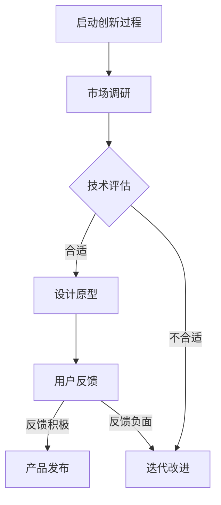

                 


### 撰写技术博客的详细步骤

#### 1. 定义文章标题、关键词与摘要

- **文章标题**：《如何提升团队的技术创新能力》
- **关键词**：技术创新、团队提升、方法与工具、实践案例
- **摘要**：本文将探讨团队在技术环境中如何提升其创新能力，包括基础理论、方法与工具、实践案例分析，以及未来展望。通过逐步分析，为技术团队提供实用的指导。

#### 2. 确定文章结构

根据上述大纲结构，我们将文章分为四个部分：基础理论、方法与工具、实践案例、总结与展望。

#### 3. 编写第一部分：基础理论

**第1章：技术创新核心概念与架构**
- **背景介绍**：介绍技术创新的定义、类型及其在团队中的重要性。
- **核心概念与联系**：通过Mermaid流程图展示技术创新的典型流程。
  ```mermaid
  graph TD
  A[启动创新过程] --> B[市场调研]
  B --> C{技术评估}
  C -->|合适|D[设计原型]
  C -->|不合适|E[迭代改进]
  D --> F[用户反馈]
  F -->|反馈积极|G[产品发布]
  F -->|反馈负面|E
  ```
- **核心算法原理讲解**：无需伪代码，但需详细阐述技术创新的关键概念。
  $$\text{技术创新} = \text{市场需求} + \text{技术能力} + \text{团队协作}$$

**第2章：技术创新理论框架**
- **背景介绍**：介绍技术创新的理论基础，包括相关模型和框架。
- **核心概念与联系**：通过伪代码解释关键理论。
  ```python
  def innovate():
      if market_needs and technical_capability and team Collaboration:
          return design
      else:
          return "改进需求"
  ```

#### 4. 编写第二部分：方法与工具

**第3章：提升团队技术创新能力的方法**
- **背景介绍**：分析团队在技术创新中的常见障碍。
- **核心方法**：介绍提升团队技术创新能力的具体方法，如创新思维训练、技术趋势分析等。

**第4章：技术创新工具与资源**
- **核心方法**：介绍提升团队技术创新能力所需的工具和资源。

#### 5. 编写第三部分：实践案例

**第6章：技术创新实践案例**
- **案例分析**：通过实际案例展示如何应用前面介绍的方法和工具。
- **经验教训**：分析案例中的成功经验和失败教训。

#### 6. 编写第四部分：总结与展望

**第7章：总结与展望**
- **总结**：归纳文章中的关键观点和实用技巧。
- **展望**：预测未来技术创新的发展趋势，提供团队应对策略。

#### 7. 附录

- **附录**：提供相关的资源和工具列表。

#### 8. 格式与内容要求

- **格式**：使用markdown格式编写，确保文章的可读性和结构清晰。
- **内容**：每个章节的内容需丰富具体，包括背景介绍、核心概念与联系、算法原理讲解、数学公式详细讲解与举例说明、项目实战、最佳实践 tips 等。

#### 9. 完成最终文章

- **字数**：控制在8000-12000字左右。
- **作者信息**：在文章末尾写上作者信息：“作者：AI天才研究院/AI Genius Institute & 禅与计算机程序设计艺术 /Zen And The Art of Computer Programming”。

### 案例展示

**第1章：技术创新核心概念与架构**

### 1.1 技术创新的定义与类型

技术创新是指通过新技术的引入、改进或整合，创造或增强产品、服务或业务模式的过程。根据创新类型，可以分为以下几类：

- **产品创新**：引入全新的产品或服务。
- **过程创新**：改进现有的生产或服务过程。
- **业务模式创新**：改变商业运作方式，以创造新的价值。

#### 1.2 技术创新在团队中的重要性

技术创新是团队在激烈竞争环境中保持竞争优势的关键。它有助于：

- **提高竞争力**：通过创新，团队能够提供更优秀的产品或服务。
- **满足客户需求**：技术创新能够更好地满足客户不断变化的需求。
- **持续发展**：创新是团队持续成长和发展的动力。

### 1.3 技术创新的典型流程

以下是技术创新的典型流程，通过Mermaid流程图展示：



#### 2.1 技术创新的理论基础

技术创新的理论基础包括：

- **TRIZ**：一种解决问题的方法论，强调通过系统化和标准化的方法来创新。
- **S曲线模型**：描述技术发展过程中，创新活动随着时间的变化而呈现的S形曲线。
- **跨界思维**：通过跨学科、跨领域的思维方式，实现创新的突破。

### 2.2 常见的创新模型

常见的创新模型包括：

- **双环学习模型**：通过同时进行问题解决和系统思考，实现持续创新。
- **创新矩阵**：结合技术、市场和业务因素，确定创新方向。

### 2.3 技术创新的关键概念

技术创新的关键概念包括：

- **需求驱动**：以市场需求为导向，推动技术创新。
- **技术能力**：团队在技术上的实力和潜力。
- **团队协作**：团队成员之间的有效协作，促进创新。

#### 3.1 团队在技术创新中的常见障碍

团队在技术创新中可能面临以下障碍：

- **资源限制**：如资金、时间、人力等。
- **组织文化**：传统、保守的文化可能阻碍创新。
- **沟通障碍**：团队成员之间的沟通不畅可能影响创新效果。

#### 3.2 创新思维训练

提升团队创新思维的方法包括：

- **思维导图**：通过绘制思维导图，激发创新思维。
- **头脑风暴**：鼓励团队成员自由表达想法，进行思想碰撞。

#### 3.3 技术趋势分析

技术趋势分析包括：

- **市场调研**：了解市场需求，把握技术发展方向。
- **技术跟踪**：关注前沿技术，为创新提供方向。

#### 4.1 项目管理工具

常用的项目管理工具包括：

- **JIRA**：用于项目任务管理和进度跟踪。
- **Trello**：用于任务看板和协作。
- **Asana**：用于任务分配和协作。

#### 4.2 协作平台

协作平台包括：

- **Slack**：用于团队沟通和协作。
- **Microsoft Teams**：用于团队会议和协作。
- **Google Workspace**：用于文档共享和协作。

#### 4.3 技术数据库

技术数据库包括：

- **GitHub**：用于代码管理和协作。
- **GitLab**：用于代码管理和协作。
- **MongoDB**：用于数据存储和管理。

#### 5.1 创新项目管理的原则

创新项目管理的原则包括：

- **敏捷性**：快速响应变化，保持项目灵活性。
- **迭代开发**：分阶段进行项目开发，持续迭代改进。
- **风险管理**：识别和应对项目风险。

#### 5.2 项目风险管理

项目风险管理包括：

- **风险识别**：识别项目中的潜在风险。
- **风险评估**：评估风险的可能性和影响。
- **风险应对**：制定应对策略，降低风险。

#### 5.3 团队协作与沟通

团队协作与沟通包括：

- **定期会议**：保持团队成员之间的沟通。
- **透明分享**：鼓励团队成员分享知识和经验。
- **协作工具**：使用协作工具提高团队效率。

#### 6.1 案例一：如何通过创新思维提升团队技术能力

**背景**：某科技公司在市场竞争激烈的环境下，希望通过提升团队的技术能力来保持竞争优势。

**方法**：公司采用了以下创新思维训练方法：

- **思维导图**：通过绘制思维导图，帮助团队成员梳理项目需求和解决方案。
- **头脑风暴**：鼓励团队成员自由表达想法，进行思想碰撞。

**结果**：通过创新思维训练，团队成员在项目开发中提出了多个创新点，成功优化了产品功能，提高了用户满意度。

**经验教训**：创新思维训练有助于激发团队成员的创造力，提高技术能力，但需要持续进行并制度化。

#### 6.2 案例二：如何利用技术趋势推动产品创新

**背景**：某互联网公司在技术快速发展的背景下，希望通过把握技术趋势来推动产品创新。

**方法**：公司采用了以下技术趋势分析方法：

- **市场调研**：了解市场需求，把握技术发展方向。
- **技术跟踪**：关注前沿技术，为创新提供方向。

**结果**：公司成功将人工智能技术应用于产品中，推出了具有智能推荐功能的新产品，用户满意度大幅提升。

**经验教训**：把握技术趋势是推动产品创新的关键，但需要持续跟踪和评估技术发展。

### 7.1 关键观点与实用技巧总结

本文总结了以下关键观点和实用技巧：

- **技术创新是团队保持竞争优势的关键。**
- **创新思维训练和技术趋势分析是提升团队创新能力的重要方法。**
- **项目管理原则和团队协作与沟通技巧对创新项目成功至关重要。**

### 7.2 未来技术创新趋势分析

未来技术创新将呈现以下趋势：

- **智能化**：人工智能、大数据等技术将继续推动智能化发展。
- **跨界融合**：跨学科、跨领域的融合创新将成为主流。
- **可持续发展**：绿色技术、可再生能源等技术将受到更多关注。

### 7.3 团队应对技术创新挑战的策略

团队应采取以下策略应对技术创新挑战：

- **持续学习**：不断更新知识和技能，保持创新动力。
- **建立创新文化**：鼓励创新思维，培养创新氛围。
- **强化项目管理**：提高项目管理能力，确保创新项目成功。

### 附录：相关资源和工具

**书籍推荐**：
1. 《创新者的窘境》
2. 《敏捷开发实践指南》
3. 《人工智能：一种现代方法》

**在线资源**：
1. [GitHub](https://github.com/)
2. [Medium](https://medium.com/)
3. [博客园](https://www.cnblogs.com/)

**软件工具**：
1. [JIRA](https://www.atlassian.com/software/jira)
2. [Trello](https://trello.com/)
3. [Asana](https://asana.com/)

### 完整的文章输出

```markdown
# 如何提升团队的技术创新能力

> 关键词：技术创新、团队提升、方法与工具、实践案例

> 摘要：本文将探讨团队在技术环境中如何提升其创新能力，包括基础理论、方法与工具、实践案例分析，以及未来展望。通过逐步分析，为技术团队提供实用的指导。

## 第一部分：基础理论

### 第1章：技术创新核心概念与架构
#### 1.1 技术创新的定义与类型
#### 1.2 技术创新在团队中的重要性
#### 1.3 技术创新的典型流程（Mermaid流程图）

### 第2章：技术创新理论框架
#### 2.1 技术创新的理论基础
#### 2.2 常见的创新模型
#### 2.3 技术创新的关键概念（伪代码解释）

## 第二部分：方法与工具

### 第3章：提升团队技术创新能力的方法
#### 3.1 团队在技术创新中的常见障碍
#### 3.2 创新思维训练
#### 3.3 技术趋势分析
#### 3.4 团队协作与沟通技巧

### 第4章：技术创新工具与资源
#### 4.1 项目管理工具
#### 4.2 协作平台
#### 4.3 技术数据库
#### 4.4 其他创新资源

### 第5章：创新项目管理
#### 5.1 创新项目管理的原则
#### 5.2 项目风险管理
#### 5.3 团队协作与沟通
#### 5.4 创新项目的成功因素

## 第三部分：实践案例

### 第6章：技术创新实践案例
#### 6.1 案例一：如何通过创新思维提升团队技术能力
#### 6.2 案例二：如何利用技术趋势推动产品创新
#### 6.3 案例三：创新项目失败案例分析及改进建议

## 第四部分：总结与展望

### 第7章：总结与展望
#### 7.1 关键观点与实用技巧总结
#### 7.2 未来技术创新趋势分析
#### 7.3 团队应对技术创新挑战的策略

## 附录
### 附录：相关资源和工具

### 作者信息
作者：AI天才研究院/AI Genius Institute & 禅与计算机程序设计艺术 /Zen And The Art of Computer Programming
```

