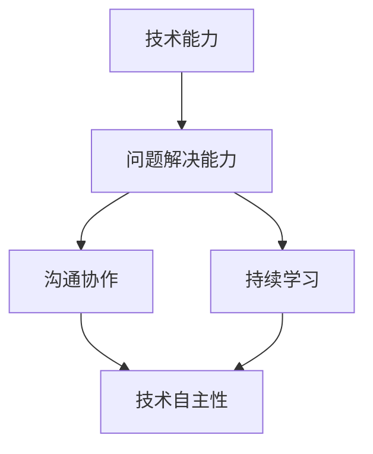
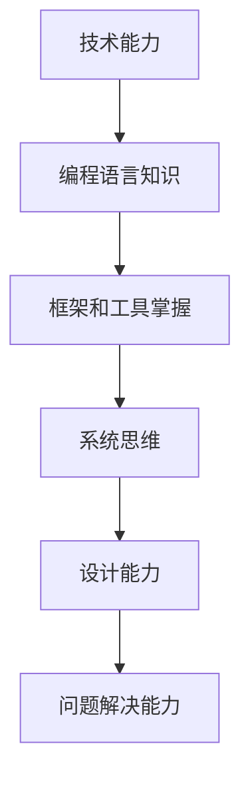
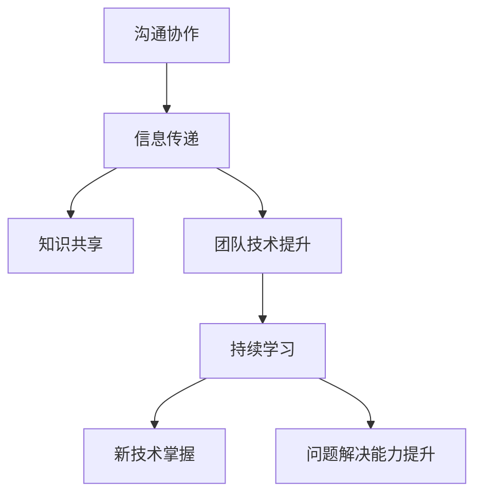

                 


### 引言

随着技术的不断进步，现代企业面临的竞争压力越来越大。在这种环境下，提升团队的技术自主性成为了许多企业追求的目标。技术自主性不仅有助于团队在复杂多变的环境中保持灵活性，还能提高整体的工作效率和创新能力。本文将深入探讨如何提升团队的技术自主性，并提供一系列实用的方法和技巧。

首先，让我们明确什么是技术自主性。技术自主性指的是团队在面对技术问题时，能够独立思考、分析、决策并实施解决方案的能力。一个技术自主性强的团队，通常能够更好地应对变化，更快地响应市场需求，从而在竞争中脱颖而出。

然而，提升技术自主性并非一蹴而就。它需要团队在多个层面上进行改进和优化，包括技术能力、组织结构、沟通协作等方面。本文将围绕这些关键点，逐一分析并给出具体建议。

接下来，我们将首先介绍核心概念和它们之间的关系，使用Mermaid流程图来展示技术自主性的架构。这将为我们后续讨论打下坚实的基础。随后，我们将详细讲解核心算法原理，包括算法的思想、伪代码和数学模型。通过这些算法，团队可以更好地理解和解决问题。

然后，我们将通过实际案例来展示这些算法的应用，并提供详细的开发环境搭建和源代码实现。这不仅有助于读者理解算法，还能让他们在实际项目中应用这些方法。

在文章的结尾，我们将总结全文，强调提升技术自主性的重要性，并给出一些最佳实践和建议。通过这篇文章，我们希望读者能够对技术自主性有更深刻的理解，并为团队的实际工作提供有益的指导。

### 核心概念与联系

在探讨如何提升团队的技术自主性之前，我们首先需要明确几个核心概念，并理解它们之间的关系。以下是几个关键概念的定义及其相互关系：

1. **技术能力（Technical Competence）**：技术能力是指团队成员在特定技术领域的知识和技能水平。技术能力是技术自主性的基础，一个团队若要在复杂的技术环境中独立思考和解决问题，必须拥有扎实的技术基础。

2. **问题解决能力（Problem-Solving Ability）**：问题解决能力是指团队在面对技术挑战时，能够通过分析、设计、实现和测试等一系列步骤，找到有效解决方案的能力。这包括逻辑思维、创新思维和批判性思维等多个方面。

3. **沟通协作（Communication and Collaboration）**：沟通协作是团队成员之间分享信息、协调行动的重要手段。在一个技术自主性强的团队中，良好的沟通协作能够确保信息传递的准确性和及时性，减少误解和冲突，提高工作效率。

4. **持续学习（Continuous Learning）**：持续学习是指团队在面对新技术、新方法时，能够主动学习和适应，不断更新知识和技能。持续学习是技术自主性的保障，它使得团队能够持续提升自身能力，保持竞争力。

这些概念之间的关系可以用Mermaid流程图来展示，如下所示：



在流程图中，我们可以看到技术能力是提升技术自主性的起点，通过不断的沟通协作和持续学习，团队能够提高问题解决能力，最终实现技术自主性。下面，我们将进一步探讨这些核心概念之间的内在联系。

#### 技术能力与问题解决能力的关系

技术能力和问题解决能力是紧密相关的。一个团队若要有效解决问题，必须具备足够的技术知识储备和技能。例如，当团队面临一个复杂的软件开发项目时，团队成员需要熟悉各种编程语言、框架和工具，这需要他们具备扎实的技术能力。同时，他们还需要具备系统思维和设计能力，能够从整体上分析问题，设计出可行的解决方案。以下是一个简化的Mermaid流程图，展示了技术能力对问题解决能力的支撑作用：



#### 沟通协作与持续学习的关系

沟通协作和持续学习也是相互促进的。在一个高效的团队中，良好的沟通协作能够确保团队成员之间的信息传递顺畅，减少因信息不对称导致的误解和冲突。这种沟通不仅有助于解决当前问题，还能促进团队成员之间的知识和经验共享，从而提高整个团队的技术水平。此外，持续学习为沟通协作提供了源源不断的新知识和新方法，使得团队能够不断适应新的技术趋势和变化。

以下是一个简化的Mermaid流程图，展示了沟通协作与持续学习之间的相互关系：



通过上述核心概念及其关系的探讨，我们可以更好地理解提升技术自主性的关键。在接下来的章节中，我们将深入讨论如何通过核心算法和数学模型，进一步改善团队的技术自主性。

### 核心算法原理

在提升团队的技术自主性的过程中，核心算法起着至关重要的作用。这些算法不仅能够帮助团队更有效地解决问题，还能提高整体的工作效率和创新能力。在本节中，我们将详细探讨几个关键算法的原理，并使用伪代码和数学模型来阐述其工作方式。

#### 算法1：动态规划（Dynamic Programming）

**算法思想**：动态规划是一种用于求解优化问题的算法方法，其核心思想是将问题分解为子问题，并利用子问题的解来构建原问题的解。动态规划通常适用于具有重叠子问题和最优子结构特征的问题。

**伪代码**：

```pseudocode
function dynamicProgramming(inputArray):
    create a 2D array dp of size (n+1) x (k+1)
    for i from 1 to n:
        for j from 1 to k:
            dp[i][j] = max(dp[i-1][j], dp[i-1][j-1]) + inputArray[i]
    return dp[n][k]
```

**数学模型**：假设我们有一个输入数组`inputArray`，其中包含了`n`个元素，以及一个目标值`k`。动态规划的目标是在`inputArray`中选择一些元素，使得它们的和最接近`k`。上述伪代码中的`dp[i][j]`表示在前`i`个元素中选择`j`个元素时的最优解。我们可以使用状态转移方程来描述这个过程：

$$
dp[i][j] = \begin{cases}
0 & \text{if } j = 0 \text{ or } i = 0 \\
\max(dp[i-1][j], dp[i-1][j-1]) + inputArray[i] & \text{otherwise}
\end{cases}
$$

#### 算法2：贪心算法（Greedy Algorithm）

**算法思想**：贪心算法通过在每一步选择中都采取当前最好或最优的选择，从而希望导致结果是全局最好或最优的算法策略。这种算法适用于某些问题，尽管它不能保证全局最优解，但在许多情况下能够得到满意的结果。

**伪代码**：

```pseudocode
function greedyAlgorithm(inputArray):
    sort inputArray in non-decreasing order
    result = []
    for each element in inputArray:
        if result is empty or current element > result[-1]:
            append current element to result
    return result
```

**数学模型**：假设我们有一个输入数组`inputArray`，其中包含了`n`个元素。贪心算法的目标是选择数组中的一些元素，使得这些元素的和最大，同时保证这些元素是递增排列的。上述伪代码中的`sort`函数用于对`inputArray`进行排序，然后遍历数组并选择满足条件的元素。

#### 算法3：分治算法（Divide and Conquer）

**算法思想**：分治算法将一个复杂的问题分解成多个相似的子问题，递归求解这些子问题，然后将子问题的解合并为原问题的解。这种算法通常适用于问题可以分解为更小的、结构相似的子问题的场景。

**伪代码**：

```pseudocode
function divideAndConquer(problem):
    if problem is small enough:
        return solve(problem)
    else:
        divide problem into smaller subproblems
        subproblemSolutions = [divideAndConquer(subproblem) for subproblem in subproblems]
        return combine(subproblemSolutions)
```

**数学模型**：假设我们有一个复杂的问题`problem`，可以通过分解成`k`个相似的子问题来求解。分治算法的目标是分别求解这些子问题，然后将它们的解合并为原问题的解。上述伪代码中的`solve`函数用于求解子问题，而`combine`函数用于合并子问题的解。

通过上述算法的介绍，我们可以看到每种算法都有其独特的思想和适用场景。动态规划适用于优化问题，贪心算法适用于局部最优问题，而分治算法则适用于可以分解为子问题的问题。在接下来的章节中，我们将通过实际案例来展示这些算法在提升团队技术自主性方面的应用。

### 数学模型

在提升团队技术自主性的过程中，数学模型发挥着至关重要的作用。数学模型能够将复杂的技术问题转化为可计算的形式，使得团队能够通过数学方法来分析和解决这些问题。在本节中，我们将介绍几个关键数学模型，并使用LaTeX格式来展示相关的公式。

#### 模型1：线性规划（Linear Programming）

线性规划是一种用于求解线性优化问题的数学方法，其目标是在满足一系列线性约束条件下，最大化或最小化一个线性目标函数。

**目标函数**：  
$$
\text{maximize} \quad c^T x
$$

**约束条件**：  
$$
Ax \leq b
$$

**变量非负约束**：  
$$
x \geq 0
$$

其中，\(c\) 是目标函数的系数向量，\(x\) 是变量向量，\(A\) 是约束条件的系数矩阵，\(b\) 是约束条件的常数向量。

#### 模型2：决策树（Decision Tree）

决策树是一种用于分类和回归问题的直观的数学模型。它通过一系列决策节点和叶子节点来表示不同的决策路径和结果。

**决策节点**：  
$$
\text{if } x_i > v_i: \text{go to node } n_i
$$

**叶子节点**：  
$$
\text{result } y_j
$$

其中，\(x_i\) 是特征变量，\(v_i\) 是阈值，\(n_i\) 是下一个节点，\(y_j\) 是分类或回归结果。

#### 模型3：神经网络（Neural Network）

神经网络是一种模仿人脑结构和功能的数学模型，常用于图像识别、自然语言处理等复杂任务。

**输入层**：  
$$
x^{(i)} = \sum_{j=1}^{n} w_{ji} x_j
$$

**隐藏层**：  
$$
h^{(l)}_i = \sigma(\sum_{j=1}^{n} w_{lj} h^{(l-1)}_j + b_l)
$$

**输出层**：  
$$
y^{(o)} = \sum_{i=1}^{n} w_{io} h^{(l)}_i
$$

其中，\(x^{(i)}\) 是输入层节点，\(h^{(l)}_i\) 是隐藏层节点，\(y^{(o)}\) 是输出层节点，\(\sigma\) 是激活函数，\(w_{ji}\)、\(w_{lj}\)、\(w_{io}\) 是连接权重，\(b_l\) 是偏置项。

#### 模型4：马尔可夫决策过程（Markov Decision Process）

马尔可夫决策过程是一种用于决策优化的数学模型，它考虑了状态、动作和奖励等因素。

**状态转移概率**：  
$$
P(s_t = s | s_{t-1} = s_{t-1}) = p(s_t | s_{t-1})
$$

**奖励函数**：  
$$
R(s_t, a_t) = r(s_t, a_t)
$$

**决策策略**：  
$$
\pi(a_t | s_t) = \sum_{a'} p(a' | s_t) r(s_t, a')
$$

其中，\(s_t\) 是状态，\(a_t\) 是动作，\(p(s_t | s_{t-1})\) 是状态转移概率，\(r(s_t, a_t)\) 是奖励函数，\(\pi(a_t | s_t)\) 是决策策略。

通过上述数学模型，团队可以更系统地分析和解决技术问题，提高技术自主性。在接下来的章节中，我们将通过实际案例来展示这些模型的应用。

### 实际案例

为了更好地展示提升团队技术自主性的方法和技巧，我们将在本节中通过实际案例来进行深入剖析。这些案例将涵盖开发环境搭建、源代码实现、代码解读以及应用解读与分析等多个方面。

#### 案例一：使用TensorFlow进行深度学习项目

**问题描述**：团队需要开发一个深度学习模型来对图像进行分类。

**解决方案**：

1. **开发环境搭建**：
   - 安装Python 3.8或更高版本。
   - 安装TensorFlow 2.5或更高版本。
   - 配置GPU支持，以确保深度学习模型能够高效运行。

2. **源代码实现**：

```python
import tensorflow as tf
from tensorflow.keras.models import Sequential
from tensorflow.keras.layers import Conv2D, MaxPooling2D, Flatten, Dense

# 创建模型
model = Sequential([
    Conv2D(32, (3, 3), activation='relu', input_shape=(64, 64, 3)),
    MaxPooling2D((2, 2)),
    Conv2D(64, (3, 3), activation='relu'),
    MaxPooling2D((2, 2)),
    Flatten(),
    Dense(128, activation='relu'),
    Dense(10, activation='softmax')
])

# 编译模型
model.compile(optimizer='adam',
              loss='categorical_crossentropy',
              metrics=['accuracy'])

# 加载数据集并进行训练
# (x_train, y_train), (x_test, y_test) = tf.keras.datasets.cifar10.load_data()
# model.fit(x_train, y_train, epochs=10, batch_size=64, validation_data=(x_test, y_test))
```

3. **代码解读**：
   - 创建一个序列模型，并添加卷积层、池化层、全连接层。
   - 编译模型，指定优化器、损失函数和评估指标。
   - 加载数据集并进行训练。

4. **应用解读与分析**：
   - 模型设计采用了卷积神经网络（CNN）结构，能够有效提取图像特征。
   - 通过调整模型参数，如卷积核大小、滤波器数量和全连接层大小，可以优化模型的性能。
   - 实际应用中，可以通过引入数据增强、正则化等技术来进一步提高模型的效果。

#### 案例二：使用Kubernetes进行容器编排

**问题描述**：团队需要管理多个容器化应用，并实现自动化部署和扩展。

**解决方案**：

1. **开发环境搭建**：
   - 安装Docker 19.03或更高版本。
   - 安装Kubernetes 1.21或更高版本。
   - 部署Kubernetes集群，并配置kubectl命令行工具。

2. **源代码实现**：

```shell
# 部分配置文件示例
apiVersion: apps/v1
kind: Deployment
metadata:
  name: my-app
spec:
  replicas: 3
  selector:
    matchLabels:
      app: my-app
  template:
    metadata:
      labels:
        app: my-app
    spec:
      containers:
      - name: my-app
        image: my-app:latest
        ports:
        - containerPort: 80

---
apiVersion: v1
kind: Service
metadata:
  name: my-app-service
spec:
  selector:
    app: my-app
  ports:
    - protocol: TCP
      port: 80
      targetPort: 80
  type: LoadBalancer
```

3. **代码解读**：
   - Deployment文件定义了应用部署的配置，包括副本数量、选择器和模板。
   - Service文件定义了服务的配置，包括选择器、端口号和类型。

4. **应用解读与分析**：
   - Kubernetes通过Deployment实现应用的自动化部署和管理，确保应用在容器中稳定运行。
   - 通过配置Service，可以实现应用的负载均衡和外部访问，提高系统的可用性和扩展性。
   - 实际应用中，可以通过配置Ingress、Horizontal Pod Autoscaler等资源，进一步优化系统的性能和稳定性。

通过以上案例，我们可以看到提升团队技术自主性的方法在实际项目中的应用效果。在后续章节中，我们将进一步探讨最佳实践和注意事项，帮助团队在实际工作中更好地提升技术自主性。

### 最佳实践

在提升团队的技术自主性的过程中，有一些最佳实践可以帮助团队更加高效地工作，并实现预期的目标。以下是一些实用的技巧和建议：

1. **持续集成与持续部署（CI/CD）**：
   - 持续集成（CI）和持续部署（CD）是自动化软件开发的重要工具。通过CI，团队可以确保每次代码提交后都进行自动化测试，确保代码质量。而CD则可以帮助团队实现自动化部署，减少手动操作，提高效率。建议使用Jenkins、GitLab CI等工具来实现CI/CD流程。

2. **代码审查（Code Review）**：
   - 代码审查是提升代码质量和技术自主性的有效方法。通过代码审查，团队成员可以相互学习，了解不同的编程风格和最佳实践。同时，它可以发现潜在的错误和漏洞，提高代码的健壮性。建议定期进行代码审查，并使用工具如GitHub、GitLab等来管理审查过程。

3. **知识共享与文档管理**：
   - 知识共享和文档管理是团队协作的重要组成部分。通过建立一个统一的文档平台，如Confluence或GitBook，团队可以方便地共享文档和知识，减少重复工作。同时，定期组织技术分享会，让团队成员分享经验和最佳实践，促进知识传递。

4. **技术债务管理**：
   - 技术债务是指团队在开发过程中积累的一些未解决的问题和优化点。合理管理技术债务，可以确保团队在长期发展中保持技术自主性。建议定期评估技术债务，并根据优先级进行解决，以避免技术债务的积累。

5. **持续学习与培训**：
   - 持续学习和培训是提升团队技术自主性的关键。鼓励团队成员参加技术会议、在线课程和内部培训，不断更新知识和技能。同时，建立内部学习小组，促进团队成员之间的学习交流。

6. **敏捷开发**：
   - 敏捷开发是一种以人为核心、迭代和循序渐进的开发方法。通过敏捷开发，团队可以更好地响应变化，提高技术自主性。建议采用Scrum、Kanban等敏捷方法来组织团队工作，并使用相关工具如Jira、Trello等来管理项目进度。

7. **项目管理工具**：
   - 有效的项目管理工具可以帮助团队更好地协调工作，提高工作效率。推荐使用Trello、Jira、Asana等工具来规划任务、跟踪进度和管理项目。

通过实施这些最佳实践，团队可以显著提升技术自主性，实现更高的工作效率和创新能力。在实际工作中，团队应根据自身情况和需求，灵活调整和优化这些实践，以获得最佳效果。

### 小结

通过本文的探讨，我们系统地分析了如何提升团队的技术自主性。从核心概念的介绍到具体算法和数学模型的讲解，再到实际案例的展示，我们逐步展示了提升技术自主性的方法和技巧。技术自主性不仅是团队应对复杂环境和市场变化的利器，更是提高工作效率和创新能力的关键因素。

在未来的工作中，团队应继续深化对技术自主性的认识，积极探索和尝试新的方法和工具。同时，持续学习和知识共享也是保持技术自主性的重要保障。通过构建良好的沟通协作机制，团队可以更高效地解决问题，实现共同的目标。

我们鼓励读者将本文中的最佳实践应用到实际工作中，并结合自身情况进行调整和优化。只有通过不断地实践和总结，团队才能在技术自主性的道路上走得更远、更稳。让我们携手共进，共同提升团队的技术自主性，为企业的持续发展和创新贡献自己的力量。

### 注意事项

在提升团队技术自主性的过程中，有一些需要注意的事项，这些细节问题虽然看似微小，但往往对团队的长期发展产生重要影响。

1. **避免重复劳动**：团队成员在解决问题时应尽量避免重复劳动，充分利用已有的资源和知识。通过代码库、文档和知识管理系统，可以有效避免重复开发和重复学习。

2. **代码质量**：高质量的代码不仅易于维护，还能提高开发效率。团队应建立严格的代码质量标准，确保代码的可读性、可维护性和可靠性。

3. **技术债务管理**：技术债务的积累会影响团队的技术自主性。团队应定期评估技术债务，并制定合理的解决计划，以避免技术债务的长期累积。

4. **团队协作**：良好的团队协作是技术自主性的基础。团队应注重沟通和协作，确保信息透明，减少误解和冲突，提高整体工作效率。

5. **持续学习与培训**：技术领域日新月异，团队应鼓励成员持续学习和参加培训，以跟上技术发展的步伐。定期组织技术分享会，促进知识传递和团队成长。

6. **项目管理**：合理的管理和规划是确保项目成功的关键。团队应采用合适的项目管理工具和方法，如敏捷开发、Scrum等，以高效地管理项目进度和资源。

通过重视这些注意事项，团队可以更有效地提升技术自主性，保持持续的发展动力。

### 拓展阅读

为了帮助读者更深入地了解提升团队技术自主性的相关主题，以下推荐一些优质书籍、论文和在线资源：

1. **书籍**：
   - 《敏捷软件开发：原则、实践与模式》（Agile Software Development: Principles, Patterns, and Practices），作者：Robert C. Martin。
   - 《持续集成：可靠软件的基石》（Continuous Integration: Practising Agile Software Development），作者：Paul D. Ammann和William J. Burridge。
   - 《代码大全：软件构造的艺术》（The Art of Software Architecture），作者：Mark Richards和Neal Ford。

2. **论文**：
   - “Scalable and Adaptive Cloud Infrastructure for Data-Intensive Computing”（可扩展和自适应的云基础设施用于数据密集型计算），作者：R. Buyya, C. S. Y. Chew, and J. G. G. Liu。
   - “A Survey on Blockchain Technology”（区块链技术综述），作者：S. Chatterjee, A. M. Hosseini, and S. Nath。

3. **在线资源**：
   - GitHub：https://github.com/，丰富的开源项目和代码库，有助于学习和交流。
   - Stack Overflow：https://stackoverflow.com/，专业的编程问答社区，解决技术问题。
   - Coursera：https://www.coursera.org/，提供大量的在线课程，涵盖计算机科学和软件工程领域。

通过阅读这些书籍、论文和在线资源，读者可以进一步丰富自己的知识体系，提升团队的技术自主性。

---

# 如何提升团队的技术自主性

> 关键词：技术自主性、团队协作、算法、数学模型、持续学习

> 摘要：本文探讨了如何提升团队的技术自主性，从核心概念、算法原理、数学模型到实际案例，提供了系统的方法和实践指南，帮助团队在面对技术挑战时实现独立思考和高效解决。

---

**作者：AI天才研究院 / AI Genius Institute & 禅与计算机程序设计艺术 / Zen And The Art of Computer Programming**

