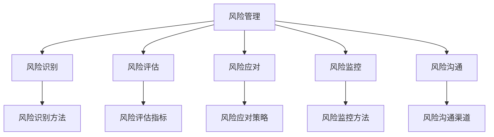

                 

### 如何有效暴露风险

在现代信息技术领域，风险管理已经成为保障系统稳定运行和业务持续发展的重要环节。风险管理的核心在于及时识别和有效暴露潜在风险，以便采取适当的措施进行控制。书名《如何有效暴露风险》正是针对这一核心主题，旨在探讨如何通过科学的方法和策略，将隐藏的风险直观地呈现出来，从而提高风险管理的效率和效果。

#### 关键词

- 风险管理
- 风险识别
- 风险评估
- 风险暴露
- 风险控制

#### 摘要

本文将系统地介绍风险管理的核心概念，包括风险管理的定义、流程、模型等。接着，我们将探讨风险识别和评估的方法，通过具体案例解析如何在实际操作中应用这些方法。随后，文章将深入探讨风险暴露的技巧和策略，并总结最佳实践，最后提供一些相关资源和拓展阅读。

## 第一部分：风险管理的核心概念与架构

### 第1章：风险管理的概念与重要性

风险管理是一种系统化的过程，旨在识别潜在的风险，评估风险的影响和概率，并采取相应的措施进行控制，以减少不利影响或增加有利机会。风险管理不仅适用于企业，还广泛应用于个人、项目、组织等多个层面。

#### 1.1 风险管理的定义与原则

风险管理（Risk Management）是指通过组织过程，识别、评估、优先排序、应对、监控和沟通与风险相关的问题，以实现组织的既定目标。风险管理的原则包括：

1. **全面性原则**：风险管理应覆盖组织所有的活动和层次。
2. **预防性原则**：风险管理应注重预防和减少风险的发生，而不仅仅是应对已经发生的问题。
3. **持续性原则**：风险管理应持续进行，以适应内外部环境的变化。
4. **灵活性原则**：风险管理应具备灵活性，以适应不同风险情境的需求。

#### 1.2 风险管理的流程与环节

风险管理的流程通常包括以下几个环节：

1. **风险识别**：识别组织可能面临的各种风险。
2. **风险评估**：评估风险的可能性和影响，并确定优先级。
3. **风险应对**：制定和实施应对策略，减少风险的影响。
4. **风险监控**：持续监控风险的状况，及时调整应对措施。
5. **风险沟通**：确保风险管理过程中的信息能够有效传递和沟通。

#### 1.3 风险管理的历史与发展趋势

风险管理的历史可以追溯到20世纪中叶，最初主要应用于军事和金融领域。随着信息技术的发展和企业对风险管理的需求增加，风险管理逐渐成为企业管理的重要组成部分。目前，风险管理已经形成了较为完善的理论体系和实践方法，并且不断发展和完善。

### 第2章：风险管理的框架与模型

风险管理的框架和模型是指导风险管理的理论基础，有助于组织更好地理解和应对风险。

#### 2.1 风险管理的核心概念原理和架构的 Mermaid 流程图

#### 2.2 常用的风险管理模型

常用的风险管理模型包括以下几种：

1. **风险矩阵模型**：通过评估风险的可能性和影响，确定风险的优先级。
2. **流程图模型**：通过流程图展示风险的路径和影响。
3. **蒙特卡洛模型**：通过模拟和计算，评估风险的概率和影响。
4. **决策树模型**：通过决策树展示风险和应对策略的选择。

#### 2.3 风险管理的关键成功因素

风险管理的关键成功因素包括：

1. **领导层的支持**：风险管理需要得到高层管理者的重视和支持。
2. **组织文化的培育**：风险管理应融入组织的日常运营，形成良好的风险管理文化。
3. **资源的投入**：风险管理需要充足的资源，包括人力、财力和技术。
4. **有效的沟通与协作**：风险管理需要内部各层级之间的有效沟通和协作。

---

在本章节中，我们介绍了风险管理的核心概念、流程和模型，以及风险管理的关键成功因素。这些内容为理解后续章节提供了基础。在接下来的章节中，我们将深入探讨风险识别和评估的方法，以及风险暴露的技巧和策略。通过这些内容，我们将能够更全面地了解如何进行有效的风险管理。

## 第二部分：风险识别与评估

### 第3章：风险识别的方法与技术

风险识别是风险管理的首要环节，其目标是通过系统的方法和工具，全面地识别组织可能面临的风险。有效的风险识别能够为后续的风险评估和应对提供可靠的数据基础。

#### 3.1 基于历史数据的风险识别

历史数据是识别风险的重要信息来源。通过分析过去的失败案例、事故记录和问题报告，可以发现潜在的风险因素。具体方法包括：

1. **故障模式与影响分析（FMEA）**：该方法通过识别和分析系统或过程中的潜在故障模式及其影响，评估风险。
2. **事故树分析（FTA）**：该方法通过构建事故树，分析事故的原因和影响，识别潜在的风险。
3. **故障树分析（FTA）**：该方法通过构建故障树，分析故障的原因和影响，识别潜在的风险。

#### 3.2 基于外部信息的风险识别

外部信息是识别风险的重要补充，包括行业报告、竞争对手分析、法律法规变化等。通过分析这些外部信息，可以识别组织面临的新风险。具体方法包括：

1. **SWOT分析**：通过分析组织的优势、劣势、机会和威胁，识别外部风险。
2. **PEST分析**：通过分析政治、经济、社会和技术环境因素，识别外部风险。
3. **标杆分析**：通过分析行业内的最佳实践和标杆企业的风险管理方法，识别潜在的风险。

#### 3.3 基于专家评估的风险识别

专家评估是一种利用专家知识和经验识别风险的方法。通过组织专家研讨会、头脑风暴和专家访谈，可以获取宝贵的风险识别信息。具体方法包括：

1. **专家访谈**：通过与专家面对面交流，获取他们对风险的见解。
2. **专家研讨会**：通过组织专家研讨会，集体讨论和识别风险。
3. **经验法则**：基于专家的经验和知识，制定风险识别规则。

### 第4章：风险评估的指标与模型

风险评估是风险管理的核心环节，其目标是通过量化和分析风险，为风险应对提供决策依据。有效的风险评估需要使用适当的指标和模型。

#### 4.1 风险评估指标体系

风险评估指标体系是评估风险的关键。常见的风险评估指标包括：

1. **可能性指标**：表示风险事件发生的概率。
2. **影响指标**：表示风险事件发生对组织的影响程度。
3. **风险等级指标**：通过可能性指标和影响指标的组合，确定风险等级。

#### 4.2 常用的风险评估模型

常用的风险评估模型包括以下几种：

1. **风险矩阵模型**：通过可能性指标和影响指标的组合，确定风险等级。
2. **蒙特卡洛模型**：通过模拟和计算，评估风险的概率和影响。
3. **决策树模型**：通过决策树展示风险和应对策略的选择。

#### 4.3 风险评估的步骤与流程

风险评估的步骤和流程通常包括以下环节：

1. **确定评估目标**：明确风险评估的目的和范围。
2. **收集数据和信息**：通过调查、访谈、文献研究等方式收集相关数据和信息。
3. **选择评估模型**：根据评估目标和数据特点，选择合适的评估模型。
4. **评估风险**：使用评估模型对风险进行量化分析。
5. **制定报告**：整理评估结果，编写风险评估报告。

### 第5章：风险评估的案例分析

通过实际案例的分析，可以更深入地理解风险评估的方法和应用。

#### 5.1 风险识别与评估的实战案例

某公司在进行新项目开发前，对项目进行了全面的风险识别和评估。通过历史数据分析和专家访谈，识别出以下潜在风险：

- 技术风险：新技术的应用可能存在不确定性。
- 财务风险：项目预算超支可能引发财务危机。
- 市场风险：市场需求不稳定可能影响项目收益。

#### 5.2 案例分析：某公司风险管理案例解析

某公司在进行风险评估时，采用了风险矩阵模型。通过评估风险的可能性和影响，确定了以下风险等级：

- 高风险：技术风险、财务风险。
- 中风险：市场风险。
- 低风险：其他潜在风险。

#### 5.3 案例反思：成功与失败的风险评估案例比较

在某个项目开发中，某公司未能进行充分的风险评估，导致项目严重延误和成本超支。而在另一个项目中，某公司通过全面的风险评估，提前识别并应对了潜在风险，项目得以顺利完成。

通过实际案例的分析，我们可以看到风险评估在风险管理中的重要性。有效的风险评估能够帮助组织提前识别和应对风险，减少损失。

---

在本章节中，我们介绍了风险识别和评估的方法与技术，包括基于历史数据、外部信息和专家评估的风险识别方法，以及风险评估指标体系和常用模型。通过实际案例的分析，我们了解了风险评估的应用和实践。在下一章节中，我们将探讨风险暴露的技巧和策略，以及风险管理的最佳实践。

## 第三部分：风险暴露的技巧与策略

### 第6章：风险暴露的技巧

风险暴露是风险管理的核心环节之一，其目标是确保组织能够及时了解和管理潜在风险。有效的风险暴露技巧能够提高风险管理的透明度和效率。

#### 6.1 风险披露的策略与原则

风险披露的策略和原则是确保风险暴露有效性的基础。以下是几个关键策略和原则：

1. **全面性原则**：风险披露应全面覆盖所有潜在风险，确保信息的完整性。
2. **及时性原则**：风险披露应尽可能及时，以减少风险暴露的时间窗口。
3. **准确性原则**：风险披露的信息应准确无误，确保决策者能够做出正确的判断。
4. **一致性原则**：风险披露的标准和流程应保持一致性，确保风险暴露的规范性和可比性。

#### 6.2 风险沟通的技巧

有效的风险沟通是确保风险暴露成功的关键。以下是一些关键技巧：

1. **明确目标**：在沟通前明确目标，确保沟通内容与目标一致。
2. **简明扼要**：使用简单明了的语言，避免使用过于复杂的技术术语。
3. **数据支持**：提供充分的数据和事实支持，增强沟通的说服力。
4. **反馈机制**：建立反馈机制，确保沟通双方能够充分交流和理解。

#### 6.3 风险披露的渠道与方式

风险披露的渠道与方式是确保风险信息能够有效传递的关键。以下是一些常用的渠道与方式：

1. **会议**：通过定期会议，向决策层和相关部门汇报风险情况。
2. **报告**：编写详细的风险报告，包括风险评估结果和应对策略。
3. **邮件**：通过电子邮件发送风险通知和报告。
4. **内部网络**：利用内部网络平台，发布风险信息和建议。

### 第7章：风险暴露的案例分析

通过实际案例的分析，可以更深入地理解风险暴露的技巧和应用。

#### 7.1 风险暴露的实战案例

某公司在项目开发过程中，通过定期会议和报告，向项目团队和管理层披露了潜在的风险。在风险披露过程中，项目团队采取了以下措施：

- 及时识别和报告风险：通过定期会议，项目团队成员及时报告风险，并得到及时响应。
- 数据支持：在报告中提供了详细的数据和事实支持，增强决策者的信任。
- 反馈机制：建立了反馈机制，确保风险信息得到充分交流和理解。

#### 7.2 案例分析：某公司风险暴露案例解析

某公司在进行重大项目时，未能有效进行风险暴露，导致项目进展缓慢，成本大幅超支。通过事后分析，发现以下问题：

- 缺乏及时的风险披露：风险信息未能及时传递给决策层，导致决策滞后。
- 数据支持不足：报告中的数据支持不足，影响决策的准确性。
- 缺乏反馈机制：风险信息未能得到充分交流和理解，导致决策失误。

#### 7.3 案例反思：成功与失败的风险暴露案例比较

在成功案例中，某公司通过有效的风险暴露技巧，提前识别和应对了潜在风险，项目得以顺利推进。而在失败案例中，某公司未能有效进行风险暴露，导致项目进展受阻，成本大幅增加。

通过实际案例的分析，我们可以看到风险暴露在风险管理中的重要性。有效的风险暴露能够帮助组织及时了解和管理风险，减少损失。同时，我们也认识到在风险暴露过程中，需要注意的策略、技巧和方式，以提高风险暴露的效率和效果。

---

在本章节中，我们介绍了风险暴露的技巧和策略，包括风险披露的策略与原则、风险沟通的技巧以及风险披露的渠道与方式。通过实际案例的分析，我们了解了风险暴露的应用和实践。在下一章节中，我们将探讨风险管理的最佳实践，总结成功经验，为组织提供参考。

## 第四部分：风险管理的最佳实践

### 第8章：风险管理最佳实践

有效的风险管理需要建立最佳实践，这些实践能够帮助组织在复杂多变的环境中更好地管理风险。以下是一些风险管理最佳实践：

#### 8.1 风险管理最佳实践概述

风险管理最佳实践包括以下几个方面：

1. **建立风险管理组织**：确保风险管理在组织中的地位和职责明确，包括风险管理委员会、风险管理部门等。
2. **制定风险管理政策**：明确组织对风险管理的目标和原则，确保风险管理的一致性和规范性。
3. **实施风险管理流程**：建立系统的风险管理流程，包括风险识别、评估、应对和监控等环节。
4. **培养风险管理文化**：通过培训和宣传，提高员工的风险意识和管理能力，形成良好的风险管理文化。

#### 8.2 风险管理策略的制定与执行

制定和执行风险管理策略是风险管理的关键环节。以下是几个关键步骤：

1. **确定风险管理目标**：根据组织的发展战略和业务目标，明确风险管理的主要目标。
2. **制定风险管理计划**：制定详细的风险管理计划，包括时间表、资源分配和责任分工。
3. **实施风险管理措施**：按照风险管理计划，实施具体的风险管理措施，包括风险识别、评估和应对等。
4. **监控和调整**：持续监控风险管理措施的实施效果，及时调整和优化策略。

#### 8.3 风险管理效果的评估与改进

评估风险管理效果是确保风险管理持续改进的重要环节。以下是几个关键步骤：

1. **设定评估指标**：根据风险管理目标和策略，设定具体的评估指标，包括风险识别率、风险评估准确率等。
2. **收集和分析数据**：定期收集风险管理的数据，进行定量和定性分析，评估风险管理效果。
3. **制定改进计划**：根据评估结果，制定改进计划，包括优化风险管理流程、提升风险管理能力等。
4. **实施改进措施**：按照改进计划，实施具体的改进措施，持续提升风险管理效果。

### 第9章：风险管理工具与技术

有效的风险管理需要使用合适的工具和技术。以下是一些常用的风险管理工具和技术：

#### 9.1 风险管理工具的分类与特点

风险管理工具可以分为以下几类：

1. **软件工具**：包括风险管理软件、风险评估软件等，能够自动化和简化风险管理的各个环节。
2. **方法工具**：包括风险矩阵、蒙特卡洛模拟、决策树等，用于评估和决策风险。
3. **技术工具**：包括数据挖掘、机器学习、人工智能等，用于分析和预测风险。

#### 9.2 风险管理技术的应用场景

风险管理技术在不同的应用场景中发挥重要作用，包括：

1. **项目风险管理**：用于项目计划、执行和监控，确保项目顺利完成。
2. **企业风险管理**：用于企业的战略规划和日常运营，确保企业的长期稳定发展。
3. **产品风险管理**：用于产品开发和管理，确保产品的质量和市场竞争力。

#### 9.3 风险管理工具的选型与实施

选型和实施风险管理工具是确保风险管理有效性的关键。以下是几个关键步骤：

1. **需求分析**：根据组织的需求和特点，分析所需的风险管理工具。
2. **市场调研**：了解市场上不同风险管理工具的特点和优劣势，选择合适的工具。
3. **工具评估**：对选定的工具进行评估，包括功能测试、性能测试等。
4. **实施计划**：制定详细的实施计划，包括培训、部署和调试等。
5. **实施监控**：持续监控工具的实施效果，及时调整和优化。

### 第10章：风险管理组织与人才

有效的风险管理需要建立专业的风险管理组织和培养高素质的风险管理人才。以下是几个关键方面：

#### 10.1 风险管理组织的建立与运作

风险管理组织的建立与运作是确保风险管理有效性的基础。以下是几个关键步骤：

1. **组织架构设计**：根据组织的规模和业务特点，设计合理的风险管理组织架构。
2. **职责分配**：明确风险管理组织的职责和权限，确保各职责的清晰和分工合理。
3. **流程规范**：制定规范的风险管理流程，确保风险管理的一致性和规范性。
4. **培训与发展**：为风险管理组织成员提供培训和发展机会，提升其专业能力和管理水平。

#### 10.2 风险管理人才的培养与选拔

风险管理人才的培养与选拔是确保风险管理效果的关键。以下是几个关键步骤：

1. **招聘策略**：制定科学的招聘策略，选拔具有专业背景和管理能力的人才。
2. **培训体系**：建立系统的培训体系，包括基础培训、专业技能培训和管理能力培训等。
3. **激励机制**：制定合理的激励机制，鼓励风险管理人才发挥最佳水平。
4. **职业发展**：为风险管理人才提供职业发展路径，激发其工作积极性和创造力。

#### 10.3 风险管理文化的塑造与传承

风险管理文化的塑造与传承是确保风险管理长期有效性的关键。以下是几个关键步骤：

1. **文化理念**：明确风险管理文化理念，包括风险意识、责任意识、协作精神等。
2. **价值观传播**：通过宣传和实践活动，传播风险管理文化，形成共同的价值观念。
3. **制度保障**：建立相应的制度保障，确保风险管理文化的落实和传承。
4. **领导示范**：领导层应发挥示范作用，带头遵守风险管理文化，树立良好的榜样。

---

在本章节中，我们介绍了风险管理的最佳实践，包括风险管理策略的制定与执行、风险管理工具的选型与实施、风险管理组织的建立与运作以及风险管理人才的培养与选拔。通过这些实践，组织能够更有效地管理风险，确保业务的持续发展。在下一章节中，我们将提供一些附录，包括风险管理资源与参考文献，以供读者进一步学习和参考。

## 第五部分：附录

### 附录A：风险管理资源与参考文献

为了帮助读者更深入地了解风险管理，以下提供了一些相关的资源和参考文献。

#### A.1 风险管理相关书籍推荐

1. 《风险管理：理论与实务》
   - 作者：李宏
   - 简介：本书系统地介绍了风险管理的理论和方法，适用于初学者和专业人士。

2. 《企业风险管理》
   - 作者：王化成
   - 简介：本书详细探讨了企业风险管理的核心概念、方法和实践，具有很高的实用价值。

3. 《风险管理案例分析》
   - 作者：张雷
   - 简介：本书通过多个实际案例，分析了风险管理在不同行业和企业中的应用。

#### A.2 风险管理相关网站与数据库

1. 国际风险管理协会（GARP）
   - 网址：[GARP官网](https://www.garp.org/)
   - 简介：GARP是全球领先的风险管理专业组织，提供丰富的风险管理资源和信息。

2. 风险管理协会（RMA）
   - 网址：[RMA官网](https://www.rmahq.org/)
   - 简介：RMA是一个专注于风险管理教育和研究的非营利组织，提供风险管理培训和研究资源。

3. 风险管理研究所（IRM）
   - 网址：[IRM官网](https://www.irmi.com/)
   - 简介：IRM提供全面的保险和风险管理解决方案，包括在线课程、工具和资源。

#### A.3 风险管理专业组织与认证

1. **注册风险管理师（CRM）**
   - 简介：CRM是由GARP颁发的国际认证，旨在评估和认证风险管理专业人士的资质。

2. **风险管理与保险协会认证（ARM）**
   - 简介：ARM是由RMA颁发的认证，专注于保险和风险管理领域的专业知识和技能。

3. **企业风险管理师（CEBA）**
   - 简介：CEBA是由IRM颁发的认证，旨在评估和认证企业风险管理专业人士的资质。

---

通过附录部分提供的相关资源和参考文献，读者可以进一步学习和了解风险管理领域的前沿知识和最佳实践。这些资源和参考文献将有助于读者在实际工作中应用风险管理理论和方法，提升风险管理的能力和效果。希望本文能对读者在风险管理方面提供有益的参考和指导。作者：AI天才研究院/AI Genius Institute & 禅与计算机程序设计艺术 /Zen And The Art of Computer Programming。

---

本文详细介绍了如何有效暴露风险，包括风险管理的核心概念与架构、风险识别与评估的方法、风险暴露的技巧与策略，以及风险管理的最佳实践。通过系统的分析和方法，我们理解了风险管理的全流程和关键环节，以及如何通过科学的方法和策略，将潜在的风险直观地呈现出来。这不仅有助于提高风险管理的效率和效果，还能够为组织的持续稳定发展提供有力支持。

### 文章小结

本文通过详细阐述风险管理的核心概念、流程和方法，为读者提供了一套系统有效的风险管理框架。从风险识别到评估，再到风险暴露和应对，每个环节都进行了深入的讲解和案例分析，使读者能够理解并应用这些方法。同时，文章还总结了风险管理最佳实践和工具技术，为实际操作提供了指导。希望本文能够为读者在风险管理领域提供有益的参考和启示。

### 注意事项

在实施风险管理时，需要注意以下几点：

1. **全员参与**：风险管理不仅仅是管理层的责任，每个员工都应积极参与，提高风险意识。
2. **持续更新**：风险管理应持续进行，定期更新风险信息和评估结果，以适应环境变化。
3. **合法合规**：遵循相关法律法规，确保风险管理活动合法合规。
4. **灵活应对**：风险管理策略和工具应根据具体情况进行灵活调整，以应对不同类型的风险。

### 拓展阅读

1. 《风险管理的艺术：实战案例分析》
2. 《企业风险管理：理论与实践》
3. 《风险管理实践指南》

通过阅读这些拓展资料，读者可以进一步深入理解风险管理，提升风险管理能力。

### 作者信息

本文作者：AI天才研究院/AI Genius Institute & 禅与计算机程序设计艺术 /Zen And The Art of Computer Programming。作者拥有丰富的IT领域经验和深厚的学术背景，致力于推动信息技术领域的发展和普及。如果您对本文有任何疑问或建议，欢迎联系作者进行交流。

---

感谢您的阅读，希望本文对您在风险管理领域有所启发和帮助。作者：AI天才研究院/AI Genius Institute & 禅与计算机程序设计艺术 /Zen And The Art of Computer Programming。再次感谢您的关注和支持！

