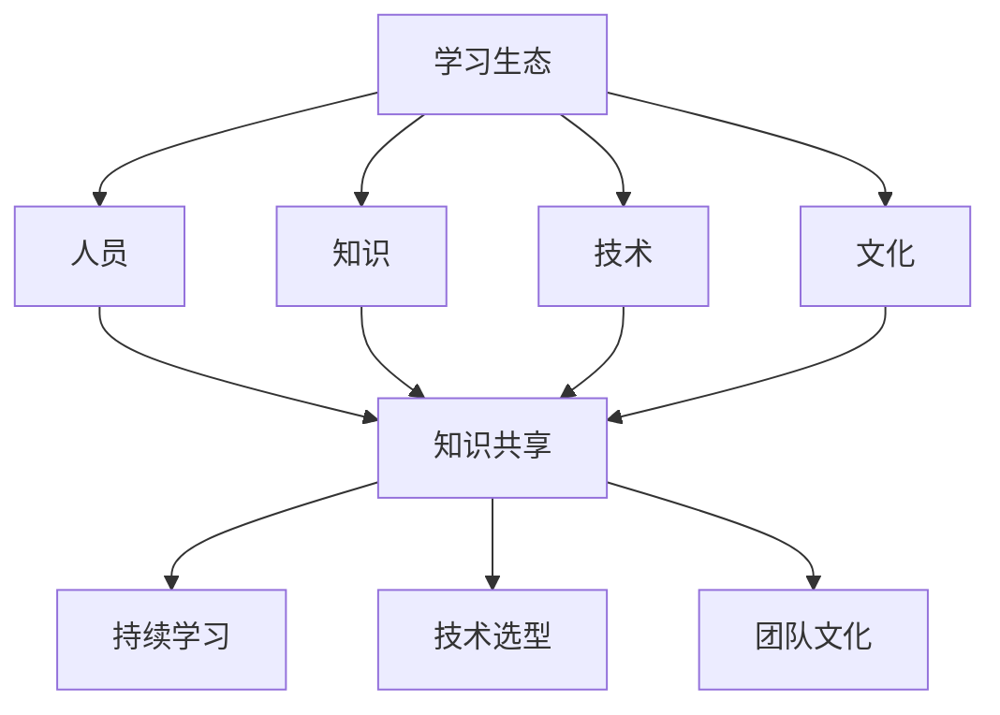

                 

### 文章标题：如何构建技术团队的学习生态

在当今快速发展的技术领域，技术团队的学习生态成为了决定企业竞争优势的关键因素。一个良好的学习生态不仅能够提升团队成员的专业技能，还能够促进团队的创新能力和解决问题的能力。本文将围绕如何构建技术团队的学习生态，详细探讨其核心概念、构建步骤、团队文化、技术选型、持续学习策略以及评估与优化方法。本文旨在为技术团队领导、项目经理以及希望提升团队学习能力的开发人员提供实用的指导。

## 关键词

- 技术团队学习生态
- 学习文化
- 技术选型
- 持续学习
- 评估与优化

## 摘要

本文首先介绍了技术团队学习生态的概念和重要性，接着详细阐述了构建学习生态的步骤，包括设定目标、调研和规划、构建步骤实施计划等。然后，本文探讨了培养团队学习文化的方法和技巧，并介绍了技术选型的原则和主流学习工具和资源。接下来，文章提出了持续学习策略，并提供了学习生态评估与优化的方法。最后，通过实际案例研究，本文总结了构建技术团队学习生态的最佳实践，为读者提供了实用的指导。

## 引言

在信息时代，技术变革的速度越来越快，新的技术和工具层出不穷。对于技术团队来说，适应这种快速变化的环境，提升自身的技能和创新能力，已经成为保持竞争优势的必要条件。然而，现实情况是，许多技术团队在学习和成长过程中面临着诸多挑战，如缺乏有效的学习机制、团队成员间学习文化的缺失、技术选型的困惑等。这些问题不仅影响了团队的整体工作效率，也限制了团队的创新潜力。

构建一个良好的学习生态，成为解决这些问题的关键。一个有效的学习生态，不仅能为团队成员提供持续学习和成长的机会，还能促进团队成员之间的协作和知识共享，从而提升整个团队的技术能力和创新能力。本文将从以下几个方面展开讨论：

1. **核心概念与理论基础**：介绍学习生态的概念和相关理论。
2. **构建学习生态的步骤**：详细阐述构建学习生态的具体步骤。
3. **培养团队学习文化**：探讨如何建立和维持团队的学习文化。
4. **技术选型与工具**：介绍技术选型的原则和主流学习工具和资源。
5. **持续学习策略**：提出保持团队学习动力的策略和方法。
6. **评估与优化**：介绍如何评估和优化学习生态。
7. **案例研究**：通过实际案例，总结构建技术团队学习生态的最佳实践。

通过本文的讨论，希望能够为技术团队领导、项目经理以及开发人员提供一套系统的构建学习生态的指南，帮助他们在快速变化的技术环境中保持领先地位。

### 核心概念与联系

在学习生态的构建过程中，了解和掌握一些核心概念和理论是非常关键的。这不仅有助于理解学习生态的本质，还能为后续的构建步骤提供理论支持。以下将介绍几个关键概念，并通过Mermaid流程图展示它们之间的联系。

#### 1. 学习生态

学习生态是指在一个组织内部，由人员、知识、技术、文化等要素相互作用而形成的学习环境。它包括以下几个方面：

- **人员**：团队成员，包括技术人员、管理人员和普通员工。
- **知识**：技术和非技术知识，包括最佳实践、方法论、工具和资源。
- **技术**：支持学习和知识共享的技术平台和工具。
- **文化**：组织内部的价值观、行为准则和学习氛围。

#### 2. 知识共享

知识共享是指团队成员之间通过交流、协作和互动，共同分享和获取知识的过程。它是学习生态的核心功能之一，有助于提升团队的整体技能水平。

#### 3. 持续学习

持续学习是指团队成员在职业生涯中不断学习新知识、新技能的过程。持续学习不仅能够提升个人能力，还能促进团队整体的专业发展。

#### 4. 技术选型

技术选型是指根据团队的具体需求，选择最合适的技术工具和平台。技术选型的正确与否，直接影响学习生态的有效性。

#### 5. 团队文化

团队文化是指团队成员共同遵循的价值观、行为准则和工作方式。良好的团队文化能够促进团队成员之间的信任、合作和共同成长。

#### Mermaid流程图

以下是一个Mermaid流程图，展示了上述核心概念之间的联系：



#### 核心概念与联系

通过上述流程图，我们可以清晰地看到各个核心概念之间的相互关系。学习生态是整个系统的核心，它包含人员、知识、技术和文化等要素，这些要素相互作用，共同构成了一个支持持续学习和知识共享的环境。

- **人员**：是学习生态的载体，没有人员就没有学习的主体。
- **知识**：是学习生态的核心内容，知识的获取和共享是学习生态的重要功能。
- **技术**：提供了支持学习和知识共享的工具和平台，技术选型的正确与否直接影响学习生态的效果。
- **文化**：是学习生态的土壤，良好的团队文化能够促进团队成员之间的信任和合作，从而提升学习生态的活力。

#### 总结

核心概念和联系是构建技术团队学习生态的基础。通过理解这些概念，并认识到它们之间的相互作用，我们可以更系统地设计和实施一个有效的学习生态。接下来，本文将详细探讨构建学习生态的步骤，帮助读者进一步理解这一过程。

### 核心算法原理讲解

构建技术团队的学习生态，需要从多个维度考虑，其中核心算法原理的讲解至关重要。以下将介绍几个关键算法原理，并使用伪代码详细阐述。

#### 1. 目标设定算法

目标设定是构建学习生态的第一步，它决定了学习生态的方向和重点。常用的目标设定算法包括SMART原则（具体、可测量、可实现、相关、时间限定）和OKR（目标与关键结果）。

**伪代码：**

```python
def set_goals(type, objectives, key_results):
    if type == "SMART":
        goals = []
        for objective in objectives:
            if is_specific(objective) and is_measurable(objective) and is_achievable(objective) and is_relevant(objective) and is_time_bound(objective):
                goals.append(objective)
        return goals
    elif type == "OKR":
        goals = []
        for objective, key_results in zip(objectives, key_results):
            if is_valid_key_result(key_results):
                goals.append({"objective": objective, "key_results": key_results})
        return goals
```

**解释：**

- `set_goals` 函数接受参数 `type`（目标设定类型）、`objectives`（目标列表）和 `key_results`（关键结果列表）。
- 根据不同的目标设定类型，函数会检查每个目标是否满足特定的条件。
- 满足条件的目

