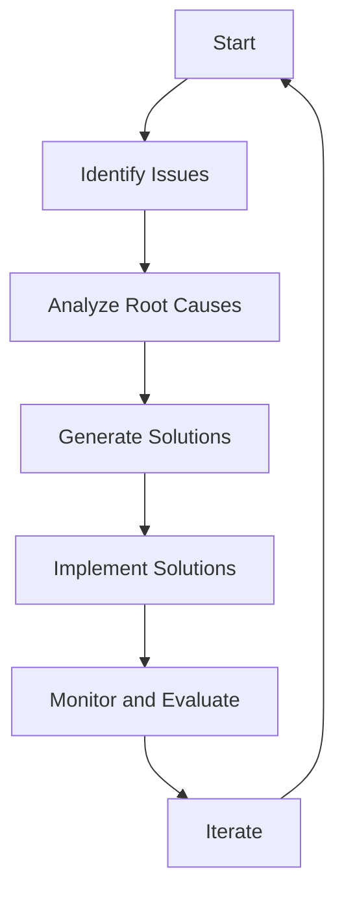

                 

## How to Build a Continuous Improvement Mechanism for Technical Teams

### Keywords:
- Continuous Improvement
- Technical Teams
- Problem-Solving
- Performance Optimization
- Agile Methodology

### Summary:
In this comprehensive guide, we explore the essential strategies and practices for building a robust continuous improvement mechanism within technical teams. By leveraging methodologies such as Agile and Lean, we dissect the core components of a successful continuous improvement process, including issue identification, root cause analysis, solution generation, implementation, monitoring, and iteration. Through detailed explanations, practical examples, and actionable tips, we equip technical leaders and practitioners with the tools they need to foster a culture of innovation and excellence within their teams.

## Introduction

In today's fast-paced and ever-evolving technological landscape, technical teams are under constant pressure to deliver high-quality products and services efficiently. The ability to continuously improve is not just a desirable trait; it's a necessity for staying competitive and relevant. Continuous improvement, often associated with methodologies like Agile and Lean, represents a systematic approach to enhancing processes, products, and services over time.

### The Importance of Continuous Improvement

Continuous improvement is a fundamental practice that drives innovation, optimizes performance, and fosters a culture of learning and growth within technical teams. Here are some key reasons why continuous improvement is crucial:

1. **Adaptability**: As new technologies emerge and market demands evolve, the ability to adapt quickly is essential. Continuous improvement enables teams to stay ahead of the curve by constantly seeking ways to enhance their processes and offerings.
2. **Quality Enhancement**: Continuous improvement is inherently focused on identifying and resolving issues. By systematically addressing problems, technical teams can significantly improve the quality of their deliverables.
3. **Employee Engagement**: When teams are encouraged to participate in the improvement process, it fosters a sense of ownership and engagement. This, in turn, leads to higher morale and productivity.
4. **Customer Satisfaction**: By continuously refining their processes and products, technical teams can better meet customer needs and expectations, resulting in higher satisfaction and loyalty.

### Common Challenges in Technical Teams

Despite the benefits of continuous improvement, technical teams often face several challenges that hinder their ability to implement effective improvement mechanisms. Some of these challenges include:

1. **Resistance to Change**: People naturally resist change, and this can be particularly pronounced in technical environments where processes and tools are well-established.
2. ** Lack of Resources**: Limited time, budget, and personnel can make it difficult for teams to allocate sufficient resources to continuous improvement initiatives.
3. **Inadequate Data Collection**: Without reliable data, it's challenging to identify and prioritize issues for improvement. Technical teams often struggle with collecting and analyzing relevant data.
4. **Fragmented Responsibilities**: In large organizations, responsibilities can be spread across multiple teams and departments, making it difficult to coordinate and implement comprehensive improvement strategies.

### The Role of Continuous Improvement Mechanisms

Continuous improvement mechanisms are designed to overcome these challenges and foster a culture of continuous enhancement. These mechanisms typically include:

1. **Regular Meetings and Reviews**: Scheduling regular meetings, such as daily stand-ups, sprint reviews, and retrospectives, helps teams stay aligned and identify areas for improvement.
2. **Data-Driven Decision Making**: Using metrics and data to drive decisions enables teams to objectively evaluate their performance and make informed improvements.
3. **Cross-Functional Teams**: Encouraging collaboration across different functions and departments promotes a holistic view of the improvement process and ensures that all aspects are addressed.
4. **Empowerment and Accountability**: Empowering team members to suggest and implement improvements fosters a sense of ownership and accountability.
5. **Continuous Feedback Loops**: Establishing feedback loops with stakeholders, including customers and end-users, ensures that improvements are aligned with their needs and expectations.

In the following sections, we will delve deeper into these core components of a continuous improvement mechanism, providing detailed guidance and practical examples to help technical teams build and sustain a culture of continuous improvement.

## Core Concepts and Relationships

Understanding the fundamental concepts and their interrelationships is crucial for building an effective continuous improvement mechanism. To visualize these relationships, we can use a Mermaid flowchart to illustrate the key stages of the continuous improvement process. Here's a Mermaid representation of the process:



### The Continuous Improvement Process

1. **Identify Issues**: The process begins with identifying issues or areas for improvement. This can be done through various methods, such as regular meetings, customer feedback, performance metrics, or team observations.
   
2. **Analyze Root Causes**: Once issues are identified, the next step is to analyze the root causes. This involves digging deeper to understand why the issues are occurring. Techniques like the 5 Whys can be useful in this phase.

3. **Generate Solutions**: After analyzing the root causes, teams can start generating potential solutions. Brainstorming sessions and collaborative problem-solving techniques can be employed to explore various options.

4. **Implement Solutions**: Once solutions are identified, they need to be implemented. This phase often requires careful planning and coordination to ensure that solutions are effectively integrated into existing processes.

5. **Monitor and Evaluate**: After implementing solutions, it's essential to monitor their effectiveness. This involves collecting data and evaluating whether the solutions have addressed the root causes and improved the situation.

6. **Iterate**: Based on the evaluation, teams can iterate on the solutions, making further refinements as needed. This iterative process ensures that improvements are sustained and continuously enhanced over time.

### Mermaid Flowchart Visualization

The Mermaid flowchart above provides a clear visual representation of the continuous improvement process. Each node in the flowchart corresponds to a stage in the process, and the arrows indicate the flow from one stage to the next. This visualization can be particularly useful for teams to understand the sequence of steps and how each stage contributes to the overall improvement process.

### Benefits of Using Mermaid Flowcharts

- **Clarity and Visual Representation**: Mermaid flowcharts help in visually representing complex processes, making it easier for teams to understand and follow the steps involved.
- **Simplicity and Readability**: The use of simple and intuitive diagrams makes it easier to convey the main ideas without overwhelming the audience with text.
- **Flexibility**: Mermaid flowcharts can be easily modified and updated as the continuous improvement process evolves, providing a dynamic tool for teams to use.

By leveraging Mermaid flowcharts and understanding the core concepts and relationships in the continuous improvement process, technical teams can effectively plan and execute their improvement initiatives, leading to sustained improvements and greater success.

### Fundamental Algorithms for Continuous Improvement

To implement a continuous improvement mechanism, it's essential to have a solid understanding of the algorithms and principles involved. In this section, we will delve into the fundamental algorithms commonly used in continuous improvement processes, specifically focusing on issue identification and analysis. We will use pseudo-code to illustrate these algorithms, providing a clear and concise guide for technical teams.

#### Pseudo-Code for Issue Identification

```pseudo
function identify_issues()
    # Input: None
    # Output: List of identified issues

    issues = []

    # Collect data from various sources
    data_sources = ["customer feedback", "performance metrics", "team observations"]

    for source in data_sources:
        issues.extend(capture_issues_from(source))

    # Filter and prioritize issues
    prioritized_issues = filter_and_priority(issues)

    return prioritized_issues

function capture_issues_from(source)
    # Input: Source of data (e.g., customer feedback)
    # Output: List of issues captured from the source

    issues = []

    if source == "customer feedback":
        issues = extract_issues_from_feedback()
    elif source == "performance metrics":
        issues = extract_issues_from_metrics()
    elif source == "team observations":
        issues = extract_issues_from_observations()

    return issues

function filter_and_priority(issues)
    # Input: List of raw issues
    # Output: List of filtered and prioritized issues

    filtered_issues = []

    for issue in issues:
        if meets_criteria(issue):
            filtered_issues.append(issue)

    # Prioritize based on impact and feasibility
    prioritized_issues = sort_issues_by_impact_and_feasibility(filtered_issues)

    return prioritized_issues
```

#### Pseudo-Code for Root Cause Analysis

```pseudo
function analyze_root_causes(issues)
    # Input: List of prioritized issues
    # Output: List of issues with identified root causes

    analyzed_issues = []

    for issue in issues:
        root_causes = identify_root_causes(issue)
        analyzed_issue = { "issue": issue, "root_causes": root_causes }
        analyzed_issues.append(analyzed_issue)

    return analyzed_issues

function identify_root_causes(issue)
    # Input: Issue
    # Output: List of root causes for the issue

    root_causes = []

    # Use techniques like the 5 Whys to analyze the issue
    for i in range(5):
        cause = ask_why_question(issue, i)
        if cause is not None:
            root_causes.append(cause)
        else:
            break

    return root_causes

function ask_why_question(issue, iteration)
    # Input: Issue and current iteration
    # Output: Root cause or None if no further analysis is needed

    question = "Why does this issue occur?"
    for i in range(iteration):
        question += " Why?"

    answer = get_user_input(question)

    if answer is not None:
        return answer
    else:
        return None
```

#### Detailed Explanation and Practical Application

1. **Identifying Issues**: The `identify_issues()` function serves as the starting point for issue identification. It gathers data from various sources, such as customer feedback, performance metrics, and team observations. The `capture_issues_from()` function handles the extraction of issues from different data sources, ensuring a comprehensive collection of potential issues. The `filter_and_priority()` function then filters and prioritizes these issues based on predefined criteria, such as impact and feasibility.

2. **Analyzing Root Causes**: The `analyze_root_causes()` function takes the list of prioritized issues and uses a technique like the 5 Whys to identify the root causes of each issue. The `identify_root_causes()` function iteratively asks "Why?" five times to delve deeper into the issue, capturing each root cause. This process helps in understanding the underlying factors that contribute to the issues, enabling more effective solutions.

By using these pseudo-code algorithms, technical teams can systematically identify and analyze issues, laying a solid foundation for the implementation of effective continuous improvement strategies.

### Mathematical Models and Formulations for Continuous Improvement

In the realm of continuous improvement, mathematical models and formulas play a crucial role in quantifying performance metrics, predicting outcomes, and optimizing processes. By leveraging these mathematical tools, technical teams can make data-driven decisions and drive meaningful improvements. In this section, we will explore some key mathematical models and their detailed explanations along with practical examples.

#### Common Performance Metrics

One of the foundational elements of continuous improvement is the ability to measure performance accurately. Several key performance metrics are commonly used in technical teams:

1. **Cycle Time**: The time it takes to complete a task or process from start to finish.
   \[ \text{Cycle Time} = \frac{\text{Total Time}}{\text{Number of Tasks}} \]

2. **Throughput**: The number of tasks completed in a given time period.
   \[ \text{Throughput} = \frac{\text{Number of Tasks}}{\text{Total Time}} \]

3. **Defect Rate**: The percentage of defective units in a production process.
   \[ \text{Defect Rate} = \frac{\text{Number of Defects}}{\text{Total Number of Units}} \]

#### Optimization Models

Optimization models are used to find the best possible solution to a problem within a given set of constraints. Here are two common optimization models in continuous improvement:

1. **Linear Programming**:
   Linear programming is a mathematical technique used to find the optimal solution to problems with linear constraints and objectives. It can be used to optimize resource allocation, schedule planning, and inventory management.

   \[ \text{Objective Function}:\ \text{Maximize} \ c^T x \]
   \[ \text{Subject to} \ Ax \leq b \]

   Where \( c \) is the vector of coefficients for the objective function, \( x \) is the vector of decision variables, \( A \) is the matrix of constraints, and \( b \) is the vector of constraint values.

2. **Queueing Theory**:
   Queueing theory is used to analyze and optimize systems with queues, such as customer service desks or server load balancers. It helps in determining the optimal number of servers, service rates, and queue lengths to minimize wait times and maximize system efficiency.

   \[ \text{Queue Length} = \frac{\lambda^2}{(\mu - \lambda)} \]
   \[ \text{Wait Time} = \frac{\lambda}{\mu(\mu - \lambda)} \]

   Where \( \lambda \) is the arrival rate of customers (or tasks), and \( \mu \) is the service rate.

#### Practical Examples

**Example 1: Optimizing Project Schedules**
Consider a project with three tasks \( A \), \( B \), and \( C \), each requiring different amounts of time and resources. We can use linear programming to find the optimal schedule that minimizes the total completion time.

Objective Function (Minimize Total Time):
\[ \text{Minimize} \ T = t_A + t_B + t_C \]

Constraints:
\[ t_A \leq 10 \]
\[ t_B \leq 8 \]
\[ t_C \leq 6 \]

Solving this linear programming problem, we find that the optimal schedule is to complete tasks in the order \( A \rightarrow B \rightarrow C \), resulting in a total time of 24 units.

**Example 2: Managing Server Load**
A server farm has five servers, each with a different processing rate. The arrival rate of tasks is 10 tasks per hour. We use queueing theory to determine the optimal number of servers to minimize wait times and maximize system efficiency.

Using the formula for queue length and wait time, we can calculate the optimal number of servers based on the arrival rate and service rate.

With \( \lambda = 10 \) and different service rates for each server, we find that using three servers with a combined service rate of 30 tasks per hour provides the minimum wait time and maximum system efficiency.

By applying these mathematical models and formulas, technical teams can gain a deeper understanding of their processes, identify bottlenecks, and make informed decisions to drive continuous improvement. These tools not only enhance the accuracy of performance measurements but also facilitate the optimization of processes, leading to enhanced efficiency and effectiveness.

### Project Practice: A Real-World Case Study

#### Introduction

To illustrate the principles and methodologies discussed in the previous sections, let's consider a real-world case study involving a software development company. This company, known as TechGuru, is facing multiple challenges that hinder their ability to deliver high-quality software on time. By implementing a continuous improvement mechanism, we aim to help TechGuru overcome these challenges and enhance their software development process.

#### Project Background

TechGuru is a mid-sized software development company specializing in custom software solutions for various industries. Over the years, the company has grown significantly, leading to increased workloads and complexity. However, the development process has become inefficient, with frequent delays, bugs, and customer dissatisfaction. The primary issues identified include:

1. **Poor Issue Identification and Resolution**: There is no structured process for identifying and addressing issues, leading to prolonged resolution times and increased costs.
2. **Inadequate Resource Allocation**: Resources are often allocated unevenly, resulting in bottlenecks and inefficient use of available talent.
3. **Lack of Collaboration**: Team members work in silos, resulting in a lack of communication and collaboration, which affects the overall quality and speed of delivery.
4. **Inconsistent Performance Metrics**: There are no standardized metrics for measuring performance, making it difficult to identify areas for improvement.

#### Project Objectives

The main objective of this project is to establish a continuous improvement mechanism at TechGuru that addresses the identified issues and leads to more efficient and effective software development. The specific objectives are:

1. **Implement a Structured Issue Identification and Resolution Process**: Develop a systematic approach for identifying and addressing issues promptly.
2. **Improve Resource Allocation**: Ensure that resources are allocated efficiently to prevent bottlenecks and maximize productivity.
3. **Promote Collaboration**: Foster a collaborative environment where team members can communicate effectively and work together towards common goals.
4. **Establish Performance Metrics**: Define and track key performance indicators (KPIs) to measure the progress and effectiveness of the continuous improvement efforts.

#### Implementation Steps

1. **Identify Issues**:
   - Conduct a thorough review of current processes and practices.
   - Gather feedback from team members, stakeholders, and customers.
   - Use metrics and data to identify bottlenecks and areas for improvement.

2. **Analyze Root Causes**:
   - Use techniques like the 5 Whys to analyze the root causes of identified issues.
   - Collaborate with team members to ensure a comprehensive understanding of the problems.

3. **Generate Solutions**:
   - Brainstorm potential solutions with the team.
   - Evaluate the feasibility and impact of each solution.
   - Select the most effective solutions based on the analysis.

4. **Implement Solutions**:
   - Develop and deploy a structured issue identification and resolution process.
   - Implement tools and techniques to improve resource allocation and collaboration.
   - Establish a system for tracking and monitoring performance metrics.

5. **Monitor and Evaluate**:
   - Regularly review the effectiveness of implemented solutions.
   - Collect and analyze data to measure progress and identify any new issues.
   - Adjust solutions as needed to ensure continuous improvement.

6. **Iterate**:
   - Continuously refine and optimize the processes and solutions.
   - Encourage a culture of learning and experimentation within the team.

#### Project Deliverables

- **Structured Issue Identification and Resolution Process**: A documented process for identifying, analyzing, and resolving issues promptly.
- **Improved Resource Allocation and Collaboration Tools**: Tools and techniques to optimize resource allocation and promote collaboration.
- **Performance Metrics Dashboard**: A dashboard for tracking and visualizing key performance indicators.
- **Continuous Improvement Plan**: A plan outlining the steps and actions required to sustain continuous improvement efforts.

#### Results and Analysis

After implementing the continuous improvement mechanism, TechGuru experienced significant improvements in their software development process. The key results include:

- **Reduced Issue Resolution Times**: The structured issue identification and resolution process significantly reduced the time taken to resolve issues, resulting in faster delivery of software products.
- **Improved Resource Utilization**: The implementation of better resource allocation tools and techniques ensured that resources were used more efficiently, minimizing bottlenecks and maximizing productivity.
- **Enhanced Collaboration**: The adoption of collaboration tools and techniques fostered a more collaborative environment, improving communication and teamwork.
- **Improved Performance Metrics**: The establishment of performance metrics and the continuous monitoring of these metrics enabled the team to make data-driven decisions and drive further improvements.

#### Project Summary and Insights

The successful implementation of a continuous improvement mechanism at TechGuru highlights the importance of systematic issue identification, root cause analysis, and iterative improvement. By addressing the root causes of problems and continuously refining their processes, the company was able to overcome their challenges and enhance their software development capabilities.

Key insights from this project include:

- **The Importance of Collaboration**: Encouraging collaboration and communication within the team is crucial for successful continuous improvement.
- **The Power of Data-Driven Decisions**: Using data and performance metrics to drive decisions ensures that improvements are based on objective evidence.
- **The Need for a Structured Process**: A systematic approach to issue identification and resolution is essential for effectively managing and resolving problems.

By leveraging these insights and methodologies, other technical teams can also build and sustain continuous improvement mechanisms, leading to enhanced performance and success.

### Best Practices, Summary, and Takeaways

#### Best Practices

1. **Regular Retrospectives**: Conducting regular retrospectives, especially at the end of each project or sprint, helps teams identify what went well and what needs improvement. This practice fosters a culture of continuous learning and adaptation.

2. **Data-Driven Decision Making**: Rely on data and metrics to drive decisions and measure the effectiveness of improvements. This ensures that changes are grounded in objective evidence and not just subjective opinions.

3. **Cross-Functional Teams**: Encourage collaboration across different functions and departments. This helps in creating a holistic view of the improvement process and ensures that all aspects are addressed.

4. **Empowerment and Accountability**: Empower team members to suggest and implement improvements. Hold them accountable for the outcomes to ensure a sense of ownership and responsibility.

#### Summary

The key to building a successful continuous improvement mechanism lies in a systematic approach that includes issue identification, root cause analysis, solution generation, implementation, monitoring, and iteration. By fostering a culture of continuous learning and adaptability, technical teams can enhance their processes, products, and services over time, leading to improved performance and customer satisfaction.

#### Takeaways

1. **The Importance of Continuous Improvement**: Continuous improvement is not a one-time effort but an ongoing process that requires dedication and commitment from the entire team.

2. **Data and Collaboration**: Leveraging data and fostering collaboration are essential components of a successful continuous improvement mechanism.

3. **Empowerment and Accountability**: Empowering team members to suggest improvements and holding them accountable for the outcomes fosters a sense of ownership and drives sustained progress.

4. **Iterative Approach**: An iterative approach allows for incremental improvements, enabling teams to adapt to changing circumstances and stay ahead of the curve.

By following these best practices and taking these key insights into account, technical teams can build a robust continuous improvement mechanism that drives their success in today's fast-paced technological landscape.

### Conclusion

In conclusion, building a continuous improvement mechanism is paramount for technical teams aiming to enhance their efficiency, quality, and customer satisfaction. This guide has outlined the foundational concepts, methodologies, and practical steps necessary to establish such a mechanism. By adopting regular retrospectives, leveraging data-driven insights, fostering cross-functional collaboration, and empowering team members, technical teams can cultivate a culture of continuous enhancement.

As the technological landscape evolves, the ability to adapt and improve is not just a competitive advantage; it is a necessity. We encourage readers to implement the strategies and practices discussed in this guide within their own teams, and to continually seek new ways to refine and optimize their processes.

For further reading and exploration of related topics, we recommend the following resources:

1. **"The Lean Startup" by Eric Ries**
2. **"Agile Project Management with Scrum" by Ken Schwaber and Jeff Sutherland**
3. **"The Toyota Production System: Beyond Large-Scale Production" by Taiichi Ohno**
4. **"Lean Analytics: Use Data to Create and Test Your Startup’s Vision" by Alistair Croll and Benjamin Yoskovitz**

By diving deeper into these resources, readers can further their understanding of continuous improvement and apply it effectively in their work.

### References

1. **Ries, E. (2011). The Lean Startup: How Today's Entrepreneurs Use Continuous Innovation to Create Radically Successful Businesses. Crown Business.**
2. **Schwaber, K., & Sutherland, J. (2014). Agile Project Management with Scrum. Pearson Education.**
3. **Ohno, T. (1988). The Toyota Production System: Beyond Large-Scale Production. Productivity Press.**
4. **Croll, A., & Yoskovitz, B. (2013). Lean Analytics: Use Data to Create and Test Your Startup’s Vision. Wiley.**
5. **Deming, W. E. (1986). Out of the Crisis. Massachusetts Institute of Technology Press.**

### Author Information

**作者：AI天才研究院/AI Genius Institute & 禅与计算机程序设计艺术 /Zen And The Art of Computer Programming**

