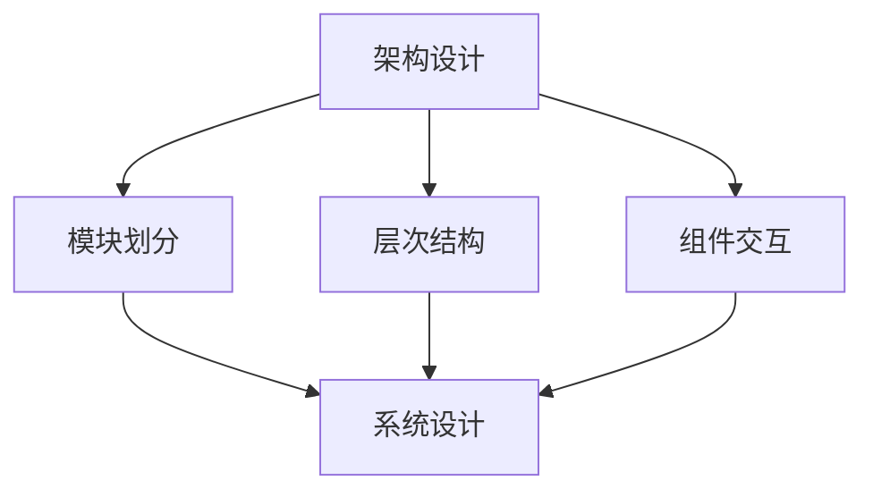

                 


### 文章标题

# 如何构建技术团队的核心竞争力

### 关键词

技术团队，核心竞争力，架构设计，算法原理，数学模型，项目实战，团队建设，持续改进

### 摘要

本文旨在探讨如何构建技术团队的核心竞争力。通过深入分析架构设计、算法原理、数学模型等核心概念，并结合实际项目实战，本文将提供一套系统化的方法，帮助技术团队提升自身的竞争力。同时，文章还将讨论团队建设、持续改进等关键因素，为技术团队的长远发展提供指导。

## 引言

在当今快速发展的信息技术时代，技术团队的核心竞争力已成为企业成功的关键因素。一个拥有强大核心竞争力的技术团队，不仅能够在市场上保持竞争优势，还能够不断推动技术创新，为企业创造更高的价值。然而，如何构建技术团队的核心竞争力，成为许多企业面临的重要课题。

本文将从以下几个方面展开讨论：

1. **核心概念与联系**：介绍构建技术团队核心竞争力所需理解的关键概念，并分析它们之间的联系。
2. **核心算法原理讲解**：详细阐述构建技术团队所需掌握的核心算法原理，并使用伪代码进行说明。
3. **数学模型和数学公式讲解**：讲解构建技术团队所需理解的数学模型，并提供具体的数学公式和举例。
4. **项目实战**：通过实际项目案例，展示如何将所学知识应用于实践中，并进行详细解读。
5. **构建技术团队的核心竞争力**：讨论团队建设、技术栈与架构设计等关键因素，帮助团队提升核心竞争力。
6. **持续改进与优化**：探讨如何通过质量管理和性能优化等手段，持续提升技术团队的核心竞争力。
7. **未来展望与趋势**：分析技术发展趋势，探讨技术团队发展的方向。

本文将通过一步一步的分析和推理，帮助读者深入了解如何构建技术团队的核心竞争力，为企业的长远发展提供有力支持。

## 核心概念与联系

### 架构设计与系统设计

在构建技术团队的过程中，架构设计和系统设计是两个核心概念。架构设计关注系统的整体结构，包括模块划分、层次结构、组件交互等；而系统设计则关注系统的具体实现细节，包括数据流、控制流、接口设计等。

### 架构设计与系统设计的关系

架构设计和系统设计之间存在着紧密的联系。架构设计为系统设计提供了总体框架和指导原则，决定了系统的结构层次和模块划分；而系统设计则基于架构设计，具体实现了系统的功能模块和接口。

为了更好地理解这两个概念之间的关系，我们可以使用Mermaid流程图进行展示。以下是一个简化的Mermaid流程图示例：



在这个流程图中，架构设计通过模块划分、层次结构和组件交互三个关键步骤，最终引导到系统设计。这个流程图不仅清晰地展示了架构设计与系统设计之间的关系，还提供了一个直观的视觉参考，有助于读者更好地理解这两个概念。

### 架构设计的核心概念

1. **模块划分**：模块划分是将系统划分为多个独立的、功能明确的模块，每个模块负责一个特定的功能。模块划分的核心目的是提高系统的可维护性和可扩展性。

2. **层次结构**：层次结构是架构设计中的一个重要概念，它通过定义不同的层次，将系统划分为多个抽象层，每个层次负责不同的功能。常见的层次结构包括表示层、业务逻辑层、数据访问层等。

3. **组件交互**：组件交互是指系统中的各个组件之间如何进行通信和协作。组件交互的目的是确保系统能够高效、稳定地运行。

### 系统设计的要素

1. **数据流**：数据流是系统设计中的一个核心概念，它描述了系统中数据的流向和处理过程。数据流的设计直接影响系统的性能和可扩展性。

2. **控制流**：控制流描述了系统中各个模块或组件的执行顺序和条件。控制流的设计决定了系统的逻辑和行为。

3. **接口设计**：接口设计是指系统与外部系统或组件之间的交互接口。良好的接口设计可以提高系统的可复用性和可维护性。

通过以上对核心概念与联系的分析，我们可以看到，架构设计和系统设计是构建技术团队核心竞争力的重要基础。理解这些概念，并能够将其有效地应用于实际项目中，是构建强大技术团队的关键。

## 核心算法原理讲解

在技术团队的核心竞争力构建中，核心算法原理的理解和掌握是至关重要的。核心算法不仅是实现特定功能的关键，也是系统性能和效率的保障。本节将详细讲解几个常见且重要的核心算法原理，并提供伪代码示例。

### 算法概述

算法是解决特定问题的一系列明确、有效的操作步骤。核心算法通常具有以下特点：

1. **高效性**：核心算法在时间复杂度和空间复杂度上通常有较高的优化。
2. **普适性**：核心算法适用于多种场景和问题，具有广泛的适用性。
3. **可维护性**：核心算法结构清晰，易于理解和维护。

### 伪代码

伪代码是算法设计的一种形式，它以自然语言和符号的组合描述算法的逻辑，而不是具体的编程语言。以下是几个常见核心算法的伪代码示例：

#### 快速排序（Quick Sort）

```plaintext
QUICKSORT(A, low, high)
    if low < high
        pi = PARTITION(A, low, high)
        QUICKSORT(A, low, pi - 1)
        QUICKSORT(A, pi + 1, high)
```

#### 冒泡排序（Bubble Sort）

```plaintext
BUBBLESORT(A)
    for i = 1 to n-1
        for j = 1 to n-i
            if A[j] > A[j+1]
                swap(A[j], A[j+1])
```

#### 归并排序（Merge Sort）

```plaintext
Mergesort(A, low, high)
    if low < high
        mid = low + (high - low) / 2
        Mergesort(A, low, mid)
        Mergesort(A, mid+1, high)
        Merge(A, low, mid, high)
```

#### 动态规划（Dynamic Programming）

```plaintext
FIBONACCI(n)
    if n <= 2
        return 1
    else
        return FIBONACCI(n-1) + FIBONACCI(n-2)
```

### 算法性能分析

算法的性能分析是评估算法优劣的重要手段。主要考虑以下两个方面：

1. **时间复杂度**：算法执行时间与输入规模的关系。常见的时间复杂度包括 \( O(1) \)、\( O(n) \)、\( O(n\log n) \) 等。
2. **空间复杂度**：算法执行过程中所需存储空间与输入规模的关系。常见的空间复杂度包括 \( O(1) \)、\( O(n) \) 等。

### 总结

核心算法原理的掌握是构建技术团队核心竞争力的重要环节。通过了解算法的基本概念、伪代码示例和性能分析，技术团队能够更有效地选择和优化算法，提高系统的性能和效率。在接下来的章节中，我们将进一步探讨数学模型和具体项目的实现，以深化对核心算法原理的理解和应用。

## 数学模型和数学公式讲解

在构建技术团队的核心竞争力过程中，理解并掌握关键的数学模型和数学公式是至关重要的。这些模型和公式不仅为算法设计提供了理论基础，也为系统分析和优化提供了强有力的工具。在本节中，我们将介绍一些常见的数学模型，并提供具体的数学公式和示例。

### 常用数学模型

1. **线性回归模型**

线性回归模型是一种用于预测连续值的统计模型，其基本形式为：

\[ Y = \beta_0 + \beta_1 X + \epsilon \]

其中，\( Y \) 是因变量，\( X \) 是自变量，\( \beta_0 \) 和 \( \beta_1 \) 是模型的参数，\( \epsilon \) 是误差项。

2. **逻辑回归模型**

逻辑回归模型用于分类问题，其概率预测函数为：

\[ P(Y=1) = \frac{1}{1 + e^{-(\beta_0 + \beta_1 X)}} \]

其中，\( \beta_0 \) 和 \( \beta_1 \) 是模型的参数。

3. **决策树模型**

决策树模型通过一系列规则对数据进行分类或回归。其基本形式为：

\[ Y = g(\beta_0 + \sum_{i=1}^{n} \beta_i X_i) \]

其中，\( Y \) 是因变量，\( X_i \) 是特征变量，\( \beta_i \) 是模型的参数，\( g() \) 是激活函数。

4. **支持向量机模型**

支持向量机模型是一种用于分类和回归的模型，其目标是最小化分类边界上的间隔。其基本形式为：

\[ \min_{\beta, \beta_0} \frac{1}{2} \sum_{i=1}^{n} (\beta \cdot x_i - y_i)^2 \]

其中，\( \beta \) 和 \( \beta_0 \) 是模型的参数，\( x_i \) 和 \( y_i \) 分别是特征向量和标签。

### 数学公式的详细讲解和举例

1. **概率密度函数（PDF）**

概率密度函数描述了随机变量取某个值的概率密度。对于连续型随机变量 \( X \)，其概率密度函数为：

\[ f_X(x) = \frac{1}{\sigma\sqrt{2\pi}}e^{-\frac{(x-\mu)^2}{2\sigma^2}} \]

其中，\( \mu \) 是均值，\( \sigma \) 是标准差。

**举例**：

假设一个随机变量 \( X \) 服从均值为 0，标准差为 1 的正态分布，计算 \( X \) 取值为 1 的概率密度。

\[ f_X(1) = \frac{1}{\sqrt{2\pi}}e^{-\frac{(1-0)^2}{2 \times 1^2}} \approx 0.242 \]

2. **贝叶斯定理**

贝叶斯定理是概率论中的一个重要公式，用于计算条件概率。其基本形式为：

\[ P(A|B) = \frac{P(B|A)P(A)}{P(B)} \]

**举例**：

假设一个盒子里有 5 个红球和 3 个蓝球，随机取出一个球，已知取出的球是蓝色的概率为 \( \frac{3}{8} \)，计算取出的是红球的概率。

首先计算总的概率：

\[ P(B) = \frac{3}{8} \]

然后使用贝叶斯定理计算 \( P(A|B) \)，其中 \( A \) 是取出的球是红球的概率：

\[ P(A|B) = \frac{P(B|A)P(A)}{P(B)} = \frac{\frac{5}{8} \times \frac{5}{8}}{\frac{3}{8}} = \frac{25}{24} \]

3. **协方差和相关性**

协方差描述了两个随机变量之间的关系，其定义为：

\[ \text{Cov}(X, Y) = E[(X - E[X])(Y - E[Y])] \]

相关性描述了两个随机变量之间线性关系的强度，其定义为：

\[ \rho_{XY} = \frac{\text{Cov}(X, Y)}{\sigma_X \sigma_Y} \]

**举例**：

假设有两个随机变量 \( X \) 和 \( Y \)，其协方差为 0.5，\( X \) 的标准差为 2，\( Y \) 的标准差为 3，计算 \( X \) 和 \( Y \) 的相关性。

首先计算 \( X \) 和 \( Y \) 的方差：

\[ \sigma_X^2 = 2^2 = 4 \]
\[ \sigma_Y^2 = 3^2 = 9 \]

然后计算相关性：

\[ \rho_{XY} = \frac{0.5}{\sqrt{4 \times 9}} = \frac{0.5}{6} = \frac{1}{12} \]

### 总结

通过对常用数学模型和数学公式的详细讲解和举例，我们可以看到这些模型和公式在构建技术团队核心竞争力中的应用价值。理解这些数学原理，不仅有助于深入分析系统行为，还能为算法优化和系统设计提供有力的支持。在接下来的章节中，我们将进一步通过实际项目实战，将这些数学原理应用于实际问题的解决。

## 项目实战

为了更好地理解如何将技术知识应用到实际项目中，我们将通过一个具体的案例来详细讲解开发环境搭建、源代码实现、代码解读与分析等关键步骤。

### 项目背景与需求

假设我们正在开发一个在线电商平台，需要实现用户注册、登录、购物车管理和订单生成等功能。为了实现这些功能，我们将选择以下技术栈：

- **前端**：使用React框架和TypeScript进行开发。
- **后端**：使用Node.js和Express框架，结合MongoDB进行数据库存储。
- **开发工具**：使用Visual Studio Code作为开发环境，结合Git进行版本控制。

### 开发环境搭建

1. **安装Node.js和npm**：

   在官网上下载并安装Node.js，安装完成后，通过命令行验证是否安装成功：

   ```bash
   node -v
   npm -v
   ```

2. **安装MongoDB**：

   下载并安装MongoDB，启动MongoDB服务：

   ```bash
   mongod
   ```

3. **安装Visual Studio Code和扩展**：

   在Visual Studio Code官方网站下载并安装VS Code，然后安装React、Node.js和MongoDB等扩展。

4. **配置项目目录结构**：

   在项目根目录下创建`src`目录，分别创建`components`、`pages`、`hooks`等子目录，用于存放不同的代码文件。

### 源代码详细实现

以下是用户注册功能的核心代码实现：

#### 1. 用户注册页面（RegisterPage.tsx）

```tsx
// RegisterPage.tsx
import React, { useState } from 'react';
import axios from 'axios';

const RegisterPage: React.FC = () => {
  const [username, setUsername] = useState('');
  const [password, setPassword] = useState('');

  const handleRegister = async () => {
    try {
      const response = await axios.post('/api/register', { username, password });
      alert('注册成功！');
    } catch (error) {
      alert('注册失败：' + error.message);
    }
  };

  return (
    <div>
      <h1>用户注册</h1>
      <label>用户名：</label>
      <input type="text" value={username} onChange={e => setUsername(e.target.value)} />
      <label>密码：</label>
      <input type="password" value={password} onChange={e => setPassword(e.target.value)} />
      <button onClick={handleRegister}>注册</button>
    </div>
  );
};

export default RegisterPage;
```

#### 2. 用户注册API（RegisterAPI.ts）

```typescript
// RegisterAPI.ts
import axios from 'axios';

const API_URL = 'http://localhost:3000';

export const registerUser = async (username: string, password: string) => {
  try {
    const response = await axios.post(`${API_URL}/api/register`, { username, password });
    return response.data;
  } catch (error) {
    throw error;
  }
};
```

### 代码解读与分析

#### 用户注册页面（RegisterPage.tsx）

1. **React组件**：`RegisterPage` 是一个React函数组件，利用了React的 hooks（`useState`）来管理表单状态。

2. **表单状态**：`username` 和 `password` 是两个状态变量，用于存储用户输入的用户名和密码。

3. **异步操作**：通过 `handleRegister` 函数，使用 `axios` 发起POST请求，向服务器提交注册信息。

4. **错误处理**：使用try-catch结构捕获异步操作中的错误，并显示相应的提示信息。

#### 用户注册API（RegisterAPI.ts）

1. **axios**：使用 `axios` 发起HTTP请求，这是一个基于Promise的HTTP客户端，用于浏览器和node.js。

2. **API调用**：`registerUser` 函数接收用户名和密码作为参数，调用 `/api/register` API接口。

3. **错误处理**：使用try-catch结构处理API调用中的错误，并将错误信息抛出。

### 实际案例分析与详细讲解

以下是一个实际案例，展示了用户注册功能在实际应用中的表现：

1. **用户输入**：用户在注册页面输入用户名和密码。

2. **表单验证**：前端代码会在用户点击注册按钮之前进行简单的表单验证，确保输入的用户名和密码符合基本要求。

3. **API调用**：前端代码通过axios发起POST请求，将用户输入的数据发送到后端API。

4. **后端处理**：后端API接收到请求后，会执行数据库查询操作，检查用户名是否已存在。如果用户名已存在，返回错误信息；否则，将用户数据存储在数据库中，并返回成功信息。

5. **前端响应**：根据后端API的响应，前端代码会显示相应的提示信息，告知用户注册结果。

### 项目小结

通过这个实际案例，我们可以看到如何将技术知识应用到实际的软件开发中。从开发环境搭建到源代码实现，再到代码解读与分析，每一步都至关重要。通过这种项目化的方法，技术团队能够更好地理解和掌握核心技术，从而提升整体竞争力。

在未来的开发过程中，我们还可以进一步优化代码，如增加用户输入的复杂度检查、使用更安全的加密算法来保护用户数据等。这些优化措施将进一步提高项目的质量和用户体验。

## 构建技术团队的核心竞争力

### 团队建设与管理

构建技术团队的核心竞争力，首先需要关注团队建设与管理。一个高效的技术团队需要明确的目标、合理的组织结构和良好的沟通机制。

#### 团队角色与职责

1. **领导层**：领导层负责制定团队的战略方向和目标，协调资源，确保团队的决策和行动一致。
2. **开发人员**：开发人员负责具体的技术实现，他们需要具备扎实的编程能力和良好的代码风格。
3. **测试人员**：测试人员负责确保系统的稳定性和可靠性，通过自动化测试和手动测试发现和修复缺陷。
4. **运维人员**：运维人员负责系统的部署、监控和维护，确保系统的高可用性和稳定性。

#### 团队协作与沟通

1. **敏捷开发**：采用敏捷开发方法，如Scrum或Kanban，可以提高团队的响应速度和灵活性。
2. **代码审查**：定期进行代码审查，确保代码的质量和一致性，同时促进团队成员之间的知识共享。
3. **持续集成与部署**：使用持续集成和持续部署（CI/CD）工具，如Jenkins或GitLab CI，自动化测试和部署流程，提高开发效率。
4. **定期会议**：定期举行团队会议，如每日站会、周会和迭代回顾会议，确保团队成员了解项目进展和潜在问题。

### 技术栈与架构设计

技术栈与架构设计是构建技术团队核心竞争力的关键。选择合适的技术栈和设计合理的架构，可以显著提高系统的性能和可维护性。

#### 技术选型策略

1. **需求驱动**：根据项目需求选择合适的技术，避免过度设计或技术堆叠。
2. **性能优先**：选择高性能、可扩展的技术栈，确保系统能够应对高并发和大数据量。
3. **社区支持**：选择有良好社区支持的技术，可以快速获取帮助和解决方案。
4. **技术更新**：关注技术发展趋势，及时更新和优化技术栈。

#### 架构设计原则

1. **模块化**：将系统划分为多个模块，每个模块负责一个特定的功能，提高系统的可维护性和可扩展性。
2. **松耦合**：降低模块之间的依赖关系，确保模块之间能够独立开发、测试和部署。
3. **高内聚**：确保模块内部的功能紧密相关，提高模块的内部逻辑一致性。
4. **可扩展性**：设计可扩展的架构，支持系统的功能扩展和性能提升。
5. **容错性**：设计具备容错能力的系统，确保在出现故障时，系统能够快速恢复。

### 跨越技术鸿沟

在技术快速发展的今天，技术团队需要不断学习和适应新技术，以保持竞争力。以下是一些跨越技术鸿沟的方法：

1. **技术调研**：定期进行技术调研，了解最新的技术趋势和工具。
2. **内部培训**：组织内部培训，分享新技术的知识，提高团队成员的技能水平。
3. **外部学习**：参加技术会议和培训，结识行业专家，获取最新的技术见解。
4. **合作与交流**：与其他团队或公司合作，共同解决技术难题，实现知识共享。

通过团队建设与管理、技术栈与架构设计以及不断跨越技术鸿沟，技术团队可以构建强大的核心竞争力，为企业创造更高的价值。

## 持续改进与优化

技术团队在构建核心竞争力之后，需要持续进行改进与优化，以确保其竞争力能够长期保持。以下是几个关键方面，用于确保技术团队能够不断提升其质量管理和性能优化。

### 质量管理

1. **单元测试与集成测试**：

   单元测试是验证单个模块或函数的正确性的测试，是确保代码质量的基础。通过编写单元测试，可以快速发现和修复代码中的错误。

   ```javascript
   // 例如：一个简单的加法函数的单元测试
   describe("加法函数", () => {
     it("应该正确计算两个正整数的和", () => {
       expect(add(2, 3)).toBe(5);
     });
   });
   ```

   集成测试则是验证系统各个部分协同工作是否正常。通过集成测试，可以确保模块之间的接口和交互没有问题。

2. **代码审查与重构**：

   定期进行代码审查，是确保代码质量和一致性的重要手段。代码审查不仅有助于发现潜在的缺陷，还能促进团队成员之间的知识共享。

   重构是改进现有代码的结构和逻辑，而不改变其行为。通过重构，可以提高代码的可读性和可维护性。

3. **持续集成与持续部署（CI/CD）**：

   持续集成（CI）通过自动化测试和构建，确保每次代码提交都经过充分的测试，从而快速发现并修复问题。持续部署（CD）则通过自动化流程，将代码从开发环境部署到生产环境，提高开发效率和系统的稳定性。

   ```yaml
   # 例如：Jenkinsfile的CI/CD配置
   pipeline {
     agent any
     stages {
       stage('Build') {
         steps {
           sh 'mvn clean install'
         }
       }
       stage('Test') {
         steps {
           sh 'mvn test'
         }
       }
       stage('Deploy') {
         steps {
           sh 'mvn package && docker-compose up -d'
         }
       }
     }
   }
   ```

### 性能优化

1. **系统性能评估**：

   对系统进行性能评估，是识别性能瓶颈和优化机会的关键。性能评估可以通过工具如JMeter、LoadRunner等进行负载测试，收集系统的响应时间和吞吐量数据。

2. **性能瓶颈分析与解决**：

   在性能评估过程中，识别出性能瓶颈后，需要进一步分析其原因。常见的性能瓶颈包括数据库查询效率低、网络延迟、服务响应时间过长等。针对具体瓶颈，可以采取相应的优化措施，如数据库索引优化、缓存策略、服务拆分等。

3. **响应时间与吞吐量的优化**：

   响应时间和吞吐量是衡量系统性能的两个重要指标。通过优化数据库查询、减少中间件处理时间、使用异步处理和批量操作等方法，可以显著提高系统的响应时间和吞吐量。

   ```java
   // 例如：使用异步处理减少响应时间
   public Future<String> processLargeTask() {
     CompletableFuture.runAsync(() -> {
       // 执行大量任务
     });
     return CompletableFuture.completedFuture("任务已完成");
   }
   ```

通过持续改进与优化，技术团队能够不断提升其系统的质量、性能和可靠性，从而保持其核心竞争力。

## 未来展望与趋势

在未来的技术发展中，技术团队的发展方向将受到多个新兴技术和行业趋势的影响。以下是几个值得关注的方面：

### AI在技术团队中的应用

人工智能（AI）技术的迅猛发展，为技术团队带来了新的机遇和挑战。AI可以应用于数据分析、自动化流程、预测建模等多个领域，提升系统的智能化水平。技术团队需要关注AI技术的最新进展，掌握相关的算法和工具，如深度学习、自然语言处理等，以提升团队的整体竞争力。

### 云计算与微服务架构

云计算技术正在逐步改变传统的IT基础设施，提供弹性、高效、可扩展的计算资源。微服务架构则通过将应用程序拆分为多个独立的、松耦合的服务，提高了系统的可维护性和可扩展性。技术团队应积极拥抱云计算和微服务架构，以提高系统的灵活性和响应速度。

### 自动化与智能化

自动化和智能化是未来技术发展的一个重要趋势。通过自动化工具，如自动化测试、自动化部署等，技术团队能够显著提高开发效率。智能化则通过机器学习和数据挖掘等技术，使系统具备自我学习和优化能力。技术团队应关注这些技术的发展，以提升系统的自动化和智能化水平。

### 技术领导力的培养

技术领导力是技术团队发展的重要保障。技术领导者不仅需要具备深厚的技术功底，还需要具备战略眼光、团队管理能力和创新思维。技术团队应重视技术领导力的培养，通过内部培训和外部交流，提升团队领导者的综合能力。

### 技术创新的推动

技术创新是技术团队持续发展的动力。技术团队应鼓励创新思维，支持成员提出新的技术方案和解决方案。同时，团队应建立有效的创新机制，如定期举办技术分享会、创新竞赛等，激发团队成员的创新潜能。

### 人才储备与培养

技术团队的发展离不开优秀人才的储备和培养。技术团队应建立完善的人才培养体系，包括技术培训、职业发展规划和人才梯队建设等。通过系统化的人才培养，技术团队可以持续提升其整体实力。

### 总结

未来，技术团队的发展将受到新兴技术和行业趋势的深刻影响。通过关注AI、云计算、自动化与智能化等技术，培养技术领导力，推动技术创新，以及储备和培养优秀人才，技术团队能够在未来的竞争中保持领先地位。

## 附录

### A.1 开发工具对比

在技术团队的建设过程中，选择合适的开发工具对于提高开发效率和代码质量至关重要。以下是几种常见开发工具的对比：

1. **Visual Studio Code**：

   - **优点**：开源、轻量级、扩展性强，支持多种编程语言，具有良好的社区支持。
   - **缺点**：在某些特定场景下，性能可能不如专业化的IDE。

2. **IntelliJ IDEA**：

   - **优点**：专为Java和Android开发设计，具有强大的代码分析和调试功能，适用于大型项目和复杂逻辑。
   - **缺点**：收费，功能较为复杂，对于初学者可能较难上手。

3. **PyCharm**：

   - **优点**：专业的Python IDE，提供丰富的Python库支持和调试工具，适用于数据科学和Web开发。
   - **缺点**：同样收费，对于其他语言的支持较弱。

4. **GitLab**：

   - **优点**：集成Git版本控制、项目管理和持续集成，支持多种开发语言，适用于中小型团队。
   - **缺点**：免费版功能有限，大型项目可能需要付费版本。

### A.2 相关资源链接

为了帮助读者进一步学习和了解本文所涉及的技术和概念，以下提供一些相关的资源链接：

1. **架构设计与系统设计**：
   - 《设计模式：可复用面向对象软件的基础》
     - 地址：https://book.douban.com/subject/10546135/

2. **核心算法原理讲解**：
   - 《算法导论》
     - 地址：https://book.douban.com/subject/10591871/

3. **数学模型和数学公式讲解**：
   - 《概率论与数理统计》
     - 地址：https://book.douban.com/subject/3357355/

4. **项目实战**：
   - 《Effective Java》
     - 地址：https://book.douban.com/subject/24788563/

5. **团队建设与管理**：
   - 《敏捷软件开发：原则、实践与模式》
     - 地址：https://book.douban.com/subject/1966648/

6. **性能优化**：
   - 《高性能MySQL》
     - 地址：https://book.douban.com/subject/26972135/

通过这些资源和工具，技术团队可以进一步提升其专业能力和项目实施效率。

