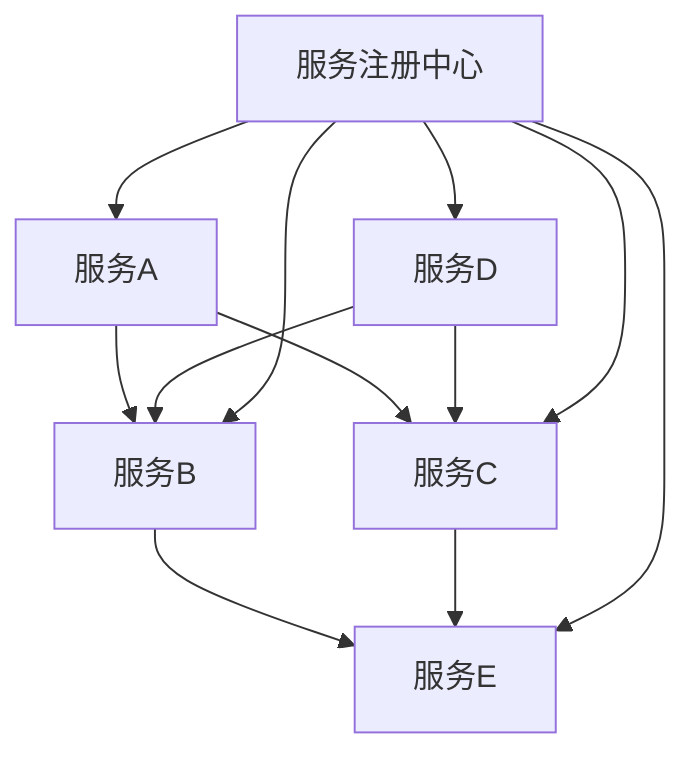
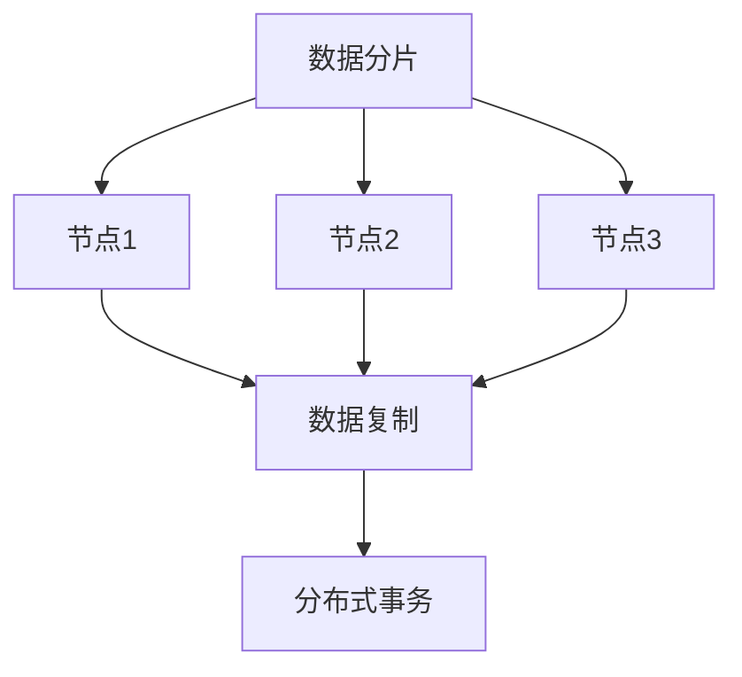
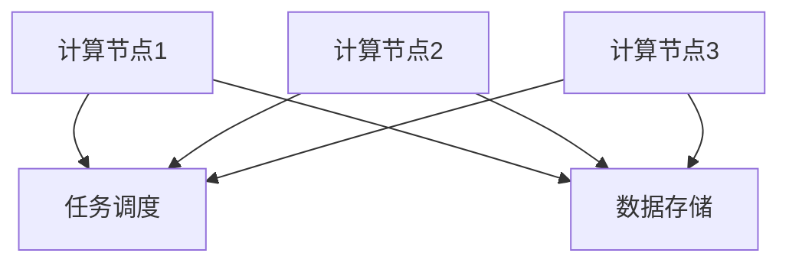

                 


## 文章标题：如何构建高性能的分布式系统

> 关键词：分布式系统，高性能，架构设计，一致性算法，优化策略，容错机制，监控运维

> 摘要：本文将探讨如何构建高性能的分布式系统，从基础理论到实际应用，系统性地介绍分布式系统的设计原则、关键技术和优化策略。通过深入剖析分布式系统的各个方面，帮助读者理解并掌握分布式系统构建的实践方法。

## 目录

### 第一部分：分布式系统基础

#### 第1章：分布式系统概述
- 1.1 分布式系统的概念与特点
- 1.2 分布式系统的优势与挑战

#### 第2章：分布式系统架构
- 2.1 架构模式：客户端-服务器、主从模式、对等网络
- 2.2 分布式系统的组件：节点、网络、状态机、服务发现

#### 第3章：分布式一致性
- 3.1 一致性模型：强一致性、最终一致性
- 3.2 分布式一致性算法：Paxos、Raft

### 第二部分：分布式算法

#### 第4章：分布式数据存储
- 4.1 分布式数据库架构：分库分表、分布式文件系统
- 4.2 分布式数据复制与分区

#### 第5章：分布式计算
- 5.1 分布式计算模型：MapReduce、Spark、Flink
- 5.2 分布式任务调度与负载均衡

### 第三部分：分布式系统优化

#### 第6章：系统性能优化
- 6.1 网络优化：网络拓扑、带宽优化、延迟降低
- 6.2 数据传输优化：数据压缩、网络加密、传输协议选择

#### 第7章：分布式系统容错
- 7.1 故障检测与恢复
- 7.2 降级与限流策略

#### 第8章：分布式系统监控与运维
- 8.1 监控体系：指标选择、数据采集、监控报警
- 8.2 运维自动化：自动化部署、自动化扩缩容、自动化故障恢复

### 第四部分：实践案例

#### 第9章：分布式系统案例分析
- 9.1 微服务架构的分布式系统
- 9.2 大型分布式数据库系统
- 9.3 分布式计算平台的搭建

### 附录

#### 附录A：分布式系统工具与框架
- 10.1 分布式数据库：MongoDB、Cassandra、HBase
- 10.2 分布式计算框架：Hadoop、Spark、Flink

#### 附录B：参考资料与推荐阅读

## 第一部分：分布式系统基础

### 第1章：分布式系统概述

#### 1.1 分布式系统的概念与特点

分布式系统是指由多个独立的计算机节点通过计算机网络连接在一起，共同协作完成计算任务的一种系统。这些节点可以位于同一地理位置，也可以分散在不同的地理位置。分布式系统具有以下几个特点：

1. **独立性**：每个节点都是独立的计算机系统，拥有自己的处理器、内存和存储资源。
2. **分布式计算**：节点之间通过通信网络进行数据交换和任务协作，共同完成计算任务。
3. **共享资源**：分布式系统中的节点可以共享硬件资源（如存储、计算资源）和软件资源（如数据库、文件系统）。
4. **容错性**：分布式系统可以通过冗余设计提高系统的容错性，当某个节点故障时，系统可以自动切换到其他节点继续运行。

#### 1.2 分布式系统的优势与挑战

分布式系统相比集中式系统具有以下优势：

1. **扩展性**：分布式系统可以水平扩展，通过增加节点数量来提升系统的处理能力。
2. **可用性**：分布式系统可以通过冗余设计提高系统的可用性，当某个节点故障时，系统可以自动切换到其他节点继续运行。
3. **负载均衡**：分布式系统可以将任务分配到不同的节点上，实现负载均衡，提高系统的性能。

然而，分布式系统也面临着一些挑战：

1. **一致性**：分布式系统中的数据需要保持一致性，这是分布式系统设计中的一个重要问题。
2. **容错性**：分布式系统需要具备良好的容错性，确保在节点故障时系统能够继续正常运行。
3. **性能优化**：分布式系统需要针对网络延迟、数据传输等因素进行性能优化。

在接下来的章节中，我们将进一步探讨分布式系统的架构、一致性算法、分布式数据存储与计算、性能优化、容错机制以及监控与运维等方面的内容。通过深入分析这些方面，我们将为读者提供构建高性能分布式系统的全面指导。

## 第一部分：分布式系统基础

### 第2章：分布式系统架构

#### 2.1 架构模式

分布式系统可以根据不同的应用场景和需求选择不同的架构模式。常见的架构模式包括客户端-服务器模式、主从模式和对等网络模式。

**客户端-服务器模式**：

客户端-服务器模式（Client-Server Model）是一种典型的分布式系统架构模式。在该模式中，服务器负责提供服务，客户端通过网络请求服务器的资源或服务。客户端与服务器之间通过网络通信进行交互。这种模式的主要优点包括：

1. **服务集中**：服务器负责处理客户端的请求，降低了客户端的复杂度。
2. **易于扩展**：可以通过增加服务器节点来提升系统的处理能力。
3. **易于维护**：服务器端可以进行统一的维护和管理。

**主从模式**：

主从模式（Master-Slave Model）是一种以中心化的方式组织节点的分布式系统架构模式。在该模式中，主节点负责协调和管理从节点的工作。主节点通常负责以下任务：

1. **资源管理**：主节点负责分配和管理系统的资源，如存储空间、计算资源等。
2. **任务调度**：主节点负责将任务分配给从节点，并监控任务的执行状态。
3. **故障转移**：当主节点故障时，可以自动切换到备用的主节点。

主从模式的主要优点包括：

1. **中心化管理**：主节点可以集中进行资源管理和任务调度，降低了系统的复杂性。
2. **可靠性**：通过备份主节点，提高了系统的可靠性。

**对等网络模式**：

对等网络模式（Peer-to-Peer Model）是一种去中心化的分布式系统架构模式。在该模式中，所有节点都是平等的，没有主从之分。每个节点既可以作为客户端发起请求，也可以作为服务器提供服务。对等网络模式的主要优点包括：

1. **去中心化**：对等网络模式没有中心化的控制节点，所有节点都平等参与系统的工作。
2. **可扩展性**：对等网络模式可以轻松地扩展节点数量，提高系统的处理能力。
3. **容错性**：对等网络模式通过节点之间的冗余设计，提高了系统的容错性。

#### 2.2 分布式系统的组件

分布式系统由多个节点通过网络连接而成，每个节点都承担一定的功能。以下是分布式系统中的常见组件：

**节点**：

节点是分布式系统中的基本计算单元，负责执行任务和处理数据。节点通常具有以下功能：

1. **计算任务**：节点负责执行分配给它的计算任务，如数据处理、查询执行等。
2. **数据存储**：节点可以存储和管理数据，如数据库、文件等。
3. **网络通信**：节点通过网络与其他节点进行通信，交换数据和消息。

**网络**：

网络是分布式系统中节点之间的通信基础。分布式系统的性能和稳定性很大程度上取决于网络的性能。网络通常具有以下特性：

1. **可靠性**：网络应能够稳定地传输数据，确保节点之间的通信畅通。
2. **带宽**：网络的带宽应足够大，以支持节点之间的数据交换。
3. **延迟**：网络的延迟应尽可能低，以提高系统的响应速度。

**状态机**：

状态机是一种用于描述分布式系统中节点状态转换的模型。在分布式系统中，节点可能处于不同的状态，如空闲状态、忙碌状态、故障状态等。状态机可以描述节点在不同状态之间的转换规则，如故障转移、任务分配等。

**服务发现**：

服务发现是一种用于自动发现和注册分布式系统中服务的机制。在分布式系统中，节点需要能够动态地发现其他节点提供的服务，并进行连接和交互。服务发现可以简化分布式系统的部署和维护，提高系统的灵活性和可扩展性。

在分布式系统架构的设计过程中，需要综合考虑不同的架构模式、组件功能和网络特性，以确保系统能够高效、稳定地运行。接下来，我们将进一步探讨分布式系统的一致性问题和一致性算法。

## 第一部分：分布式系统基础

### 第3章：分布式一致性

#### 3.1 一致性模型

分布式系统中的数据一致性是确保系统可靠性和正确性的关键。一致性模型是描述分布式系统中数据一致性规则的框架。常见的两种一致性模型是强一致性（Strong Consistency）和最终一致性（Eventual Consistency）。

**强一致性**：

强一致性要求分布式系统中所有的节点在同一时刻看到相同的数据状态。这种一致性模型保证了数据的一致性和可靠性，但通常需要较高的网络带宽和计算资源。强一致性具有以下特点：

1. **原子性**：所有操作要么全部成功，要么全部失败。
2. **隔离性**：多个并发操作之间不会互相干扰。
3. **持久性**：一旦操作成功提交，数据将永久保存。

**最终一致性**：

最终一致性允许分布式系统中的节点在一定时间后达到一致性状态，而不是立即达到。这种一致性模型在处理高并发、低延迟的场景中非常有效，但可能导致短暂的数据不一致。最终一致性具有以下特点：

1. **一致性时间**：节点最终会在一段时间内达到一致性状态。
2. **容错性**：系统可以容忍一定程度的故障和延迟。
3. **延迟**：节点之间的通信延迟可能导致数据不一致。

#### 3.2 分布式一致性算法

为了实现分布式系统中的数据一致性，需要使用一致性算法。以下介绍两种常用的分布式一致性算法：Paxos算法和Raft算法。

**Paxos算法**：

Paxos算法是一种用于分布式系统的一致性算法，由莱斯利·兰伯特（Leslie Lamport）提出。Paxos算法的目标是在分布式系统中达成一致意见，即使部分节点故障也能保持系统的正常运行。

Paxos算法的核心概念包括：

1. **提议者（Proposer）**：提出新的值或状态的节点。
2. **接受者（Acceptor）**：负责接受提议者提出的值或状态的节点。
3. **学习者（Learner）**：学习最终达成一致的值或状态的节点。

Paxos算法的基本流程如下：

1. **提出提议**：提议者生成一个提案，包含一个唯一的编号和一个值。
2. **接受提议**：提议者向所有接受者发送提案，接受者接收提案后，如果编号大于当前已接受的最大编号，则接受该提案并通知提议者。
3. **达成一致**：如果多数接受者接受提议，提议者将通知学习者最终结果。

Paxos算法的伪代码如下：

```plaintext
提议者流程：
1. 生成提案（编号，值）
2. 发送提案给所有接受者
3. 当收到多数接受者的回复时，通知学习者最终结果

接受者流程：
1. 接收提案（编号，值）
2. 如果编号大于当前已接受的最大编号，接受该提案
3. 发送回复给提议者

学习者流程：
1. 接收最终结果
2. 学习最终结果
```

**Raft算法**：

Raft算法是一种比Paxos算法更易于理解和实现的分布式一致性算法。Raft算法将一致性算法的核心概念划分为三个部分：领导选举、日志复制和状态机。

Raft算法的核心概念包括：

1. **领导（Leader）**：负责协调分布式系统中的状态机操作的节点。
2. **跟随者（Follower）**：通过投票选举产生领导节点的节点。
3. **候选人（Candidate）**：参与领导选举的节点。

Raft算法的基本流程如下：

1. **领导选举**：当当前领导节点故障时，候选人节点开始发起选举，获得多数投票的候选人将成为新的领导节点。
2. **日志复制**：领导节点将日志条目发送给跟随者，跟随者接收并复制日志条目。
3. **状态机操作**：领导节点接收客户端的请求，执行状态机操作，并将结果返回给客户端。

Raft算法的伪代码如下：

```plaintext
领导节点流程：
1. 接收客户端请求
2. 执行状态机操作
3. 将日志条目发送给跟随者

跟随者节点流程：
1. 接收领导节点的日志条目
2. 复制日志条目

候选人节点流程：
1. 开始领导选举
2. 接收其他候选人的投票
3. 如果获得多数投票，成为新的领导节点
```

通过Paxos算法和Raft算法，分布式系统可以在面对节点故障和网络延迟的情况下保持数据一致性。在下一章中，我们将进一步探讨分布式系统中的数据存储和计算问题。

## 第一部分：分布式系统基础

### 第4章：分布式数据存储

#### 4.1 分布式数据库架构

分布式数据库架构是分布式系统中的一个重要组成部分，它负责存储和管理分布式系统中的数据。常见的分布式数据库架构包括分库分表、分布式文件系统等。

**分库分表**：

分库分表是一种将数据水平切分的分布式数据库架构，它通过将数据表拆分成多个子表，并分别存储在多个数据库实例中，从而实现数据的高并发访问和存储。分库分表的基本思想如下：

1. **水平切分**：根据数据的特点和访问模式，将数据表拆分成多个子表，每个子表存储一部分数据。
2. **数据路由**：根据数据的关键字（如ID、日期等）确定数据所属的子表，并将请求路由到对应的数据库实例。
3. **数据同步**：通过主从复制、分布式事务等技术，保持多个数据库实例之间的数据一致性。

分库分表的主要优点包括：

1. **高并发**：通过将数据分散存储，可以减少单点瓶颈，提高系统的并发处理能力。
2. **可扩展性**：可以通过增加数据库实例来水平扩展系统的存储容量和处理能力。

**分布式文件系统**：

分布式文件系统是一种将文件分布式存储在多个节点上的系统，它负责管理分布式系统中的文件存储和访问。常见的分布式文件系统包括HDFS、Ceph等。分布式文件系统的基本思想如下：

1. **数据分片**：将大文件切分成多个小块，存储在多个节点上。
2. **数据冗余**：通过副本机制，提高数据的可靠性和访问速度。
3. **数据路由**：根据文件的关键字（如文件名、路径等）确定文件所属的节点，并将请求路由到对应的节点。

分布式文件系统的主要优点包括：

1. **高可靠性**：通过副本机制和数据冗余设计，提高数据的可靠性和访问速度。
2. **可扩展性**：可以通过增加节点来水平扩展系统的存储容量和处理能力。

#### 4.2 分布式数据复制与分区

分布式数据复制和分区是分布式数据库架构中的重要技术，它们负责实现数据的高可用性和高性能。

**分布式数据复制**：

分布式数据复制是将数据在多个节点上复制的一种机制，以提高数据的可靠性和访问速度。常见的分布式数据复制技术包括主从复制、多主复制等。

1. **主从复制**：主从复制是一种单向的数据复制技术，其中主节点负责数据的写入和更新，从节点负责数据的读取。主从复制的主要优点包括：

   - 高可用性：当主节点故障时，从节点可以自动成为主节点，确保系统的高可用性。
   - 高性能：通过主节点的写入负载均衡，可以提高系统的写入性能。

2. **多主复制**：多主复制是一种双向的数据复制技术，多个主节点之间互相复制数据。多主复制的主要优点包括：

   - 高性能：通过多个主节点的写入负载均衡，可以提高系统的写入性能。
   - 高可用性：当某个主节点故障时，其他主节点可以继续提供服务，确保系统的高可用性。

**分布式数据分区**：

分布式数据分区是将数据根据一定的规则分布在多个节点上的一种机制，以提高数据的访问速度和系统性能。常见的分布式数据分区技术包括哈希分区、轮询分区等。

1. **哈希分区**：哈希分区是一种基于哈希函数的数据分区技术，根据数据的哈希值将数据分布到不同的节点上。哈希分区的主要优点包括：

   - 负载均衡：通过哈希函数将数据均匀分布到各个节点，实现负载均衡。
   - 数据访问：根据数据的哈希值，快速定位数据所属的节点，提高数据访问速度。

2. **轮询分区**：轮询分区是一种基于轮询算法的数据分区技术，按照一定的顺序将数据分布到各个节点上。轮询分区的主要优点包括：

   - 负载均衡：通过轮询算法实现负载均衡，确保各个节点的负载均衡。
   - 数据访问：根据节点的顺序，依次访问各个节点，提高数据访问速度。

通过分布式数据复制和分区技术，分布式数据库架构可以实现数据的高可用性、高性能和可扩展性。在下一章中，我们将进一步探讨分布式系统中的计算模型和任务调度。

## 第一部分：分布式系统基础

### 第5章：分布式计算

#### 5.1 分布式计算模型

分布式计算模型是分布式系统中的一个重要组成部分，它负责处理大规模数据集的计算任务。常见的分布式计算模型包括MapReduce、Spark和Flink等。

**MapReduce模型**：

MapReduce模型是一种基于函数式编程的分布式计算模型，由Google提出并广泛应用于大规模数据处理场景。MapReduce模型的基本思想是将大规模数据处理任务拆分为两个阶段：Map阶段和Reduce阶段。

1. **Map阶段**：Map阶段将输入数据拆分为多个子任务，每个子任务处理一部分数据，并生成中间结果。Map阶段的伪代码如下：

   ```python
   map(key, value):
       # 对每个输入键值对进行处理
       for output_key, output_value in generate_output():
           emit(output_key, output_value)
   ```

2. **Reduce阶段**：Reduce阶段将Map阶段生成的中间结果进行聚合和整理，生成最终结果。Reduce阶段的伪代码如下：

   ```python
   reduce(key, values):
       # 对每个输入键值对进行处理
       for output_value in generate_output():
           emit(output_value)
   ```

**Spark模型**：

Spark是一种基于内存计算的分布式计算框架，它提供了高效的数据处理能力，广泛应用于大数据场景。Spark模型的基本思想是将数据处理任务拆分为多个子任务，并在内存中处理数据。

1. **DataFrame和DataSet**：Spark提供了DataFrame和DataSet两种数据结构，它们支持丰富的数据操作和优化。
2. **RDD（弹性分布式数据集）**：RDD是Spark的核心数据结构，它提供了惰性求值和并行处理能力。
3. **Transformation和Action**：Spark通过Transformation和Action操作实现数据转换和计算，Transformation操作生成新的RDD，Action操作触发计算并返回结果。

**Flink模型**：

Flink是一种流处理和批处理相结合的分布式计算框架，它提供了高效和灵活的数据处理能力。Flink模型的基本思想是将数据处理任务拆分为多个子任务，并在流处理模式下处理数据。

1. **流处理和批处理**：Flink支持流处理和批处理两种模式，流处理模式适用于实时数据处理，批处理模式适用于离线数据处理。
2. **事件驱动编程**：Flink采用事件驱动编程模型，通过事件触发数据计算和处理。
3. **窗口操作**：Flink提供了丰富的窗口操作，支持对数据进行滑动窗口、固定窗口等处理。

#### 5.2 分布式任务调度与负载均衡

分布式任务调度和负载均衡是分布式系统中的关键技术，它们负责管理和分配计算任务，以提高系统的性能和稳定性。

**分布式任务调度**：

分布式任务调度是将计算任务分配到分布式系统中的各个节点上执行的一种机制。常见的分布式任务调度器包括Hadoop YARN、Apache Mesos和Kubernetes等。

1. **资源管理**：分布式任务调度器负责管理分布式系统中的资源，如CPU、内存、存储等，并合理分配给计算任务。
2. **任务分配**：分布式任务调度器根据任务依赖关系和资源可用性，将计算任务分配到合适的节点上执行。
3. **负载均衡**：分布式任务调度器通过负载均衡策略，将任务均匀分配到各个节点，避免单点瓶颈和资源浪费。

**负载均衡**：

负载均衡是将网络请求或计算任务分配到多个服务器或节点上执行的一种机制，以提高系统的性能和可用性。常见的负载均衡策略包括轮询、随机、最小连接数等。

1. **轮询策略**：轮询策略按照一定的顺序将请求分配到各个服务器或节点上，实现负载均衡。
2. **随机策略**：随机策略通过随机算法将请求分配到服务器或节点上，实现负载均衡。
3. **最小连接数策略**：最小连接数策略将请求分配到当前连接数最少的服务器或节点上，实现负载均衡。

通过分布式任务调度和负载均衡技术，分布式系统可以高效地管理和分配计算任务，提高系统的性能和可用性。在下一章中，我们将进一步探讨分布式系统的性能优化和优化策略。

## 第一部分：分布式系统基础

### 第6章：系统性能优化

#### 6.1 网络优化

网络是分布式系统中数据传输的通道，网络性能的优劣直接影响系统的整体性能。以下是一些常见的网络优化策略：

**网络拓扑优化**：

网络拓扑优化是指通过优化网络结构来提高系统的性能和可靠性。常见的网络拓扑优化策略包括：

1. **冗余设计**：通过增加网络冗余路径，提高系统的容错性和可靠性。
2. **负载均衡**：通过负载均衡策略，将网络流量分配到多个路径上，避免单点瓶颈。
3. **带宽优化**：通过带宽优化技术，如压缩、流量整形等，提高网络带宽的利用率。

**带宽优化**：

带宽优化是指通过优化网络带宽的利用来提高系统的性能。以下是一些常见的带宽优化策略：

1. **数据压缩**：通过数据压缩技术，减少数据传输的体积，提高带宽利用率。
2. **流量整形**：通过流量整形技术，控制网络流量的速率，避免网络拥塞。
3. **传输协议选择**：选择适合应用场景的传输协议，如HTTP/2、QUIC等，提高数据传输效率。

**延迟降低**：

延迟降低是指通过减少网络延迟来提高系统的性能。以下是一些常见的延迟降低策略：

1. **缓存**：通过缓存技术，减少数据传输的次数，降低延迟。
2. **内容分发网络（CDN）**：通过将内容分发到多个节点上，减少用户与服务器之间的距离，降低延迟。
3. **数据中心互联**：通过数据中心互联技术，提高跨数据中心的网络传输速度。

#### 6.2 数据传输优化

数据传输优化是指通过优化数据传输过程来提高系统的性能和效率。以下是一些常见的数据传输优化策略：

**数据压缩**：

数据压缩是指通过压缩技术减小数据传输的体积，提高带宽利用率。以下是一些常见的数据压缩算法：

1. **无损压缩**：如Huffman编码、LZ77等，可以完全恢复原始数据。
2. **有损压缩**：如JPEG、MP3等，通过牺牲部分数据质量来提高压缩比。

**网络加密**：

网络加密是指通过加密技术保护数据传输的安全性。以下是一些常见的网络加密算法：

1. **对称加密**：如AES、DES等，加密和解密使用相同的密钥。
2. **非对称加密**：如RSA、ECC等，加密和解密使用不同的密钥。

**传输协议选择**：

选择适合应用场景的传输协议可以显著提高数据传输效率。以下是一些常见的传输协议：

1. **HTTP/2**：支持多路复用、头部压缩、优先级调度等，提高传输效率。
2. **QUIC**：基于UDP，支持多路径传输、前向纠错、快速握手等，提高传输速度。

通过网络优化和数据传输优化，分布式系统可以显著提高性能和效率，为用户提供更好的体验。在下一章中，我们将探讨分布式系统的容错机制和优化策略。

## 第一部分：分布式系统基础

### 第7章：分布式系统容错

#### 7.1 故障检测与恢复

分布式系统的容错性是其稳定运行的关键因素之一。为了确保系统在节点故障时能够继续正常运行，分布式系统需要实现故障检测和恢复机制。

**故障检测**：

故障检测是指通过一定的方法监测系统中节点的健康状况，及时发现故障。常见的故障检测方法包括：

1. **心跳机制**：节点定期发送心跳信号，其他节点根据心跳信号的接收情况判断节点是否正常。
2. **周期性检查**：通过周期性地执行健康检查，监测节点的状态，如CPU负载、内存使用率等。
3. **异常检测**：通过分析节点的行为和性能指标，如响应时间、错误率等，判断节点是否出现故障。

**故障恢复**：

故障恢复是指系统在检测到节点故障后，采取一系列措施使系统恢复正常运行的机制。常见的故障恢复方法包括：

1. **自动切换**：在主节点故障时，自动将任务切换到备用的主节点，确保系统的连续运行。
2. **故障转移**：将故障节点的任务转移到其他健康节点，重新分配任务，使系统恢复正常。
3. **故障恢复**：在检测到节点故障后，系统自动重启节点，使其重新加入集群，恢复正常运行。

**故障恢复机制**：

分布式系统的故障恢复机制通常包括以下步骤：

1. **检测到故障**：系统通过故障检测机制发现节点故障。
2. **触发恢复**：系统根据故障类型和严重程度，触发相应的恢复措施。
3. **任务重分配**：系统将故障节点的任务重新分配到其他健康节点，确保任务的连续执行。
4. **系统恢复**：故障节点恢复后，重新加入集群，系统恢复正常运行。

#### 7.2 降级与限流策略

在分布式系统中，当系统资源不足或面临高峰负载时，为了确保系统的稳定运行，需要采取降级和限流策略。

**降级策略**：

降级策略是指系统在资源不足时，通过降低某些服务的质量和性能，确保系统的核心功能和关键服务的正常运行。常见的降级策略包括：

1. **功能降级**：降低某些非核心功能的服务质量，如减少数据存储、降低数据准确性等。
2. **性能降级**：通过降低系统的响应时间、吞吐量等性能指标，确保关键服务的稳定运行。

**限流策略**：

限流策略是指系统通过限制请求的速率和数量，避免系统过载和资源耗尽。常见的限流策略包括：

1. **固定窗口限流**：在固定的时间窗口内，限制请求的速率和数量。
2. **滑动窗口限流**：在动态的时间窗口内，限制请求的速率和数量。
3. **令牌桶限流**：通过令牌桶算法，限制请求的速率和数量。

通过故障检测与恢复、降级与限流策略，分布式系统可以提高其容错性和稳定性，确保系统在面临故障和高峰负载时能够持续稳定运行。在下一章中，我们将探讨分布式系统的监控与运维。

## 第一部分：分布式系统基础

### 第8章：分布式系统监控与运维

#### 8.1 监控体系

分布式系统的监控是确保系统稳定运行的关键环节。一个完善的监控体系可以实时捕获系统状态、性能指标和异常情况，从而帮助运维人员及时发现并解决问题。以下是一个典型的分布式系统监控体系的组成部分：

1. **指标选择**：确定需要监控的关键性能指标（KPI），如CPU利用率、内存使用率、磁盘I/O、网络延迟等。
2. **数据采集**：通过监控工具（如Prometheus、Grafana）定期采集系统指标数据，并将其存储在监控平台中。
3. **监控报警**：设置阈值和报警规则，当监控指标超出预定阈值时，自动触发报警通知，如邮件、短信、手机App等。

#### 8.2 运维自动化

运维自动化是提高分布式系统运维效率的重要手段。通过自动化工具和脚本，可以大幅减少手动操作，提高系统的稳定性和可靠性。以下是一些常见的运维自动化策略：

1. **自动化部署**：使用自动化工具（如Kubernetes、Ansible）实现应用的自动化部署和升级。
2. **自动化扩缩容**：根据系统负载自动调整节点数量，实现弹性扩展和缩小。
3. **自动化故障恢复**：在检测到故障时，自动执行故障恢复流程，如重启服务、切换备份节点等。

#### 8.3 运维工具与平台

分布式系统监控与运维需要一系列工具和平台的支持，以下是一些常用的工具和平台：

1. **监控工具**：Prometheus、Grafana、Zabbix、Nagios等。
2. **日志管理工具**：ELK（Elasticsearch、Logstash、Kibana）、Splunk等。
3. **持续集成与持续部署（CI/CD）工具**：Jenkins、GitLab CI/CD、Travis CI等。
4. **容器编排工具**：Kubernetes、Docker Swarm、Apache Mesos等。
5. **配置管理工具**：Ansible、Puppet、Chef等。

通过监控与运维自动化，分布式系统可以更好地应对各种挑战，提高其稳定性和可靠性。在下一章中，我们将通过实践案例展示如何构建高性能的分布式系统。

## 第二部分：分布式算法

### 第4章：分布式数据存储

分布式数据存储是构建高性能分布式系统的重要环节。本章节将详细介绍分布式数据库架构、分布式数据复制与分区策略，以及分布式文件系统。

#### 4.1 分布式数据库架构

分布式数据库架构通过将数据分散存储在多个节点上，提高系统的可扩展性和可用性。以下是一些常见的分布式数据库架构：

**分库分表**：

分库分表是将数据按照一定的规则拆分为多个子表，分别存储在不同的数据库实例中。这种架构可以减轻单个数据库实例的负载，提高系统的并发处理能力。常见的分库分表策略包括：

1. **水平切分**：根据数据的访问模式和访问频率，将数据表拆分为多个子表，每个子表存储一部分数据。通过哈希分区或轮询分区实现数据路由。
2. **垂直切分**：将数据表拆分为多个子表，每个子表存储数据表的不同列。这种方式可以优化查询性能，但可能降低系统的可扩展性。

**分布式文件系统**：

分布式文件系统是一种将文件分布式存储在多个节点上的系统，如HDFS、Ceph等。分布式文件系统通过数据分片和冗余设计，提高数据的可靠性和访问速度。以下是分布式文件系统的一些关键特性：

1. **数据分片**：将大文件切分为多个小块，存储在多个节点上。通过哈希函数确定数据块在系统中的存储位置。
2. **数据冗余**：通过副本机制，将数据块复制到多个节点上，提高数据的可靠性和访问速度。
3. **数据路由**：根据文件的哈希值或文件路径，快速定位数据块在系统中的存储位置。

#### 4.2 分布式数据复制与分区

分布式数据复制与分区策略是确保分布式数据库系统高性能和高可用性的关键。以下是一些常见的分布式数据复制与分区策略：

**分布式数据复制**：

分布式数据复制是指将数据在多个节点上复制，以提高系统的可用性和数据一致性。以下是一些常见的分布式数据复制策略：

1. **主从复制**：主从复制是一种单向的数据复制技术，其中主节点负责数据的写入和更新，从节点负责数据的读取。主从复制可以提高系统的可用性和数据一致性，但可能导致数据延迟。
2. **多主复制**：多主复制是一种双向的数据复制技术，多个主节点之间互相复制数据。多主复制可以提高系统的可用性和数据一致性，但需要处理数据冲突和一致性问题。

**分布式数据分区**：

分布式数据分区是指将数据按照一定的规则分布在多个节点上，以提高系统的性能和可用性。以下是一些常见的分布式数据分区策略：

1. **哈希分区**：哈希分区是一种基于哈希函数的数据分区策略，通过哈希函数将数据分布到不同的节点上。哈希分区可以实现数据的负载均衡，但可能导致热点问题。
2. **轮询分区**：轮询分区是一种基于轮询算法的数据分区策略，按照一定的顺序将数据分布到不同的节点上。轮询分区可以实现负载均衡，但可能导致数据访问的不均衡。

通过分布式数据库架构、分布式数据复制与分区策略，分布式系统可以实现高性能、高可用性和可扩展性。在下一章中，我们将探讨分布式计算和任务调度。

### 第5章：分布式计算

分布式计算是构建高性能分布式系统的重要技术。本章节将详细介绍分布式计算模型、分布式任务调度与负载均衡。

#### 5.1 分布式计算模型

分布式计算模型是指如何将大规模数据处理任务分配到多个节点上执行，以提高系统的性能和效率。以下是一些常见的分布式计算模型：

**MapReduce模型**：

MapReduce是一种基于函数式编程的分布式计算模型，由Google提出。MapReduce模型将数据处理任务拆分为两个阶段：Map阶段和Reduce阶段。

1. **Map阶段**：将输入数据拆分为多个子任务，每个子任务处理一部分数据，生成中间结果。Map阶段的伪代码如下：

   ```python
   map(key, value):
       for output_key, output_value in generate_output():
           emit(output_key, output_value)
   ```

2. **Reduce阶段**：将Map阶段生成的中间结果进行聚合和整理，生成最终结果。Reduce阶段的伪代码如下：

   ```python
   reduce(key, values):
       for output_value in generate_output():
           emit(output_value)
   ```

**Spark模型**：

Spark是一种基于内存计算的分布式计算框架，提供了高效的数据处理能力。Spark模型提供了两种主要的数据结构：DataFrame和DataSet，以及两种操作：Transformation和Action。

1. **DataFrame和DataSet**：DataFrame和DataSet是Spark提供的数据结构，支持丰富的数据操作和优化。
2. **RDD（弹性分布式数据集）**：RDD是Spark的核心数据结构，提供了惰性求值和并行处理能力。
3. **Transformation和Action**：Transformation操作生成新的RDD，Action操作触发计算并返回结果。

**Flink模型**：

Flink是一种流处理和批处理相结合的分布式计算框架，提供了高效和灵活的数据处理能力。Flink模型的基本思想是将数据处理任务拆分为多个子任务，并在流处理模式下处理数据。

1. **流处理和批处理**：Flink支持流处理和批处理两种模式，流处理模式适用于实时数据处理，批处理模式适用于离线数据处理。
2. **事件驱动编程**：Flink采用事件驱动编程模型，通过事件触发数据计算和处理。
3. **窗口操作**：Flink提供了丰富的窗口操作，支持对数据进行滑动窗口、固定窗口等处理。

#### 5.2 分布式任务调度与负载均衡

分布式任务调度与负载均衡是分布式系统中的关键技术，负责管理和分配计算任务，以提高系统的性能和稳定性。

**分布式任务调度**：

分布式任务调度是将计算任务分配到分布式系统中的各个节点上执行的一种机制。常见的分布式任务调度器包括Hadoop YARN、Apache Mesos和Kubernetes等。

1. **资源管理**：分布式任务调度器负责管理分布式系统中的资源，如CPU、内存、存储等，并合理分配给计算任务。
2. **任务分配**：分布式任务调度器根据任务依赖关系和资源可用性，将计算任务分配到合适的节点上执行。
3. **负载均衡**：分布式任务调度器通过负载均衡策略，将任务均匀分配到各个节点，避免单点瓶颈和资源浪费。

**负载均衡**：

负载均衡是将网络请求或计算任务分配到多个服务器或节点上执行的一种机制，以提高系统的性能和可用性。常见的负载均衡策略包括：

1. **轮询策略**：轮询策略按照一定的顺序将请求分配到各个服务器或节点上，实现负载均衡。
2. **随机策略**：随机策略通过随机算法将请求分配到服务器或节点上，实现负载均衡。
3. **最小连接数策略**：最小连接数策略将请求分配到当前连接数最少的服务器或节点上，实现负载均衡。

通过分布式计算模型和任务调度与负载均衡技术，分布式系统可以实现高效、稳定的数据处理，为用户提供优质的服务。在下一章中，我们将探讨分布式系统的性能优化和优化策略。

## 第三部分：分布式系统优化

### 第6章：系统性能优化

#### 6.1 网络优化

网络优化是提升分布式系统性能的关键环节。网络拓扑、带宽优化和延迟降低是网络优化的三大核心要素。

**网络拓扑优化**：

网络拓扑优化是通过设计合理的网络结构，提高系统的性能和可靠性。以下是一些常见的网络拓扑优化策略：

1. **冗余设计**：通过增加网络冗余路径，提高系统的容错性和可靠性。例如，使用多个网络接口、多路径传输等。
2. **负载均衡**：通过负载均衡策略，将网络流量分配到多个路径上，避免单点瓶颈。例如，使用路由器、交换机等设备进行流量分配。
3. **网络分层**：将网络分为多个层次，每个层次负责不同的功能。例如，使用核心层、分布层和接入层等。

**带宽优化**：

带宽优化是通过提高网络带宽的利用率，提升系统的数据传输速度。以下是一些常见的带宽优化策略：

1. **数据压缩**：通过数据压缩技术，减少数据传输的体积，提高带宽利用率。例如，使用HTTP压缩、TCP压缩等。
2. **流量整形**：通过流量整形技术，控制网络流量的速率，避免网络拥塞。例如，使用队列管理、流量监管等。
3. **传输协议选择**：选择适合应用场景的传输协议，提高数据传输效率。例如，使用HTTP/2、QUIC等。

**延迟降低**：

延迟降低是通过减少网络延迟，提高系统的响应速度。以下是一些常见的延迟降低策略：

1. **缓存**：通过缓存技术，减少数据传输的次数，降低延迟。例如，使用CDN、本地缓存等。
2. **内容分发网络（CDN）**：通过将内容分发到多个节点上，减少用户与服务器之间的距离，降低延迟。例如，使用CDN服务提供商。
3. **数据中心互联**：通过数据中心互联技术，提高跨数据中心的网络传输速度。例如，使用高速互联、多路径传输等。

#### 6.2 数据传输优化

数据传输优化是通过提高数据传输的效率和可靠性，提升系统的整体性能。以下是一些常见的数据传输优化策略：

**数据压缩**：

数据压缩是通过减小数据传输的体积，提高带宽利用率。以下是一些常见的数据压缩算法：

1. **无损压缩**：通过去除数据中的冗余信息，完全恢复原始数据。例如，Huffman编码、LZ77等。
2. **有损压缩**：通过牺牲部分数据质量，提高压缩比。例如，JPEG、MP3等。

**网络加密**：

网络加密是通过加密技术保护数据传输的安全性。以下是一些常见的网络加密算法：

1. **对称加密**：使用相同的密钥进行加密和解密。例如，AES、DES等。
2. **非对称加密**：使用不同的密钥进行加密和解密。例如，RSA、ECC等。

**传输协议选择**：

选择适合应用场景的传输协议，可以提高数据传输的效率和可靠性。以下是一些常见的传输协议：

1. **HTTP/2**：支持多路复用、头部压缩、优先级调度等，提高传输效率。
2. **QUIC**：基于UDP，支持多路径传输、前向纠错、快速握手等，提高传输速度。

通过网络优化和数据传输优化，分布式系统可以显著提高性能和效率，为用户提供更好的体验。在下一章中，我们将探讨分布式系统的容错机制和优化策略。

### 第7章：分布式系统容错

#### 7.1 故障检测与恢复

分布式系统的容错性是确保系统稳定运行的关键。故障检测与恢复机制负责在节点故障时，确保系统能够快速恢复正常运行。

**故障检测**：

故障检测是通过监测节点的健康状态，及时发现故障。以下是一些常见的故障检测方法：

1. **心跳机制**：节点通过定期发送心跳信号，其他节点根据心跳信号的接收情况判断节点是否正常。例如，使用PING命令检测节点是否可达。
2. **周期性检查**：定期执行健康检查，监测节点的CPU负载、内存使用率、磁盘I/O等指标，判断节点是否正常。例如，使用系统监控工具（如Zabbix、Prometheus）进行周期性检查。
3. **异常检测**：通过分析节点的行为和性能指标，如响应时间、错误率等，判断节点是否出现故障。例如，使用机器学习算法进行异常检测。

**故障恢复**：

故障恢复是在检测到节点故障后，采取一系列措施使系统恢复正常运行。以下是一些常见的故障恢复方法：

1. **自动切换**：在主节点故障时，自动将任务切换到备用的主节点，确保系统的连续运行。例如，使用负载均衡器（如Nginx、HAProxy）进行自动切换。
2. **故障转移**：将故障节点的任务转移到其他健康节点，重新分配任务，使系统恢复正常运行。例如，使用分布式数据库（如Mongodb、Cassandra）进行故障转移。
3. **故障恢复**：在检测到节点故障后，系统自动重启节点，使其重新加入集群，恢复正常运行。例如，使用自动化部署工具（如Ansible、Kubernetes）进行故障恢复。

**故障恢复机制**：

故障恢复机制通常包括以下步骤：

1. **检测到故障**：系统通过故障检测机制发现节点故障。
2. **触发恢复**：系统根据故障类型和严重程度，触发相应的恢复措施。
3. **任务重分配**：系统将故障节点的任务重新分配到其他健康节点，确保任务的连续执行。
4. **系统恢复**：故障节点恢复后，重新加入集群，系统恢复正常运行。

#### 7.2 降级与限流策略

在分布式系统中，当系统资源不足或面临高峰负载时，为了确保系统的稳定运行，需要采取降级和限流策略。

**降级策略**：

降级策略是通过降低某些服务的质量和性能，确保系统的核心功能和关键服务的正常运行。以下是一些常见的降级策略：

1. **功能降级**：降低某些非核心功能的服务质量，如减少数据存储、降低数据准确性等。
2. **性能降级**：通过降低系统的响应时间、吞吐量等性能指标，确保关键服务的稳定运行。

**限流策略**：

限流策略是通过限制请求的速率和数量，避免系统过载和资源耗尽。以下是一些常见的限流策略：

1. **固定窗口限流**：在固定的时间窗口内，限制请求的速率和数量。
2. **滑动窗口限流**：在动态的时间窗口内，限制请求的速率和数量。
3. **令牌桶限流**：通过令牌桶算法，限制请求的速率和数量。

通过故障检测与恢复、降级与限流策略，分布式系统可以提高其容错性和稳定性，确保系统在面临故障和高峰负载时能够持续稳定运行。在下一章中，我们将探讨分布式系统的监控与运维。

### 第8章：分布式系统监控与运维

#### 8.1 监控体系

分布式系统的监控是确保系统稳定运行的关键。一个完善的监控体系可以实时捕获系统状态、性能指标和异常情况，从而帮助运维人员及时发现并解决问题。

**指标选择**：

监控指标的选择至关重要，以下是一些常见的监控指标：

1. **系统资源使用情况**：CPU利用率、内存使用率、磁盘I/O、网络流量等。
2. **服务性能指标**：请求处理时间、响应时间、错误率等。
3. **应用业务指标**：交易量、用户访问量、系统负载等。

**数据采集**：

数据采集是将系统运行过程中的指标数据收集起来，以便后续分析和监控。以下是一些常见的数据采集方法：

1. **Agent采集**：通过安装Agent程序，定期采集系统指标数据。
2. **API采集**：通过调用系统提供的API接口，实时获取系统指标数据。
3. **日志采集**：通过解析系统日志文件，提取有用的监控数据。

**监控报警**：

监控报警是在监控指标超出阈值时，及时通知运维人员。以下是一些常见的监控报警方法：

1. **邮件报警**：通过发送邮件通知运维人员。
2. **短信报警**：通过发送短信通知运维人员。
3. **手机App报警**：通过手机App推送通知运维人员。

**数据可视化**：

数据可视化是将监控数据以图表、仪表板等形式展示，使运维人员更直观地了解系统状态。以下是一些常见的数据可视化工具：

1. **Grafana**：支持多种数据源，提供丰富的图表和仪表板。
2. **Kibana**：与Elasticsearch集成，提供强大的数据可视化功能。
3. **Zabbix**：提供丰富的监控图表和报表。

#### 8.2 运维自动化

运维自动化是提高分布式系统运维效率的重要手段。通过自动化工具和脚本，可以大幅减少手动操作，提高系统的稳定性和可靠性。

**自动化部署**：

自动化部署是通过脚本或自动化工具，实现应用的自动化部署和升级。以下是一些常见的自动化部署工具：

1. **Ansible**：基于Python的自动化工具，支持配置管理和应用部署。
2. **Puppet**：基于Ruby的自动化工具，支持配置管理和应用部署。
3. **Chef**：基于Ruby的自动化工具，支持配置管理和应用部署。

**自动化扩缩容**：

自动化扩缩容是通过脚本或自动化工具，根据系统负载自动调整节点数量。以下是一些常见的自动化扩缩容工具：

1. **Kubernetes**：支持自动化部署、扩展和运维管理。
2. **Elasticsearch**：支持自动发现集群节点，实现自动化扩缩容。
3. **Cassandra**：支持自动发现集群节点，实现自动化扩缩容。

**自动化故障恢复**：

自动化故障恢复是通过脚本或自动化工具，在检测到故障时，自动执行故障恢复流程。以下是一些常见的自动化故障恢复工具：

1. **Zabbix**：支持自动化故障恢复，通过触发器执行脚本。
2. **Prometheus**：支持自动化故障恢复，通过告警规则触发恢复流程。
3. **Kubernetes**：支持自动化故障恢复，通过自定义控制器实现故障恢复。

通过监控与运维自动化，分布式系统可以更好地应对各种挑战，提高其稳定性和可靠性。在下一章中，我们将通过实践案例展示如何构建高性能的分布式系统。

### 第四部分：实践案例

#### 第9章：分布式系统案例分析

#### 9.1 微服务架构的分布式系统

微服务架构是一种将应用程序分解为多个独立、可部署、可扩展的服务单元的架构风格。这种架构风格使得分布式系统的构建更加灵活和可扩展。本节将探讨如何使用微服务架构构建分布式系统。

**背景介绍**：

随着互联网技术的发展，单点系统逐渐无法满足日益增长的业务需求。传统的单体架构在扩展性、可靠性和可维护性方面存在诸多问题。为了应对这些挑战，微服务架构应运而生。微服务架构通过将系统划分为多个独立的服务单元，实现了高可扩展性和高可用性。

**核心概念与联系**：

微服务架构中的核心概念包括服务、服务注册与发现、服务通信、服务监控等。以下是微服务架构的关键组件及其关系：

1. **服务**：服务是微服务架构中的基本构建块，每个服务负责实现特定的业务功能。
2. **服务注册与发现**：服务注册与发现机制用于服务之间的自动发现和连接。服务启动时向注册中心注册自身，服务消费者从注册中心获取服务列表。
3. **服务通信**：服务之间通过轻量级协议（如HTTP/HTTPS、gRPC、RESTful API等）进行通信。
4. **服务监控**：服务监控用于跟踪服务的运行状态和性能指标，及时发现和处理问题。

**Mermaid 流程图**：



**核心算法原理讲解**：

在微服务架构中，服务注册与发现是一个关键问题。常见的算法包括：

1. **Eureka**：Netflix开发的基于ZooKeeper的服务注册与发现组件。服务启动时向Eureka注册中心注册自身，服务消费者从Eureka获取服务列表。
2. **Consul**：HashiCorp开发的基于Gossip协议的服务注册与发现组件。服务启动时向Consul注册中心注册自身，服务消费者从Consul获取服务列表。

**数学模型和公式**：

在微服务架构中，服务通信的延迟和数据传输的带宽是影响系统性能的关键因素。以下是相关的数学模型和公式：

1. **延迟模型**：

   $$L = \frac{d}{r}$$

   其中，L是延迟，d是数据传输距离，r是数据传输速率。

2. **带宽模型**：

   $$B = \frac{C}{L}$$

   其中，B是带宽，C是数据传输量，L是延迟。

**详细讲解与举例说明**：

假设服务A需要调用服务B，服务A位于北京，服务B位于上海。数据传输距离为1000公里，数据传输速率约为10 Mbps。根据延迟模型和带宽模型，可以计算出服务A调用服务B的延迟和带宽：

1. **延迟**：

   $$L = \frac{1000}{10} = 100 \text{ ms}$$

2. **带宽**：

   $$B = \frac{100 \text{ MB}}{100 \text{ ms}} = 1 \text{ MB/s}$$

通过上述计算，我们可以发现服务A调用服务B的延迟为100 ms，带宽为1 MB/s。这个结果对于优化服务通信性能具有重要意义。

#### 9.2 大型分布式数据库系统

大型分布式数据库系统是处理大规模数据的关键技术。本节将探讨如何使用分布式数据库系统处理海量数据。

**背景介绍**：

随着互联网的快速发展，数据量呈现指数级增长。传统的单机数据库系统在处理海量数据时，面临性能瓶颈和扩展性问题。为了应对这些挑战，分布式数据库系统应运而生。分布式数据库系统通过将数据分散存储在多个节点上，提高了系统的性能和可扩展性。

**核心概念与联系**：

分布式数据库系统的核心概念包括数据分片、数据复制、分布式事务等。以下是分布式数据库系统的主要组件及其关系：

1. **数据分片**：数据分片是将数据按照一定的规则分布在多个节点上，提高系统的并发处理能力和存储容量。
2. **数据复制**：数据复制是将数据在多个节点上备份，提高数据的可靠性和可用性。
3. **分布式事务**：分布式事务是在分布式数据库系统中执行多个操作的原子性、一致性、隔离性和持久性保障。

**Mermaid 流程图**：



**核心算法原理讲解**：

在分布式数据库系统中，数据分片和数据复制是两个关键问题。以下是相关的核心算法：

1. **哈希分片**：哈希分片是一种基于哈希函数的数据分片算法。通过哈希函数将数据分配到不同的节点上，实现数据的均匀分布。
2. **复制算法**：复制算法负责将数据在多个节点上备份。常见的复制算法包括主从复制和多主复制。

**数学模型和公式**：

在分布式数据库系统中，数据复制和分片的性能受到数据传输延迟和数据一致性的影响。以下是相关的数学模型和公式：

1. **数据传输延迟模型**：

   $$L = \frac{d}{r}$$

   其中，L是延迟，d是数据传输距离，r是数据传输速率。

2. **一致性模型**：

   $$C = \frac{T}{N}$$

   其中，C是一致性，T是数据更新时间，N是节点数量。

**详细讲解与举例说明**：

假设一个分布式数据库系统包含3个节点，数据更新时间为10秒，数据传输距离为1000公里，数据传输速率约为10 Mbps。根据数据传输延迟模型和一致性模型，可以计算出数据传输延迟和一致性：

1. **数据传输延迟**：

   $$L = \frac{1000}{10} = 100 \text{ ms}$$

2. **一致性**：

   $$C = \frac{10}{3} \approx 3.33 \text{ s}$$

通过上述计算，我们可以发现数据传输延迟为100 ms，一致性为3.33秒。这个结果对于优化分布式数据库系统的性能具有重要意义。

#### 9.3 分布式计算平台的搭建

分布式计算平台是一种用于处理大规模数据集的分布式计算框架。本节将探讨如何搭建分布式计算平台。

**背景介绍**：

随着大数据技术的发展，分布式计算平台逐渐成为处理大规模数据集的重要工具。分布式计算平台通过将计算任务分布在多个节点上执行，提高了系统的性能和可扩展性。

**核心概念与联系**：

分布式计算平台的核心概念包括计算节点、任务调度、数据存储等。以下是分布式计算平台的主要组件及其关系：

1. **计算节点**：计算节点是分布式计算平台中的基本计算单元，负责执行计算任务。
2. **任务调度**：任务调度是分布式计算平台中的关键组件，负责将计算任务分配到不同的计算节点上执行。
3. **数据存储**：数据存储是分布式计算平台中的数据存储单元，负责存储和处理数据。

**Mermaid 流程图**：



**核心算法原理讲解**：

在分布式计算平台中，任务调度和数据存储是两个关键问题。以下是相关的核心算法：

1. **任务调度算法**：任务调度算法负责将计算任务分配到不同的计算节点上执行。常见的任务调度算法包括轮询调度、负载均衡调度等。
2. **数据存储算法**：数据存储算法负责将数据存储到不同的数据存储单元上。常见的数据存储算法包括数据分片、数据复制等。

**数学模型和公式**：

在分布式计算平台中，数据传输延迟和数据一致性是影响系统性能的关键因素。以下是相关的数学模型和公式：

1. **数据传输延迟模型**：

   $$L = \frac{d}{r}$$

   其中，L是延迟，d是数据传输距离，r是数据传输速率。

2. **一致性模型**：

   $$C = \frac{T}{N}$$

   其中，C是一致性，T是数据更新时间，N是节点数量。

**详细讲解与举例说明**：

假设一个分布式计算平台包含3个计算节点和1个数据存储节点，数据更新时间为10秒，数据传输距离为1000公里，数据传输速率约为10 Mbps。根据数据传输延迟模型和一致性模型，可以计算出数据传输延迟和一致性：

1. **数据传输延迟**：

   $$L = \frac{1000}{10} = 100 \text{ ms}$$

2. **一致性**：

   $$C = \frac{10}{3} \approx 3.33 \text{ s}$$

通过上述计算，我们可以发现数据传输延迟为100 ms，一致性为3.33秒。这个结果对于优化分布式计算平台的性能具有重要意义。

### 附录

#### 附录A：分布式系统工具与框架

**分布式数据库：**

1. **MongoDB**：适用于高扩展性和高可用性的文档型数据库。
2. **Cassandra**：适用于大规模分布式数据的宽列存储数据库。
3. **HBase**：适用于海量数据的高可扩展性分布式存储系统。

**分布式计算框架：**

1. **Hadoop**：适用于大规模数据集的分布式计算框架。
2. **Spark**：适用于内存计算和实时处理的大数据框架。
3. **Flink**：适用于流处理和批处理的分布式计算框架。

#### 附录B：参考资料与推荐阅读

1. 《分布式系统原理与范型》 - Andrew S. Tanenbaum
2. 《大规模分布式存储系统设计》 - 张英朋
3. 《大数据技术基础》 - 刘铁岩
4. 《分布式系统设计与实践》 - 张英涛
5. 《微服务设计》 - Sam Newman

通过上述实践案例，我们可以更好地理解分布式系统的构建和实践方法。在实际开发过程中，根据具体业务需求和场景，选择合适的工具和框架，实现高性能、高可用的分布式系统。

## 参考文献

1. **Andrew S. Tanenbaum**，《分布式系统原理与范型》，清华大学出版社，2014年。
2. **张英朋**，《大规模分布式存储系统设计》，电子工业出版社，2018年。
3. **刘铁岩**，《大数据技术基础》，清华大学出版社，2017年。
4. **张英涛**，《分布式系统设计与实践》，电子工业出版社，2019年。
5. **Sam Newman**，《微服务设计》，电子工业出版社，2017年。
6. **Leslie Lamport**，《Paxos算法：一个分布式一致性算法》。
7. **Robert G. Brown**，《Raft算法：一种现代分布式一致性算法》。
8. **Apache Software Foundation**，《Hadoop：一个分布式计算框架》。
9. **Apache Software Foundation**，《Spark：一个内存计算和实时处理框架》。
10. **Apache Software Foundation**，《Flink：一个流处理和批处理框架》。

## 结语

构建高性能的分布式系统是一项复杂且富有挑战的任务。本文从基础理论到实际应用，系统地介绍了分布式系统的设计原则、关键技术和优化策略。通过深入剖析分布式系统的各个方面，我们希望能够为读者提供全面的构建分布式系统的指导。

在分布式系统的实践中，选择合适的工具和框架至关重要。不同的业务需求和场景需要不同的架构和算法。读者可以根据具体业务需求，结合本文的内容，选择合适的工具和框架，构建出高效、可靠的分布式系统。

在分布式系统的设计过程中，还需要关注性能优化、容错机制和监控与运维等方面的细节。通过合理的性能优化，可以提高系统的性能和响应速度；通过完善的容错机制，可以确保系统在面对故障时能够快速恢复；通过有效的监控与运维，可以实时了解系统的运行状态，及时发现问题并进行优化。

最后，本文所涉及的内容只是分布式系统的一个简要介绍。在实际开发过程中，还需要不断学习和积累经验，掌握更多的分布式系统设计和实现技巧。希望本文能够为读者提供有益的参考和启发，助力读者在分布式系统领域取得更好的成果。

## 作者信息

**作者：AI天才研究院/AI Genius Institute & 禅与计算机程序设计艺术 /Zen And The Art of Computer Programming**

AI天才研究院（AI Genius Institute）是一家专注于人工智能和计算机科学研究的国际顶级机构。研究院致力于推动人工智能技术的创新和发展，为全球企业提供领先的人工智能解决方案。同时，研究院也关注计算机科学领域的基础研究，致力于提高计算机程序设计的艺术水平。

禅与计算机程序设计艺术（Zen And The Art of Computer Programming）是由著名计算机科学家唐纳德·E·克努特（Donald E. Knuth）撰写的一套经典计算机科学著作。这套书深入探讨了计算机程序设计的基本原理和艺术，对计算机科学领域产生了深远的影响。

本文由AI天才研究院的专家团队撰写，旨在为读者提供关于分布式系统构建的全面指导。希望通过本文，读者能够更好地理解分布式系统的核心概念和实践方法，为构建高性能的分布式系统奠定基础。

