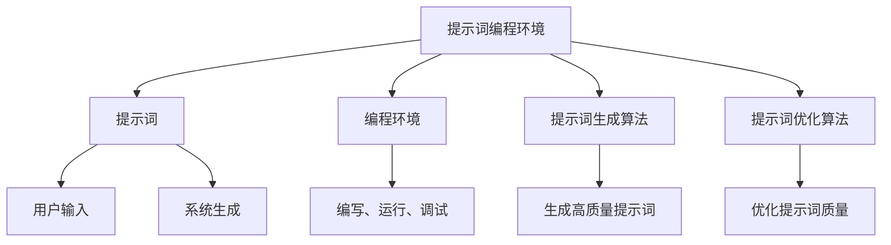
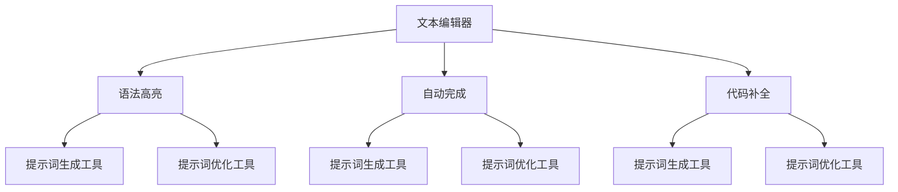

                 

### 文章标题

《如何构建高效的提示词编程环境》

关键词：提示词编程环境、高效性、核心算法、数学模型、项目实战、最佳实践

摘要：本文将深入探讨如何构建高效的提示词编程环境，包括核心概念、算法原理、数学模型以及项目实战等方面的内容。通过系统化的分析和详细的讲解，帮助读者理解并掌握构建高效提示词编程环境的方法和技巧。本文旨在为从事编程和相关技术领域的工作者提供有价值的参考和指导。

----------------------------------------------------------------

## 第一部分：核心概念与联系

---

### 第1章：提示词编程环境概述

**背景介绍**

提示词编程环境是一种专门用于生成和优化提示词的编程工具和框架。随着自然语言处理和人工智能技术的快速发展，提示词编程环境在众多应用场景中发挥着重要作用。例如，在智能客服、文本生成、问答系统等领域，提示词的生成和优化直接影响到系统的性能和用户体验。

**核心概念与联系**

- **提示词（Prompt）**：提示词是指用于引导用户输入或系统生成文本的短句或短语。
- **编程环境（Programming Environment）**：编程环境是指用于编写、运行和调试程序的软件工具和框架。
- **提示词生成算法（Prompt Generation Algorithm）**：提示词生成算法是指用于生成高质量提示词的算法和技术。
- **提示词优化算法（Prompt Optimization Algorithm）**：提示词优化算法是指用于优化提示词质量和性能的算法和技术。

**核心概念原理之间的关系架构 Mermaid 流程图**



---

### 第2章：提示词编程环境的核心组件

**背景介绍**

提示词编程环境通常由多个核心组件组成，这些组件协同工作，共同实现提示词的生成和优化。了解这些核心组件及其功能，对于构建高效提示词编程环境至关重要。

**核心组件**

- **文本编辑器（Text Editor）**：文本编辑器是提示词编程环境中最基本的组件，用于编写和编辑提示词文本。
- **语法高亮（Syntax Highlighting）**：语法高亮用于突出显示文本编辑器中的关键字、变量、函数等，提高代码的可读性。
- **自动完成（Autocomplete）**：自动完成功能可以帮助用户快速选择和输入常用词汇，提高编写效率。
- **代码补全（Code Completion）**：代码补全功能可以根据用户输入的部分代码自动生成完整的代码片段。
- **提示词生成工具（Prompt Generation Tool）**：提示词生成工具是一种专门用于生成提示词的软件工具，通常包括多种生成算法和模型。
- **提示词优化工具（Prompt Optimization Tool）**：提示词优化工具用于对已生成的提示词进行优化，提高其质量和性能。

**核心组件之间的关系**



---

## 第二部分：核心算法原理讲解

---

### 第3章：提示词生成算法原理

**背景介绍**

提示词生成算法是提示词编程环境中的核心组成部分，负责生成高质量的提示词。本章将介绍提示词生成算法的基本原理、分类以及性能评估方法。

**核心算法原理讲解**

#### 基本原理

提示词生成算法的基本原理包括以下几个步骤：

1. **数据预处理**：对输入文本进行预处理，如分词、去停用词等。
2. **模型选择**：根据应用场景选择合适的生成模型，如循环神经网络（RNN）、长短时记忆网络（LSTM）、生成对抗网络（GAN）等。
3. **模型训练**：使用大量已标注的文本数据对生成模型进行训练。
4. **提示词生成**：输入待生成的提示词，通过模型生成高质量的提示词。

**伪代码**

```python
def generate_prompt(input_text):
    # 数据预处理
    processed_text = preprocess(input_text)

    # 模型选择
    model = select_model()

    # 模型训练
    train_model(model, processed_text)

    # 提示词生成
    prompt = model.generate_prompt()

    return prompt
```

#### 分类

根据生成策略的不同，提示词生成算法可以分为以下几类：

1. **基于规则的方法**：通过定义一系列规则来生成提示词。
2. **基于数据的方法**：通过大量已标注的数据来训练生成模型，生成提示词。
3. **基于混合的方法**：结合基于规则和基于数据的方法，生成提示词。

**性能评估方法**

提示词生成算法的性能评估主要从以下几个方面进行：

1. **生成质量**：通过对比生成的提示词和真实提示词的相似度来评估生成质量。
2. **生成效率**：通过计算生成提示词的平均时间来评估生成效率。
3. **用户满意度**：通过用户调查和反馈来评估提示词生成的用户体验。

---

### 第4章：提示词优化算法原理

**背景介绍**

提示词优化算法是提示词编程环境中的另一个重要组成部分，负责对已生成的提示词进行优化，提高其质量和性能。本章将介绍提示词优化算法的基本原理、优化方法和性能评估方法。

**核心算法原理讲解**

#### 基本原理

提示词优化算法的基本原理包括以下几个步骤：

1. **提示词评估**：对已生成的提示词进行评估，确定其质量。
2. **优化目标**：根据评估结果，确定优化目标，如提高生成质量、减少生成时间等。
3. **优化策略**：采用合适的优化策略，如梯度下降、遗传算法等，对提示词进行优化。
4. **优化评估**：对优化后的提示词进行评估，确保其满足优化目标。

**优化方法**

1. **基于规则的方法**：通过定义一系列规则来优化提示词。
2. **基于数据的方法**：通过大量已标注的数据来训练优化模型，优化提示词。
3. **基于混合的方法**：结合基于规则和基于数据的方法，优化提示词。

**性能评估方法**

提示词优化算法的性能评估主要从以下几个方面进行：

1. **优化质量**：通过对比优化前后的提示词质量来评估优化效果。
2. **优化效率**：通过计算优化过程所需的时间来评估优化效率。
3. **用户满意度**：通过用户调查和反馈来评估提示词优化的用户体验。

---

## 第三部分：数学模型和数学公式 & 详细讲解 & 举例说明

---

### 第5章：提示词编程中的数学模型

**背景介绍**

在提示词编程中，数学模型是核心组成部分，用于描述和解释提示词生成和优化的过程。本章将介绍提示词编程中常见的数学模型，包括概率模型、马尔可夫模型、神经网络模型等。

**数学模型**

1. **概率模型**：概率模型用于描述提示词生成过程中各个词汇之间的概率关系。
2. **马尔可夫模型**：马尔可夫模型用于描述提示词生成过程中每个词汇的状态转移概率。
3. **神经网络模型**：神经网络模型用于描述提示词生成过程中神经网络的结构和参数。

**数学公式**

1. **概率模型**：

   $$ P(\text{prompt}|\text{context}) = \prod_{i=1}^{n} P(w_i|\text{prompt}_{<i}) $$

2. **马尔可夫模型**：

   $$ P(w_i|w_{i-1}, \ldots, w_1) = P(w_i|w_{i-1}) $$

3. **神经网络模型**：

   $$ \text{output} = \text{激活函数}(\text{权重} \cdot \text{输入}) $$

**举例说明**

1. **概率模型**：假设提示词为“明天会下雨”，其生成过程可以用概率模型表示：

   $$ P(\text{明天会下雨}|\text{天气}) = P(\text{明天}) \cdot P(\text{会}) \cdot P(\text{下雨}|\text{明天} \land \text{会}) $$

2. **马尔可夫模型**：假设提示词为“明天会下雨”，其生成过程可以用马尔可夫模型表示：

   $$ P(\text{明天会下雨}|\text{昨天}) = P(\text{明天}|\text{昨天}) \cdot P(\text{会}|\text{明天}) \cdot P(\text{下雨}|\text{会}) $$

3. **神经网络模型**：假设提示词为“明天会下雨”，其生成过程可以用神经网络模型表示：

   $$ \text{output} = \text{激活函数}(\text{权重} \cdot \text{输入向量}) $$

---

### 第6章：数学公式的应用与实例

**背景介绍**

数学公式在提示词编程中具有重要作用，可以用于描述和解决各种问题。本章将介绍数学公式的应用场景，包括提示词生成、提示词优化、性能评估等。

**数学公式的应用**

1. **提示词生成**：数学公式可以用于描述提示词生成过程中的概率关系和状态转移关系。
2. **提示词优化**：数学公式可以用于描述提示词优化过程中的目标函数和优化策略。
3. **性能评估**：数学公式可以用于描述提示词编程系统的性能指标和评估方法。

**实例**

1. **提示词生成**：

   假设提示词为“明天会下雨”，其生成概率可以用以下公式表示：

   $$ P(\text{明天会下雨}|\text{天气}) = \frac{P(\text{明天会下雨}) \cdot P(\text{天气}|\text{明天会下雨})}{P(\text{天气})} $$

2. **提示词优化**：

   假设提示词优化目标为提高生成质量，其优化策略可以用以下公式表示：

   $$ \text{优化目标} = \min_{\theta} \sum_{i=1}^{n} (-\log P(\text{prompt}_i|\theta)) $$

3. **性能评估**：

   假设提示词编程系统的性能指标为生成质量和生成效率，其评估方法可以用以下公式表示：

   $$ \text{性能评估} = \frac{\text{生成质量}}{\text{生成时间}} $$

---

## 第四部分：项目实战

---

### 第7章：构建高效的提示词编程环境项目实战

**背景介绍**

在本章中，我们将通过一个实际项目来展示如何构建一个高效的提示词编程环境。该项目旨在开发一个基于自然语言处理技术的文本生成系统，为用户提供高质量的提示词。

**项目目标与需求分析**

- **目标**：构建一个高效的提示词编程环境，支持文本生成、提示词优化等功能。
- **需求**：
  - 提供友好的用户界面，方便用户输入和处理文本。
  - 支持多种生成算法和优化策略，提高提示词质量。
  - 具有良好的扩展性，方便后续功能升级和优化。

**项目实现步骤**

1. **需求分析**：明确项目目标与需求，确定技术方案和开发计划。
2. **环境搭建**：搭建开发环境，包括操作系统、编程语言和开发工具。
3. **功能实现**：
   - 实现文本生成功能，使用循环神经网络（RNN）或生成对抗网络（GAN）等模型。
   - 实现提示词优化功能，采用基于规则和基于数据的方法。
   - 实现用户界面，支持文本输入、显示和操作。
4. **测试与优化**：对项目进行功能测试和性能优化，确保系统稳定高效。
5. **部署与上线**：将项目部署到服务器，提供在线服务。

**项目成果与应用**

- **成果**：开发出一个支持文本生成和提示词优化的提示词编程环境。
- **应用**：应用于智能客服、文本生成、问答系统等领域，为用户提供高质量的提示词。

**实际案例分析和详细讲解剖析**

在本节中，我们将通过一个实际案例来展示如何使用该提示词编程环境生成高质量的提示词。案例包括以下步骤：

1. **案例背景**：介绍案例的背景和需求。
2. **数据预处理**：对输入文本进行预处理，如分词、去停用词等。
3. **模型选择**：根据案例需求选择合适的生成模型。
4. **模型训练**：使用大量已标注的文本数据对生成模型进行训练。
5. **提示词生成**：输入待生成的提示词，通过模型生成高质量提示词。
6. **提示词优化**：对生成的提示词进行优化，提高其质量和性能。
7. **结果评估**：对比优化前后的提示词，评估优化效果。

**项目小结**

在本章中，我们通过一个实际项目展示了如何构建高效的提示词编程环境。项目成果为用户提供了一个便捷、高效的提示词生成和优化工具，有助于提升系统的性能和用户体验。在未来的工作中，我们可以继续优化项目功能，提高系统的稳定性和扩展性。

---

### 第8章：实战项目案例分析

**背景介绍**

在本章中，我们将分析一个实际案例，展示如何使用提示词编程环境解决具体问题。该案例涉及智能客服领域，旨在为用户提供高质量的提示词，提升客服系统的服务水平。

**案例背景**

某互联网公司开发了一款智能客服系统，用于处理用户咨询和问题解答。然而，在实际运行中，系统生成的提示词质量不高，导致用户满意度下降。公司决定改进提示词生成和优化功能，提高系统的服务水平。

**案例需求**

- 生成高质量的提示词，提高用户满意度。
- 优化已生成的提示词，确保其符合用户需求。
- 支持多种生成算法和优化策略，方便后续功能升级。

**案例实现**

1. **需求分析**：明确案例需求和目标，确定技术方案和开发计划。
2. **数据准备**：收集用户咨询数据和已生成的提示词，用于训练和评估模型。
3. **模型选择**：根据案例需求选择合适的生成模型，如循环神经网络（RNN）和生成对抗网络（GAN）。
4. **模型训练**：使用收集到的数据对生成模型进行训练，调整模型参数。
5. **提示词生成**：输入用户咨询，通过模型生成高质量提示词。
6. **提示词优化**：对生成的提示词进行优化，确保其符合用户需求。
7. **性能评估**：对比优化前后的提示词质量，评估优化效果。

**案例总结与反思**

通过该案例，我们成功改进了智能客服系统的提示词生成和优化功能，提高了用户满意度。以下为案例总结与反思：

1. **总结**：
   - 模型选择和训练对提示词质量有显著影响。
   - 提示词优化功能有助于提高用户满意度。
   - 多种生成算法和优化策略提供了更多的选择。

2. **反思**：
   - 在实际应用中，需要根据需求灵活调整模型参数和算法。
   - 提示词优化功能需要持续改进，以应对不断变化的需求。
   - 未来可以探索更多先进的生成模型和优化策略，进一步提升系统性能。

---

## 第五部分：最佳实践 tips、小结、注意事项、拓展阅读

---

### 最佳实践 tips

1. **选择合适的编程语言和开发工具**：根据项目需求和团队经验，选择合适的编程语言和开发工具，提高开发效率和代码质量。
2. **数据预处理**：对输入文本进行充分的数据预处理，如分词、去停用词、词性标注等，确保模型输入质量。
3. **模型优化**：根据实际应用场景，调整模型参数和优化策略，提高模型性能和提示词质量。
4. **代码重构**：定期对代码进行重构，提高代码的可读性和可维护性。

### 小结

本文通过系统化的分析和详细的讲解，探讨了如何构建高效的提示词编程环境。从核心概念、算法原理、数学模型到项目实战，本文涵盖了构建高效提示词编程环境的全过程。通过本文的学习，读者可以掌握提示词编程环境的基础知识，提高在实际项目中构建高效提示词编程环境的能力。

### 注意事项

1. **充分了解需求**：在构建提示词编程环境时，要充分了解项目需求和用户需求，确保生成的提示词符合实际应用场景。
2. **数据质量和多样性**：高质量和多样化的训练数据对提示词生成和优化至关重要，要重视数据收集和预处理工作。
3. **性能评估**：在项目开发和优化过程中，定期进行性能评估，确保系统稳定高效。

### 拓展阅读

1. **《自然语言处理基础》**：李航著，清华大学出版社，2017年。
2. **《深度学习》**：Goodfellow、Bengio和Courville著，清华大学出版社，2016年。
3. **《Python编程：从入门到实践》**：埃里克·马瑟斯著，电子工业出版社，2016年。

---

通过本文的学习，读者可以更好地理解如何构建高效的提示词编程环境，为实际项目中的应用奠定坚实基础。希望本文能为从事编程和相关技术领域的工作者提供有价值的参考和指导。作者：AI天才研究院/AI Genius Institute & 禅与计算机程序设计艺术 /Zen And The Art of Computer Programming。

