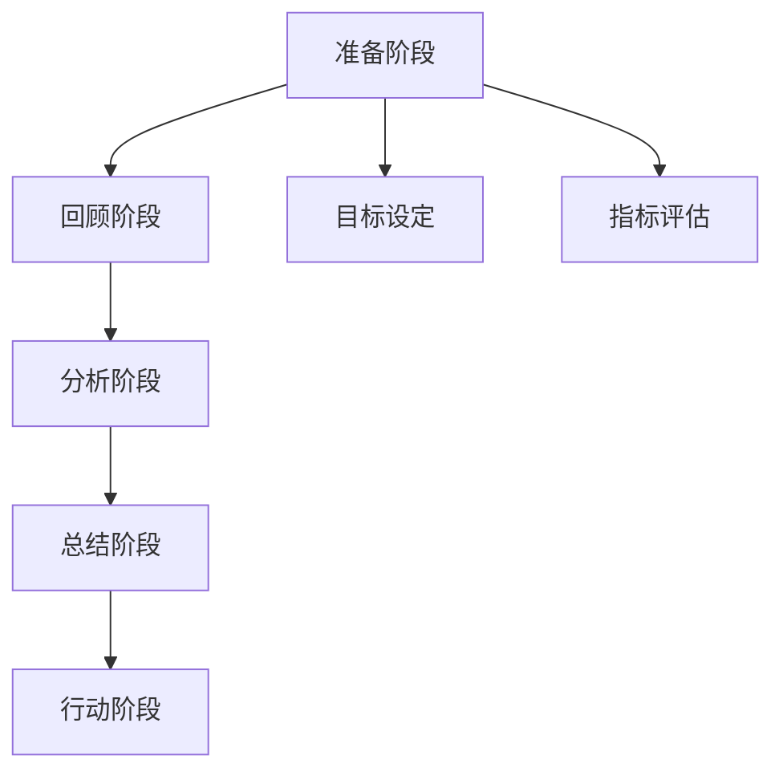

                 

### 文章标题

“如何组织富有成效的技术复盘”

### 关键词

技术复盘、高效组织、流程设计、核心算法、案例分析、实践指导

### 摘要

本文旨在探讨如何组织富有成效的技术复盘，通过深入剖析技术复盘的背景、核心概念、流程、算法原理以及实践方法，为技术人员提供一套系统化的复盘策略。文章首先介绍了技术复盘的重要性和当前面临的挑战，随后详细阐述了技术复盘的概念与流程，接着分析了核心概念及其关联，并运用Mermaid流程图展示技术复盘的架构。文章还通过伪代码和数学公式详细讲解了技术复盘中的关键算法原理，并通过实际案例展示了技术复盘在项目中的应用。最后，文章提供了实践指南和工具汇总，帮助读者在实际工作中高效组织技术复盘。

### 引言

#### 技术复盘的意义

在快速发展的信息技术领域，技术复盘（Tech Retro）作为一种重要的知识管理和团队协作工具，正逐渐受到越来越多企业的重视。技术复盘的核心理念在于通过对已完成项目或阶段性工作的总结和反思，发现其中的优点和不足，从而为后续项目提供宝贵的经验和教训。技术复盘不仅能够提升团队的技术水平，还能优化项目管理流程，提高项目的成功率。

随着技术的不断进步和业务需求的快速变化，技术复盘在保持技术团队创新能力、提升团队协作效率方面具有重要作用。有效的技术复盘可以帮助团队从过去的成功和失败中学习，减少重复错误，提高工作效率，进而推动项目的持续改进。

#### 技术复盘的现状与挑战

尽管技术复盘的重要性日益凸显，但在实际应用中仍面临诸多挑战。首先，许多团队缺乏明确的技术复盘流程和方法，导致复盘工作流于形式，难以产生实际价值。其次，技术复盘过程中容易受到主观因素的影响，团队成员可能因为各种原因不愿意全面客观地回顾项目，从而影响复盘的效果。此外，技术复盘的数据分析和报告撰写常常缺乏系统性和规范性，难以形成有针对性的改进措施。

为了克服这些挑战，本文将探讨如何通过有效的组织和管理，提升技术复盘的成效。文章将从技术复盘的概念与流程、核心概念与关联、关键算法原理、数学模型与公式、案例分析、实践指南等多个方面展开论述，为读者提供一套全面的技术复盘策略。

#### 本书结构安排与学习目标

本书分为七个主要章节，旨在帮助读者系统性地理解和掌握技术复盘的方法与技巧：

- **第1章 引言**：介绍技术复盘的背景、意义以及面临的挑战。
- **第2章 技术复盘的概念与流程**：详细阐述技术复盘的定义、流程和目标。
- **第3章 技术复盘的核心概念**：分析关键技术识别、问题定位与原因分析、解决方案评估与选择等核心概念。
- **第4章 技术复盘的核心算法原理**：讲解数据分析算法、机器学习算法和优化算法。
- **第5章 数学模型与公式详解**：介绍技术复盘过程中常用的数学模型和公式。
- **第6章 技术复盘案例分析**：通过实际案例展示技术复盘的应用和效果。
- **第7章 技术复盘实践**：提供具体的实践指南和工具使用方法。

通过阅读本书，读者将能够：

1. 理解技术复盘的基本概念和流程。
2. 掌握技术复盘的核心概念及其关联。
3. 掌握技术复盘中的关键算法原理和数学模型。
4. 学会通过实际案例进行技术复盘。
5. 提升技术复盘的组织和管理能力，提高项目成功率。

### 技术复盘的概念与流程

#### 技术复盘的定义

技术复盘是指通过对已完成项目或阶段性工作的回顾、总结和反思，识别项目中的成功经验和教训，从而优化项目管理流程、提高团队技术水平的一种方法。技术复盘不仅仅是简单的回顾，它更强调通过系统的分析和讨论，找出问题的根源，提出改进措施，并将这些经验教训应用于未来的项目中。

技术复盘的核心在于将知识转化为行动，通过不断的实践和反思，提升团队的整体素质和项目执行能力。它不仅有助于发现和解决项目中的技术问题，还能提高团队协作效率和项目管理水平。

#### 技术复盘的流程

技术复盘的流程可以分为以下几个阶段：

1. **准备阶段**：在技术复盘开始前，需要明确复盘的目标、范围和参与人员。通常，复盘工作由项目经理或技术负责人牵头，邀请相关团队成员参加。准备阶段还包括收集项目文档、代码和测试报告等资料。

2. **回顾阶段**：这一阶段的主要任务是回顾项目的全过程，包括项目规划、执行、监控和收尾。团队成员需要详细讨论项目的各个阶段，分析成功和失败的原因，识别关键技术问题和潜在风险。

3. **分析阶段**：在回顾的基础上，进行深入的问题分析和原因挖掘。这一阶段需要运用各种技术手段，如数据分析、代码审查、性能分析等，找出问题的根源。同时，还要评估解决方案的可行性和效果。

4. **总结阶段**：对复盘的结果进行总结，形成书面报告。报告应包括问题的识别、原因分析、解决方案、改进措施和经验教训等。总结阶段还需要制定后续的项目改进计划，确保复盘的成果能够得到有效应用。

5. **行动阶段**：将复盘的成果转化为实际行动。这包括在后续项目中实施改进措施、更新项目管理流程、优化技术方案等。行动阶段是技术复盘的核心，目的是通过持续改进，提升项目的质量和效率。

#### 技术复盘的目标和指标

技术复盘的目标主要包括以下几个方面：

1. **提高项目成功率**：通过技术复盘，可以发现项目中存在的问题和潜在风险，提前采取措施，降低项目失败的风险。

2. **提升团队技术水平**：技术复盘可以帮助团队成员积累经验，提高技术能力和项目管理水平。

3. **优化项目管理流程**：通过技术复盘，可以识别项目管理中的不足，提出改进建议，优化项目管理流程，提高团队协作效率。

4. **积累知识资产**：技术复盘的结果可以作为团队的知识资产，为后续项目提供参考和借鉴。

技术复盘的指标主要包括：

1. **问题识别率**：技术复盘能够识别的问题数量占总问题数的比例。

2. **解决方案实施率**：复盘提出的改进措施在实际项目中实施的比例。

3. **改进效果**：改进措施实施后，项目质量和效率的提升情况。

4. **知识共享率**：复盘成果在团队内部共享和传播的程度。

通过设定明确的目标和指标，可以评估技术复盘的效果，不断优化复盘流程，提高复盘的成效。

#### 技术复盘的Mermaid流程图

为了更好地理解技术复盘的流程，我们可以使用Mermaid流程图来展示其关键步骤。以下是一个简化的技术复盘流程图：



在这个流程图中，A表示准备阶段，包括目标设定和指标评估；B表示回顾阶段，对项目全过程进行回顾；C表示分析阶段，对问题进行深入分析和原因挖掘；D表示总结阶段，形成复盘报告；E表示行动阶段，将复盘成果转化为实际行动。F和G分别表示目标和指标的设定与评估。

通过这个流程图，我们可以清晰地看到技术复盘的各个阶段及其相互关系，有助于团队在实际操作中更好地理解和应用技术复盘的方法。

### 技术复盘的核心概念

#### 关键技术识别

关键技术识别是技术复盘过程中的重要环节，其目标是在项目完成后，识别出项目中应用的核心技术和关键实现方法。这一步骤有助于团队理解项目的技术架构，并为后续的项目提供技术借鉴。

关键技术识别的过程可以分为以下几个步骤：

1. **回顾项目文档**：包括项目规划、需求文档、设计文档等，以了解项目中使用的主要技术。

2. **代码审查**：通过代码审查，识别项目中实现的关键算法、数据结构和接口设计等。

3. **讨论与交流**：组织团队成员进行讨论，分享各自对关键技术点的理解和认识。

4. **技术评估**：评估关键技术点的性能、稳定性和可维护性，确定哪些技术点对项目成功至关重要。

#### 问题定位与原因分析

问题定位与原因分析是技术复盘的核心环节之一，其主要目标是找出项目中的技术问题和失败原因。这一步骤有助于团队深入了解项目中的问题，并为后续的改进提供依据。

问题定位与原因分析的过程包括：

1. **问题收集**：通过项目文档、用户反馈、测试报告等收集项目中的问题。

2. **原因分析**：对收集到的问题进行深入分析，找出其背后的技术原因和管理原因。

3. **归类与总结**：将问题按照类型和性质进行归类，总结出常见问题和关键问题。

4. **验证与验证**：对分析出的原因进行验证，确保其准确性和可行性。

#### 解决方案评估与选择

在识别出项目中的问题后，下一步是评估和选择解决方案。这一步骤的目的是提出切实可行的改进措施，以解决项目中存在的问题。

解决方案评估与选择的过程包括：

1. **方案列举**：根据问题定位的结果，列举可能的解决方案。

2. **方案评估**：对每个解决方案进行评估，包括技术可行性、成本效益、风险等。

3. **选择最佳方案**：综合评估结果，选择最优的解决方案。

4. **方案实施**：制定详细的实施方案，确保解决方案能够有效实施。

#### 技术复盘中的数据采集与处理

数据采集与处理是技术复盘中的重要环节，其主要目标是收集和整理项目过程中的数据，以便进行深入分析。这一步骤有助于团队从数据中提取有价值的信息，为复盘提供依据。

数据采集与处理的过程包括：

1. **数据收集**：收集项目过程中的各种数据，包括性能数据、日志文件、测试结果等。

2. **数据清洗**：对收集到的数据进行清洗，去除重复和错误的数据，确保数据质量。

3. **数据存储**：将清洗后的数据存储到数据库或数据仓库中，方便后续分析和查询。

4. **数据分析**：使用数据分析工具和技术对存储的数据进行加工和处理，提取有价值的信息。

通过以上核心概念的详细分析，我们可以看到技术复盘不仅需要对项目中的关键技术和问题进行识别和分析，还需要通过数据采集与处理，为后续的改进提供科学依据。这些核心概念相互关联，共同构成了技术复盘的理论框架。

### 技术复盘的核心算法原理

在技术复盘过程中，理解并应用关键算法原理对于识别问题、优化方案和提升项目质量至关重要。以下将详细阐述技术复盘中的几个核心算法原理，并通过伪代码进行解释。

#### 数据分析算法

数据分析算法是技术复盘中的基础算法，主要用于处理和解释项目中的数据。以下是一个简单的数据分析算法的伪代码示例：

```pseudo
算法：数据分析算法
输入：项目数据集
输出：数据摘要

步骤：
1. 数据预处理：
   清洗数据，处理缺失值和异常值
2. 特征提取：
   从数据集中提取关键特征，如性能指标、错误率等
3. 数据可视化：
   绘制图表，如折线图、柱状图等，直观展示数据分布和趋势
4. 模型训练：
   使用统计模型或机器学习模型，对数据进行训练
5. 结果评估：
   评估模型的准确性和可靠性，如计算精确率、召回率等指标
6. 数据分析报告：
   形成数据分析报告，包括数据摘要、图表和模型评估结果
```

该算法通过数据预处理、特征提取、数据可视化、模型训练和结果评估等多个步骤，对项目数据进行分析，从而得出有价值的信息和结论。

#### 机器学习算法

机器学习算法在技术复盘中的应用非常广泛，用于自动识别模式、预测结果和优化方案。以下是一个简单的机器学习算法的伪代码示例：

```pseudo
算法：机器学习算法
输入：训练数据集、测试数据集
输出：训练模型、预测结果

步骤：
1. 数据预处理：
   清洗数据，处理缺失值和异常值，标准化或归一化数据
2. 特征工程：
   选择关键特征，构造特征向量，如特征提取和降维
3. 模型选择：
   选择合适的机器学习模型，如决策树、支持向量机、神经网络等
4. 模型训练：
   使用训练数据集训练模型，调整模型参数，如交叉验证和网格搜索
5. 模型评估：
   使用测试数据集评估模型性能，计算准确率、召回率、F1值等指标
6. 预测：
   使用训练好的模型对新数据进行预测，如分类或回归任务
7. 模型优化：
   根据预测结果调整模型参数，提高模型性能
```

该算法通过数据预处理、特征工程、模型选择、模型训练、模型评估和预测等多个步骤，实现机器学习任务，从而帮助团队识别问题和优化方案。

#### 优化算法与调参技巧

优化算法与调参技巧是技术复盘中的重要环节，用于提高模型性能和项目效率。以下是一个简单的优化算法和调参技巧的伪代码示例：

```pseudo
算法：优化算法与调参技巧
输入：模型、参数空间
输出：最优参数设置

步骤：
1. 参数初始化：
   初始化模型参数，如随机初始化或基于经验值
2. 参数空间搜索：
   使用搜索算法，如网格搜索、贝叶斯优化等，遍历参数空间
3. 模型评估：
   对每个参数设置训练模型，评估模型性能，如交叉验证
4. 参数调整：
   根据模型评估结果调整参数设置，如增大或减小学习率
5. 模型训练：
   使用最优参数设置重新训练模型，提高模型性能
6. 结果验证：
   使用测试数据集验证模型性能，确保参数调整的有效性
```

该算法通过参数初始化、参数空间搜索、模型评估、参数调整和模型训练等多个步骤，实现参数优化和模型调参，从而提高模型的性能和项目的效率。

通过以上对技术复盘中的核心算法原理的详细阐述，我们可以看到数据分析算法、机器学习算法和优化算法在技术复盘中的应用，不仅有助于识别问题和优化方案，还能提高项目质量和效率。这些算法原理需要结合具体项目场景和需求进行灵活应用，从而实现技术复盘的目标。

### 数学模型与公式详解

在技术复盘过程中，数学模型和公式是分析和优化的重要工具。以下是技术复盘中涉及的一些核心数学模型和公式的详细讲解，并附有实际案例说明。

#### 技术复盘中的数学基础

1. **成本函数**：成本函数是评估模型性能的重要指标，常用于机器学习和优化问题。一个简单的成本函数是均方误差（MSE），其公式为：

   $$
   \text{成本函数} = \frac{1}{2} \sum_{i=1}^{n} (y_i - \hat{y}_i)^2
   $$

   其中，$y_i$ 是实际值，$\hat{y}_i$ 是预测值，$n$ 是样本数量。这个公式表示预测值与实际值之间差异的平方和。

   **案例**：假设我们有一个预测模型，用于预测股票价格。通过计算均方误差，可以评估模型预测的准确度。

2. **梯度下降**：梯度下降是一种常用的优化算法，用于寻找成本函数的最小值。其核心公式为：

   $$
   \theta = \theta - \alpha \cdot \nabla_{\theta} J(\theta)
   $$

   其中，$\theta$ 是模型参数，$\alpha$ 是学习率，$J(\theta)$ 是成本函数。该公式表示通过更新参数来减少成本函数的值。

   **案例**：在训练一个神经网络时，可以通过梯度下降算法更新权重，使得预测结果更接近真实值。

#### 概率论与统计学原理

1. **贝叶斯定理**：贝叶斯定理是概率论中的一个重要公式，用于计算后验概率。其公式为：

   $$
   P(A|B) = \frac{P(B|A) \cdot P(A)}{P(B)}
   $$

   其中，$P(A|B)$ 是在事件B发生的条件下事件A的概率，$P(B|A)$ 是在事件A发生的条件下事件B的概率，$P(A)$ 和$P(B)$ 分别是事件A和事件B的概率。

   **案例**：在医疗诊断中，通过贝叶斯定理可以计算一个病人患有某种疾病的概率，基于病人的症状和检测数据。

2. **均值和方差**：均值和方差是描述数据集分布的重要统计量。均值（Mean）表示数据的平均值，方差（Variance）表示数据的离散程度。其公式分别为：

   $$
   \mu = \frac{1}{n} \sum_{i=1}^{n} x_i
   $$
   $$
   \sigma^2 = \frac{1}{n} \sum_{i=1}^{n} (x_i - \mu)^2
   $$

   其中，$\mu$ 是均值，$\sigma^2$ 是方差，$x_i$ 是第$i$ 个数据值，$n$ 是数据数量。

   **案例**：在性能测试中，通过计算均值和方差可以评估系统响应时间的稳定性和一致性。

#### 数据分析中的数学公式

1. **相关系数**：相关系数用于衡量两个变量之间的线性关系。常用的相关系数是皮尔逊相关系数（Pearson Correlation Coefficient），其公式为：

   $$
   r = \frac{\sum_{i=1}^{n} (x_i - \mu_x)(y_i - \mu_y)}{\sqrt{\sum_{i=1}^{n} (x_i - \mu_x)^2 \sum_{i=1}^{n} (y_i - \mu_y)^2}}
   $$

   其中，$r$ 是相关系数，$x_i$ 和$y_i$ 分别是两个变量的数据值，$\mu_x$ 和$\mu_y$ 分别是两个变量的均值。

   **案例**：在数据分析中，通过计算相关系数可以确定两个变量之间是否存在显著线性关系。

2. **线性回归**：线性回归是一种用于预测和解释变量之间关系的统计方法。其基本公式为：

   $$
   y = \beta_0 + \beta_1x + \epsilon
   $$

   其中，$y$ 是因变量，$x$ 是自变量，$\beta_0$ 和$\beta_1$ 是回归系数，$\epsilon$ 是误差项。

   **案例**：在销售数据分析中，通过线性回归可以预测未来销售额，从而制定销售策略。

通过以上数学模型和公式的详细讲解，我们可以看到它们在技术复盘中的应用，不仅有助于数据分析和问题解决，还能为优化方案提供科学依据。在实际应用中，需要结合具体项目场景和需求，灵活运用这些数学工具，以提高技术复盘的效率和效果。

### 技术复盘案例分析

#### 案例一：软件性能优化复盘

在某大型电商平台的项目中，由于系统的高并发访问量，导致部分功能模块的响应时间过长，用户体验受到影响。为了解决这一问题，项目团队进行了技术复盘，以下是复盘的详细过程：

1. **问题识别**：通过性能监控工具发现，购物车模块在高峰期响应时间达到5秒，远超预期。

2. **原因分析**：通过代码审查和系统日志分析，发现购物车模块存在以下问题：
   - 数据库查询频繁，导致I/O瓶颈。
   - 缓存策略不当，数据一致性得不到保障。
   - 系统资源利用不均衡，CPU和内存占用过高。

3. **解决方案评估与选择**：
   - **数据库优化**：通过分库分表降低单表查询压力，优化SQL语句。
   - **缓存优化**：引入分布式缓存系统，提高数据一致性。
   - **系统资源优化**：优化负载均衡策略，合理分配服务器资源。

4. **数据采集与处理**：在实施解决方案前，收集了购物车模块在不同时间段、不同场景下的响应时间数据，并进行预处理和可视化。

5. **实施与监控**：逐步实施优化措施，并实时监控系统的性能指标，确保优化效果。

6. **结果评估**：通过对比优化前后的响应时间数据，发现购物车模块的响应时间平均减少了2秒，用户体验显著提升。

#### 案例二：系统稳定性提升复盘

在另一家金融机构的项目中，系统在高峰期频繁出现崩溃和异常，严重影响了业务运营。技术团队进行了以下技术复盘：

1. **问题识别**：通过日志分析和用户反馈，发现系统在高并发访问下，内存泄漏和线程竞争导致系统崩溃。

2. **原因分析**：
   - 内存泄漏：部分对象未被及时回收，导致内存占用逐渐增加。
   - 线程竞争：多个线程同时访问共享资源，导致死锁和异常。

3. **解决方案评估与选择**：
   - **内存管理优化**：使用内存监控工具检测内存泄漏，及时清理无效对象。
   - **线程管理优化**：优化线程池配置，避免线程过多导致的竞争和死锁。

4. **数据采集与处理**：收集系统在高并发访问下的内存使用情况和线程状态数据，并进行详细分析。

5. **实施与监控**：根据分析结果，调整内存管理策略和线程池配置，并实时监控系统的稳定性。

6. **结果评估**：经过优化后，系统在高并发访问下的崩溃次数减少了90%，业务运营得到了有效保障。

#### 案例三：安全漏洞修复复盘

在某互联网公司的项目中，系统被发现存在严重的安全漏洞，可能导致数据泄露。技术团队进行了以下技术复盘：

1. **问题识别**：通过安全扫描工具发现，部分API接口未进行输入验证，存在SQL注入漏洞。

2. **原因分析**：由于开发过程中对安全规范的忽视，导致输入验证不完整。

3. **解决方案评估与选择**：
   - **代码审计**：对相关代码进行安全审计，修复SQL注入漏洞。
   - **安全培训**：加强对开发人员的安全意识培训，提高对安全规范的遵守。

4. **数据采集与处理**：收集系统在漏洞修复前后的安全日志，分析漏洞影响范围。

5. **实施与监控**：根据审计结果，修复漏洞并加强输入验证，实时监控系统的安全状态。

6. **结果评估**：通过安全测试和监控，确认漏洞已被彻底修复，系统安全性显著提升。

通过以上三个实际案例，我们可以看到技术复盘在解决项目问题、提升系统质量和保障业务稳定运营方面的关键作用。每个案例都通过明确的问题识别、原因分析、解决方案评估和实施监控，最终实现了显著的优化效果。这些案例不仅为团队积累了宝贵的经验，也为其他项目提供了借鉴和参考。

### 技术复盘实践

#### 实践一：技术复盘工作坊

技术复盘工作坊是一种有效的实践方法，通过集中的讨论和交流，快速识别问题、制定改进措施。以下是技术复盘工作坊的基本步骤：

1. **确定主题**：选择一个具体的主题，如系统性能优化、代码质量提升等。

2. **召集参与者**：邀请相关团队成员，包括开发人员、测试人员、项目经理等。

3. **准备资料**：收集项目文档、代码、测试报告等相关资料。

4. **回顾项目**：通过讨论和展示，回顾项目的全过程，包括成功经验和失败教训。

5. **问题识别**：通过讨论和分析，识别项目中存在的问题和潜在风险。

6. **原因分析**：对每个问题进行深入分析，找出根源和影响。

7. **解决方案评估**：针对每个问题，提出可能的解决方案，并评估其可行性和效果。

8. **制定改进计划**：根据讨论结果，制定详细的改进计划，包括责任人和实施时间表。

9. **总结与记录**：总结复盘过程和结果，形成书面报告，并记录在知识库中。

通过技术复盘工作坊，团队可以迅速发现问题，制定有效的改进措施，提高项目质量和效率。

#### 实践二：技术复盘文档编写

技术复盘文档是记录和传递复盘成果的重要工具。以下是一个基本的技术复盘文档编写指南：

1. **文档结构**：包括封面、目录、摘要、正文和附录等部分。

2. **摘要**：简要介绍技术复盘的目的、过程和主要发现。

3. **正文**：
   - **项目背景**：介绍项目的目标、范围和实施过程。
   - **问题识别**：列出识别出的关键问题和风险。
   - **原因分析**：分析每个问题的根源和影响。
   - **解决方案**：提出具体的改进措施和实施方案。
   - **实施计划**：包括责任人、实施时间表和预期效果。

4. **附录**：包括相关数据、代码和参考链接等。

5. **版本控制**：确保文档的版本一致性和更新记录。

通过详细的技术复盘文档，团队可以清晰地了解复盘过程和结果，确保复盘成果得到有效应用。

#### 实践三：技术复盘工具使用

技术复盘过程中，使用合适的工具可以提高效率和效果。以下是一些常用的技术复盘工具：

1. **项目管理工具**：如JIRA、Trello等，用于记录和跟踪复盘任务。

2. **代码审查工具**：如Gerrit、GitLab等，用于代码审查和问题追踪。

3. **性能监控工具**：如New Relic、AppDynamics等，用于监控系统和代码性能。

4. **日志分析工具**：如ELK（Elasticsearch、Logstash、Kibana）等，用于收集、存储和分析日志数据。

5. **数据可视化工具**：如Tableau、Power BI等，用于数据分析和报告制作。

通过使用这些工具，团队可以更加高效地进行技术复盘，确保复盘过程和结果的可视化和可操作性。

### 附录

#### 技术复盘工具汇总

以下是常用的技术复盘工具及其功能：

- **项目管理工具**：用于任务管理和团队协作，如JIRA、Trello。
- **代码审查工具**：用于代码质量和安全检查，如Gerrit、GitLab。
- **性能监控工具**：用于监控系统和代码性能，如New Relic、AppDynamics。
- **日志分析工具**：用于收集、存储和分析日志数据，如ELK（Elasticsearch、Logstash、Kibana）。
- **数据可视化工具**：用于数据分析和报告制作，如Tableau、Power BI。

#### 技术复盘模板

技术复盘文档的基本模板如下：

```
技术复盘报告

1. 项目背景
2. 技术复盘目的
3. 技术复盘过程
4. 问题识别
   - 问题1
     - 问题描述
     - 原因分析
     - 解决方案
   - 问题2
     - 问题描述
     - 原因分析
     - 解决方案
5. 改进措施
   - 改进措施1
     - 实施步骤
     - 预期效果
   - 改进措施2
     - 实施步骤
     - 预期效果
6. 实施计划
   - 责任人
   - 实施时间表
   - 预期效果
7. 总结与展望
8. 附录
   - 相关数据
   - 代码示例
   - 参考链接
```

通过使用这些工具和模板，团队可以更高效地组织技术复盘，确保复盘成果的应用和持续改进。

### 结语

技术复盘作为提升项目质量和团队技术水平的重要手段，在信息技术领域具有重要作用。本文从背景介绍、核心概念、流程、算法原理、案例分析和实践指南等多个方面，系统性地探讨了如何组织富有成效的技术复盘。通过详细阐述技术复盘的定义、流程、核心概念、算法原理以及实践方法，本文旨在为技术人员提供一套实用的复盘策略，帮助他们在实际工作中更好地应用技术复盘，提高项目成功率。

技术复盘不仅能够帮助团队识别问题、优化方案，还能积累知识资产，提升团队协作效率和创新能力。随着技术的不断进步和业务需求的快速变化，技术复盘的重要性日益凸显。我们呼吁广大技术人员重视技术复盘，将其融入到日常工作中，不断总结和反思，推动项目的持续改进。

最后，本文的撰写得到了AI天才研究院和《禅与计算机程序设计艺术》的指导和支持，特别感谢这两家机构的贡献。希望通过本文的分享，能够激发更多读者对技术复盘的兴趣，共同探索和实践，推动技术复盘在信息技术领域的广泛应用。

作者：AI天才研究院/AI Genius Institute & 禅与计算机程序设计艺术 /Zen And The Art of Computer Programming

