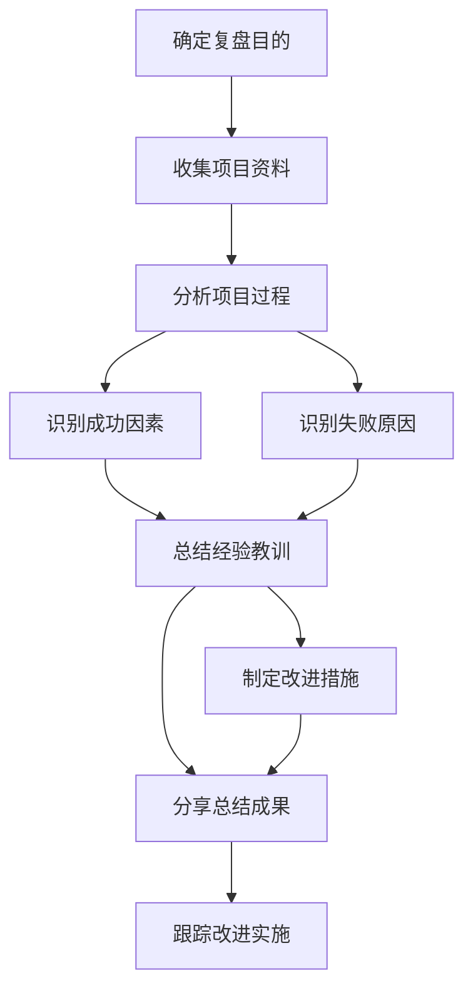

                 

### 文章标题

“如何组织有效的技术复盘会议”

### 关键词

技术复盘、会议组织、沟通技巧、反馈机制、持续改进

### 摘要

本文旨在探讨如何有效地组织技术复盘会议。我们将详细分析技术复盘的定义和重要性，讨论技术复盘会议的目标和类型，提供组织技术复盘会议的准备工作步骤，介绍会议中有效沟通的技巧，阐述技术复盘会议的执行和记录方法，以及会议后的总结和反馈过程。最后，我们将讨论如何改进和优化技术复盘会议。通过本文的指导，读者将能够掌握组织高效技术复盘会议的方法，提高团队的技术水平和协作效率。

## 第1章：技术复盘概述

### 1.1 技术复盘的定义和重要性

技术复盘，即技术回顾或技术总结，是一种通过系统性的方式对已完成的技术项目或技术活动进行回顾、分析和总结的过程。其核心目标是通过反思和讨论，发现成功和失败的原因，提炼经验教训，以便在未来的项目中避免重复错误，提升团队的技术能力和工作效率。

技术复盘的重要性体现在以下几个方面：

1. **知识传承**：通过复盘，团队成员可以共享经验，将优秀的技术实践和解决方案传递给其他成员，形成知识库，促进团队的持续学习和发展。
2. **问题发现**：复盘可以帮助团队识别项目中存在的问题和潜在风险，提前制定应对策略，减少项目风险和损失。
3. **能力提升**：通过复盘，团队成员可以了解自己在项目中的表现，发现自己的不足，并寻求改进方法，从而提高个人和团队的技术能力。
4. **流程优化**：复盘有助于团队分析和优化项目管理流程、开发流程和沟通机制，提高项目的执行效率和团队的整体协作能力。

### 1.2 技术复盘与持续学习的联系

技术复盘是持续学习的重要组成部分。持续学习是一种持续获取新知识、新技能的过程，而技术复盘则是这一过程中不可或缺的一环。通过技术复盘，团队成员可以：

- **巩固新知识**：通过回顾和讨论，团队成员可以将新学的知识和技术应用到实际项目中，加深对知识的理解和掌握。
- **积累实战经验**：复盘可以记录和总结项目中的成功经验和失败教训，为团队成员提供宝贵的实战经验。
- **提高学习效率**：通过技术复盘，团队可以识别和解决学习中的问题，优化学习方法和策略，提高学习效率。

### 1.3 技术复盘的常见挑战

尽管技术复盘具有重要意义，但在实际操作中，团队常常面临以下挑战：

1. **时间安排**：技术复盘需要占用团队的时间，而在忙碌的项目开发中，常常难以找到合适的时间进行复盘。
2. **参与度不高**：部分团队成员可能认为复盘会议是浪费时间，缺乏参与的兴趣和积极性。
3. **缺乏系统方法**：没有明确的复盘方法和流程，可能导致复盘会议效率低下，无法达到预期效果。
4. **反馈处理**：复盘过程中收集的反馈和问题，如果没有得到妥善处理，可能会导致团队成员失去信心和积极性。

为了克服这些挑战，我们需要制定有效的技术复盘会议组织和执行策略，确保复盘会议的顺利进行和实际效果。

### 1.4 技术复盘的Mermaid流程图

为了更好地理解和实施技术复盘，以下是一个简单的Mermaid流程图，展示了技术复盘的基本流程：

通过这个流程图，我们可以看到技术复盘的各个步骤是如何相互关联的，从而为实际操作提供指导。

### 1.5 技术复盘与敏捷开发的关系

技术复盘与敏捷开发理念紧密相关。敏捷开发强调快速迭代、持续交付和团队协作，而技术复盘则是一种实现这些目标的工具。通过技术复盘，团队可以：

- **快速响应变更**：复盘可以帮助团队快速识别变更的原因和影响，及时调整开发计划和策略。
- **持续改进**：复盘过程中发现的改进点可以纳入下一个迭代，实现持续改进。
- **增强团队协作**：复盘会议提供了一个团队协作的平台，通过共享经验和讨论，增强团队凝聚力。

### 1.6 技术复盘的常见类型

根据不同的目的和范围，技术复盘可以分为以下几种常见类型：

1. **项目级复盘**：针对一个完整的项目进行复盘，通常在项目结束后进行。
2. **迭代级复盘**：在敏捷开发中，每个迭代结束后进行复盘，重点关注本次迭代中的成功和失败经验。
3. **任务级复盘**：针对一个具体任务或功能模块进行复盘，通常在任务完成后进行。
4. **知识分享会**：以知识分享为目的的复盘会议，通常邀请不同项目的成员参加，促进跨项目的知识交流。

每种类型的复盘都有其适用场景和重点，团队可以根据实际情况选择合适的复盘类型。

### 1.7 技术复盘与个人职业发展的关系

技术复盘不仅对团队有重要意义，也对个人职业发展有着积极影响。通过技术复盘，个人可以：

- **提高技术能力**：复盘可以帮助个人了解自己在技术方面的不足，并寻找改进的方法。
- **增强问题解决能力**：复盘过程中，个人需要分析和解决项目中遇到的问题，从而提高问题解决能力。
- **提升沟通能力**：在复盘会议上，个人需要与其他团队成员进行沟通和讨论，提升沟通技巧。
- **积累项目经验**：复盘可以帮助个人积累丰富的项目经验，为未来的职业发展打下坚实基础。

### 1.8 技术复盘与传统总结的区别

虽然技术复盘和传统总结在某些方面有相似之处，但二者在目标和执行方式上有显著区别。

- **目标不同**：传统总结更多是对项目结果的回顾，而技术复盘则强调通过反思和讨论来提高团队的技术能力和工作效率。
- **方法不同**：传统总结通常采用自上而下的方式，由项目经理或领导主导；而技术复盘更多采用自下而上的方式，鼓励团队成员积极参与，共同总结经验教训。
- **效果不同**：技术复盘通过系统的分析和讨论，能够更准确地识别问题并提出改进措施，从而实现持续改进；而传统总结则可能只是对结果的简单回顾，无法有效促进团队的发展。

通过明确技术复盘与传统总结的区别，团队可以更好地选择适合的总结方式，实现最佳效果。

### 1.9 技术复盘会议的组织原则

为了确保技术复盘会议的有效性，组织者需要遵循以下原则：

- **明确目标**：在会议前明确复盘的目标和议程，确保会议的针对性。
- **广泛参与**：鼓励团队成员积极参与，提供发言和讨论的机会，确保信息的全面性和多样性。
- **平等交流**：尊重每个成员的意见和观点，营造平等、开放的讨论氛围。
- **记录总结**：会议过程中要详细记录讨论内容和结论，便于后续的跟踪和落实。
- **及时反馈**：对会议结果进行及时反馈，确保改进措施得到有效执行。

通过遵循这些原则，技术复盘会议可以更加高效地促进团队的技术发展和协作。

### 1.10 技术复盘的流程和方法

技术复盘的流程通常包括以下几个步骤：

1. **确定复盘目标**：明确复盘的目标和范围，确保会议的针对性。
2. **收集项目资料**：收集与项目相关的文档、代码、日志等资料，为复盘提供基础。
3. **分析项目过程**：对项目的过程进行详细分析，包括成功因素和失败原因。
4. **识别改进点**：根据分析结果，识别需要改进的点和措施。
5. **制定改进计划**：制定具体的改进计划和执行方案。
6. **分享总结成果**：将复盘结果分享给团队，促进知识的共享和传播。

在技术复盘过程中，可以采用多种方法，如SWOT分析、鱼骨图、5W1H等，以提高分析的效果和深度。

### 1.11 技术复盘的常见问题和解决方案

在技术复盘过程中，团队可能会遇到以下问题：

- **参与度不高**：解决方案：提高团队成员的参与意识，鼓励他们分享经验和观点。
- **反馈处理不及时**：解决方案：建立反馈收集和处理机制，确保反馈得到及时回应。
- **复盘内容空洞**：解决方案：在复盘前做好充分准备，确保复盘内容具体、有深度。
- **改进措施不落实**：解决方案：建立跟踪机制，确保改进措施得到有效执行。

通过识别和解决这些问题，技术复盘的效果可以得到显著提升。

### 1.12 技术复盘的实际案例

以下是一个技术复盘的实际案例：

**项目背景**：某团队在开发一个在线教育平台时，遇到了用户响应速度慢和系统稳定性差的问题。

**复盘过程**：
1. 确定复盘目标：分析系统性能瓶颈和稳定性问题。
2. 收集项目资料：收集系统日志、性能测试报告等。
3. 分析项目过程：发现数据库查询优化不足和服务器配置不合理是导致性能问题的原因。
4. 识别改进点：优化数据库查询和调整服务器配置。
5. 制定改进计划：实施优化措施，并进行测试验证。
6. 分享总结成果：将优化结果和经验教训分享给团队。

**复盘效果**：通过技术复盘，团队成功解决了性能问题，提升了系统的稳定性和用户体验。

通过这个案例，我们可以看到技术复盘在实际项目中的应用和效果。

### 1.13 技术复盘与团队文化的关系

技术复盘是团队文化的重要组成部分。一个重视技术复盘的团队通常具有以下特点：

- **开放性**：团队鼓励成员分享经验和观点，营造开放、包容的讨论氛围。
- **学习性**：团队注重持续学习和改进，通过复盘不断提升技术能力和工作效率。
- **协作性**：团队通过复盘促进成员之间的协作和沟通，增强团队凝聚力。
- **反思性**：团队善于从成功和失败中吸取教训，不断优化工作流程和方法。

通过构建良好的技术复盘文化，团队可以实现持续发展和技术突破。

### 1.14 技术复盘与团队协作的关系

技术复盘在团队协作中发挥着重要作用。通过技术复盘，团队可以实现以下目标：

- **提高协作效率**：复盘可以帮助团队识别协作中的问题和改进点，提高协作效率。
- **增强团队凝聚力**：复盘过程中的沟通和讨论有助于增强团队成员之间的信任和凝聚力。
- **优化协作流程**：复盘可以分析协作流程中的瓶颈和不足，提出优化方案，提升团队协作效果。

通过技术复盘，团队可以不断优化协作机制，提高整体协作水平。

### 1.15 技术复盘的最佳实践

为了确保技术复盘会议的效果，以下是一些最佳实践：

- **提前规划**：在会议前制定详细的复盘计划和议程。
- **聚焦问题**：确保复盘会议聚焦于关键问题和改进点。
- **鼓励参与**：鼓励团队成员积极参与讨论，分享经验和观点。
- **详细记录**：会议过程中要详细记录讨论内容和结论，便于后续执行。
- **持续跟踪**：对改进措施进行跟踪和评估，确保得到有效执行。

通过遵循这些最佳实践，技术复盘会议可以更加高效、有成效。

### 1.16 技术复盘的注意事项

在组织技术复盘会议时，需要注意以下几点：

- **避免形式主义**：确保复盘会议具有实际效果，避免只走过场。
- **保护个人隐私**：在讨论中尊重个人隐私，避免泄露敏感信息。
- **注重实际改进**：确保复盘结果能够转化为实际的改进措施，提升项目质量。
- **鼓励积极反馈**：营造积极、开放的氛围，鼓励团队成员提出问题和建议。

通过注意这些事项，可以确保技术复盘会议的有效性和团队的发展。

### 1.17 技术复盘的未来发展趋势

随着技术的不断进步，技术复盘也在不断演进。未来的发展趋势包括：

- **智能化**：利用人工智能技术，自动分析项目数据，提高复盘效率。
- **多样化**：结合多种复盘方法和工具，提高复盘的全面性和深度。
- **社交化**：通过社交平台，促进跨团队的复盘交流和协作。

技术复盘的未来将更加智能化、多样化和社交化，为团队的发展提供更强有力的支持。

## 第2章：技术复盘会议的目标和类型

### 2.1 会议目标

技术复盘会议的目标是通过对已完成的项目或任务进行回顾和分析，识别成功和失败的原因，总结经验教训，从而提升团队的技术能力、项目执行效率和协作水平。具体目标包括：

1. **识别问题**：通过复盘，找出项目或任务中的问题，包括技术问题、管理问题等。
2. **总结经验**：总结项目或任务中的成功经验和失败教训，提炼出可复制的最佳实践。
3. **改进措施**：针对发现的问题，制定具体的改进措施，并确保这些措施得到实施。
4. **知识共享**：通过分享经验和教训，促进团队内部的知识交流和传递。
5. **提升效率**：通过复盘，优化项目管理流程和开发流程，提高项目执行效率。

### 2.2 不同类型的技术复盘会议

根据不同的目标和范围，技术复盘会议可以分为以下几种类型：

1. **项目级复盘会议**：这种会议针对一个完整的项目进行复盘，通常在项目结束后进行。项目级复盘会议的目标是全面总结项目的成功和失败经验，分析项目过程中的关键事件和决策，为未来类似项目提供参考。

2. **迭代级复盘会议**：在敏捷开发中，每个迭代结束后都会进行迭代级复盘会议。这种会议聚焦于本次迭代中的具体任务和成果，分析任务完成情况、发现问题和改进点，为下一个迭代做好准备。

3. **任务级复盘会议**：针对一个具体任务或功能模块进行复盘，通常在任务完成后进行。任务级复盘会议的目标是总结任务执行过程中的经验教训，识别问题和改进点，提高任务执行效果。

4. **知识分享会**：以知识分享为目的的复盘会议，通常邀请不同项目的成员参加。知识分享会的内容可以是项目经验、技术心得、最佳实践等，旨在促进跨项目的知识交流和传递。

5. **突发事件复盘会议**：针对项目或任务中发生的突发事件（如系统故障、安全漏洞等）进行复盘。这种会议的目标是快速识别事件的原因和影响，制定应对策略，防止类似事件再次发生。

### 2.3 成功案例分享

为了更好地理解技术复盘会议的实际效果，以下是几个成功案例：

**案例一：某电商平台的迭代级复盘**

某电商平台的开发团队在每个迭代结束后都会进行迭代级复盘会议。在某个迭代中，团队发现用户响应速度较慢，影响用户体验。通过复盘，团队识别出数据库查询优化不足是导致速度慢的主要原因。随后，团队针对查询优化进行了改进，并在下一个迭代中进行验证。改进后，用户响应速度明显提升，用户体验得到显著改善。

**案例二：某金融科技公司的项目级复盘**

某金融科技公司的开发团队在完成一个大型项目后，组织了一次项目级复盘会议。会议中，团队分析了项目中的成功因素，如良好的项目管理、高效的沟通和协作等，同时也总结了失败教训，如项目规划不周和风险控制不足等。基于复盘结果，团队制定了改进措施，并在后续项目中加以实施，提高了项目的执行效率和成功率。

**案例三：某软件开发公司的知识分享会**

某软件开发公司定期组织知识分享会，邀请不同项目的团队成员分享项目经验和技术心得。在一次知识分享会上，一位开发人员分享了在项目中使用的新技术，包括其优点和注意事项。其他团队成员在听后提出了自己的疑问和建议，通过讨论，大家对新技术的理解和应用能力得到了提升。

这些案例展示了技术复盘会议在不同场景中的应用效果，通过复盘，团队不仅识别了问题和改进点，还促进了知识的共享和传递，提高了整体的技术能力和协作水平。

## 第3章：组织技术复盘会议的准备工作

### 3.1 确定会议目的和议程

组织技术复盘会议的首要步骤是明确会议的目的和议程。这一步骤至关重要，因为它将指导整个会议的进行，确保会议内容有针对性且高效。具体步骤如下：

1. **明确会议目的**：
   - **总结项目或任务成果**：回顾项目或任务的完成情况，总结成功经验和失败教训。
   - **识别问题和改进点**：通过复盘，找出项目或任务中的问题，并提出改进措施。
   - **促进知识共享**：分享项目经验和技术心得，促进团队内部的知识交流和传递。
   - **提高协作效率**：分析项目过程中的协作情况，优化协作流程，提高团队整体效率。

2. **制定会议议程**：
   - **开场**：简要介绍会议目的、议程和参会人员。
   - **项目回顾**：详细回顾项目或任务的执行过程，包括关键事件、决策和执行结果。
   - **成功与失败经验**：总结项目或任务中的成功经验和失败教训，讨论其产生的原因。
   - **改进措施**：针对识别的问题和改进点，讨论可行的解决方案，并制定具体的行动计划。
   - **知识共享**：分享项目中的技术心得和经验，促进知识的传递和交流。
   - **反馈与讨论**：收集参会人员的反馈和建议，进行讨论和总结。
   - **总结与结束**：总结会议内容，明确下一步行动计划和责任分工。

通过明确会议目的和议程，可以确保会议内容有条不紊地进行，避免偏离主题，提高会议的效率。

### 3.2 选择合适的会议时间和地点

选择合适的会议时间和地点是确保技术复盘会议顺利进行的关键因素。以下是一些具体的考虑因素：

1. **会议时间**：
   - **避免高峰时段**：选择团队较为空闲的时间，避免与项目关键节点或高峰工作时段冲突。
   - **确保充足时间**：会议时间应足够长，以确保有充分的时间进行项目回顾、讨论和总结。
   - **连续性**：如果复盘会议分多次进行，应确保每次会议的时间连续，避免中断。

2. **会议地点**：
   - **便利性**：选择交通便利、设备齐全的会议室，确保参会人员能够轻松到达。
   - **环境舒适**：选择空气流通、噪音较小、光线充足的场所，提供一个舒适的工作环境。
   - **设备支持**：确保会议室配备必要的设备，如投影仪、音响、白板等，以便于会议记录和展示。
   - **隐私保护**：如果会议涉及敏感信息，应选择保密性较好的会议室，确保会议内容的私密性。

通过仔细选择会议时间和地点，可以确保会议的顺利进行，提高参会人员的参与度和会议效果。

### 3.3 策划会议参与者和角色分配

确定会议参与者和角色分配是技术复盘会议成功的关键步骤。以下是一些具体的策划要点：

1. **确定参会人员**：
   - **项目团队成员**：包括项目经理、开发人员、测试人员、产品经理等，确保涵盖项目各个环节的关键人员。
   - **外部专家**：如果项目涉及特定领域或技术，可以邀请外部专家参与，提供专业的意见和建议。
   - **关键利益相关者**：如果项目涉及客户或其他利益相关方，应邀请他们参与，确保复盘结果的全面性和实用性。

2. **角色分配**：
   - **主持人**：负责会议的流程控制，确保会议按照议程进行，引导讨论和总结。
   - **记录员**：负责记录会议内容，包括讨论的要点、结论和行动计划。
   - **讨论小组**：将参会人员分成小组，进行深入的讨论和交流，确保每个观点都能得到充分讨论。
   - **总结员**：负责汇总讨论结果，制定改进措施和行动计划。

通过合理分配角色，可以确保会议的顺利进行，提高讨论的质量和效果。

### 3.4 设计会议议程

设计有效的会议议程是确保技术复盘会议顺利进行的关键。以下是一些设计会议议程的要点：

1. **开场环节**：
   - **主持人开场**：简要介绍会议目的、议程和参会人员。
   - **项目背景**：回顾项目或任务的背景信息，确保参会人员对项目有基本的了解。

2. **项目回顾**：
   - **关键事件**：回顾项目或任务中的关键事件，包括成功和失败的经验。
   - **决策分析**：分析项目中的关键决策，讨论决策的影响和结果。

3. **成功与失败经验**：
   - **成功经验**：总结项目或任务中的成功经验，讨论其产生的原因。
   - **失败教训**：识别项目中的失败教训，分析其产生的原因。

4. **改进措施**：
   - **问题识别**：根据讨论结果，识别需要改进的问题和改进点。
   - **解决方案**：讨论可行的解决方案，制定具体的行动计划。

5. **知识共享**：
   - **技术心得**：分享项目中的技术心得和经验，促进团队内部的知识传递。
   - **最佳实践**：讨论并总结最佳实践，为后续项目提供参考。

6. **反馈与讨论**：
   - **收集反馈**：收集参会人员的反馈和建议，确保每个观点都能得到讨论。
   - **总结与结论**：汇总讨论结果，明确改进措施和行动计划。

7. **总结与结束**：
   - **总结内容**：总结会议内容，确保所有讨论的要点和结论得到记录和传达。
   - **行动计划**：明确下一步的行动计划，分配责任人和时间节点。

通过设计详细的会议议程，可以确保会议内容有条不紊地进行，提高会议的效率和质量。

### 3.5 分配会议责任人和跟进人

为了确保技术复盘会议的成果能够得到有效执行，分配会议责任人和跟进人至关重要。以下是一些具体的分配要点：

1. **责任人**：
   - **改进措施制定**：每个改进措施应明确责任人，确保改进措施得到具体落实。
   - **行动计划执行**：责任人应负责监督和推动行动计划的执行，确保各项任务按时完成。

2. **跟进人**：
   - **进度汇报**：跟进人负责向会议负责人和团队成员汇报改进措施的进展情况，确保沟通畅通。
   - **问题反馈**：跟进人应及时反馈改进过程中遇到的问题，以便及时调整和解决。

通过明确责任人和跟进人，可以确保技术复盘会议的改进措施得到有效执行，提高项目的质量和效率。

### 3.6 准备必要的技术资料和工具

在组织技术复盘会议时，准备必要的技术资料和工具是确保会议顺利进行的重要环节。以下是一些具体的准备要点：

1. **技术资料**：
   - **项目文档**：包括项目需求文档、设计文档、测试报告等，确保参会人员对项目有全面了解。
   - **代码和日志**：提供与项目相关的代码和日志，便于分析项目执行过程中的问题和改进点。
   - **数据报表**：包括项目进度、性能指标、用户体验数据等，帮助参会人员更直观地了解项目情况。

2. **工具**：
   - **会议软件**：选择合适的会议软件，如Zoom、Microsoft Teams等，确保视频会议的稳定和清晰。
   - **讨论工具**：如Miro、Trello等，用于实时讨论和记录会议内容。
   - **演示工具**：如PowerPoint、Google Slides等，用于展示项目数据和讨论结果。

通过准备必要的技术资料和工具，可以确保会议的顺利进行，提高讨论的效率和质量。

### 3.7 确保会议环境的舒适和设备齐全

为了确保技术复盘会议的顺利进行，会议环境的舒适和设备齐全至关重要。以下是一些具体的注意事项：

1. **环境舒适**：
   - **通风良好**：确保会议室内空气流通，提供新鲜空气，减少异味和污染。
   - **温度适宜**：调节室内温度，确保参会人员感觉舒适。
   - **噪音控制**：减少外界噪音干扰，如关闭窗户、关闭手机等。

2. **设备齐全**：
   - **音响设备**：确保音响设备音质清晰，音量适中，便于参会人员听取讨论内容。
   - **投影设备**：确保投影设备正常工作，画面清晰，方便展示项目数据和讨论结果。
   - **网络连接**：确保网络连接稳定，避免会议过程中出现连接中断的情况。

通过营造舒适的环境和确保设备齐全，可以提高参会人员的专注度和会议效果。

### 3.8 测试会议设备的连接和功能

在技术复盘会议开始前，测试会议设备的连接和功能是确保会议顺利进行的重要步骤。以下是一些具体的测试要点：

1. **音频测试**：
   - **麦克风和扬声器**：确保麦克风和扬声器连接正常，音量适中，音质清晰。
   - **音频输入输出**：检查音频输入输出是否正常，确保参会人员的声音能够清晰传输。

2. **视频测试**：
   - **摄像头和显示器**：确保摄像头和显示器连接正常，画面清晰，角度合适。
   - **视频输入输出**：检查视频输入输出是否正常，确保参会人员的视频画面能够清晰显示。

3. **网络测试**：
   - **网络连接速度**：检查网络连接速度，确保视频会议的稳定和流畅。
   - **网络延迟**：测试网络延迟，确保会议过程中不会出现明显的延迟和卡顿。

通过测试会议设备的连接和功能，可以确保会议的顺利进行，减少设备故障对会议的影响。

### 3.9 提前通知参会人员并收集意见和建议

为了确保技术复盘会议的顺利进行，提前通知参会人员并收集他们的意见和建议是至关重要的。以下是一些具体的操作要点：

1. **提前通知**：
   - **发送会议通知**：提前发送会议通知，包括会议时间、地点、议程和参会人员等信息，确保参会人员有足够的时间准备。
   - **提醒会议时间**：在会议前一周和前一天分别发送提醒邮件，确保参会人员不会忘记会议时间。

2. **收集意见和建议**：
   - **征求意见**：在会议通知中征求参会人员的意见和建议，鼓励他们提出关于会议议程、讨论内容和设备准备等方面的建议。
   - **建立反馈渠道**：建立反馈渠道，如邮件、讨论组等，方便参会人员在会议前和会议后提出意见和建议。

通过提前通知和收集意见和建议，可以确保会议内容更加贴合参会人员的需求，提高会议的参与度和效果。

### 3.10 确保会议记录和跟进的记录

确保会议记录和跟进的记录是技术复盘会议成功的重要保障。以下是一些具体的记录和跟进要点：

1. **会议记录**：
   - **详细记录**：会议期间，记录员应详细记录会议内容，包括讨论的要点、结论和行动计划。
   - **及时整理**：会议结束后，及时整理会议记录，形成书面文档，确保记录的准确性和完整性。

2. **跟进记录**：
   - **行动计划**：根据会议结论，制定具体的行动计划，明确责任人和时间节点。
   - **跟进记录**：跟进责任人应定期记录行动计划的执行情况，包括进展、问题和解决措施。

通过详细记录和跟进记录，可以确保技术复盘会议的成果得到有效执行，提高项目的质量和效率。

### 第4章：会议中有效沟通的技巧

### 4.1 倾听和提问的技巧

有效沟通是技术复盘会议成功的关键。在会议中，倾听和提问是两种至关重要的沟通技巧，它们能够帮助参会人员更好地理解和传达信息，促进讨论的深入和合作的高效。以下是一些关于倾听和提问的具体技巧：

#### 倾听的四个层次

1. **表面倾听**：
   - **听而不记**：仅仅听到对方的话语，但没有进行深入的理解。
   - **问题**：可能导致信息误解和沟通失败。

2. **理解倾听**：
   - **听懂对方话语**：在听的同时，尝试理解对方表达的意思。
   - **问题**：可能遗漏细节或误解关键点。

3. **深入倾听**：
   - **理解话语背后的意图**：不仅理解对方的话语，还理解其背后的意图和感受。
   - **优点**：有助于建立信任和深入讨论。

4. **共鸣倾听**：
   - **设身处地理解**：站在对方的角度理解其话语和感受。
   - **优点**：增强共鸣，促进合作。

#### 提问的五种类型

1. **开放性问题**：
   - **例子**：“你如何看待这个问题？”
   - **优点**：激发深度思考，收集多种观点。

2. **封闭性问题**：
   - **例子**：“这个问题是否解决了？”
   - **优点**：快速获取具体信息，聚焦讨论。

3. **确认性问题**：
   - **例子**：“我理解的是，这个功能需要增加一个验证流程，是吗？”
   - **优点**：确保对信息的正确理解。

4. **探索性问题**：
   - **例子**：“这个决策是如何形成的？”
   - **优点**：揭示决策过程，深入讨论。

5. **反馈性问题**：
   - **例子**：“你对此有什么建议？”
   - **优点**：鼓励参与者提供反馈，促进改进。

#### 倾听的技巧和注意事项

1. **专注**：在倾听时保持专注，避免分心。
2. **不打断**：等对方说完再发表意见，不打断对方的发言。
3. **非语言反馈**：通过点头、微笑等非语言方式表示理解和支持。
4. **提问技巧**：
   - **开放式问题**：引导对方分享更多信息。
   - **封闭式问题**：获取具体信息。
   - **探索性问题**：深入探讨话题。
   - **反馈性问题**：收集意见和建议。

通过掌握倾听和提问的技巧，参会人员可以更好地理解和传达信息，提高会议的讨论质量，促进技术复盘会议的有效进行。

### 4.2 案例分析和讨论的方法

在技术复盘会议中，案例分析和讨论是重要的环节，它有助于深入理解项目中的问题和成功经验，提炼出有价值的教训和改进措施。以下是一些具体的案例分析和讨论的方法：

#### 案例分析的步骤

1. **准备案例材料**：
   - **收集资料**：收集与案例相关的文档、代码、日志、用户反馈等材料。
   - **整理材料**：整理和分析收集到的资料，确保案例材料准确、完整。

2. **明确分析目标**：
   - **设定目标**：明确案例分析的目的是识别成功因素、发现失败原因，还是改进现有流程。
   - **确定范围**：界定分析的范围，确保分析的深度和广度。

3. **详细分析过程**：
   - **时间线回顾**：回顾项目或任务的时间线，分析关键事件和决策。
   - **数据对比**：对比实际结果和预期目标，识别差距和原因。
   - **原因分析**：运用因果分析工具（如鱼骨图、5W1H等），深入分析问题的根本原因。

4. **总结分析结果**：
   - **成功经验**：总结项目中的成功经验，提炼可复制的最佳实践。
   - **失败教训**：总结失败原因，分析其产生的影响，提出改进措施。

#### 讨论中的领导力技巧

1. **引导讨论**：
   - **设定讨论框架**：明确讨论的主题和目标，引导讨论方向。
   - **调动积极性**：鼓励团队成员积极参与讨论，营造积极、开放的氛围。

2. **促进深度思考**：
   - **提出探索性问题**：引导团队成员深入思考，从不同角度分析问题。
   - **提供反馈**：及时给予团队成员反馈，鼓励他们提出新的观点和想法。

3. **处理分歧和冲突**：
   - **保持中立**：在处理分歧和冲突时，保持中立立场，避免偏袒。
   - **倾听各方意见**：充分倾听各方的意见和观点，确保每个声音都能被听到。
   - **寻找共识**：通过讨论和协商，寻找各方的共识，达成一致。

#### 如何引导深入的讨论

1. **设定讨论主题**：
   - **聚焦问题**：确保讨论聚焦于关键问题和改进点，避免偏离主题。

2. **提供讨论框架**：
   - **分解问题**：将复杂的问题分解为若干个子问题，逐一讨论。
   - **设立讨论阶段**：将讨论分为准备阶段、讨论阶段和总结阶段，确保每个阶段都有明确的任务和目标。

3. **鼓励多角度思考**：
   - **提出多种观点**：鼓励团队成员提出不同的观点和解决方案。
   - **交叉验证**：通过对比和验证，确保讨论的深度和广度。

通过案例分析和深入的讨论，团队可以更好地理解项目中的问题和成功经验，从而制定出更有效的改进措施，提高项目的执行质量和团队的技术能力。

### 4.3 避免常见沟通障碍

在技术复盘会议中，沟通障碍可能会影响会议的顺利进行和讨论的深度。以下是一些常见的沟通障碍及其应对策略：

#### 语言障碍的处理方法

1. **使用简单明了的语言**：
   - **避免专业术语**：尽量使用通俗易懂的语言，避免过多的专业术语。
   - **使用图表和示意图**：通过图表和示意图来解释复杂的概念和流程。

2. **确保语言一致性**：
   - **明确术语定义**：确保团队成员对关键术语有统一的理解。
   - **避免歧义**：在讨论中，尽量避免使用可能导致歧义的表达。

3. **提供多语言支持**：
   - **翻译服务**：如果团队中有非母语人士，提供翻译服务以确保沟通无障碍。
   - **文化差异考虑**：了解和尊重不同文化背景下的沟通习惯和语言表达方式。

#### 文化差异的沟通策略

1. **尊重文化差异**：
   - **了解文化背景**：了解团队成员的文化背景和沟通习惯，避免因文化差异导致的误解。
   - **开放心态**：保持开放心态，接受不同文化和沟通方式的多样性。

2. **文化敏感性培训**：
   - **培训课程**：为团队成员提供文化敏感性培训，提高跨文化沟通能力。
   - **分享经验**：通过分享跨文化沟通的经验和教训，提高团队的跨文化沟通能力。

3. **调整沟通方式**：
   - **面对面沟通**：尽量采用面对面沟通，减少文化差异带来的障碍。
   - **使用多种沟通渠道**：结合邮件、视频会议等多种沟通渠道，确保信息传递的准确性和及时性。

#### 处理冲突和敏感话题

1. **冷静处理冲突**：
   - **保持冷静**：在处理冲突时，保持冷静，避免情绪化。
   - **理性分析**：通过理性分析，找出冲突的根本原因。

2. **建立沟通规则**：
   - **公平公正**：确保沟通过程中公平公正，尊重每个成员的意见。
   - **开放讨论**：鼓励开放讨论，允许团队成员表达不同的观点和意见。

3. **解决敏感话题**：
   - **提前预警**：在讨论敏感话题前，提前预警，确保团队成员有准备。
   - **引导讨论**：通过引导讨论，逐步揭示问题，避免直接冲突。

通过避免常见的沟通障碍，技术复盘会议可以更加高效、有成效，促进团队的技术发展和协作。

## 第5章：技术复盘会议的执行和记录

### 5.1 会议执行中的关键环节

技术复盘会议的执行是确保复盘效果的关键环节。以下是一些关键环节及其注意事项：

#### 会议开场

1. **主持人开场**：
   - **介绍会议目的**：明确本次复盘会议的目标和议程。
   - **介绍参会人员**：简要介绍参会人员及其角色。

2. **明确会议纪律**：
   - **保持专注**：提醒参会人员保持专注，避免分心。
   - **积极参与**：鼓励团队成员积极参与讨论，发表意见。

#### 项目回顾

1. **回顾项目背景**：
   - **项目目标**：明确项目的目标，回顾项目的主要任务和目标。
   - **项目范围**：界定项目的范围，回顾项目涉及的主要模块和功能。

2. **分析项目过程**：
   - **关键事件**：回顾项目中的重要事件，包括成功的和失败的。
   - **决策分析**：分析项目中的关键决策，讨论决策的执行情况和影响。

#### 成功与失败经验总结

1. **总结成功经验**：
   - **提炼最佳实践**：从成功经验中提炼出可复制的最佳实践。
   - **分享成功案例**：分享具体的成功案例，详细描述成功的原因和方法。

2. **总结失败教训**：
   - **识别失败原因**：深入分析失败的原因，找出根本问题。
   - **讨论改进措施**：针对失败教训，讨论改进的措施和方法。

#### 改进措施制定

1. **识别改进点**：
   - **问题识别**：通过讨论，找出项目中存在的问题和改进点。
   - **优先级排序**：根据问题的严重程度和影响范围，对改进点进行优先级排序。

2. **制定改进计划**：
   - **明确责任人和时间节点**：为每个改进措施明确责任人和完成时间。
   - **行动计划**：制定具体的行动计划，确保改进措施得到有效执行。

#### 知识共享

1. **技术心得分享**：
   - **技术经验**：分享项目中的技术心得和经验，促进团队内部的知识传递。
   - **最佳实践**：讨论并总结最佳实践，为后续项目提供参考。

2. **案例分享**：
   - **成功案例**：分享成功的项目案例，分析其成功的原因和方法。
   - **失败案例**：分享失败的项目案例，讨论其失败的原因和教训。

#### 会议总结

1. **总结会议内容**：
   - **关键结论**：总结会议中的关键结论和共识。
   - **行动计划**：明确下一步的行动计划，确保改进措施得到落实。

2. **会议反馈**：
   - **参会反馈**：收集参会人员的反馈和建议，讨论会议效果和改进点。
   - **后续跟进**：明确后续跟进的责任人和时间节点，确保会议成果得到有效执行。

通过遵循这些关键环节，技术复盘会议可以更加高效地进行，确保复盘效果的实现。

### 5.2 如何有效地记录会议内容

在技术复盘会议中，记录会议内容是确保复盘成果得到有效传递和执行的重要步骤。以下是一些具体的记录方法和技巧：

1. **实时记录**：
   - **使用电子记录工具**：如Notepad++、OneNote、Google Docs等，方便实时记录和编辑。
   - **录音**：在会议过程中进行录音，确保不遗漏关键内容。

2. **分类记录**：
   - **按主题分类**：将会议内容按主题分类记录，便于后续查阅和整理。
   - **使用标签和标签**：为记录添加标签和标签，便于快速查找和整理。

3. **详细记录**：
   - **记录关键信息**：记录关键观点、结论、改进措施和责任分配等关键信息。
   - **记录讨论过程**：不仅记录结果，还记录讨论的过程，有助于理解问题的背景和讨论的深度。

4. **验证和更新**：
   - **及时验证**：在会议结束后，及时与参会人员验证记录的准确性。
   - **定期更新**：根据实际情况，定期更新会议记录，确保记录的时效性和准确性。

通过以上方法，可以确保技术复盘会议的内容得到有效记录，为后续的复盘和改进提供坚实的基础。

### 5.3 使用工具和资源来提高效率

在技术复盘会议中，使用合适的工具和资源可以显著提高会议的效率和质量。以下是一些常用的工具和资源：

1. **会议管理工具**：
   - **Trello**：用于任务管理和进度跟踪。
   - **Asana**：用于团队协作和任务管理。
   - **Microsoft Teams**：用于会议、文档共享和沟通。

2. **记录工具**：
   - **Evernote**：用于笔记记录和整理。
   - **OneNote**：用于笔记记录和共享。
   - **Google Docs**：用于文档编辑和协作。

3. **讨论和协作工具**：
   - **Slack**：用于团队沟通和协作。
   - **Zoom**：用于视频会议和远程协作。
   - **Miro**：用于在线头脑风暴和协作。

4. **数据分析工具**：
   - **Tableau**：用于数据可视化和分析。
   - **Power BI**：用于数据分析和报表生成。
   - **Google Analytics**：用于网站和应用的性能分析。

通过合理选择和使用这些工具和资源，技术复盘会议可以更加高效、有成效地进行。

## 第6章：会议后的总结和反馈

### 6.1 制定后续行动计划

在技术复盘会议结束后，制定后续行动计划是确保复盘成果得到有效落实的关键步骤。以下是一些具体的行动计划制定方法：

1. **明确改进目标**：
   - **具体明确**：将复盘会议中提出的改进措施转化为具体的目标，明确改进的方向和标准。
   - **可衡量**：确保改进目标具有可衡量性，以便后续评估改进效果。

2. **责任分工**：
   - **分配任务**：为每个改进措施明确责任人，确保改进任务有人负责。
   - **时间节点**：为每个任务设定明确的时间节点，确保任务按时完成。

3. **制定实施计划**：
   - **步骤细化**：将每个改进措施细化为具体的实施步骤，明确每个步骤的具体内容和责任人。
   - **资源分配**：为每个步骤分配所需的资源和人力，确保实施计划的可行性。

4. **监控和评估**：
   - **进度跟踪**：定期监控任务的执行进度，确保任务按时完成。
   - **效果评估**：在任务完成后，评估改进措施的效果，确保达到预期目标。

通过制定明确的后续行动计划，可以确保技术复盘会议的改进措施得到有效执行，提高项目的质量和团队的工作效率。

### 6.2 汇总和分享会议成果

在技术复盘会议结束后，及时汇总和分享会议成果对于确保复盘成果的传递和实施至关重要。以下是一些具体的汇总和分享方法：

1. **整理会议记录**：
   - **详细记录**：将会议中的讨论内容、改进措施、行动计划等详细记录下来。
   - **分类整理**：将记录的内容按主题和责任分工进行分类整理，便于查阅和分享。

2. **生成报告**：
   - **撰写报告**：将整理好的会议记录转化为详细的报告，包括会议目标、讨论内容、改进措施和行动计划。
   - **报告格式**：采用统一的报告格式，确保报告的规范性和易读性。

3. **分享渠道**：
   - **内部邮件**：通过内部邮件将报告发送给所有参会人员和相关团队。
   - **文档共享平台**：将报告上传到团队的文档共享平台，如Confluence或Google Drive，方便团队成员随时查阅。

4. **会议总结会**：
   - **总结会议**：组织一次会议总结会，由主持人或记录员总结会议成果，分享报告内容和改进措施。
   - **提问环节**：在总结会议中设置提问环节，解答团队成员的疑问，确保对复盘成果有清晰的理解。

通过汇总和分享会议成果，可以确保团队成员对复盘内容和改进措施有清晰的认识，为后续的行动和改进提供指导。

### 6.3 如何处理反馈和建议

在技术复盘会议中，收集和处理反馈和建议是确保复盘效果和团队发展的重要环节。以下是一些具体的处理方法：

1. **及时收集反馈**：
   - **会议现场反馈**：在会议过程中，鼓励参会人员随时提出反馈和建议。
   - **会后收集**：在会议结束后，通过问卷调查、邮件或讨论组等方式收集参会人员的反馈。

2. **分类整理反馈**：
   - **分类归纳**：根据反馈的内容和性质，将反馈分类整理，如技术问题、管理问题、流程改进等。
   - **记录详细**：对每条反馈进行详细记录，包括反馈内容、提出人和提出时间。

3. **分析反馈**：
   - **识别问题**：分析反馈中反映的主要问题，找出共性和个性问题。
   - **评估影响**：评估反馈的影响范围和严重程度，确定优先级。

4. **制定改进措施**：
   - **针对性改进**：根据反馈的问题，制定具体的改进措施，确保问题的解决。
   - **责任分配**：为每个改进措施明确责任人和时间节点，确保改进措施得到有效执行。

5. **跟踪反馈处理**：
   - **定期反馈**：定期向团队成员反馈改进措施的执行情况和效果，确保问题得到解决。
   - **持续改进**：将反馈处理作为持续改进的一部分，不断优化工作流程和方法。

通过有效处理反馈和建议，团队可以不断优化和改进，提高技术水平和协作效率。

### 6.4 如何跟踪和评估改进效果

确保技术复盘会议的改进措施得到有效执行和持续改进是复盘会议的核心目标。以下是一些具体的跟踪和评估方法：

1. **建立跟踪机制**：
   - **制定跟踪计划**：明确改进措施的实施进度和责任人，制定详细的跟踪计划。
   - **定期检查**：设定定期检查的时间点，如每周或每月，对改进措施的执行情况进行检查。

2. **使用跟踪工具**：
   - **任务管理工具**：如Trello、Asana等，用于记录和跟踪改进任务的执行情况。
   - **项目管理系统**：如JIRA，用于跟踪项目的整体进度和改进措施的执行情况。

3. **数据分析和报告**：
   - **数据收集**：收集与改进措施相关的数据，如项目进度、性能指标、用户反馈等。
   - **数据分析**：通过数据分析，评估改进措施的效果，识别可能存在的问题。

4. **定期评估**：
   - **评估会议**：定期召开评估会议，对改进措施的效果进行评估。
   - **评估标准**：制定明确的评估标准，如改进目标达成率、问题解决率等。

5. **持续改进**：
   - **反馈循环**：根据评估结果，及时调整改进措施，形成反馈循环。
   - **持续优化**：不断优化工作流程和方法，确保团队持续改进和成长。

通过建立有效的跟踪和评估机制，团队可以确保技术复盘会议的改进措施得到有效执行，持续提升项目质量和团队协作效率。

### 6.5 技术复盘会议的总结和反思

在每次技术复盘会议结束后，进行总结和反思是确保复盘效果和团队发展的重要步骤。以下是一些具体的总结和反思方法：

1. **回顾会议效果**：
   - **效果评估**：评估会议目标的达成情况，包括讨论深度、问题解决情况和改进措施的实施情况。
   - **反馈收集**：收集参会人员的反馈，了解他们对会议的满意度和建议。

2. **反思会议流程**：
   - **流程优化**：反思会议流程中的不足之处，如时间安排、议程设置、沟通方式等，提出优化建议。
   - **改进措施**：根据反思结果，制定具体的改进措施，优化未来的复盘会议流程。

3. **总结经验教训**：
   - **成功经验**：总结会议中的成功经验和有效做法，为后续会议提供参考。
   - **失败教训**：分析会议中的失败教训，找出导致失败的原因，避免重复错误。

4. **文档记录**：
   - **会议记录**：将总结和反思的内容记录下来，形成文档，便于后续查阅和分享。
   - **知识库**：将总结和反思的内容纳入团队的知识库，促进知识的传递和共享。

通过总结和反思，团队可以不断提高技术复盘会议的质量和效果，实现持续改进和发展。

### 6.6 技术复盘会议的后续行动计划

在技术复盘会议结束后，制定具体的后续行动计划是确保复盘成果得到有效执行和持续改进的关键。以下是一些具体的行动计划和方法：

1. **明确行动计划**：
   - **任务分解**：将复盘会议中提出的改进措施分解为具体的任务，明确每个任务的目标和内容。
   - **责任分配**：为每个任务明确责任人，确保任务有人负责，并设定明确的时间节点。

2. **制定详细计划**：
   - **执行步骤**：为每个任务制定详细的执行步骤，包括关键节点、资源和人员需求。
   - **资源调配**：确保任务所需的资源和人力得到合理调配，避免资源冲突。

3. **监控执行进度**：
   - **定期检查**：设定定期检查的时间点，如每周或每月，对任务的执行进度进行检查。
   - **进度报告**：责任人需定期提交进度报告，确保任务按时完成。

4. **评估效果**：
   - **效果评估**：在任务完成后，评估任务的效果，确保达到预期目标。
   - **反馈调整**：根据评估结果，及时调整任务执行方案，确保改进措施的有效性。

5. **持续改进**：
   - **反馈循环**：将评估结果纳入后续复盘会议的讨论，形成反馈循环，持续改进工作流程和方法。

通过制定具体的后续行动计划，团队可以确保技术复盘会议的改进措施得到有效执行，实现持续改进和成长。

## 第7章：技术复盘会议的改进和优化

### 7.1 评估会议效果

评估技术复盘会议的效果是确保会议质量和改进方向的重要步骤。以下是一些具体的评估方法和步骤：

1. **确定评估指标**：
   - **参与度**：评估参会人员的参与程度，如发言次数、提问频率等。
   - **讨论深度**：评估讨论的深度和广度，如是否涵盖关键问题和改进点。
   - **改进措施落实**：评估会议后改进措施的执行情况和效果。

2. **收集反馈**：
   - **参会人员反馈**：在会议结束后，收集参会人员的反馈，了解他们对会议的满意度和建议。
   - **匿名调查**：通过匿名调查，收集参会人员的真实反馈，避免偏见和压力。

3. **分析评估数据**：
   - **数据统计**：对收集到的反馈进行统计分析，识别会议的优点和不足。
   - **趋势分析**：分析反馈的趋势，如是否连续多个会议存在相同的问题，以便制定针对性的改进措施。

4. **总结评估结果**：
   - **问题总结**：总结评估中发现的主要问题，包括会议流程、讨论质量、改进措施执行等。
   - **改进建议**：根据评估结果，提出具体的改进建议，如调整会议时间、优化议程设置、提高讨论效率等。

通过系统化的评估，团队可以及时发现技术复盘会议中的问题和不足，制定针对性的改进措施，提高会议的质量和效果。

### 7.2 识别改进机会

在技术复盘会议中，识别改进机会是确保会议不断优化和提升的重要环节。以下是一些具体的识别方法：

1. **基于反馈识别**：
   - **参会人员反馈**：分析参会人员在会议后的反馈，识别他们对会议流程、讨论内容、改进措施等方面的意见和建议。
   - **匿名调查**：通过匿名调查，收集参会人员的真实反馈，特别是那些可能因担心压力而不愿公开发表的反馈。

2. **基于数据识别**：
   - **会议参与数据**：分析会议的参与度数据，如发言次数、提问频率、会议时长等，识别参与度较低的环节。
   - **改进措施落实数据**：分析改进措施的执行情况，识别落实效果不佳的原因。

3. **基于观察识别**：
   - **会议观察**：通过观察会议的进行情况，识别会议中存在的问题，如讨论不充分、议程设置不合理等。
   - **团队成员互动**：观察团队成员之间的互动，识别协作中的障碍和潜在的改进机会。

4. **基于趋势识别**：
   - **历史数据**：分析历史复盘会议的数据，识别持续出现的问题和趋势。
   - **外部案例借鉴**：参考其他团队或公司的成功经验，识别可以借鉴的改进机会。

通过综合多种识别方法，团队可以全面、准确地识别技术复盘会议中的改进机会，为会议的持续优化提供依据。

### 7.3 实施持续改进策略

为了确保技术复盘会议能够持续优化和提升，实施有效的持续改进策略至关重要。以下是一些具体的实施步骤和方法：

1. **制定改进计划**：
   - **明确目标**：根据评估结果和识别的改进机会，明确改进的目标和方向。
   - **分解任务**：将改进目标分解为具体的任务，确保每个任务都有明确的实施步骤和时间表。
   - **资源分配**：为每个任务分配所需的资源和人力，确保任务能够按时、高质量完成。

2. **实施改进措施**：
   - **试点实施**：选择部分团队或项目作为试点，先实施改进措施，验证其效果。
   - **逐步推广**：在试点成功后，逐步推广到整个团队，确保改进措施得到全面实施。

3. **监控和评估**：
   - **定期监控**：设定定期监控的时间点，对改进措施的实施情况进行跟踪和评估。
   - **效果评估**：通过数据分析和反馈收集，评估改进措施的效果，确保达到预期目标。

4. **调整和优化**：
   - **反馈调整**：根据评估结果，及时调整改进措施，确保其符合实际情况。
   - **持续优化**：在实施过程中，不断收集反馈，进行优化，确保改进措施的有效性和可持续性。

通过实施持续改进策略，团队可以不断提高技术复盘会议的质量和效果，实现持续发展和提升。

### 7.4 持续改进的反馈循环

建立有效的反馈循环是技术复盘会议持续改进的核心。以下是一些关键步骤和方法：

1. **建立反馈机制**：
   - **定期反馈**：设定定期反馈的时间点，如每周或每月，收集团队成员的反馈。
   - **匿名反馈**：提供匿名反馈渠道，确保团队成员可以放心地表达真实意见和建议。

2. **反馈收集和分析**：
   - **多渠道收集**：通过多种渠道，如问卷调查、讨论组、面对面访谈等，收集团队成员的反馈。
   - **数据整理**：对收集到的反馈进行整理和分析，识别主要问题和改进机会。

3. **反馈评估和回应**：
   - **及时回应**：对反馈进行及时评估和回应，确保团队成员的意见和建议得到重视。
   - **反馈落实**：将反馈转化为具体的改进措施，确保问题得到解决。

4. **持续改进**：
   - **闭环管理**：将反馈的落实情况纳入下一次复盘会议的议程，确保反馈得到闭环管理。
   - **持续优化**：根据反馈的持续收集和分析，不断优化会议流程和改进措施，实现持续改进。

通过建立持续改进的反馈循环，团队可以不断优化技术复盘会议，提升会议的质量和效果。

### 7.5 持续改进的最佳实践

为了确保技术复盘会议的持续改进，以下是一些最佳实践：

1. **定期复盘**：
   - **固定时间**：设定固定的复盘时间，确保复盘会议的定期进行。
   - **持续改进**：每次复盘会议后，总结经验教训，制定改进计划，确保持续改进。

2. **鼓励参与**：
   - **全员参与**：鼓励团队成员积极参与复盘会议，提供发言和讨论的机会。
   - **建立激励机制**：为积极参与复盘会议的成员提供奖励，增强参与积极性。

3. **数据驱动**：
   - **数据收集**：收集与复盘相关的数据，如会议时长、参与度、改进措施执行情况等。
   - **数据分析**：通过数据分析，识别改进机会和问题，制定针对性的改进措施。

4. **文化塑造**：
   - **反思文化**：营造反思文化，鼓励团队成员从成功和失败中吸取教训。
   - **学习氛围**：建立学习氛围，促进团队成员之间的知识共享和经验交流。

5. **工具支持**：
   - **选择合适的工具**：选择合适的复盘工具，如Trello、Confluence等，提高复盘效率。
   - **工具培训**：为团队成员提供工具使用培训，确保工具的有效应用。

通过遵循这些最佳实践，团队可以不断提高技术复盘会议的质量和效果，实现持续改进和提升。

### 7.6 技术复盘会议的持续改进案例

为了更好地理解技术复盘会议的持续改进过程，以下是几个实际案例：

**案例一：某互联网公司的定期复盘**

某互联网公司设立了每月一次的复盘会议，最初会议时间较长且内容繁杂，导致参与度不高。通过团队成员的反馈，公司决定优化会议流程：

1. **精简议程**：将会议议程精简，确保每次会议聚焦于关键问题和改进措施。
2. **分段进行**：将会议分为两个部分，第一部分回顾项目进展和问题，第二部分讨论改进措施和行动计划。
3. **鼓励提问**：在会议过程中，鼓励团队成员提问，提高参与度和讨论深度。

改进后，复盘会议的参与度显著提升，改进措施得到有效执行，项目质量持续提高。

**案例二：某软件公司的反馈循环**

某软件公司在技术复盘会议中建立了反馈循环机制：

1. **定期反馈**：每季度收集团队成员的反馈，包括会议流程、讨论内容、改进措施等。
2. **数据分析**：对反馈进行数据分析和分类，识别主要问题和改进机会。
3. **改进实施**：根据分析结果，制定具体的改进措施，并在下一季度复盘会议中进行验证。

通过建立反馈循环，公司不断优化复盘会议流程，提高了会议效果和团队协作效率。

**案例三：某金融科技公司的工具支持**

某金融科技公司引入了复盘管理工具，如Trello和Confluence：

1. **任务管理**：使用Trello进行任务管理，确保改进措施有明确的执行步骤和责任人。
2. **文档共享**：使用Confluence进行文档共享，确保团队成员可以随时查阅会议记录和改进措施。

通过工具支持，公司提高了复盘会议的效率，确保改进措施得到有效执行。

这些案例展示了技术复盘会议在不同场景下的持续改进实践，通过不断优化和改进，团队实现了技术能力和工作效率的显著提升。

### 7.7 技术复盘会议的持续改进总结

技术复盘会议的持续改进是一个动态、迭代的过程，它要求团队不断评估和优化会议流程、改进措施和协作方式。以下是一些总结和关键点：

1. **定期复盘**：确保复盘会议定期进行，形成持续改进的文化。
2. **鼓励参与**：鼓励团队成员积极参与，提高会议的参与度和讨论质量。
3. **数据驱动**：利用数据和反馈进行改进决策，确保改进措施的针对性和有效性。
4. **文化塑造**：建立反思和学习文化，鼓励团队成员从成功和失败中吸取教训。
5. **工具支持**：选择合适的工具支持复盘会议的进行，提高会议效率和执行效果。

通过持续改进，技术复盘会议可以不断优化，为团队的技术发展和协作提供有力支持。

## 总结

通过本文的详细探讨，我们了解了如何组织有效的技术复盘会议。技术复盘不仅是对已完成项目或任务的一种回顾和总结，更是团队持续学习和改进的重要手段。我们首先明确了技术复盘的定义和重要性，以及其与持续学习的紧密联系。然后，我们讨论了技术复盘会议的目标和类型，分享了实际案例和成功经验，强调了技术复盘在团队协作和知识共享中的关键作用。

在组织技术复盘会议的过程中，我们详细介绍了准备工作的重要性，包括确定会议目的和议程、选择合适的会议时间和地点、策划会议参与者和角色分配等。此外，我们还提供了有效的沟通技巧和方法，确保会议过程中的讨论深入而富有成效。

在会议的执行和记录环节，我们强调了关键环节的执行和详细的记录方法，以及使用工具和资源来提高会议效率。会议后的总结和反馈、后续行动计划的制定以及持续的改进和优化，也是确保复盘会议效果的关键步骤。

技术复盘会议的成功离不开团队的共同努力和持续改进。我们鼓励读者在实际操作中不断总结经验，优化流程，建立良好的技术复盘文化，以提高团队的技术能力和协作效率。

最后，本文不仅为组织技术复盘会议提供了全面的指导，还通过多个案例和实践展示了技术复盘的实际应用和价值。希望本文能对读者在组织技术复盘会议时提供有价值的参考和启示。

### 作者信息

作者：AI天才研究院（AI Genius Institute） & 禅与计算机程序设计艺术（Zen And The Art of Computer Programming）

AI天才研究院致力于推动人工智能领域的研究和创新，为读者提供高质量的技术内容。禅与计算机程序设计艺术则专注于深入探讨计算机编程的哲学和艺术，帮助读者提升编程思维和技巧。两院共同致力于推动技术的进步和应用，为读者提供丰富的知识和宝贵的经验。

