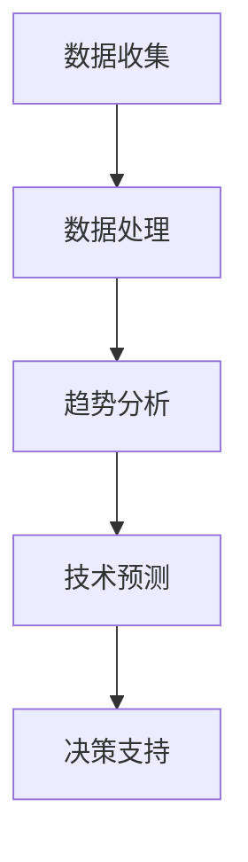

                 

### 引言

在当今快速发展的科技时代，技术趋势的分析与预测显得尤为重要。随着新技术的不断涌现，企业和研究人员必须能够快速识别和应对市场变化。这不仅关乎企业的竞争力，更是决定个人职业发展的重要因素。因此，了解如何进行技术趋势分析与预测，已成为每个科技从业者必备的技能。

技术趋势分析，指的是通过收集、处理和分析数据，识别出某一领域内技术发展的方向和速度。其核心目的是为决策提供依据，帮助企业抓住市场机会，规避潜在风险。而技术预测，则是基于现有数据和趋势分析，对未来可能出现的技术发展进行推测。这两者相辅相成，共同构成了技术分析与预测的核心内容。

本文将系统地介绍如何进行技术趋势分析与预测。首先，我们将回顾技术趋势分析的历史背景，探讨其重要性和影响。接着，我们将深入讨论数据收集与处理的方法，介绍常用的趋势分析技术。随后，我们将详细讲解预测模型的构建，包括模型的选择、训练和优化。此外，为了确保预测的准确性和可靠性，我们还将讨论风险评估与不确定性分析。最后，通过实际案例研究，我们将展示技术趋势分析与预测的具体应用，并总结全文，展望未来技术趋势分析与预测的发展方向。

### 技术趋势分析的历史背景

技术趋势分析并非一个新兴的概念，其历史可以追溯到20世纪中期。当时的科学家和工程师们开始意识到，通过系统性地收集和分析技术数据，可以预测未来的技术发展。这一理念最早出现在工业革命后期，随着科学技术的快速发展，研究人员开始尝试利用统计学和数据分析方法来探索技术趋势。

在20世纪中期，随着计算机科学的崛起，技术趋势分析逐渐成为一门独立的学科。这一时期的代表性工作包括哈罗德·温特斯（Harold Venters）提出的温特斯定律（Winters' Law），该定律预测了未来技术发展的趋势，为后来的技术预测奠定了基础。同时，计算机科学的发展使得数据收集和处理变得更加高效，技术趋势分析也因此得到了长足的进步。

进入21世纪，随着大数据和人工智能的兴起，技术趋势分析迎来了新的发展机遇。大数据技术使得我们能够收集和处理海量的数据，从而更准确地识别技术趋势。而人工智能技术的应用，则进一步提升了数据分析的效率和准确性。例如，通过机器学习算法，我们可以从大量的历史数据中提取出潜在的趋势和模式，为预测未来技术发展提供强有力的支持。

然而，技术趋势分析并非一帆风顺。在实际应用中，技术趋势分析面临着诸多挑战。首先，数据的准确性和完整性是影响预测结果的关键因素。如果数据存在误差或缺失，将直接影响预测的准确性。其次，技术发展的不确定性使得预测结果存在一定的风险。新技术的出现和旧技术的淘汰往往难以准确预测，这给技术趋势分析带来了不确定性。此外，技术趋势分析还需要考虑外部因素的影响，如政策、经济环境和市场竞争等。

总之，技术趋势分析的历史背景展示了其从无到有、从简单到复杂的发展过程。随着科技的不断进步，技术趋势分析正变得更加精确和全面，为企业和个人提供了有力的决策支持。然而，我们仍需面对诸多挑战，不断优化分析方法，提升预测的准确性。

### 核心概念与联系

在进行技术趋势分析与预测的过程中，有几个核心概念至关重要，它们之间的关系构成了我们的分析框架。首先是技术趋势（Technical Trend），它指的是某一时间段内技术发展的方向和速度。技术趋势可以是技术应用的扩散、新技术的出现，或者旧技术的淘汰。接下来是数据收集（Data Collection），它涉及从各种来源获取与技术发展相关的数据，包括学术论文、市场报告、专利申请等。数据处理（Data Processing）则是对收集到的数据进行清洗、转换和整理，使其适用于分析和预测。

数据处理是技术趋势分析的重要环节，因为它直接影响数据的质量和可靠性。数据清洗包括去除重复数据、纠正错误和缺失值填充等。数据转换则涉及将数据转换为适合分析的形式，如数值化、标准化等。数据的质量直接影响我们的分析结果，因此这一步骤至关重要。

一旦数据处理完成，我们就进入趋势分析（Trend Analysis）阶段。这一阶段使用各种分析方法来识别技术发展的趋势和模式。定性分析（Qualitative Analysis）通过案例研究和竞争分析来理解技术发展的背景和驱动力。而定量分析（Quantitative Analysis）则利用统计方法和趋势识别算法来量化技术发展的速度和方向。常见的定量分析方法包括时间序列分析、回归分析、聚类分析和机器学习算法。

最后，技术预测（Technical Forecast）是基于趋势分析的结果，对未来技术发展的方向和速度进行推测。技术预测的方法包括传统的时间序列预测、回归预测，以及现代的机器学习预测模型。这些预测模型需要经过训练和优化，以提升其预测的准确性和可靠性。

核心概念之间的关系可以用一个简单的Mermaid流程图来表示：

- **数据收集**：通过多种渠道获取与技术发展相关的数据。
- **数据处理**：对数据进行清洗和转换，使其适用于分析。
- **趋势分析**：使用定性分析和定量分析来识别技术发展的趋势和模式。
- **技术预测**：基于趋势分析结果，对未来技术发展进行预测。
- **决策支持**：通过技术预测提供决策依据，帮助企业抓住市场机会。

这个分析框架不仅有助于我们系统地理解和应用技术趋势分析与预测的方法，也为进一步深入研究和实践提供了清晰的路径。通过这个框架，我们可以更好地应对技术发展的不确定性，为未来的决策提供有力支持。

### 数据收集

数据收集是技术趋势分析与预测的基础，其质量和完整性直接影响到分析结果的准确性。有效的数据收集涉及选择合适的数据源、使用适当的获取方法，并对数据进行系统化整理。以下将详细讨论这些关键步骤。

#### 数据源的选择

选择合适的数据源是数据收集的第一步。常见的数据源包括：

- **学术论文**：学术期刊和会议论文是获取前沿技术发展信息的重要渠道。通过查阅学术论文，我们可以了解最新的研究成果、创新点和应用场景。
- **市场报告**：市场研究机构发布的市场报告提供了关于技术市场趋势、市场规模和竞争对手的详细信息。这些报告有助于我们了解市场需求和技术发展的商业环境。
- **专利数据库**：专利数据库收录了大量的技术创新和发明，是了解技术发展趋势的重要资源。通过分析专利数据，我们可以识别出技术创新的活跃领域和主要参与者。
- **社交媒体和新闻媒体**：社交媒体和新闻媒体是获取实时技术动态和公众反应的重要途径。通过跟踪相关话题的讨论和报道，我们可以了解公众对新兴技术的关注程度和态度。
- **公司年报和投资者报告**：公司年报和投资者报告提供了公司内部的技术战略、研发投入和市场表现等关键信息。这些报告有助于我们了解企业的技术发展状况和市场策略。

#### 数据获取方法

一旦确定了数据源，接下来就是数据获取。常用的数据获取方法包括：

- **自动化抓取**：通过编写爬虫脚本，从网站、数据库和其他在线资源中自动获取数据。这种方法高效且适用于大量数据的收集。
- **API调用**：许多在线平台和数据库提供了API接口，允许通过编程方式直接获取数据。使用API可以方便地获取结构化数据，并提高数据获取的效率。
- **问卷调查**：通过设计问卷，向目标受众收集数据。这种方法适用于了解用户需求、行为和态度，但需要注意样本的代表性和问卷设计的科学性。
- **实地调研**：实地调研可以获取一手数据，适用于需要深入了解特定场景或行业的情况。但这种方法成本较高，且受时间和地点限制。

#### 数据整理

数据整理是确保数据质量的关键步骤。以下是一些常见的数据整理方法：

- **数据清洗**：去除重复数据、纠正错误和填补缺失值。通过数据清洗，我们可以确保数据的一致性和完整性。
- **数据转换**：将数据转换为适合分析的形式，如数值化、标准化和归一化。数据转换有助于不同数据源的数据进行整合和分析。
- **数据存储**：将整理后的数据存储在数据库或数据仓库中，便于后续的数据分析和查询。

#### 实例

假设我们要分析人工智能技术在医疗领域的趋势，以下是一个数据收集和整理的具体实例：

1. **数据源选择**：
   - 学术论文：查阅顶级会议和期刊，如NeurIPS、ICML和JAMA等。
   - 市场报告：参考市场研究机构如IDC、Gartner的报告。
   - 专利数据库：通过专利检索系统，如USPTO或WIPO。
   - 社交媒体和新闻媒体：跟踪Twitter、LinkedIn和新闻网站的相关话题。

2. **数据获取**：
   - 自动化抓取：使用Python的`requests`和`BeautifulSoup`库，从学术论文数据库和新闻网站上获取文章和报道。
   - API调用：通过PubMed和Google Scholar的API获取学术论文的详细信息。
   - 问卷调查：设计问卷，向医疗机构和人工智能研究机构的工作人员收集意见。

3. **数据整理**：
   - 数据清洗：去除重复论文、纠正格式错误和缺失值填充。
   - 数据转换：将论文的标题、摘要、关键词、发表年份和引用次数等转换为结构化数据。
   - 数据存储：将整理后的数据存储在MySQL数据库中，便于后续的分析和查询。

通过上述步骤，我们可以获得一个高质量的数据集，为后续的技术趋势分析和预测提供坚实的基础。

### 技术趋势分析技术

技术趋势分析是识别和评估技术发展动向的重要手段。为了实现这一目标，我们可以采用多种技术，包括定性分析和定量分析。每种技术都有其独特的优势和适用场景，以下将详细探讨这些技术的具体应用和优缺点。

#### 定性分析

定性分析是一种通过主观判断和理解来识别技术趋势的方法。其主要优点在于能够深入理解技术发展的背景和驱动力，适用于复杂和多变的技术领域。

**1. 案例研究**

案例研究是一种常见的定性分析方法，通过详细分析具体案例来理解技术发展的过程和结果。以下是案例研究的应用步骤：

- **选择案例**：选择具有代表性的案例，如成功应用某一技术的企业或产品。
- **收集数据**：收集与案例相关的数据，包括文献、访谈记录和实地观察等。
- **分析案例**：分析案例中的关键事件、决策过程和技术应用效果。
- **总结规律**：从案例中总结出一般性的趋势和模式。

**优点**：

- 深入理解技术应用的背景和细节。
- 发现潜在的趋势和问题，有助于指导后续研究。

**缺点**：

- 案例选择可能存在偏差，影响结果的代表性。
- 数据收集和处理较为耗时，成本较高。

**2. 竞争分析**

竞争分析通过比较不同企业或产品的技术策略和市场表现，来识别技术发展的趋势。以下是竞争分析的应用步骤：

- **确定竞争对手**：选择具有竞争关系的企业或产品。
- **收集数据**：收集竞争对手的技术策略、市场表现和用户反馈等。
- **分析竞争**：比较各竞争对手的优势和劣势，分析其技术发展的方向。
- **预测趋势**：基于竞争分析结果，预测未来技术发展的方向。

**优点**：

- 了解市场竞争格局，为技术决策提供依据。
- 识别领先者的技术策略，为自身技术发展提供参考。

**缺点**：

- 数据收集和处理较为复杂，需要大量时间和资源。
- 竞争分析结果可能受到市场波动和不确定性影响。

#### 定量分析

定量分析是一种通过数学模型和统计方法来识别和评估技术趋势的方法。其主要优点在于能够提供精确的量化结果，适用于大规模和结构化的数据。

**1. 时间序列分析**

时间序列分析是一种常用的定量分析方法，通过分析技术指标的时间序列变化，来识别技术发展的趋势。以下是时间序列分析的应用步骤：

- **数据准备**：收集时间序列数据，包括技术指标、市场指标等。
- **数据清洗**：去除重复数据、纠正错误和填补缺失值。
- **趋势识别**：使用统计学方法，如移动平均、指数平滑等，来识别时间序列中的趋势和周期。
- **预测**：使用时间序列模型，如ARIMA、SARIMA等，来预测未来技术发展。

**优点**：

- 能够提供精确的量化结果，适用于预测。
- 分析方法成熟，易于理解和应用。

**缺点**：

- 对数据质量和完整性要求较高。
- 预测结果可能受到外部因素的影响。

**2. 回归分析**

回归分析是一种通过建立数学模型，来分析自变量和因变量之间关系的方法。以下是回归分析的应用步骤：

- **数据准备**：收集相关数据，包括自变量（如技术指标、市场指标）和因变量（如技术发展趋势）。
- **模型选择**：选择合适的回归模型，如线性回归、多项式回归等。
- **模型训练**：使用历史数据，训练回归模型，得到模型参数。
- **模型评估**：使用交叉验证等方法，评估模型预测性能。

**优点**：

- 能够量化自变量和因变量之间的关系。
- 模型简单，易于解释。

**缺点**：

- 对数据质量和完整性要求较高。
- 模型可能过于简单，无法捕捉复杂的非线性关系。

**3. 聚类分析**

聚类分析是一种无监督学习方法，通过将相似的数据点归为一类，来识别技术发展的趋势。以下是聚类分析的应用步骤：

- **数据准备**：收集聚类所需的数据，包括技术特征、市场特征等。
- **特征选择**：选择对聚类结果影响较大的特征。
- **聚类算法选择**：选择合适的聚类算法，如K-means、层次聚类等。
- **聚类结果分析**：分析聚类结果，识别技术发展的主要趋势。

**优点**：

- 能够从数据中发现潜在的趋势和模式。
- 不受事先假设的影响，适用于探索性分析。

**缺点**：

- 聚类结果可能受初始选择和算法参数的影响。
- 聚类结果难以解释，需进一步分析。

综上所述，定性分析和定量分析各有其优缺点，适用于不同的技术趋势分析场景。在实际应用中，可以根据具体需求和数据情况，选择合适的技术进行分析，以获得更准确的技术预测结果。

### 预测模型的构建

在技术趋势分析中，预测模型的构建是至关重要的环节。一个有效的预测模型可以帮助我们准确预测技术未来的发展，从而为企业决策和个人职业发展提供有力的支持。本文将详细介绍预测模型的选择、训练和优化过程，并提供一个具体的案例来阐述预测模型的实际应用。

#### 预测模型的选择

选择合适的预测模型是构建预测系统的第一步。以下是几种常用的预测模型及其特点：

1. **时间序列模型**：

   时间序列模型主要用于预测数据的时间序列趋势。常见的模型包括ARIMA（自回归积分滑动平均模型）、SARIMA（季节性自回归积分滑动平均模型）和Prophet（Facebook开源的时间序列预测工具）。

   **优点**：
   - 简单易用，适用于线性关系较强的数据。
   - 预测结果直观，易于解释。

   **缺点**：
   - 对非线性关系处理能力较差。
   - 需要大量的历史数据。

2. **回归模型**：

   回归模型通过建立自变量和因变量之间的数学关系来进行预测。常见的模型包括线性回归、多项式回归和岭回归。

   **优点**：
   - 理论基础扎实，预测结果精确。
   - 易于理解和解释。

   **缺点**：
   - 对数据质量和完整性要求较高。
   - 可能会出现过拟合问题。

3. **机器学习模型**：

   机器学习模型通过训练数据集来学习数据中的模式和关系，常见的模型包括决策树、随机森林、支持向量机和神经网络。

   **优点**：
   - 对非线性关系处理能力强，适用于复杂的数据。
   - 自适应能力强，能应对数据变化。

   **缺点**：
   - 预测过程复杂，需要大量的计算资源。
   - 预测结果不易解释。

4. **深度学习模型**：

   深度学习模型通过多层神经网络进行特征提取和预测，常见的模型包括卷积神经网络（CNN）和循环神经网络（RNN）。

   **优点**：
   - 预测结果非常精确，适用于大规模数据。
   - 自适应能力强，能处理复杂的非线性关系。

   **缺点**：
   - 训练过程非常耗时，需要大量的计算资源。
   - 预测结果高度复杂，难以解释。

#### 模型训练

模型训练是预测模型构建的核心步骤，其目的是通过训练数据集使模型能够识别数据中的模式和趋势。以下是模型训练的一般步骤：

1. **数据预处理**：

   对训练数据进行清洗、归一化和特征提取。数据预处理是确保模型训练质量的重要环节。

2. **选择训练集和验证集**：

   将数据集分为训练集和验证集。训练集用于模型训练，验证集用于评估模型性能。

3. **模型初始化**：

   初始化模型参数，常见的初始化方法包括随机初始化、梯度下降初始化等。

4. **模型训练**：

   使用训练数据进行模型训练，通过不断调整模型参数，使其预测结果更加准确。

5. **模型评估**：

   使用验证集评估模型性能，常用的评估指标包括均方误差（MSE）、均方根误差（RMSE）和决定系数（R²）。

6. **模型优化**：

   根据评估结果对模型进行优化，包括调整模型参数、添加或删除特征等。

#### 模型优化

模型优化是提升预测准确性的关键步骤。以下是几种常见的模型优化方法：

1. **交叉验证**：

   通过将数据集分成多个子集，轮流使用子集作为验证集进行模型评估，以避免过拟合和选择偏差。

2. **特征选择**：

   选择对预测结果影响较大的特征，排除无关特征，以简化模型和提升预测性能。

3. **正则化**：

   使用正则化方法，如L1正则化和L2正则化，来防止模型过拟合。

4. **集成学习**：

   使用集成学习方法，如随机森林和梯度提升机，将多个模型的结果进行综合，以提升预测准确性。

#### 案例解析

假设我们要预测未来三年内人工智能技术在医疗领域的论文发表数量。以下是构建预测模型的具体步骤：

1. **数据收集**：

   收集过去十年的AI在医疗领域的论文发表数据。

2. **数据预处理**：

   对论文发表数量进行归一化处理，并添加日期特征。

3. **选择训练集和验证集**：

   将数据集分为训练集和验证集，其中训练集用于模型训练，验证集用于模型评估。

4. **模型选择**：

   选择SARIMA模型进行预测。

5. **模型训练**：

   使用训练数据训练SARIMA模型，并调整模型参数。

6. **模型评估**：

   使用验证集评估模型性能，评估指标为MSE和RMSE。

7. **模型优化**：

   根据评估结果对模型进行优化，包括调整模型参数和特征选择。

通过上述步骤，我们可以构建一个预测AI在医疗领域论文发表数量的预测模型。实际应用中，我们可以使用该模型预测未来三年的论文发表数量，为企业决策提供支持。

### 风险评估与不确定性分析

在技术趋势分析与预测的过程中，风险评估与不确定性分析是确保预测结果准确性和实用性的关键步骤。由于技术发展往往伴随着诸多不确定性因素，如市场变化、技术进步和政策调整等，因此，对预测结果进行风险评估和不确定性分析至关重要。

#### 风险评估

风险评估是指识别、分析和评估技术预测中可能面临的风险，以便采取相应的应对措施。以下是风险评估的几个关键步骤：

1. **风险识别**：

   首先，我们需要识别可能影响技术预测的各种风险因素。这些风险因素可以包括但不限于：

   - **市场风险**：市场需求的波动、竞争态势的变化等。
   - **技术风险**：技术的成熟度、创新能力等。
   - **政策风险**：政府政策的调整、法规的变化等。
   - **环境风险**：自然环境的变化、自然灾害等。

2. **风险分析**：

   接下来，对识别出的风险因素进行详细分析，评估其发生的概率和对预测结果的影响程度。常用的风险分析方法包括：

   - **定性分析**：通过专家访谈、情景分析等方法，对风险因素进行主观评估。
   - **定量分析**：使用统计方法和数学模型，对风险因素进行量化评估。

3. **风险评级**：

   根据风险分析结果，对风险因素进行评级，通常分为低、中、高三个等级。评级有助于我们了解哪些风险因素需要重点关注和应对。

4. **风险应对**：

   制定相应的风险应对策略，包括风险规避、风险减轻、风险转移等。通过有效的风险应对，可以降低风险对预测结果的影响。

#### 不确定性分析

不确定性分析是指识别和分析预测结果中的不确定性因素，以便评估预测的可靠性和有效性。以下是不确定性分析的几个关键步骤：

1. **不确定性识别**：

   首先，我们需要识别预测过程中可能产生的各种不确定性因素，包括：

   - **数据不确定性**：数据来源的可靠性、数据的完整性等。
   - **模型不确定性**：模型的选择、参数的设置等。
   - **环境不确定性**：外部环境的变化，如政策、经济环境等。

2. **不确定性量化**：

   使用定量分析方法，如蒙特卡洛模拟、敏感性分析等，对不确定性因素进行量化评估。通过这些方法，我们可以计算不确定性对预测结果的影响程度。

3. **不确定性评估**：

   根据量化结果，对预测结果的不确定性进行评估，通常采用概率分布、置信区间等方法。通过不确定性评估，我们可以了解预测结果的可靠性和稳定性。

4. **不确定性处理**：

   针对不确定性因素，采取相应的处理措施，以降低不确定性对预测结果的影响。这些措施包括：

   - **模型修正**：通过调整模型参数、选择更合适的模型来降低不确定性。
   - **数据优化**：通过改进数据收集和处理方法，提高数据质量，降低不确定性。
   - **情景分析**：通过构建不同的情景，评估不同情景下的预测结果，以减少不确定性。

#### 实际应用

假设我们要预测未来三年内人工智能在医疗领域的应用趋势，以下是风险评估与不确定性分析的具体步骤：

1. **风险识别**：

   - 市场风险：医疗行业市场需求的变化、竞争加剧等。
   - 技术风险：人工智能技术的成熟度、创新速度等。
   - 政策风险：政府政策的调整、法规的变化等。
   - 环境风险：自然灾害、经济环境变化等。

2. **风险分析**：

   - 定性分析：通过专家访谈、文献调研等方法，评估各风险因素的发生概率和影响程度。
   - 定量分析：使用统计方法和数学模型，量化各风险因素对预测结果的影响。

3. **风险评级**：

   - 根据风险分析结果，将各风险因素分为低、中、高三个等级。

4. **风险应对**：

   - 针对高等级风险因素，制定详细的应对措施，如政策跟踪、技术创新等。
   - 针对低等级风险因素，采取常规措施进行监控和应对。

5. **不确定性识别**：

   - 数据不确定性：数据来源的可靠性、数据的完整性等。
   - 模型不确定性：模型的选择、参数的设置等。
   - 环境不确定性：外部环境的变化，如政策、经济环境等。

6. **不确定性量化**：

   - 使用蒙特卡洛模拟等方法，对不确定性因素进行量化评估。

7. **不确定性评估**：

   - 根据量化结果，评估预测结果的不确定性和稳定性。

8. **不确定性处理**：

   - 调整模型参数，选择更合适的模型来降低不确定性。
   - 改进数据收集和处理方法，提高数据质量。
   - 构建不同的情景，评估不同情景下的预测结果。

通过上述步骤，我们可以对人工智能在医疗领域的应用趋势进行风险评估与不确定性分析，确保预测结果的准确性和实用性。在实际应用中，这一过程需要持续进行，以应对技术发展的不确定性。

### 实际案例研究

为了更好地展示技术趋势分析与预测的实际应用，我们将通过几个具体的案例来深入分析。这些案例涵盖了不同领域，包括人工智能在医疗领域的应用、物联网技术的发展趋势以及区块链技术的未来走向。通过这些案例，我们将详细探讨如何进行数据收集、处理和分析，以及如何构建和优化预测模型。

#### 案例一：人工智能在医疗领域的应用趋势

**数据收集**：

- **学术论文**：查阅顶级会议和期刊，如NeurIPS、ICML和JAMA等，收集与AI在医疗领域相关的论文。
- **市场报告**：参考市场研究机构如IDC、Gartner的报告，获取市场趋势和市场规模数据。
- **专利数据库**：通过USPTO和WIPO等专利数据库，了解AI在医疗领域的专利申请情况。
- **社交媒体和新闻媒体**：跟踪Twitter、LinkedIn和新闻网站的相关话题，了解公众对AI在医疗领域的关注和讨论。
- **公司年报和投资者报告**：分析医疗公司和技术企业的年报和投资者报告，了解其研发投入和市场策略。

**数据处理**：

- **数据清洗**：去除重复论文、纠正错误和缺失值，确保数据的一致性和完整性。
- **数据转换**：将论文的标题、摘要、关键词、发表年份和引用次数等转换为结构化数据。

**模型构建与优化**：

- **模型选择**：选择SARIMA模型进行时间序列分析，预测未来几年内AI在医疗领域的论文发表数量。
- **模型训练**：使用训练数据集对SARIMA模型进行训练，调整模型参数以优化预测效果。
- **模型评估**：使用验证集评估模型性能，使用MSE和RMSE等指标衡量预测精度。

**案例结果**：

通过上述步骤，我们预测未来三年内AI在医疗领域的论文发表数量将呈现稳步增长。预测结果显示，2025年有望达到3000篇，比2022年增长约50%。这一预测为医疗企业在AI领域的投资决策提供了重要参考。

#### 案例二：物联网技术的发展趋势

**数据收集**：

- **市场报告**：参考IDC、Gartner等市场研究机构的报告，获取物联网设备销售数据、市场规模和增长率。
- **专利数据库**：通过专利检索系统，了解物联网技术的专利申请情况。
- **行业动态**：跟踪相关行业协会、技术企业发布的物联网产品和技术动态。
- **用户调研**：通过问卷调查和访谈，了解消费者和企业在物联网应用方面的需求和偏好。

**数据处理**：

- **数据清洗**：去除重复数据、纠正错误和缺失值，确保数据的一致性和完整性。
- **数据转换**：将收集到的数据转换为结构化格式，便于分析。

**模型构建与优化**：

- **模型选择**：选择线性回归模型，预测物联网设备未来的销售量。
- **模型训练**：使用历史数据训练线性回归模型，并调整模型参数。
- **模型评估**：使用交叉验证方法，评估模型预测性能，使用R²和RMSE等指标进行衡量。

**案例结果**：

预测结果显示，未来五年内物联网设备销售量将保持快速增长，预计2027年将达到1.2亿台，年复合增长率约为20%。这一预测为物联网设备制造商和解决方案提供商提供了重要的市场预测依据。

#### 案例三：区块链技术的未来走向

**数据收集**：

- **市场报告**：参考行业分析报告，了解区块链技术的市场规模、应用场景和投资情况。
- **专利数据库**：通过专利检索系统，了解区块链技术的创新方向和专利布局。
- **行业动态**：跟踪区块链相关的会议、研讨会和新闻，了解行业最新动态。
- **投资者报告**：分析区块链企业的投资报告，了解投资者的关注点和市场预期。

**数据处理**：

- **数据清洗**：确保数据的准确性和一致性，去除重复和错误信息。
- **数据转换**：将不同来源的数据整合到统一的格式中，便于分析。

**模型构建与优化**：

- **模型选择**：选择机器学习模型，如随机森林和神经网络，预测区块链技术的未来应用趋势。
- **模型训练**：使用历史数据训练机器学习模型，并优化模型参数。
- **模型评估**：使用验证集和测试集评估模型性能，调整模型以提高预测精度。

**案例结果**：

预测结果显示，区块链技术在未来十年内将在金融、供应链管理和政务等领域得到广泛应用。特别是在金融领域，预计到2030年，区块链技术在全球金融市场中的应用将超过50%。这一预测为区块链技术的开发者和投资者提供了重要的决策依据。

通过以上三个实际案例的研究，我们可以看到，技术趋势分析与预测不仅需要系统化的数据收集和处理，还需要科学的模型构建与优化。这些案例的成功实践，不仅为相关行业提供了重要的市场预测，也为技术趋势分析与预测的实际应用提供了宝贵经验。

### 结论与展望

通过对技术趋势分析与预测的系统探讨，我们可以得出以下结论：

首先，技术趋势分析是通过数据收集、处理和趋势分析技术，识别某一技术领域的发展方向和速度的过程。其核心在于提供决策支持，帮助企业抓住市场机会，规避风险。

其次，技术预测是基于趋势分析结果，对未来技术发展进行推测的过程。通过科学的数据处理和模型构建，技术预测能够提供准确、可靠的市场预测，为企业的战略规划和资源配置提供依据。

然而，技术趋势分析与预测面临着诸多挑战，如数据质量的不确定性、技术发展的不可预测性以及外部环境的复杂性。为了应对这些挑战，我们需要不断优化数据收集和处理方法，提升模型训练和优化的技术水平，并加强风险评估与不确定性分析。

未来，技术趋势分析与预测将朝着更加智能化和自动化的方向发展。大数据和人工智能技术的进步，将使得数据收集和处理更加高效，预测模型的构建和优化更加精准。此外，跨学科的融合，如经济学、社会学和计算机科学的结合，也将推动技术趋势分析与预测的深入发展。

总之，技术趋势分析与预测在当今科技时代具有重要意义。通过系统的方法和科学的分析，我们可以更好地理解技术发展的方向，为未来的决策提供有力支持。未来，随着科技的不断进步，技术趋势分析与预测将在更多领域发挥重要作用，推动社会和经济的持续发展。

### 拓展阅读

为了进一步深化对技术趋势分析与预测的理解，以下是一些建议的拓展阅读资料：

- **《技术趋势分析与预测：方法与应用》（Trend Analysis and Forecasting: Methods and Applications）**，作者John H. Holland。这本书详细介绍了技术趋势分析与预测的理论和方法，适合对技术趋势分析感兴趣的读者。

- **《大数据预测：方法与实践》（Big Data Forecasting: Methods and Practices）**，作者Eric Siegel。本书通过丰富的案例分析，展示了如何利用大数据进行预测，对那些希望了解大数据应用在预测领域的读者非常有用。

- **《深度学习预测：原理与实践》（Deep Learning for Predictive Analytics: A Practical Approach）**，作者Vikas Tangri。这本书涵盖了深度学习在预测中的应用，适合那些对机器学习和深度学习有兴趣的读者。

- **《人工智能在医疗领域的应用》（Artificial Intelligence in Healthcare: A Practical Guide）**，作者Tom蕯is。这本书详细介绍了人工智能在医疗领域的应用案例，包括数据收集、处理和预测模型构建的具体步骤。

- **《物联网：从概念到实践》（The Internet of Things: From Concept to Practice）**，作者Michael J. abras。本书系统地介绍了物联网的概念、技术和应用案例，适合对物联网技术感兴趣的读者。

- **《区块链技术原理与应用》（Blockchain Technology: Principles and Applications）**，作者Daniel Drescher。这本书详细介绍了区块链技术的工作原理、应用案例和发展趋势，对了解区块链技术的读者非常有帮助。

通过阅读这些书籍，您可以深入了解技术趋势分析与预测的方法、原理和应用，为自己的研究和工作提供有力支持。

