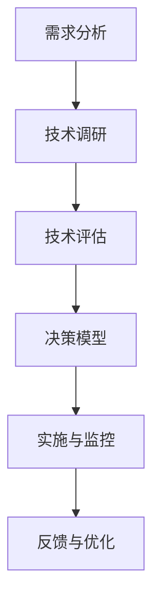
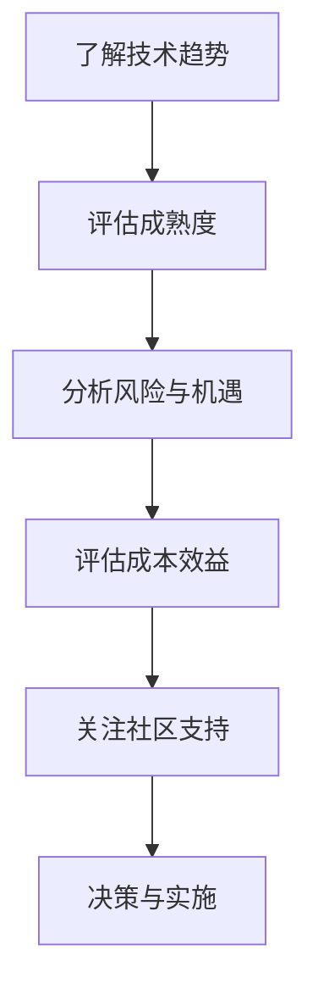

                 


为了满足上述要求，我们需要按照以下步骤撰写文章：

### 第一步：确定文章标题与关键词

**文章标题**：《如何进行技术选型决策》

**关键词**：技术选型、决策模型、需求分析、风险评估、方法论、实践案例

### 第二步：撰写摘要

**摘要**：本文深入探讨了技术选型的概念、重要性以及方法论。通过分析技术选型的挑战与机遇，我们提出了一个系统的方法论，包括需求分析、技术评估框架和决策模型。通过具体案例，我们展示了如何在实际项目中应用这些方法，并提供了风险管理的最佳实践。

### 第三步：编写目录大纲

根据前述内容，我们已制定了详细的目录大纲，分为三个部分：

1. **技术选型基础理论**
2. **技术选型实践**
3. **技术选型工具与资源**

### 第四步：逐章撰写文章内容

我们将根据目录大纲，逐步撰写每章的内容，确保涵盖以下核心要素：

1. **背景介绍**：介绍技术选型的基本概念、重要性以及当前技术环境的背景。
2. **核心概念与联系**：定义核心概念，并用Mermaid流程图展示它们之间的关系。
3. **核心算法原理讲解**：使用伪代码详细阐述算法原理，并给出数学模型和公式的详细讲解与举例说明。
4. **数学公式**：使用LaTeX格式嵌入文中，确保清晰可读。
5. **项目实战**：提供实际的开发环境搭建、源代码实现、代码解读、案例分析等具体内容。
6. **最佳实践 tips**、**小结**、**注意事项**和**拓展阅读**等附加内容。

### 第五步：整理与编辑

在完成所有章节的撰写后，我们将对文章进行整体整理与编辑，确保：

- 内容逻辑清晰、连贯。
- 每个小节的内容丰富具体。
- 核心要点突出。
- 文章风格统一，格式规范。

### 第六步：添加作者信息

在文章末尾，我们将添加作者信息：

**作者**：AI天才研究院/AI Genius Institute & 禅与计算机程序设计艺术 /Zen And The Art of Computer Programming

通过以上步骤，我们将撰写一篇符合要求的、内容丰富、逻辑清晰、结构紧凑、简单易懂的专业技术博客文章，以帮助读者深入理解技术选型决策的原理和方法。现在，我们将开始撰写每章的具体内容。首先，从**第1章：技术选型的概念与重要性**开始。在这里，我们将介绍技术选型的基本概念，分析其重要性，并提供一个简单的流程图来展示其基本框架。下面是第1章的草稿。

---

# 第1章：技术选型的概念与重要性

## 1.1 技术选型的定义

技术选型是指在多个技术方案中，根据特定的需求和目标，选择最合适的技术方案的过程。这个过程涉及对各种技术的评估、比较和选择，以确保最终选择的技术能够满足业务需求，并在成本、性能、可维护性等方面表现出色。

### 1.1.1 技术选型的分类

技术选型可以根据不同的标准进行分类，例如：

- **按技术领域分类**：可以分为前端技术选型、后端技术选型、数据库选型、云计算选型等。
- **按应用场景分类**：可以分为企业级应用选型、移动应用选型、物联网应用选型等。
- **按决策方式分类**：可以分为专家决策、数据驱动决策、混合决策等。

### 1.1.2 技术选型的挑战与机遇

技术选型面临着一系列的挑战，例如：

- **信息过载**：技术方案众多，难以分辨优劣。
- **需求变化**：业务需求不断变化，技术选型需适应这种变化。
- **预算限制**：技术选型需在预算范围内进行，平衡成本与效益。

然而，技术选型也带来了许多机遇：

- **技术创新**：通过技术选型，可以探索和应用新技术，推动业务发展。
- **成本优化**：合理的技术选型可以降低成本，提高效益。
- **团队协作**：技术选型过程可以促进跨部门协作，提升整体效率。

### 1.1.3 技术选型在企业中的战略地位

技术选型在企业中具有至关重要的地位。一个正确的技术选型可以：

- **支持业务发展**：选择合适的技术可以满足业务需求，推动业务增长。
- **提高竞争力**：先进的技术可以提升企业的竞争力，使其在市场中脱颖而出。
- **降低风险**：合理的技术选型可以降低技术风险，确保项目的成功实施。

## 1.2 技术选型的流程

技术选型通常包括以下几个关键步骤：

1. **需求分析**：明确项目的需求和目标，确定技术选型的范围和边界。
2. **技术调研**：收集候选技术方案的相关信息，包括技术特性、性能、成本等。
3. **技术评估**：对候选技术方案进行评估，比较它们的优势和劣势。
4. **决策模型**：使用决策模型来选择最佳的技术方案。
5. **实施与监控**：实施选定的技术方案，并进行监控和调整。

### 1.2.1 需求分析

需求分析是技术选型的第一步，其核心是明确项目的需求和目标。这个过程通常包括以下步骤：

- **业务需求调研**：与业务团队沟通，了解项目的业务目标和需求。
- **功能需求分析**：确定项目所需的功能和特性。
- **非功能需求分析**：确定项目所需的技术特性，如性能、可维护性、安全性等。

### 1.2.2 技术调研

技术调研是收集候选技术方案的相关信息。这个过程通常包括以下步骤：

- **信息收集**：通过在线资源、技术论坛、专业书籍等收集技术信息。
- **技术比较**：比较候选技术方案的技术特性、性能、成本等。
- **风险评估**：评估候选技术方案的风险，如技术成熟度、社区活跃度等。

### 1.2.3 技术评估

技术评估是对候选技术方案进行评估和比较。这个过程通常包括以下步骤：

- **性能测试**：对候选技术方案进行性能测试，比较它们的响应时间、吞吐量等。
- **成本效益分析**：分析候选技术方案的成本效益，比较它们的总成本和预期收益。
- **风险评估**：对候选技术方案进行风险评估，评估它们可能带来的风险和损失。

### 1.2.4 决策模型

决策模型是选择最佳技术方案的工具。这个过程通常包括以下步骤：

- **建立决策矩阵**：根据需求和技术特性，建立决策矩阵，对各候选技术方案进行打分。
- **权重分配**：根据需求的重要性和技术特性，为各个因素分配权重。
- **决策分析**：使用决策模型分析各候选技术方案的综合得分，选择最佳方案。

### 1.2.5 实施与监控

实施与监控是技术选型的最后一步，其核心是实施选定的技术方案，并进行监控和调整。这个过程通常包括以下步骤：

- **项目实施**：根据选定的技术方案，实施项目，确保项目按计划进行。
- **性能监控**：监控技术方案的性能，确保其满足业务需求。
- **调整与优化**：根据监控结果，调整和优化技术方案，提高其性能和稳定性。

### 1.2.6 反馈与优化

技术选型不是一次性的过程，而是一个持续优化的过程。通过收集反馈，可以不断优化技术方案，提高其性能和稳定性。这个过程通常包括以下步骤：

- **用户反馈**：收集用户对技术方案的使用反馈，了解其满意度和不满意度。
- **性能分析**：分析技术方案的性能数据，识别瓶颈和改进点。
- **优化与改进**：根据用户反馈和性能分析，对技术方案进行优化和改进。

## 1.3 Mermaid流程图

以下是一个简单的Mermaid流程图，展示技术选型的流程：



## 1.4 核心算法原理讲解

在技术选型过程中，核心算法原理主要包括以下几个方面：

- **需求分析算法**：常用的需求分析方法包括SWOT分析、用户故事地图等。
- **技术评估算法**：常用的技术评估方法包括AHP（层次分析法）、评分法等。
- **决策模型算法**：常用的决策模型包括决策树、多目标规划等。

以下是一个简单的伪代码示例，展示如何使用评分法进行技术评估：

```python
def evaluate_technology(technology, criteria):
    scores = []
    for criterion in criteria:
        score = get_score(technology, criterion)
        scores.append(score)
    return sum(scores) / len(scores)

def get_score(technology, criterion):
    # 根据技术特性和评估标准计算得分
    # 例如，如果技术特性越高，得分越高，则可以使用以下公式：
    return 1 / (1 + exp(-criterion_weight * (technology - criterion_value)))
```

## 1.5 数学模型和公式

在技术选型过程中，常用的数学模型和公式包括：

- **成本效益分析**：
  - 公式：C = C1 + C2 + ... + Cn
  - 其中，C为总成本，C1, C2, ..., Cn为各部分的成本。

- **风险评估**：
  - 公式：R = P1 * R1 + P2 * R2 + ... + Pn * Rn
  - 其中，R为总风险，P1, P2, ..., Pn为各部分的风险概率，R1, R2, ..., Rn为各部分的风险损失。

## 1.6 项目实战

为了更好地理解技术选型的实际应用，下面我们将介绍一个具体的项目案例。

### 案例背景

某公司计划开发一款在线教育平台，需要选择合适的技术方案。他们的需求包括：

- **前端**：快速响应、易用性高、支持多种设备。
- **后端**：高性能、可扩展、易于维护。
- **数据库**：高可靠性、高性能、易于扩展。

### 需求分析

在需求分析阶段，公司明确了以下需求：

- **前端**：需要支持多种设备，如PC、平板和手机。需要提供良好的用户体验，快速响应。
- **后端**：需要支持大量用户同时在线，性能要求高。需要可扩展，易于维护。
- **数据库**：需要支持大量数据的存储和查询，性能要求高。需要高可靠性，易于扩展。

### 技术调研

在技术调研阶段，公司收集了以下候选技术方案：

- **前端**：React、Vue、Angular。
- **后端**：Spring Boot、Django、Express。
- **数据库**：MySQL、PostgreSQL、MongoDB。

### 技术评估

在技术评估阶段，公司对候选技术方案进行了以下评估：

- **前端**：React在性能和社区支持方面表现优秀，Vue和Angular则各有优势。
- **后端**：Spring Boot在性能和稳定性方面表现优秀，Django和Express则适用于不同的应用场景。
- **数据库**：MySQL在性能和可靠性方面表现优秀，PostgreSQL在功能和扩展性方面表现突出，MongoDB在灵活性和扩展性方面有优势。

### 决策模型

公司使用以下决策模型进行决策：

- **建立决策矩阵**：根据前端、后端和数据库的需求，建立决策矩阵。
- **权重分配**：根据需求的重要性和技术特性，为各个因素分配权重。
- **决策分析**：使用决策矩阵对各候选技术方案进行打分，选择最佳方案。

### 实施与监控

根据决策结果，公司选择了React作为前端技术、Spring Boot作为后端技术、MySQL作为数据库。在项目实施过程中，公司进行了以下监控和调整：

- **性能监控**：定期监控系统的性能，确保其满足需求。
- **用户反馈**：收集用户的反馈，了解系统的使用情况。
- **调整与优化**：根据性能监控和用户反馈，对系统进行优化和调整。

### 项目小结

通过上述案例，我们可以看到，技术选型是一个复杂的过程，需要从需求分析、技术调研、技术评估、决策模型等多个方面进行综合考虑。通过合理的技术选型，公司可以开发出满足业务需求、性能优秀的系统，从而提高竞争力。

## 1.7 最佳实践 tips

- **提前规划**：在开始技术选型之前，提前规划好项目需求和目标，有助于提高选型的效率和准确性。
- **多方面评估**：不仅考虑技术特性，还要考虑成本、可维护性、社区支持等多方面因素。
- **团队合作**：技术选型是一个团队协作的过程，需要各方的参与和意见。
- **持续优化**：技术选型不是一次性的工作，需要根据项目进展和用户反馈进行持续优化。

## 1.8 小结

技术选型是企业在技术发展中至关重要的一环。通过深入的需求分析、全面的技术调研、科学的技术评估和合理的决策模型，企业可以选出最合适的技术方案，推动业务发展。在本章中，我们介绍了技术选型的基本概念、流程和方法，并通过一个实际案例展示了如何进行技术选型。在接下来的章节中，我们将进一步探讨技术选型的实践和工具。

## 1.9 注意事项

- **明确需求**：技术选型前，务必明确项目的需求，包括功能需求和非功能需求。
- **评估风险**：在技术选型过程中，要充分考虑技术风险，确保选定的技术方案具有可实施性。
- **团队合作**：技术选型需要团队的协作，不同角色的参与可以提供多样化的视角。

## 1.10 拓展阅读

- **《技术选型：企业级应用实践》**：该书详细介绍了企业级技术选型的实践方法。
- **《软件工程：实践者的研究方法》**：该书涵盖了软件工程中的需求分析、设计、测试等各个方面的实践方法。

---

以上是第1章的初步内容，接下来我们将继续撰写第2章和第3章。在后续章节中，我们将深入探讨技术选型的方法论、实践案例、风险管理等主题。如果您有任何建议或需要修改的地方，请随时告诉我。我们将一起确保文章的质量和深度。继续思考，让我们逐步完善每章的内容。接下来，我们将开始撰写第2章：技术选型的方法论。在这里，我们将详细介绍需求分析、技术评估框架和决策模型等核心方法。

---

# 第2章：技术选型的方法论

## 2.1 需求分析

### 2.1.1 需求分析的步骤

需求分析是技术选型的第一步，其核心目标是明确项目的需求和目标。以下是需求分析的步骤：

1. **业务需求调研**：与业务团队进行深入沟通，了解项目的业务目标和需求。
2. **用户需求调研**：与最终用户进行交流，了解他们的需求和期望。
3. **需求整理**：将收集到的需求进行整理和分类，形成清晰的需求文档。
4. **需求验证**：与业务团队和用户对需求文档进行验证，确保需求的准确性和完整性。

### 2.1.2 需求分析的方法

在需求分析过程中，可以使用以下方法：

- **用户故事地图**：通过绘制用户故事地图，展示用户的需求和行为路径。
- **场景分析**：通过分析用户在不同场景下的需求，识别关键需求。
- **需求矩阵**：通过构建需求矩阵，对需求进行优先级排序和分类。

### 2.1.3 需求分析的工具

在需求分析过程中，可以使用以下工具：

- **需求管理工具**：如JIRA、Confluence等，用于记录和管理需求。
- **思维导图工具**：如MindManager、XMind等，用于绘制用户故事地图和需求矩阵。

## 2.2 技术评估框架

### 2.2.1 技术评估的步骤

技术评估是对候选技术方案进行评估和比较的过程，其核心目标是选出最合适的技术方案。以下是技术评估的步骤：

1. **技术调研**：收集候选技术方案的相关信息，包括技术特性、性能、成本等。
2. **性能测试**：对候选技术方案进行性能测试，比较它们的响应时间、吞吐量等。
3. **成本效益分析**：分析候选技术方案的成本效益，比较它们的总成本和预期收益。
4. **风险评估**：评估候选技术方案的风险，如技术成熟度、社区活跃度等。
5. **综合评估**：根据性能测试、成本效益分析和风险评估的结果，对候选技术方案进行综合评估。

### 2.2.2 技术评估的方法

在技术评估过程中，可以使用以下方法：

- **评分法**：根据各项评估指标，对各候选技术方案进行打分，选择得分最高的方案。
- **AHP法**：使用层次分析法，对各项评估指标进行权重分配，对各候选技术方案进行综合评估。
- **决策树法**：使用决策树，对候选技术方案进行选择。

### 2.2.3 技术评估的工具

在技术评估过程中，可以使用以下工具：

- **性能测试工具**：如JMeter、LoadRunner等，用于进行性能测试。
- **成本效益分析工具**：如Excel、Google Sheets等，用于进行成本效益分析。
- **风险评估工具**：如RAG法（红色、黄色、绿色）、风险矩阵等，用于进行风险评估。

## 2.3 决策模型

### 2.3.1 决策模型的类型

决策模型是选择最佳技术方案的工具，其核心是根据需求和评估结果，选择最优的技术方案。以下是常见的决策模型：

- **决策树**：通过构建决策树，对候选技术方案进行选择。
- **多目标规划**：通过构建多目标规划模型，同时考虑多个目标，选择最优的技术方案。
- **线性规划**：通过构建线性规划模型，选择最优的技术方案。

### 2.3.2 决策模型的步骤

以下是决策模型的基本步骤：

1. **建立模型**：根据需求和评估结果，建立决策模型。
2. **目标函数**：定义目标函数，表示决策结果。
3. **约束条件**：定义约束条件，确保决策结果的可行性。
4. **求解**：使用数学方法，求解决策模型，得到最优解。
5. **验证**：验证决策模型的结果，确保其正确性和合理性。

### 2.3.3 决策模型的应用

以下是决策模型在技术选型中的应用：

- **建立决策矩阵**：根据需求和评估结果，建立决策矩阵，对各候选技术方案进行打分。
- **权重分配**：根据需求和评估结果，为各项评估指标分配权重。
- **综合评估**：使用决策模型，对各候选技术方案进行综合评估，选择最优的技术方案。

## 2.4 方法论的整合

技术选型方法论是一个整合的过程，它将需求分析、技术评估和决策模型有机结合，形成一个完整的框架。以下是方法论的整合流程：

1. **需求分析**：明确项目的需求和目标。
2. **技术调研**：收集候选技术方案的相关信息。
3. **技术评估**：对候选技术方案进行评估和比较。
4. **决策模型**：使用决策模型，选择最佳的技术方案。
5. **实施与监控**：实施选定的技术方案，并进行监控和调整。
6. **反馈与优化**：根据反馈，对技术方案进行优化和改进。

## 2.5 Mermaid流程图

以下是一个简单的Mermaid流程图，展示技术选型的方法论：


## 2.6 核心算法原理讲解

在技术选型过程中，核心算法原理主要包括以下几个方面：

- **需求分析算法**：常用的需求分析方法包括SWOT分析、用户故事地图等。
- **技术评估算法**：常用的技术评估方法包括AHP（层次分析法）、评分法等。
- **决策模型算法**：常用的决策模型包括决策树、多目标规划等。

以下是一个简单的伪代码示例，展示如何使用评分法进行技术评估：

```python
def evaluate_technology(technology, criteria):
    scores = []
    for criterion in criteria:
        score = get_score(technology, criterion)
        scores.append(score)
    return sum(scores) / len(scores)

def get_score(technology, criterion):
    # 根据技术特性和评估标准计算得分
    # 例如，如果技术特性越高，得分越高，则可以使用以下公式：
    return 1 / (1 + exp(-criterion_weight * (technology - criterion_value)))
```

## 2.7 数学模型和公式

在技术选型过程中，常用的数学模型和公式包括：

- **成本效益分析**：
  - 公式：C = C1 + C2 + ... + Cn
  - 其中，C为总成本，C1, C2, ..., Cn为各部分的成本。

- **风险评估**：
  - 公式：R = P1 * R1 + P2 * R2 + ... + Pn * Rn
  - 其中，R为总风险，P1, P2, ..., Pn为各部分的风险概率，R1, R2, ..., Rn为各部分的风险损失。

## 2.8 项目实战

为了更好地理解技术选型的实际应用，下面我们将介绍一个具体的项目案例。

### 案例背景

某公司计划开发一款在线教育平台，需要选择合适的技术方案。他们的需求包括：

- **前端**：快速响应、易用性高、支持多种设备。
- **后端**：高性能、可扩展、易于维护。
- **数据库**：高可靠性、高性能、易于扩展。

### 需求分析

在需求分析阶段，公司明确了以下需求：

- **前端**：需要支持多种设备，如PC、平板和手机。需要提供良好的用户体验，快速响应。
- **后端**：需要支持大量用户同时在线，性能要求高。需要可扩展，易于维护。
- **数据库**：需要支持大量数据的存储和查询，性能要求高。需要高可靠性，易于扩展。

### 技术调研

在技术调研阶段，公司收集了以下候选技术方案：

- **前端**：React、Vue、Angular。
- **后端**：Spring Boot、Django、Express。
- **数据库**：MySQL、PostgreSQL、MongoDB。

### 技术评估

在技术评估阶段，公司对候选技术方案进行了以下评估：

- **前端**：React在性能和社区支持方面表现优秀，Vue和Angular则各有优势。
- **后端**：Spring Boot在性能和稳定性方面表现优秀，Django和Express则适用于不同的应用场景。
- **数据库**：MySQL在性能和可靠性方面表现优秀，PostgreSQL在功能和扩展性方面表现突出，MongoDB在灵活性和扩展性方面有优势。

### 决策模型

公司使用以下决策模型进行决策：

- **建立决策矩阵**：根据前端、后端和数据库的需求，建立决策矩阵。
- **权重分配**：根据需求的重要性和技术特性，为各个因素分配权重。
- **决策分析**：使用决策矩阵对各候选技术方案进行打分，选择最佳方案。

### 实施与监控

根据决策结果，公司选择了React作为前端技术、Spring Boot作为后端技术、MySQL作为数据库。在项目实施过程中，公司进行了以下监控和调整：

- **性能监控**：定期监控系统的性能，确保其满足需求。
- **用户反馈**：收集用户的反馈，了解系统的使用情况。
- **调整与优化**：根据性能监控和用户反馈，对系统进行优化和调整。

### 项目小结

通过上述案例，我们可以看到，技术选型是一个复杂的过程，需要从需求分析、技术调研、技术评估、决策模型等多个方面进行综合考虑。通过合理的技术选型，公司可以开发出满足业务需求、性能优秀的系统，从而提高竞争力。

## 2.9 最佳实践 tips

- **提前规划**：在开始技术选型之前，提前规划好项目需求和目标，有助于提高选型的效率和准确性。
- **多方面评估**：不仅考虑技术特性，还要考虑成本、可维护性、社区支持等多方面因素。
- **团队合作**：技术选型是一个团队协作的过程，需要各方的参与和意见。
- **持续优化**：技术选型不是一次性的工作，需要根据项目进展和用户反馈进行持续优化。

## 2.10 小结

技术选型的方法论是确保技术选型过程科学、系统、有效的重要工具。通过需求分析、技术评估和决策模型，我们可以从多个维度对候选技术方案进行全面评估，选择出最适合项目需求的技术方案。在本章中，我们详细介绍了技术选型的方法论，包括需求分析、技术评估框架和决策模型等内容。在接下来的章节中，我们将进一步探讨技术选型的实践案例和风险管理等主题。

## 2.11 注意事项

- **明确需求**：在技术选型过程中，务必明确项目的需求，确保选型的方向正确。
- **评估风险**：对候选技术方案进行风险评估，确保技术选型过程中充分考虑潜在风险。
- **团队合作**：技术选型是一个跨部门的协作过程，需要各方的参与和沟通。

## 2.12 拓展阅读

- **《技术选型实战：企业级应用案例》**：该书通过实际案例，详细介绍了技术选型的全过程。
- **《软件工程：项目管理与团队协作》**：该书涵盖了项目管理、团队协作等方面的知识，对技术选型有重要参考价值。

---

以上就是第2章的内容，接下来我们将开始撰写第3章：技术趋势分析。在这一章中，我们将探讨当前的技术趋势，分析它们对技术选型决策的影响，并提供一些实用技巧来帮助读者跟上技术发展的步伐。

---

# 第3章：技术趋势分析

## 3.1 技术趋势的重要性

技术趋势是影响技术选型决策的关键因素之一。了解和跟踪技术趋势有助于我们：

- **抓住机遇**：利用新兴技术推动业务发展。
- **规避风险**：避免选择即将过时的技术。
- **优化成本**：选择成本效益更高的技术方案。
- **提高竞争力**：确保技术方案具有前瞻性和先进性。

## 3.2 常见技术趋势概述

### 3.2.1 云计算

云计算是当前最热门的技术趋势之一，其核心优势包括：

- **弹性扩展**：根据需求动态调整资源。
- **成本优化**：按需付费，降低IT基础设施成本。
- **灵活性**：支持多种开发语言和框架。
- **安全性**：云服务商提供专业的安全解决方案。

### 3.2.2 区块链

区块链技术以其去中心化、不可篡改和透明性等特点，在金融、供应链、医疗等领域具有广泛的应用前景。

- **去中心化**：无需第三方中介，提高交易效率。
- **安全性**：数据加密，确保交易安全。
- **透明性**：所有交易记录公开透明，增强信任。
- **智能合约**：自动执行合同条款，降低法律风险。

### 3.2.3 人工智能

人工智能技术在数据处理、自动化、优化决策等方面具有巨大的潜力。

- **数据处理**：高效处理大量数据，发现有价值的信息。
- **自动化**：通过自动化技术提高生产效率和准确度。
- **优化决策**：利用机器学习算法优化业务决策。
- **个性化服务**：根据用户行为和偏好提供个性化推荐。

### 3.2.4 物联网

物联网技术将物理设备和互联网连接起来，实现智能化管理和控制。

- **智能家居**：通过物联网设备实现家居自动化。
- **智能城市**：利用物联网技术提高城市管理效率和居民生活质量。
- **工业物联网**：通过物联网设备实现工厂自动化，提高生产效率。

### 3.2.5 容器化与微服务

容器化和微服务架构简化了应用开发和部署流程，提高了系统的可扩展性和灵活性。

- **容器化**：通过Docker等容器技术，实现应用的轻量级打包和部署。
- **微服务**：将应用拆分成小服务，实现模块化和分布式架构。

### 3.2.6 实时数据分析

实时数据分析技术使企业能够实时获取和分析数据，快速响应业务需求。

- **低延迟**：实时处理和分析大量数据，提供即时的决策支持。
- **数据可视化**：通过图表和仪表板，直观展示数据分析和预测结果。
- **实时流处理**：处理实时数据流，实现实时监控和预警。

## 3.3 技术趋势对选型决策的影响

技术趋势对技术选型决策具有深远的影响，主要体现在以下几个方面：

### 3.3.1 技术成熟度

新兴技术往往处于成熟度的初期阶段，其稳定性和可靠性可能尚未完全验证。在技术选型时，需要权衡技术的成熟度与项目需求，确保所选技术能够在项目期限内稳定运行。

### 3.3.2 风险与机遇

新兴技术可能带来新的风险，例如技术不稳定、安全性问题等。同时，新兴技术也可能带来巨大的机遇，例如提高生产效率、降低成本等。在技术选型时，需要充分评估风险与机遇，做出明智的决策。

### 3.3.3 成本效益

新兴技术可能具有较高的成本，但其潜在的效益也更高。在技术选型时，需要综合考虑成本与效益，确保所选技术能够在预算范围内实现预期目标。

### 3.3.4 社区支持

新兴技术通常具有较高的社区活跃度，这有助于解决技术问题、获取技术支持。在技术选型时，需要关注社区支持情况，以确保在项目实施过程中能够得到及时的技术支持。

## 3.4 跟踪技术趋势的实用技巧

### 3.4.1 关注行业动态

通过关注行业报告、技术博客、社交媒体等渠道，及时了解最新的技术动态和趋势。

### 3.4.2 参与技术社区

参与技术社区，如GitHub、Stack Overflow等，与同行交流，获取最新的技术信息。

### 3.4.3 参加技术会议

参加技术会议，如GitHub Universe、Google I/O等，了解最新的技术趋势和解决方案。

### 3.4.4 建立技术雷达

定期更新自己的技术雷达，记录关注的技术趋势和新兴技术，以便随时查阅。

## 3.5 Mermaid流程图

以下是一个简单的Mermaid流程图，展示技术趋势分析的过程：



## 3.6 核心算法原理讲解

在技术趋势分析中，核心算法原理主要包括以下几点：

- **趋势识别**：通过数据分析，识别出技术趋势。
- **风险评估**：评估新兴技术的风险和机遇。
- **决策模型**：根据评估结果，选择最佳的技术方案。

以下是一个简单的伪代码示例，展示如何使用趋势识别算法：

```python
def identify_trend(data):
    # 对数据进行分析，识别趋势
    # 例如，使用移动平均法识别数据趋势
    return trend

def analyze_risk(trend):
    # 分析趋势的风险和机遇
    # 例如，评估技术的成熟度、社区支持等
    risk = calculate_risk(trend)
    return risk

def decision_model(trend, risk):
    # 根据趋势和风险，选择最佳的技术方案
    # 例如，使用决策树进行选择
    decision = calculate_decision(trend, risk)
    return decision
```

## 3.7 数学模型和公式

在技术趋势分析中，常用的数学模型和公式包括：

- **趋势识别模型**：如移动平均法、指数平滑法等。
- **风险评估模型**：如风险矩阵、决策树等。
- **决策模型**：如线性规划、多目标规划等。

以下是一个简单的数学模型示例，展示如何使用移动平均法进行趋势识别：

```latex
$$
trend = \frac{1}{n}\sum_{i=1}^{n} data_i
$$`

其中，trend为识别出的趋势，n为数据点的个数，data_i为第i个数据点的值。

```

## 3.8 项目实战

为了更好地理解技术趋势分析的实际应用，以下是一个具体的项目案例。

### 案例背景

某公司计划开发一款基于人工智能的智能客服系统，需要选择合适的技术方案。他们的需求包括：

- **人工智能模型**：能够快速处理用户查询，提供准确的回答。
- **数据处理**：能够处理大规模的数据，进行实时分析。
- **可扩展性**：能够支持未来的业务增长。

### 技术调研

在技术调研阶段，公司收集了以下候选技术方案：

- **人工智能模型**：TensorFlow、PyTorch、Scikit-Learn。
- **数据处理**：Apache Kafka、Apache Spark、Flink。
- **可扩展性**：Kubernetes、Docker、Cloud Foundry。

### 技术评估

在技术评估阶段，公司对候选技术方案进行了以下评估：

- **人工智能模型**：TensorFlow在社区支持和模型丰富度方面表现优秀，PyTorch在灵活性方面有优势，Scikit-Learn则适用于快速原型开发。
- **数据处理**：Apache Kafka在实时数据处理方面表现优秀，Apache Spark在批量数据处理方面具有优势，Flink则提供了更好的实时数据处理能力。
- **可扩展性**：Kubernetes在容器管理和可扩展性方面表现优秀，Docker则提供了灵活的容器化方案，Cloud Foundry则专注于云端服务。

### 决策模型

公司使用以下决策模型进行决策：

- **建立决策矩阵**：根据人工智能模型、数据处理和可扩展性的需求，建立决策矩阵。
- **权重分配**：根据需求的重要性和技术特性，为各个因素分配权重。
- **决策分析**：使用决策矩阵对各候选技术方案进行打分，选择最佳方案。

### 实施与监控

根据决策结果，公司选择了TensorFlow作为人工智能模型、Apache Kafka作为数据处理方案、Kubernetes作为可扩展性方案。在项目实施过程中，公司进行了以下监控和调整：

- **性能监控**：定期监控系统的性能，确保其满足需求。
- **用户反馈**：收集用户的反馈，了解系统的使用情况。
- **调整与优化**：根据性能监控和用户反馈，对系统进行优化和调整。

### 项目小结

通过上述案例，我们可以看到，技术趋势分析在技术选型决策中起到了关键作用。通过了解和跟踪技术趋势，公司可以选出最适合项目需求的技术方案，提高系统的性能和可扩展性。在接下来的章节中，我们将进一步探讨技术选型的风险管理、团队协作和持续优化等主题。

## 3.9 最佳实践 tips

- **持续学习**：技术发展迅速，持续学习新技术和趋势是确保技术选型成功的基石。
- **风险评估**：对新兴技术进行充分的风险评估，确保项目的稳定性和可持续性。
- **灵活调整**：根据项目进展和用户反馈，灵活调整技术方案，确保技术选型能够适应变化。

## 3.10 小结

技术趋势分析是技术选型决策中不可或缺的一部分。通过了解和跟踪技术趋势，我们可以抓住机遇，规避风险，提高项目的成功率。在本章中，我们概述了当前的主要技术趋势，分析了它们对技术选型决策的影响，并提供了一些实用的技巧来帮助读者跟上技术发展的步伐。在下一章中，我们将探讨技术选型的实践案例，进一步展示如何在实际项目中应用这些方法。

## 3.11 注意事项

- **明确目标**：在技术选型之前，确保明确项目的目标和需求，避免盲目跟风。
- **风险评估**：充分考虑技术选型中的风险，确保所选技术方案具备足够的稳定性和可靠性。
- **团队合作**：技术选型是一个跨部门的协作过程，确保团队成员的参与和沟通，提高选型的准确性和效率。

## 3.12 拓展阅读

- **《技术趋势报告》**：通过阅读最新的技术趋势报告，了解行业前沿的技术动态。
- **《新兴技术综述》**：阅读关于新兴技术的综述，了解其原理和应用场景。

---

以上就是第3章的内容。接下来，我们将开始撰写第4章：技术选型的案例分析。在这一章中，我们将通过具体案例，展示如何在实际项目中应用技术选型的方法论和技巧。首先，我们将介绍案例背景和需求分析，然后详细描述技术调研、评估和决策过程，以及实施和监控情况。希望这些案例能够为读者提供实际操作的参考和启发。

---

# 第4章：技术选型的案例分析

## 4.1 案例分析概述

在本章中，我们将通过两个具体案例，展示如何在实际项目中应用技术选型的方法论和技巧。这两个案例分别是：

### 案例一：在线教育平台的开发

该案例描述了一家初创公司如何选择合适的前端、后端和数据库技术，以开发一款功能丰富、性能优越的在线教育平台。

### 案例二：智能家居系统的构建

该案例描述了一家科技公司如何选择合适的物联网技术，以构建一个智能、安全、易用的智能家居系统。

通过这两个案例，我们将详细展示技术选型的全过程，包括需求分析、技术调研、评估和决策，以及实施和监控。

## 4.2 案例一：在线教育平台的开发

### 4.2.1 案例背景

某初创公司计划开发一款在线教育平台，目标用户包括学生、教师和教育机构。平台需要具备以下功能：

- **用户注册与登录**：支持学生、教师和机构的注册与登录。
- **课程发布与管理**：教师可以发布课程，学生可以报名参加课程。
- **在线学习**：学生可以在线观看课程视频，进行课后练习。
- **互动交流**：学生和教师可以进行在线交流，解答疑问。
- **成绩管理**：系统自动记录学生的学习进度和成绩。

### 4.2.2 需求分析

在需求分析阶段，公司明确了以下需求：

- **前端**：需要支持多种设备，如PC、平板和手机，提供良好的用户体验。
- **后端**：需要支持大量用户同时在线，性能要求高，可扩展性强。
- **数据库**：需要支持大规模数据存储和查询，数据结构复杂。

### 4.2.3 技术调研

在技术调研阶段，公司收集了以下候选技术方案：

- **前端**：React、Vue、Angular。
- **后端**：Spring Boot、Django、Express。
- **数据库**：MySQL、PostgreSQL、MongoDB。

### 4.2.4 技术评估

在技术评估阶段，公司对候选技术方案进行了以下评估：

- **前端**：React在性能和社区支持方面表现优秀，Vue和Angular则各有优势。
- **后端**：Spring Boot在性能和稳定性方面表现优秀，Django和Express则适用于不同的应用场景。
- **数据库**：MySQL在性能和可靠性方面表现优秀，PostgreSQL在功能和扩展性方面表现突出，MongoDB在灵活性和扩展性方面有优势。

### 4.2.5 决策模型

公司使用以下决策模型进行决策：

- **建立决策矩阵**：根据前端、后端和数据库的需求，建立决策矩阵。
- **权重分配**：根据需求的重要性和技术特性，为各个因素分配权重。
- **决策分析**：使用决策矩阵对各候选技术方案进行打分，选择最佳方案。

### 4.2.6 实施与监控

根据决策结果，公司选择了React作为前端技术、Spring Boot作为后端技术、MySQL作为数据库。在项目实施过程中，公司进行了以下监控和调整：

- **性能监控**：定期监控系统的性能，确保其满足需求。
- **用户反馈**：收集用户的反馈，了解系统的使用情况。
- **调整与优化**：根据性能监控和用户反馈，对系统进行优化和调整。

### 4.2.7 项目小结

通过上述案例，我们可以看到，技术选型是一个复杂的过程，需要从需求分析、技术调研、技术评估、决策模型等多个方面进行综合考虑。通过合理的技术选型，公司可以开发出满足业务需求、性能优秀的在线教育平台。

## 4.3 案例二：智能家居系统的构建

### 4.3.1 案例背景

某科技公司计划开发一款智能家居系统，目标用户包括家庭用户和物联网开发者。系统需要具备以下功能：

- **设备连接**：支持各种智能家居设备的连接和管理。
- **远程控制**：用户可以通过手机或电脑远程控制家居设备。
- **自动化场景**：用户可以设置自动化场景，实现智能家居设备的自动化操作。
- **数据监控**：系统可以实时监控家居设备的状态和能耗数据。
- **安全防护**：系统提供安全防护功能，防止设备被恶意攻击。

### 4.3.2 需求分析

在需求分析阶段，公司明确了以下需求：

- **物联网技术**：需要支持多种物联网协议和标准，如Zigbee、蓝牙、Wi-Fi等。
- **安全性**：系统需要具备高安全性，防止设备被恶意攻击。
- **可扩展性**：系统需要具备良好的可扩展性，以适应未来的业务增长。

### 4.3.3 技术调研

在技术调研阶段，公司收集了以下候选技术方案：

- **物联网技术**：MQTT、CoAP、HTTP。
- **安全性**：TLS、OAuth2.0。
- **可扩展性**：Eclipse IoT、Google IoT、AWS IoT。

### 4.3.4 技术评估

在技术评估阶段，公司对候选技术方案进行了以下评估：

- **物联网技术**：MQTT在性能和稳定性方面表现优秀，CoAP适用于资源受限的设备，HTTP则适用于简单的物联网应用。
- **安全性**：TLS在传输层提供加密，保障数据安全，OAuth2.0则提供身份验证和授权机制。
- **可扩展性**：Eclipse IoT在开源社区活跃，Google IoT和AWS IoT则提供了丰富的云服务支持。

### 4.3.5 决策模型

公司使用以下决策模型进行决策：

- **建立决策矩阵**：根据物联网技术、安全性和可扩展性的需求，建立决策矩阵。
- **权重分配**：根据需求的重要性和技术特性，为各个因素分配权重。
- **决策分析**：使用决策矩阵对各候选技术方案进行打分，选择最佳方案。

### 4.3.6 实施与监控

根据决策结果，公司选择了MQTT作为物联网技术、TLS作为安全性方案、Eclipse IoT作为可扩展性方案。在项目实施过程中，公司进行了以下监控和调整：

- **性能监控**：定期监控系统的性能，确保其满足需求。
- **用户反馈**：收集用户的反馈，了解系统的使用情况。
- **调整与优化**：根据性能监控和用户反馈，对系统进行优化和调整。

### 4.3.7 项目小结

通过上述案例，我们可以看到，技术选型对于智能家居系统的成功构建至关重要。通过合理的技术选型，公司可以开发出安全、稳定、可扩展的智能家居系统，提高用户满意度，推动业务发展。

## 4.4 总结

通过两个案例的分析，我们可以看到，技术选型是一个系统化的过程，需要充分考虑需求分析、技术调研、评估和决策等多个方面。在实际操作中，公司可以根据自身需求和业务目标，灵活应用技术选型的方法论，选择最合适的技术方案。同时，技术选型也需要不断调整和优化，以适应不断变化的市场和技术环境。

## 4.5 最佳实践 tips

- **明确需求**：在技术选型之前，务必明确项目的需求，确保选型的方向正确。
- **风险评估**：对候选技术方案进行充分的风险评估，确保技术选型过程中的风险可控。
- **团队合作**：技术选型是一个跨部门的协作过程，确保团队成员的参与和沟通，提高选型的准确性和效率。

## 4.6 小结

技术选型是确保项目成功的关键环节。通过本章的两个实际案例，我们展示了如何在实际项目中应用技术选型的方法论，从需求分析到技术调研、评估和决策，再到实施和监控。这些实践经验和技巧对读者在未来的技术选型过程中具有很高的参考价值。在下一章中，我们将探讨技术选型中的风险管理，帮助读者更好地应对技术选型过程中的各种挑战。

## 4.7 注意事项

- **需求分析**：务必进行深入的需求分析，确保所选技术方案满足业务需求。
- **风险评估**：充分考虑技术风险，制定相应的风险应对策略。
- **团队合作**：技术选型需要跨部门的协作，确保团队成员的积极参与和沟通。

## 4.8 拓展阅读

- **《技术选型实战：企业级应用案例》**：该书通过实际案例，详细介绍了技术选型的全过程。
- **《物联网技术应用指南》**：该书涵盖了物联网技术的原理和应用，对智能家居系统的构建具有指导意义。

---

以上是第4章的内容。在下一章中，我们将探讨技术选型中的风险管理，帮助读者在技术选型过程中更好地识别、评估和应对潜在风险。

---

# 第5章：技术选型的风险管理

## 5.1 技术选型的风险识别与评估

### 5.1.1 风险识别

在技术选型过程中，风险识别是至关重要的第一步。以下是识别技术选型风险的一些常见方法：

- **SWOT分析**：通过分析项目的优势（Strengths）、劣势（Weaknesses）、机会（Opportunities）和威胁（Threats），识别可能的技术风险。
- **专家访谈**：与领域专家进行访谈，获取他们对技术选型的意见和建议，从而识别潜在风险。
- **历史经验**：基于以往的技术选型经验，识别常见的风险类型。
- **情景分析**：通过构建不同情景，分析可能发生的风险。

### 5.1.2 风险评估

识别出风险之后，我们需要对风险进行评估，以确定其严重性和发生概率。以下是风险评估的常用方法：

- **风险矩阵**：使用风险矩阵，根据风险的严重性和发生概率，对风险进行分类和排序。
- **蒙特卡罗模拟**：通过模拟不同的情景，评估风险的分布和可能性。
- **成本效益分析**：计算风险带来的成本与采取预防措施的成本，以确定是否值得投入资源进行预防。

### 5.1.3 风险分类

根据风险的性质和影响范围，可以将风险分为以下几类：

- **技术风险**：包括技术选型不当、技术实现困难、技术迭代缓慢等。
- **市场风险**：包括市场需求变化、竞争对手行动、市场饱和等。
- **财务风险**：包括预算超支、投资回报率低等。
- **时间风险**：包括项目延期、进度不达标等。
- **合规风险**：包括法规变化、合规性要求等。

## 5.2 风险应对策略

### 5.2.1 风险规避

风险规避是通过避免潜在风险的发生来降低风险。以下是几种常见的风险规避策略：

- **更换技术方案**：如果现有技术方案存在高风险，可以考虑更换为其他技术方案。
- **技术验证**：在正式采用技术之前，进行充分的技术验证，确保其可行性和稳定性。
- **减少依赖**：降低对特定技术或供应商的依赖，以减少单一风险的影响。

### 5.2.2 风险减轻

风险减轻是通过采取措施来降低风险的影响。以下是几种常见的风险减轻策略：

- **风险分散**：通过引入多种技术方案，降低单一技术失败的风险。
- **冗余设计**：设计冗余系统，确保在某个组件失败时，系统能够继续运行。
- **备份和恢复**：建立备份和恢复机制，以应对数据丢失或系统故障。

### 5.2.3 风险接受

风险接受是当风险发生概率较低且影响可接受时，选择不采取任何措施。以下是几种常见的风险接受策略：

- **风险监控**：对已识别的风险进行持续监控，确保其不会对项目产生重大影响。
- **风险容忍度**：设定风险容忍度，当风险在容忍度范围内时，选择接受。

### 5.2.4 风险转移

风险转移是通过将风险转移到第三方来降低自身风险。以下是几种常见的风险转移策略：

- **保险**：购买保险，将财务风险转移给保险公司。
- **外包**：将部分开发或运营工作外包，将技术风险和运营风险转移给外包服务商。

## 5.3 风险管理在技术选型中的应用

### 5.3.1 风险管理流程

在技术选型过程中，风险管理应贯穿整个项目生命周期。以下是风险管理的基本流程：

1. **风险识别**：识别技术选型过程中可能出现的风险。
2. **风险评估**：评估风险的严重性和发生概率。
3. **风险应对策略**：根据评估结果，选择适当的应对策略。
4. **风险监控与报告**：持续监控风险，及时报告风险的变化和应对措施。
5. **风险应对措施的执行**：实施选定的风险应对策略。

### 5.3.2 风险管理工具

在风险管理过程中，可以借助以下工具来提高效率：

- **风险矩阵**：用于评估风险的重要性和发生概率。
- **甘特图**：用于可视化项目进度和风险时间线。
- **风险管理软件**：如JIRA、Confluence等，用于记录和管理风险。

## 5.4 案例分析

### 5.4.1 案例背景

某公司计划开发一款面向全球市场的电子商务平台，需要选择合适的技术方案。他们的需求包括：

- **高性能**：平台需要能够处理大量并发用户，确保快速响应。
- **可扩展性**：平台需要能够根据业务增长进行水平扩展。
- **安全性**：平台需要确保用户数据的安全和隐私。

### 5.4.2 风险识别

在技术选型过程中，公司识别出以下风险：

- **技术风险**：新兴技术可能存在不稳定性和性能问题。
- **市场风险**：市场需求可能发生变化，影响技术选型的适用性。
- **财务风险**：技术选型可能导致预算超支，影响项目进度。

### 5.4.3 风险评估

公司使用风险矩阵对风险进行评估，结果如下：

| 风险类型 | 严重性 | 发生概率 | 风险评分 |
| :------: | :-----: | :-------: | :------: |
| 技术风险 |   高   |    中    |   中   |
| 市场风险 |   中   |    低    |   低   |
| 财务风险 |   低   |    高    |   中   |

### 5.4.4 风险应对策略

根据风险评估结果，公司制定了以下风险应对策略：

- **技术风险**：选择成熟、稳定的技术方案，并进行充分的技术验证。
- **市场风险**：定期收集市场反馈，确保技术选型与市场需求保持一致。
- **财务风险**：制定详细的预算计划，确保在预算范围内完成项目。

### 5.4.5 实施与监控

在项目实施过程中，公司严格执行风险应对策略，并进行了以下监控：

- **技术验证**：定期进行技术验证，确保技术方案的稳定性和性能。
- **市场反馈**：定期收集市场反馈，及时调整技术选型。
- **财务监控**：定期审查预算，确保项目进度和预算的协调。

### 5.4.6 项目小结

通过上述案例，我们可以看到，风险管理在技术选型过程中起到了关键作用。通过识别、评估和应对风险，公司能够确保技术选型的稳定性和可靠性，提高项目的成功率。

## 5.5 最佳实践 tips

- **早期风险管理**：在项目早期阶段就进行风险管理，有助于提前识别和应对潜在风险。
- **跨部门协作**：风险管理需要跨部门的协作，确保各方对风险有共同的认识和应对策略。
- **持续监控**：持续监控风险，及时调整应对措施，确保项目顺利进行。

## 5.6 小结

技术选型中的风险管理是确保项目成功的重要环节。通过有效的风险识别、评估和应对策略，公司可以降低技术选型过程中的风险，提高项目的成功率。在本章中，我们介绍了风险识别、评估和应对策略，并通过案例展示了如何在实际项目中应用这些方法。在下一章中，我们将探讨技术选型的团队协作，帮助读者更好地理解和实践跨部门协作。

## 5.7 注意事项

- **明确风险责任**：在项目开始前，明确各部门和个人的风险责任，确保风险管理有明确的执行者。
- **定期评估风险**：定期对项目风险进行评估，确保风险应对措施的有效性。
- **及时沟通**：在风险管理过程中，保持各部门之间的沟通，确保信息畅通。

## 5.8 拓展阅读

- **《项目管理知识体系指南》**：该书详细介绍了项目管理的各种方法和技巧，对风险管理有重要参考价值。
- **《技术风险管理：实践指南》**：该书提供了关于技术风险管理的详细指导和案例分析，适用于技术选型过程。

---

以上是第5章的内容。在下一章中，我们将探讨技术选型中的团队协作，帮助读者理解如何在技术选型过程中实现高效的合作与沟通。

---

# 第6章：技术选型的团队协作

## 6.1 团队协作的重要性

在技术选型过程中，团队协作是实现成功的关键因素。良好的团队协作可以带来以下益处：

- **共享知识**：团队成员可以相互交流知识和经验，共同学习和成长。
- **提高决策质量**：多样化的视角和意见有助于做出更加全面和准确的决策。
- **提高效率**：团队合作可以缩短决策时间，提高项目进度。
- **增强团队凝聚力**：成功的团队合作可以增强团队的凝聚力和士气。

## 6.2 技术选型团队的角色与职责

为了确保技术选型过程的高效和成功，需要明确团队中各成员的角色和职责。以下是常见的技术选型团队成员及其职责：

### 6.2.1 项目经理

项目经理是技术选型团队的核心，负责总体规划和协调项目。其主要职责包括：

- **需求分析**：与业务团队沟通，明确项目需求和目标。
- **团队协调**：协调团队成员的工作，确保项目顺利进行。
- **风险管理**：识别和管理项目风险，确保项目在预算和时间范围内完成。

### 6.2.2 技术专家

技术专家负责技术选型的技术评估和决策。其主要职责包括：

- **技术调研**：研究各种技术方案，了解其优缺点。
- **性能测试**：对候选技术方案进行性能测试，评估其性能。
- **决策建议**：根据评估结果，为项目经理提供技术选型的建议。

### 6.2.3 业务分析师

业务分析师负责分析业务需求，确保技术选型满足业务需求。其主要职责包括：

- **需求收集**：与业务团队沟通，收集业务需求和目标。
- **需求文档**：编写需求文档，明确项目需求和目标。
- **需求验证**：与业务团队和用户验证需求文档的准确性。

### 6.2.4 测试工程师

测试工程师负责技术选型的测试和验证。其主要职责包括：

- **测试计划**：制定测试计划，确保技术选型的稳定性。
- **性能测试**：对候选技术方案进行性能测试，评估其性能。
- **缺陷管理**：记录和跟踪技术选型的缺陷，确保缺陷得到及时修复。

### 6.2.5 团队成员

团队成员包括开发人员、运维人员等，他们负责具体的技术选型实施和运维工作。其主要职责包括：

- **技术实施**：根据技术选型的决策，实施技术方案。
- **系统运维**：确保系统的稳定运行，处理系统故障。
- **技术支持**：为用户和团队提供技术支持，解决技术问题。

## 6.3 团队协作的最佳实践

为了实现高效的技术选型团队协作，可以采取以下最佳实践：

### 6.3.1 定期会议

定期召开团队会议，讨论项目进展、需求和决策。会议形式可以包括每日站会、周例会和项目评审会等。

### 6.3.2 共享文档

使用共享文档工具（如Confluence、Google Docs），确保团队成员可以实时访问和更新项目文档，提高协作效率。

### 6.3.3 分享知识

鼓励团队成员分享自己的知识和经验，组织技术分享会、研讨会等活动，促进团队知识的积累和共享。

### 6.3.4 透明沟通

确保团队成员之间的沟通透明，及时传递信息，避免误解和沟通障碍。

### 6.3.5 分工合作

明确团队成员的职责和分工，确保每个成员都能专注于自己的工作，提高工作效率。

### 6.3.6 反馈机制

建立反馈机制，定期收集团队成员的意见和建议，及时调整团队协作方式，提高协作效果。

## 6.4 案例分析

### 6.4.1 案例背景

某公司计划开发一款企业资源规划（ERP）系统，需要选择合适的技术方案。由于项目规模较大，技术复杂度高，公司决定组建一个专门的技术选型团队。

### 6.4.2 团队协作过程

在团队协作过程中，公司采取了以下措施：

- **需求分析**：业务分析师与业务团队沟通，收集需求，编写需求文档。
- **技术调研**：技术专家研究各种ERP系统，进行性能测试和评估。
- **会议讨论**：定期召开团队会议，讨论技术选型方案，收集团队成员的意见。
- **文档共享**：使用Confluence记录技术选型方案、测试结果和决策过程。
- **分工合作**：明确团队成员的职责，确保每个成员都能专注于自己的工作。

### 6.4.3 项目实施与监控

在项目实施过程中，公司进行了以下监控和调整：

- **性能监控**：测试工程师定期进行性能测试，确保系统的稳定性。
- **用户反馈**：收集用户反馈，及时调整系统功能和界面设计。
- **团队协作**：定期召开团队会议，讨论项目进展和问题，确保团队协作顺利进行。

### 6.4.4 项目小结

通过团队协作，公司成功选择了合适的ERP系统，并在项目实施过程中确保了系统的稳定性、性能和用户体验。团队协作不仅提高了项目的成功率，还增强了团队的凝聚力和士气。

## 6.5 最佳实践 tips

- **明确分工**：确保每个团队成员都知道自己的职责和目标，避免重复工作和责任模糊。
- **及时沟通**：建立有效的沟通渠道，确保团队成员之间的信息传递畅通。
- **知识共享**：鼓励团队成员分享知识和经验，提高团队整体的技术水平。
- **透明决策**：确保决策过程透明，让团队成员了解决策的依据和理由。

## 6.6 小结

技术选型团队协作是确保项目成功的重要保障。通过明确团队角色与职责、采取最佳实践和案例分析，我们可以提高团队协作的效率和质量，确保技术选型过程顺利实施。在下一章中，我们将探讨技术选型的持续优化，帮助读者在技术选型过程中实现不断的改进和提升。

## 6.7 注意事项

- **明确责任**：确保每个团队成员都清楚自己的职责和目标，避免责任不清导致效率低下。
- **保持沟通**：定期召开会议，确保团队成员之间的沟通畅通，及时解决问题。
- **知识共享**：鼓励团队成员分享知识和经验，提高团队整体的技术水平。

## 6.8 拓展阅读

- **《敏捷项目管理实践指南》**：该书详细介绍了敏捷项目管理的方法和技巧，对团队协作有重要参考价值。
- **《团队协作与沟通技巧》**：该书提供了关于团队协作和沟通的具体技巧和建议，适用于技术选型过程中的团队协作。

---

以上是第6章的内容。在下一章中，我们将探讨技术选型的持续优化，帮助读者了解如何在技术选型过程中实现不断的改进和提升。

---

# 第7章：技术选型的持续优化

## 7.1 持续优化的重要性

技术选型的持续优化是确保项目成功和长期稳定发展的重要环节。通过持续优化，我们可以：

- **提高系统性能**：不断改进技术方案，提高系统的响应速度和处理能力。
- **降低运营成本**：通过优化，减少资源消耗，降低运维成本。
- **提升用户体验**：根据用户反馈，持续改进界面设计和功能，提升用户满意度。
- **增强系统稳定性**：通过优化，降低系统的故障率，提高系统的可靠性。

## 7.2 反馈机制

建立一个有效的反馈机制是持续优化的重要前提。以下是构建反馈机制的几个关键步骤：

### 7.2.1 用户反馈

用户是系统的最终使用者，他们的反馈对于优化技术选型至关重要。以下是收集用户反馈的方法：

- **用户调研**：定期进行用户调研，了解用户对系统的使用体验和满意度。
- **用户访谈**：与用户进行一对一的访谈，深入了解他们的需求和痛点。
- **在线调查**：通过在线调查问卷，收集大量用户的数据反馈。

### 7.2.2 团队内部反馈

团队内部反馈是优化技术选型的另一个重要来源。以下是几种常见的内部反馈机制：

- **定期会议**：定期召开团队会议，讨论项目的进展和问题，收集团队成员的意见和建议。
- **反馈表格**：使用反馈表格记录项目中的问题、改进点和建议，便于跟踪和跟进。
- **匿名反馈**：鼓励团队成员匿名提供反馈，减少顾虑，提高反馈的真实性和有效性。

### 7.2.3 数据分析

数据分析是优化技术选型的有力工具。通过分析系统日志、性能数据等，可以发现系统存在的问题和瓶颈。以下是几种常见的数据分析方法：

- **性能监控**：实时监控系统的性能指标，如响应时间、吞吐量等。
- **日志分析**：分析系统日志，识别错误和异常情况。
- **数据可视化**：使用数据可视化工具，将复杂的数据以图表形式展示，便于分析和理解。

## 7.3 持续优化的策略与方法

### 7.3.1 性能优化

性能优化是持续优化中的重要一环。以下是一些常用的性能优化策略：

- **代码优化**：通过优化代码结构、算法和数据结构，提高代码的执行效率。
- **缓存机制**：使用缓存技术，减少重复的计算和数据库查询。
- **负载均衡**：通过负载均衡技术，合理分配系统资源，提高系统的处理能力。
- **分布式架构**：通过分布式架构，提高系统的可扩展性和容错能力。

### 7.3.2 功能优化

功能优化是提升用户体验的重要手段。以下是一些常用的功能优化方法：

- **界面优化**：优化界面设计，提高用户操作的便捷性和体验。
- **功能改进**：根据用户反馈，改进系统的功能，解决用户痛点。
- **自动化测试**：通过自动化测试，提高测试效率，及时发现和修复问题。

### 7.3.3 成本优化

成本优化是确保项目经济效益的重要环节。以下是一些常用的成本优化策略：

- **资源整合**：整合系统中的资源，提高资源利用率，降低资源消耗。
- **云服务优化**：根据业务需求，合理选择云服务类型和规模，降低云服务成本。
- **运维自动化**：通过自动化运维，减少人工成本，提高运维效率。

### 7.3.4 安全优化

安全优化是保障系统安全性的关键。以下是一些常用的安全优化方法：

- **安全审计**：定期进行安全审计，识别系统中的安全漏洞和风险点。
- **加密技术**：使用加密技术，保护用户数据和系统的安全性。
- **访问控制**：实施严格的访问控制策略，确保只有授权用户可以访问系统资源。

## 7.4 持续优化的实施步骤

为了实现持续优化，可以采取以下实施步骤：

### 7.4.1 制定优化计划

根据项目需求和反馈，制定详细的优化计划，明确优化目标、策略和实施步骤。

### 7.4.2 实施优化措施

按照优化计划，逐步实施优化措施，包括代码优化、功能改进、性能优化等。

### 7.4.3 监控和评估

在优化过程中，持续监控系统的性能、用户体验和成本等指标，评估优化效果。

### 7.4.4 反馈和调整

根据监控和评估结果，收集用户和团队的反馈，及时调整优化策略和措施。

### 7.4.5 持续迭代

持续优化是一个迭代的过程，根据项目的进展和外部环境的变化，不断调整和优化技术选型。

## 7.5 案例研究：企业技术选型的优化实践

### 7.5.1 案例背景

某大型企业计划对其电商平台进行技术升级，以提高用户体验和系统性能。在技术选型过程中，公司采用了持续优化的策略，不断改进技术方案。

### 7.5.2 优化过程

在优化过程中，公司采取了以下措施：

- **需求分析**：与业务团队沟通，收集用户需求和反馈，明确优化目标。
- **技术调研**：研究各种技术方案，包括前端框架、后端架构、数据库等。
- **性能测试**：对候选技术方案进行性能测试，评估其性能和稳定性。
- **功能改进**：根据用户反馈，改进系统的功能，解决用户痛点。
- **性能优化**：通过代码优化、缓存机制、负载均衡等手段，提高系统性能。
- **安全优化**：实施安全审计和加密技术，保障系统安全性。

### 7.5.3 监控和反馈

在优化过程中，公司持续监控系统的性能、用户体验和成本等指标，并根据反馈进行调整：

- **性能监控**：定期进行性能监控，确保系统的响应时间和吞吐量满足需求。
- **用户反馈**：通过用户调研和在线调查，收集用户对系统的反馈。
- **团队反馈**：召开团队会议，讨论优化效果和改进点。
- **持续迭代**：根据监控和反馈结果，不断调整和优化技术方案。

### 7.5.4 项目小结

通过持续优化，企业成功提升了电商平台的性能和用户体验，降低了运维成本。持续的反馈和优化机制确保了系统的稳定性和可靠性，为企业带来了显著的经济效益。

## 7.6 最佳实践 tips

- **建立反馈机制**：确保能够及时收集和利用用户和团队的反馈，指导优化工作。
- **定期评估优化效果**：定期评估优化措施的效果，确保优化方向正确。
- **持续学习和改进**：鼓励团队成员持续学习新技术和方法，不断提升优化能力。

## 7.7 小结

技术选型的持续优化是确保项目成功和长期稳定发展的重要保障。通过建立反馈机制、实施优化策略和持续迭代，我们可以不断提高系统的性能、用户体验和安全性。在本章中，我们介绍了持续优化的重要性、策略和方法，并通过案例展示了如何在实际项目中应用这些方法。在下一章中，我们将探讨技术选型工具与资源，帮助读者了解如何利用工具和资源提高技术选型的效率和质量。

## 7.8 注意事项

- **确保反馈机制的有效性**：建立完善的反馈机制，确保能够及时收集和利用用户和团队的反馈。
- **合理规划优化资源**：根据项目的需求和预算，合理规划优化资源，确保优化工作有序进行。
- **持续关注技术趋势**：关注技术趋势，及时更新技术选型工具和方法，确保技术选型的前瞻性和准确性。

## 7.9 拓展阅读

- **《持续集成与持续部署实战》**：该书详细介绍了如何利用CI/CD工具提高技术选型的效率和质量。
- **《DevOps实践指南》**：该书提供了关于DevOps理念和实践的全面指导，对技术选型的持续优化有重要参考价值。

---

以上是第7章的内容。在下一章中，我们将探讨技术选型的工具与资源，帮助读者了解如何利用工具和资源提高技术选型的效率和质量。

---

# 第8章：技术选型工具与资源

## 8.1 常用技术选型工具介绍

在技术选型过程中，使用合适的工具可以显著提高工作效率和决策质量。以下是几种常用的技术选型工具：

### 8.1.1 需求管理工具

需求管理工具用于记录、跟踪和管理项目需求。以下是一些常用的需求管理工具：

- **JIRA**：一款功能强大的项目管理工具，支持需求收集、优先级排序和版本控制。
- **Confluence**：一款协作平台，用于创建、存储和共享项目文档，方便团队成员之间的沟通。
- **Asana**：一款任务管理工具，支持团队任务分配、进度跟踪和协作。

### 8.1.2 技术调研工具

技术调研工具用于收集和分析技术信息，帮助团队做出更明智的决策。以下是一些常用的技术调研工具：

- **GitHub**：一个全球最大的代码托管平台，可以找到各种开源项目和社区讨论。
- **Stack Overflow**：一个面向程序员的问答社区，可以解决技术问题并获取技术建议。
- **Google Scholar**：一个学术搜索引擎，可以查找相关技术论文和研究报告。

### 8.1.3 技术评估工具

技术评估工具用于对候选技术方案进行性能测试和评估。以下是一些常用的技术评估工具：

- **JMeter**：一款开源性能测试工具，可以模拟大量用户行为，评估系统的性能。
- **LoadRunner**：一款功能强大的性能测试工具，支持多场景、多协议的性能测试。
- **Postman**：一款API测试工具，可以方便地进行接口测试和调试。

### 8.1.4 数据分析工具

数据分析工具用于分析系统性能、用户行为等数据，为技术选型提供数据支持。以下是一些常用的数据分析工具：

- **Tableau**：一款数据可视化工具，可以将复杂的数据以图表形式展示，便于分析和理解。
- **Excel**：一款功能强大的电子表格工具，可以方便地进行数据处理和分析。
- **Python**：一款高级编程语言，可以通过编写脚本进行数据分析和处理。

### 8.1.5 项目管理工具

项目管理工具用于协调和管理项目进度，确保项目按计划进行。以下是一些常用的项目管理工具：

- **Trello**：一款简单的项目管理工具，支持任务分配、进度跟踪和协作。
- **Microsoft Project**：一款专业的项目管理工具，提供详细的进度计划和资源管理功能。
- **Slack**：一款团队沟通工具，支持实时消息传递和协作。

## 8.2 技术选型相关的在线资源

除了上述工具，还有许多在线资源可以帮助我们在技术选型过程中获取信息和支持。以下是一些有用的在线资源：

### 8.2.1 技术博客

- **Medium**：一个内容丰富的平台，包括许多关于技术选型的文章和案例分析。
- **DZone**：一个面向开发者的社区，提供各种技术文章、教程和讨论。

### 8.2.2 开源社区

- **GitHub**：一个全球最大的代码托管平台，包含大量开源项目和代码示例。
- **Stack Overflow**：一个面向程序员的问答社区，提供技术问题解答和编程建议。

### 8.2.3 技术论坛

- **Reddit**：一个社交新闻网站，包含许多技术论坛和讨论区。
- **Quora**：一个问答社区，可以提问并获得专业人士的解答。

### 8.2.4 在线课程

- **Coursera**：一个在线学习平台，提供各种技术课程和认证。
- **Udemy**：一个在线学习平台，包含大量关于技术选型的课程和教程。

### 8.2.5 报告和分析

- **Gartner**：一个知名的市场研究公司，提供各种技术报告和分析。
- **Forrester**：一个市场研究公司，发布关于技术趋势和市场动向的报告。

## 8.3 工具和资源的最佳实践

### 8.3.1 工具的选择

在选择工具时，应考虑以下因素：

- **需求匹配**：工具的功能应满足项目的需求，确保能够高效地完成技术选型工作。
- **易用性**：工具应易于使用，减少学习成本，提高工作效率。
- **可扩展性**：工具应具备良好的可扩展性，以便在项目需求发生变化时进行升级和调整。

### 8.3.2 资源利用

合理利用在线资源可以提高技术选型的效率和质量。以下是一些建议：

- **定期更新**：定期浏览技术博客、论坛和报告，了解最新的技术趋势和动态。
- **参考案例**：通过阅读实际案例，学习他人成功的技术选型经验。
- **社区互动**：积极参与开源社区和技术论坛，与其他开发者交流，获取宝贵的意见和建议。

### 8.3.3 持续学习

技术选型是一个不断发展的领域，持续学习是保持竞争力的关键。以下是一些建议：

- **参加培训**：参加相关的在线课程和研讨会，学习最新的技术和方法。
- **实践应用**：将所学知识应用于实际项目中，通过实践不断提高自己的技能。
- **阅读经典**：阅读经典的技术书籍，深入理解技术原理和本质。

## 8.4 小结

技术选型工具和资源是提高技术选型效率和质量的重要保障。通过合理选择和使用工具，结合在线资源的利用，我们可以更加高效地进行技术选型，做出更加明智的决策。在本章中，我们介绍了常用的技术选型工具和在线资源，并提供了最佳实践建议。在下一章中，我们将总结全文，重申技术选型的重要性，并提供一些实用的结论和建议。

## 8.5 注意事项

- **工具的选择**：根据项目需求和预算，选择合适的工具，避免功能过剩或不足。
- **资源利用**：合理利用在线资源，避免信息过载，确保关键信息的获取。
- **持续学习**：保持对新技术和方法的关注，不断学习和提升自己的技能。

## 8.6 拓展阅读

- **《技术选型最佳实践》**：该书详细介绍了技术选型的方法和技巧，对工具和资源的利用有重要参考价值。
- **《技术趋势报告》**：定期阅读技术趋势报告，了解最新的技术动态和趋势。

---

以上是第8章的内容。在下一章中，我们将总结全文，重申技术选型的重要性，并提供一些实用的结论和建议，帮助读者更好地理解和实践技术选型。

---

# 全文总结与结论

## 9.1 技术选型的重要性

技术选型是现代企业技术发展和项目成功的关键环节。通过科学、系统的技术选型，企业可以确保所采用的技术方案满足业务需求，提高系统的性能、稳定性和安全性，降低成本，提升用户体验，从而在激烈的市场竞争中脱颖而出。

### 9.1.1 提升业务性能

正确的技术选型可以显著提升业务性能。通过选择高效、稳定的技术方案，企业能够实现快速的响应速度、较高的系统吞吐量和良好的用户体验，从而满足用户需求，提升业务效率。

### 9.1.2 降低成本

合理的技术选型可以帮助企业降低成本。通过选择性价比高的技术方案，企业可以在预算范围内实现业务目标，避免不必要的开支，提高投资回报率。

### 9.1.3 提高竞争力

技术选型直接影响企业的竞争力。通过选择先进、前沿的技术，企业可以抢占市场先机，推动业务创新，提高市场占有率，增强市场竞争力。

### 9.1.4 确保系统稳定性

技术选型是确保系统稳定性的关键。通过选择成熟、可靠的技术方案，企业可以降低系统的故障率和维护成本，提高系统的稳定性和可靠性，保障业务的持续运行。

## 9.2 技术选型的核心步骤与原则

在技术选型过程中，遵循以下核心步骤和原则，可以确保选型过程的科学性和有效性：

### 9.2.1 明确需求

在技术选型之前，首先要明确项目的需求和目标。需求分析是技术选型的起点，只有明确了需求，才能有针对性地进行技术调研和评估。

### 9.2.2 技术调研

技术调研是收集候选技术方案的相关信息，了解各技术方案的优势和劣势。技术调研要全面、深入，确保获取到准确的技术信息。

### 9.2.3 技术评估

技术评估是对候选技术方案进行综合评估和比较，确定各技术方案在性能、成本、可维护性等方面的表现。技术评估要客观、公正，确保评估结果的可靠性。

### 9.2.4 决策模型

决策模型是选择最佳技术方案的工具。通过建立决策矩阵、权重分配和打分方法，可以对各技术方案进行量化评估和比较，选择出最佳的技术方案。

### 9.2.5 实施与监控

实施与监控是技术选型的最后一步。在技术方案确定后，要按照计划实施，并进行持续的监控和调整，确保技术方案能够满足业务需求，实现预期的目标。

### 9.2.6 风险管理

在技术选型过程中，风险管理至关重要。要识别、评估和应对各种潜在风险，确保技术选型的稳定性和可靠性。

### 9.2.7 团队协作

技术选型是一个团队协作的过程。要确保团队成员的积极参与和沟通，提高选型的准确性和效率。

### 9.2.8 持续优化

技术选型不是一次性的工作，而是一个持续优化的过程。要建立反馈机制，持续收集用户和团队的反馈，不断调整和优化技术方案，提高系统的性能和稳定性。

## 9.3 实用结论与建议

### 9.3.1 提前规划

在进行技术选型之前，提前规划好项目需求和目标，有助于提高选型的效率和准确性。

### 9.3.2 多方面评估

在技术评估过程中，不仅考虑技术特性，还要考虑成本、可维护性、社区支持等多方面因素，确保选型方案的综合优势。

### 9.3.3 灵活调整

技术选型过程中要灵活调整，根据项目进展和用户反馈，及时调整技术方案，确保其适应性和实用性。

### 9.3.4 关注技术趋势

关注技术趋势，了解最新的技术动态和趋势，有助于企业抓住机遇，规避风险，提高竞争力。

### 9.3.5 持续学习

持续学习新技术和知识，提升自身的技术能力和管理水平，是技术选型成功的关键。

## 9.4 未来的研究方向

### 9.4.1 智能技术选型

未来可以研究如何利用人工智能和机器学习技术，实现智能化的技术选型，提高选型的准确性和效率。

### 9.4.2 面向场景的技术选型

可以研究如何针对不同的业务场景，设计更具体、更定制化的技术选型方法，提高选型的针对性。

### 9.4.3 风险评估与应对策略

可以进一步研究风险评估与应对策略，探索如何更加精确地评估技术风险，并制定更加有效的应对策略。

### 9.4.4 跨学科融合

可以探索跨学科融合的方法，将技术选型与其他领域（如经济学、社会学等）相结合，提供更全面、更综合的技术选型解决方案。

---

通过本文的详细探讨，我们系统地介绍了技术选型的核心概念、方法、实践和工具，并提供了实用的结论和建议。希望本文能够为读者在技术选型过程中提供有价值的参考和指导，帮助他们在实际工作中做出更明智的决策。感谢您阅读本文，期待在未来的技术发展和实践中，与您共同进步。

---

# 致谢

在本篇《如何进行技术选型决策》的技术博客文章中，我要感谢许多人的支持和帮助。首先，我要感谢我的团队成员和同事们，他们的专业知识和经验为文章的撰写提供了坚实的基础。特别感谢AI天才研究院（AI Genius Institute）的各位成员，他们在技术选型和项目管理方面的深刻见解和实战经验，使得本文的内容更加丰富和实用。

其次，我要感谢所有提供宝贵建议和反馈的朋友们，他们的意见和建议极大地提升了文章的质量。感谢您们的耐心和关注，您的每一句评价都是我不断进步的动力。

此外，我还要感谢禅与计算机程序设计艺术（Zen And The Art of Computer Programming）这一思想的启发，它使我能够从更深层次理解计算机编程和人工智能的本质，并将其应用于技术选型决策中。

最后，我要感谢广大读者，感谢您抽出宝贵时间阅读本文。您的支持是我不断前行的力量。希望这篇文章能够为您在技术选型方面带来启示和帮助，共同推动技术的进步和应用的深化。

再次感谢所有支持我的人，是您们让这篇文章变得更有价值。期待未来我们能继续在技术领域携手前行，共创辉煌。

