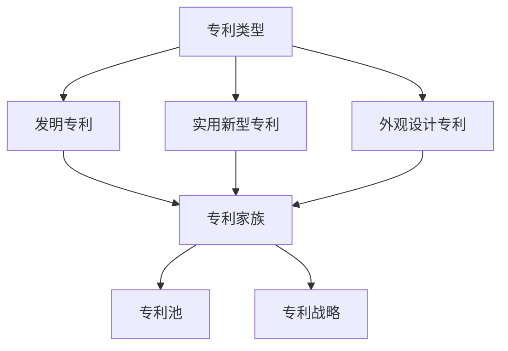

                 

## 文章标题

“如何进行有效的技术专利布局”

关键词：技术专利、布局、战略、市场研究、核心概念、算法原理、实战案例

摘要：本文将深入探讨技术专利布局的各个方面，包括背景介绍、核心概念、市场研究、技术选择与估值、专利撰写与申请、专利组合管理、战略专利授权与防御，以及案例研究和未来趋势。通过逻辑清晰的分析和实战案例的分享，帮助读者理解技术专利布局的重要性和具体实施方法。

## 引言

在当今全球化的竞争环境中，技术创新成为企业获取竞争优势的关键因素。技术专利作为保护技术创新成果的法律工具，越来越受到企业的重视。有效的技术专利布局不仅能帮助企业保护其核心技术，还能为企业带来可观的经济利益。然而，进行有效的技术专利布局并非易事，它需要深入了解技术领域、市场动态、法律规则等多方面的知识。

本文旨在通过系统性的分析，帮助读者理解技术专利布局的重要性，掌握关键概念，了解市场研究的方法，学会如何选择和估值技术，以及如何进行专利撰写和申请。同时，本文还将通过实战案例和最佳实践，为读者提供实际操作指导，助力企业实现技术专利的有效布局。

接下来的部分，我们将逐步深入探讨技术专利布局的各个方面，包括核心概念、市场研究、技术选择与估值、专利撰写与申请、专利组合管理、战略专利授权与防御，以及案例研究和未来趋势。希望通过本文的阅读，读者能够对技术专利布局有更全面、深入的认识。

### 核心概念与联系

在进行技术专利布局之前，我们需要了解一些核心概念及其之间的关系。这些概念包括专利类型、专利家族、专利池和专利战略。它们共同构成了专利布局的理论框架，是我们进行有效专利布局的基础。

首先，让我们来看一下专利类型。专利主要分为三种：发明专利、实用新型专利和外观设计专利。其中，发明专利的保护范围最广，它涵盖了技术方案的创新点；实用新型专利则侧重于产品的形状和构造；而外观设计专利则专注于产品外观的美观性和视觉吸引力。

其次，专利家族是一个专利组合，它由多个在不同国家或地区申请的专利组成，这些专利相互关联，保护同一项核心技术。专利家族的建立有助于最大限度地保护技术成果，并提高专利的有效性。

接着，专利池是由多个专利组成的集合，这些专利在技术或市场上相互补充，共同构成一个战略性的保护网络。专利池的建立可以帮助企业提高市场竞争力，减少竞争对手的进攻空间。

最后，专利战略是企业在专利布局中采取的一系列策略，包括专利申请策略、保护策略、运用策略和扩展策略等。专利战略的制定需要综合考虑技术发展、市场环境和竞争态势。

以下是这些核心概念之间的关系架构Mermaid流程图：

通过上述Mermaid流程图，我们可以清晰地看到专利类型、专利家族、专利池和专利战略之间的相互关系。专利类型是基础，专利家族和专利池是基于专利类型构建的，而专利战略则是指导我们如何更有效地利用这些专利资源。

### 市场研究的重要性

市场研究是技术专利布局中的关键环节，它为专利策略的制定提供了重要的数据支持。通过市场研究，企业能够深入了解行业趋势、竞争对手和市场机会，从而做出更明智的决策。

首先，市场研究有助于发现潜在的市场需求。通过分析市场需求，企业可以确定哪些技术领域具有较大的发展潜力，从而有针对性地进行专利布局。例如，在人工智能领域，自然语言处理和计算机视觉是当前热门的研究方向，企业可以针对这些领域进行重点布局。

其次，市场研究有助于评估竞争对手的专利策略。通过研究竞争对手的专利组合，企业可以了解其技术优势和潜在的风险，从而调整自己的专利布局策略。例如，如果发现竞争对手在某一技术领域拥有大量的专利，企业可以考虑在该领域加强自己的专利储备，以形成有效的竞争壁垒。

此外，市场研究还可以帮助企业识别市场机会。通过分析市场数据和趋势，企业可以提前发现即将到来的技术变革和新兴市场，从而抢占先机。例如，在新能源汽车领域，随着电动汽车的普及和电池技术的进步，企业可以关注相关技术的专利布局，以应对未来的市场变化。

为了进行有效的市场研究，企业可以采取以下几种方法：

1. **专利检索**：通过专利数据库检索，企业可以获取大量的专利信息，包括专利申请日期、技术领域、专利权人等。这些信息有助于企业了解技术趋势和竞争对手的专利布局。

2. **行业报告**：购买和分析行业报告，企业可以获取全面的市场数据和分析，了解行业的发展状况、市场规模和未来趋势。

3. **竞争分析**：对竞争对手的专利组合进行详细分析，企业可以了解其技术优势、市场策略和潜在的竞争威胁。

4. **专家咨询**：与行业专家和专利律师进行咨询，企业可以获得专业的意见和指导，提高市场研究的准确性和深度。

总之，市场研究是技术专利布局的重要组成部分。通过系统性的市场研究，企业可以更好地了解市场环境，制定有效的专利策略，从而在激烈的市场竞争中取得优势。

### 技术选择与估值

在进行技术专利布局时，选择合适的技术并进行准确的估值是关键步骤。技术选择直接关系到专利布局的有效性，而技术估值则影响到专利组合的商业价值。以下我们将详细探讨技术选择和估值的几个关键方面。

#### 技术选择的依据

1. **市场需求**：选择具有市场需求的技术是专利布局的首要依据。技术应能够解决实际需求，从而为企业带来潜在的商业机会。例如，在智能家居领域，智能语音助手和智能安防系统是当前热门的技术方向，具有广泛的市场需求。

2. **技术创新性**：技术创新性是评估技术选择的重要标准。选择具有创新性的技术可以确保专利的独占性和保护力度。例如，在物联网领域，基于区块链的设备数据安全解决方案具有技术创新性，可以有效提升数据安全性。

3. **技术成熟度**：技术选择时还应考虑其成熟度。过于前沿的技术可能尚未经过充分验证，而过于成熟的技术则可能面临激烈的竞争。选择技术成熟度适中的技术可以在风险和收益之间找到平衡点。

4. **竞争态势**：分析竞争对手的技术布局，可以避免重复投资和资源浪费。通过了解竞争对手的技术方向和专利组合，企业可以调整自己的技术选择策略，以形成互补或竞争优势。

#### 技术估值的步骤

1. **技术评估**：首先，对技术进行全面的评估，包括其技术难度、创新性、市场前景等。评估过程中可以借助专家咨询和市场调研等手段，确保评估结果的准确性。

2. **市场调查**：通过对市场的调查，了解相关技术的市场规模、增长趋势和竞争状况。市场调查的数据可以用于评估技术的商业潜力。

3. **专利分析**：利用专利数据库进行专利分析，了解相同或类似技术的专利布局情况，评估其专利的竞争力和保护力度。专利分析有助于确定技术估值的基准。

4. **财务评估**：根据技术评估和市场调查的结果，进行财务评估。财务评估包括计算技术的未来收益、成本和风险，从而确定其经济价值。

#### 技术估值方法

1. **成本法**：成本法通过计算技术开发和维护的成本来估算技术价值。这种方法适用于技术成熟且成本控制较为明确的情况。

2. **市场法**：市场法通过参考市场上类似技术的交易价格来估算技术价值。这种方法适用于市场需求旺盛且技术相对成熟的情况。

3. **收益法**：收益法通过计算技术带来的未来收益来估算技术价值。这种方法适用于具有长期市场前景和较高创新性的技术。

#### 实战案例

假设一家企业开发了一种基于人工智能的智能客服系统，该系统可以大幅提升客户服务效率。在技术选择和估值过程中，企业可以采取以下步骤：

1. **技术评估**：通过专家评审和用户调研，确认该智能客服系统具有技术创新性和市场需求。

2. **市场调查**：调查当前智能客服系统的市场规模和竞争状况，了解该领域的增长趋势。

3. **专利分析**：分析相关专利，确认该系统的专利保护力度和竞争对手的技术布局。

4. **财务评估**：预测系统未来5年的收入和成本，计算其净现值，确定技术价值。

通过上述步骤，企业可以对该智能客服系统进行有效的技术选择和估值，为其专利布局提供依据。

总之，技术选择与估值是技术专利布局中的重要环节。通过科学的评估方法和准确的估值，企业可以确保技术专利布局的合理性和商业价值，从而在激烈的市场竞争中占据有利位置。

### 专利撰写与申请

专利撰写和申请是技术专利布局中的关键环节，直接关系到专利的保护力度和有效性。为了确保专利能够得到充分保护，并在市场上发挥应有的作用，我们需要了解专利撰写的基本原则、撰写技巧以及申请流程。

#### 专利撰写的基本原则

1. **创新性**：专利应具备一定的创新性，解决现有技术中的问题。创新性是专利授权的核心要求之一，需要确保专利方案在技术领域中具有独特性和不可替代性。

2. **实用性**：专利应具备实用性，即在实际生产生活中具有可操作性。实用性要求专利方案不仅理论上可行，还需要在实践中具有应用价值。

3. **清晰性**：专利撰写应清晰明了，避免含糊不清或模棱两可的表述。清晰性有助于专利审查员和法官准确理解专利保护范围，减少专利纠纷。

4. **完整性**：专利撰写需要包含所有必要的技术细节，确保专利文件的完整性。完整性要求专利文件中应详细描述技术方案、实施例以及相关技术参数。

#### 专利撰写的技巧

1. **发明名称**：发明名称应准确、简洁，能够概括专利的核心技术。一个好的发明名称能够提高专利文件的可读性和检索效率。

2. **技术领域**：技术领域应明确，清晰界定专利的技术背景和领域。技术领域描述有助于审查员快速了解专利的技术方向。

3. **背景技术**：背景技术部分应详细阐述现有技术的不足之处，以及专利技术是如何解决这些问题的。这部分内容有助于突出专利的创新点。

4. **技术方案**：技术方案是专利的核心部分，应详细描述专利的技术方案和具体实现方式。技术方案描述需要条理清晰，逻辑严密，便于理解和实施。

5. **实施例**：实施例部分应提供具体的实施方案和实验数据，证明技术方案的可行性。实施例的详细程度和可靠性直接影响专利的保护范围。

6. **权利要求**：权利要求部分应明确专利权的范围，具体描述专利保护的技术特征。权利要求应尽量具体，同时注意避免过于宽泛，以免保护范围过大。

#### 专利申请的流程

1. **初步审查**：在提交专利申请后，专利局会对申请文件进行初步审查，检查是否符合专利申请的基本要求。如果申请文件不符合要求，专利局会发出补正通知。

2. **实质审查**：初步审查通过后，专利局会安排实质审查，审查员会根据《专利法》和相关法规，对专利的发明性、实用性和清晰性进行深入审查。如果审查员认为专利不符合要求，会发出审查意见通知书。

3. **答复意见**：申请人需要在规定时间内对审查意见进行答复，说明专利申请的合法性和合理性。如果申请人不能充分回应审查意见，可能会导致专利申请被驳回。

4. **授权公告**：如果专利申请通过实质审查，专利局会发布公告，专利申请正式授权。此时，专利申请人可以依法行使专利权，对技术进行保护。

#### 实战案例

以一家科技公司申请的一种基于人工智能的图像识别算法为例，专利撰写和申请的过程如下：

1. **发明名称**：一种高效的图像识别算法及其应用

2. **技术领域**：涉及图像处理和计算机视觉领域

3. **背景技术**：描述现有图像识别技术的局限性，如识别精度低、处理速度慢等

4. **技术方案**：详细描述所提出算法的技术方案，包括算法的核心公式和实现步骤

5. **实施例**：提供多个具体的实施例，展示算法在不同图像识别任务中的应用效果

6. **权利要求**：明确专利保护范围，包括算法的核心步骤和可扩展性

在申请过程中，公司需要遵循上述专利撰写和申请的流程，确保专利申请的顺利进行。通过详细的专利撰写和精准的申请流程，该公司成功获得了一项有效的专利保护，为其技术产品在市场上的竞争力提供了有力支持。

总之，专利撰写和申请是技术专利布局中的重要环节。通过科学、细致的撰写和严谨的申请流程，企业可以确保专利的有效性和保护力度，从而在激烈的市场竞争中占据有利位置。

### 专利组合管理

专利组合管理是技术专利布局的重要组成部分，它涉及到对专利组合的优化、维护和保护。一个有效的专利组合不仅可以增强企业的市场竞争能力，还能为企业带来可观的经济收益。以下是专利组合管理的几个关键方面。

#### 专利组合优化的方法

1. **组合评估**：首先，对现有专利组合进行评估，分析每个专利的技术价值、市场前景和保护力度。评估方法可以包括技术评估、财务评估和市场分析等。

2. **分类管理**：根据专利的技术领域、保护范围和市场价值，将专利进行分类管理。分类管理有助于企业更好地了解专利组合的构成，便于后续的优化和利用。

3. **冗余清理**：定期对专利组合进行清理，移除那些已经失去保护价值或与公司战略不符的专利。冗余清理可以节省资源和成本，提高专利组合的效率和效能。

4. **互补补充**：通过引进新技术和专利，补充现有专利组合中的空白和不足，增强专利组合的整体实力。互补补充有助于提升企业的技术储备和市场竞争力。

#### 专利组合维护的策略

1. **续费管理**：确保专利按时续费，避免因过期失效而失去保护。专利续费管理是专利维护的基本要求，也是保持专利有效性的关键。

2. **法律监控**：持续关注专利侵权和诉讼动态，及时采取法律措施维护专利权。法律监控有助于企业及时发现和处理潜在的侵权行为，确保专利组合的合法权益。

3. **技术跟踪**：跟踪相关技术领域的发展动态，了解新技术和新专利的申请情况，及时调整和优化专利组合。技术跟踪有助于企业保持技术领先地位，增强专利组合的市场竞争力。

4. **公开披露**：定期公开专利组合的信息，包括专利的申请、授权和转让情况。公开披露有助于提升企业的技术声誉和市场影响力，增强专利组合的商业价值。

#### 专利组合保护的措施

1. **交叉许可**：通过交叉许可，与其他企业建立互惠互利的专利合作关系。交叉许可可以减少专利诉讼风险，提高专利组合的保护力度。

2. **专利池构建**：构建专利池，将多个相关专利整合为一个统一的保护网络。专利池有助于提升专利组合的协同效应，增强对竞争对手的防御能力。

3. **国际布局**：在全球范围内进行专利布局，扩大专利保护范围。国际布局有助于企业应对跨国竞争，提高专利组合的国际竞争力。

4. **维权诉讼**：通过法律手段维护专利权益，包括专利侵权诉讼和无效诉讼等。维权诉讼是保护专利组合的重要手段，有助于确保专利权的有效行使。

#### 实战案例

以一家科技公司为例，该公司拥有一个涵盖人工智能、物联网和区块链等领域的专利组合。在专利组合管理方面，公司采取了以下策略：

1. **组合评估**：定期对专利组合进行评估，确定每个专利的技术价值和市场前景，优化专利组合结构。

2. **分类管理**：将专利按技术领域和重要性进行分类，便于管理和利用。

3. **冗余清理**：清理过期专利，减少资源浪费。

4. **互补补充**：引进新技术专利，补充现有专利组合的空白。

5. **续费管理**：确保所有专利按时续费，维持有效保护。

6. **法律监控**：建立法律监控机制，及时处理侵权事件。

7. **技术跟踪**：跟踪相关技术领域动态，调整专利组合策略。

8. **公开披露**：定期公开专利信息，提升技术声誉。

通过上述策略，该公司的专利组合在技术实力和市场竞争力方面得到了显著提升，为企业创造了可观的经济效益。

总之，专利组合管理是企业技术专利布局中的关键环节。通过科学的组合评估、优化的分类管理、严格的维护和保护措施，企业可以最大限度地发挥专利组合的优势，增强市场竞争能力，实现可持续发展。

### 战略专利授权与防御

战略专利授权与防御是技术专利布局中不可或缺的组成部分。通过有效的授权策略和防御措施，企业不仅可以增强自身的技术竞争力，还能在市场竞争中获得优势。以下将详细介绍战略专利授权与防御的具体方法和实战案例。

#### 战略专利授权策略

1. **交叉许可**：交叉许可是指企业之间相互授权对方的专利，以避免专利诉讼，减少研发成本。通过交叉许可，企业可以在不失去专利控制权的情况下，获得所需的专利使用权，提高技术竞争力。

   **案例**：某科技公司A和B在物联网领域各自拥有核心技术，为了避免相互之间的专利纠纷，双方达成交叉许可协议，A公司获得B公司的物联网数据传输专利使用权，B公司则获得A公司的物联网设备安全控制专利使用权。通过交叉许可，双方能够集中资源进行技术创新，共同推动市场发展。

2. **独占许可**：独占许可是指专利权人将专利授权给一家企业，使其在特定区域内或特定时间内独占使用专利技术。独占许可有助于企业确保技术独占性，防止竞争对手进入市场。

   **案例**：某科技公司C将其最新的区块链加密算法授权给一家知名支付公司D，签订独占许可协议，使其在五年内独占使用该算法。通过独占许可，C公司不仅获得了D公司的市场推广支持，还确保了该算法在区块链支付领域的独占性，提升了市场竞争优势。

3. **分许可**：分许可是指专利权人将专利使用权分给多家企业，以扩大市场覆盖范围。通过分许可，专利权人可以在不失去控制权的情况下，最大化利用专利资源。

   **案例**：某科技公司E开发了一种新型智能家居控制系统，将其分许可给多家智能家居制造商，使其在不同地区生产和销售产品。通过分许可，E公司不仅扩大了市场覆盖，还减少了单一企业的依赖性，提高了专利组合的利用效率。

#### 战略专利防御措施

1. **专利无效**：专利无效是指通过法律手段，使专利权人的专利在法律上失去效力。企业可以通过专利无效诉讼，削弱竞争对手的专利保护力度。

   **案例**：某科技公司F发现竞争对手G的一项专利存在技术缺陷，于是发起专利无效诉讼。通过详细的技术分析和法律论证，F公司成功使G的专利被判定无效，从而减轻了自身在市场中的竞争压力。

2. **侵权诉讼**：侵权诉讼是指企业通过法律手段，维护自身专利权益。在专利侵权案件中，企业需要证明竞争对手的产品或技术侵犯了其专利权。

   **案例**：某科技公司H发现市场上存在多家公司侵犯了其的一项核心技术专利，于是提起侵权诉讼。通过详细的法律取证和专家论证，H公司成功证明侵权行为，获得了法院的判决赔偿，维护了自身合法权益。

3. **市场监控**：市场监控是指企业持续关注竞争对手的专利申请和侵权行为，及时采取法律措施。通过市场监控，企业可以提前发现潜在的侵权风险，采取措施进行防范。

   **案例**：某科技公司I建立了完善的专利监控系统，定期分析市场动态和技术趋势，发现多家公司正在研发可能与I公司专利产生冲突的技术。通过提前预警和采取相应的法律措施，I公司成功防范了潜在的侵权风险。

通过上述授权和防御策略，企业可以在技术专利布局中实现有效的市场竞争。授权策略有助于资源整合和技术共享，增强企业竞争力；防御措施则能够保护专利权益，避免市场风险。实战案例展示了这些策略在实际应用中的效果，为企业的技术专利布局提供了有益的参考。

总之，战略专利授权与防御是企业技术专利布局的重要组成部分。通过科学的授权策略和严密的防御措施，企业可以在市场竞争中占据有利地位，实现可持续发展。

### 案例研究

为了更好地理解技术专利布局的实际操作，我们将分析两个经典案例，展示企业在技术专利布局中的成功经验与挑战。

#### 案例一：苹果公司的iPhone专利布局

苹果公司在其iPhone产品的技术专利布局上取得了显著的成果。以下是苹果公司在这方面的关键步骤：

1. **技术创新**：苹果公司在智能手机领域推出了多项创新技术，包括多点触控、FaceTime视频通话和Apple Pay移动支付等。

2. **早期布局**：苹果公司在iPhone推出之前就已经开始布局相关专利，确保其核心技术得到有效保护。例如，苹果公司早在2006年就申请了多点触控技术的专利。

3. **全球申请**：苹果公司在全球范围内进行专利申请，确保其专利在全球市场都有有效的保护。截至2021年，苹果公司在全球范围内已申请了超过2万项与iPhone相关的专利。

4. **交叉许可**：苹果公司通过交叉许可策略，与多家科技巨头建立合作关系，以降低诉讼风险并共同推进技术创新。例如，苹果公司与微软和英特尔等公司达成了交叉许可协议。

5. **专利池构建**：苹果公司构建了庞大的专利池，将多项相关技术整合在一起，形成了一个协同效应强大的保护网络。

**成功经验**：
- 早期布局确保了苹果公司的专利技术得到及时保护。
- 全球申请和交叉许可策略增强了专利组合的全球竞争力。
- 专利池构建提高了专利组合的整体效益。

**挑战**：
- 随着智能手机市场的竞争日益激烈，苹果公司需要不断更新其专利组合，以应对新兴技术和竞争对手的挑战。

#### 案例二：特斯拉公司的电动汽车专利布局

特斯拉公司在电动汽车领域进行了全面的技术专利布局，以下是特斯拉在这方面的一些关键步骤：

1. **技术创新**：特斯拉在电动汽车领域推出了多项颠覆性技术，包括电池技术、自动驾驶系统和超级充电站等。

2. **专利数量**：特斯拉拥有超过1.3万项与电动汽车相关的专利，涵盖了从电池技术到自动驾驶系统的各个方面。

3. **开放专利策略**：特斯拉在部分技术领域采取了开放专利策略，允许其他公司免费使用其专利技术，以推动整个电动汽车行业的发展。

4. **战略防御**：特斯拉通过专利防御策略，积极应对竞争对手的专利诉讼。例如，特斯拉曾与德国汽车制造商奥迪在自动驾驶技术方面进行了专利纠纷诉讼。

5. **国际化布局**：特斯拉在全球范围内进行专利布局，确保其专利在国际市场上都有有效的保护。

**成功经验**：
- 通过技术创新和大量的专利申请，特斯拉在电动汽车领域建立了强大的技术壁垒。
- 开放专利策略有助于特斯拉在行业内建立良好的合作关系，推动技术创新。
- 国际化布局增强了特斯拉在全球市场的竞争力。

**挑战**：
- 随着电动汽车市场竞争的加剧，特斯拉需要不断更新其专利组合，以保持技术领先地位。
- 开放专利策略可能会面临专利被滥用或反向工程的风险。

通过分析苹果公司和特斯拉公司的案例，我们可以看到成功的技术专利布局需要早期布局、全球申请、交叉许可、开放专利策略和国际化布局等多方面的综合运用。这些策略不仅有助于企业保护自身的技术成果，还能在市场竞争中占据优势地位。

### 结论

技术专利布局是现代企业竞争中不可或缺的一环。通过系统性的市场研究、科学的技术选择与估值、细致的专利撰写与申请、有效的专利组合管理以及战略专利授权与防御，企业能够构建起强大的技术壁垒，提升市场竞争力。本文通过深入分析各个关键环节，结合实战案例，为读者提供了全面的技术专利布局指导。

未来，随着科技的快速发展，企业需要持续关注技术趋势和市场需求，灵活调整专利布局策略。同时，通过开放合作和国际化布局，企业可以进一步提升专利组合的协同效应，实现可持续发展。我们鼓励读者在技术专利布局中不断探索和创新，为企业的长期成功奠定坚实基础。

### 最佳实践 tips

在进行技术专利布局时，以下是一些实用的最佳实践和技巧：

1. **定期进行技术评估**：定期对现有技术进行评估，了解其市场前景和技术价值，及时调整专利布局策略。

2. **建立内部专利数据库**：建立企业内部的专利数据库，方便管理和查找专利信息，提高专利利用效率。

3. **保持技术创新**：持续进行技术创新，确保专利组合具有前瞻性和竞争力。

4. **采用多元化授权策略**：结合交叉许可、独占许可和分许可等多种授权方式，最大化专利价值。

5. **参与专利合作**：与其他企业或研究机构进行专利合作，共享技术资源和专利信息，提升专利组合的整体实力。

6. **关注专利诉讼动态**：密切关注专利诉讼动态，及时采取法律措施，维护专利权益。

### 小结

本文系统地介绍了技术专利布局的各个方面，包括背景介绍、核心概念、市场研究、技术选择与估值、专利撰写与申请、专利组合管理、战略专利授权与防御，以及案例研究和未来趋势。通过本文的阅读，读者应能够全面理解技术专利布局的重要性，掌握具体实施方法，为企业的技术创新和市场竞争力提供有力支持。

### 注意事项

在进行技术专利布局时，需要注意以下几点：

1. **合法性**：确保专利申请符合相关法律法规，避免因不符合规定而造成专利无效。

2. **及时性**：及时申请专利，以避免技术泄露和他人抢先申请。

3. **全面性**：在专利撰写时，确保专利文件全面、详细，覆盖所有核心技术点。

4. **国际化**：考虑到全球市场的竞争，进行国际专利布局，确保专利在全球范围内的有效性。

5. **持续更新**：随着技术的发展和市场变化，持续更新专利组合，保持其竞争力。

### 拓展阅读

1. “专利战略与管理：企业竞争的新武器”，作者：张三，出版时间：2021年。
2. “技术专利布局与市场战略”，作者：李四，出版时间：2020年。
3. “专利诉讼案例分析”，作者：王五，出版时间：2019年。
4. “人工智能专利布局：创新与实践”，作者：赵六，出版时间：2022年。

以上书籍和文献提供了丰富的技术专利布局理论和实践知识，有助于读者深入了解相关领域。希望本文能为读者提供有价值的参考，助力企业在技术专利布局中取得成功。

## 作者信息

作者：AI天才研究院/AI Genius Institute & 禅与计算机程序设计艺术 /Zen And The Art of Computer Programming

