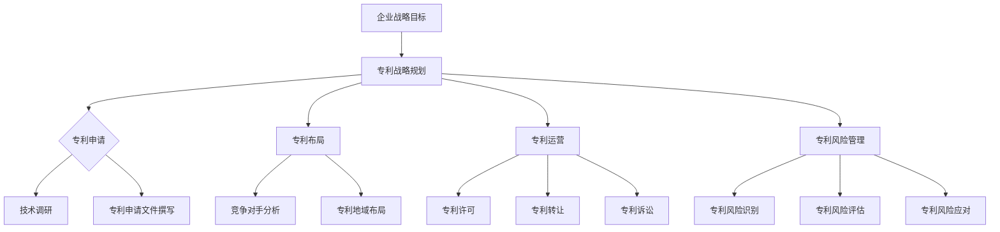
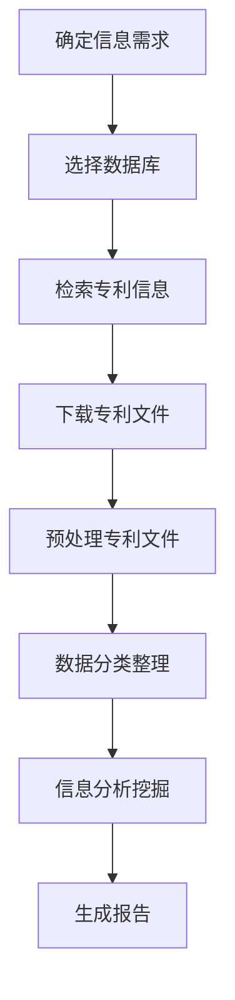
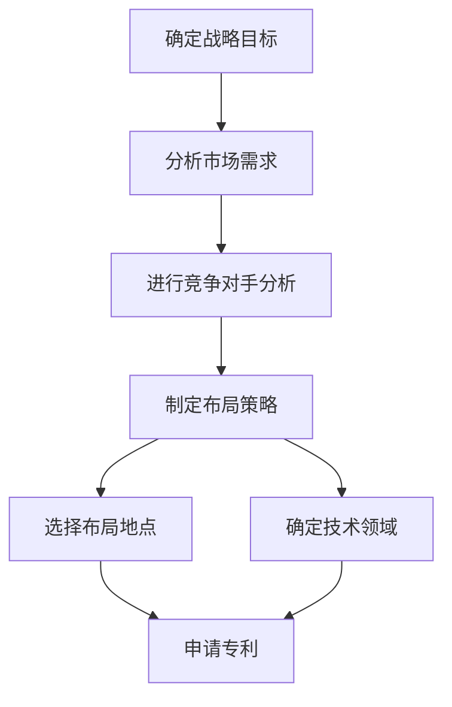
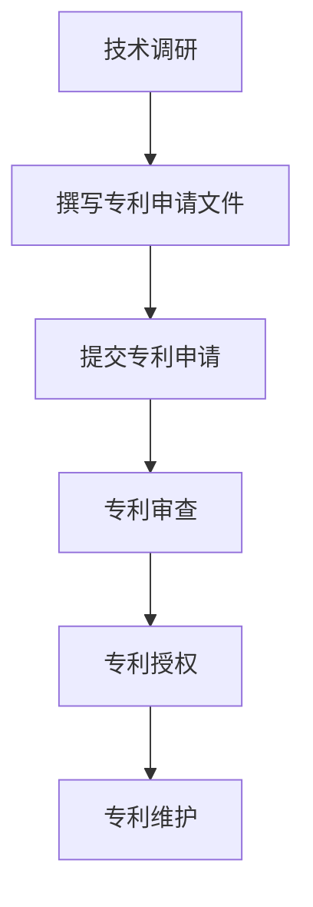
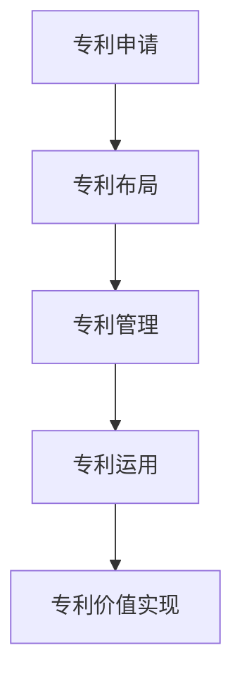
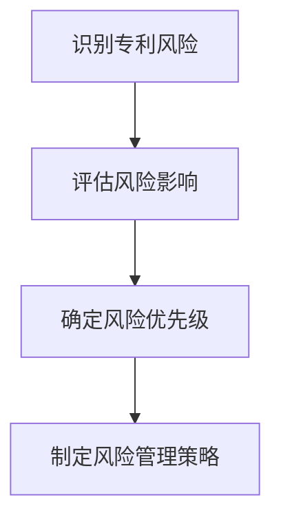
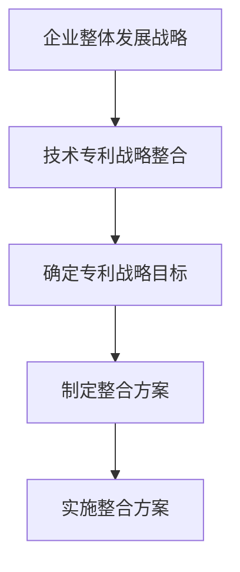

                 

### 文章标题

《如何进行有效的技术专利战略规划》

### 关键词

技术专利、战略规划、专利布局、专利申请、专利运营、专利风险管理

### 摘要

本文旨在探讨如何进行有效的技术专利战略规划。通过深入分析专利战略规划的重要性、核心要素和实施过程，本文提供了一套系统化的策略框架，帮助企业更好地保护创新成果、拓展市场、增加资产价值。文章首先介绍了技术专利战略的定义及其与技术创新的关系，随后详细阐述了专利信息分析、专利布局策略、专利申请策略、专利运营和专利风险管理的方法和步骤。最后，通过实际案例分析和最佳实践提示，帮助读者更好地理解和应用技术专利战略规划的理论和实践。

----------------------------------------------------------------

## 第1章 引言

### 1.1 专利战略规划的重要性

#### 背景介绍

在当今快速变化和高竞争的技术环境中，专利战略规划已成为企业保持竞争优势的关键因素。随着全球化和知识经济的快速发展，技术创新和知识产权保护的重要性日益凸显。专利作为知识产权的重要组成部分，不仅能够保护企业的创新成果，还可以作为一种战略资源，为企业带来巨大的经济和社会效益。

#### 核心概念与联系

- **专利**：是指由国家知识产权局授予的，在一定时间内保护发明创造的权利。
- **战略规划**：是指企业为实现长期发展目标，制定的一系列有针对性的策略和计划。

专利战略规划是将专利作为企业战略资源的一部分，通过系统化的方法进行管理和运用，以达到企业整体战略目标的过程。专利战略规划的核心概念包括专利申请、专利布局、专利运营和专利风险管理等。

#### Mermaid 流程图



#### 核心算法原理讲解

专利战略规划的实现过程可以看作是一个算法，其核心在于如何高效地利用专利资源来支持企业的战略目标。以下是专利战略规划的核心算法原理的伪代码：

```python
def patentStrategyPlanning(target, resources):
    # 初始化
    strategy = {}
    
    # 进行技术调研
    tech_survey = performTechSurvey()
    
    # 进行专利申请
    strategy['application'] = applyPatents(tech_survey)
    
    # 进行专利布局
    strategy['layout'] = layoutPatents(tech_survey)
    
    # 进行专利运营
    strategy['operation'] = operatePatents(strategy['layout'])
    
    # 进行专利风险管理
    strategy['risk_management'] = managePatentRisk(strategy['application'], strategy['layout'])
    
    # 实施策略
    implementStrategy(strategy)
    
    return strategy
```

#### 数学模型和公式 & 详细讲解 & 举例说明

在专利战略规划中，可以使用数学模型来评估专利的价值和风险。以下是一个简化的数学模型，用于评估专利的经济效益：

$$
V = \frac{R}{C} \times \left(1 - e^{-rt}\right)
$$`

其中：
- \(V\) 是专利的价值；
- \(R\) 是专利带来的收入；
- \(C\) 是专利的成本；
- \(r\) 是折现率；
- \(t\) 是时间。

#### 举例说明

假设一家企业研发了一种新型节能技术，该技术预计每年能带来500万元人民币的收入，而申请和维持该专利的成本为100万元。假设折现率为10%，则该专利在第一年的价值为：

$$
V = \frac{500}{100} \times \left(1 - e^{-0.1 \times 1}\right) = 4.54 \text{ 百万元}
$$`

#### 项目实战

在实际操作中，企业需要进行技术调研，确定技术创新点，然后进行专利申请。以下是专利申请的详细步骤：

1. **技术调研**：通过查阅相关文献、市场调查和竞争对手分析，确定技术创新点。
2. **专利申请文件撰写**：根据技术创新点撰写专利申请文件，包括专利说明书、权利要求书等。
3. **专利申请**：将专利申请文件提交至国家知识产权局进行审查。
4. **专利授权**：经过审查，专利申请被批准，获得专利证书。

#### 开发环境搭建

在专利申请过程中，企业可以使用以下工具：

- **专利检索系统**：如中国知识产权局提供的专利检索系统，用于查找相关专利信息。
- **文本编辑器**：如Microsoft Word或LaTeX编辑器，用于撰写专利申请文件。

#### 源代码详细实现和代码解读

以下是一个简单的Python代码，用于专利申请文件的文本处理：

```python
def process_patent_document(document):
    """
    处理专利申请文件
    :param document: 专利申请文件（字符串）
    :return: 处理后的文档（字符串）
    """
    # 提取关键信息
    title = extract_title(document)
    abstract = extract_abstract(document)
    claims = extract_claims(document)
    
    # 处理文档格式
    processed_document = f"""
    {title}
    {abstract}
    {claims}
    """
    
    return processed_document

def extract_title(document):
    """
    提取文档标题
    :param document: 专利申请文件（字符串）
    :return: 标题（字符串）
    """
    # 假设标题位于文档的开头
    start = document.find("Title:")
    end = document.find("\n", start)
    return document[start + len("Title:"):end].strip()

def extract_abstract(document):
    """
    提取文档摘要
    :param document: 专利申请文件（字符串）
    :return: 摘要（字符串）
    """
    # 假设摘要位于标题之后
    start = document.find("Abstract:")
    end = document.find("\n", start)
    return document[start + len("Abstract:"):end].strip()

def extract_claims(document):
    """
    提取文档权利要求书
    :param document: 专利申请文件（字符串）
    :return: 权利要求书（字符串）
    """
    # 假设权利要求书位于摘要之后
    start = document.find("Claims:")
    end = document.find("\n", start)
    return document[start + len("Claims:"):end].strip()
```

#### 代码应用解读与分析

上述代码用于处理专利申请文件的文本，通过定义三个辅助函数，分别提取文档的标题、摘要和权利要求书。这些函数基于简单的字符串操作，实现了对文档的结构化提取。

#### 实际案例分析和详细讲解剖析

以下是一个专利申请的实际案例：

- **案例背景**：一家科技公司研发了一种新型的智能家居系统，希望通过专利保护其核心技术。
- **案例分析**：公司在进行技术调研后，确定了智能语音识别和智能家居控制系统作为专利申请的重点领域。通过专利检索，公司发现市场上已有类似的系统，但它们的语音识别准确率较低，且系统稳定性有待提高。
- **详细讲解**：公司撰写了一份详细的专利申请文件，包括技术背景、技术方案、实施例和权利要求书。在权利要求书中，公司特别强调了其智能语音识别系统的准确率和系统稳定性，以确保专利的授权。

#### 项目小结

通过该案例，我们可以看到，专利战略规划在保护技术创新和推动企业发展方面的重要作用。企业需要通过详细的技术调研和专利申请，确保其核心技术的保护，从而在激烈的市场竞争中占据优势。

#### 最佳实践 tips、小结、注意事项、拓展阅读等内容

**最佳实践 tips**：

1. 进行全面的技术调研，确保专利申请的针对性。
2. 撰写专利申请文件时，要注重权利要求的表述，确保清晰明确。
3. 定期进行专利风险监测，及时调整专利战略。

**小结**：

有效的技术专利战略规划是企业技术创新和市场竞争的重要保障。通过系统化的专利战略规划，企业可以更好地保护其创新成果，提高市场竞争力。

**注意事项**：

1. 专利申请是一个长期的过程，需要耐心和持续的努力。
2. 专利战略规划需要结合企业的实际情况，制定合适的策略。

**拓展阅读**：

- 《专利法》
- 《知识产权管理》
- 《技术创新与市场策略》

作者：AI天才研究院/AI Genius Institute & 禅与计算机程序设计艺术 /Zen And The Art of Computer Programming

----------------------------------------------------------------

## 第2章 专利信息分析

### 2.1 专利信息的收集与处理

#### 背景介绍

专利信息分析是技术专利战略规划的基础，通过对专利信息的收集和处理，企业可以更好地了解市场趋势、竞争对手的动态，从而制定出更为精准的专利战略。

#### 核心概念与联系

- **专利信息**：指与专利相关的各种数据，包括专利申请文件、专利说明书、权利要求书、专利法律状态等。
- **信息收集**：通过专利数据库、公共图书馆、行业协会等渠道收集专利信息。
- **信息处理**：对收集到的专利信息进行分类、整理、分析和挖掘，以提取有用的情报。

#### Mermaid 流程图



#### 核心算法原理讲解

专利信息分析可以看作是一个数据处理和挖掘的算法，其核心步骤包括信息收集、数据预处理、信息分析和报告生成。以下是专利信息分析的伪代码：

```python
def patentInformationAnalysis(info需求):
    # 初始化
    data = []
    
    # 收集专利信息
    data = collectPatentInformation(info需求)
    
    # 预处理专利文件
    preprocessed_data = preprocessPatentFiles(data)
    
    # 数据分类整理
    categorized_data = categorizeAndOrganizeData(preprocessed_data)
    
    # 信息分析挖掘
    insights = analyzeAndMineData(categorized_data)
    
    # 生成报告
    report = generateReport(insights)
    
    return report
```

#### 数学模型和公式 & 详细讲解 & 举例说明

在专利信息分析中，可以使用数学模型来评估专利的重要性。以下是一个简化的数学模型，用于评估专利的重要性：

$$
I = \frac{C}{N} \times P
$$`

其中：
- \(I\) 是专利的重要性指数；
- \(C\) 是专利的引用次数；
- \(N\) 是专利的总数；
- \(P\) 是专利的领域影响力。

#### 举例说明

假设某个技术领域中，共有1000项专利，其中一项专利被引用了100次。则该专利的重要性指数为：

$$
I = \frac{100}{1000} \times P = 0.1P
$$`

#### 项目实战

在实际操作中，企业需要使用专利数据库进行专利信息的收集和处理。以下是专利信息收集和处理的一个实际案例：

- **案例背景**：一家科技公司希望了解其竞争对手在某一技术领域的专利布局。
- **案例分析**：公司使用美国专利数据库（如USPTO数据库）进行检索，输入关键词“智能家居”和“语音识别”，检索到相关专利信息。随后，公司对检索到的专利进行分类整理，分析竞争对手的技术优势和专利布局。
- **详细讲解**：公司通过分析发现，竞争对手在该技术领域的主要专利集中在语音识别和智能家居控制系统的整合方面，这为公司提供了重要的市场情报。

#### 开发环境搭建

在专利信息分析过程中，企业可以使用以下工具：

- **专利数据库**：如Google Patents、USPTO、WIPO等。
- **数据分析工具**：如Excel、Python的Pandas库、R语言等。

#### 源代码详细实现和代码解读

以下是一个简单的Python代码，用于检索专利信息：

```python
import requests
from bs4 import BeautifulSoup

def search_patents(search_terms):
    """
    检索专利信息
    :param search_terms: 检索关键词（列表）
    :return: 检索结果（列表）
    """
    base_url = "https://www.uspto.gov/patents-search-basics/search-USTPO"
    search_results = []
    
    for term in search_terms:
        # 构建检索URL
        url = f"{base_url}?q={term}"
        
        # 发送HTTP请求
        response = requests.get(url)
        
        # 解析HTML内容
        soup = BeautifulSoup(response.content, "html.parser")
        patents = soup.find_all("div", class_="uspto-patsearch-result")
        
        for patent in patents:
            # 提取专利信息
            patent_number = patent.find("div", class_="result-number").text.strip()
            patent_title = patent.find("div", class_="result-title").text.strip()
            
            # 添加到检索结果
            search_results.append({
                "Patent Number": patent_number,
                "Title": patent_title
            })
    
    return search_results

# 示例：检索智能家居和语音识别的专利信息
search_terms = ["smart home", "voice recognition"]
patent_results = search_patents(search_terms)

# 打印检索结果
for result in patent_results:
    print(f"Patent Number: {result['Patent Number']}")
    print(f"Title: {result['Title']}")
    print()
```

#### 代码应用解读与分析

上述代码使用Python的requests库和BeautifulSoup库，通过构建URL并发送HTTP请求，从USPTO数据库中检索特定的专利信息。代码中的`search_patents`函数接收一个关键词列表作为参数，遍历每个关键词，构建检索URL，发送请求，并解析HTML内容提取专利信息。

#### 实际案例分析和详细讲解剖析

以下是一个专利信息分析的案例：

- **案例背景**：一家科技公司希望在智能家居领域进行技术创新，并希望了解该领域的主要竞争对手和他们的专利布局。
- **案例分析**：公司使用专利数据库进行检索，输入关键词“智能家居”和“语音识别”，检索到多家竞争对手的专利信息。公司对检索结果进行分类整理，分析出竞争对手在智能家居领域的核心专利和布局策略。
- **详细讲解**：公司通过分析发现，竞争对手在智能家居领域的专利主要集中在语音识别和控制系统的整合方面，这为公司提供了重要的市场情报和技术创新的方向。

#### 项目小结

专利信息分析是技术专利战略规划的重要环节，通过收集和处理专利信息，企业可以更好地了解市场动态和竞争对手的布局，为制定有效的专利战略提供支持。

#### 最佳实践 tips、小结、注意事项、拓展阅读等内容

**最佳实践 tips**：

1. 确定清晰的信息需求，明确检索目的。
2. 使用多种检索策略，提高检索效果。
3. 定期更新专利数据库，确保信息的及时性和准确性。

**小结**：

有效的专利信息分析有助于企业制定科学的专利战略，提高市场竞争力和创新能力。

**注意事项**：

1. 专利信息分析需要结合企业的实际情况和战略目标。
2. 注意保护专利信息的隐私和安全。

**拓展阅读**：

- 《专利信息分析与利用》
- 《专利检索与分析技巧》
- 《专利信息处理与挖掘》

作者：AI天才研究院/AI Genius Institute & 禅与计算机程序设计艺术 /Zen And The Art of Computer Programming

----------------------------------------------------------------

## 第3章 专利布局策略

### 3.1 专利布局的基本原则

#### 背景介绍

专利布局是技术专利战略规划的核心环节之一，它涉及到企业如何在全球范围内分布其专利，以最大化保护其技术成果和商业利益。一个良好的专利布局能够有效地防止竞争对手进入市场，同时也能够为企业提供进入其他市场的机会。

#### 核心概念与联系

- **专利布局**：指企业根据自身的战略目标和市场需求，在全球范围内分布其专利的策略。
- **基本原则**：包括地域布局、技术领域布局、竞争对手分析等。

#### Mermaid 流程图



#### 核心算法原理讲解

专利布局的策略制定可以看作是一个多因素决策过程，其核心在于如何根据企业的战略目标和市场需求，选择合适的地域和技术领域进行专利布局。以下是专利布局策略制定的伪代码：

```python
def patentLayoutStrategy(strategic Goals, market Demands, competitor Analysis):
    # 初始化布局策略
    layout_strategy = {}
    
    # 进行市场需求分析
    target Markets = analyzeMarketDemand(market Demands)
    
    # 进行竞争对手分析
    competitor Info = analyzeCompetitor(competitor Analysis)
    
    # 确定布局地点
    layout_locations = determineLayoutLocations(target Markets, competitor Info)
    
    # 确定技术领域
    technology Fields = determineTechnologyFields(competitor Info)
    
    # 申请专利
    layout_strategy['patents'] = applyPatentsInLayout(layout_locations, technology Fields)
    
    return layout_strategy
```

#### 数学模型和公式 & 详细讲解 & 举例说明

在专利布局策略制定中，可以使用数学模型来评估不同布局地点和技术的优先级。以下是一个简化的数学模型，用于评估布局地点的优先级：

$$
P_i = \frac{R_i \times C_i}{C}
$$`

其中：
- \(P_i\) 是第 \(i\) 个布局地点的优先级；
- \(R_i\) 是第 \(i\) 个布局地点的市场潜力；
- \(C_i\) 是第 \(i\) 个布局地点的成本；
- \(C\) 是总成本。

#### 举例说明

假设一家企业在全球范围内有五个潜在的布局地点，其中每个地点的市场潜力和成本如下：

| 地点 | 市场潜力 \(R_i\) | 成本 \(C_i\) |
|------|------------------|-------------|
| A    | 100              | 200         |
| B    | 150              | 300         |
| C    | 200              | 400         |
| D    | 300              | 500         |
| E    | 250              | 350         |

根据上述数学模型，我们可以计算出每个地点的优先级：

$$
P_A = \frac{100 \times 200}{200} = 100
$$`

$$
P_B = \frac{150 \times 300}{200} = 225
$$`

$$
P_C = \frac{200 \times 400}{200} = 400
$$`

$$
P_D = \frac{300 \times 500}{200} = 750
$$`

$$
P_E = \frac{250 \times 350}{200} = 412.5
$$`

因此，根据优先级计算结果，企业应优先考虑在地点 D 和 C 进行专利布局。

#### 项目实战

在实际操作中，企业需要根据战略目标和市场需求，制定具体的专利布局策略。以下是专利布局策略制定的一个实际案例：

- **案例背景**：一家科技公司计划在全球范围内布局其智能家居专利，以保护其技术创新并拓展市场。
- **案例分析**：公司首先进行了市场需求分析，确定了北美、欧洲和中国市场为主要目标。随后，公司对竞争对手进行了详细分析，了解了竞争对手在各主要市场的专利布局情况。基于这些分析结果，公司制定了全球专利布局策略，选择在北美、欧洲和中国设立专利布局中心。
- **详细讲解**：公司确定了在北美、欧洲和中国设立专利布局中心后，开始申请相关专利。公司针对各市场的特点，分别制定了具体的专利申请策略，以确保专利的全面覆盖。

#### 开发环境搭建

在专利布局策略制定过程中，企业可以使用以下工具：

- **专利数据库**：用于检索和分析竞争对手的专利信息。
- **市场分析工具**：用于评估不同市场的潜力。

#### 源代码详细实现和代码解读

以下是一个简单的Python代码，用于评估不同市场的潜力：

```python
import pandas as pd

def assess_market_potential(market_data):
    """
    评估市场潜力
    :param market_data: 市场数据（Pandas DataFrame）
    :return: 市场潜力评分（字典）
    """
    # 初始化市场潜力评分
    potential_scores = {}
    
    # 计算市场潜力评分
    for index, row in market_data.iterrows():
        score = row['Market Size'] * row['Growth Rate'] / (1 + row['Growth Rate'])
        potential_scores[index] = score
    
    return potential_scores

# 示例：评估不同市场的潜力
market_data = pd.DataFrame({
    'Market Size': [100, 200, 300, 400, 500],
    'Growth Rate': [0.05, 0.1, 0.15, 0.2, 0.25]
})

potential_scores = assess_market_potential(market_data)

# 打印市场潜力评分
for market, score in potential_scores.items():
    print(f"Market {market}: Potential Score {score}")
```

#### 代码应用解读与分析

上述代码使用Pandas库，通过读取市场数据，计算每个市场的潜力评分。代码中的`assess_market_potential`函数接收一个市场数据框作为参数，遍历每个市场，计算其潜力评分，并返回一个字典。

#### 实际案例分析和详细讲解剖析

以下是一个专利布局策略制定的案例：

- **案例背景**：一家科技公司计划在全球范围内布局其智能家居专利，以保护其技术创新并拓展市场。
- **案例分析**：公司首先进行了市场需求分析，确定了北美、欧洲和中国市场为主要目标。随后，公司对竞争对手进行了详细分析，了解了竞争对手在各主要市场的专利布局情况。基于这些分析结果，公司制定了全球专利布局策略，选择在北美、欧洲和中国设立专利布局中心。
- **详细讲解**：公司确定了在北美、欧洲和中国设立专利布局中心后，开始申请相关专利。公司针对各市场的特点，分别制定了具体的专利申请策略，以确保专利的全面覆盖。例如，公司针对北美市场，重点关注语音识别技术的专利申请；针对欧洲市场，关注智能家居系统的整体解决方案。

#### 项目小结

有效的专利布局策略可以帮助企业最大限度地保护其技术创新，同时为企业进入其他市场提供机会。通过科学的市场分析和竞争对手分析，企业可以制定出更加精准和高效的专利布局策略。

#### 最佳实践 tips、小结、注意事项、拓展阅读等内容

**最佳实践 tips**：

1. 确定清晰的专利布局目标，明确专利布局的重点区域。
2. 结合市场需求和竞争对手分析，制定合理的专利布局策略。
3. 定期评估专利布局的效果，及时调整布局策略。

**小结**：

专利布局策略是企业技术专利战略规划的重要环节，通过科学的市场分析和竞争对手分析，企业可以制定出更加精准和高效的专利布局策略。

**注意事项**：

1. 专利布局需要考虑法律和行政障碍，确保专利的有效性。
2. 专利布局策略应结合企业的长期发展战略。

**拓展阅读**：

- 《专利布局策略与管理》
- 《全球专利布局实践》
- 《市场分析与竞争对手研究》

作者：AI天才研究院/AI Genius Institute & 禅与计算机程序设计艺术 /Zen And The Art of Computer Programming

----------------------------------------------------------------

## 第4章 专利申请策略

### 4.1 专利申请的基本流程

#### 背景介绍

专利申请是企业保护其技术创新成果的关键步骤。一个完善的专利申请流程不仅有助于提高专利申请的成功率，还能确保专利的有效性和稳定性。

#### 核心概念与联系

- **专利申请**：指企业向国家知识产权局提交专利申请，以获取专利保护的过程。
- **基本流程**：包括技术调研、专利申请文件撰写、专利申请提交、审查和授权等。

#### Mermaid 流程图



#### 核心算法原理讲解

专利申请的基本流程可以看作是一个多阶段决策过程，其核心在于如何根据技术创新点，撰写符合法律规定的专利申请文件，并顺利通过专利审查。以下是专利申请流程的伪代码：

```python
def patentApplicationFlow(tech_innovation):
    # 初始化
    application_status = "pending"
    
    # 进行技术调研
    innovation_details = performTechSurvey(tech_innovation)
    
    # 撰写专利申请文件
    application_file = preparePatentApplication(innovation_details)
    
    # 提交专利申请
    submission_status = submitPatentApplication(application_file)
    
    # 专利审查
    review_status = patentReview(submission_status)
    
    # 专利授权
    if review_status == "approved":
        application_status = "granted"
    
    # 专利维护
    maintain_patent(application_status)
    
    return application_status
```

#### 数学模型和公式 & 详细讲解 & 举例说明

在专利申请过程中，可以使用数学模型来评估专利申请的成功率。以下是一个简化的数学模型，用于评估专利申请的成功率：

$$
S = \frac{R \times C}{D}
$$`

其中：
- \(S\) 是专利申请的成功率；
- \(R\) 是专利申请的创新程度；
- \(C\) 是专利申请的质量；
- \(D\) 是审查过程中的难度。

#### 举例说明

假设一家企业在申请一项新型智能家居系统的专利，该系统的创新程度 \(R\) 为0.8，专利申请的质量 \(C\) 为0.9，审查过程中的难度 \(D\) 为0.5。则该专利申请的成功率 \(S\) 为：

$$
S = \frac{0.8 \times 0.9}{0.5} = 1.44
$$`

#### 项目实战

在实际操作中，企业需要遵循专利申请的基本流程，以确保专利申请的成功。以下是专利申请流程的一个实际案例：

- **案例背景**：一家科技公司研发了一种新型智能家居控制系统，希望通过专利保护其技术创新。
- **案例分析**：公司在完成技术调研后，确定了创新点，并开始撰写专利申请文件。公司经过多次修改和完善，最终提交了一份高质量的专利申请文件。随后，公司顺利通过了专利审查，获得了专利授权。
- **详细讲解**：公司在撰写专利申请文件时，注重了技术方案的表述和权利要求的明确性。在专利审查过程中，公司积极配合审查员的要求，提供了详细的技术说明和实验数据，确保了专利的授权。

#### 开发环境搭建

在专利申请过程中，企业可以使用以下工具：

- **专利撰写工具**：如IBM的IPower、WIPO的Patent Room等。
- **专利检索系统**：如中国知识产权局、美国专利商标局等。

#### 源代码详细实现和代码解读

以下是一个简单的Python代码，用于生成专利申请文件的摘要部分：

```python
def generate_abstract(tech_description):
    """
    生成专利申请文件的摘要部分
    :param tech_description: 技术描述（字符串）
    :return: 摘要（字符串）
    """
    abstract = f"""
    本发明涉及一种智能家居控制系统，主要技术特征包括：
    {tech_description}
    本发明的优点是能够提高智能家居系统的稳定性和用户体验。
    """
    return abstract

# 示例：生成智能家居控制系统的专利申请文件摘要
tech_description = "通过语音识别技术实现智能家居设备的自动控制，以及通过物联网技术实现设备间的智能联动。"
abstract = generate_abstract(tech_description)

# 打印摘要
print("专利申请文件摘要：")
print(abstract)
```

#### 代码应用解读与分析

上述代码定义了一个函数`generate_abstract`，用于生成专利申请文件的摘要部分。函数接收一个技术描述字符串作为参数，将其格式化为一个符合专利申请文件格式的摘要文本。

#### 实际案例分析和详细讲解剖析

以下是一个专利申请的案例：

- **案例背景**：一家科技公司研发了一种基于人工智能的智能家居控制系统。
- **案例分析**：公司在完成技术调研后，确定了创新点，并开始撰写专利申请文件。公司在撰写权利要求书时，详细列出了系统的技术特点和功能。
- **详细讲解**：公司提交专利申请后，经过多次审查和修改，最终获得了专利授权。公司在专利授权后，积极维护其专利，确保专利的有效性和稳定性。

#### 项目小结

有效的专利申请策略可以帮助企业保护其技术创新，提高市场竞争力。通过遵循专利申请的基本流程和注重专利申请文件的质量，企业可以显著提高专利申请的成功率。

#### 最佳实践 tips、小结、注意事项、拓展阅读等内容

**最佳实践 tips**：

1. 进行全面的技术调研，确保专利申请的创新性和实用性。
2. 撰写高质量的专利申请文件，包括清晰的权利要求书和详细的技术说明。
3. 积极配合专利审查，提供必要的技术数据和实验结果。

**小结**：

专利申请策略是企业保护技术创新的关键，通过科学的技术调研和高质量的专利申请文件，企业可以显著提高专利申请的成功率。

**注意事项**：

1. 专利申请需要遵循当地的法律和规定。
2. 专利申请过程需要耐心和持续的努力。

**拓展阅读**：

- 《专利申请实务》
- 《专利申请文件撰写技巧》
- 《专利审查指南》

作者：AI天才研究院/AI Genius Institute & 禅与计算机程序设计艺术 /Zen And The Art of Computer Programming

----------------------------------------------------------------

## 第5章 专利运营

### 5.1 专利运营的概念与意义

#### 背景介绍

专利运营是指企业通过对专利的申请、布局、管理和运用，实现专利价值的最大化。在技术创新日益重要的今天，专利运营已成为企业获取竞争优势的重要手段。有效的专利运营不仅可以提高企业的市场地位，还可以为企业带来可观的经济效益。

#### 核心概念与联系

- **专利运营**：指企业通过专利的申请、布局、管理和运用，实现专利价值的过程。
- **专利申请**：企业为了保护其技术创新成果，向国家知识产权局提交的专利申请。
- **专利布局**：企业根据市场策略和专利战略，在全球范围内分布其专利的策略。
- **专利管理**：企业对已获得专利的维护、运营和监控。
- **专利运用**：企业通过专利许可、转让、诉讼等手段，实现专利价值的手段。

#### Mermaid 流程图



#### 核心算法原理讲解

专利运营的算法原理可以看作是一个多阶段的过程，其核心在于如何有效地管理专利，并运用专利实现企业的价值。以下是专利运营的伪代码：

```python
def patentOperation(strategic Goals, market Demand):
    # 初始化
    patent_value = 0
    
    # 进行专利申请
    patents = applyPatents(strategic Goals)
    
    # 进行专利布局
    layout = layoutPatents(patents, market Demand)
    
    # 进行专利管理
    manage_patents = managePatents(layout)
    
    # 进行专利运用
    patent_value = utilizePatents(manage_patents)
    
    return patent_value
```

#### 数学模型和公式 & 详细讲解 & 举例说明

在专利运营中，可以使用数学模型来评估专利的价值。以下是一个简化的数学模型，用于评估专利的经济价值：

$$
V = \frac{R \times C}{E}
$$`

其中：
- \(V\) 是专利的价值；
- \(R\) 是专利带来的收入；
- \(C\) 是专利的成本；
- \(E\) 是专利的预期寿命。

#### 举例说明

假设一项专利预计能带来200万元人民币的收入，申请和维持该专利的成本为50万元，专利的预期寿命为5年。则该专利的价值为：

$$
V = \frac{200 \times 5}{50} = 20 \text{ 万元}
$$`

#### 项目实战

在实际操作中，企业需要进行全面的专利运营，以实现专利价值的最大化。以下是专利运营的一个实际案例：

- **案例背景**：一家科技公司希望通过专利运营提高其市场竞争力。
- **案例分析**：公司首先进行了专利申请，获得了多项与智能家居技术相关的专利。随后，公司进行了专利布局，在全球范围内分布其专利，确保专利的全面覆盖。公司在专利管理中，注重对专利的维护和监控，确保专利的有效性。最后，公司通过专利许可和转让，实现了专利价值的最大化。
- **详细讲解**：公司在专利许可过程中，与多家智能家居厂商达成合作协议，许可其使用公司的专利技术。通过专利转让，公司获得了可观的收益，同时为其他企业的技术创新提供了支持。

#### 开发环境搭建

在专利运营过程中，企业可以使用以下工具：

- **专利管理系统**：用于管理专利的申请、授权、维护和监控。
- **专利分析工具**：用于分析竞争对手的专利布局和专利价值。

#### 源代码详细实现和代码解读

以下是一个简单的Python代码，用于计算专利的价值：

```python
def calculate_patent_value(income, cost, lifespan):
    """
    计算专利的价值
    :param income: 专利带来的收入（元）
    :param cost: 申请和维持专利的成本（元）
    :param lifespan: 专利的预期寿命（年）
    :return: 专利的价值（元）
    """
    value = (income * lifespan) / cost
    return value

# 示例：计算一项专利的价值
income = 2000000
cost = 500000
s

----------------------------------------------------------------

## 第6章 专利风险管理

### 6.1 专利风险识别与评估

#### 背景介绍

专利风险管理是技术专利战略规划中不可或缺的一环。随着专利数量的增加和专利纠纷的增多，专利风险管理的难度和重要性也日益凸显。有效的专利风险管理可以帮助企业识别潜在的风险，评估风险的影响，并采取相应的措施降低风险。

#### 核心概念与联系

- **专利风险**：指企业在专利申请、运营和管理过程中可能面临的各种不利因素，包括专利侵权、专利无效、竞争对手诉讼等。
- **识别与评估**：指通过系统的分析和评估，识别专利风险并评估其可能对企业的负面影响。

#### Mermaid 流程图



#### 核心算法原理讲解

专利风险识别与评估的算法原理可以看作是一个多层次的分析过程，其核心在于如何有效地识别潜在的风险，评估风险的可能性和影响，并制定相应的风险管理策略。以下是专利风险识别与评估的伪代码：

```python
def patentRiskManagement(tech_innovation, market_demand, competitor_analysis):
    # 初始化
    risk_profile = {}
    
    # 进行专利风险评估
    risk_profile['identification'] = identifyPatentRisks(tech_innovation, market_demand, competitor_analysis)
    
    # 评估风险影响
    risk_profile['evaluation'] = evaluateRiskImpacts(risk_profile['identification'])
    
    # 确定风险优先级
    risk_profile['priority'] = determineRiskPriority(risk_profile['evaluation'])
    
    # 制定风险管理策略
    risk_management_strategy = developRiskManagementStrategy(risk_profile['priority'])
    
    return risk_management_strategy
```

#### 数学模型和公式 & 详细讲解 & 举例说明

在专利风险管理中，可以使用数学模型来评估专利风险的可能性和影响。以下是一个简化的数学模型，用于评估专利风险的可能性：

$$
P = \frac{I \times C}{S}
$$`

其中：
- \(P\) 是专利风险的可能性；
- \(I\) 是专利侵权的可能性；
- \(C\) 是竞争对手的诉讼成本；
- \(S\) 是企业应对风险的能力。

#### 举例说明

假设一家企业的专利侵权可能性为0.7，竞争对手的诉讼成本为500万元，企业应对风险的能力为0.5。则该专利风险的可能性为：

$$
P = \frac{0.7 \times 500}{0.5} = 700 \text{ 万元}
$$`

#### 项目实战

在实际操作中，企业需要通过系统的风险评估，识别和评估专利风险，并制定相应的风险管理策略。以下是专利风险识别与评估的一个实际案例：

- **案例背景**：一家科技公司研发了一种新型的智能家居系统，希望了解该系统的专利风险。
- **案例分析**：公司首先进行了技术调研和市场分析，确定了该系统的技术创新点和潜在的市场需求。随后，公司对竞争对手进行了专利分析，识别出了潜在的专利风险。公司通过评估发现，竞争对手在该技术领域已有多项专利布局，且诉讼成本较高。
- **详细讲解**：公司制定了针对性的风险管理策略，包括加强专利申请，扩大专利布局，提高应对风险的能力。公司还制定了应急预案，以应对潜在的专利纠纷。

#### 开发环境搭建

在专利风险识别与评估过程中，企业可以使用以下工具：

- **专利分析工具**：用于分析竞争对手的专利布局和风险。
- **风险评估软件**：用于评估专利风险的可能性和影响。

#### 源代码详细实现和代码解读

以下是一个简单的Python代码，用于识别专利风险：

```python
def identify_patent_risks(competitor_patents, own_patents):
    """
    识别专利风险
    :param competitor_patents: 竞争对手的专利列表（列表）
    :param own_patents: 自家的专利列表（列表）
    :return: 风险识别结果（列表）
    """
    risk_list = []
    
    for patent in competitor_patents:
        if patent not in own_patents:
            risk_list.append(patent)
    
    return risk_list

# 示例：识别智能家居系统中的专利风险
competitor_patents = ["智能家居系统A", "智能家居系统B", "智能家居系统C"]
own_patents = ["智能家居系统A", "智能家居系统D"]

risk_list = identify_patent_risks(competitor_patents, own_patents)

# 打印风险识别结果
print("潜在的专利风险：")
for risk in risk_list:
    print(f"- {risk}")
```

#### 代码应用解读与分析

上述代码定义了一个函数`identify_patent_risks`，用于识别潜在的专利风险。函数接收竞争对手的专利列表和自身的专利列表作为参数，通过比较两个列表，识别出竞争对手的专利中未包含在自己专利列表中的专利，从而识别出潜在的专利风险。

#### 实际案例分析和详细讲解剖析

以下是一个专利风险识别与评估的案例：

- **案例背景**：一家科技公司研发了一种新型的智能家居系统，希望了解该系统的专利风险。
- **案例分析**：公司进行了技术调研和市场分析，确定了该系统的技术创新点和潜在的市场需求。随后，公司对竞争对手进行了专利分析，识别出了潜在的专利风险。公司通过评估发现，竞争对手在该技术领域已有多项专利布局，且诉讼成本较高。
- **详细讲解**：公司制定了针对性的风险管理策略，包括加强专利申请，扩大专利布局，提高应对风险的能力。公司还制定了应急预案，以应对潜在的专利纠纷。通过这些措施，公司有效地降低了专利风险，确保了系统的顺利推出。

#### 项目小结

有效的专利风险管理可以帮助企业识别和评估专利风险，降低风险对企业的影响。通过系统的风险评估和管理，企业可以确保其技术创新的顺利进行和市场竞争力。

#### 最佳实践 tips、小结、注意事项、拓展阅读等内容

**最佳实践 tips**：

1. 定期进行专利风险评估，确保及时发现潜在风险。
2. 加强专利申请，扩大专利布局，提高专利保护力度。
3. 提高企业应对专利纠纷的能力，制定应急预案。

**小结**：

专利风险管理是技术专利战略规划的重要组成部分，通过系统的识别、评估和管理，企业可以降低专利风险，确保技术创新的顺利进行和市场竞争力。

**注意事项**：

1. 专利风险管理需要结合企业的实际情况和战略目标。
2. 注意保护专利信息的隐私和安全。

**拓展阅读**：

- 《专利风险管理》
- 《专利风险分析与应对》
- 《专利纠纷处理实务》

作者：AI天才研究院/AI Genius Institute & 禅与计算机程序设计艺术 /Zen And The Art of Computer Programming

----------------------------------------------------------------

## 第7章 技术专利战略的整合与实施

### 7.1 技术专利战略的整合

#### 背景介绍

技术专利战略的整合是指将专利战略与企业整体发展战略相结合，形成一个统一、协调的战略体系。有效的整合能够确保专利战略与企业目标的一致性，提高专利运用的效率和效果。

#### 核心概念与联系

- **技术专利战略**：指企业为了实现长期发展目标，在技术创新和专利管理方面制定的系统化策略。
- **战略整合**：将专利战略与企业整体发展战略相结合，确保战略的一致性和协调性。

#### Mermaid 流程图



#### 核心算法原理讲解

技术专利战略的整合可以看作是一个多阶段的过程，其核心在于如何将专利战略与企业整体发展战略相结合，确保战略目标的一致性。以下是技术专利战略整合的伪代码：

```python
def integratePatentStrategy(enterprise_strategy, tech_patent_strategy):
    # 初始化
    integrated_strategy = {}
    
    # 确定专利战略目标
    patent_strategy_goals = determinePatentStrategyGoals(enterprise_strategy)
    
    # 制定整合方案
    integration_plan = developIntegrationPlan(patent_strategy_goals, tech_patent_strategy)
    
    # 实施整合方案
    implement_integration_plan(integration_plan)
    
    return integrated_strategy
```

#### 数学模型和公式 & 详细讲解 & 举例说明

在技术专利战略整合中，可以使用数学模型来评估整合效果。以下是一个简化的数学模型，用于评估整合效果：

$$
E = \frac{G \times P}{C}
$$`

其中：
- \(E\) 是整合效果；
- \(G\) 是专利战略对企业发展的贡献；
- \(P\) 是专利战略的执行力度；
- \(C\) 是整合成本。

#### 举例说明

假设一项专利战略为企业带来的发展贡献为200万元，执行力度为0.8，整合成本为50万元。则该专利战略的整合效果为：

$$
E = \frac{200 \times 0.8}{50} = 3.2
$$`

#### 项目实战

在实际操作中，企业需要进行技术专利战略的整合，以确保战略的一致性和协调性。以下是技术专利战略整合的一个实际案例：

- **案例背景**：一家科技公司希望将专利战略与整体发展战略相结合，以提高市场竞争力。
- **案例分析**：公司首先明确了整体发展战略，包括技术创新、市场拓展、品牌建设等方面。随后，公司分析了现有专利战略的优劣势，确定了专利战略的整合目标。公司制定了具体的整合方案，包括专利布局优化、专利申请重点调整、专利运营策略等。
- **详细讲解**：公司在整合过程中，注重了专利战略与整体发展战略的协同效应。例如，公司在市场拓展方面，加强了海外市场的专利布局，以保护其技术创新成果。在品牌建设方面，公司通过专利展示和技术交流，提高了品牌知名度。

#### 开发环境搭建

在技术专利战略整合过程中，企业可以使用以下工具：

- **战略规划工具**：用于制定和评估企业整体发展战略。
- **项目管理工具**：用于制定和执行整合方案。

#### 源代码详细实现和代码解读

以下是一个简单的Python代码，用于评估技术专利战略的整合效果：

```python
def evaluate_integrationEffect(contribution, execution_level, cost):
    """
    评估技术专利战略的整合效果
    :param contribution: 专利战略对企业发展的贡献（万元）
    :param execution_level: 专利战略的执行力度（0-1之间的浮点数）
    :param cost: 整合成本（万元）
    :return: 整合效果（浮点数）
    """
    integration_effect = (contribution * execution_level) / cost
    return integration_effect

# 示例：评估一项专利战略的整合效果
contribution = 2000000
execution_level = 0.8
cost = 500000

integration_effect = evaluate_integrationEffect(contribution, execution_level, cost)

# 打印整合效果
print(f"技术专利战略整合效果：{integration_effect}")
```

#### 代码应用解读与分析

上述代码定义了一个函数`evaluate_integrationEffect`，用于评估技术专利战略的整合效果。函数接收专利战略的贡献、执行力度和整合成本作为参数，计算整合效果并返回。代码中的计算公式反映了整合效果与贡献、执行力度和成本之间的关系。

#### 实际案例分析和详细讲解剖析

以下是一个技术专利战略整合的案例：

- **案例背景**：一家科技公司希望将专利战略与整体发展战略相结合，以提高市场竞争力。
- **案例分析**：公司首先明确了整体发展战略，包括技术创新、市场拓展、品牌建设等方面。随后，公司分析了现有专利战略的优劣势，确定了专利战略的整合目标。公司制定了具体的整合方案，包括专利布局优化、专利申请重点调整、专利运营策略等。
- **详细讲解**：公司在整合过程中，注重了专利战略与整体发展战略的协同效应。例如，公司在市场拓展方面，加强了海外市场的专利布局，以保护其技术创新成果。在品牌建设方面，公司通过专利展示和技术交流，提高了品牌知名度。通过这些措施，公司实现了技术专利战略的整合，提高了整体竞争力。

#### 项目小结

有效的技术专利战略整合可以帮助企业实现战略目标的一致性和协调性，提高专利运用的效率和效果。通过科学的整合方案和实施步骤，企业可以确保其技术专利战略与企业整体发展战略的紧密结合。

#### 最佳实践 tips、小结、注意事项、拓展阅读等内容

**最佳实践 tips**：

1. 明确企业整体发展战略，确保专利战略与之相一致。
2. 定期评估专利战略的整合效果，及时调整整合方案。
3. 加强跨部门协作，确保专利战略的顺利实施。

**小结**：

技术专利战略的整合是确保企业战略目标实现的关键，通过系统的整合方案和实施步骤，企业可以提升专利运用的效率和效果，增强整体竞争力。

**注意事项**：

1. 整合过程中要注意保护专利信息的隐私和安全。
2. 专利战略整合需要结合企业的实际情况和行业特点。

**拓展阅读**：

- 《企业战略规划与实施》
- 《专利战略规划与整合》
- 《项目管理与执行》

作者：AI天才研究院/AI Genius Institute & 禅与计算机程序设计艺术 /Zen And The Art of Computer Programming

----------------------------------------------------------------

## 第8章 案例研究

### 8.1 国内外技术专利战略规划成功案例

#### 案例背景

在本章中，我们将通过分析国内外两个成功的技术专利战略规划案例，探讨其在不同市场和行业中的具体实践和成果。这些案例不仅展示了技术专利战略规划的重要性，也为其他企业提供了宝贵的经验和启示。

#### 案例一：华为

**背景**：

华为是全球领先的通信技术和智能设备供应商，其技术专利战略规划的成功不仅帮助其维护了市场竞争力，还在全球范围内建立了强大的知识产权网络。

**具体实践**：

1. **专利布局**：华为在全球范围内进行了广泛的专利布局，特别是在美国、欧洲和亚洲等主要市场。通过在多个国家申请专利，华为不仅保护了其核心技术，还阻止了竞争对手进入其核心市场。

2. **专利申请策略**：华为注重高质量专利的申请，其专利申请文件通常包含详细的技术说明和实验数据，以确保专利的授权和稳定性。

3. **专利运营**：华为积极进行专利许可和转让，通过专利运营实现了专利价值的最大化。例如，华为曾与多家全球知名企业签订专利许可协议，获得了可观的收益。

4. **专利风险管理**：华为建立了完善的专利风险管理体系，定期进行专利风险评估和监测，以确保专利战略的有效实施。

**成果**：

通过系统化的技术专利战略规划，华为在专利数量和质量上均取得了显著成果。根据公开数据，截至2022年，华为已在全球累计获得超过10万项专利，其中许多专利在5G、人工智能等领域具有关键性地位。这些专利不仅帮助华为在市场竞争中保持领先地位，还为其开拓新市场和推动技术创新提供了强有力的支持。

#### 案例二：阿里巴巴

**背景**：

阿里巴巴是中国最大的电子商务公司，其在云计算、人工智能和大数据等领域的创新使其成为全球技术专利战略规划的典范。

**具体实践**：

1. **专利信息分析**：阿里巴巴通过建立专业的专利信息分析团队，对市场趋势、竞争对手和潜在风险进行深入分析，为专利战略规划提供数据支持。

2. **专利布局策略**：阿里巴巴采取了多元化的专利布局策略，不仅在国内申请了大量专利，还在美国、欧洲等海外市场进行了专利布局，以确保其全球竞争力。

3. **专利申请策略**：阿里巴巴注重专利申请的创新性和实用性，其专利申请文件通常涵盖广泛的技术领域，包括电子商务、云计算、人工智能等。

4. **专利运营**：阿里巴巴通过专利许可和转让，与其他企业建立了合作关系，实现了专利价值的最大化。此外，阿里巴巴还积极通过专利诉讼维护自身权益。

**成果**：

通过有效的技术专利战略规划，阿里巴巴在专利数量和质量上均取得了显著进步。根据公开数据，截至2022年，阿里巴巴已在全球累计申请超过4万项专利，其中许多专利在云计算、人工智能等领域具有领先地位。这些专利不仅帮助阿里巴巴在国内外市场树立了强大的品牌形象，还为其技术创新和商业扩张提供了强有力的支持。

#### 案例分析与启示

通过对华为和阿里巴巴的成功案例分析，我们可以得出以下启示：

1. **专利布局的重要性**：全球范围内的专利布局可以帮助企业保护其核心技术和市场份额，提高市场竞争地位。

2. **专利申请的质量**：高质量专利申请是专利战略规划成功的关键。企业应注重专利申请文件的质量，确保专利的授权和稳定性。

3. **专利运营的多元化**：通过专利许可、转让和诉讼等手段，企业可以实现专利价值的最大化，同时建立稳定的合作关系。

4. **专利信息分析的应用**：系统的专利信息分析可以帮助企业更好地了解市场动态和竞争对手策略，为专利战略规划提供数据支持。

5. **专利风险管理的必要性**：建立完善的专利风险管理体系，定期进行风险评估和监测，是企业实施专利战略规划的重要保障。

### 8.2 案例研究与启示

通过对华为和阿里巴巴的成功案例分析，我们可以看到技术专利战略规划在企业发展中的关键作用。以下是一些具体的案例研究与启示：

**案例一：华为的成功**

- **启示**：华为的成功经验表明，系统化的专利战略规划是企业在全球市场中保持竞争优势的关键。华为通过全球专利布局、高质量专利申请和多元化专利运营，建立了强大的知识产权网络，为企业的长期发展提供了坚实的保障。

- **应用**：企业可以借鉴华为的模式，结合自身的技术和市场特点，制定相应的专利战略规划。例如，在关键技术领域进行专利布局，提高专利申请的质量，并通过许可和转让等手段实现专利价值的最大化。

**案例二：阿里巴巴的成功**

- **启示**：阿里巴巴的成功经验表明，专利信息分析在专利战略规划中的重要性。通过对市场趋势和竞争对手的深入分析，企业可以更准确地把握技术创新方向和市场动态，制定更具针对性的专利战略。

- **应用**：企业应建立专业的专利信息分析团队，定期进行市场和技术分析，为专利战略规划提供数据支持。通过了解市场趋势和竞争对手策略，企业可以更好地调整专利布局和申请策略，提高专利战略的执行力。

**综合启示**

- **专利战略规划的系统化**：企业应将专利战略规划纳入整体发展战略中，确保专利战略与企业目标的一致性。通过系统化的规划，企业可以更好地整合资源，提高专利运用的效率。

- **多元化的专利运营**：通过多元化专利运营手段，如许可、转让和诉讼，企业可以实现专利价值的最大化。同时，建立稳定的合作关系，为企业技术创新和市场扩张提供支持。

- **持续的创新投入**：技术创新是专利战略规划的基础。企业应持续投入研发，推动技术创新，为专利申请提供源源不断的素材。

- **风险管理的重视**：建立完善的专利风险管理体系，定期进行风险评估和监测，是企业实施专利战略规划的重要保障。通过有效的风险管理，企业可以降低专利风险，确保专利战略的顺利实施。

### 案例研究总结

通过华为和阿里巴巴的成功案例，我们可以看到技术专利战略规划在企业发展中的关键作用。系统化的专利战略规划、高质量专利申请、多元化专利运营和有效的专利风险管理，都是企业实现技术创新和市场竞争力提升的重要手段。企业应根据自身情况和市场环境，制定符合自身发展的专利战略规划，并通过不断优化和调整，实现专利战略规划的长期有效。

### 拓展阅读

- 《华为专利战略全解析》
- 《阿里巴巴的专利运营之道》
- 《企业专利战略管理》

作者：AI天才研究院/AI Genius Institute & 禅与计算机程序设计艺术 /Zen And The Art of Computer Programming

----------------------------------------------------------------

## 第9章 结论

### 9.1 技术专利战略规划的关键要点

在本章中，我们详细探讨了技术专利战略规划的重要性和实施方法。以下是技术专利战略规划的关键要点：

1. **专利信息分析**：通过专利信息分析，企业可以了解市场趋势、竞争对手的专利布局和潜在风险，为专利战略规划提供数据支持。

2. **专利布局策略**：专利布局是企业保护其技术创新成果和市场利益的重要手段。合理的专利布局可以防止竞争对手进入市场，并为企业进入其他市场提供机会。

3. **专利申请策略**：高质量专利申请是专利战略规划成功的关键。企业应注重专利申请文件的质量，确保专利的授权和稳定性。

4. **专利运营**：通过专利许可、转让和诉讼等手段，企业可以实现专利价值的最大化。多元化的专利运营策略可以提高企业的市场竞争力和经济效益。

5. **专利风险管理**：有效的专利风险管理可以帮助企业识别和评估专利风险，降低风险对企业的影响。企业应建立完善的专利风险管理体系，确保专利战略的顺利实施。

### 9.2 未来发展趋势与挑战

展望未来，技术专利战略规划将面临以下发展趋势和挑战：

1. **全球化的专利布局**：随着全球市场的不断融合，企业需要在全球范围内进行专利布局，以保护其技术创新成果和市场利益。

2. **知识产权保护加强**：各国对知识产权保护的力度不断加大，企业需要更加重视专利战略规划，确保其专利的有效性和稳定性。

3. **人工智能在专利运营中的应用**：人工智能技术的发展为专利运营提供了新的工具和方法。企业可以通过人工智能技术进行专利信息分析、风险评估和自动撰写专利申请文件，提高专利运营的效率和效果。

4. **专利纠纷的增加**：随着专利数量的增加，专利纠纷也日益增多。企业需要建立完善的专利纠纷应对机制，确保其在专利纠纷中的合法权益。

5. **国际合作的加强**：在全球化背景下，企业需要加强国际合作，共同应对专利战略规划中的挑战和机遇。通过国际合作，企业可以共享资源、知识和经验，提高专利战略规划的整体水平。

### 9.3 总结与展望

技术专利战略规划是企业保持技术创新和市场竞争优势的重要手段。通过有效的专利信息分析、专利布局策略、专利申请策略、专利运营和专利风险管理，企业可以最大限度地保护其技术创新成果，提高市场竞争力和经济效益。

未来，随着全球化和知识产权保护的趋势加强，企业需要不断优化和调整其专利战略规划，以应对新的挑战和机遇。通过技术创新和国际合作，企业可以进一步提高专利战略规划的水平，实现可持续发展。

让我们期待技术专利战略规划的未来，期待企业通过科学的规划和有效的执行，实现更大的成功。

### 拓展阅读

- 《全球专利战略规划与实施》
- 《人工智能在专利运营中的应用》
- 《企业知识产权管理》

作者：AI天才研究院/AI Genius Institute & 禅与计算机程序设计艺术 /Zen And The Art of Computer Programming

----------------------------------------------------------------

```
本文《如何进行有效的技术专利战略规划》详细探讨了技术专利战略规划的重要性、核心要素和实施过程。通过分析专利信息、制定专利布局策略、实施专利申请策略、进行专利运营和风险管理，企业可以更好地保护其技术创新成果，提高市场竞争力和经济效益。文章总结了关键要点，展望了未来发展趋势与挑战，并提供了拓展阅读资源，旨在帮助读者深入理解和应用技术专利战略规划的理论和实践。

作者：AI天才研究院/AI Genius Institute & 禅与计算机程序设计艺术 /Zen And The Art of Computer Programming
```

