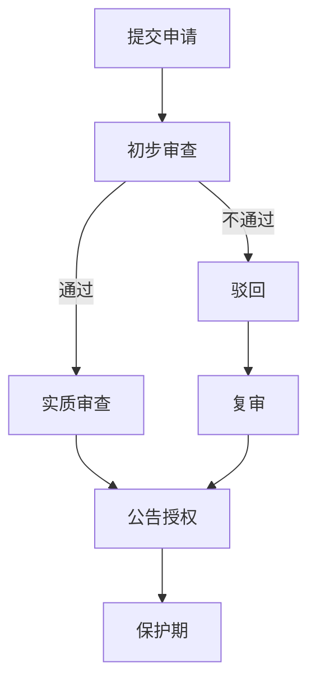

                 

### 文章标题：如何进行有效的技术专利申请

---

关键词：专利申请、技术专利、创新保护、专利流程、撰写技巧、法律框架

---

摘要：本文旨在为技术人员和创业者提供一份全面的指南，帮助他们在技术领域进行有效的专利申请。通过逐步分析专利申请的基础知识、流程、撰写技巧以及相关的法律框架，本文将帮助读者了解如何保护自己的技术成果，提升创新竞争力。文章结合了实际案例和实用技巧，旨在使读者能够更深入地理解专利申请的每个环节，从而做出更明智的决策。

---

## 第一部分：专利申请基础

### 第1章：专利概述

#### 1.1 专利的定义与类型

专利，是一种法律权利，授予发明者对其发明在一定期限内独占实施的权利。这种权利可以防止他人未经许可而使用、制造、销售或进口其发明。专利分为三种主要类型：发明专利、实用新型专利和外观设计专利。

- **发明专利**：授予对技术领域的发明，涉及对产品、方法或者其改进的技术方案。这种专利的保护范围较广，通常涵盖技术原理、产品设计和应用方法等多个方面。
- **实用新型专利**：授予对产品的形状、构造或者其结合所提出的适于实用的新的技术方案。相比发明专利，实用新型专利的保护范围较小，但审批流程相对简单，所需时间较短。
- **外观设计专利**：授予对产品的形状、图案或者其结合以及色彩与形状、图案的结合所作出的富有美感并适于工业应用的新设计。这种专利主要针对产品的外观设计，不涉及技术原理或功能。

#### 1.2 专利制度的意义与作用

专利制度在促进科技创新和经济发展方面发挥着重要作用。首先，专利制度通过授予发明者独占实施权，激励发明者进行创新活动，保护其利益。其次，专利制度促进了知识共享和技术扩散，因为发明者需要公开其发明内容，以换取专利保护。此外，专利制度还有助于优化资源配置，提高经济效益。

#### 1.3 专利法律框架

专利法律框架包括专利法、专利实施细则、专利审查指南等。这些法规明确了专利的申请条件、审批流程、权利保护期限等。在中国，专利法律框架主要由《中华人民共和国专利法》构成，该法规定了专利的申请、审批、保护等方面的具体规定。

- **申请条件**：发明必须具有新颖性、创造性和实用性。新颖性指发明不属于现有技术；创造性指发明与现有技术相比具有显著的进步；实用性指发明能够实际应用。
- **审批流程**：专利申请需经过初步审查、实质审查等环节。初步审查主要审查申请文件是否符合法律规定；实质审查主要审查发明的新颖性、创造性和实用性。
- **权利保护期限**：发明专利的保护期限为20年，实用新型专利和外观设计专利的保护期限为10年，均自申请日起计算。

### Mermaid流程图：专利申请流程



---

## 第二部分：专利申请流程

### 第2章：专利申请流程

#### 2.1 专利申请的基本步骤

专利申请的基本步骤包括以下几个阶段：

1. **专利检索**：在申请专利前，进行专利检索是必要的，以确定所拟申请的发明是否已被他人申请或授权。专利检索可以通过国家知识产权局等官方机构进行。

2. **撰写专利申请文件**：包括专利请求书、说明书、权利要求书和摘要等。其中，说明书和权利要求书是专利申请的核心部分，需要详细描述发明的内容和范围。

3. **提交申请**：将撰写好的专利申请文件提交至国家知识产权局或相应的专利机构。

4. **初步审查**：国家知识产权局对提交的专利申请进行形式审查，确保申请文件符合法律规定。

5. **公布与公告**：通过初步审查的专利申请将被公开公布，并提供公众提出异议的机会。如果无异议或异议被驳回，专利申请将进入实质审查阶段。

6. **实质审查**：实质审查是对专利申请的新颖性、创造性和实用性进行审查。

7. **授权与保护**：通过实质审查的专利申请将被公告授权，专利权利人可以获得专利保护。

#### 2.2 专利检索与文献分析

专利检索是专利申请的重要步骤，通过检索可以了解相关技术的现有状况，避免重复研发和侵权风险。专利检索主要包括以下内容：

1. **检索方法**：可以通过专利数据库、学术数据库、企业内部数据库等进行检索。

2. **检索策略**：根据申请的发明内容，制定合理的检索策略，包括关键词选择、检索式构建等。

3. **文献分析**：对检索到的文献进行分析，识别已有技术的不足、趋势和潜在的市场机会。

#### 2.3 专利申请文件的准备

专利申请文件的准备是专利申请成功的关键。以下是对专利申请文件各部分的详细说明：

1. **专利请求书**：包括专利申请人的基本信息、发明人姓名和地址等。

2. **说明书**：说明书是专利申请的核心部分，需要详细描述发明的内容、背景、技术领域、发明内容、附图说明等。

3. **权利要求书**：权利要求书定义了专利保护的范围，需要明确、具体、完整地描述发明的技术特征和范围。

4. **摘要**：摘要是专利申请的简短概括，需要准确、简洁地反映发明的主要技术内容。

### 伪代码：专利申请文件的结构

```plaintext
专利申请文件 = {
    专利请求书: {
        申请人信息: {},
        发明人信息: {},
    },
    说明书: {
        技术领域: "",
        背景技术: "",
        发明内容: "",
        附图说明: [],
    },
    权利要求书: {
        技术特征: [],
        保护范围: "",
    },
    摘要: {
        技术内容概括: "",
    }
}
```

---

## 第三部分：专利撰写的技巧

### 第3章：专利撰写的技巧

#### 3.1 权利要求书的撰写

权利要求书是专利申请文件中最为关键的部分，它直接决定了专利权的保护范围。撰写权利要求书需要注意以下几点：

1. **明确性**：权利要求书需要明确、具体地描述发明的技术特征和范围，避免模糊不清的表述。

2. **全面性**：权利要求书应涵盖发明的所有重要方面，确保专利权的保护范围完整。

3. **独立性**：每个权利要求应具备独立性，即使其他权利要求被无效或取消，单个权利要求仍能保护发明。

4. **逐步限定**：权利要求应从宽泛到具体，逐步限定发明的范围，提高专利权的保护力度。

### 伪代码：权利要求书的撰写

```plaintext
权利要求书 = {
    独立权利要求: {
        技术特征: [],
        保护范围: "",
    },
    从属权利要求: [
        {
            基本权利要求: "",
            技术特征增加: [],
        },
        ...
    ],
}
```

#### 3.2 说明书的撰写

说明书是专利申请文件的核心部分，它需要详细描述发明的技术方案、背景技术、发明内容、附图说明等。说明书撰写需要注意以下几点：

1. **清晰性**：说明书的表述应清晰、准确，避免使用模糊、复杂的术语。

2. **完整性**：说明书应全面、详尽地描述发明，确保读者能够理解发明的所有细节。

3. **创新性**：说明书需要突出发明的创新性，与现有技术进行对比，说明发明的技术优势。

4. **逻辑性**：说明书的结构应合理，内容应有条理，便于读者阅读和理解。

### 伪代码：说明书的撰写

```plaintext
说明书 = {
    技术领域: "",
    背景技术: "",
    发明内容: {
        技术方案: "",
        创新点: [],
    },
    附图说明: [],
}
```

#### 3.3 摘要的撰写

摘要是专利申请文件的简短概括，需要准确、简洁地反映发明的主要技术内容。摘要撰写需要注意以下几点：

1. **简洁性**：摘要应尽量简洁，避免冗长、复杂的表述。

2. **准确性**：摘要需要准确反映发明的主要技术内容，避免夸大或缩小发明的范围。

3. **概括性**：摘要应概括地描述发明，突出发明的技术特点和创新点。

4. **吸引力**：摘要应具有一定的吸引力，吸引读者的注意力。

### 伪代码：摘要的撰写

```plaintext
摘要 = {
    技术内容概括: "",
    创新点: [],
}
```

### LaTeX格式：数学公式

以下是一个LaTeX格式的数学公式示例，用于说明发明的数学模型：

$$
f(x) = x^2 + 2x + 1
$$

### 伪代码：数学模型和数学公式

```plaintext
数学模型 = {
    公式1: "f(x) = x^2 + 2x + 1",
    公式2: "g(y) = y^3 - 3y^2 + 2y",
}
```

---

## 第四部分：专利申请的法律框架

### 第4章：专利申请的法律框架

#### 4.1 专利申请的条件与要求

专利申请需要满足一定的条件和要求，包括新颖性、创造性和实用性。以下是对这些条件的详细说明：

1. **新颖性**：发明必须在申请日前不属于现有技术。这意味着，发明的技术内容不能在现有技术文献、公开的专利或其他公开信息中披露过。

2. **创造性**：发明与现有技术相比，必须具有显著的进步。这意味着，发明不仅仅是简单改进或常规变化，而是一种实质性的创新。

3. **实用性**：发明必须能够实际应用。这意味着，发明不仅具有理论上的可行性，还能在实践中应用。

#### 4.2 专利申请的审批流程

专利申请的审批流程包括初步审查、实质审查和公告授权。以下是对每个阶段的详细说明：

1. **初步审查**：初步审查主要审查申请文件的形式和内容，确保申请符合法律规定。如果申请文件不符合规定，专利局将要求申请人进行补正。

2. **实质审查**：实质审查是对发明的新颖性、创造性和实用性进行深入审查。实质审查通常由专业的审查员进行，他们会对发明进行全面的评估，以确保发明符合专利法的要求。

3. **公告授权**：通过实质审查的专利申请将被公告授权，专利局将颁发专利证书，发明人将获得专利保护。

#### 4.3 专利的保护期限与侵权处理

专利的保护期限根据专利类型而有所不同。发明专利的保护期限为20年，实用新型专利的保护期限为10年，外观设计专利的保护期限也为10年，均自申请日起计算。在保护期限内，任何未经专利权人许可的侵权行为都可能构成侵权。

1. **侵权处理**：如果发现侵权行为，专利权人可以向法院提起诉讼，要求侵权方停止侵权行为并赔偿损失。专利侵权诉讼通常涉及技术鉴定和法律论证，是一项复杂的法律程序。

### LaTeX格式：专利保护期限的数学模型

以下是一个LaTeX格式的数学模型，用于计算专利的保护期限：

$$
T = \begin{cases}
20 \text{ 年} & \text{发明专利} \\
10 \text{ 年} & \text{实用新型专利} \\
10 \text{ 年} & \text{外观设计专利}
\end{cases}
$$

### 伪代码：专利保护期限的计算

```plaintext
专利保护期限 = {
    发明专利: 20年,
    实用新型专利: 10年,
    外观设计专利: 10年,
}
```

---

## 第五部分：专利申请的实际操作

### 第5章：专利申请的实际操作

#### 5.1 案例分析：一款智能手表的专利申请

本节将通过一个实际案例，详细分析一款智能手表的专利申请过程，包括专利检索、申请文件的准备、审查过程和授权等。

##### 5.1.1 专利检索

在开始申请智能手表的专利之前，我们需要进行专利检索，以确保我们的发明没有被他人申请或授权。专利检索主要涉及以下步骤：

1. **确定检索关键词**：根据智能手表的技术特点和功能，选择合适的检索关键词，如“智能手表”、“健康监测”、“运动追踪”等。

2. **使用专利数据库进行检索**：通过国家知识产权局的专利数据库或国际专利数据库，进行关键词检索，分析检索结果，找出可能存在的同族专利或相似技术。

3. **分析检索结果**：对检索结果进行详细分析，识别已有的技术领域、发明趋势和潜在的市场机会。

##### 5.1.2 申请文件的准备

在完成专利检索后，我们可以开始准备专利申请文件。以下是智能手表专利申请文件的准备过程：

1. **撰写专利请求书**：包括申请人信息、发明人信息、发明名称等。

2. **编写说明书**：说明书需要详细描述智能手表的技术方案、背景技术、发明内容、附图说明等。

3. **撰写权利要求书**：权利要求书需要明确、具体地描述智能手表的技术特征和范围，确保专利权的保护范围合理。

4. **编写摘要**：摘要需要简洁、准确地概括智能手表的技术内容，突出创新点。

##### 5.1.3 审查过程

完成专利申请文件的准备后，我们需要提交至国家知识产权局进行审查。审查过程主要包括以下阶段：

1. **初步审查**：国家知识产权局对提交的专利申请进行形式审查，确保申请文件符合法律规定。

2. **公布与公告**：通过初步审查的专利申请将被公开公布，并提供公众提出异议的机会。

3. **实质审查**：实质审查是对发明的新颖性、创造性和实用性进行深入审查。实质审查通常由专业的审查员进行。

4. **授权与保护**：通过实质审查的专利申请将被公告授权，专利权人将获得专利保护。

##### 5.1.4 案例解析

以下是对智能手表专利申请案例的详细解析：

1. **技术特点**：智能手表具有健康监测、运动追踪、通知提醒等功能，通过传感器、算法和通信技术实现。

2. **创新点**：智能手表在健康监测方面采用了新的算法，能够更准确地监测心率、睡眠质量等指标。

3. **权利要求**：权利要求书涵盖了智能手表的核心技术，包括传感器技术、算法模型和通信协议。

4. **审查意见**：在审查过程中，审查员提出了一些关于权利要求书的具体问题，申请人对权利要求书进行了修改和完善。

5. **授权结果**：最终，智能手表的专利申请被公告授权，专利权人获得了20年的专利保护。

##### 5.1.5 项目小结

通过本案例的分析，我们可以得出以下结论：

1. **专利检索的重要性**：专利检索是专利申请成功的关键，可以有效避免重复研发和侵权风险。

2. **申请文件的准备**：申请文件的准备需要详细、准确地描述发明，确保权利要求书的保护范围合理。

3. **审查过程的沟通**：在审查过程中，及时与审查员沟通，回答审查意见，有利于提高专利申请的成功率。

4. **持续创新**：技术创新是专利申请的核心，只有具备显著的创新性，才能获得专利保护。

---

## 第六部分：专利申请的最佳实践与拓展

### 第6章：专利申请的最佳实践与拓展

#### 6.1 最佳实践 Tips

在进行专利申请时，以下是一些最佳实践技巧，可以帮助提高申请的成功率：

1. **充分准备**：在申请前，进行充分的调研和准备，确保发明具有新颖性、创造性和实用性。

2. **选择合适的代理机构**：选择专业的专利代理机构，可以提供专业的指导和帮助，提高申请质量。

3. **权利要求书的撰写**：权利要求书需要明确、具体，逐步限定发明的范围，确保专利权的保护力度。

4. **说明书的撰写**：说明书需要详细、完整地描述发明，突出发明的创新点和技术优势。

5. **及时答复审查意见**：在审查过程中，及时、准确地答复审查员的意见，有助于提高专利申请的成功率。

6. **持续更新与改进**：在专利申请过程中，持续对发明进行更新和改进，确保发明的技术含量和竞争力。

#### 6.2 小结与注意事项

1. **小结**：专利申请是一项复杂的过程，需要充分准备、专业撰写和有效沟通。通过本文的讲解，读者应该对专利申请的基础知识、流程、技巧和法律框架有了更深入的理解。

2. **注意事项**：在进行专利申请时，需要注意以下几点：

   - 确保发明具有新颖性、创造性和实用性。
   - 权利要求书需要明确、具体、逐步限定。
   - 说明书的撰写需要详细、完整、突出创新点。
   - 及时答复审查意见，提高申请成功率。
   - 持续更新与改进发明，保持技术竞争力。

#### 6.3 拓展阅读

为了更深入地了解专利申请，以下是一些建议的拓展阅读材料：

- 《专利申请实务操作指南》
- 《专利撰写与申请策略》
- 《技术创新与专利战略》
- 《专利法律实务》

通过这些书籍和资料的学习，读者可以进一步提高专利申请的专业素养和实际操作能力。

---

### 作者信息

作者：AI天才研究院/AI Genius Institute & 禅与计算机程序设计艺术 /Zen And The Art of Computer Programming

本文旨在为技术人员和创业者提供一份全面的指南，帮助他们在技术领域进行有效的专利申请。通过逐步分析专利申请的基础知识、流程、撰写技巧以及相关的法律框架，本文将帮助读者了解如何保护自己的技术成果，提升创新竞争力。文章结合了实际案例和实用技巧，旨在使读者能够更深入地理解专利申请的每个环节，从而做出更明智的决策。希望本文能为读者的技术专利申请之路提供有益的指导和建议。如果您有任何疑问或建议，欢迎随时联系我们。期待与您共同探讨技术专利申请的最佳实践。祝您申请顺利，创新不断！---

### 总结与展望

通过本文的详细讲解，我们可以看到专利申请是一项系统而复杂的工程，它涉及到技术创新、法律知识、撰写技巧等多个方面。从专利的基本概念、类型到申请的流程、技巧，再到法律框架和实际操作案例，本文旨在为读者提供一份全面而实用的指南。

首先，我们了解了专利的基本概念和类型，认识到专利对于保护技术创新和推动经济发展的重要性。接着，我们详细分析了专利申请的流程，包括专利检索、申请文件的准备、初步审查、实质审查和公告授权等关键环节。在此基础上，我们探讨了专利撰写的技巧，如权利要求书、说明书和摘要的撰写要点，以及如何确保申请文件的质量。

在法律框架部分，我们明确了专利申请的条件和要求，了解了专利的保护期限以及侵权处理的方法。最后，通过一个实际案例的分析，我们看到了专利申请从准备到授权的全过程，并总结了最佳实践技巧。

展望未来，随着科技的发展和知识产权意识的提高，专利申请将成为技术人员和创业者保护创新成果的重要手段。我们期待更多的读者能够通过本文的学习，掌握专利申请的核心知识和技巧，成功保护自己的技术创新，为科技进步和社会发展贡献自己的力量。

### 感谢与反馈

在此，我要感谢您抽出宝贵时间阅读本文。您的反馈对我们来说至关重要，它将帮助我们不断改进和完善我们的内容，为更多的读者提供更好的学习资源。如果您有任何疑问、建议或意见，欢迎随时通过以下方式与我们联系：

- 电子邮件：[contact@ai-genius-institute.com]
- 官方网站：[www.ai-genius-institute.com]
- 社交媒体：[AI天才研究院/AI Genius Institute]

我们期待与您共同探讨技术专利申请的最佳实践，为您提供专业的指导和支持。祝您在专利申请的道路上取得丰硕的成果！

