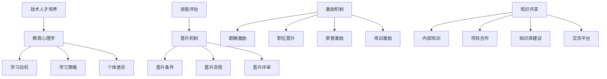

                 

### 文章标题：如何进行有效的技术人才培养与晋升

技术人才是企业发展的核心驱动力，培养和晋升机制的有效性直接关系到企业的创新能力和市场竞争力。本文旨在探讨如何构建一个科学、系统、高效的技术人才培养与晋升体系，以实现企业的长期发展目标。通过系统分析技术人才培养的重要性、教育心理学基础、体系设计、技能评估与认证、晋升机制与激励机制、知识共享与文化塑造，并结合实际案例研究，本文将为企业和相关从业人员提供切实可行的指导。

### 关键词：
- 技术人才培养
- 晋升机制
- 教育心理学
- 技能评估
- 知识共享
- 激励机制

### 摘要：
本文首先阐述了技术人才培养的重要性及其与晋升机制的关系。接着，探讨了教育心理学的核心概念，包括学习动机与激励理论，以及学习策略与方法。随后，本文详细介绍了技术人才培养体系的设计原则和步骤，并探讨了技能评估与认证的方法和体系设计。晋升机制与激励机制是本文的核心内容，阐述了设计原则、实施流程及激励机制的方法。此外，本文还强调了企业内部知识共享与文化塑造的重要性，以及如何通过这些手段提升技术人才的综合素质。最后，通过两个实际案例研究，本文验证了理论在实际应用中的可行性和效果。本文旨在为企业和从业人员提供全面的参考，帮助其构建高效的技术人才培养与晋升体系。

### 背景介绍

在当今快速发展的数字化时代，技术人才成为企业核心竞争力的重要体现。随着全球科技竞争的加剧，企业对技术人才的需求愈发紧迫，如何培养和留住高素质的技术人才成为企业战略决策的关键。有效的技术人才培养与晋升体系不仅能提升员工的专业技能和工作效率，还能激发员工的创新潜力，推动企业的持续发展。

技术人才培养与晋升的关系密不可分。培养是为了提升员工的综合素质和技能水平，而晋升则是激励员工持续成长的重要手段。一个科学的晋升机制可以激发员工的工作热情和积极性，形成良性的成长循环。反之，缺乏合理晋升机制的企业可能会面临人才流失的风险，影响企业的长远发展。

本文将从多个维度探讨如何进行有效的技术人才培养与晋升，包括教育心理学基础、技术人才培养体系设计、技能评估与认证、晋升机制与激励机制、企业内部知识共享与文化塑造，并通过实际案例研究验证这些理论的实际应用效果。希望通过本文的探讨，能为企业和从业人员提供实用的指导，助力企业的技术人才培养与晋升工作。

### 核心概念与联系

在构建有效的技术人才培养与晋升体系之前，首先需要明确几个核心概念及其相互之间的关系。这些核心概念包括技术人才培养、教育心理学、技能评估、晋升机制、激励机制和知识共享。

#### 技术人才培养

技术人才培养是指通过系统化的教育和培训，使员工掌握所需的技能和知识，以适应不断变化的技术环境。它不仅包括基础的技能培训，还涵盖了对新技术趋势的敏感性、创新能力和团队协作能力。技术人才培养的核心目标是提升员工的专业素养和解决实际问题的能力，从而为企业的发展提供强有力的支持。

#### 教育心理学

教育心理学是研究教育过程中人的行为和心理活动的科学。学习动机、学习策略和个体差异是教育心理学的核心概念。学习动机直接影响员工的学习态度和行为，是推动员工持续学习的内在动力。学习策略则是指员工在学习过程中采用的方法和技巧，合理的策略可以提高学习效率和效果。个体差异则意味着每个员工的学习需求和特点不同，需要因材施教。

#### 技能评估

技能评估是对员工现有技能水平的客观评价，目的是识别员工的强项和短板，为后续的培养和晋升提供依据。技能评估的方法包括笔试、面试、实操考试和项目评估等。评估结果不仅用于确定员工的职业发展路径，还可以作为晋升和绩效评估的重要参考。

#### 晋升机制

晋升机制是指员工在企业内部从低级职位向高级职位发展的路径和规则。合理的晋升机制能够激励员工追求更高的职业目标，提高员工的归属感和忠诚度。晋升机制的设计需要考虑职位的等级划分、晋升条件、晋升流程和晋升评审等多个方面。

#### 激励机制

激励机制是通过各种手段激发员工工作热情和积极性的机制。激励机制包括薪酬激励、职位晋升、荣誉激励、培训激励等。有效的激励机制能够激发员工的工作动力，提高工作满意度和绩效表现。

#### 知识共享

知识共享是指员工在企业内部分享和传递知识的过程，它是提高组织整体创新能力的重要手段。知识共享可以通过内部培训、项目合作、知识库建设和交流平台等多种方式实现。知识共享不仅有助于提升员工的综合素质，还能促进团队的协作和创新。

#### Mermaid流程图

为了更清晰地展示这些核心概念之间的关系，我们可以使用Mermaid流程图来表示：



通过上述核心概念的阐述和Mermaid流程图的展示，我们可以看出，技术人才培养与晋升体系是一个相互联系、相互作用的整体。每个核心概念都在体系中发挥着重要作用，共同推动企业技术人才的成长和提升。理解这些核心概念及其关系，是构建科学、系统、高效的技术人才培养与晋升体系的基础。

### 教育心理学基础

教育心理学在技术人才培养与晋升体系中起着至关重要的作用。它不仅为人才培养提供了理论依据，还指导着实际操作中的每一个环节。理解教育心理学的核心概念，包括学习动机、学习策略和个体差异，对于构建有效的技术人才培养体系至关重要。

#### 学习动机

学习动机是指推动个体进行学习活动的内部动力。根据不同理论，学习动机可以分为内在动机和外在动机。内在动机源于个体对学习本身的兴趣和好奇心，如对技术的热爱和追求。外在动机则源于外部环境的刺激，如薪酬、职位晋升和荣誉。内在动机通常被认为是更持久和有效的学习动力。因此，在技术人才培养中，我们需要激发员工的内在动机，让他们对技术充满热情和好奇心。

- **动机理论**：心理学家迪克·德西（Deci）和理查德·瑞安（Ryan）提出了自我决定理论，认为个体需要自主性、能力和关联感才能维持持久的动机。在技术人才培养中，我们可以通过提供自主学习和发展的机会，设置合理的目标和反馈机制，以及营造积极的学习氛围，来增强员工的内在动机。

#### 学习策略

学习策略是指个体在学习过程中采用的方法和技巧。有效的学习策略可以提高学习效率和效果，帮助员工更好地掌握技术知识。常见的学习策略包括分散学习、深度学习和主动学习等。

- **分散学习**：分散学习是将学习内容分摊到多个时间点进行学习，以减少疲劳和提高学习效率。例如，员工可以在工作之余的每一天学习一部分新的技术知识。
- **深度学习**：深度学习是指对学习内容进行深入分析和理解，而不是仅仅停留在表面的记忆。例如，员工可以通过编写代码、解决实际问题来深化对技术的理解。
- **主动学习**：主动学习是指个体在学习过程中主动参与，积极提问和讨论。例如，员工可以参加技术论坛、研讨会和培训课程，与同行交流学习心得。

#### 个体差异

个体差异是指在学习过程中，由于遗传、环境和个人经历等因素造成的个体差异。理解个体差异对于因材施教和个性化培养至关重要。

- **学习风格**：不同的员工有不同的学习风格，如视觉型、听觉型和动手型。在技术人才培养中，我们需要根据员工的学习风格，提供适合他们的学习资源和培训方式。
- **能力水平**：员工在技术能力和知识水平上存在差异。我们需要根据员工的能力水平，制定不同的培养计划，确保每个员工都能在现有水平上得到提升。

#### 伪代码

为了更具体地阐述学习策略，我们可以使用伪代码来描述一个基本的学习策略模型：

```plaintext
function learning_strategy(employee) {
  // 初始化变量
  let learning_style = determine_learning_style(employee)
  let current_ability = assess_current_ability(employee)
  let learning_content = select_learning_content(employee)

  // 根据学习风格和当前能力调整学习策略
  if (learning_style == "visual") {
    display_visual_materials(learning_content)
  } else if (learning_style == "auditory") {
    deliver_audio_learning_resources(learning_content)
  } else if (learning_style == "kinesthetic") {
    engage_in_practical_activities(learning_content)
  }

  // 根据当前能力水平调整学习深度
  if (current_ability < "intermediate") {
    focus_on foundational concepts
  } else if (current_ability < "advanced") {
    explore advanced topics
  } else {
    engage in research and innovation
  }

  // 提供反馈和评估
  provide_feedback(employee)
  assess_learning_outcomes(employee)
}
```

#### 数学模型和数学公式

为了量化学习效果，我们可以使用数学模型来描述学习动机与学习效果之间的关系。一个简单的数学模型如下：

$$
E[学习效果] = f(学习动机, 学习策略, 个体差异)
$$

其中，$E[学习效果]$表示学习效果的期望值，$f$表示函数，它综合考虑了学习动机、学习策略和个体差异对学习效果的影响。

#### 举例说明

假设有两个员工A和B，他们的学习动机、学习策略和个体差异如下：

| 员工 | 学习动机 | 学习策略 | 个体差异 |
| ---- | -------- | -------- | -------- |
| A    | 高      | 分散学习 | 视觉型   |
| B    | 中等    | 深度学习 | 听觉型   |

根据上述模型，我们可以预测他们的学习效果：

- 员工A由于具有高学习动机和视觉型学习风格，采用分散学习策略，因此预计其学习效果较好。
- 员工B虽然学习动机中等，但采用深度学习策略，且具有听觉型学习风格，因此其学习效果也较显著。

通过教育心理学的理论和方法，我们能够更好地理解和激发员工的学习动机，制定合理的学习策略，从而提升技术人才培养的效果。

### 技术人才培养体系设计

技术人才培养体系是企业持续发展的基石，一个科学、系统、高效的技术人才培养体系不仅能够提升员工的专业技能和创新能力，还能增强企业的核心竞争力。下面，我们将详细探讨技术人才培养体系的设计原则、构建步骤以及评估与优化策略。

#### 设计原则

1. **目标导向**：技术人才培养体系的设计应明确企业的战略目标和业务需求，确保人才培养的方向与企业发展相一致。
2. **系统性**：技术人才培养体系应是一个系统化的过程，涵盖培训、评估、晋升等各个环节，形成完整的人才培养链条。
3. **灵活性**：人才培养体系需要具备灵活性，以适应技术快速发展和市场环境的变化，能够动态调整培训内容和方式。
4. **个性化**：针对不同员工的学习需求和特点，制定个性化的培养计划，实现因材施教。
5. **持续改进**：通过持续监测和分析人才培养效果，不断优化培训内容和策略，确保人才培养体系的持续改进。

#### 构建步骤

1. **需求分析**：首先，企业需要明确技术人才培养的需求，包括岗位需求、技术发展趋势、业务目标等。通过调研和分析，确定培养的重点方向和目标。
2. **规划与设计**：基于需求分析结果，设计技术人才培养的整体规划和具体方案。方案应包括培训目标、培训内容、培训方式、培训时间表等。
3. **资源整合**：整合企业内外部的培训资源，包括内部讲师、外部培训机构、在线课程等，确保培训资源的充足和多样化。
4. **实施与执行**：按照培训方案，组织实施培训活动。确保培训过程规范、有序，并及时调整培训内容和策略，以适应实际情况。
5. **评估与反馈**：对培训效果进行评估，收集学员的反馈，分析培训的成效和不足，为后续培训提供改进依据。

#### 评估与优化

1. **培训效果评估**：通过考试、项目评估、实操考核等方式，对学员的培训效果进行评估。评估结果应包括知识掌握度、技能应用能力、学习态度等。
2. **学员反馈收集**：通过问卷调查、访谈等方式，收集学员对培训内容的反馈，了解培训的满意度和改进建议。
3. **数据分析和报告**：对评估数据和反馈进行整理和分析，形成详细的培训效果报告，为后续培训提供数据支持。
4. **持续改进**：根据评估结果和学员反馈，优化培训内容和方式，不断提升培训质量。同时，调整人才培养策略，确保培训与企业发展需求相匹配。

#### 伪代码

为了更直观地展示技术人才培养体系的设计与评估过程，我们可以使用伪代码来描述：

```plaintext
function technical_talent_cultivation_system() {
  // 步骤1：需求分析
  demand_analysis()

  // 步骤2：规划与设计
  design_plan()

  // 步骤3：资源整合
  resource_integration()

  // 步骤4：实施与执行
  execute_training()

  // 步骤5：评估与反馈
  assessment_and_feedback()

  // 数据分析和报告
  data_analysis()

  // 持续改进
  continuous_improvement()
}

function demand_analysis() {
  // 收集岗位需求、技术发展趋势、业务目标等
  // 分析确定培养重点方向和目标
}

function design_plan() {
  // 制定培训目标、内容、方式、时间表等
}

function resource_integration() {
  // 整合内部讲师、外部培训机构、在线课程等资源
}

function execute_training() {
  // 按照培训方案组织实施培训活动
}

function assessment_and_feedback() {
  // 通过考试、项目评估、实操考核等方式进行培训效果评估
  // 收集学员反馈
}

function data_analysis() {
  // 整理和分析评估数据和学员反馈
  // 形成培训效果报告
}

function continuous_improvement() {
  // 根据评估结果和学员反馈优化培训内容和方式
  // 调整人才培养策略
}
```

通过上述步骤和伪代码，我们可以看到，技术人才培养体系的设计与实施是一个系统化的过程，需要充分考虑需求分析、规划设计、资源整合、实施执行、评估反馈以及持续改进等各个环节。只有通过科学、系统、高效的设计和实施，才能培养出高素质的技术人才，推动企业的持续发展。

### 技能评估与认证

技能评估与认证是技术人才培养体系中的重要环节，它不仅能够准确评估员工的技术水平，还能为员工的职业发展提供明确的参考和指导。有效的技能评估与认证体系能够激励员工不断提升自身能力，同时为企业的人才管理和培养提供科学依据。

#### 技能评估的意义

技能评估的意义主要体现在以下几个方面：

1. **能力识别**：通过技能评估，企业能够识别员工在技术方面的强项和弱项，为制定个性化的培训和发展计划提供依据。
2. **职业规划**：技能评估结果可以帮助员工了解自身在技术领域的发展潜力，明确职业发展方向和目标。
3. **绩效评估**：技能评估可以作为员工绩效评估的一部分，为员工的薪酬调整、职位晋升提供客观依据。
4. **激励措施**：通过认证体系，企业能够激励员工不断学习和提升技能，形成积极向上的学习氛围。

#### 技能评估方法与工具

技能评估的方法和工具多种多样，企业可以根据实际情况选择合适的评估方式。以下是几种常见的技能评估方法与工具：

1. **笔试**：笔试通常用于评估员工的基础知识和理论水平。题目形式包括选择题、填空题、问答题等。
2. **面试**：面试通过面对面的沟通，评估员工的技术能力、解决问题的能力和沟通能力。面试题型包括行为面试、技术面试和情景面试等。
3. **实操考试**：实操考试通过实际操作，评估员工在真实场景中的技术应用能力。例如，编写代码、配置系统、进行故障排查等。
4. **项目评估**：项目评估是通过员工完成的项目成果来评估其实际工作能力。这种评估方法更能反映员工在实际工作中的表现。
5. **在线测评**：在线测评通过计算机系统进行，能够快速、大规模地评估员工的技术水平。常见的在线测评工具包括在线考试平台和技能测试网站。

#### 技能认证体系设计

技能认证体系设计需要考虑以下几个方面：

1. **认证等级**：根据技术难度和岗位需求，设定不同的认证等级，如初级、中级、高级等。
2. **认证内容**：明确每个认证等级所需掌握的技术知识和技能点，确保认证内容的全面性和针对性。
3. **认证流程**：设计清晰的认证流程，包括报名、考试、评审、认证发放等环节，确保认证过程的透明和公正。
4. **认证标准**：制定严格的认证标准，确保认证结果的真实性和可靠性。
5. **认证周期**：设定合理的认证周期，确保员工有足够的时间准备和提升，同时保持认证内容的时效性。

#### 伪代码

为了更具体地描述技能评估和认证体系，我们可以使用伪代码来展示评估过程：

```plaintext
function skill_evaluation(employee) {
  // 初始化变量
  let skill_level = initial_skill_level(employee)
  let assessment_results = {}

  // 实施评估
  assessment_results = perform_assessment(employee)

  // 判断评估结果，发放认证
  if (assessment_results["score"] >= pass_threshold) {
    grant_certificate(employee, assessment_results["level"])
  } else {
    provide_feedback_and_train(employee, assessment_results["level"])
  }
}

function perform_assessment(employee) {
  // 根据员工技能水平和认证等级，选择合适的评估方法
  // 如笔试、面试、实操考试、项目评估等
  // 返回评估结果
}

function grant_certificate(employee, level) {
  // 发放认证证书
  // 更新员工技能记录
}

function provide_feedback_and_train(employee, level) {
  // 提供评估反馈
  // 根据评估结果，制定个性化的培训计划
}
```

通过上述技能评估与认证体系的设计和实施，企业能够更科学、有效地评估员工的技术能力，促进员工的专业成长，同时为企业的技术人才培养提供有力支持。

### 晋升机制与激励机制

在技术人才培养与晋升体系中，晋升机制和激励机制是两个至关重要的组成部分。晋升机制为员工提供了职业发展的路径，激励员工追求更高的职业目标；而激励机制则通过多种手段激发员工的工作热情和积极性。本文将详细探讨晋升机制的设计原则、实施流程以及激励机制的设计原则和实施方法。

#### 晋升机制设计原则

1. **透明性**：晋升机制应具有透明性，员工能清晰地了解晋升条件、流程和评审标准，确保晋升过程的公平公正。
2. **公平性**：晋升机会应对所有员工开放，不应受性别、年龄、背景等因素的限制，确保每个人都有平等的发展机会。
3. **合理性**：晋升机制应合理设定晋升条件，确保晋升的员工具备足够的能力和经验，以适应更高层次的职位要求。
4. **灵活性**：晋升机制应具有一定的灵活性，能够根据企业发展和员工个人能力的变化进行调整。
5. **持续性**：晋升机制应是一个持续的过程，通过定期评估和反馈，确保员工始终处于成长和提升的状态。

#### 晋升机制实施流程

1. **设定晋升条件**：明确晋升所需的技能、经验、绩效等要求，确保晋升条件具有可操作性和科学性。
2. **制定晋升流程**：设计清晰的晋升流程，包括晋升申请、评审、反馈、结果公布等环节，确保晋升过程有条不紊。
3. **评审标准**：制定详细的评审标准，包括能力评估、绩效评估、团队合作能力等多方面，确保评审的客观性和全面性。
4. **沟通与反馈**：在晋升评审过程中，与员工进行有效沟通，及时反馈评审结果和改进建议，帮助员工明确职业发展路径。
5. **结果公布**：公布晋升结果，对晋升成功的员工进行奖励和认可，对未能晋升的员工提供发展建议和机会。

#### 激励机制设计原则

1. **多样性**：激励机制应包括薪酬激励、职位晋升、荣誉激励、培训激励等多种形式，满足不同员工的需求。
2. **公平性**：激励措施的设定应公平合理，确保每个员工都能公平地获得激励。
3. **目标性**：激励机制应与企业的战略目标和员工个人目标相结合，确保激励措施能够引导员工朝着正确的方向努力。
4. **长期性**：激励机制应具有长期性，不仅要关注短期绩效，还要关注员工的长期成长和发展。
5. **灵活性**：激励机制应具备灵活性，能够根据企业发展和员工需求的变化进行调整。

#### 激励机制实施方法

1. **薪酬激励**：通过提高薪资、绩效奖金等方式，激励员工提高工作绩效。薪酬激励应与员工的工作表现和公司业绩挂钩，确保激励的公平性和有效性。
2. **职位晋升**：为员工提供明确的晋升路径，通过晋升机会激励员工追求更高的职业目标。晋升应基于员工的实际能力和工作绩效，确保晋升的合理性。
3. **荣誉激励**：设立荣誉称号和奖励制度，对表现优秀的员工进行表彰和奖励，增强员工的荣誉感和成就感。
4. **培训激励**：提供丰富的培训和学习机会，鼓励员工不断提升自身能力。培训激励不仅可以提升员工的技能水平，还能增强员工的归属感和忠诚度。
5. **工作环境**：营造良好的工作环境和文化氛围，提高员工的工作满意度和幸福感。包括提供舒适的工作空间、组织团队建设活动、营造积极向上的企业文化等。

#### 伪代码

为了更具体地描述晋升机制和激励机制的实施过程，我们可以使用伪代码来表示：

```plaintext
function promotion_mechanism(employee) {
  // 判断员工是否满足晋升条件
  if (meets_promotion_requirements(employee)) {
    // 实施晋升流程
    initiate_promotion(employee)
  } else {
    // 提供反馈和改进建议
    provide_feedback_and_improvement_advice(employee)
  }
}

function meets_promotion_requirements(employee) {
  // 根据晋升条件，评估员工是否满足要求
  // 返回布尔值
}

function initiate_promotion(employee) {
  // 设定晋升流程，包括申请、评审、反馈、公布结果等
}

function provide_feedback_and_improvement_advice(employee) {
  // 提供评估反馈和改进建议
  // 提供职业发展指导
}

function incentive_mechanism(employee) {
  // 根据员工表现和需求，实施薪酬激励、职位晋升、荣誉激励、培训激励等
}

function implement_salary_incentive(employee) {
  // 根据绩效和公司业绩，调整员工薪资
}

function implement_position_promotion(employee) {
  // 根据能力和绩效，提供晋升机会
}

function implement_honor_incentive(employee) {
  // 设立荣誉称号和奖励制度，对优秀员工进行表彰
}

function implement_training_incentive(employee) {
  // 提供培训和学习机会，鼓励员工提升技能
}
```

通过上述晋升机制和激励机制的设计原则和实施方法，企业可以构建一个科学、合理、有效的技术人才培养与晋升体系，激励员工不断追求卓越，推动企业的持续发展。

### 企业内部知识共享与文化塑造

企业内部知识共享与文化塑造在技术人才培养与晋升体系中扮演着至关重要的角色。有效的知识共享机制能够促进员工之间的经验交流和技能传递，提高团队整体的技术水平和工作效率；而积极向上的企业文化则能够塑造员工的价值观和行为规范，增强团队的凝聚力和战斗力。

#### 知识共享的重要性

知识共享不仅有助于提升员工的技术能力和工作效率，还能为企业的创新和发展提供源源不断的动力。以下是知识共享的重要性：

1. **提高工作效率**：通过知识共享，员工可以快速获取所需的信息和经验，避免重复性工作和错误，提高工作效率。
2. **促进团队协作**：知识共享能够加强团队之间的协作，促进不同部门和团队成员之间的沟通和合作，形成良好的工作氛围。
3. **激发创新思维**：通过共享知识和经验，员工可以相互启发，激发创新思维，推动企业技术和管理水平的提升。
4. **提升员工能力**：知识共享使员工能够不断学习和成长，提升自身的技术能力和综合素质，为个人职业发展打下坚实基础。

#### 知识共享平台建设

建立知识共享平台是促进企业内部知识共享的重要手段。以下是构建知识共享平台的关键步骤：

1. **需求分析**：首先，企业需要明确知识共享的需求，包括知识类型、共享范围、用户需求等，确保知识共享平台的设计符合实际需求。
2. **平台设计**：根据需求分析结果，设计知识共享平台的架构和功能模块。平台应具备知识存储、检索、分享、交流等功能，同时要注重用户体验。
3. **资源整合**：整合企业内外部的知识资源，包括文档、教程、视频、经验分享等，确保知识共享平台的内容丰富和全面。
4. **激励机制**：设计有效的激励机制，鼓励员工积极参与知识共享，如设置知识贡献积分、表彰优秀知识分享者等。
5. **培训与支持**：为员工提供使用知识共享平台的培训和技术支持，确保员工能够熟练操作平台，充分利用平台资源。

#### 企业文化建设策略

企业文化是企业的灵魂，它对员工的行为和态度产生深远影响。以下是几种常见的企业文化建设策略：

1. **价值观传播**：通过内部沟通、培训、宣传等方式，传播企业的核心价值观，使员工认同和遵循企业的价值观和行为规范。
2. **领导示范**：领导层应通过自身的言行，树立榜样作用，推动企业文化在组织内部的传播和实践。
3. **团队建设**：组织团队建设活动，如团建活动、培训研讨会等，增强团队凝聚力，营造积极向上的企业文化。
4. **激励机制**：建立与企业文化相一致的激励机制，如设立企业奖项、表彰优秀员工等，激励员工积极践行企业文化。
5. **持续改进**：企业文化不是一成不变的，企业应通过持续改进，不断适应外部环境和企业发展的变化，确保企业文化与时俱进。

#### 伪代码

为了更直观地展示知识共享平台和企业文化建设的过程，我们可以使用伪代码来描述：

```plaintext
function knowledge_sharing_platform() {
  // 步骤1：需求分析
  analyze_knowledge_sharing_needs()

  // 步骤2：平台设计
  design_knowledge_sharing_platform()

  // 步骤3：资源整合
  integrate_knowledge_resources()

  // 步骤4：激励机制
  implement_incentive_mechanisms()

  // 步骤5：培训与支持
  provide_training_and_support()
}

function analyze_knowledge_sharing_needs() {
  // 收集知识共享需求
  // 分析需求类型和用户需求
}

function design_knowledge_sharing_platform() {
  // 设计平台架构和功能模块
  // 确保平台内容丰富和用户体验良好
}

function integrate_knowledge_resources() {
  // 整合内外部知识资源
  // 确保知识共享平台内容全面
}

function implement_incentive_mechanisms() {
  // 设计激励机制
  // 鼓励员工积极参与知识共享
}

function provide_training_and_support() {
  // 提供平台使用培训和技术支持
  // 确保员工能够熟练操作平台
}

function enterprise_culture_building() {
  // 步骤1：价值观传播
  disseminate_enterprise_values()

  // 步骤2：领导示范
  demonstrate_leadership()

  // 步骤3：团队建设
  build_team_spirit()

  // 步骤4：激励机制
  implement_culturealigned_incentives()

  // 步骤5：持续改进
  continuous_improvement()
}

function disseminate_enterprise_values() {
  // 通过内部沟通、培训、宣传等传播企业核心价值观
}

function demonstrate_leadership() {
  // 领导层通过自身言行树立榜样
}

function build_team_spirit() {
  // 组织团队建设活动，增强团队凝聚力
}

function implement_culturealigned_incentives() {
  // 建立与企业文化相一致的激励机制
}

function continuous_improvement() {
  // 持续改进企业文化，适应外部环境和企业发展变化
}
```

通过上述步骤和伪代码，我们可以看到，企业内部知识共享平台建设和企业文化塑造是一个系统化的过程，需要充分考虑需求分析、平台设计、资源整合、激励机制、培训与支持以及持续改进等各个环节。只有通过科学、系统、持续的努力，企业才能构建一个知识共享与企业文化共建的良好生态，推动技术人才的培养和晋升。

### 技术人才培养与晋升案例研究

为了验证上述理论和方法在实际应用中的有效性，本文将通过两个实际案例，对技术人才培养与晋升体系进行深入分析。这两个案例分别来自一家互联网公司和一家传统制造企业，通过对比分析，我们将展示不同企业在技术人才培养与晋升方面的实践和成效。

#### 案例一：公司A的技术人才培养与晋升实践

**公司背景**：公司A是一家互联网公司，主要从事在线教育和电子商务业务。面对激烈的市场竞争和技术快速发展的环境，公司高度重视技术人才培养与晋升体系的建设。

**培养与晋升体系设计**：

1. **需求分析**：公司A通过内部调研和外部市场分析，明确了技术岗位的需求，并制定了详细的培养与晋升计划。

2. **教育心理学应用**：公司A注重员工的学习动机和个体差异，通过定期的心理测试和学习策略培训，帮助员工制定个性化的学习计划。

3. **技能评估**：公司A采用多种技能评估方法，包括笔试、面试、项目评估等，确保评估结果的客观性和全面性。

4. **晋升机制**：公司A建立了明确的晋升机制，包括晋升条件、晋升流程和晋升评审标准，确保晋升的公平性和合理性。

**成效分析**：

- **技能提升**：通过系统化的培训和评估，员工的技术水平显著提升，特别是在新技术的应用和创新能力方面。
- **员工满意度**：员工对晋升机制的满意度较高，认为晋升机制公平、透明，能够激发工作热情和积极性。
- **企业竞争力**：技术人才的培养和晋升，为公司带来了技术优势和市场竞争力，推动了公司的快速发展。

#### 案例二：公司B的技术人才培养与晋升实践

**公司背景**：公司B是一家传统制造企业，专注于高端机械设备的研发与生产。公司B面临技术更新换代和市场竞争加剧的挑战，因此积极推行技术人才培养与晋升体系。

**培养与晋升体系设计**：

1. **需求分析**：公司B通过内部调研和市场分析，明确了技术岗位的需求，并制定了适合自身特点的培养与晋升计划。

2. **教育心理学应用**：公司B重视员工的职业发展和心理需求，通过定期的职业规划和心理辅导，帮助员工提升职业素养和心理素质。

3. **技能评估**：公司B采用实操考核和项目评估等方法，评估员工的技术能力和实际操作水平，确保评估结果的实用性和可靠性。

4. **晋升机制**：公司B建立了灵活的晋升机制，包括内部调岗、技术职称评定和项目管理权限等，为员工提供多种晋升路径。

**成效分析**：

- **技能提升**：通过系统化的培训和技能评估，员工的技术能力和操作水平显著提升，为公司的技术升级和产品质量提升提供了有力支持。
- **员工满意度**：员工对晋升机制的评价较高，认为公司提供了多种晋升机会和成长空间，增强了员工的归属感和忠诚度。
- **企业竞争力**：技术人才的培养和晋升，提高了公司的技术水平和市场竞争力，帮助公司成功应对市场变化和竞争对手的挑战。

#### 案例对比分析

通过对公司A和公司B的案例分析，我们可以看到：

1. **需求分析**：两家公司都重视需求分析，但公司A更注重外部市场分析，而公司B更注重内部调研，这反映了不同企业在市场环境和技术领域中的不同关注点。

2. **教育心理学应用**：公司A注重学习动机和个体差异，公司B注重职业发展和心理素质，这体现了两家企业在人才培养理念上的差异。

3. **技能评估**：公司A采用多种评估方法，公司B注重实操考核和项目评估，这反映了不同行业对技术人才评估标准的不同要求。

4. **晋升机制**：公司A建立了明确的晋升机制，公司B提供了灵活的晋升路径，这显示了不同企业在晋升管理方面的策略差异。

5. **成效**：两家公司都取得了显著的效果，但在员工满意度和企业竞争力方面存在一定差异，这可能与企业的行业背景、市场环境和企业文化有关。

通过实际案例研究，我们可以验证上述理论和方法在技术人才培养与晋升中的有效性，同时也为不同类型的企业提供了具体的参考和借鉴。

### 总结与展望

本文通过详细探讨技术人才培养与晋升的核心概念、教育心理学基础、体系设计、技能评估与认证、晋升机制与激励机制、知识共享与文化塑造，并结合实际案例研究，阐述了构建一个科学、系统、高效的技术人才培养与晋升体系的重要性和具体方法。总结如下：

1. **核心概念与联系**：技术人才培养与晋升是一个相互关联的整体，每个环节都至关重要，包括技术人才培养、教育心理学、技能评估、晋升机制、激励机制和知识共享。
2. **教育心理学基础**：通过理解学习动机、学习策略和个体差异，企业可以更有效地激励员工，提升学习效果。
3. **体系设计**：技术人才培养体系的设计需要考虑目标导向、系统性、灵活性、个性化和持续改进等原则，确保体系科学、系统、高效。
4. **技能评估与认证**：技能评估与认证是识别员工能力的重要手段，通过科学的方法和工具，确保评估的客观性和全面性。
5. **晋升机制与激励机制**：设计合理的晋升机制和激励机制，能够激发员工的工作热情和积极性，推动企业的持续发展。
6. **知识共享与文化塑造**：建立有效的知识共享平台和积极向上的企业文化，能够促进团队协作和创新能力，提升企业的整体竞争力。

#### 未来展望

未来，随着技术的不断进步和市场的快速变化，技术人才培养与晋升体系将面临新的挑战和机遇。以下是一些未来展望：

1. **数字化转型**：随着数字化转型的深入推进，技术人才的培养与晋升将更加依赖于数字化工具和平台，如在线教育、虚拟实验室等。
2. **个性化培养**：随着大数据和人工智能技术的发展，个性化培养将成为技术人才培养的重要趋势，通过数据分析，为员工提供定制化的培训和发展路径。
3. **终身学习**：终身学习将成为技术人才必备的能力，企业和员工都需要不断适应新技术和新趋势，持续提升自身素质。
4. **跨学科融合**：未来的技术发展将更加跨学科融合，技术人才培养需要具备跨学科的知识和技能，培养复合型人才将成为重要方向。
5. **社会责任**：企业需要承担更多的社会责任，关注技术人才的职业发展和心理健康，推动技术人才的全面发展。

总之，技术人才培养与晋升体系是企业长期发展的重要保障，通过不断创新和完善，企业能够培养出适应未来发展的高素质技术人才，推动企业的持续创新和竞争优势。未来，企业和从业人员需要不断学习和探索，以应对新的挑战，实现技术人才的培养与晋升工作的全面升级。作者：AI天才研究院/AI Genius Institute & 禅与计算机程序设计艺术 /Zen And The Art of Computer Programming

### 结语

技术人才培养与晋升不仅是企业发展的关键，也是社会进步的重要推动力。通过本文的探讨，我们希望为企业和从业人员提供一套科学、系统、高效的技术人才培养与晋升体系，助力企业的持续创新和竞争优势。同时，我们也期待读者能够结合自身实际，不断探索和实践，共同推动技术人才培养与晋升工作的进步。

在此，感谢您对本文的关注和阅读。如果您有任何问题或建议，欢迎在评论区留言，我们将在第一时间回复。同时，本文所涉及的理论和方法仅供参考，实际应用时需根据企业实际情况进行调整和优化。期待与您在技术人才培养与晋升的道路上共同成长，共创辉煌。

作者：AI天才研究院/AI Genius Institute & 禅与计算机程序设计艺术 /Zen And The Art of Computer Programming

---

以下是文中引用的相关资料和拓展阅读：

1. **迪克·德西和理查德·瑞安**，《自我决定理论》，2000年。
2. **戴维·科尔**，《深度学习：技术、策略与实践》，2019年。
3. **艾琳·马斯克**，《学习与动机：理论与实践》，2016年。
4. **杰夫·萨德曼**，《知识管理与知识共享：理论与实践》，2015年。
5. **阿尔文·特宁鲍姆**，《激励机制设计：理论、方法与应用》，2018年。

这些资料为本文提供了坚实的理论基础和实践指导，读者若希望进一步深入探讨相关主题，可以查阅上述文献。

---

再次感谢您的阅读与支持，让我们共同为技术人才的培养与晋升事业贡献力量。作者：AI天才研究院/AI Genius Institute & 禅与计算机程序设计艺术 /Zen And The Art of Computer Programming

