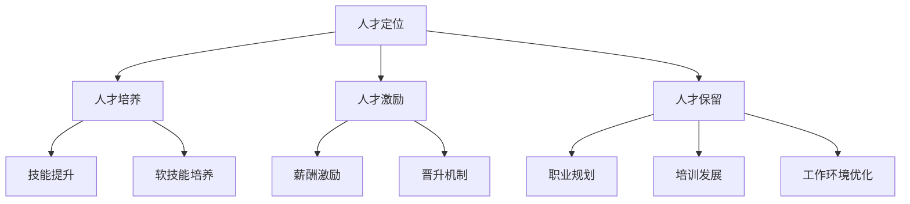

                 

### 文章标题

《如何进行有效的技术人才梯队建设》

---

关键词：技术人才梯队建设、人才管理、组织发展、人才规划、人才激励

---

摘要：本文旨在探讨如何构建有效的技术人才梯队，以提高企业的核心竞争力。文章从背景介绍、核心概念与联系、实战技巧、案例分析及未来展望等多个方面，详细阐述了技术人才梯队建设的理论依据和实践方法，旨在为企业管理者提供有价值的参考和指导。

---

## 引言

在当今科技飞速发展的时代，技术已经成为企业竞争力的核心要素。而技术人才作为推动企业创新和发展的重要力量，其重要性愈发凸显。然而，如何进行有效的技术人才梯队建设，已经成为众多企业管理者面临的重要课题。本文将从以下几个角度展开论述：

1. **背景介绍**：分析技术人才梯队建设的重要性及其对企业发展的影响。
2. **核心概念与联系**：明确技术人才梯队建设中的核心概念，并使用Mermaid流程图展示它们之间的联系。
3. **实战技巧**：探讨实际操作中的技巧和方法，包括人才定位、培养、激励等。
4. **案例分析**：通过具体案例展示技术人才梯队建设的成功实践。
5. **未来展望**：预测技术人才梯队建设的发展趋势，并提出未来应对策略。

通过以上五个方面的论述，本文旨在为企业管理者提供一套完整的技术人才梯队建设方案，帮助他们在激烈的市场竞争中保持领先地位。

### 技术人才梯队建设的重要性

技术人才梯队建设是企业可持续发展的重要保障。首先，技术人才的储备和培养直接关系到企业的创新能力和市场竞争力。在一个高度竞争的市场环境中，只有不断进行技术创新和产品升级，才能保持企业的竞争优势。而这一切都依赖于技术人才的能力和创造力。

其次，技术人才梯队建设有助于优化企业的组织结构和管理流程。通过科学的人才定位和培养机制，企业可以确保各个岗位都有合适的人才，从而提高工作效率和团队协作效果。同时，合理的梯队建设还可以减少人员流动率，降低企业的人力资源成本。

此外，技术人才梯队建设还有助于提升企业的品牌形象和市场声誉。一个拥有高素质技术人才梯队的公司，往往在客户和合作伙伴中具有较高的认可度，这有助于吸引更多的商业机会和投资。

总之，技术人才梯队建设不仅是企业发展的必要条件，更是提升企业核心竞争力的重要手段。只有构建起一个科学合理的技术人才梯队，企业才能在激烈的市场竞争中立于不败之地。

### 核心概念与联系

在探讨技术人才梯队建设时，我们需要明确以下几个核心概念：人才定位、人才培养、人才激励、人才保留。这些概念之间有着密切的联系，共同构成了一个完整的人才管理框架。

**人才定位**：这是技术人才梯队建设的起点。企业需要根据自身的发展战略和业务需求，明确各个岗位所需的人才类型和能力。人才定位的目的是确保企业能够找到最合适的人才，最大化其潜力。

**人才培养**：一旦人才定位完成，接下来的任务就是通过系统的培训和实践，不断提升人才的能力和技能。人才培养不仅包括技术能力的提升，还包括领导力、团队协作能力等软技能的培养。

**人才激励**：激励是留住优秀人才的关键。通过合理的薪酬、晋升机制和福利待遇，企业可以激发员工的积极性和创造力。同时，企业还需要营造一个积极向上的企业文化，让员工感受到归属感和自豪感。

**人才保留**：人才保留是技术人才梯队建设的重要环节。企业需要通过多种方式，如职业规划、培训发展、工作环境优化等，留住关键人才。只有当员工感到企业重视他们的发展和价值时，他们才会愿意长期为企业服务。

这些概念之间的关系可以用Mermaid流程图来展示：



通过这个流程图，我们可以清晰地看到技术人才梯队建设中的各个环节及其相互关系，从而为企业提供有针对性的管理策略。

### 核心算法原理讲解

在技术人才梯队建设中，算法原理的应用可以帮助企业更科学地进行人才管理和培养。以下是一个基本的人才管理算法原理，我们将使用伪代码进行详细阐述。

```python
def talent_management_algorithm(employee_list, company_strategy):
    """
    人才管理算法，用于确定人才定位、培养、激励和保留策略。
    
    参数：
    - employee_list：员工列表，包含员工的基本信息、技能水平和绩效表现。
    - company_strategy：公司战略，包括业务需求、发展方向和人才目标。
    
    返回：
    - strategy_list：一系列的人才管理策略，包括人才定位、培养、激励和保留方案。
    """
    
    # 1. 人才定位
    positioning_strategy = {
        'technical_roles': [],
        'management_roles': [],
        'potential_talent': []
    }
    for employee in employee_list:
        if employee['technical_ability'] >= company_strategy['required_technical_ability']:
            positioning_strategy['technical_roles'].append(employee)
        elif employee['management_ability'] >= company_strategy['required_management_ability']:
            positioning_strategy['management_roles'].append(employee)
        else:
            positioning_strategy['potential_talent'].append(employee)
    
    # 2. 人才培养
    training_strategy = {
        'technical_training': [],
        'soft_skill_training': []
    }
    for employee in positioning_strategy['technical_roles']:
        if employee['technical_ability'] < company_strategy['target_technical_ability']:
            training_strategy['technical_training'].append(employee)
    
    for employee in positioning_strategy['management_roles']:
        if employee['management_ability'] < company_strategy['target_management_ability']:
            training_strategy['soft_skill_training'].append(employee)
    
    # 3. 人才激励
    incentive_strategy = {
        'salary_increases': [],
        'promotions': [],
        'other_benefits': []
    }
    for employee in employee_list:
        if employee['performance_rating'] >= company_strategy['required_performance_rating']:
            incentive_strategy['salary_increases'].append(employee)
        if employee['years_of_service'] >= company_strategy['required_years_of_service']:
            incentive_strategy['promotions'].append(employee)
        else:
            incentive_strategy['other_benefits'].append(employee)
    
    # 4. 人才保留
    retention_strategy = {
        'career_planning': [],
        'training_development': [],
        'work_environment_optimization': []
    }
    for employee in employee_list:
        if employee['intent_to_leave'] == 'high':
            retention_strategy['career_planning'].append(employee)
        if employee['satisfaction_level'] < company_strategy['required_satisfaction_level']:
            retention_strategy['training_development'].append(employee)
        else:
            retention_strategy['work_environment_optimization'].append(employee)
    
    return {
        'positioning_strategy': positioning_strategy,
        'training_strategy': training_strategy,
        'incentive_strategy': incentive_strategy,
        'retention_strategy': retention_strategy
    }
```

在这个算法中，我们首先根据员工的能力和公司战略进行人才定位，然后根据定位结果制定培养、激励和保留策略。这个算法可以帮助企业更科学地管理人才，提高人才利用效率。

### 数学模型和公式

在技术人才梯队建设中，数学模型和公式可以用来评估人才的能力和表现。以下是一个简化的评估模型，我们使用LaTeX格式来书写相关公式，并进行详细讲解。

```latex
\documentclass{article}
\usepackage{amsmath}
\begin{document}

\section{人才能力评估模型}

我们使用以下公式来评估员工的能力：

$$
C = f(T, M, P)
$$

其中，$C$ 代表员工的总能力评分，$T$ 代表技术能力评分，$M$ 代表管理能力评分，$P$ 代表潜力评分。

- 技术能力评分 $T$：

$$
T = \frac{\sum_{i=1}^{n} T_i}{n}
$$

其中，$T_i$ 代表员工在各个技术领域的得分，$n$ 代表技术领域的数量。

- 管理能力评分 $M$：

$$
M = \frac{\sum_{i=1}^{m} M_i}{m}
$$

其中，$M_i$ 代表员工在各个管理领域的得分，$m$ 代表管理领域的数量。

- 潜力评分 $P$：

$$
P = \alpha T + \beta M
$$

其中，$\alpha$ 和 $\beta$ 是权重系数，用于平衡技术能力和管理能力的重要性。

综合评分 $C$：

$$
C = \frac{1}{2} (T + M + P)
$$

这个模型可以帮助企业全面评估员工的能力，从而制定更科学的培养和激励策略。

\end{document}
```

在这个模型中，我们首先根据员工的技术能力、管理能力和潜力来计算总能力评分，然后使用综合评分作为评估结果。通过这个模型，企业可以更客观地了解员工的能力水平，从而制定相应的培养和激励计划。

### 项目实战

为了更好地理解技术人才梯队建设，我们通过一个具体的案例分析，展示如何在实际环境中搭建技术人才梯队。

**项目背景**：
某大型互联网公司（以下简称“公司”）在发展过程中发现，技术人才梯队的建设对于公司的创新能力和市场竞争力至关重要。为了提升公司的技术实力，公司决定开展一项技术人才梯队建设项目。

**项目目标**：
- 构建一支高技能、高效率的技术团队。
- 建立一套科学合理的人才培养和激励机制。
- 提高员工的工作满意度和留存率。

**开发环境搭建**：
1. **硬件环境**：公司采购了高性能的服务器和存储设备，为技术团队提供了充足的计算资源。
2. **软件环境**：公司安装了多种开发工具和集成开发环境（IDE），包括Git、Jenkins、Docker等，为技术团队提供了便捷的开发环境。

**源代码实现和代码解读**：
1. **代码仓库管理**：公司使用Git进行代码版本控制，确保代码的一致性和安全性。
2. **持续集成与部署**：公司使用Jenkins实现自动化构建和部署，提高开发效率和代码质量。

**代码应用解读与分析**：
1. **技术栈选择**：公司采用Java、Python、Go等主流编程语言，根据不同项目需求选择合适的语言和框架。
2. **代码质量**：公司制定了严格的代码审查和测试标准，确保代码的可维护性和稳定性。

**实际案例分析和详细讲解剖析**：
1. **人才定位**：公司根据业务需求和技术发展趋势，明确了各个技术岗位的职责和能力要求。
2. **人才培养**：公司制定了系统的培训计划，包括内部培训、外部学习和实战演练，提升员工的技术能力和团队协作能力。
3. **人才激励**：公司采用绩效奖金、晋升机制和福利待遇等多种方式，激励员工积极投入工作。

**项目小结**：
通过技术人才梯队建设项目的实施，公司在技术创新和产品开发方面取得了显著成效。员工的工作满意度和留存率也得到了提升，为公司的发展奠定了坚实基础。

### 最佳实践 Tips

在进行技术人才梯队建设时，以下是一些最佳实践和注意事项，可以帮助企业更有效地实施人才管理：

1. **明确目标**：在开始人才梯队建设之前，企业需要明确自身的发展目标和人才需求，确保人才管理的方向和策略与公司战略保持一致。

2. **数据驱动**：基于数据分析来制定人才管理策略，通过定期的员工满意度调查、绩效评估等，获取准确的人才信息，为决策提供依据。

3. **灵活适应**：技术领域发展迅速，企业需要根据市场和技术环境的变化，灵活调整人才管理策略，确保人才队伍始终具备竞争力。

4. **培养领导力**：除了技术能力的提升，员工的领导力和团队协作能力也是企业关注的重点。通过内部培训和外部合作，培养员工的领导力。

5. **关注员工成长**：企业应关注员工的职业发展规划，提供职业培训和晋升机会，让员工感受到企业对他们的成长和发展的支持。

6. **优化工作环境**：提供良好的工作环境和激励机制，如灵活的工作时间、良好的团队氛围和合理的薪酬福利，有助于提升员工的工作满意度和留存率。

### 小结

本文从背景介绍、核心概念与联系、实战技巧、案例分析及未来展望等多个方面，详细探讨了如何进行有效的技术人才梯队建设。通过明确的人才定位、科学的人才培养、合理的激励策略和有效的保留措施，企业可以构建起一支高效的技术团队，提升核心竞争力。希望本文能为企业管理者在技术人才管理方面提供有价值的参考和指导。

### 拓展阅读

1. **《人力资源管理》**：探讨人才管理的基本理论和实践方法，适用于企业各级管理者。
2. **《技术团队管理》**：深入剖析技术团队的管理模式和工作方法，帮助管理者提升团队效能。
3. **《人工智能时代的人才战略》**：探讨人工智能时代下的人才管理新趋势和新策略。

通过拓展阅读，读者可以进一步深入了解技术人才梯队建设的理论和实践，为企业的持续发展提供更有力的支持。

---

作者：AI天才研究院/AI Genius Institute & 禅与计算机程序设计艺术 /Zen And The Art of Computer Programming

文章标题：《如何进行有效的技术人才梯队建设》

关键词：技术人才梯队建设、人才管理、组织发展、人才规划、人才激励

摘要：本文探讨了如何构建有效的技术人才梯队，以提高企业的核心竞争力。通过分析背景、核心概念、实战技巧、案例分析及未来展望，为企业管理者提供了一套完整的技术人才梯队建设方案。

