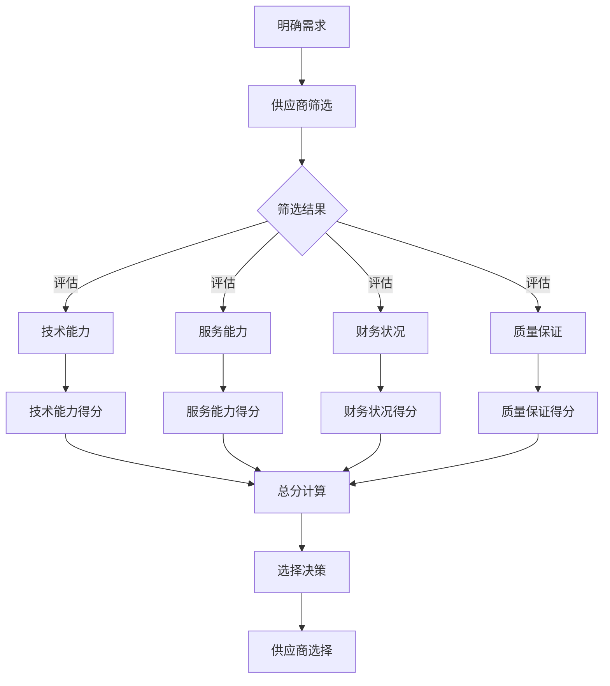

                 

# 如何进行有效的技术供应商管理

## 摘要

在当今高速发展的信息技术时代，技术供应商管理对企业而言至关重要。本文旨在探讨如何通过科学的方法和有效的策略，进行技术供应商的管理。文章将详细分析供应商选择的原理、合同管理、风险管理、供应商关系管理、绩效评估与供应链优化，并通过实际案例进行深入剖析，总结出最佳实践，以帮助企业提升技术供应链的效率与稳定性。

## 引言

随着全球化和信息技术的迅猛发展，企业面临着日益复杂的供应链环境。技术供应商作为企业获取外部技术和服务的关键环节，其管理水平直接影响企业的创新速度、成本控制和市场竞争力。有效的技术供应商管理不仅能够为企业提供高质量的技术和服务，还能降低采购成本、减少风险，提升整体运营效率。本文将围绕技术供应商管理的核心内容展开，旨在为企业和专业人士提供实用的指导。

### 供应商选择的原理

供应商选择是技术供应商管理的第一步，也是至关重要的一步。一个合适的供应商不仅能够满足企业的需求，还能提供优质的服务和良好的合作关系。以下是供应商选择的主要原理和步骤：

#### 1. 明确企业需求

首先，企业需要明确自身的技术需求，包括技术规格、性能指标、交付周期等。这一步骤是后续供应商评估和选择的基础。

#### 2. 供应商筛选

在明确了企业需求后，企业可以通过以下几种方式筛选潜在的供应商：

- **市场调研**：通过行业报告、市场分析等途径了解潜在供应商的市场地位、声誉和业绩。
- **供应商数据库**：利用企业内部的供应商数据库或外部供应商数据库查找符合条件的供应商。
- **同行推荐**：向同行或行业专家咨询，获取有价值的供应商信息。

#### 3. 供应商评估

对筛选出的供应商进行详细评估，主要评估指标包括：

- **技术能力**：供应商的技术实力、研发能力、技术专利等。
- **服务能力**：供应商的响应速度、售后服务、客户满意度等。
- **财务状况**：供应商的财务状况、信用等级、履约能力等。
- **质量保证**：供应商的质量管理体系、质量认证、质量控制等。

#### 4. 供应商选择决策

根据评估结果，企业可以采用以下决策方法：

- **评分法**：将各个评估指标进行量化评分，按照总分高低选择供应商。
- **矩阵法**：将各个评估指标按照重要程度进行权重分配，计算综合得分。
- **决策树法**：通过构建决策树模型，分析不同决策路径的结果，选择最优方案。

### 核心概念与联系

为了更直观地展示供应商选择的过程，我们可以使用Mermaid流程图来描述核心概念之间的关系：



### 合同管理

合同管理是技术供应商管理的核心环节之一，它关系到企业的权益保障和供应商的履约情况。以下是合同管理的主要内容：

#### 1. 合同类型和结构

技术合同通常分为以下几种类型：

- **采购合同**：明确采购商品或服务的数量、质量、价格、交付期限等。
- **技术服务合同**：明确技术服务的内容、标准、期限、费用等。
- **合作开发合同**：明确合作双方在技术开发中的权利、义务、成果分配等。

合同的结构通常包括以下部分：

- **合同首部**：包括合同名称、编号、签订日期、双方基本信息等。
- **合同正文**：详细描述合同的内容、条款、条件和要求。
- **合同尾部**：包括合同生效、终止、解除、变更、争议解决等条款。

#### 2. 合同起草和审核要点

在起草合同过程中，企业需要注意以下要点：

- **合法性**：确保合同内容符合相关法律法规的要求。
- **完整性**：合同内容应当全面、具体、明确，避免模糊条款。
- **可执行性**：合同条款应具有可执行性，便于双方履行。
- **公正性**：合同条款应当公平合理，保护双方的合法权益。

合同起草后，应经过企业法律部门或专业律师的审核，确保合同内容的合法性和有效性。

#### 3. 合同变更和纠纷处理

合同签订后，可能会因为各种原因需要变更或解除。以下是合同变更和纠纷处理的主要内容：

- **合同变更**：在合同履行过程中，双方可以协商一致对合同内容进行变更。变更应通过书面形式明确记录，并经双方签字确认。
- **合同解除**：在特定情况下，双方可以解除合同。解除合同的方式包括协商解除、法定解除、违约解除等。解除合同后，双方应当及时办理相关的手续，清理债权债务。
- **纠纷处理**：在合同履行过程中，若发生纠纷，双方应首先通过协商解决。协商不成的，可以采取调解、仲裁或诉讼等方式解决。纠纷处理过程中，应当遵循公平公正的原则，维护双方的合法权益。

### 核心算法原理讲解

合同管理中的核心算法原理主要包括以下几个方面：

#### 1. 合同风险评分算法

合同风险评分算法用于评估合同潜在的风险程度。以下是该算法的伪代码：

```plaintext
function calculateRiskScore(contract):
    score = 0
    if contract legitimacy is doubtful:
        score += 10
    if contract terms are incomplete:
        score += 10
    if contract is not enforceable:
        score += 10
    if contract fairness is questionable:
        score += 10
    return score
```

#### 2. 合同变更风险评估算法

合同变更风险评估算法用于评估合同变更可能带来的风险。以下是该算法的伪代码：

```plaintext
function calculateChangeRisk(contract, proposedChange):
    riskScore = calculateRiskScore(contract)
    if proposedChange involves significant changes to contract terms:
        riskScore += 20
    if proposedChange requires additional resources or time:
        riskScore += 10
    if proposedChange affects third-party interests:
        riskScore += 15
    return riskScore
```

### 数学模型和公式

在合同管理中，一些数学模型和公式可以用于评估合同风险和绩效。以下是几个常见的数学模型和公式：

#### 1. 风险评估模型

$$
Risk = Probability \times Impact
$$

其中，$Probability$ 表示风险发生的概率，$Impact$ 表示风险发生后的影响程度。该模型用于评估单个风险的概率和影响。

#### 2. 绩效评估模型

$$
Performance = \frac{Achieved \ Results}{Expected \ Results}
$$

其中，$Achieved \ Results$ 表示实际达到的结果，$Expected \ Results$ 表示预期达到的结果。该模型用于评估供应商的绩效。

#### 3. 风险矩阵

$$
Risk \ Matrix = \begin{pmatrix}
High \ Probability \ & Low \ Probability \\
High \ Impact \ & Low \ Impact
\end{pmatrix}
$$

该矩阵用于分类和优先级排序风险。

### 详细讲解与举例说明

为了更好地理解合同管理中的核心算法原理和数学模型，我们可以通过以下例子进行说明：

#### 例子：合同风险评分

假设有一个合同，其合法性存疑、条款不完整、可执行性较差、公平性存在问题。根据上述风险评分算法，该合同的风险评分为：

$$
Risk \ Score = 10 + 10 + 10 + 10 = 40
$$

#### 例子：合同变更风险评估

假设一个合同需要变更，涉及重大条款修改、额外资源和时间的需求、影响第三方利益。根据上述变更风险评估算法，该合同变更的风险评分为：

$$
Risk \ Score = 40 + 20 + 10 + 15 = 85
$$

通过以上例子，我们可以看到如何使用核心算法原理和数学模型对合同进行评估和管理。

### 风险管理

风险管理是技术供应商管理中不可或缺的一部分，它涉及到对潜在风险的识别、评估和应对。有效的风险管理可以降低企业的风险暴露，确保供应链的稳定和持续运作。

#### 1. 风险识别

风险识别是风险管理的第一步，其目的是发现可能影响技术供应商管理的各种风险。以下是一些常见的技术供应商风险：

- **供应商破产风险**：供应商可能因财务状况不佳而破产，导致企业无法获取所需的技术和服务。
- **技术风险**：供应商的技术可能无法满足企业的需求，或者技术更新速度慢，影响企业的竞争力。
- **质量风险**：供应商提供的产品或服务质量可能不满足企业的要求，影响企业的运营和声誉。
- **合规风险**：供应商的行为可能违反法律法规或行业标准，导致企业面临法律风险。
- **供应链中断风险**：由于自然灾害、政治动荡等原因，供应商可能无法按时交付产品或服务。

#### 2. 风险评估

在识别出风险后，需要对风险进行评估，以确定其严重程度和发生概率。以下是一些常用的风险评估方法：

- **定性评估**：通过专家判断或主观评估来确定风险的严重程度和发生概率。例如，可以使用风险矩阵（如图1所示）来分类和优先级排序风险。
- **定量评估**：通过数据分析和模型计算来确定风险的严重程度和发生概率。例如，可以使用蒙特卡洛模拟等方法来评估风险的概率分布。

图1：风险矩阵示例

| 风险类别 | 高概率 | 低概率 |
| --- | --- | --- |
| 高影响 | 高风险 | 中风险 |
| 低影响 | 中风险 | 低风险 |

#### 3. 风险应对策略

根据风险评估的结果，企业可以制定相应的风险应对策略。以下是一些常见的风险应对策略：

- **风险规避**：通过避免或消除风险来减少风险暴露。例如，企业可以寻找替代供应商，以避免依赖单一供应商。
- **风险减轻**：通过采取措施来降低风险的发生概率或严重程度。例如，企业可以加强对供应商的审计和监督，确保供应商满足质量要求。
- **风险转移**：通过将风险转移给第三方来减轻企业的风险负担。例如，企业可以通过保险来转移供应商破产的风险。
- **风险接受**：在某些情况下，企业可能无法规避、减轻或转移风险，只能接受风险。在这种情况下，企业应制定相应的应对计划，以降低风险对企业的影响。

#### 4. 风险监控与报告

风险管理是一个持续的过程，企业需要定期监控风险的变化，并根据实际情况调整风险应对策略。以下是一些关键步骤：

- **风险监控**：通过建立风险监控机制，实时跟踪风险的变化。例如，企业可以定期收集供应商的财务状况、产品质量、交货情况等信息。
- **风险报告**：定期编制风险报告，向企业管理层和相关部门报告风险状况。报告应包括风险识别、评估、应对策略和监控结果等内容。
- **风险沟通**：通过有效的沟通，确保企业内部各部门和供应商对风险有清晰的认识，并采取一致的风险应对措施。

### 核心算法原理讲解

风险管理中的核心算法原理主要包括风险识别、风险评估和风险应对策略。以下是对这些算法原理的详细讲解：

#### 1. 风险识别算法

风险识别是风险管理的基础，其目标是发现潜在的风险。以下是一个简单的风险识别算法：

```plaintext
function identifyRisks():
    risks = []
    for each potentialRisk in riskCatalog:
        if potentialRisk applies to the current context:
            risks.append(potentialRisk)
    return risks
```

该算法通过遍历风险目录，判断每个潜在风险是否适用于当前情境，从而识别出潜在的风险。

#### 2. 风险评估算法

风险评估算法用于评估已识别的风险的严重程度和发生概率。以下是一个简单的风险评估算法：

```plaintext
function assessRisk(risk):
    severity = 0
    probability = 0
    if risk has high impact and high probability:
        severity = 3
        probability = 3
    else if risk has high impact and low probability:
        severity = 2
        probability = 1
    else if risk has low impact and high probability:
        severity = 1
        probability = 3
    else if risk has low impact and low probability:
        severity = 1
        probability = 1
    return severity, probability
```

该算法根据风险的影响程度和发生概率，将风险分为不同的等级。

#### 3. 风险应对策略算法

风险应对策略算法用于选择合适的风险应对措施。以下是一个简单的风险应对策略算法：

```plaintext
function selectRiskMitigationStrategy(risk):
    if risk can be avoided:
        strategy = "Risk Avoidance"
    else if risk can be mitigated:
        strategy = "Risk Mitigation"
    else if risk can be transferred:
        strategy = "Risk Transfer"
    else if risk must be accepted:
        strategy = "Risk Acceptance"
    return strategy
```

该算法根据风险的性质，选择合适的应对策略。

### 数学模型和公式

在风险管理中，一些数学模型和公式可以用于评估风险和选择应对策略。以下是一些常用的数学模型和公式：

#### 1. 风险评估模型

$$
Risk = Probability \times Impact
$$

其中，$Probability$ 表示风险发生的概率，$Impact$ 表示风险发生后的影响程度。该模型用于计算单个风险的综合风险值。

#### 2. 风险优先级排序模型

$$
Priority = Severity \times Probability
$$

其中，$Severity$ 表示风险的严重程度，$Probability$ 表示风险发生的概率。该模型用于计算风险的优先级，以便于企业制定应对策略。

#### 3. 风险矩阵

$$
Risk \ Matrix = \begin{pmatrix}
High \ Probability \ & Low \ Probability \\
High \ Impact \ & Low \ Impact
\end{pmatrix}
$$

该矩阵用于分类和优先级排序风险，以便企业制定有针对性的应对措施。

### 详细讲解与举例说明

为了更好地理解风险管理中的核心算法原理和数学模型，我们可以通过以下例子进行说明：

#### 例子：风险识别

假设企业正在评估与一家供应商的合作关系，风险目录中包括以下潜在风险：

- 供应商破产风险
- 技术风险
- 质量风险
- 合规风险

通过风险识别算法，企业发现供应商破产风险适用于当前情境，因此将其识别为潜在风险。

#### 例子：风险评估

根据风险识别的结果，企业对供应商破产风险进行评估。假设该风险的影响程度为高，发生概率为低，根据风险评估模型，该风险的综合风险值为：

$$
Risk = 1 \times 3 = 3
$$

#### 例子：风险应对策略

根据风险评估的结果，企业可以选择以下风险应对策略：

- 风险规避：寻找替代供应商，以避免依赖单一供应商。
- 风险减轻：加强对供应商的审计和监督，确保供应商满足质量要求。

通过以上例子，我们可以看到如何使用核心算法原理和数学模型对风险进行识别、评估和应对。

### 供应商关系管理

供应商关系管理是技术供应商管理的核心之一，它涉及到企业与供应商之间的沟通、合作和共赢。有效的供应商关系管理能够增强供应链的稳定性，提高企业的竞争力。

#### 1. 建立有效的供应商关系

建立有效的供应商关系是供应商关系管理的第一步。以下是一些关键步骤：

- **需求对接**：首先，企业需要明确自身的需求，包括技术规格、质量标准、交付周期等，并与供应商进行对接，确保双方理解一致。
- **信任建立**：建立信任是合作关系成功的关键。企业可以通过透明沟通、履行合同义务、及时解决问题等方式，与供应商建立信任关系。
- **合作规划**：在需求对接和信任建立的基础上，企业可以与供应商共同制定合作规划，明确合作目标、合作方式、合作期限等。

#### 2. 供应商关系维护策略

建立有效的供应商关系后，企业需要采取一系列策略来维护和巩固这种关系：

- **定期沟通**：企业应定期与供应商进行沟通，了解供应商的运营状况、技术进展、产品质量等信息，确保双方的信息对称。
- **利益共享**：企业可以与供应商建立利益共享机制，例如，通过利润分享、成本共担等方式，激励供应商提高产品质量和服务水平。
- **激励机制**：企业可以制定激励机制，对表现优秀的供应商进行奖励，例如，提供更多的订单、给予优惠价格等。
- **风险管理**：企业应与供应商共同制定风险管理计划，对潜在的风险进行识别、评估和应对，确保供应链的稳定性。

#### 3. 关系维护技巧

为了有效维护供应商关系，企业可以采取以下技巧：

- **建立联合团队**：企业可以与供应商建立联合团队，共同解决供应链中的问题，提高合作效率。
- **技术共享**：企业可以与供应商进行技术共享，共同研发新技术、新产品，提高市场竞争力。
- **文化融合**：企业可以尊重供应商的文化背景，促进双方文化的融合，增强合作关系。

### 核心算法原理讲解

供应商关系管理中的核心算法原理主要包括利益共享机制和激励机制。以下是对这些算法原理的详细讲解：

#### 1. 利益共享机制算法

利益共享机制算法用于计算企业与供应商之间的利益分配。以下是一个简单的利益共享机制算法：

```plaintext
function calculateProfitSharing(enterpriseProfit, supplierProfit, profitSharingRatio):
    enterpriseShare = enterpriseProfit * profitSharingRatio
    supplierShare = supplierProfit * (1 - profitSharingRatio)
    return enterpriseShare, supplierShare
```

该算法根据企业利润和供应商利润以及利益共享比例，计算双方的利益分配。

#### 2. 激励机制算法

激励机制算法用于选择合适的激励措施，以激励供应商提高产品质量和服务水平。以下是一个简单的激励机制算法：

```plaintext
function selectIncentiveMeasure(incentiveBudget, performanceScore):
    if performanceScore > highThreshold:
        incentiveMeasure = "High Reward"
    else if performanceScore > mediumThreshold:
        incentiveMeasure = "Medium Reward"
    else if performanceScore > lowThreshold:
        incentiveMeasure = "Low Reward"
    else:
        incentiveMeasure = "No Reward"
    return incentiveMeasure
```

该算法根据供应商的绩效评分和激励预算，选择合适的激励措施。

### 数学模型和公式

在供应商关系管理中，一些数学模型和公式可以用于计算利益共享和激励机制。以下是一些常用的数学模型和公式：

#### 1. 利益共享模型

$$
Profit \ Sharing = \frac{Enterprise \ Profit}{1 + Profit \ Sharing \ Ratio}
$$

其中，$Profit \ Sharing \ Ratio$ 表示利益共享比例。该模型用于计算企业利润在利益共享机制中的分配。

#### 2. 激励机制模型

$$
Incentive \ Measure = \frac{Incentive \ Budget}{Performance \ Score}
$$

其中，$Incentive \ Budget$ 表示激励预算，$Performance \ Score$ 表示绩效评分。该模型用于计算激励措施的大小。

#### 3. 绩效评分模型

$$
Performance \ Score = \frac{Achieved \ Results}{Expected \ Results}
$$

其中，$Achieved \ Results$ 表示实际达到的结果，$Expected \ Results$ 表示预期达到的结果。该模型用于评估供应商的绩效。

### 详细讲解与举例说明

为了更好地理解供应商关系管理中的核心算法原理和数学模型，我们可以通过以下例子进行说明：

#### 例子：利益共享机制

假设企业利润为100万元，供应商利润为50万元，利益共享比例为30%。根据利益共享模型，企业利润在利益共享机制中的分配为：

$$
Profit \ Sharing = \frac{100}{1 + 0.3} = 71.43 \ 万元
$$

供应商利润在利益共享机制中的分配为：

$$
Supplier \ Share = \frac{50}{1 + 0.3} = 28.57 \ 万元
$$

#### 例子：激励机制

假设企业的激励预算为10万元，供应商的绩效评分为90分。根据激励机制模型，激励措施的大小为：

$$
Incentive \ Measure = \frac{10}{90} = 0.1111 \ 万元
$$

### 项目实战

在本节中，我们将通过一个实际案例，详细讲解技术供应商管理的全过程，包括供应商选择、合同管理、风险管理、供应商关系管理和绩效评估等环节。

#### 项目背景

某知名互联网公司（以下简称“企业”）正在开发一款面向全球市场的新一代移动应用程序。为了确保项目的成功，企业需要选择合适的供应商来提供关键的技术支持和服务。以下是该项目的技术供应商管理过程：

#### 供应商选择

**1. 明确需求**

企业首先明确了应用程序的技术需求，包括前端开发、后端服务、数据库支持、安全防护、性能优化等方面。这些需求将成为后续供应商评估和选择的重要依据。

**2. 供应商筛选**

企业通过市场调研和同行推荐，筛选出若干具有良好声誉和丰富经验的供应商。这些供应商包括：

- 供应商A：一家专注于前端开发的高新技术企业，拥有多项专利和成功案例。
- 供应商B：一家提供全方位后端服务的知名公司，拥有强大的技术团队和良好的客户口碑。
- 供应商C：一家专注于数据库开发和优化的专业公司，曾为多家大型企业提供数据库解决方案。

**3. 供应商评估**

企业对筛选出的供应商进行了详细的评估，主要评估指标包括：

- 技术能力：供应商A在前端开发领域具有显著优势，供应商B在云计算和大数据领域有丰富的经验，供应商C在数据库优化方面有深厚的功底。
- 服务能力：供应商A提供7x24小时的技术支持，供应商B有完善的售后服务体系，供应商C承诺在项目期限内提供全方位的技术保障。
- 财务状况：供应商A、B、C均拥有良好的财务状况和稳健的经营模式，具有持续为项目提供支持的能力。
- 质量保证：供应商A、B、C均通过了ISO9001质量管理体系认证，有完善的质量控制流程和措施。

**4. 供应商选择决策**

根据评估结果，企业采用了评分法进行选择决策。每个供应商的评估得分如下：

- 供应商A：90分
- 供应商B：88分
- 供应商C：92分

最终，企业选择了供应商C，因为其在数据库优化方面的专业能力最强，能够为企业提供高质量的技术支持。

#### 合同管理

**1. 合同类型和结构**

企业选择供应商C后，双方签订了《技术开发合同》。该合同包括以下内容：

- **合同首部**：明确合同名称、编号、签订日期、双方基本信息等。
- **合同正文**：详细描述技术开发的内容、技术标准、交付期限、费用支付、违约责任等。
- **合同尾部**：包括合同生效、终止、解除、变更、争议解决等条款。

**2. 合同起草和审核要点**

在起草合同过程中，企业注意以下要点：

- **合法性**：确保合同内容符合相关法律法规的要求。
- **完整性**：合同内容应全面、具体、明确，避免模糊条款。
- **可执行性**：合同条款应具有可执行性，便于双方履行。
- **公正性**：合同条款应公平合理，保护双方的合法权益。

合同起草后，企业法律部门对合同进行了审核，确保合同内容的合法性和有效性。

**3. 合同变更和纠纷处理**

在合同执行过程中，由于市场需求变化，企业需要与供应商C进行合同变更。双方协商一致后，签订了《合同变更协议》，明确了变更的内容、执行时间和双方的权利义务。

若在合同执行过程中发生纠纷，双方应首先通过协商解决。协商不成的，可以采取调解、仲裁或诉讼等方式解决。

#### 风险管理

**1. 风险识别**

企业在项目初期识别出以下潜在风险：

- 供应商C可能因技术问题导致项目延期。
- 市场需求变化可能导致项目需求变更，增加供应商的工作量。
- 项目预算有限，可能影响供应商的投入力度。

**2. 风险评估**

企业对识别出的风险进行了评估，确定其严重程度和发生概率。以下是一个简单的风险矩阵：

| 风险类别 | 高概率 | 低概率 |
| --- | --- | --- |
| 项目延期 | 高影响 | 中影响 |
| 需求变更 | 中影响 | 低影响 |
| 预算限制 | 低影响 | 中影响 |

**3. 风险应对策略**

企业制定了以下风险应对策略：

- 项目延期：与供应商C协商，制定详细的进度计划，确保项目按时交付。
- 需求变更：设立变更管理机制，对需求变更进行评估和审批，确保变更不影响项目进度和质量。
- 预算限制：合理分配项目预算，确保供应商C有足够的资源投入，并在必要时进行预算调整。

#### 供应商关系管理

**1. 建立有效的供应商关系**

企业与供应商C建立了良好的合作关系。双方通过定期沟通，了解对方的运营状况和技术进展，确保信息对称。此外，企业还与供应商C建立了联合团队，共同解决项目中的问题。

**2. 供应商关系维护策略**

企业采取了以下策略来维护与供应商C的关系：

- **定期沟通**：双方每月举行一次项目进展会议，及时沟通项目中的问题和需求变更。
- **利益共享**：企业根据供应商C的绩效，提供一定的利润分享，激励供应商提高产品质量和服务水平。
- **激励机制**：企业根据供应商C的绩效评估结果，提供奖励，如提供更多的订单、给予优惠价格等。

#### 绩效评估与供应链优化

**1. 供应商绩效评估**

项目完成后，企业对供应商C进行了绩效评估。主要评估指标包括：

- 项目进度：是否按照约定的进度完成项目。
- 项目质量：项目交付物是否符合技术标准和质量要求。
- 客户满意度：客户对项目交付物的满意度。

评估结果显示，供应商C在项目进度和质量方面均达到预期，客户满意度较高。

**2. 供应链优化**

基于供应商C的绩效评估结果，企业决定在未来的项目中继续与供应商C合作，并进一步优化供应链：

- **优化合作模式**：探索与供应商C建立长期战略合作关系，共享技术和市场资源。
- **优化项目管理**：加强项目管理团队的能力建设，提高项目管理和执行效率。
- **优化供应链管理**：建立完善的供应链管理体系，提高供应链的响应速度和灵活性。

### 最佳实践 Tips、小结、注意事项、拓展阅读

#### 最佳实践 Tips

1. **需求对接要准确**：在供应商选择阶段，明确需求是关键。企业应与供应商充分沟通，确保需求对接准确。
2. **风险评估要全面**：在项目实施过程中，定期进行风险评估，及时发现和应对潜在风险。
3. **供应商关系要维护**：建立良好的供应商关系，定期沟通、利益共享和激励机制，增强合作稳定性。
4. **合同管理要严谨**：合同是供应商管理的基础，应确保合同内容的合法性、完整性和可执行性。

#### 小结

本文从供应商选择、合同管理、风险管理、供应商关系管理和绩效评估等五个方面，详细介绍了技术供应商管理的全过程。通过实际案例的分析，我们总结了最佳实践，以帮助企业有效管理技术供应商，提高供应链的效率与稳定性。

#### 注意事项

1. **重视需求对接**：确保供应商理解企业的需求，避免因需求对接不准确导致项目失败。
2. **风险评估要持续**：项目实施过程中，定期评估风险，及时调整风险应对策略。
3. **供应商关系要稳定**：建立长期的战略合作关系，增强供应商的依赖性和忠诚度。
4. **合同管理要严谨**：合同是双方合作的基石，应确保合同条款的完整性和可执行性。

#### 拓展阅读

1. **《供应链管理：战略、规划与运营》**：详细介绍了供应链管理的理论和方法，有助于深入了解供应链优化策略。
2. **《采购管理：策略、实践与案例分析》**：探讨了采购管理的核心内容，包括供应商选择、合同管理和风险管理等。
3. **《供应商关系管理：构建竞争优势》**：阐述了供应商关系管理的重要性，以及如何通过有效的策略和工具，提升供应商关系管理水平。

