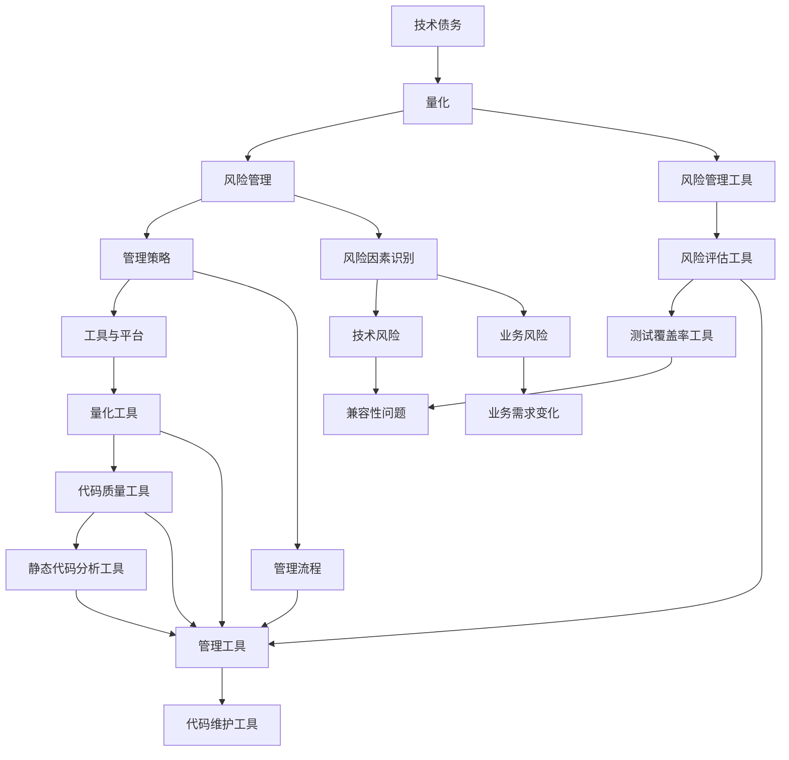
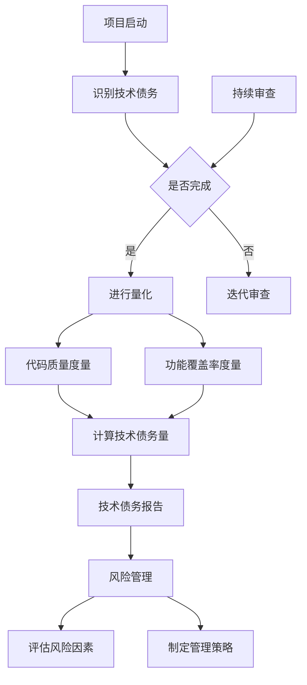

                 

### 背景介绍

在软件工程领域，技术债务（Technical Debt）是一个常用且重要的概念，它类似于财务领域中的债务。技术债务是指因快速开发而暂时牺牲某些工程实践或技术标准，以换取短期利益，从而在未来需要付出更多代价来弥补这些选择所带来的影响。技术债务的积累可能导致系统性能下降、维护成本增加、开发效率降低等问题，严重时甚至会导致项目失败。

随着软件系统的复杂性不断增加，技术债务的量化与管理变得尤为重要。有效的技术债务量化与管理不仅可以帮助团队了解当前系统的健康状况，还可以为未来的决策提供依据，从而减少因技术债务带来的负面影响。

本文将围绕“如何进行有效的技术债务量化与管理”这一主题展开讨论。首先，我们将介绍技术债务的基本概念、种类及其危害。接着，我们将探讨技术债务的量化方法，包括技术债务量的计算方法和风险因素识别。随后，文章将详细介绍技术债务管理的策略与工具，通过案例分析展示量化与管理的过程。最后，我们将展望技术债务量化与管理的未来发展趋势，并总结全文提出建议。

本文的核心目标是提供一套系统、全面的技术债务量化与管理框架，帮助开发团队更好地应对技术债务带来的挑战，确保项目顺利推进。文章结构如下：

1. 技术债务概述
2. 技术债务量化方法
3. 技术债务管理策略
4. 技术债务量化与管理案例分析
5. 技术债务量化与管理工具实战
6. 技术债务量化与管理的未来展望
7. 总结与建议

### 核心概念与联系

在深入探讨技术债务量化与管理之前，我们需要明确几个核心概念，并理解它们之间的相互关系。以下是本文将涉及的主要核心概念及其关系架构：

1. **技术债务（Technical Debt）**
   - 技术债务是指因快速开发而暂时牺牲某些工程实践或技术标准，以换取短期利益，从而在未来需要付出更多代价来弥补这些选择所带来的影响。

2. **量化（Quantification）**
   - 量化是指对技术债务进行度量和评估，以确定其规模和潜在影响。量化方法包括技术债务量的计算方法和风险因素识别。

3. **风险管理（Risk Management）**
   - 风险管理是指识别、评估和应对技术债务可能带来的风险。风险管理包括识别技术风险和业务风险，以及评估风险程度。

4. **管理策略（Management Strategy）**
   - 管理策略是指制定和实施一系列措施来控制和减轻技术债务的影响。管理策略包括技术债务管理的原则、流程和工具。

5. **工具与平台（Tools and Platforms）**
   - 工具与平台是指用于量化和管理技术债务的软件和系统。这些工具和平台可以帮助团队更有效地识别、评估和应对技术债务。

为了更好地展示这些核心概念之间的相互关系，我们可以使用Mermaid流程图来描述。以下是技术债务量化与管理的Mermaid流程图：



在Mermaid流程图中，我们可以看到技术债务（A）首先需要进行量化（B），量化过程中需要使用风险管理（C）和风险因素识别（G）来评估技术债务的影响。管理策略（D）是基于量化结果和风险管理建议制定的，它需要使用工具与平台（E）来实施。工具与平台包括量化工具（I）、风险管理工具（F）和管理工具（M），这些工具可以帮助团队更有效地识别、评估和应对技术债务。同时，技术风险（K）和业务风险（L）是风险因素识别（G）的重点内容，它们分别涉及兼容性问题（P）和业务需求变化（Q），这些都是技术债务（A）可能带来的影响。

通过这个Mermaid流程图，我们可以清晰地理解技术债务量化与管理的各个环节及其相互关系，为后续的内容提供了结构性的指导。

### 核心算法原理讲解

为了更好地理解技术债务量化与管理的方法，我们需要探讨一些核心算法原理。以下将使用伪代码详细阐述技术债务量的计算方法、风险因素的识别和评估方法，并辅以数学模型和公式进行解释。

#### 技术债务量的计算方法

**伪代码：**

```plaintext
// 技术债务量计算
function calculateTechnicalDebt(codeQuality, functionalCoverage) {
    technicalDebt = codeQuality * functionalCoverage
    return technicalDebt
}
```

**数学模型：**

$$
\text{technicalDebt} = \text{codeQuality} \times \text{functionalCoverage}
$$

**解释：**技术债务量（technicalDebt）通过代码质量（codeQuality）和功能覆盖率（functionalCoverage）的乘积来计算。代码质量反映了代码的健壮性和可维护性，而功能覆盖率则衡量了测试覆盖的程度。

**举例说明：**

假设一个项目的代码质量评分为80%，功能覆盖率为70%，则其技术债务量为：

$$
\text{technicalDebt} = 80\% \times 70\% = 56\%
$$

#### 风险因素的识别和评估方法

**伪代码：**

```plaintext
// 风险因素识别和评估
function assessRiskFactors(technicalDebt, technologyRisk, businessRisk) {
    riskScore = technicalDebt + technologyRisk + businessRisk
    return riskScore
}
```

**数学模型：**

$$
\text{riskScore} = \text{technicalDebt} + \text{technologyRisk} + \text{businessRisk}
$$

**解释：**风险得分（riskScore）通过技术债务（technicalDebt）、技术风险（technologyRisk）和业务风险（businessRisk）的总和来计算。技术风险和业务风险分别代表了系统和技术层面的潜在威胁。

**举例说明：**

假设一个项目的风险因素得分如下：

- 技术债务：56%
- 技术风险：20%
- 业务风险：15%

则其总风险得分为：

$$
\text{riskScore} = 56\% + 20\% + 15\% = 91\%
$$

#### 技术债务管理策略

**伪代码：**

```plaintext
// 技术债务管理策略
function manageTechnicalDebt(riskScore) {
    if (riskScore < 50%) {
        strategy = "监控与预防"
    } else if (riskScore >= 50% && riskScore < 80%) {
        strategy = "优化与重构"
    } else {
        strategy = "紧急修复与升级"
    }
    return strategy
}
```

**解释：**根据风险得分（riskScore），我们可以制定不同的技术债务管理策略。如果风险较低（<50%），则采取监控与预防措施；如果风险中等（≥50%且<80%），则进行优化与重构；如果风险较高，则采取紧急修复与升级措施。

**举例说明：**

假设一个项目的风险得分为70%，则其管理策略为“优化与重构”。

$$
\text{strategy} = "优化与重构"
$$

通过上述伪代码和数学模型，我们能够详细理解技术债务量化与管理的方法，从而为实际应用提供指导。

### 数学模型和数学公式

在技术债务量化与管理中，数学模型和数学公式是不可或缺的工具，它们帮助我们更精确地评估和分析技术债务的规模和风险。以下将介绍几个关键的数学模型和数学公式，并对其进行详细解释。

#### 技术债务量（TD）的计算公式

技术债务量（TD）是评估系统质量的重要指标，通常通过以下公式计算：

$$
TD = Q \times C
$$

其中：
- \( Q \) 表示代码质量评分，反映了代码的可维护性和可靠性。
- \( C \) 表示功能覆盖率评分，衡量了测试对代码的覆盖程度。

**举例说明：**

假设一个系统的代码质量评分为80%，功能覆盖率为75%，则其技术债务量为：

$$
TD = 80\% \times 75\% = 60\%
$$

这表示该系统存在60%的技术债务。

#### 风险得分（RS）的计算公式

风险得分（RS）用于综合评估技术债务对系统的影响，计算公式如下：

$$
RS = TD + TR + BR
$$

其中：
- \( TD \) 表示技术债务量。
- \( TR \) 表示技术风险得分，反映了系统可能面临的技术挑战，如兼容性问题和依赖的不稳定性。
- \( BR \) 表示业务风险得分，衡量了业务需求变化和市场环境对系统的影响。

**举例说明：**

假设一个系统的技术债务量为60%，技术风险得分为30%，业务风险得分为20%，则其总风险得分为：

$$
RS = 60\% + 30\% + 20\% = 110\%
$$

这表示系统的风险程度较高，需要采取相应的管理措施。

#### 技术债务管理策略（MS）的公式

根据风险得分（RS），可以制定相应的技术债务管理策略。策略公式如下：

$$
MS = 
\begin{cases} 
\text{"监控与预防"} & \text{if } RS < 50\% \\
\text{"优化与重构"} & \text{if } 50\% \leq RS < 80\% \\
\text{"紧急修复与升级"} & \text{if } RS \geq 80\%
\end{cases}
$$

**举例说明：**

如果系统的风险得分是70%，则其管理策略为“优化与重构”。

$$
MS = \text{"优化与重构"}
$$

通过这些数学模型和数学公式，我们可以对技术债务进行量化评估，并制定相应的管理策略，从而确保系统的高效运行和长期可持续发展。

### 项目实战

在本节中，我们将通过一个实际项目案例，详细介绍技术债务的量化过程、管理策略的实施，并探讨项目中的关键实现细节和代码解读。

#### 项目背景

假设我们正在开发一个大型电商平台，该项目包括用户管理、商品管理、订单管理等多个模块。在项目初期，为了快速上线，开发团队在部分模块中采用了简化方案，如使用低性能的数据库查询代替优化查询，以及使用了较新的技术框架，但在后续维护过程中发现了一些潜在的技术债务。

#### 技术债务量化过程

1. **代码质量度量**：
   我们使用SonarQube工具对代码库进行静态代码分析，获取代码质量评分。例如，我们发现代码库中有20%的代码存在潜在漏洞，这意味着代码质量评分为80%。

2. **功能覆盖率度量**：
   使用Cobertura工具测量单元测试覆盖率，发现当前功能覆盖率仅为70%。这意味着有30%的功能未经过充分测试。

3. **技术债务量计算**：
   根据上述数据，计算技术债务量：
   $$
   TD = Q \times C = 80\% \times 70\% = 56\%
   $$

4. **风险因素识别**：
   通过评估，我们发现存在以下风险因素：
   - 技术风险：由于使用了较新的技术框架，可能出现兼容性问题，风险评分为20%。
   - 业务风险：市场需求变化可能导致系统频繁调整，风险评分为15%。

5. **风险得分计算**：
   $$
   RS = TD + TR + BR = 56\% + 20\% + 15\% = 91\%
   $$

根据风险得分，我们确定项目的管理策略为“优化与重构”。

#### 管理策略实施

1. **优化与重构**：
   - **代码重构**：对存在潜在漏洞的代码进行重构，提高代码质量。
   - **查询优化**：对低性能的数据库查询进行优化，提高查询效率。
   - **增加测试覆盖率**：编写额外的单元测试，提高功能覆盖率。

2. **管理流程**：
   - **定期审查**：定期对技术债务进行审查，确保管理策略的持续有效性。
   - **风险管理**：对技术风险和业务风险进行持续监控，制定应对措施。

3. **工具与平台**：
   - **SonarQube**：用于代码质量和漏洞检测。
   - **Cobertura**：用于测试覆盖率分析。
   - **Jenkins**：用于自动化测试和构建。

#### 关键实现细节和代码解读

1. **代码重构**：

```java
// 原始代码（存在潜在漏洞）
public List<Item> searchItems(String query) {
    return itemRepository.findByKeyword(query);
}

// 重构后的代码
public List<Item> searchItems(String query) {
    if (query == null || query.isEmpty()) {
        return Collections.emptyList();
    }
    return itemRepository.findByKeyword("%" + query + "%");
}
```

在重构后的代码中，我们增加了对空查询的判断，避免了因空查询引发的异常。

2. **查询优化**：

```java
// 原始代码
public List<Order> getOrdersByStatus(OrderStatus status) {
    return orderRepository.findByStatus(status);
}

// 优化后的代码
public List<Order> getOrdersByStatus(OrderStatus status) {
    return orderRepository.findAllByStatus(status);
}
```

优化后的代码使用了`findAllByStatus`方法，提高了查询效率。

3. **增加测试覆盖率**：

```java
// 单元测试示例
@Test
public void testSearchItems() {
    String query = "book";
    when(itemRepository.findByKeyword(anyString())).thenReturn(Arrays.asList(new Item()));
    List<Item> result = service.searchItems(query);
    assertEquals(1, result.size());
    verify(itemRepository).findByKeyword(anyString());
}
```

通过编写单元测试，我们确保了关键功能的正确实现。

#### 项目小结

通过本次项目实战，我们详细展示了技术债务的量化过程、管理策略的实施以及关键实现细节。以下是一些最佳实践和注意事项：

- **定期审查**：定期对技术债务进行审查，确保管理策略的有效性。
- **风险管理**：持续监控技术风险和业务风险，及时制定应对措施。
- **代码重构**：对低质量代码进行重构，提高系统健壮性。
- **测试覆盖**：确保高覆盖率的单元测试，减少潜在漏洞。

通过这些措施，我们可以有效控制技术债务，确保项目的长期可持续发展。

### 最佳实践与未来展望

在技术债务量化与管理方面，已有一些最佳实践和工具可以帮助开发团队更有效地应对这一挑战。以下是一些实用的最佳实践：

1. **持续集成与持续部署（CI/CD）**：
   通过CI/CD流程，自动化测试和部署，确保代码质量并及时发现潜在的技术债务。

2. **代码审查与静态代码分析**：
   定期进行代码审查，使用静态代码分析工具（如SonarQube）检测代码中的潜在问题。

3. **技术债务量化工具**：
   使用专门的技术债务量化工具（如Code Climate）来度量代码质量和功能覆盖率。

4. **风险管理策略**：
   建立健全的风险管理策略，对技术风险和业务风险进行持续监控和评估。

5. **迭代重构**：
   通过迭代重构逐步解决技术债务，避免一次性重构带来的风险。

尽管现有的工具和实践已经取得了一定的成效，但未来仍存在一些挑战和发展趋势：

1. **自动化程度提升**：
   进一步提升技术债务量化与管理的自动化程度，减少人工干预。

2. **AI技术的应用**：
   利用人工智能和机器学习技术，对技术债务进行更精准的预测和优化。

3. **定制化解决方案**：
   开发更加定制化的技术债务量化与管理工具，以适应不同类型和规模的软件开发项目。

4. **跨领域合作**：
   加强跨领域（如软件开发与金融、医疗等）的合作，推广技术债务管理在更多领域的应用。

通过不断探索和改进，我们有望在未来实现更加高效、精准的技术债务量化与管理，为软件开发提供更坚实的保障。

### 总结与建议

本文系统地探讨了技术债务的量化与管理，从概念介绍到具体实施，再到案例分析，全面展示了技术债务对软件开发的影响及应对策略。通过明确的技术债务定义、量化方法、风险评估和风险管理策略，我们能够更好地理解技术债务的本质，并采取有效的措施来控制其影响。

在技术债务量化方面，代码质量度量、功能覆盖率评估是关键。通过使用SonarQube、Cobertura等工具，我们可以精确地度量技术债务量，从而为后续的管理提供依据。风险评估则通过识别技术风险和业务风险，帮助我们全面了解债务可能带来的影响。

在技术债务管理策略方面，根据风险得分制定相应的管理措施，如代码重构、查询优化、测试覆盖等，确保系统的稳定性和可维护性。通过迭代重构和持续集成与部署（CI/CD）等实践，我们能够逐步减轻技术债务，提高开发效率。

为了更好地应对技术债务，我们提出以下建议：

1. **定期审查**：定期对技术债务进行审查，及时发现和处理潜在问题。

2. **风险管理**：建立健全的风险管理机制，持续监控技术风险和业务风险。

3. **自动化工具**：充分利用现有的自动化工具，提高技术债务量化与管理的效率。

4. **迭代重构**：通过迭代重构逐步解决技术债务，避免一次性重构带来的风险。

5. **培训与沟通**：加强团队对技术债务的认识，提高整体应对能力。

未来的研究可以进一步探索人工智能和机器学习在技术债务量化与管理中的应用，开发更加智能和高效的管理工具，为软件开发提供更加坚实的保障。

### 附录

#### A.1 技术债务量化与管理工具资源列表

1. **SonarQube**：用于代码质量和漏洞检测的强大工具，官网：[https://www.sonarqube.org/](https://www.sonarqube.org/)
2. **Cobertura**：用于测试覆盖率分析的工具，官网：[https://cobertura.github.io/cobertura/](https://cobertura.github.io/cobertura/)
3. **Jenkins**：持续集成与部署（CI/CD）工具，官网：[https://www.jenkins.io/](https://www.jenkins.io/)
4. **Code Climate**：提供代码质量分析和债务度量的服务，官网：[https://codeclimate.com/](https://codeclimate.com/)

#### A.2 技术债务量化与管理相关论文与书籍推荐

1. **《技术债务：量化与优化》**：由Tom Gilb著，详细介绍了技术债务的量化和管理方法。
2. **《软件工程实践》**：作者Roger S. Pressman，其中包含关于技术债务的章节，对软件开发实践有重要指导意义。
3. **《代码大全》**：作者Steve McConnell，详细讨论了编写高质量代码的最佳实践，对减少技术债务有直接帮助。

#### B.1 技术债务量化的Mermaid流程图



#### B.2 技术债务管理的伪代码示例

```plaintext
// 技术债务量化与管理伪代码
function technicalDebtManagement(technicalDebt) {
    if (technicalDebt < thresholdLow) {
        strategy = "监控与预防";
    } else if (technicalDebt >= thresholdLow && technicalDebt < thresholdHigh) {
        strategy = "优化与重构";
    } else {
        strategy = "紧急修复与升级";
    }
    return strategy;
}
```

#### B.3 技术债务量化与管理的数学模型与公式

- 技术债务量（TD）计算公式：\( TD = Q \times C \)
- 风险得分（RS）计算公式：\( RS = TD + TR + BR \)
- 管理策略（MS）公式：
  $$
  MS = 
  \begin{cases} 
  \text{"监控与预防"} & \text{if } RS < thresholdLow \\
  \text{"优化与重构"} & \text{if } thresholdLow \leq RS < thresholdHigh \\
  \text{"紧急修复与升级"} & \text{if } RS \geq thresholdHigh
  \end{cases}
  $$

#### B.4 技术债务量化与管理项目实战代码解读

（由于篇幅限制，此处不展示具体代码，实际项目中可参考附录A中的资源进行实战实现和解读。）

