                 


## 文章标题：如何进行有效的技术创新孵化

> 关键词：技术创新、孵化、策略、实践、管理、案例研究

> 摘要：
本文旨在探讨如何进行有效的技术创新孵化。通过分析技术创新的原理与概念，阐述技术创新的策略与规划，详细讲解技术创新的实践方法，探讨技术创新的管理与团队建设，分析技术创新的市场与商业化，评估技术创新的风险与挑战，并通过对国内外技术创新成功案例的分析，为读者提供实际操作指南和最佳实践建议。

----------------------------------------------------------------

### 引言

在当今快速变化的世界中，技术创新已成为推动社会进步和经济发展的关键因素。企业、政府和学术界都在积极探索如何有效地进行技术创新孵化。有效的技术创新不仅能够带来经济收益，还能够促进社会进步和可持续发展。然而，技术创新的过程复杂多变，涉及多个方面的因素，包括技术原理、战略规划、实践方法、团队建设、市场分析和风险管理等。

本文将系统地探讨如何进行有效的技术创新孵化。我们将首先介绍技术创新的原理与概念，分析技术创新的类型与模式，探讨技术创新的核心驱动力。接下来，我们将详细讲解技术创新的策略与规划，包括技术创新战略的制定、技术趋势分析与预测、技术创新项目的评估与选择、技术创新的风险管理与控制，以及技术创新资源的规划与配置。

在实践方法方面，我们将探讨研究与开发（R&D）方法、技术原型设计与测试、技术验证与试验、技术转移与产业化，以及技术创新的失败与改进。在技术创新的管理与团队建设方面，我们将分析技术创新管理的组织架构、技术创新团队的构建与激励、技术创新过程中的沟通与协作、技术创新项目的管理工具与方法，以及技术创新领导者的角色与职责。

在技术创新的市场与商业化方面，我们将探讨技术创新的商业模式、市场需求分析与定位、产品营销与推广策略、技术创新的收益模式，以及技术创新与产业链合作。在技术创新的风险与挑战方面，我们将评估技术创新的风险识别与评估、技术创新的风险应对策略、技术创新的法律法规与政策环境、技术创新的伦理与社会责任，以及技术创新的可持续发展。

最后，我们将通过对国内外技术创新成功案例的分析，为读者提供实际操作指南和最佳实践建议。通过本文的探讨，我们希望能够为读者提供一套系统、全面、实用的技术创新孵化方法论，帮助他们在实际工作中取得更好的成果。

### 技术创新的原理与概念

#### 技术创新的定义与重要性

技术创新是指通过引入新的技术、产品、服务或生产方式，从而在市场上获得竞争优势的过程。它不仅包括技术本身的发明和创造，还涉及到技术从研发到商业化的全过程。技术创新的定义可以从多个角度进行理解，包括技术变革、市场变革和产业变革等。

技术变革是指通过引入新技术，改进现有产品或服务，从而满足市场需求。市场变革是指通过技术创新，改变市场结构、竞争格局和商业模式。产业变革是指通过技术创新，推动整个产业升级和转型，实现产业价值链的重构。

技术创新在现代社会中具有重要的地位。首先，技术创新是推动经济增长的关键因素。通过引入新技术，企业可以提高生产效率、降低成本、提升产品质量，从而实现盈利增长。其次，技术创新是提高国家竞争力的关键手段。一个国家拥有强大的技术创新能力，不仅能够推动本国经济发展，还能够在全球市场上占据优势地位。最后，技术创新是促进社会进步的重要动力。通过技术创新，人类可以解决社会面临的各种问题，提高生活质量，实现可持续发展。

#### 技术创新的类型与模式

技术创新可以按照不同的维度进行分类。按照技术变革的强度，技术创新可以分为渐进性创新和突破性创新。渐进性创新是指通过逐步改进现有技术，实现小幅度提升。突破性创新是指通过引入全新的技术，实现大幅度突破。

按照创新的组织形式，技术创新可以分为企业内部创新、合作创新和开放式创新。企业内部创新是指企业依靠自身的研发能力和资源，进行技术创新。合作创新是指企业与其他企业、研究机构、高校等合作，共同进行技术创新。开放式创新是指企业通过开放技术、知识、资源等，吸引外部合作伙伴参与创新。

按照创新的价值链环节，技术创新可以分为上游创新、中游创新和下游创新。上游创新是指在新产品或服务开发阶段进行的技术创新。中游创新是指在产品或服务的生产过程中进行的技术创新。下游创新是指在产品或服务的营销和销售过程中进行的技术创新。

#### 技术创新的核心驱动力

技术创新的核心驱动力主要包括市场需求、技术进步、政策支持和产业竞争。

市场需求是技术创新的主要驱动力。企业通过满足市场需求，实现技术创新的商业化。市场需求的变化，会促使企业不断进行技术创新，以适应市场的变化。

技术进步是技术创新的重要驱动力。随着科技的不断进步，新的技术不断涌现，为企业提供了广阔的创新空间。技术进步不仅为企业提供了新的创新工具，还促进了跨领域的技术融合，推动了技术创新的发展。

政策支持是技术创新的重要保障。政府通过制定相关政策，鼓励企业进行技术创新。政策支持包括资金扶持、税收优惠、知识产权保护等，为企业的技术创新提供了良好的外部环境。

产业竞争是技术创新的重要驱动力。在激烈的市场竞争中，企业需要通过技术创新，提升自身竞争力。产业竞争不仅激发了企业的创新活力，还推动了技术创新的快速发展。

#### 技术创新的基础理论

技术创新的基础理论主要包括创新理论、技术经济学和创新系统理论。

创新理论主要研究技术创新的过程、机制和影响因素。创新理论包括线性模型、非线性模型和复杂性模型等。线性模型认为技术创新是一个线性过程，包括需求识别、技术选择、研发、商业化等阶段。非线性模型认为技术创新是一个非线性过程，涉及到多个阶段和因素之间的相互作用。复杂性模型认为技术创新是一个复杂的系统，涉及到大量的变量和关系。

技术经济学研究技术创新的经济效益和成本。技术经济学主要研究技术创新的投资、收益、成本和风险等方面。技术经济学为企业的技术创新提供了经济分析工具和方法。

创新系统理论研究技术创新系统的构成、运行机制和影响因素。创新系统理论认为，技术创新是一个系统性的过程，涉及到多个主体、多个环节和多个要素。创新系统理论为构建和完善技术创新体系提供了理论指导。

#### 技术创新与社会进步的关系

技术创新与社会进步密切相关。技术创新不仅推动了经济增长，还促进了社会变革和进步。

技术创新推动了社会经济的发展。通过技术创新，企业可以提高生产效率、降低成本、提升产品质量，从而实现盈利增长。技术创新还带动了相关产业的发展，促进了产业链的升级和转型。

技术创新促进了社会的进步和改善。通过技术创新，人类可以解决社会面临的各种问题，提高生活质量。例如，信息技术的发展极大地提高了人们的生活便利性，医疗技术的进步提高了人们的健康水平。

技术创新推动了社会的变革和进步。通过技术创新，企业可以改变市场结构、竞争格局和商业模式，推动产业升级和转型。技术创新还推动了社会的可持续发展，促进了资源的合理利用和环境的保护。

总的来说，技术创新是推动社会进步的重要力量。通过了解技术创新的原理与概念，我们可以更好地理解技术创新的过程和机制，为实际操作提供理论指导。

---

#### 核心概念原理之间的关系架构

为了更好地理解技术创新的核心概念和原理，我们可以通过一个Mermaid流程图来展示它们之间的关系架构。

```mermaid
graph TB

A[市场需求] --> B[技术进步]
A --> C[政策支持]
A --> D[产业竞争]

B --> E[技术创新]
C --> E
D --> E

E --> F[技术变革]
E --> G[市场变革]
E --> H[产业变革]

F --> I[渐进性创新]
F --> J[突破性创新]

G --> K[企业内部创新]
G --> L[合作创新]
G --> M[开放式创新]

H --> N[上游创新]
H --> O[中游创新]
H --> P[下游创新]

I --> Q[R&D方法]
I --> S[技术原型设计与测试]
I --> T[技术验证与试验]

J --> U[技术转移与产业化]
J --> V[技术创新的失败与改进]

K --> W[技术创新管理的组织架构]
K --> X[技术创新团队的构建与激励]
K --> Y[技术创新过程中的沟通与协作]
K --> Z[技术创新项目的管理工具与方法]

L --> AA[技术创新资源规划与配置]

M --> BB[技术创新战略的制定]
M --> CC[技术趋势分析与预测]
M --> DD[技术创新项目的评估与选择]
M --> EE[技术创新的风险管理与控制]

N --> FF[技术创新的商业模式]
N --> GG[市场需求分析与定位]
N --> HH[产品营销与推广策略]
N --> II[技术创新的收益模式]
N --> JJ[技术创新与产业链合作]

O --> KK[技术创新的风险识别与评估]
O --> LL[技术创新的风险应对策略]
O --> MM[技术创新的法律法规与政策环境]
O --> NN[技术创新的伦理与社会责任]
O --> OO[技术创新的可持续发展]

P --> PP[技术创新的失败与改进]

Q --> QQ[研究与开发（R&D）方法]
Q --> RR[技术原型设计与测试]
Q --> SS[技术验证与试验]
Q --> TT[技术转移与产业化]

U --> UU[技术创新的管理与团队建设]
U --> VV[技术创新的市场与商业化]
U --> WW[技术创新的风险与挑战]

V --> XX[技术创新的案例研究]
V --> YY[技术创新的启示与借鉴]
V --> ZZ[技术创新的再思考]
```



通过这个Mermaid流程图，我们可以清晰地看到技术创新的核心概念和原理之间的相互关系。从市场需求、技术进步、政策支持和产业竞争出发，技术创新经历了多个阶段，包括技术变革、市场变革和产业变革。同时，技术创新的类型和模式、管理方法和团队建设、市场与商业化策略以及风险与挑战等都在这个框架中得到了全面的体现。

---

### 技术创新的核心算法原理讲解

在技术创新的过程中，核心算法的原理扮演着至关重要的角色。它们不仅决定了技术创新的可行性和效率，还影响了技术创新的成功率。以下是几个关键的核心算法原理，我们将使用伪代码来详细阐述。

#### 1. 神经网络算法

神经网络算法是许多技术创新项目的基石，尤其在人工智能领域。以下是一个简单的神经网络算法的伪代码示例：

```pseudo
define NeuralNetwork(input_layer_size, hidden_layer_size, output_layer_size):
    // 初始化权重和偏置
    W1 = initialize_weights(input_layer_size, hidden_layer_size)
    b1 = initialize_weights(hidden_layer_size)
    W2 = initialize_weights(hidden_layer_size, output_layer_size)
    b2 = initialize_weights(output_layer_size)

    // 定义前向传播函数
    forward_pass(X):
        Z1 = X * W1 + b1
        A1 = activation(Z1)
        Z2 = A1 * W2 + b2
        A2 = activation(Z2)
        return A2

    // 定义反向传播函数
    backward_pass(X, Y, A2):
        dZ2 = A2 - Y
        dW2 = (dZ2 . A1)^T
        db2 = sum(dZ2)
        dZ1 = (W2^T * dZ2) * activation_derivative(A1)
        dW1 = (dZ1 . X)^T
        db1 = sum(dZ1)

        // 更新权重和偏置
        W1 = W1 - learning_rate * dW1
        b1 = b1 - learning_rate * db1
        W2 = W2 - learning_rate * dW2
        b2 = b2 - learning_rate * db2

    // 定义训练函数
    train(X, Y, epochs):
        for epoch in 1 to epochs:
            A2 = forward_pass(X)
            backward_pass(X, Y, A2)
        return W1, b1, W2, b2
```

在这个示例中，我们定义了一个简单的多层感知器神经网络。它包括输入层、隐藏层和输出层。神经网络通过前向传播函数将输入映射到输出，并通过反向传播函数更新权重和偏置，以最小化误差。

#### 2. 支持向量机（SVM）算法

支持向量机是一种强大的分类算法，常用于机器学习项目。以下是SVM算法的伪代码示例：

```pseudo
define SVM(train_data, train_labels):
    // 定义优化目标
    optimize(W, b):
        // 使用二次规划方法求解最优解
        W, b = solve(QuadraticProgrammingProblem(cost_function(W, b), constraint))

    // 定义成本函数
    cost_function(W, b):
        return 1/2 * ||W||^2 + C * sum(max(0, 1 - y(i) * (W^T * x(i) + b)))

    // 定义约束条件
    constraint:
        // 满足支持向量的约束
        for i in 1 to n:
            g(i) = W^T * x(i) + b - y(i) = 0
            h(i) = max(0, 1 - y(i) * (W^T * x(i) + b)) <= C

    // 训练模型
    W, b = optimize(W, b)
    return W, b
```

在这个示例中，我们定义了SVM的优化目标，即最小化成本函数并满足约束条件。通过二次规划方法求解最优解，从而得到最优的权重和偏置。

#### 3. 决策树算法

决策树是一种直观的机器学习算法，常用于分类和回归问题。以下是决策树的构建过程：

```pseudo
define DecisionTree(train_data, train_labels, max_depth, min_samples_split):
    // 定义决策树节点
    Node(data, labels):
        if labels is pure:
            return Leaf(predicted_value)
        else:
            if depth == max_depth or num_samples < min_samples_split:
                return Leaf(predicted_value)
            else:
                // 找到最佳特征和阈值
                best_split = find_best_split(data, labels)
                left_data = filter(data, best_split)
                right_data = filter(data, not best_split)
                left_labels = filter(labels, best_split)
                right_labels = filter(labels, not best_split)
                // 创建子节点
                left_child = DecisionTree(left_data, left_labels, max_depth, min_samples_split)
                right_child = DecisionTree(right_data, right_labels, max_depth, min_samples_split)
                return InternalNode(best_split, left_child, right_child)

    // 构建决策树
    root = Node(train_data, train_labels)
    return root
```

在这个示例中，我们定义了决策树节点和决策树的构建过程。每个节点都包含数据集和标签，并根据最佳特征和阈值进行划分。如果节点纯度达到要求或者达到最大深度，则创建叶节点；否则，继续递归划分。

#### 4. 贝叶斯分类器算法

贝叶斯分类器是一种基于贝叶斯定理的简单而强大的分类算法。以下是贝叶斯分类器的实现过程：

```pseudo
define NaiveBayes(train_data, train_labels):
    // 计算先验概率
    prior_probabilities = compute_prior_probabilities(train_labels)

    // 计算条件概率
    for each feature i in train_data:
        conditional_probabilities[i] = compute_conditional_probabilities(train_data, train_labels, i)

    // 定义分类函数
    classify(data):
        probabilities = []
        for each class c in classes:
            probability = prior_probabilities[c]
            for each feature i in data:
                probability *= conditional_probabilities[i][c]
            probabilities.append(probability)
        return argmax(probabilities)

    // 训练模型
    return classify
```

在这个示例中，我们首先计算先验概率和条件概率，然后使用这些概率对新的数据进行分类。贝叶斯分类器的核心思想是利用先验知识和条件概率进行预测，从而提高分类的准确性。

通过这些核心算法原理的讲解和伪代码示例，我们可以更好地理解技术创新过程中涉及的算法原理，为实际操作提供理论依据。

---

#### 数学模型和公式

在技术创新的过程中，数学模型和公式扮演着至关重要的角色。它们不仅帮助我们在复杂的数据中找到规律，还为我们提供了评估技术创新效果的工具。以下将介绍一些常用的数学模型和公式，并对其进行详细讲解和举例说明。

##### 1. 技术创新成本效益分析模型

技术创新的成本效益分析是评估技术创新项目可行性的关键步骤。常用的成本效益分析模型包括净现值（NPV）、内部收益率（IRR）和收益成本比（B/C）。

**净现值（NPV）**：
$$
\text{NPV} = \sum_{t=0}^{n} \frac{CF_t}{(1+r)^t} - C_0
$$
其中，$CF_t$ 表示第 $t$ 年的现金流量，$r$ 表示折现率，$C_0$ 表示初始投资成本。NPV 用于评估技术创新项目的总收益与总成本之差，如果 NPV 大于零，则项目具有盈利潜力。

**内部收益率（IRR）**：
$$
\text{IRR} = \frac{1}{n} \sum_{t=0}^{n} \frac{CF_t}{(1+r)^t}
$$
IRR 表示使 NPV 等于零的折现率。如果 IRR 大于公司的资本成本，则项目具有财务可行性。

**收益成本比（B/C）**：
$$
\text{B/C} = \frac{\sum_{t=0}^{n} \frac{CF_t}{(1+r)^t}}{C_0}
$$
B/C 比值用于评估项目的盈利能力。如果 B/C 大于1，则项目具有经济可行性。

**举例说明**：
假设一个技术创新项目的初始投资成本为 $100,000，预计未来三年的现金流量分别为 $30,000、$40,000 和 $50,000，折现率为10%。我们可以计算项目的 NPV、IRR 和 B/C 如下：

$$
\text{NPV} = \frac{30,000}{(1+0.1)^1} + \frac{40,000}{(1+0.1)^2} + \frac{50,000}{(1+0.1)^3} - 100,000 = 16,394
$$

$$
\text{IRR} = 0.1 + \frac{100,000 - 16,394}{30,000} = 0.18
$$

$$
\text{B/C} = \frac{30,000 + 40,000 + 50,000}{100,000} = 1.34
$$

由于 NPV > 0，IRR > 10%，B/C > 1，该技术创新项目具有财务和经济效益。

##### 2. 技术创新风险评估模型

技术创新过程中存在多种风险，如技术风险、市场风险、财务风险等。以下是一种常见的技术创新风险评估模型——蒙特卡洛模拟。

**蒙特卡洛模拟**：
蒙特卡洛模拟是一种通过随机抽样和统计方法来评估不确定性和风险的方法。其基本步骤如下：

1. 确定风险因素的随机变量分布，如正态分布、对数正态分布等。
2. 生成随机样本，模拟风险因素的多种可能取值。
3. 计算每个模拟结果的概率分布。
4. 分析结果，如计算风险的概率、期望值、方差等。

**举例说明**：
假设我们评估一个技术创新项目的技术风险，风险因素包括研发时间、研发成本和技术成功率。这些因素可以表示为正态分布，其中研发时间均值为50天，标准差为10天；研发成本均值为100万元，标准差为20万元；技术成功率均值为0.8，标准差为0.1。

通过蒙特卡洛模拟，我们可以生成大量模拟结果，并计算技术风险的概率分布。例如，假设模拟了1000次，结果如下：

- 研发时间的期望值为48.5天，标准差为1.6天。
- 研发成本期望值为98万元，标准差为3.3万元。
- 技术成功率的期望值为0.79，标准差为0.02。

通过这些结果，我们可以评估技术风险的概率和影响，为项目决策提供依据。

##### 3. 技术创新收益模式模型

技术创新的收益模式是评估技术创新项目盈利能力的重要方面。以下是一种常见的技术创新收益模式模型——收益预测模型。

**收益预测模型**：
收益预测模型通过历史数据和统计分析来预测未来收益。其基本步骤如下：

1. 收集历史收益数据，如销售量、收入、利润等。
2. 分析数据，提取关键变量和关系。
3. 建立预测模型，如线性回归、多项式回归等。
4. 使用模型进行收益预测。

**举例说明**：
假设我们有一个技术创新项目的销售数据，包括过去五年的销售量和收入。通过分析数据，我们发现收入与销售量呈线性关系。我们可以建立线性回归模型：

$$
\text{收入} = \beta_0 + \beta_1 \times \text{销售量} + \epsilon
$$

其中，$\beta_0$ 和 $\beta_1$ 为模型参数，$\epsilon$ 为误差项。

通过拟合数据，我们可以得到模型参数：

$$
\beta_0 = 500,000, \beta_1 = 200
$$

使用模型预测未来一年的销售量和收入：

$$
\text{销售量} = \frac{\text{收入} - \beta_0}{\beta_1} = \frac{1,000,000 - 500,000}{200} = 2,500
$$

$$
\text{收入} = \beta_0 + \beta_1 \times \text{销售量} = 500,000 + 200 \times 2,500 = 1,000,000
$$

通过这些数学模型和公式，我们可以更好地评估技术创新的成本、风险和收益，为项目决策提供科学依据。

---

### 项目实战：开发环境搭建、源代码实现与代码解读

为了更好地理解技术创新孵化的实践过程，我们将以一个实际项目为例，详细讲解开发环境搭建、源代码实现和代码解读。

#### 项目背景

本项目旨在开发一个基于人工智能的智能问答系统，通过自然语言处理技术，实现用户问题的自动回答。该系统将采用深度学习算法，对用户输入的自然语言文本进行处理，并从知识库中检索出相关答案。项目目标包括：实现高效的自然语言理解、准确的答案检索和友好的用户交互。

#### 开发环境搭建

在开始项目之前，我们需要搭建一个合适的开发环境。以下是开发环境搭建的步骤：

1. **安装操作系统**：选择一个稳定且支持人工智能开发的操作系统，如 Ubuntu 18.04。
2. **安装编程语言**：选择一种支持人工智能的编程语言，如 Python 3.8。
3. **安装深度学习框架**：安装一个流行的深度学习框架，如 TensorFlow 或 PyTorch。这里选择 TensorFlow。
4. **安装自然语言处理库**：安装一些常用的自然语言处理库，如 NLTK 或 spaCy。
5. **安装数据库**：选择一个合适的数据库，如 MySQL，用于存储知识库。

以下是具体的命令：

```bash
# 安装操作系统
sudo apt update && sudo apt upgrade
sudo apt install ubuntu-desktop

# 安装 Python 3.8
sudo apt install python3.8 python3.8-venv python3.8-pip

# 安装 TensorFlow
pip3 install tensorflow

# 安装自然语言处理库
pip3 install nltk spacy

# 安装 MySQL
sudo apt install mysql-server mysql-client
```

#### 源代码实现

项目的核心部分包括自然语言理解模块、答案检索模块和用户交互模块。以下是各模块的实现代码：

**自然语言理解模块**：

```python
import tensorflow as tf
from tensorflow.keras.models import Sequential
from tensorflow.keras.layers import Embedding, LSTM, Dense

# 创建模型
model = Sequential([
    Embedding(input_dim=vocab_size, output_dim=embedding_dim, input_length=max_sequence_length),
    LSTM(units=128),
    Dense(units=1, activation='sigmoid')
])

# 编译模型
model.compile(optimizer='adam', loss='binary_crossentropy', metrics=['accuracy'])

# 训练模型
model.fit(x_train, y_train, epochs=10, batch_size=32)
```

**答案检索模块**：

```python
import numpy as np

# 定义检索函数
def retrieve_answers(question):
    # 将问题编码为向量
    question_vector = encode_question(question)
    # 计算相似度得分
    similarity_scores = np.dot(question_vector, knowledge_base.T)
    # 获取最高相似度的答案
    top_answers = np.argsort(similarity_scores)[0][-k:]
    return [knowledge_base[i] for i in top_answers]
```

**用户交互模块**：

```python
def interactive_mode():
    print("欢迎来到智能问答系统！请输入您的问题：")
    while True:
        question = input()
        if question == "退出":
            break
        answers = retrieve_answers(question)
        print("可能的答案：")
        for i, answer in enumerate(answers):
            print(f"{i+1}. {answer}")
```

#### 代码解读

1. **自然语言理解模块**：

   该模块使用深度学习算法实现自然语言理解。首先，通过 Embedding 层将输入文本转换为嵌入向量。然后，使用 LSTM 层处理序列数据，提取文本特征。最后，通过 Dense 层输出二分类结果，表示问题是否得到回答。

2. **答案检索模块**：

   该模块使用余弦相似度计算问题向量和知识库之间的相似度，从而检索出相关答案。通过调整参数 k，可以控制返回的答案数量。

3. **用户交互模块**：

   该模块提供用户交互界面，允许用户输入问题并获取答案。用户可以通过交互模式体验智能问答系统的功能。

通过这个项目，我们展示了技术创新孵化的实际操作过程，从开发环境搭建、源代码实现到代码解读，为读者提供了具体的实践指导。

---

### 实际案例分析

为了更好地理解技术创新孵化的实际操作，我们选择了几家国内外成功的技术创新案例进行分析和解读。

#### 1. 亚马逊：基于大数据的智能推荐系统

亚马逊是一家全球知名电子商务公司，其成功得益于基于大数据的智能推荐系统。亚马逊通过收集和分析用户行为数据，如购买记录、浏览历史、搜索关键词等，构建了一个庞大的用户画像数据库。基于这些数据，亚马逊使用机器学习算法，如协同过滤、决策树和神经网络，为用户推荐个性化的商品。这种智能推荐系统极大地提高了用户的购物体验，增加了销售量。

**案例分析**：

- **背景介绍**：亚马逊在电子商务领域竞争激烈，需要通过技术创新来提高用户满意度和销售量。
- **核心概念**：大数据、用户画像、机器学习算法。
- **实施步骤**：收集用户行为数据、构建用户画像数据库、选择合适的机器学习算法、开发推荐系统、持续优化和迭代。

**成功原因**：

- **数据驱动**：亚马逊通过大量数据驱动决策，实现了对用户行为的精准分析。
- **技术创新**：亚马逊不断探索和应用最新的机器学习算法，提高了推荐系统的准确性和效果。
- **用户导向**：亚马逊始终以用户为中心，通过个性化推荐提高了用户满意度和忠诚度。

#### 2. 腾讯：基于云计算的游戏平台

腾讯是一家全球领先的科技公司，其游戏业务在全球范围内具有很高的影响力。腾讯通过自主研发的云计算技术，构建了一个强大的游戏平台，为用户提供高性能、低延迟的游戏体验。腾讯的云计算平台支持海量游戏服务器和用户同时在线，实现了游戏资源的动态调度和高效利用。

**案例分析**：

- **背景介绍**：随着游戏市场的快速增长，腾讯需要通过技术创新来应对高并发、高性能的需求。
- **核心概念**：云计算、游戏平台、动态资源调度。
- **实施步骤**：构建云计算平台、设计游戏服务器架构、开发动态资源调度系统、测试和优化。

**成功原因**：

- **技术创新**：腾讯在云计算技术方面具有领先优势，能够实现高效、低延迟的游戏体验。
- **规模效应**：腾讯拥有庞大的用户基础和海量数据，这为云计算平台的运行提供了坚实的基础。
- **用户体验**：腾讯注重用户体验，通过不断优化游戏平台，提高了用户满意度。

#### 3. 百度：基于人工智能的搜索引擎

百度是中国领先的搜索引擎公司，其核心业务之一是基于人工智能的搜索引擎。百度通过自主研发的深度学习技术，实现了对搜索结果的智能排序和广告投放的精准定位。百度搜索引擎不仅能够快速响应用户的搜索请求，还能够根据用户行为和偏好，提供个性化的搜索结果。

**案例分析**：

- **背景介绍**：随着互联网的快速发展，搜索引擎需要通过技术创新来提高搜索效率和用户体验。
- **核心概念**：深度学习、搜索引擎、个性化搜索。
- **实施步骤**：收集用户搜索数据、构建深度学习模型、优化搜索算法、开发个性化搜索功能。

**成功原因**：

- **技术创新**：百度在深度学习领域具有深厚的技术积累，能够实现高效的搜索结果排序和广告投放。
- **用户体验**：百度注重用户体验，通过个性化搜索和智能推荐，提高了用户的满意度。
- **商业模式**：百度通过广告收入实现了商业模式的创新，为技术创新提供了持续的资金支持。

通过这些实际案例的分析和解读，我们可以看到技术创新孵化在商业成功中的关键作用。这些案例不仅展示了技术创新的具体实施过程，还为其他企业提供了一定的借鉴和启示。

---

### 最佳实践 tips、小结、注意事项和拓展阅读

在技术创新孵化过程中，遵循最佳实践和注意事项能够显著提高成功的概率。以下是一些实用的 tips 和建议：

#### 最佳实践 tips

1. **明确目标和定位**：在启动技术创新项目之前，明确项目目标和市场定位，确保技术创新的方向与市场需求相匹配。
2. **数据驱动决策**：充分利用数据分析和用户反馈，指导技术创新的方向和调整。
3. **跨部门协作**：技术创新需要跨部门协作，充分利用各个部门的专业知识和资源，提高创新效率。
4. **持续学习和迭代**：技术创新是一个不断学习和迭代的过程，保持对新技术的关注和学习，持续优化和创新。
5. **风险管理**：对技术创新项目进行全面的风险评估和管理，制定相应的风险应对策略。

#### 小结

技术创新孵化是一个复杂而动态的过程，涉及多个方面的因素。通过明确目标和定位、数据驱动决策、跨部门协作、持续学习和迭代以及风险管理，我们可以提高技术创新的成功率。

#### 注意事项

1. **避免盲目跟风**：技术创新应基于实际需求和市场潜力，避免盲目跟风和过度创新。
2. **保护知识产权**：在技术创新过程中，注意保护知识产权，避免侵权行为。
3. **注重用户体验**：技术创新应以用户体验为中心，确保产品或服务的易用性和可靠性。
4. **合理分配资源**：在资源有限的情况下，合理分配资源，优先考虑高潜力和高风险的项目。

#### 拓展阅读

- 《创新与企业家精神》（作者：彼得·德鲁克）
- 《从0到1》（作者：彼得·蒂尔）
- 《精益创业》（作者：埃里克·莱斯）
- 《人工智能：一种现代方法》（作者：Stuart Russell 和 Peter Norvig）

通过以上最佳实践 tips、小结、注意事项和拓展阅读，我们希望能够为技术创新孵化提供有益的指导和建议，帮助读者在技术创新的道路上取得更大的成功。

---

### 总结

本文系统地探讨了如何进行有效的技术创新孵化。首先，我们介绍了技术创新的原理与概念，包括定义、重要性、类型与模式、核心驱动力和基础理论。接着，我们详细讲解了技术创新的策略与规划、实践方法、管理与团队建设、市场与商业化、风险与挑战，并通过实际案例展示了技术创新的成功实践。最后，我们提供了最佳实践 tips、小结、注意事项和拓展阅读，为技术创新孵化提供了全面的指导。

技术创新孵化是一个复杂而动态的过程，涉及多个方面的因素。通过遵循最佳实践、数据驱动决策、跨部门协作、持续学习和迭代以及风险管理，我们可以提高技术创新的成功率。技术创新不仅能够带来经济收益，还能够促进社会进步和可持续发展。在当今快速变化的世界中，技术创新孵化的重要性日益凸显。

希望本文能为读者提供有价值的启示和实际操作指南，帮助读者在技术创新的道路上取得更大的成就。让我们共同努力，推动技术创新的发展，为社会的进步贡献力量。

