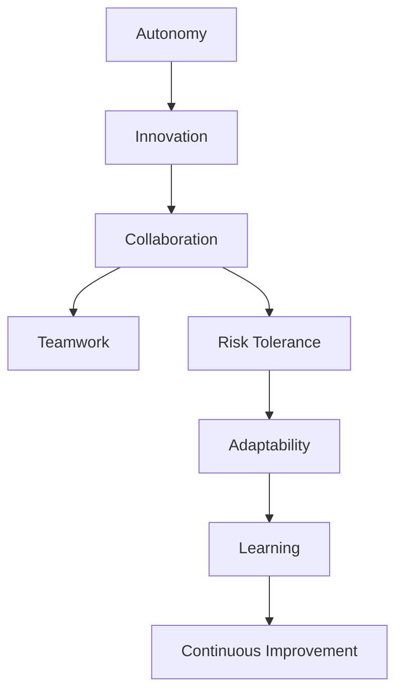
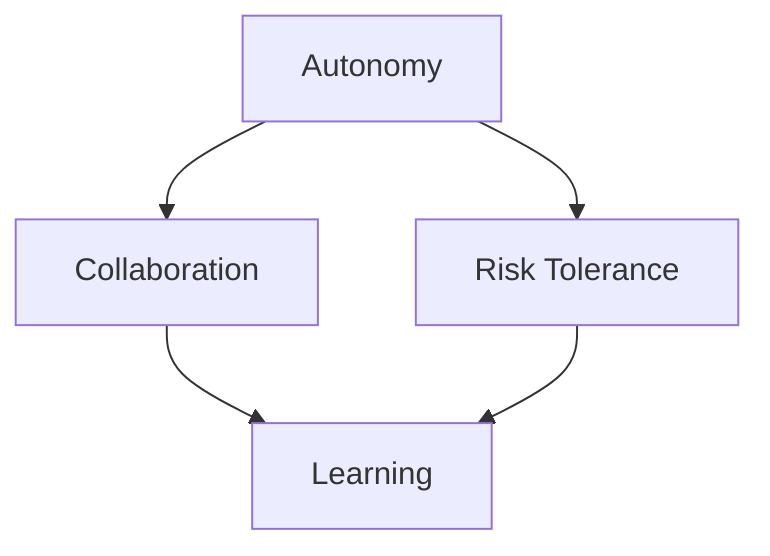

                 

**Step 1: Background Introduction**

Technological innovation culture refers to the collective mindset, values, and practices that promote and sustain innovation within an organization. It is the environment where creativity, collaboration, and learning are encouraged, and where risks are tolerated as part of the innovation process. In today's fast-paced and competitive business landscape, the importance of fostering an effective technological innovation culture cannot be overstated. Companies that excel in innovation tend to outperform their peers, drive growth, and maintain a competitive edge in the market.

The need for an effective technological innovation culture has been further emphasized by the rapid advancement of technology. With the emergence of new technologies such as artificial intelligence, machine learning, blockchain, and the Internet of Things, businesses are increasingly relying on innovation to stay relevant and capture new opportunities. However, fostering a culture that embraces innovation is not a one-size-fits-all approach. It requires a deep understanding of the organization's unique context, goals, and challenges.

**Step 2: Core Concepts and Relationships**

To build a robust technological innovation culture, it is essential to understand the core concepts and their interrelationships. These core concepts include autonomy, collaboration, risk tolerance, and continuous learning.

**Mermaid Flowchart: Core Concepts of Technological Innovation Culture**



**Pseudo-Code: Core Algorithm Principles**

```python
# Pseudo-Code: Innovation Culture Building Algorithm
def BuildInnovationCulture(organization):
    # Step 1: Establish a vision for innovation
    SetVision(organization)

    # Step 2: Foster a culture of autonomy
    EncourageAutonomy(organization)

    # Step 3: Promote collaboration and teamwork
    FosterCollaboration(organization)

    # Step 4: Cultivate risk tolerance
    CultivateRiskTolerance(organization)

    # Step 5: Encourage continuous learning
    PromoteContinuousLearning(organization)

    # Step 6: Monitor and adapt
    MonitorInnovationCulture(organization)
    AdaptAsNecessary(organization)
```

**Mathematical Model and Explanation**

To assess the effectiveness of an innovation culture, a mathematical model can be used. Let \(C\) represent the overall innovation culture score, which is a function of the individual components:

$$C = f(A, B, C, D, E, F, G, H)$$

Where:
- \(A\) is the degree of autonomy.
- \(B\) is the level of innovation.
- \(C\) is the extent of collaboration and teamwork.
- \(D\) is the degree of risk tolerance.
- \(E\) is the adaptability to change.
- \(F\) is the level of continuous learning.
- \(G\) and \(H\) are the continuous improvement mechanisms.

The model can be further expanded to include specific metrics for each component. For example:

$$A = f(AutonomyAwareness, AutonomyEmpowerment, AutonomySupport)$$

Each metric can be quantified based on employee surveys, performance indicators, and organizational data.

**Example: Calculating the Innovation Culture Score**

Let's consider a hypothetical organization. Based on employee surveys and performance indicators, the following metrics are obtained:

- Autonomy: 0.8
- Innovation: 0.9
- Collaboration: 0.7
- Risk Tolerance: 0.6
- Adaptability: 0.7
- Continuous Learning: 0.8
- Continuous Improvement: 0.7

Using the above metrics, the innovation culture score can be calculated:

$$C = f(0.8, 0.9, 0.7, 0.6, 0.7, 0.8, 0.7) = 0.786$$

This score indicates that the organization has a relatively strong innovation culture, but there is still room for improvement in risk tolerance and collaboration.

**Step 3: Technological Innovation Culture Implementation Steps**

Building an effective technological innovation culture requires a systematic approach. The following steps outline the process:

1. **Diagnosis**: Assess the current state of the organization's culture, identify strengths and weaknesses, and define the desired culture.
2. **Planning**: Develop a strategic plan for building the innovation culture, including goals, objectives, and key initiatives.
3. **Implementation**: Execute the plan by implementing specific strategies and initiatives.
4. **Evaluation**: Regularly evaluate the progress and effectiveness of the initiatives, and make adjustments as needed.

**Step 4: Technological Innovation Culture Maintenance Strategies**

Maintaining an effective technological innovation culture is an ongoing process. The following strategies can help sustain and enhance the culture:

1. **Continuous Assessment**: Regularly assess the innovation culture to ensure it aligns with the organization's goals and objectives.
2. **Continuous Improvement**: Encourage a mindset of continuous improvement, where employees are constantly seeking ways to innovate and improve.
3. **Cultural Communication**: Promote the innovation culture through internal communication channels, such as newsletters, workshops, and presentations.
4. **Cultural Update**: Adapt the innovation culture as the organization evolves and as external factors change.

**Step 5: Case Studies**

To gain a deeper understanding of how to build and maintain a technological innovation culture, it is helpful to examine real-world examples. The following case studies provide insights into the practices and challenges faced by organizations in fostering innovation.

**Case Study 1: Company XYZ**

Company XYZ, a leading technology firm, has successfully built an innovation culture that has driven its growth and success. The company has implemented several key strategies, including:

- **Open Innovation**: Encouraging employees to collaborate with external partners and customers to develop new products and services.
- **Innovation Labs**: Establishing dedicated spaces for employees to explore new ideas and technologies.
- **Innovation Rewards**: Implementing a rewards program to recognize and encourage innovative behavior.

**Case Study 2: Startup Alpha**

Startup Alpha, a young and agile company, has cultivated a strong innovation culture from its inception. The company has adopted a flat organizational structure and a decentralized decision-making process to foster collaboration and autonomy. Additionally, the company has established a culture of learning and experimentation, where employees are encouraged to take risks and learn from their mistakes.

**Step 6: Best Practices and Tips**

To build and maintain an effective technological innovation culture, organizations should consider the following best practices and tips:

- **Leadership Support**: Ensure that top leadership actively supports and promotes the innovation culture.
- **Empower Employees**: Give employees the autonomy and resources they need to innovate.
- **Encourage Collaboration**: Create opportunities for employees to collaborate and share ideas.
- **Celebrate Success**: Recognize and celebrate successes to reinforce the innovation culture.
- **Be Patient**: Building and maintaining an innovation culture takes time and effort. Be patient and persistent in your efforts.

**Conclusion**

Building and maintaining a technological innovation culture is crucial for organizations looking to thrive in today's dynamic business environment. By understanding the core concepts, implementing systematic steps, and maintaining a continuous improvement mindset, organizations can create a culture that fosters innovation, drives growth, and enables them to stay ahead of the competition.

**Author Information**

作者：AI天才研究院/AI Genius Institute & 禅与计算机程序设计艺术 /Zen And The Art of Computer Programming
```

### 文章标题：如何进行有效的技术创新文化建设与维护

关键词：技术创新文化，文化建设方法，实施步骤，维护策略，案例研究

摘要：
技术创新文化是推动企业创新、维持竞争力的重要基石。本文详细探讨了如何构建和维护有效的技术创新文化，包括核心概念的理解、建设原则与步骤、实施与维护策略，以及通过案例研究提供实战指导。文章旨在为企业提供系统化的建设与维护路径，助力其在技术创新的道路上稳步前行。

## 第一部分：技术创新文化概述

### 1.1 技术创新文化的定义与重要性

技术创新文化是指在组织内部培育的一种环境氛围，它鼓励并支持创新行为，使创新成为组织运作的有机组成部分。一个强大的技术创新文化不仅能够激发员工的创造力，还能促进协作和知识共享，从而提升组织的整体竞争力。

在当今技术飞速发展的时代，技术创新的重要性愈发凸显。随着人工智能、大数据、区块链等新兴技术的不断涌现，企业需要不断创新以适应市场的快速变化。然而，仅仅依赖技术本身并不足以实现持续的创新。技术创新文化作为软实力，是推动技术进步和商业成功的关键因素。

技术创新文化的重要性体现在以下几个方面：

1. **驱动创新行为**：技术创新文化能够激发员工的好奇心和创造力，使他们在日常工作中不断寻求改进和创新。
2. **促进知识共享**：一个良好的技术创新文化鼓励员工之间的交流与合作，从而促进知识的共享和整合。
3. **增强组织竞争力**：技术创新文化能够帮助企业迅速响应市场变化，开发出满足客户需求的产品和服务，提升市场竞争力。
4. **培养人才**：技术创新文化能够吸引和留住具有创新精神的优秀人才，为企业的长期发展提供人才支持。

### 1.2 技术创新文化的特征

技术创新文化具有以下特征：

1. **自主创新**：自主创新是技术创新文化的核心，它鼓励员工独立思考、勇于尝试，并在实践中不断改进。
2. **协同合作**：协同合作是技术创新文化的重要组成部分，它强调团队协作和跨部门合作，以实现创新目标。
3. **风险容忍**：技术创新文化通常对失败持包容态度，鼓励员工在创新过程中勇于承担风险。
4. **学习进取**：学习进取是技术创新文化的重要特征，它鼓励员工不断学习新知识、掌握新技能，以适应不断变化的技术环境。

### 1.3 技术创新文化的类型

根据组织的特点和目标，技术创新文化可以分为以下几种类型：

1. **创新型文化**：这种文化注重创新和创造，鼓励员工提出新的想法和解决方案。
2. **学习型文化**：这种文化强调学习和知识共享，通过不断学习和实践来推动创新。
3. **融合型文化**：这种文化结合了创新和学习，既鼓励创新也注重持续学习，以实现更好的创新效果。

### 1.4 技术创新文化的现状与挑战

当前，许多企业已经开始重视技术创新文化的建设，但真正实现高效的技术创新文化仍面临诸多挑战：

1. **组织结构**：传统的组织结构往往不利于创新，需要通过扁平化、去中心化等改革来适应技术创新文化。
2. **资源配置**：创新需要大量的资源支持，包括资金、技术和人才等，资源不足可能会限制创新的发展。
3. **激励机制**：缺乏有效的激励机制可能会导致员工创新动力不足，需要建立合理的奖励机制来激励创新行为。
4. **文化融合**：将技术创新文化融入现有的企业文化中，需要时间、耐心和持续的推动。

### 1.5 技术创新文化的核心概念与联系

为了更好地理解技术创新文化，我们需要了解其中的核心概念及其相互关系。以下是技术创新文化的核心概念及其之间的联系：

**自主性**：指员工在创新过程中具有独立思考和决策的能力。

**协同合作**：指员工之间通过协作和合作来实现创新目标。

**风险容忍**：指组织对失败的包容态度，鼓励员工在创新过程中勇于承担风险。

**学习进取**：指员工不断学习和提升自己的能力，以适应快速变化的技术环境。

这些核心概念相互关联，共同构成了技术创新文化的整体框架。以下是一个Mermaid流程图，展示了这些概念之间的联系：



### 1.6 技术创新文化的核心算法原理

为了深入理解技术创新文化的运作机制，我们可以借助一个简化的核心算法模型。以下是一个伪代码示例，用于描述技术创新文化如何驱动组织的创新行为：

```python
# Pseudo-Code: Core Algorithm for Innovation Culture

def InnovationCulture(organization):
    # Step 1: Assess Current Innovation Capacity
    current_capacity = AssessCapacity(organization)

    # Step 2: Identify Gaps and Opportunities
    gaps = IdentifyGaps(organization)
    opportunities = IdentifyOpportunities(organization)

    # Step 3: Develop an Innovation Strategy
    strategy = DevelopStrategy(gaps, opportunities)

    # Step 4: Implement and Monitor the Strategy
    ImplementStrategy(strategy)
    MonitorProgress(organization)

    # Step 5: Adapt and Improve
    if ProgressBelowThreshold(organization):
        AdaptStrategy(strategy)
    else:
        ImproveStrategy(strategy)

    return organization
```

在这个模型中，组织首先评估当前的创新能力，然后识别出需要改进的方面和新出现的创新机会。接下来，组织根据这些信息制定创新策略，并实施和监控这一策略。最后，根据实施情况调整和改进策略。

### 1.7 技术创新文化的数学模型与解释

为了更量化地评估技术创新文化，我们可以使用一个数学模型。以下是一个简化的数学模型，用于评估技术创新文化的效果：

$$
C = f(A, B, C, D, E, F)
$$

其中，\(C\) 表示技术创新文化的得分，\(A, B, C, D, E, F\) 分别表示以下六个方面的得分：

- \(A\)：自主性
- \(B\)：协同合作
- \(C\)：风险容忍
- \(D\)：学习进取
- \(E\)：创新成果
- \(F\)：组织适应性

每个方面的得分可以通过以下公式计算：

$$
Score = \frac{TotalPoints}{MaximumPoints}
$$

其中，\(TotalPoints\) 是员工在特定方面表现的总分数，\(MaximumPoints\) 是该方面的最高分数。

例如，如果我们想要评估自主性方面的得分，我们可以根据员工在独立思考、提出创新想法和自主解决问题等方面的表现来计算得分。假设最大分数为10分，当前总分数为7分，则自主性的得分为：

$$
Score = \frac{7}{10} = 0.7
$$

同样，我们可以使用类似的方法来计算其他方面的得分。最后，将这些得分结合起来，得到技术创新文化的总分。

### 1.8 技术创新文化的案例分析

为了更好地理解技术创新文化的实践，我们可以通过几个实际案例来探讨。以下是两个案例的简要描述：

**案例一：Google 的技术创新文化**

Google 是一家以技术创新著称的公司，其成功很大程度上得益于其强大的技术创新文化。Google 通过以下措施来培养技术创新文化：

- **鼓励自主探索**：Google 允许员工将20%的时间用于个人感兴趣的项目，许多成功的创新产品（如AdSense）都是从这些项目中诞生的。
- **提供资源支持**：Google 为员工提供丰富的技术资源和培训机会，鼓励他们不断学习和提升技能。
- **建立激励机制**：Google 通过股票期权和其他奖励措施来激励员工创新。

**案例二：3M 公司的创新文化**

3M 公司以其创新文化和“15% 项目”而闻名，允许员工将15% 的工作时间用于探索自己的创意。以下是一些关键措施：

- **鼓励风险承担**：3M 对失败持包容态度，鼓励员工在创新过程中勇于尝试新事物。
- **跨部门协作**：3M 通过跨部门的项目团队来促进知识和资源的共享，加速创新过程。
- **持续学习**：3M 提供大量的培训和学习资源，帮助员工不断提升自己的技能和知识。

这些案例展示了不同组织如何通过具体的措施来培养和维护技术创新文化，为其他企业提供了宝贵的借鉴。

### 1.9 技术创新文化的最佳实践与总结

要建立一个有效的技术创新文化，组织需要遵循一系列最佳实践。以下是一些关键的建议：

- **高层领导的支持**：高层领导必须明确表达对技术创新的重视，并在决策中体现这一价值观。
- **提供资源支持**：确保员工有足够的资源（如时间、资金、技术等）来支持他们的创新项目。
- **建立激励机制**：通过奖励措施来鼓励员工创新，如奖金、晋升机会、表彰等。
- **跨部门协作**：促进不同部门之间的合作，共享资源和知识，以加速创新过程。
- **培养学习氛围**：鼓励员工持续学习和探索，以适应快速变化的技术环境。

总结来说，技术创新文化是一个复杂但至关重要的概念。通过理解其核心概念、实施步骤和维护策略，组织可以建立一个支持创新的环境，从而在竞争激烈的市场中脱颖而出。

## 第二部分：技术创新文化建设方法

### 2.1 技术创新文化建设的原则

构建技术创新文化是一个系统性工程，需要遵循一系列基本原则，以确保文化建设的有效性和持续性。以下是技术创新文化建设过程中需要遵循的几个核心原则：

**1. 以人为本**

以人为本是技术创新文化建设的基础。这意味着在文化建设过程中，要充分尊重和关注员工的个人需求、成长和发展。通过提供培训、职业规划和支持，组织可以激发员工的潜力，促进他们的创新行为。

**2. 与企业文化相结合**

技术创新文化不应该孤立存在，而应与组织的整体文化相融合。这意味着技术创新文化需要与组织的价值观、使命和愿景保持一致，从而形成一个统一的整体。这种一致性有助于确保技术创新文化的有效传播和执行。

**3. 全员参与**

技术创新文化不仅仅是管理层的事务，而是涉及到组织内每个成员。全员参与意味着每个员工都应该有机会参与到技术创新的过程中，无论是通过提出建议、参与项目，还是通过参与相关的培训和研讨会。

**4. 系统规划**

技术创新文化建设需要系统规划，包括明确的目标、具体的步骤和可行的策略。通过制定详细的计划，组织可以确保文化建设过程的有序推进，从而提高成功率。

**5. 持续改进**

技术创新文化不是一蹴而就的，而是一个持续改进的过程。组织需要不断地评估文化建设的效果，并根据反馈进行调整和优化。这种持续改进的态度有助于保持文化的活力和适应性。

### 2.2 技术创新文化建设的步骤

构建技术创新文化需要一系列明确的步骤，以确保文化得以有效实施和持续发展。以下是技术创新文化建设的典型步骤：

**1. 文化诊断**

文化诊断是建设技术创新文化的第一步。通过调查和分析，组织可以了解当前文化状态，识别出优势和劣势，并确定需要改进的领域。常用的方法包括员工调查、文化评估问卷和访谈等。

**2. 文化规划**

在文化诊断的基础上，组织需要制定一个详细的文化规划。这个规划应该明确文化建设的愿景、目标和具体策略。它应该包括具体的行动计划、责任分配和时间表。

**3. 文化实施**

文化实施是将规划转化为实际行动的过程。这一步骤包括培训、宣传、激励和跨部门合作等具体活动。通过这些活动，组织可以逐步构建起技术创新文化。

**4. 文化评估**

文化评估是检查文化建设效果的关键步骤。组织需要定期评估文化建设的进展，并根据评估结果进行调整。常用的评估方法包括员工满意度调查、关键绩效指标（KPI）分析和文化评估工具等。

**5. 持续改进**

技术创新文化不是静态的，而是一个持续改进的过程。组织需要根据评估结果和文化发展的需求，不断调整和优化文化策略。这种持续改进的态度有助于保持文化的活力和适应性。

### 2.3 技术创新文化建设的策略

在构建技术创新文化时，组织可以采取一系列策略来促进文化的形成和发展。以下是一些关键策略：

**1. 培养创新意识**

培养创新意识是技术创新文化建设的核心。组织可以通过以下方式来培养员工的创新意识：

- **鼓励提问和探索**：鼓励员工不断提问和探索，培养他们的好奇心和求知欲。
- **提供创新培训**：组织可以提供专门的创新培训，帮助员工掌握创新方法和工具。
- **建立创新实验室**：设立创新实验室或创意空间，为员工提供实验和创新的环境。

**2. 优化创新环境**

一个良好的创新环境是培养技术创新文化的重要条件。组织可以通过以下措施来优化创新环境：

- **提供资源支持**：确保员工有足够的资源（如时间、资金、技术等）来支持他们的创新项目。
- **建立灵活的工作制度**：允许员工在特定时间内灵活工作，以支持他们的创新活动。
- **提供技术支持**：为员工提供最新的技术工具和资源，以支持他们的创新实践。

**3. 建立激励机制**

激励机制是推动技术创新文化的重要手段。组织可以通过以下方式来建立激励机制：

- **奖励创新成果**：对取得创新成果的员工进行奖励，如奖金、晋升机会、表彰等。
- **鼓励跨部门合作**：通过跨部门项目或团队合作，激励员工共同创新。
- **提供职业发展机会**：为员工提供职业发展的机会，鼓励他们在创新领域发展。

**4. 加强创新团队建设**

创新团队是技术创新文化的重要组成部分。组织可以通过以下措施来加强创新团队建设：

- **建立跨部门团队**：通过建立跨部门的创新团队，促进不同部门之间的合作和知识共享。
- **培养团队协作精神**：通过团队建设活动，培养员工的团队协作精神。
- **提供团队培训**：为创新团队成员提供专门的培训，提高他们的协作能力和创新技巧。

### 2.4 技术创新文化建设的工具与方法

在构建技术创新文化时，组织可以采用一系列工具和方法来支持和促进文化建设。以下是一些常用的工具和方法：

**1. 问卷调查**

问卷调查是一种有效的文化评估工具，可以帮助组织了解员工对当前文化的看法和建议。通过问卷调查，组织可以收集到大量有价值的信息，为文化诊断和文化规划提供依据。

**2. 培训与研讨**

培训与研讨是培养创新意识和团队协作能力的重要途径。组织可以通过内部培训和外部研讨会，为员工提供相关的知识和技能，帮助他们更好地适应技术创新文化。

**3. 内部交流**

内部交流是促进知识共享和协作的重要手段。组织可以通过定期召开内部会议、发布内部刊物、建立内部论坛等方式，鼓励员工之间的交流和合作。

**4. 评估与反馈**

评估与反馈是确保文化建设效果的重要环节。组织需要定期评估文化建设的进展，并根据反馈进行改进。通过评估与反馈，组织可以及时发现问题，并采取相应的措施加以解决。

### 2.5 技术创新文化建设的挑战与应对策略

在构建技术创新文化过程中，组织可能会面临一系列挑战。以下是一些常见的挑战及其应对策略：

**1. 文化变革的阻力**

文化变革往往面临阻力，特别是当现有的文化已经深入人心时。组织可以通过以下策略来应对：

- **沟通与宣传**：通过有效的沟通和宣传，让员工了解文化变革的必要性和好处。
- **领导带头**：高层领导的积极参与和示范作用可以激励员工接受文化变革。

**2. 资源不足**

资源不足是许多组织在文化建设过程中面临的问题。组织可以通过以下策略来应对：

- **优化资源配置**：通过重新分配资源，确保文化建设所需的资金、时间和人力。
- **寻求外部支持**：通过与合作伙伴或外部机构合作，获取额外的资源和支持。

**3. 员工参与度不足**

员工参与度不足可能导致文化建设效果不佳。组织可以通过以下策略来提高员工参与度：

- **激励措施**：通过奖励和认可，激励员工积极参与文化建设。
- **提供反馈渠道**：为员工提供反馈渠道，让他们能够表达意见和建议。

### 2.6 技术创新文化建设案例研究

为了更好地理解技术创新文化建设的实践，我们可以通过几个实际案例来探讨。以下是两个案例的简要描述：

**案例一：Netflix 的创新文化**

Netflix 是一家以技术创新和文化创新著称的公司。其成功在很大程度上得益于其强大的技术创新文化。以下是一些关键措施：

- **鼓励风险承担**：Netflix 鼓励员工承担风险，允许他们失败并从失败中学习。
- **提供资源支持**：Netflix 为员工提供丰富的资源，包括时间和资金，以支持他们的创新项目。
- **建立激励机制**：Netflix 通过股票期权和其他奖励措施来激励员工创新。

**案例二：3M 的技术创新文化**

3M 是一家以其创新文化和“15% 项目”而闻名的公司。以下是一些关键措施：

- **跨部门合作**：3M 通过跨部门的项目团队来促进知识和资源的共享，加速创新过程。
- **持续学习**：3M 提供大量的培训和学习资源，帮助员工不断提升自己的技能和知识。
- **风险容忍**：3M 对失败持包容态度，鼓励员工在创新过程中勇于尝试新事物。

这些案例展示了不同组织如何通过具体的措施来培养和维护技术创新文化，为其他企业提供了宝贵的借鉴。

### 2.7 技术创新文化建设的最佳实践与总结

要建立一个有效的技术创新文化，组织需要遵循一系列最佳实践。以下是一些关键的建议：

- **高层领导的支持**：高层领导必须明确表达对技术创新的重视，并在决策中体现这一价值观。
- **提供资源支持**：确保员工有足够的资源（如时间、资金、技术等）来支持他们的创新项目。
- **建立激励机制**：通过奖励措施来鼓励员工创新，如奖金、晋升机会、表彰等。
- **跨部门协作**：促进不同部门之间的合作，共享资源和知识，以加速创新过程。
- **培养学习氛围**：鼓励员工持续学习和探索，以适应快速变化的技术环境。

总结来说，技术创新文化是一个复杂但至关重要的概念。通过理解其核心原则、实施步骤和维护策略，组织可以建立一个支持创新的环境，从而在竞争激烈的市场中脱颖而出。

## 第三部分：技术创新文化实施步骤

### 3.1 创新意识培养

创新意识是技术创新文化的基础，它涉及到员工对创新的认知、态度和行为。培养创新意识是一个系统工程，需要从多个方面入手。

首先，组织可以通过内部培训来提高员工对创新的认识。这些培训可以包括创新方法论、创新思维技巧、新兴技术介绍等。通过培训，员工可以了解创新的重要性和如何在实际工作中应用创新方法。

其次，组织可以通过设立创新奖项来激励员工。这些奖项可以针对不同类型的创新行为，如最佳创意、最佳实施案例、最佳团队合作等。通过公开表彰和奖励，组织可以增强员工的创新动力。

此外，组织还可以鼓励员工参与外部创新竞赛和研讨会。这些活动不仅可以让员工开阔视野，还可以激励他们在实际工作中尝试新的创新方法。

### 3.2 创新环境优化

一个良好的创新环境是技术创新文化得以实施的重要保障。优化创新环境包括以下几个方面：

1. **提供资源支持**：组织应确保员工有足够的资源来支持他们的创新项目，包括时间、资金和技术支持。例如，可以设立专项基金，用于支持创新项目的开发和实施。

2. **建立创新空间**：为员工提供一个专门的创新空间，如创新实验室、创意工作室等。这个空间应配备先进的技术设备，为员工提供良好的工作环境。

3. **优化沟通渠道**：建立畅通的沟通渠道，使员工能够自由地交流和分享创新想法。这可以通过定期召开创新会议、建立内部论坛或使用协作工具来实现。

4. **提供技术支持**：组织应确保员工能够获取到最新的技术信息和技术资源。这可以通过技术研讨会、技术分享会或在线技术社区来实现。

### 3.3 创新激励机制

激励机制是推动技术创新文化的重要手段。有效的激励机制可以激发员工的创新热情，提高创新效率。以下是一些常见的激励机制：

1. **奖励制度**：设立创新奖励制度，对取得创新成果的员工进行物质和精神的奖励。奖励可以包括奖金、股票期权、荣誉称号等。

2. **晋升机会**：为在创新方面表现突出的员工提供晋升机会，让他们有更多的职业发展空间。

3. **表彰活动**：定期举办创新表彰活动，对在创新方面做出突出贡献的团队和个人进行表彰，增强他们的荣誉感和自豪感。

4. **培训机会**：为员工提供专业的创新培训，提高他们的创新能力和技能。

### 3.4 创新团队建设

创新团队是技术创新文化的重要载体。建设一支高效的创新团队需要从以下几个方面入手：

1. **跨部门合作**：通过跨部门的团队协作，促进不同部门之间的知识和资源共享，加速创新过程。

2. **明确角色与职责**：为每个团队成员明确角色和职责，确保每个成员都能在创新过程中发挥自己的专长。

3. **团队建设活动**：定期组织团队建设活动，增强团队成员之间的信任和协作精神。

4. **激励机制**：为创新团队成员提供适当的激励机制，如奖励、晋升机会等，以激发他们的工作热情。

5. **持续学习与成长**：鼓励团队成员持续学习和成长，提高他们的专业技能和创新能力。

### 3.5 实施步骤与案例

以下是一个典型的技术创新文化实施步骤及其案例分析：

**步骤1：文化诊断**

- **案例**：某科技公司通过对员工进行问卷调查和访谈，了解了员工对当前创新环境的看法和期望。调查结果显示，员工普遍认为缺乏创新资源和明确的创新目标。

**步骤2：文化规划**

- **案例**：基于文化诊断结果，该公司制定了详细的创新文化规划，包括明确创新目标、制定创新策略、分配资源和责任等。

**步骤3：文化实施**

- **案例**：公司开始实施创新文化规划，包括提供创新资源支持、建立创新空间、优化沟通渠道等。同时，公司还设立了创新奖项，激励员工积极参与创新项目。

**步骤4：文化评估**

- **案例**：公司定期评估创新文化的实施效果，通过员工满意度调查、创新成果评估等手段，了解文化建设的进展和效果。根据评估结果，公司及时调整和优化创新文化策略。

**步骤5：持续改进**

- **案例**：公司持续关注创新文化的建设，定期组织创新研讨会、培训活动，鼓励员工不断学习和提升创新能力。同时，公司还根据市场变化和技术发展趋势，调整创新文化策略，以保持文化的活力和适应性。

通过以上步骤，该公司成功构建了创新文化，员工创新积极性显著提高，创新成果不断涌现，公司整体竞争力得到了显著提升。

### 3.6 创新意识培养方法与案例分析

要培养创新意识，组织可以采取多种方法。以下是一些有效的方法及其实际案例：

**1. 培训与教育**

- **方法**：组织可以提供创新培训课程，包括创新方法论、设计思维、创新工具等。通过培训，员工可以学习到如何进行创新思维和解决问题的方法。
- **案例**：某科技公司定期举办创新培训课程，邀请业内专家进行讲座，帮助员工了解最新的创新趋势和技术。

**2. 创新竞赛**

- **方法**：组织可以举办创新竞赛，鼓励员工提出创新项目。竞赛可以设置奖金、表彰等激励机制，激发员工的创新热情。
- **案例**：某创业公司举办了年度创新竞赛，鼓励员工提交创新项目。最终，有多个项目获得了表彰，并得到了公司的资金支持。

**3. 跨部门合作**

- **方法**：组织可以鼓励跨部门合作，促进不同部门之间的知识共享和资源整合。跨部门项目可以激发员工的创新思维，提高创新效率。
- **案例**：某大型企业通过设立跨部门创新团队，成功开发了多个创新产品。这些团队在项目过程中，积极分享知识和经验，实现了创新成果的快速转化。

**4. 创新论坛与研讨会**

- **方法**：组织可以定期举办创新论坛和研讨会，为员工提供交流和学习的机会。这些活动可以帮助员工开阔视野，激发创新灵感。
- **案例**：某科技公司每月举办一次创新论坛，邀请外部专家和内部员工分享创新经验和见解。这种活动不仅提高了员工的创新意识，还促进了团队之间的合作。

**5. 创新奖励制度**

- **方法**：组织可以设立创新奖励制度，对在创新方面表现突出的员工进行奖励。奖励可以包括奖金、晋升机会、荣誉称号等。
- **案例**：某科技公司设立了“创新先锋奖”，每年评选出在创新方面做出突出贡献的员工。这种奖励制度大大激发了员工的创新热情，提高了整个组织的创新能力。

通过以上方法，组织可以有效地培养员工的创新意识，推动技术创新文化的实施。实际案例表明，这些方法在实践中取得了显著的效果。

### 3.7 创新环境优化策略与案例

优化创新环境是构建技术创新文化的重要一环。以下是一些有效的策略及其实际案例：

**1. 提供资源支持**

- **策略**：组织应确保员工有足够的资源来支持他们的创新项目，包括时间、资金和技术支持。
- **案例**：某科技公司设立了专项创新基金，每年投入一定金额用于支持员工提出的创新项目。这种资源支持极大地激发了员工的创新热情。

**2. 建立创新空间**

- **策略**：为员工提供一个专门的创新空间，如创新实验室、创意工作室等。这个空间应配备先进的技术设备，为员工提供良好的工作环境。
- **案例**：某企业投资建设了一座创新大楼，内部配备了各种先进的实验室和设备。员工可以在这些空间中自由地开展创新活动，大大提高了创新效率。

**3. 优化沟通渠道**

- **策略**：建立畅通的沟通渠道，使员工能够自由地交流和分享创新想法。这可以通过定期召开创新会议、建立内部论坛或使用协作工具来实现。
- **案例**：某企业通过建立内部创新论坛，为员工提供了一个交流创新想法的平台。员工可以在论坛上分享自己的创意，并从其他员工的反馈中获得灵感。

**4. 提供技术支持**

- **策略**：确保员工能够获取到最新的技术信息和技术资源。这可以通过技术研讨会、技术分享会或在线技术社区来实现。
- **案例**：某企业定期举办技术研讨会，邀请外部专家和内部员工分享最新的技术成果和趋势。这种活动不仅提高了员工的技术水平，还促进了创新思想的碰撞。

通过以上策略，组织可以有效地优化创新环境，为员工提供良好的创新条件。实际案例表明，这些策略在提升创新能力和促进技术创新文化的实施方面取得了显著成效。

### 3.8 创新激励机制与案例分析

有效的激励机制是推动技术创新文化的重要手段。以下是一些创新激励机制及其实际案例：

**1. 奖金制度**

- **机制**：设立创新奖金制度，对在创新项目中取得显著成果的员工进行奖励。
- **案例**：某科技公司设立了“创新之星”奖，每年评选出在创新项目中表现突出的员工，给予高额奖金和表彰。这种机制极大地激发了员工的创新积极性。

**2. 晋升机会**

- **机制**：为在创新方面有突出贡献的员工提供晋升机会，让他们有更多的职业发展空间。
- **案例**：某企业设立了“创新领导力计划”，为在创新项目中表现优异的员工提供晋升机会。这种机制不仅激励了员工的创新行为，还提高了他们的职业素养。

**3. 荣誉称号**

- **机制**：设立荣誉称号，对在创新方面有突出贡献的员工进行公开表彰。
- **案例**：某企业设立了“创新贡献奖”，每年评选出在创新项目中做出突出贡献的员工，并授予荣誉称号。这种机制增强了员工的荣誉感和自豪感。

**4. 股票期权**

- **机制**：为在创新项目中取得重大成果的员工提供股票期权，让他们分享公司的成功。
- **案例**：某科技公司为在创新项目中表现突出的员工提供股票期权，使员工能够共享公司的发展成果。这种机制极大地激发了员工的创新热情。

通过以上激励机制，组织可以有效地激发员工的创新潜力，推动技术创新文化的实施。实际案例表明，这些机制在提升创新能力和促进组织发展方面发挥了重要作用。

### 3.9 创新团队建设与案例分析

创新团队建设是技术创新文化的重要环节。以下是一些创新团队建设的策略及实际案例：

**1. 跨部门合作**

- **策略**：通过跨部门的团队合作，促进不同部门之间的知识共享和资源整合。
- **案例**：某科技公司设立了跨部门创新团队，由来自研发、市场、销售等多个部门的员工组成。这些团队在项目中紧密合作，共同推动创新项目的实施。

**2. 明确角色与职责**

- **策略**：为团队成员明确角色和职责，确保每个成员都能在创新过程中发挥自己的专长。
- **案例**：某企业为创新团队成员制定了详细的职责说明，明确每个成员的职责和工作任务。这种机制提高了团队的工作效率和协同性。

**3. 团队建设活动**

- **策略**：定期组织团队建设活动，增强团队成员之间的信任和协作精神。
- **案例**：某企业定期组织团队建设活动，如团建拓展、团队讨论等。这些活动不仅增强了团队成员之间的信任，还提高了团队的合作效率。

**4. 激励机制**

- **策略**：为创新团队成员提供适当的激励机制，如奖励、晋升机会等，以激发他们的工作热情。
- **案例**：某企业为创新团队成员设立了“创新贡献奖”，每年评选出在创新项目中表现优异的团队成员，给予奖金和表彰。这种激励机制极大地激发了团队成员的创新积极性。

**5. 持续学习与成长**

- **策略**：鼓励团队成员持续学习和成长，提高他们的专业技能和创新能力。
- **案例**：某企业为创新团队成员提供了多种学习资源，如线上课程、内部培训等。这些资源帮助团队成员不断提升自己的技能，为创新项目提供了有力支持。

通过以上策略，组织可以有效地建设创新团队，推动技术创新文化的实施。实际案例表明，这些策略在提升团队协作和创新成果方面取得了显著成效。

### 3.10 创新文化实施步骤总结与最佳实践

在实施技术创新文化的过程中，组织需要遵循一系列明确的步骤，以确保文化得以有效实施和持续发展。以下是创新文化实施步骤的总结及最佳实践：

**1. 制定明确目标**

在实施创新文化之前，组织需要明确创新的目标和愿景。这些目标应与组织的战略目标保持一致，并具体、可衡量。

**2. 文化诊断**

通过文化诊断，组织可以了解当前文化的状态，识别出优势和劣势，并确定需要改进的领域。

**3. 文化规划**

在文化诊断的基础上，组织应制定详细的文化规划，包括文化建设的愿景、目标和具体策略。

**4. 文化实施**

实施文化规划，通过培训、宣传、激励和跨部门合作等具体活动，逐步构建技术创新文化。

**5. 文化评估**

定期评估文化建设的进展，并根据评估结果进行调整和优化。常用的评估方法包括员工满意度调查、关键绩效指标（KPI）分析和文化评估工具等。

**6. 持续改进**

文化不是静态的，而是一个持续改进的过程。组织应根据评估结果和文化发展的需求，不断调整和优化文化策略。

**最佳实践建议**：

- **高层领导的支持**：高层领导应明确表达对技术创新文化的重视，并在决策中体现这一价值观。
- **提供资源支持**：确保员工有足够的资源（如时间、资金、技术等）来支持他们的创新项目。
- **建立激励机制**：通过奖励措施来鼓励员工创新，如奖金、晋升机会、表彰等。
- **跨部门协作**：促进不同部门之间的合作，共享资源和知识，以加速创新过程。
- **培养学习氛围**：鼓励员工持续学习和探索，以适应快速变化的技术环境。

通过遵循以上步骤和最佳实践，组织可以构建一个支持创新的文化，从而在竞争激烈的市场中保持竞争优势。

## 第四部分：技术创新文化维护策略

### 4.1 技术创新文化维护的重要性

技术创新文化的维护是确保企业文化长期有效和持续发展的关键。在一个不断变化的环境中，技术创新文化需要不断适应和调整，以保持其活力和有效性。以下是技术创新文化维护的重要性和挑战：

**1. 重要性**

- **维持创新活力**：技术创新文化是组织持续创新的核心驱动力。维护这种文化可以确保员工始终保持创新思维和创造力的活跃。
- **增强竞争力**：一个稳定而强大的技术创新文化可以帮助组织在快速变化的市场中保持竞争优势，及时响应市场需求。
- **提高员工满意度**：一个健康的文化环境可以提高员工的满意度和忠诚度，从而降低员工流失率。
- **促进知识积累**：技术创新文化的维护有助于积累和传递组织的知识资产，使组织能够在未来的创新过程中受益。

**2. 挑战**

- **组织变革的阻力**：组织内部的变革往往面临阻力和抵制，尤其是在文化维护过程中，可能会遇到员工对变革的担忧和抵触。
- **外部环境的变动**：外部环境的变化，如市场趋势、技术发展等，要求组织不断创新，这给文化维护带来了额外的挑战。
- **资源的分配**：维护技术创新文化需要持续的资源和投入，这可能会与组织的其他优先事项产生冲突。
- **文化多样性**：随着组织规模的扩大和国际化，文化多样性的增加可能会对统一的文化维护策略构成挑战。

### 4.2 技术创新文化维护的方法

为了有效地维护技术创新文化，组织可以采取以下策略：

**1. 定期评估**

定期评估是维护技术创新文化的重要步骤。通过定期的文化评估，组织可以了解文化的现状，发现潜在的问题，并制定相应的改进措施。评估方法可以包括员工调查、焦点小组讨论、文化评估工具等。

**2. 持续改进**

持续改进是一个持续的过程，要求组织不断调整和创新。这可以通过以下措施实现：

- **定期回顾**：定期回顾创新项目的成功和失败，从中吸取经验教训。
- **流程优化**：不断优化创新流程，确保流程的高效和透明。
- **技能提升**：为员工提供持续的学习和发展机会，以提升他们的创新能力。

**3. 文化传播**

文化传播是确保技术创新文化深入人心的重要手段。组织可以通过以下方式传播文化：

- **内部宣传**：通过内部通讯、海报、会议等渠道宣传创新文化和成功案例。
- **团队活动**：组织团队建设活动和创新比赛，增强员工对文化的认同感。
- **外部交流**：通过参加行业会议、研讨会等外部活动，展示组织的创新文化，并从外部获得反馈。

**4. 激励机制**

激励机制是推动技术创新文化持续发展的重要工具。组织可以通过以下方式建立激励机制：

- **奖励制度**：对在创新方面有突出贡献的员工进行奖励，如奖金、晋升机会等。
- **认可与表彰**：通过公开表彰和认可，增强员工的荣誉感和成就感。
- **职业发展**：为员工提供职业发展的机会，激励他们在创新领域不断进步。

**5. 领导支持**

领导的支持是维护技术创新文化的重要保障。领导可以通过以下方式展现对文化的支持：

- **身体力行**：领导应通过自己的行为示范创新文化，鼓励员工勇于创新。
- **决策支持**：在重大决策中体现创新文化的价值观，确保文化得以贯彻。
- **沟通与反馈**：定期与员工沟通，了解他们对文化的看法和建议，并给予及时的反馈。

### 4.3 技术创新文化维护的挑战与应对策略

在维护技术创新文化过程中，组织可能会面临一系列挑战。以下是几个常见的挑战及应对策略：

**1. 文化变革的阻力**

**挑战**：员工可能对文化变革持有抵触情绪，担心变革会影响他们的工作和舒适度。

**策略**：

- **沟通与教育**：通过有效的沟通和教育，解释变革的必要性和好处，消除员工的疑虑。
- **领导示范**：领导应以身作则，积极参与变革，成为员工的支持者和榜样。

**2. 外部环境的变动**

**挑战**：外部环境的变化（如市场波动、技术进步）可能要求组织快速调整其创新策略。

**策略**：

- **灵活应变**：组织应建立灵活的响应机制，快速适应外部环境的变化。
- **持续监控**：持续监控外部环境的变化，及时调整创新策略。

**3. 资源不足**

**挑战**：资源限制可能影响创新项目的推进和文化维护的执行。

**策略**：

- **优化资源分配**：通过重新分配资源，确保文化维护所需的资金、时间和人力。
- **寻求外部支持**：通过与合作伙伴或外部机构合作，获取额外的资源和支持。

**4. 文化多样性的挑战**

**挑战**：组织国际化或规模扩大后，文化多样性的增加可能对统一的文化维护策略构成挑战。

**策略**：

- **文化融合**：通过文化融合活动，促进不同文化和价值观的融合。
- **本地化策略**：在维护统一文化的同时，考虑本地化的需求，确保文化的适应性。

通过采取以上策略，组织可以有效地应对技术创新文化维护过程中遇到的挑战，确保文化得以长期维护和持续发展。

### 4.4 技术创新文化维护的案例分析

为了更好地理解技术创新文化维护的实际操作，以下提供了两个成功维护技术创新文化的案例：

**案例一：IBM 的技术创新文化维护**

IBM 是一家在全球范围内享有盛誉的技术公司，其技术创新文化已深入骨髓。以下是其维护技术创新文化的一些成功策略：

- **持续投资**：IBM 持续投资于创新，每年将大量资金用于研发，以支持技术创新。
- **开放文化**：IBM 倡导开放的文化，鼓励员工分享知识和经验，促进跨部门合作。
- **领导支持**：IBM 的领导层积极参与技术创新，通过政策和资源支持确保创新文化的实施。
- **员工参与**：IBM 鼓励员工积极参与创新项目，通过内部竞赛和奖励机制激发创新热情。

**案例二：3M 的技术创新文化维护**

3M 是另一家以其技术创新文化而闻名的公司。以下是其维护技术创新文化的一些成功策略：

- **风险容忍**：3M 对失败持包容态度，鼓励员工在创新过程中勇于尝试新事物。
- **跨部门合作**：3M 通过跨部门的项目团队促进知识和资源的共享，加速创新过程。
- **持续学习**：3M 提供大量的培训和学习资源，帮助员工不断提升自己的技能和知识。
- **创新激励机制**：3M 通过“15% 项目”和一系列奖励措施鼓励员工创新。

这些案例展示了如何通过具体的策略和措施来维护和增强技术创新文化，为其他组织提供了宝贵的借鉴。

### 4.5 技术创新文化维护的最佳实践与总结

要维护一个健康的技术创新文化，组织需要遵循一系列最佳实践。以下是一些关键的建议：

- **高层领导的支持**：高层领导应明确表达对技术创新文化的重视，并在决策中体现这一价值观。
- **持续投资**：确保对创新和文化维护的持续投资，包括资金、时间和人力资源。
- **开放沟通**：建立开放、透明的沟通渠道，鼓励员工分享创新想法和建议。
- **激励机制**：通过奖励和认可机制，激励员工持续创新。
- **文化融合**：在多元化环境中，注重文化融合，确保不同文化和价值观的协调。

总结来说，技术创新文化的维护是一个复杂但至关重要的过程。通过遵循最佳实践，组织可以确保技术创新文化得以长期维护和持续发展。

## 第五部分：技术创新文化案例研究

### 5.1 案例研究一：谷歌（Google）

谷歌是一家全球知名的技术公司，以其技术创新文化而著称。谷歌的创新文化不仅仅是口号，而是通过一系列具体的实践和策略得以实现。

**1. 背景**

谷歌在20世纪90年代末和21世纪初迅速崛起，这得益于其强大的技术创新能力。谷歌的创始人拉里·佩奇和谢尔盖·布林深刻认识到创新文化的重要性，并将其作为公司发展的核心战略。

**2. 建设过程**

- **20% 时间项目**：谷歌允许员工将20% 的工作时间用于他们感兴趣的任何项目。这一政策为员工提供了自由探索和创新的空间，许多成功的产品，如AdSense和Gmail，都是从这些项目中诞生的。
- **自由的工作环境**：谷歌为员工提供了自由的工作环境，包括开放式办公室和灵活的工作时间。这种环境鼓励员工之间的互动和合作，促进了创新的产生。
- **创新奖励机制**：谷歌建立了完善的创新奖励机制，对在创新方面有突出贡献的员工进行奖励，包括奖金、股权激励和公共表彰。
- **领导层的支持**：谷歌的领导层一直对创新文化表示坚定的支持，通过自身的行动和决策，推动了创新文化的实施。

**3. 文化建设成果**

谷歌的创新文化取得了显著成效，不仅推出了众多成功的产品和服务，如Google Search、Gmail、Google Maps等，还培养了一批具有创新精神的优秀人才。谷歌的创新文化已经成为业界学习的典范。

**4. 分析与启示**

谷歌的成功表明，一个健康的创新文化需要从多个方面进行建设：

- **高层领导的支持**：领导层的支持是创新文化成功的关键。
- **自由的工作环境**：自由的工作环境可以激发员工的创造力。
- **激励机制**：有效的激励机制可以激励员工持续创新。
- **跨部门合作**：跨部门合作有助于知识和资源的共享，加速创新过程。

### 5.2 案例研究二：3M 公司

3M 公司是一家拥有百年历史的跨国科技公司，以其强大的技术创新能力而闻名。3M 的技术创新文化是通过多年的实践和不断优化形成的。

**1. 背景**

3M 公司成立于1902年，最初以制造砂纸为主。随着时间的发展，3M 涉足多个技术领域，如胶带、磁性材料、光学产品等。3M 的技术创新文化是其成功的关键因素之一。

**2. 建设过程**

- **“15% 项目”**：3M 允许员工将15% 的工作时间用于他们自己选择的项目。这一政策鼓励员工进行自主创新，许多成功的创新产品，如透明胶带和有色胶带，都起源于这些项目。
- **跨部门合作**：3M 强调跨部门合作，通过跨部门的项目团队，促进不同领域的知识共享和资源整合。
- **创新培训**：3M 提供了丰富的创新培训课程，帮助员工掌握创新方法和工具。
- **风险容忍**：3M 对失败持包容态度，鼓励员工在创新过程中勇于尝试新事物。

**3. 文化建设成果**

3M 的技术创新文化取得了显著成效，公司推出了众多创新产品，如Post-it 贴、Scotch 胶带、过滤器和光学产品等。这些产品不仅为3M 带来了巨大的商业成功，还推动了整个行业的发展。

**4. 分析与启示**

3M 的成功表明，技术创新文化的建设需要：

- **鼓励自主创新**：通过提供时间和资源支持，鼓励员工进行自主创新。
- **跨部门合作**：跨部门合作有助于知识和资源的共享，加速创新过程。
- **风险容忍**：对失败的包容态度可以激励员工勇于尝试新事物。
- **持续培训**：通过提供持续的创新培训，提升员工的创新能力。

这些案例展示了如何通过具体的策略和实践来构建和维护技术创新文化，为其他组织提供了宝贵的经验和启示。

## 附录

### 附录 A：技术创新文化建设工具与资源

以下是一些用于技术创新文化建设的工具和资源：

1. **文化评估工具**：
   - **CultureAuditTool**：用于评估组织当前文化状态的工具，帮助识别优势和劣势。
   - **InnovationCultureAssessment**：详细的评估问卷，用于评估组织的创新文化水平。

2. **培训与学习资源**：
   - **DesignThinking**：设计思维培训课程，帮助员工掌握创新方法。
   - **InnovationWorkshops**：创新工作坊，提供实践和创新机会。

3. **激励机制设计工具**：
   - **InnovationRewardSystem**：用于设计创新奖励制度的工具，包括奖励标准、奖励方式等。

4. **协作工具**：
   - **Confluence**：团队协作平台，用于知识共享和项目管理。
   - **Slack**：即时通讯工具，用于团队沟通和协作。

### 附录 B：技术创新文化相关书籍与论文推荐

以下是一些关于技术创新文化的经典书籍和论文，供读者参考：

1. **经典书籍**：
   - 《创新者的窘境》（The Innovator's Dilemma）- 克里斯·安德森
   - 《精益创业》（The Lean Startup）- 埃里克·莱斯
   - 《创新者的基因》（The Innovator's Gene）- 约翰·科尔斯

2. **论文**：
   - “Innovation: The Key to Business Success”（创新：商业成功的关键）- 斯蒂芬·斯皮内利
   - “Cultural Dynamics of Innovation”（创新的文化动态）- 爱德华·塔夫特
   - “The Role of Culture in Innovation”（文化在创新中的作用）- 詹姆斯·M·麦克金尼斯

这些书籍和论文提供了丰富的理论和实践知识，有助于读者更深入地理解技术创新文化的重要性及其构建与维护的方法。

