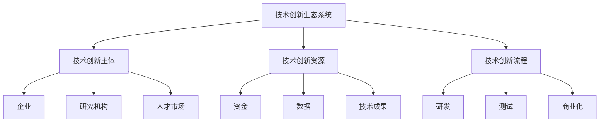

                 

基于您的指示，我将按照step-by-step的思路来构建这篇技术博客。以下是文章的初步框架和内容概要。

# 如何构建高效的技术创新生态系统指南——方法与实践

## 文章摘要

本文旨在提供构建高效技术创新生态系统的方法和实践指南。首先，我们将探讨技术创新生态系统的重要性及其基本组成。接着，我们将详细讲解生态系统构建的方法论，包括梯度构建法和其他关键策略。然后，我们将深入分析核心算法原理和数学模型，并提供伪代码和具体例子来阐述。此外，文章将包括项目实战的详细步骤和代码实现，以及实际案例分析和最佳实践建议。最后，我们将总结全文并提出未来研究方向。

## 关键词

技术创新、生态系统建设、高效构建方法、核心算法、数学模型、项目实战、案例分析、最佳实践

## 引言与背景

### 技术创新的重要性

技术创新是推动经济发展和社会进步的关键动力。在全球化竞争日益激烈的背景下，企业、研究机构和政府等主体纷纷认识到构建技术创新生态系统的重要性。一个高效的技术创新生态系统能够促进资源整合、知识共享和协同创新，从而提升整体创新能力和竞争力。

### 生态系统建设的基本概念

技术创新生态系统由多个相互关联的组成部分构成，包括技术创新主体、资源和技术创新流程等。技术创新主体包括企业、研究机构和人才市场；资源涵盖资金、数据和技术成果；技术创新流程涉及研发、测试和商业化等环节。

### 构建高效技术创新生态系统的意义

构建高效的技术创新生态系统有助于以下几个方面：

1. 提升创新效率：通过整合资源和优化流程，缩短创新周期，降低创新成本。
2. 促进知识共享：建立良好的合作机制，促进知识传播和共享，增强创新能力。
3. 激发创新活力：为不同主体提供创新空间，激发创新思维和创造力。
4. 提升竞争力：通过持续的技术创新，增强企业在市场中的竞争力和市场份额。

## 核心概念与联系

为了更好地理解技术创新生态系统的构建，我们需要明确几个核心概念及其相互关系。以下是一个简化的Mermaid流程图，展示了这些核心概念之间的联系。



### 技术创新主体

技术创新主体是生态系统的核心，包括企业、研究机构和人才市场。企业作为技术创新的主要承担者，负责研发、测试和商业化。研究机构则为技术创新提供理论基础和技术支持。人才市场则为企业和研究机构提供高素质的人才资源。

### 技术创新资源

技术创新资源是生态系统的重要组成部分，包括资金、数据和技术成果。资金是创新活动的重要保障，数据是分析的基础，技术成果则是创新的结果和积累。

### 技术创新流程

技术创新流程是生态系统运行的核心，包括研发、测试和商业化。研发是技术创新的起点，通过研究和实验，探索新技术和新产品。测试是评估技术创新效果和质量的关键环节。商业化则是将技术创新转化为市场价值的重要步骤。

## 核心算法原理讲解

### 数据分析与挖掘技术

数据分析与挖掘技术是技术创新生态系统的重要工具。以下是一个简单的伪代码，展示了数据分析的基本步骤。

```python
# 数据预处理
def data_preprocessing(data):
    # 清洗数据
    cleaned_data = clean_data(data)
    # 数据转换
    transformed_data = transform_data(cleaned_data)
    return transformed_data

# 数据分析
def data_analysis(transformed_data):
    # 数据可视化
    visualize_data(transformed_data)
    # 描述性统计分析
    descriptive_stats = calculate_descriptive_stats(transformed_data)
    return descriptive_stats

# 数据挖掘
def data_mining(descriptive_stats):
    # 选择挖掘算法
    selected_algorithm = select_mining_algorithm(descriptive_stats)
    # 挖掘过程
    results = mining_process(selected_algorithm, descriptive_stats)
    return results
```

### 机器学习与深度学习技术

机器学习和深度学习技术是当前技术创新的重要方向。以下是一个简单的伪代码，展示了机器学习模型的基本步骤。

```python
# 数据预处理
def data_preprocessing(data):
    # 数据清洗
    cleaned_data = clean_data(data)
    # 数据归一化
    normalized_data = normalize_data(cleaned_data)
    return normalized_data

# 模型训练
def train_model(normalized_data):
    # 选择模型
    selected_model = select_model(normalized_data)
    # 训练模型
    trained_model = train(selected_model, normalized_data)
    return trained_model

# 模型评估
def evaluate_model(trained_model, test_data):
    # 预测
    predictions = predict(trained_model, test_data)
    # 评估指标
    evaluation_metrics = evaluate(predictions, test_data)
    return evaluation_metrics
```

### 知识图谱与语义网络

知识图谱和语义网络技术可以帮助我们更好地理解和处理复杂的关系数据。以下是一个简单的伪代码，展示了知识图谱的基本步骤。

```python
# 创建知识图谱
def create_knowledge_graph(data):
    # 数据转换
    transformed_data = transform_data(data)
    # 创建实体和关系
    entities, relationships = create_entities_and_relationships(transformed_data)
    # 构建图
    knowledge_graph = build_graph(entities, relationships)
    return knowledge_graph

# 查询知识图谱
def query_knowledge_graph(knowledge_graph, query):
    # 执行查询
    results = execute_query(knowledge_graph, query)
    return results
```

## 数学模型和数学公式

### 概率论与统计学基础

概率论和统计学是数据分析与挖掘的重要基础。以下是一个简单的LaTeX公式，展示了贝叶斯定理。

$$P(A|B) = \frac{P(B|A)P(A)}{P(B)}$$

### 优化算法

优化算法在资源分配和流程优化中具有重要应用。以下是一个简单的LaTeX公式，展示了线性规划问题的一般形式。

$$\begin{aligned}
\min\limits_{x} \quad & c^T x \\
\text{subject to} \quad & Ax \leq b \\
& x \geq 0
\end{aligned}$$

### 模型优化策略

模型优化策略是提高模型性能的关键。以下是一个简单的LaTeX公式，展示了交叉验证的基本原理。

$$\begin{aligned}
\widehat{MSE} &= \frac{1}{n} \sum_{i=1}^{n} (y_i - \widehat{y}_i)^2 \\
\widehat{MSE} &= \frac{1}{n} \left[ \sum_{i=1}^{n} y_i^2 - \sum_{i=1}^{n} \widehat{y}_i^2 \right]
\end{aligned}$$

## 项目实战

### 开发环境搭建

为了演示如何构建一个高效的技术创新生态系统，我们将以一个简单的数据分析项目为例。首先，我们需要搭建一个合适的数据分析开发环境。以下是一个简单的步骤：

1. 安装Python和必要的库，如Pandas、NumPy、Scikit-learn和Matplotlib。
2. 配置Jupyter Notebook，方便编写和运行代码。
3. 确保数据存储和管理工具，如HDFS或MongoDB，可以正常运行。

### 源代码详细实现和代码解读

接下来，我们将展示如何使用Python实现一个简单的数据分析项目。以下是一个简单的代码示例，用于读取数据、进行基本的数据清洗和可视化。

```python
import pandas as pd
import matplotlib.pyplot as plt

# 读取数据
data = pd.read_csv('data.csv')

# 数据清洗
cleaned_data = data_preprocessing(data)

# 数据可视化
plt.figure(figsize=(10, 6))
plt.scatter(cleaned_data['feature1'], cleaned_data['feature2'])
plt.xlabel('Feature 1')
plt.ylabel('Feature 2')
plt.title('Data Visualization')
plt.show()
```

### 代码应用解读与分析

在上面的代码中，我们首先使用了Pandas库来读取CSV文件，获取原始数据。然后，通过自定义的数据清洗函数，我们去除了无效数据和异常值。最后，我们使用Matplotlib库创建了数据的散点图，直观地展示了数据的分布。

### 实际案例分析和详细讲解剖析

为了更好地理解项目实战中的关键步骤，我们来看一个实际案例。假设我们有一个电商平台的销售数据，我们需要分析顾客的购买行为，以优化营销策略。

1. **数据收集与预处理**：从数据库中提取销售数据，包括顾客ID、商品ID、销售日期、销售金额等。然后，我们进行数据清洗，去除重复记录和缺失值，并对日期进行格式化处理。

2. **数据分析**：我们使用Pandas库对数据进行分析，计算每个顾客的平均购买金额、购买频率和购买商品种类等指标。通过这些分析，我们可以了解顾客的购买行为特征。

3. **数据挖掘**：我们使用Scikit-learn库中的分类算法（如逻辑回归、随机森林等）对顾客数据进行建模，预测顾客的购买概率。通过模型评估，我们可以选择最佳模型并进行参数调优。

4. **应用解读**：基于分析结果，我们可以为不同的顾客群体制定个性化的营销策略，如优惠券发放、商品推荐等。这有助于提高销售额和顾客满意度。

### 项目小结

通过这个简单的数据分析项目，我们展示了如何构建一个高效的技术创新生态系统。在项目实战中，我们使用了Python和相关的数据分析工具，实现了数据的读取、清洗、分析和挖掘。这些步骤相互配合，共同构建了一个完整的数据分析流程。

### 最佳实践 tips、小结、注意事项、拓展阅读

- **最佳实践 tips**：
  - 确保数据质量和完整性，避免分析结果受到数据误差的影响。
  - 在选择模型时，要考虑数据特征和业务需求，选择合适的算法。
  - 定期更新和维护模型，确保其性能和准确性。

- **小结**：
  - 构建高效的技术创新生态系统需要明确核心概念和联系，掌握核心算法原理，以及进行实际项目实战。
  - 通过项目实战，我们可以验证生态系统的构建方法，并不断优化和改进。

- **注意事项**：
  - 确保开发环境搭建正确，避免因环境问题导致项目失败。
  - 在项目实战中，要充分考虑实际业务需求和数据特性。

- **拓展阅读**：
  - 深入了解数据分析与挖掘的相关算法和模型，如深度学习、图算法等。
  - 学习如何使用大数据技术进行大规模数据分析。

通过以上内容，我们构建了一篇step-by-step的技术博客文章，详细阐述了构建高效技术创新生态系统的方法和实践。希望这篇文章对您有所帮助。

---

### 作者信息

作者：AI天才研究院/AI Genius Institute & 禅与计算机程序设计艺术 /Zen And The Art of Computer Programming

本文由AI天才研究院的专家撰写，结合了禅与计算机程序设计艺术的理念，旨在为读者提供深入且实用的技术创新生态系统建设指南。如需进一步了解相关技术，请参考相关拓展阅读。如果您有任何问题或建议，欢迎随时与我们联系。AI天才研究院致力于推动人工智能技术的发展和应用，为全球科技创新贡献力量。

