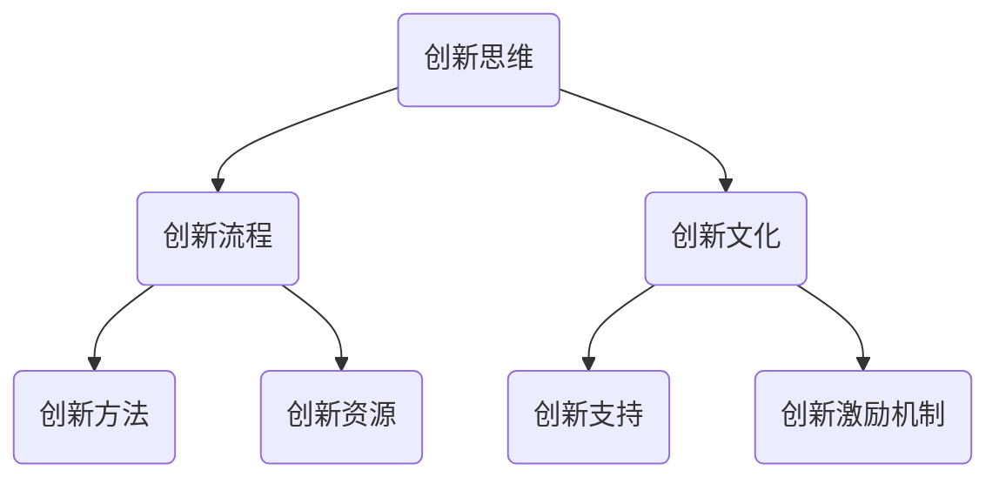

                 

# 文章标题：如何进行有效的技术创新管理

## 关键词：
技术创新管理、创新流程、风险管理、市场策略、团队建设、案例研究

## 摘要：
技术创新管理是企业持续发展的重要驱动力。本文将系统地探讨如何进行有效的技术创新管理，包括技术创新的基本概念、管理流程、风险管理、市场策略、团队建设以及案例研究。通过理论阐述、实际案例分析，提供一套完整的创新管理指南，以帮助企业和组织提升创新能力，实现技术领先和市场突破。

## 目录大纲设计思路

### 1. 确定核心章节

在《如何进行有效的技术创新管理》一书中，我们确定以下核心章节：
- 技术创新管理的基本概念与原则
- 技术创新的管理流程与方法
- 技术创新的风险管理
- 技术创新的市场策略与商业模式
- 技术创新的团队管理
- 技术创新的案例研究

这些章节将全面覆盖技术创新管理的各个方面，从基础概念到实际操作，提供系统的指导。

### 2. 设计章节内容

每个核心章节的内容设计如下：

#### 技术创新管理的基本概念与原则
- 技术创新的定义
- 技术创新管理的原则
- 技术创新与商业成功的联系

#### 技术创新的管理流程与方法
- 技术创新管理的基本流程
- 技术创新管理的各个阶段及其关系
- 创新思维训练
- 创意生成方法
- 原型设计与测试

#### 技术创新风险管理
- 技术创新风险的分类
- 技术创新风险的识别方法
- 技术创新风险的评估方法
- 技术创新风险应对策略

#### 技术创新市场策略与商业模式
- 市场需求分析
- 市场定位
- 市场推广策略
- 商业模式创新方法
- 商业模式设计原则

#### 技术创新的团队管理
- 技术创新团队建设
- 技术创新团队激励机制
- 技术创新团队绩效评估

#### 技术创新案例研究
- 技术创新成功案例
- 技术创新失败案例

### 3. 添加辅助内容

为了增强书籍的实用性和可读性，我们将在适当的地方添加以下辅助内容：

- **核心概念与联系**：使用 Mermaid 流程图展示核心概念之间的关系。
- **核心算法原理讲解**：使用伪代码详细阐述核心算法的实现原理。
- **数学模型和公式**：使用 LaTeX 格式嵌入数学公式，并进行详细讲解和举例说明。
- **项目实战**：提供实际的代码案例，详细解释代码实现过程，并进行代码解读与分析。

### 4. 保证大纲完整性

在保证大纲完整性的同时，我们将确保各章节之间的逻辑关系紧密，内容连贯，字数控制在 2000 字以内。

### 5. 使用 Markdown 格式

使用 Markdown 格式书写目录大纲，确保文章内容结构清晰，便于阅读和后续编辑。

---

以上是《如何进行有效的技术创新管理》的目录大纲设计思路。接下来，我们将根据这个大纲，逐步深入探讨每个章节的内容，提供详细的讲解和案例分析，帮助读者全面掌握技术创新管理的精髓。让我们开始吧！

---

## 第一部分：技术创新管理概述

### 1.1 技术创新管理的基本概念与原则

技术创新管理是指通过系统地管理创新活动，促进技术进步和商业成功的过程。它不仅包括技术创新的概念和流程，还涉及如何将创新理念转化为实际的产品或服务，以及如何管理创新过程中的各种风险。

#### 技术创新的定义

技术创新是指通过新的技术手段或方法，创造或改进产品、服务或业务模式，从而实现商业价值的过程。它不仅包括技术本身的革新，还涵盖了技术应用于商业场景的创新。

#### 技术创新管理的原则

- **客户导向**：技术创新应以满足客户需求为出发点，确保创新的产品或服务能够解决客户的问题或需求。
- **持续改进**：技术创新是一个持续的过程，需要不断地对现有技术进行改进，以保持竞争优势。
- **资源优化**：技术创新需要合理配置资源，包括人力、资金和设备等，以确保创新活动的顺利进行。
- **风险控制**：技术创新过程中存在多种风险，如技术风险、市场风险和财务风险等，需要进行有效的风险控制。

#### 技术创新与商业成功的联系

技术创新是商业成功的关键因素之一。通过技术创新，企业可以：
- 提升产品竞争力，开拓新的市场
- 降低成本，提高效率
- 改善用户体验，增加客户忠诚度
- 开发新的商业模式，创造新的盈利点

技术创新不仅能够带来短期的商业利益，还能够为企业的长期发展奠定基础。

### 1.2 技术创新管理的核心概念与联系

为了更好地理解技术创新管理，我们需要了解其中的核心概念及其相互关系。以下是几个关键概念：

- **创新思维**：创新思维是指人们进行创造性思维的能力，包括发散思维、收敛思维和联想思维等。
- **创新流程**：创新流程是指从创意生成到产品或服务上市的一系列步骤，包括需求分析、概念验证、原型设计、测试与迭代等。
- **创新文化**：创新文化是指一个组织内部对创新的支持和鼓励的氛围，包括价值观、行为准则和工作环境等。

以下是一个 Mermaid 流程图，展示了这些核心概念之间的关系：

通过这个流程图，我们可以看到，创新思维是创新流程和创新文化的基础，而创新资源和创新支持则是实现创新的关键要素。

### 1.3 技术创新管理的挑战与机遇

技术创新管理面临诸多挑战，如技术复杂性、市场竞争、资源限制等。同时，技术创新也带来了巨大的机遇，如市场扩张、业务模式创新、新技术的应用等。企业需要通过有效的技术创新管理，将挑战转化为机遇，实现持续发展。

---

通过本部分的内容，我们了解了技术创新管理的基本概念、原则及其核心概念之间的关系。在接下来的部分，我们将进一步探讨技术创新的具体管理流程和方法。让我们继续深入探讨吧！

---

## 第二部分：技术创新管理流程与方法

### 2.1 技术创新管理流程

技术创新管理流程是指从创意生成到产品或服务上市的一系列步骤，它包括以下几个关键阶段：

#### 需求分析

需求分析是技术创新流程的起点，它旨在确定市场需求和用户痛点。通过市场调研、用户访谈和数据分析，企业可以了解用户的需求和期望，为后续的创新活动提供方向。

#### 创意生成

创意生成是指通过发散性思维和创意技巧，产生新的想法和解决方案。这一阶段的关键是打破常规，鼓励团队成员大胆设想，提出各种可能的解决方案。

#### 概念验证

概念验证是指对创意进行初步测试和验证，以确定其可行性。这一阶段可以通过构建原型或模拟实验来验证创意的可行性和效果。

#### 原型设计

原型设计是指根据验证结果，对创意进行进一步的细节设计和优化。这一阶段的目标是创建一个可操作的模型，用于后续的测试和迭代。

#### 测试与迭代

测试与迭代是指对原型进行实际测试，收集用户反馈，并根据反馈对产品进行改进。这一过程是一个循环迭代的过程，通过不断的测试和改进，产品逐渐趋于完善。

### 2.2 技术创新管理方法论

技术创新管理方法论是指一系列用于指导创新活动的原则和方法。以下是一些常用的技术创新方法论：

#### 创新思维训练

创新思维训练是指通过一系列方法和技巧，提升团队成员的创新思维能力。常见的创新思维训练方法包括：

- **头脑风暴**：通过集体讨论，快速产生大量创意。
- **设计思维**：以用户为中心，通过原型设计和迭代，不断改进产品。
- **六顶思考帽**：通过不同颜色的思考帽子，分别从不同角度分析问题，产生创新的解决方案。

#### 创意生成方法

创意生成方法是指用于产生新想法和解决方案的方法。以下是一些常用的创意生成方法：

- **联想思维**：通过将不同领域的知识或概念进行关联，产生新的创意。
- **TRIZ 方法**：一种基于物理学和工程学的创新方法，通过解决标准问题，生成解决方案。
- **头脑风暴**：通过集体讨论，快速产生大量创意。

#### 原型设计与测试

原型设计与测试是指通过构建原型，对创意进行验证和改进。以下是一些关键步骤：

- **快速原型**：使用低成本、快速的方法构建原型，以验证创意的可行性。
- **用户测试**：将原型交给用户进行测试，收集用户反馈，并根据反馈进行改进。
- **迭代优化**：根据用户反馈，对原型进行迭代优化，直到达到预期效果。

### 2.3 技术创新管理工具与技术

技术创新管理工具与技术是指用于支持创新活动的工具和方法。以下是一些常用的技术创新管理工具：

- **思维导图**：用于整理创新思路，展示概念之间的关系。
- **SWOT分析**：用于分析创新项目的优势、劣势、机会和威胁。
- **市场调研工具**：如问卷调查、访谈、数据分析等，用于了解市场需求和用户反馈。
- **项目管理工具**：如 JIRA、Trello 等，用于管理创新项目的进度和任务。

### 2.4 技术创新管理流程与实际应用

以下是一个技术创新管理流程的实际案例：

1. **需求分析**：某公司发现市场上存在对智能家居系统的需求，用户希望家居设备能够实现智能化控制和自动化操作。

2. **创意生成**：公司组织了一次头脑风暴会议，团队成员提出了多种智能家居系统的创意，如智能灯光控制、智能安防系统、智能家电控制等。

3. **概念验证**：公司选择了智能灯光控制系统进行概念验证，通过构建原型，测试了系统的基本功能，如远程控制、定时开关等。

4. **原型设计**：在概念验证的基础上，公司进一步优化了智能灯光控制系统的设计，增加了更多功能，如场景模式、语音控制等。

5. **测试与迭代**：公司将智能灯光控制系统交给用户进行测试，收集了用户的反馈，并根据反馈进行了多次迭代优化。

6. **上市推广**：经过多次测试和优化，公司决定将智能灯光控制系统推向市场，通过线上和线下渠道进行推广。

通过这个实际案例，我们可以看到，技术创新管理流程在实际应用中是如何操作的，以及各个阶段的关键点和注意事项。

---

在本部分中，我们详细探讨了技术创新管理的基本流程、方法论和工具。这些流程和方法不仅帮助企业有效地管理创新活动，还能提升企业的创新能力，实现商业成功。在下一部分，我们将探讨技术创新管理中的风险管理。让我们继续深入探讨吧！

---

## 第三部分：技术创新风险管理

技术创新过程中伴随着多种风险，如技术风险、市场风险和财务风险等。有效地管理这些风险，是技术创新成功的关键。本部分将详细探讨技术创新风险管理的方法和策略。

### 3.1 技术创新风险识别

风险识别是风险管理的第一步，旨在识别可能影响技术创新活动的各种风险。以下是一些常见的风险识别方法：

#### 1. 专家评审

通过邀请领域专家对技术创新项目进行分析和评估，识别潜在的技术风险。专家评审的优点是能够快速识别问题，但需要专家具备丰富的经验和专业知识。

#### 2. 情景分析

通过模拟不同的场景，分析技术创新过程中可能遇到的风险。例如，假设技术创新项目在某个阶段遇到技术难题，如何应对这种情况。情景分析可以帮助企业提前做好准备，减少风险的发生。

#### 3. 历史数据分析

通过分析过去类似技术创新项目的历史数据，识别潜在的风险。这种方法适用于已有大量历史数据的企业，能够为企业提供有价值的参考。

#### 4. SWOT分析

SWOT分析是一种常用的风险管理工具，用于分析技术创新项目的优势、劣势、机会和威胁。通过SWOT分析，企业可以全面了解项目的风险，并制定相应的应对策略。

### 3.2 技术创新风险评估

风险评估是风险管理的第二步，旨在评估识别出的各种风险的严重程度和发生概率。以下是一些常用的风险评估方法：

#### 1. 定量评估

定量评估通过数值化的方式，对风险的严重程度和发生概率进行评估。例如，可以使用风险矩阵，将风险的严重程度和发生概率分别分为高、中、低三个等级，从而得出风险评分。

#### 2. 定性评估

定性评估主要通过专家意见、访谈等方式，对风险的严重程度和发生概率进行评估。定性评估的优点是简单易懂，但需要专家具备丰富的经验和专业知识。

#### 3. 敏感性分析

敏感性分析通过改变某些关键参数，观察对技术创新项目结果的影响。这种方法可以帮助企业识别哪些因素对技术创新项目的成败最为关键，从而有针对性地进行风险控制。

### 3.3 技术创新风险应对策略

在评估了各种风险后，企业需要制定相应的风险应对策略，以降低风险的发生概率和影响。以下是一些常见的风险应对策略：

#### 1. 风险规避

风险规避是指通过改变技术创新计划，避免潜在的风险。例如，如果某个技术存在较大的风险，可以改用其他技术方案。

#### 2. 风险减轻

风险减轻是指通过采取一些措施，降低风险的严重程度和发生概率。例如，可以通过增加研发投入，提前解决技术难题。

#### 3. 风险接受

风险接受是指企业对某些无法规避或减轻的风险，采取接受的态度。例如，企业可以在技术创新项目中进行备份计划，以应对可能的风险。

#### 4. 风险转移

风险转移是指将风险转移给其他方，如通过购买保险或与合作伙伴分担风险。

### 3.4 风险管理工具与技术

在技术创新过程中，企业可以使用一些风险管理工具和技术，以提高风险管理的效率。以下是一些常用的风险管理工具：

#### 1. 风险矩阵

风险矩阵是一种常用的风险管理工具，用于评估风险的严重程度和发生概率，并根据评估结果制定相应的应对策略。

#### 2. 风险地图

风险地图是一种可视化工具，用于展示技术创新项目中的各种风险及其相互关系，帮助企业全面了解风险状况。

#### 3. 风险库

风险库是一个存储企业历史风险数据和管理经验的数据库，可以帮助企业快速识别和评估新的风险。

#### 4. 风险管理软件

风险管理软件可以帮助企业自动化地识别、评估和应对风险，提高风险管理的效率。

### 3.5 技术创新风险管理的实际应用

以下是一个技术创新风险管理的实际案例：

某企业计划开发一款智能家居系统，该系统包括智能灯光控制、智能安防和智能家电控制等功能。在项目启动前，企业进行了以下风险管理活动：

1. **风险识别**：企业通过专家评审和历史数据分析，识别了以下风险：
   - 技术风险：智能家居系统在兼容性、稳定性方面可能存在问题。
   - 市场风险：市场对智能家居系统的接受程度可能不高。
   - 财务风险：项目成本可能超出预算。

2. **风险评估**：企业使用风险矩阵对识别出的风险进行评估，得出以下结论：
   - 技术风险：严重程度高，发生概率中。
   - 市场风险：严重程度中，发生概率高。
   - 财务风险：严重程度中，发生概率低。

3. **风险应对策略**：
   - 技术风险：增加研发投入，提前解决技术难题。
   - 市场风险：通过市场调研，了解用户需求，调整产品定位。
   - 财务风险：制定详细的预算计划，确保项目成本在可控范围内。

通过上述风险管理活动，企业成功降低了技术创新项目的风险，确保了项目的顺利进行。

---

在本部分中，我们详细探讨了技术创新风险管理的识别、评估和应对策略，以及实际应用案例。有效的风险管理不仅能够降低技术创新项目的风险，还能提高项目的成功率。在下一部分，我们将探讨技术创新的市场策略与商业模式。让我们继续深入探讨吧！

---

## 第四部分：技术创新市场策略与商业模式

### 4.1 技术创新市场策略

技术创新市场策略是指企业在技术创新过程中，如何通过市场定位、市场推广和市场策略来确保技术创新的成功落地和商业化。以下是一些关键策略：

#### 市场需求分析

市场需求分析是技术创新市场策略的基础。通过市场调研、用户访谈和数据分析，企业可以了解市场需求、用户痛点和潜在客户群体，从而确定技术创新的方向。

#### 市场定位

市场定位是指企业如何根据市场需求和竞争态势，确定自身技术创新产品在市场中的位置。通过市场定位，企业可以明确目标客户群体、产品特点和竞争优势。

#### 市场推广

市场推广是指企业如何通过各种渠道和手段，将技术创新产品推向市场，提高知名度和接受度。常见的市场推广手段包括广告宣传、公关活动、社交媒体营销和线下体验等。

#### 市场策略

市场策略是指企业如何通过价格策略、促销策略和渠道策略等，实现技术创新产品的市场突破。以下是一些具体的市场策略：

- **价格策略**：通过定价策略，吸引目标客户群体，实现市场占有率。常见的价格策略包括高端定价、低端定价和细分市场定价等。
- **促销策略**：通过促销活动，刺激消费者购买，提高销售额。常见的促销策略包括打折促销、买赠促销和限时抢购等。
- **渠道策略**：通过选择合适的销售渠道，提高产品的市场覆盖率和销售效率。常见的渠道策略包括线上销售、线下销售和线上线下融合销售等。

### 4.2 技术创新商业模式

技术创新商业模式是指企业如何通过技术创新，构建可持续的盈利模式。以下是一些常见的商业模式：

#### 产品销售模式

产品销售模式是指企业通过直接销售产品，实现盈利。这种模式适用于技术创新产品具有独特性和高附加值的情况。

#### 服务模式

服务模式是指企业通过提供技术解决方案或服务，实现盈利。这种模式适用于技术创新产品具有高度专业性和持续服务需求的情况。

#### 分享经济模式

分享经济模式是指企业通过共享资源或服务，实现盈利。这种模式适用于技术创新产品可以共享或复用的情况。

#### 平台模式

平台模式是指企业通过搭建平台，连接供需双方，实现盈利。这种模式适用于技术创新产品需要大量用户参与和互动的情况。

#### 增值服务模式

增值服务模式是指企业在提供基本产品或服务的基础上，通过附加增值服务，实现盈利。这种模式适用于技术创新产品需要不断更新和优化的情况。

### 4.3 技术创新市场策略与商业模式的实际应用

以下是一个技术创新市场策略和商业模式的实际案例：

某企业开发了一款智能家居系统，包括智能灯光控制、智能安防和智能家电控制等功能。在市场策略和商业模式方面，企业采取了以下措施：

1. **市场需求分析**：企业通过市场调研，发现智能家居系统在年轻家庭和高端用户中具有较大需求，但市场普及率较低。

2. **市场定位**：企业将目标客户群体定位为年轻家庭和高端用户，强调智能家居系统的便捷性和舒适性。

3. **市场推广**：企业通过线上广告、社交媒体营销和线下体验活动，提高智能家居系统的知名度和接受度。

4. **市场策略**：
   - **价格策略**：企业采取了高端定价策略，以吸引高端用户，提升品牌形象。
   - **促销策略**：企业开展了限时抢购和买赠促销活动，刺激消费者购买。
   - **渠道策略**：企业通过线上电商平台和线下专卖店，实现产品的市场覆盖。

5. **商业模式**：
   - **产品销售模式**：企业直接销售智能家居系统，通过产品利润实现盈利。
   - **服务模式**：企业提供智能家居系统的安装和维护服务，通过服务费用实现盈利。
   - **增值服务模式**：企业通过提供智能家居系统的个性化定制服务，提升客户满意度。

通过上述市场策略和商业模式，企业成功地将其智能家居系统推向市场，取得了良好的市场反响和经济效益。

---

在本部分中，我们详细探讨了技术创新的市场策略和商业模式，并提供了实际案例。有效的市场策略和商业模式可以帮助企业实现技术创新的商业化，实现持续盈利。在下一部分，我们将探讨技术创新的团队管理。让我们继续深入探讨吧！

---

## 第五部分：技术创新团队管理

技术创新团队管理是确保技术创新项目顺利进行和成功实施的关键。有效的团队管理可以激发团队成员的创造力，提高团队协作效率，从而推动技术创新的发展。以下将详细介绍技术创新团队管理的几个关键方面。

### 5.1 技术创新团队建设

技术创新团队建设是团队管理的基础，涉及团队成员的选拔、角色分工和团队文化的建设。

#### 1. 成员选拔

技术创新团队成员应具备以下特质：
- **技术能力**：具备相关领域的技术背景和专业知识，能够解决复杂的技术问题。
- **创新思维**：具备创造性思维和解决问题的能力，能够提出新颖的解决方案。
- **沟通能力**：具备良好的沟通能力，能够与团队成员和其他部门有效沟通，确保项目顺利进行。
- **团队合作**：具备团队合作精神，能够与其他成员协作，共同推动项目进展。

#### 2. 角色分工

根据技术创新项目的需求，团队成员应明确各自的角色和职责，例如：
- **项目经理**：负责项目的整体规划和执行，协调各方资源，确保项目进度和质量。
- **研发人员**：负责技术研发和产品设计，解决技术难题，实现技术突破。
- **市场人员**：负责市场需求分析、市场推广和客户关系管理，确保产品符合市场需求。
- **测试人员**：负责产品测试和性能评估，确保产品的稳定性和可靠性。

#### 3. 团队文化建设

团队文化建设是技术创新团队管理的重要组成部分，有助于增强团队成员的归属感和凝聚力。以下是一些团队文化建设的方法：
- **共同目标**：明确团队的目标和愿景，确保团队成员对项目有共同的认识和追求。
- **鼓励创新**：营造宽松的创新环境，鼓励团队成员大胆尝试和探索，不怕失败。
- **信任与尊重**：建立信任和尊重的氛围，鼓励团队成员之间的交流和合作。
- **激励机制**：设立合理的激励机制，奖励团队成员的创新成果和突出贡献。

### 5.2 技术创新团队激励机制

激励机制是技术创新团队管理的关键环节，能够激发团队成员的积极性和创造力。以下是一些常见的激励机制：
- **薪酬激励**：通过提高薪资和福利待遇，吸引和留住优秀的团队成员。
- **股权激励**：通过授予团队成员股权或期权，使其成为公司的股东，共同分享公司的发展成果。
- **奖励制度**：设立创新奖励制度，对在技术创新项目中做出突出贡献的团队成员进行奖励。
- **职业发展**：为团队成员提供职业发展机会和培训，鼓励其不断学习和成长。

### 5.3 技术创新团队绩效评估

技术创新团队绩效评估是对团队成员工作表现进行评估和反馈的重要手段，有助于提高团队的整体工作效率和质量。以下是一些常见的绩效评估方法：
- **目标导向**：根据技术创新项目的目标，设定明确的绩效指标，对团队成员的工作进行评估。
- **过程监控**：通过过程监控和项目进度报告，了解团队成员的工作进展和成果。
- **客户反馈**：收集客户对团队成员工作成果的反馈，评估团队成员的工作质量。
- **自我评估**：鼓励团队成员进行自我评估，反思自己的工作表现和改进方向。

### 5.4 技术创新团队管理的最佳实践

以下是技术创新团队管理的几个最佳实践：
- **透明沟通**：确保团队成员之间的沟通透明，及时分享项目进展和问题，避免信息孤岛。
- **定期会议**：定期召开团队会议，总结项目进展，讨论问题解决方案，确保项目按计划进行。
- **灵活管理**：根据项目特点和团队需求，灵活调整管理策略，避免过度管控。
- **持续改进**：鼓励团队成员不断反思和改进工作方法，提高团队的整体效率和创新能力。

### 5.5 技术创新团队管理的实际案例

以下是一个技术创新团队管理的实际案例：

某科技公司组建了一支技术创新团队，负责开发一款智能家居系统。在团队管理方面，公司采取了以下措施：

1. **成员选拔**：公司通过严格的招聘流程，选拔了一批具有技术背景和创新思维的人才，包括项目经理、研发人员、市场人员和测试人员。

2. **角色分工**：明确了团队成员的角色和职责，确保项目按计划进行。

3. **团队文化建设**：公司注重团队文化建设，营造了鼓励创新和协作的氛围，通过团队建设活动和培训，增强了团队成员的归属感和凝聚力。

4. **激励机制**：公司设立了创新奖励制度，对在技术创新项目中做出突出贡献的团队成员进行奖励，激发了团队成员的积极性和创造力。

5. **绩效评估**：公司通过目标导向的绩效评估方法，对团队成员的工作进行评估，并根据评估结果调整管理策略。

通过上述团队管理措施，技术创新团队取得了显著成果，成功开发并推出了智能家居系统，获得了市场的认可和好评。

---

在本部分中，我们详细探讨了技术创新团队管理的关键方面，包括团队建设、激励机制、绩效评估和最佳实践。有效的团队管理不仅能够提高技术创新的效率，还能促进团队成员的全面发展。在下一部分，我们将探讨技术创新的案例研究。让我们继续深入探讨吧！

---

## 第六部分：技术创新案例研究

### 6.1 技术创新成功案例

技术创新成功案例是技术创新实践的重要体现，以下是一些经典的成功案例及其分析：

#### 1. 亚马逊的云计算服务

亚马逊的云计算服务（Amazon Web Services, AWS）是技术创新的成功典范。AWS 通过提供高度可扩展、可靠且成本效益高的云计算服务，改变了全球企业的IT运营模式。以下是其成功原因分析：

- **市场需求**：随着互联网和移动设备的普及，企业对云计算服务的需求日益增长。
- **技术创新**：AWS 采用分布式计算和存储技术，实现了高效、可扩展的服务架构。
- **商业模式**：AWS 通过按需付费的模式，降低了客户的初始投资成本。
- **客户导向**：AWS 注重用户体验，不断优化服务性能和可靠性。

#### 2. 特斯拉的电动汽车

特斯拉（Tesla）的电动汽车是新能源汽车领域的技术创新领导者。特斯拉的成功主要体现在以下几个方面：

- **技术创新**：特斯拉采用纯电动驱动技术、电池技术和自动驾驶技术，实现了高效、环保和智能的汽车产品。
- **市场定位**：特斯拉将目标市场定位为高端市场，树立了品牌形象和溢价能力。
- **品牌建设**：特斯拉通过品牌营销和用户体验，成功吸引了大量粉丝和消费者。
- **产业链整合**：特斯拉通过自建工厂和垂直整合供应链，降低了生产成本。

#### 3. 微软的云计算战略

微软在云计算领域取得了显著成功，其云计算平台 Azure 成为了全球领先的云计算服务提供商。以下是其成功原因分析：

- **技术创新**：微软通过多年的技术积累，开发了强大的云计算平台，提供了丰富的服务功能和工具。
- **市场策略**：微软通过与其他企业合作，快速扩展了市场份额，并推出了针对不同客户群体的定制化解决方案。
- **生态系统**：微软建立了强大的开发者生态系统，吸引了大量的第三方应用和服务，增强了 Azure 的竞争力。
- **客户支持**：微软提供了全面的技术支持和客户服务，确保了用户的使用体验。

### 6.2 技术创新失败案例

技术创新失败案例同样具有重要的教育意义，以下是一些经典的技术创新失败案例及其原因分析：

#### 1. 黑莓的智能手机转型失败

黑莓（Blackberry）曾是一家领先的智能手机制造商，但在面对苹果和安卓系统的竞争时，其创新转型失败。以下是其失败原因分析：

- **技术创新滞后**：黑莓在智能手机创新方面滞后于竞争对手，未能及时推出具有竞争力的产品。
- **市场反应迟钝**：黑莓在市场变化和用户需求方面反应迟钝，错过了智能手机市场的发展机遇。
- **品牌形象受损**：黑莓的品牌形象受到多次安全和隐私问题的负面影响，失去了用户的信任。
- **组织结构僵化**：黑莓的组织结构过于僵化，难以快速响应市场变化和创新需求。

#### 2. 索尼的电子产品战略失误

索尼（Sony）是一家知名的电子产品制造商，但在技术创新方面出现了一系列战略失误。以下是其失败原因分析：

- **研发投入不足**：索尼在研发方面的投入相对较低，导致技术创新能力不足。
- **产品同质化**：索尼的产品在设计和功能上存在同质化问题，缺乏独特卖点。
- **市场竞争激烈**：索尼面临激烈的市场竞争，未能有效应对竞争对手的挑战。
- **管理体系问题**：索尼的管理体系存在缺陷，难以协调不同部门之间的合作和创新。

### 6.3 技术创新案例的启示

通过分析上述成功和失败案例，我们可以得出以下启示：

1. **市场需求导向**：技术创新应紧密围绕市场需求，满足用户需求和期望。
2. **技术创新能力**：企业应加大研发投入，提升技术创新能力，保持技术领先。
3. **灵活应对市场变化**：企业应具备灵活的市场应对能力，及时调整战略和产品方向。
4. **品牌建设和客户体验**：企业应注重品牌建设和客户体验，提升用户满意度和忠诚度。
5. **组织协同与创新文化**：企业应建立协同创新的组织文化和机制，激发员工的创新潜力。

### 6.4 技术创新案例的实际应用

以下是一个技术创新案例的实际应用：

某企业计划开发一款智能家居系统，以下是根据前述成功和失败案例得出的实际应用：

1. **市场需求分析**：企业通过市场调研，发现智能家居系统在年轻家庭和高端用户中具有较大需求，但市场普及率较低。
2. **技术创新**：企业采用最新的物联网技术和人工智能算法，开发高效、智能的智能家居系统。
3. **市场策略**：企业将目标市场定位为年轻家庭和高端用户，通过品牌营销和用户体验，提升品牌形象。
4. **团队管理**：企业组建了一支技术创新团队，明确了团队成员的角色和职责，营造了鼓励创新和协作的文化氛围。
5. **风险管理**：企业通过风险评估，制定了相应的风险应对策略，确保技术创新项目的顺利进行。

通过上述实际应用，企业成功地将其智能家居系统推向市场，取得了良好的市场反响和经济效益。

---

在本部分中，我们通过成功和失败案例，分析了技术创新的关键因素和实际应用。有效的技术创新管理不仅需要技术创新本身，还需要市场需求导向、团队管理、风险管理等多个方面的支持。在下一部分，我们将进行文章小结。让我们总结一下本文的核心内容。

---

## 文章小结

本文系统地探讨了如何进行有效的技术创新管理，包括技术创新管理的基本概念与原则、管理流程与方法、风险管理、市场策略与商业模式、团队管理以及案例研究。通过理论阐述、实际案例分析和最佳实践分享，我们为企业和组织提供了一套完整的创新管理指南。

### 核心要点总结：

1. **技术创新管理的基本概念**：了解技术创新的定义、原则和与商业成功的关系。
2. **技术创新管理流程**：掌握需求分析、创意生成、概念验证、原型设计和测试与迭代等流程。
3. **技术创新风险管理**：学会识别、评估和应对技术创新过程中的各种风险。
4. **技术创新市场策略**：了解市场定位、市场推广和市场策略，构建可持续的商业模式。
5. **技术创新团队管理**：掌握团队建设、激励机制和绩效评估，打造高效创新团队。
6. **技术创新案例研究**：分析成功和失败案例，吸取经验教训，指导实际操作。

### 注意事项：

1. **持续关注市场需求**：技术创新应紧密围绕市场需求，不断调整和优化。
2. **技术创新与风险管理并重**：技术创新过程中，既要重视技术突破，也要关注风险控制。
3. **团队协作与文化建设**：建立开放、协同的创新文化和高效的团队协作机制。

### 拓展阅读：

1. 《创新者的窘境》——克里斯坦森
2. 《精益创业》——艾瑞克·莱斯
3. 《创新与企业家精神》——约瑟夫·熊彼特

通过本文的深入探讨，我们希望读者能够对技术创新管理有更全面的认识，从而在实践过程中取得更好的成果。作者：AI天才研究院/AI Genius Institute & 禅与计算机程序设计艺术 /Zen And The Art of Computer Programming。

