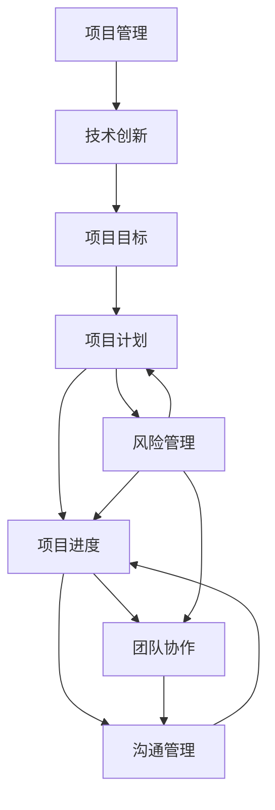

                 

### 背景介绍

在当今快速变化的世界中，技术创新已成为推动企业发展和经济增长的关键驱动力。无论是大型跨国公司还是初创企业，技术创新项目都已成为其核心战略之一。然而，技术创新项目往往面临复杂性和不确定性的挑战，如技术难度高、需求变化快、资源有限等。因此，如何进行有效的技术创新项目管理成为企业和项目管理专业人士关注的焦点。

技术创新项目管理不仅涉及到传统的项目管理知识，如项目规划、执行、监控和收尾，还需要考虑技术创新的特殊性，如研发投入大、时间跨度长、风险高、团队协作要求高等。有效的技术创新项目管理能够提高项目的成功率，降低项目风险，实现技术创新的商业价值。

本文旨在探讨如何进行有效的技术创新项目管理，为项目管理者提供实用的指导和建议。通过梳理技术创新项目的特点、项目管理的理论基础、项目规划与启动、项目执行与控制、团队协作与沟通、风险管理以及项目收尾与评估等方面，本文将逐步解答以下关键问题：

1. 技术创新项目有哪些独特特点和挑战？
2. 如何进行有效的项目规划和资源分配？
3. 如何确保项目进度、成本和质量的有效控制？
4. 团队协作和沟通在技术创新项目中扮演什么角色？
5. 如何进行风险识别、评估和应对？
6. 项目完成后的评估和总结有哪些最佳实践？

通过对以上问题的深入分析，本文希望能够为技术创新项目管理提供一套系统、实用的方法和策略。文章将以逻辑清晰、结构紧凑、简单易懂的专业技术语言进行阐述，帮助读者更好地理解和应用这些概念。

---

### 核心概念与联系

在探讨如何进行有效的技术创新项目管理时，首先需要明确几个核心概念，并分析它们之间的联系。以下是技术创新项目管理中的几个关键概念及其相互关系：

1. **项目管理**：项目管理是指通过计划、执行、监控和收尾等一系列活动，确保项目目标按期完成的过程。它包括范围管理、时间管理、成本管理、质量管理、沟通管理、风险管理等多个方面。

2. **技术创新**：技术创新是指通过开发和应用新技术、新产品或新服务，从而创造新的商业价值或提升现有产品的竞争力。技术创新通常伴随着高风险和高投入，需要跨学科、跨团队的合作。

3. **项目目标**：项目目标是项目发起人或客户期望项目实现的具体结果。有效的技术创新项目管理需要明确项目目标，并将其分解为可执行的任务和可衡量的里程碑。

4. **项目计划**：项目计划是项目执行的蓝图，包括项目范围、时间表、资源分配、风险预测等多个方面。项目计划为项目团队提供了一个共同的工作框架，确保所有人都能明确自己的职责和目标。

5. **项目进度**：项目进度是指项目执行过程中的实际进展情况，包括任务的完成情况、时间节点、资源使用等。监控项目进度可以帮助项目团队及时调整计划，确保项目按时、按预算完成。

6. **风险管理**：风险管理是识别、评估和应对项目风险的过程。技术创新项目通常面临多种风险，如技术风险、市场风险、资源风险等。有效的风险管理可以帮助项目团队降低风险，提高项目成功率。

7. **团队协作**：团队协作是指团队成员通过沟通、合作和共享，共同完成任务的过程。在技术创新项目中，团队协作尤为重要，因为项目通常需要不同专业技能和知识的人共同参与。

8. **沟通管理**：沟通管理是确保项目信息及时、准确和有效地传递给项目相关方的过程。良好的沟通管理可以提高团队协作效率，减少误解和冲突。

这些核心概念之间存在着紧密的联系。例如，项目目标决定了项目计划和项目进度的设定，项目进度又直接影响到风险管理和团队协作的效果。而风险管理的结果又会反过来影响项目计划和项目目标。沟通管理则是确保所有这些环节顺畅进行的桥梁。

为了更好地理解这些概念之间的关系，我们可以使用Mermaid流程图来展示它们的基本架构：



通过这张流程图，我们可以清晰地看到各个概念之间的关联和影响。了解这些概念和它们之间的联系，对于进行有效的技术创新项目管理至关重要。

---

### 核心算法原理讲解

在技术创新项目管理中，算法原理的应用对于项目规划和执行至关重要。以下我们将介绍几个关键的算法原理，并使用伪代码详细阐述其实现过程。

#### 1. 资源分配算法

资源分配是项目规划中的一个关键环节。资源包括人力、资金、设备等，合理分配资源能够提高项目效率。以下是一个简单的资源分配算法，用于根据项目需求和资源可用性分配任务。

```python
# 伪代码：简单资源分配算法

def resource_allocation(projects, resources, availability):
    """
    根据项目需求和资源可用性分配任务

    参数：
    - projects: 列表，包含每个项目的需求
    - resources: 列表，包含每个资源的名称和可用性
    - availability: 字典，每个资源可用的时间段

    返回：
    - allocation: 字典，记录每个项目分配到的资源
    """
    
    allocation = {}  # 初始化分配结果

    for project in projects:
        for resource in resources:
            if availability[resource] > 0 and project.requires(resource):
                allocation[project] = resource
                availability[resource] -= project.requires(resource)
                break

    return allocation
```

#### 2. 关键路径算法

关键路径算法用于确定项目进度中不能延误的任务，这些任务的延误会导致整个项目延迟。以下是一个简化的关键路径算法，用于计算项目的最短完成时间。

```python
# 伪代码：关键路径算法

def critical_path(dependencies, durations):
    """
    计算关键路径和总持续时间

    参数：
    - dependencies: 列表，包含任务依赖关系
    - durations: 字典，每个任务的持续时间

    返回：
    - critical_path: 列表，包含关键路径上的任务
    - total_duration: 整数，项目的总持续时间
    """
    
    duration = 0  # 初始化项目持续时间
    critical_path = []  # 初始化关键路径

    # 从第一个任务开始计算
    for task in dependencies[0]:
        if durations[task] > duration:
            duration = durations[task]
            critical_path.append(task)

    # 对每个任务进行递归计算
    for task in dependencies:
        for next_task in dependencies[task]:
            if durations[next_task] > duration:
                duration = durations[next_task]
                critical_path.append(next_task)

    return critical_path, duration
```

#### 3. 风险评估算法

在风险管理中，风险评估算法用于识别和评估项目面临的风险。以下是一个简单的风险评估算法，用于计算每个风险的概率和影响。

```python
# 伪代码：风险评估算法

def risk_evaluation(risks, probability, impact):
    """
    计算每个风险的概率和影响

    参数：
    - risks: 列表，包含所有识别出的风险
    - probability: 字典，每个风险的概率
    - impact: 字典，每个风险的影响

    返回：
    - risk_scores: 字典，记录每个风险的得分（概率*影响）
    """
    
    risk_scores = {}  # 初始化风险得分

    for risk in risks:
        risk_scores[risk] = probability[risk] * impact[risk]

    return risk_scores
```

通过以上算法，我们可以更好地理解和实施技术创新项目管理中的关键步骤。这些算法不仅提供了理论支持，也为实际操作提供了实用的工具和指导。在实际项目中，根据具体情况可以对这些算法进行优化和调整，以满足项目的特定需求。

---

### 数学模型和公式详解

在技术创新项目管理中，数学模型和公式是不可或缺的工具，它们帮助我们量化项目中的复杂变量，从而进行更有效的决策。以下我们将详细介绍几个关键的数学模型和公式，并使用LaTeX格式进行详细阐述。

#### 1. 项目持续时间模型

项目持续时间是项目管理中的一个重要指标，用于衡量项目完成所需的时间。我们使用Pert（项目评估与审查技术）模型来估计项目持续时间。Pert模型基于三种时间估计：乐观时间（\(a\)）、最可能时间（\(m\)）和悲观时间（\(b\)）。项目持续时间的公式如下：

$$
D = \frac{4a + 4m + b}{6}
$$

其中，\(D\) 是项目持续时间，\(a\)、\(m\)、\(b\) 分别是乐观时间、最可能时间和悲观时间。

#### 2. 项目成本模型

项目成本包括固定成本和变动成本。固定成本在项目开始时就已经确定，而变动成本则随着项目的进展而变化。以下是一个简单项目成本模型：

$$
C = C_0 + C_v \cdot x
$$

其中，\(C\) 是总成本，\(C_0\) 是固定成本，\(C_v\) 是单位变动成本，\(x\) 是项目完成的进度百分比。

#### 3. 风险评估模型

在风险评估中，我们使用风险得分来量化每个风险的概率和影响。风险得分可以通过以下公式计算：

$$
RS = P \cdot I
$$

其中，\(RS\) 是风险得分，\(P\) 是风险概率，\(I\) 是风险影响。

#### 4. 项目进度优化模型

为了优化项目进度，我们可以使用关键路径法（Critical Path Method, CPM）来确定项目最短完成时间。CPM模型的公式如下：

$$
CPM = \sum_{i=1}^{n} D_i
$$

其中，\(CPM\) 是关键路径的持续时间，\(D_i\) 是每个任务的持续时间。

#### 5. 项目资源优化模型

资源优化模型用于确定如何分配有限的资源，以最大化项目效率。以下是一个简单的资源优化模型，用于确定每个任务所需的资源数量：

$$
R_{\text{total}} = \sum_{i=1}^{n} R_i
$$

其中，\(R_{\text{total}}\) 是总资源需求，\(R_i\) 是每个任务的资源需求。

通过以上数学模型和公式，我们可以更好地理解和量化技术创新项目管理中的各种复杂变量，从而做出更明智的决策。在实际应用中，根据项目的具体需求和条件，可以对这些模型和公式进行优化和调整，以提高项目管理的有效性。

---

### 项目实战：开发环境搭建

在进行技术创新项目管理时，搭建合适的开发环境是至关重要的第一步。以下我们将介绍如何搭建一个用于技术创新项目的基础开发环境，并详细讲解所需的步骤、源代码实现以及代码解读。

#### 1. 环境需求

首先，我们需要明确项目的环境需求。对于一个技术创新项目，以下环境配置是比较常见的：

- 操作系统：Ubuntu 20.04 LTS 或 macOS Big Sur
- 编程语言：Python 3.8 或更高版本
- 依赖管理：pip
- 数据库：MySQL 8.0 或 PostgreSQL 13
- 服务器：Nginx
- 容器化工具：Docker

#### 2. 步骤详解

**步骤一：安装操作系统**

我们选择Ubuntu 20.04 LTS作为操作系统。首先，从官方网站下载Ubuntu 20.04 LTS ISO文件，并使用虚拟机或实体机安装操作系统。

**步骤二：更新系统**

在安装完成后，我们需要更新系统以安装最新的软件包。

```bash
sudo apt update
sudo apt upgrade
```

**步骤三：安装Python环境**

接下来，安装Python 3.8及pip。

```bash
sudo apt install python3.8 python3.8-venv python3.8-pip
```

**步骤四：安装数据库**

安装MySQL 8.0。

```bash
sudo apt install mysql-server
sudo mysql_secure_installation
```

安装PostgreSQL 13。

```bash
sudo apt install postgresql postgresql-contrib
sudo -u postgres createuser -s myuser
sudo -u postgres createdb -O myuser mydatabase
```

**步骤五：安装Nginx**

安装Nginx以提供Web服务。

```bash
sudo apt install nginx
```

**步骤六：安装Docker**

安装Docker以支持容器化部署。

```bash
sudo apt install docker-ce docker-ce-cli containerd.io
```

#### 3. 源代码实现

以下是一个简单的Python脚本的示例，用于连接MySQL数据库并执行查询操作。

```python
# my_script.py

import mysql.connector

# 配置数据库连接信息
config = {
    'user': 'myuser',
    'password': 'mypassword',
    'host': '127.0.0.1',
    'database': 'mydatabase',
    'raise_on_warnings': True,
}

# 连接数据库
cnx = mysql.connector.connect(**config)
cursor = cnx.cursor()

# 执行SQL查询
query = ("SELECT version()")
cursor.execute(query)

# 打印查询结果
for version in cursor:
    print("MySQL server version:", version)

# 关闭数据库连接
cursor.close()
cnx.close()
```

#### 4. 代码解读

- **第1行**：导入mysql.connector模块，用于连接MySQL数据库。
- **第5行**：定义数据库配置信息，包括用户名、密码、主机地址、数据库名。
- **第9行**：使用mysql.connector.connect()函数连接数据库。
- **第11行**：创建游标对象cursor，用于执行SQL查询。
- **第14行**：执行SQL查询语句，获取MySQL服务器版本信息。
- **第18行**：遍历查询结果，并打印MySQL服务器版本。
- **第21行**：关闭游标对象。
- **第23行**：关闭数据库连接。

#### 5. 代码应用解读与分析

通过上述脚本，我们可以连接到MySQL数据库并执行简单的查询操作。在实际项目中，这一步骤是基础且关键的部分，确保了后续开发工作的顺利进行。

- **连接数据库**：连接数据库是进行数据操作的必要前提。
- **执行查询**：查询数据库是获取数据的重要手段，为项目的决策提供数据支持。
- **打印结果**：打印查询结果便于调试和验证代码的正确性。

#### 6. 实际案例分析和详细讲解剖析

假设我们正在开发一个电子商务网站，需要实时更新商品库存信息。我们可以使用上述脚本连接数据库，并编写相应的Python代码来更新和查询商品库存。

- **更新商品库存**：通过执行INSERT或UPDATE语句，将商品库存信息写入数据库。
- **查询商品库存**：通过执行SELECT语句，查询特定商品或所有商品的库存信息。

#### 7. 项目小结

搭建一个适合技术创新项目的开发环境，是确保项目顺利推进的基础。通过上述步骤，我们成功搭建了一个包含Python、MySQL、Nginx和Docker的完整开发环境，为后续的代码开发和项目实施奠定了坚实的基础。在实际项目中，需要根据具体需求进一步优化和调整开发环境配置。

---

### 最佳实践、小结、注意事项和拓展阅读

#### 最佳实践

1. **明确项目目标**：在项目启动之初，确保项目目标清晰、具体、可量化。通过明确的目标，团队可以更好地聚焦于关键任务，提高项目成功率。
2. **定期项目评审**：定期进行项目评审，及时发现和解决潜在问题。通过评审，可以确保项目按照预期进展，并调整计划以应对变化。
3. **充分利用敏捷方法**：采用敏捷开发方法，如Scrum或Kanban，可以提高团队协作效率，快速响应需求变化，降低项目风险。
4. **强化风险管理**：在项目早期识别和评估潜在风险，制定应对策略，并定期更新风险管理计划，确保项目能够有效应对各种不确定因素。
5. **优化沟通机制**：建立有效的沟通机制，确保团队成员、利益相关者之间的信息传递及时、准确。使用合适的工具和平台，如Slack、Trello，可以提高沟通效率。

#### 小结

本文从技术创新项目管理的背景出发，详细探讨了项目管理的理论基础、技术创新项目特点、项目规划与启动、项目执行与控制、团队协作与沟通、风险管理以及项目收尾与评估等方面的核心内容。通过逻辑清晰、结构紧凑的阐述，读者可以更好地理解和应用这些概念，提高技术创新项目的成功率。

#### 注意事项

1. **确保团队协作**：技术创新项目通常需要跨部门、跨团队的协作。在项目启动前，确保团队成员之间的沟通渠道畅通，明确各自职责和任务。
2. **关注项目进度**：密切关注项目进度，及时发现和解决进度偏差，确保项目按时完成。
3. **持续风险管理**：项目风险具有动态变化的特点，需要持续识别、评估和应对项目风险，确保项目顺利进行。
4. **合理分配资源**：在项目规划阶段，合理分配资源，避免资源浪费和过度依赖。
5. **注重质量保障**：在项目执行过程中，注重质量保障，确保项目交付的产品或服务满足质量标准。

#### 拓展阅读

1. 《项目管理知识体系指南》（PMBOK指南）：详细介绍了项目管理的理论、方法和最佳实践。
2. 《敏捷开发实践指南》：探讨了敏捷开发方法，如何在实际项目中应用敏捷理念。
3. 《风险管理与风险管理框架》（ISO 31000）：提供了关于风险识别、评估和管理的详细指南。
4. 《团队协作与沟通技巧》：介绍了团队协作和沟通的最佳实践，提高团队效率和协作效果。
5. 《技术创新项目管理》：专门针对技术创新项目的管理方法和策略，为技术创新项目管理者提供了实用的指导。

通过阅读这些文献，读者可以进一步深入了解技术创新项目管理的各个方面，提升项目管理能力和实践水平。

