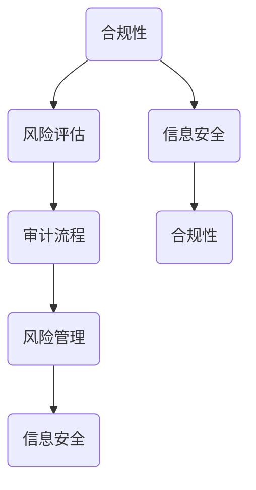

                 

### 引言

技术合规审计，作为一个关键的IT治理工具，在现代信息技术环境中扮演着至关重要的角色。随着全球数字化进程的加速，企业对技术的依赖程度日益加深，同时，技术相关的法规和标准也变得越来越复杂。在这一背景下，技术合规审计不仅有助于企业确保其信息系统和操作遵守相关法规和标准，还能提高整体的安全性和可靠性，减少法律风险和潜在财务损失。

本文旨在为读者提供一份全面而深入的技术合规审计指南，帮助企业和IT专业人员了解合规审计的概念、重要性、发展历程以及如何进行有效的合规审计。通过系统的学习和实践，读者将能够掌握技术合规审计的关键知识和技能，从而在实际工作中更好地应对合规挑战。

本文的结构如下：

- **第一部分：引言与概述**，将介绍技术合规审计的概念、重要性及其发展历程。
- **第二部分：基础知识**，包括合规性、相关法律法规、行业规范以及技术合规审计的法律责任和伦理问题。
- **第三部分：审计方法与工具**，将介绍常用的审计方法和工具，并探讨它们在合规审计中的应用。
- **第四部分：审计流程**，详细讲解技术合规审计的各个阶段和步骤。
- **第五部分：核心概念与联系**，通过Mermaid流程图展示核心概念之间的关系。
- **第六部分：核心算法原理讲解**，使用伪代码详细阐述技术合规审计中的核心算法原理。
- **第七部分：数学模型和数学公式讲解**，介绍技术合规审计中使用的数学模型和公式，并使用LaTeX格式进行详细讲解和举例说明。
- **第八部分：项目实战**，通过实际案例展示技术合规审计的具体应用，包括开发环境搭建、源代码实现和代码解读。

通过这样的结构安排，本文希望系统地带领读者走进技术合规审计的世界，逐步理解其复杂性，并学会如何在实际工作中有效应用这些知识。

### 关键词

- 技术合规审计
- IT治理
- 法规遵从
- 审计流程
- 法律责任
- 安全性
- 数学模型
- 伪代码
- Mermaid流程图
- 项目实战

### 摘要

本文详细介绍了技术合规审计的概念、重要性及其发展历程。从合规性、相关法律法规、行业规范到审计方法与工具，再到审计流程和核心算法原理，本文系统地讲解了技术合规审计的各个方面。此外，本文还通过数学模型和公式的讲解，以及实际项目的案例分析，展示了技术合规审计的应用和实践。通过阅读本文，读者将能够全面理解技术合规审计的关键概念和实践方法，为实际工作提供有力支持。

## 第1章：技术合规审计的概念与重要性

### 1.1 技术合规审计的定义

技术合规审计，顾名思义，是指对企业或组织内部信息技术系统及其操作过程进行审查和验证，以确保其符合相关法规、标准及内部政策的过程。它不仅关注技术本身，还包括与信息系统相关的管理、流程、安全性和合规性等多个方面。技术合规审计的目标是识别潜在风险，发现并纠正不符合规定的操作，从而确保企业信息系统的可靠性和合规性。

技术合规审计的定义可以从以下几个方面进行理解：

- **审计主体**：技术合规审计通常由内部审计团队或第三方专业机构负责执行。
- **审计对象**：审计对象包括企业或组织的信息系统、网络、应用程序、数据管理等多个方面。
- **审计内容**：审计内容涵盖法规遵从性、安全性、数据隐私保护、操作合规性等多个方面。
- **审计目的**：通过审计发现潜在的风险点和合规性问题，提供改进建议，帮助企业或组织提升信息系统和操作的整体合规水平。

### 1.2 技术合规审计的重要性

在信息技术高度发展的今天，企业对技术的依赖程度不断提高，技术合规审计的重要性也愈发显著。以下是技术合规审计的重要性和作用：

1. **法律合规性**：技术合规审计帮助企业确保其信息系统和操作符合相关的法律法规要求。例如，数据保护法规（如GDPR）、网络安全法规（如CISPE）等，都对企业的数据处理和安全操作提出了严格要求。通过技术合规审计，企业可以及时识别并纠正不符合规定的操作，避免因法律风险带来的高额罚款和声誉损失。

2. **风险防范**：技术合规审计可以帮助企业识别潜在的技术风险和管理漏洞。通过定期的审计，企业可以及时发现并解决潜在的安全隐患，降低因技术问题引发的业务中断、数据泄露等风险。

3. **提升运营效率**：技术合规审计不仅关注合规性，还涉及系统性能、流程优化等方面。通过审计，企业可以找到提高运营效率的机会，优化信息系统和业务流程，从而提升整体运营效率。

4. **增强客户信任**：技术合规审计有助于增强客户对企业的信任。在数据安全和隐私保护越来越受关注的今天，合规性成为客户选择合作伙伴的重要标准之一。通过展示企业的合规性成果，企业能够赢得客户的信任，提高市场竞争力。

5. **持续改进**：技术合规审计是一个持续的过程，通过定期的审计和评估，企业可以不断改进其信息系统和操作，以适应不断变化的法规要求和市场需求。

### 1.3 技术合规审计的发展历程

技术合规审计作为一个新兴领域，其发展历程与信息技术和法规环境的变化密切相关。以下是技术合规审计的主要发展历程：

1. **初始阶段**：在信息技术发展的早期阶段，合规审计主要关注物理设备和操作流程的合规性。随着信息技术的发展，审计的范围逐渐扩展到信息系统和数据管理方面。

2. **互联网时代**：随着互联网的普及，数据量和数据类型迅速增长，技术合规审计的重点也逐渐转向网络安全、数据保护和隐私保护等领域。

3. **数据保护法规出台**：近年来，数据保护法规（如GDPR、CCPA）的出台，进一步推动了技术合规审计的发展。这些法规对数据处理和存储提出了严格要求，推动了企业对技术合规审计的需求。

4. **云计算和大数据**：云计算和大数据技术的发展，带来了新的合规挑战。企业需要应对数据跨境传输、云服务提供商的选择等问题，技术合规审计也需不断更新以适应这些变化。

5. **智能化和自动化**：随着人工智能和自动化技术的应用，技术合规审计的方法和工具也在不断进化。自动化审计工具和人工智能技术的应用，提高了审计效率和准确性。

### 1.4 技术合规审计的目标与作用

技术合规审计的主要目标包括以下几个方面：

1. **确保法规遵从性**：通过审计，确保企业信息系统和操作符合相关法律法规的要求，避免法律风险。

2. **识别和防范风险**：通过审计，发现潜在的技术风险和管理漏洞，提供改进建议，降低风险。

3. **提升合规水平**：通过持续审计和评估，帮助企业提升整体合规水平，建立合规文化。

4. **增强客户信任**：通过展示企业的合规性成果，增强客户对企业的信任，提高市场竞争力。

5. **持续改进**：通过定期审计，帮助企业不断改进信息系统和操作，以适应法规和市场需求的变化。

总之，技术合规审计不仅是企业应对法规要求的一种手段，更是提升企业信息安全管理水平、降低风险、增强客户信任的重要工具。通过有效的技术合规审计，企业能够在快速变化的数字时代中保持竞争优势，实现可持续发展。

### 第2章：技术合规审计的基础知识

技术合规审计的基础知识是理解整个审计过程和有效执行审计任务的关键。在这一章中，我们将详细探讨合规性、相关法律法规、行业规范以及技术合规审计的法律责任和伦理问题。

#### 2.1 合规性概述

合规性是指企业或组织在运营过程中遵循相关法律法规、标准、内部政策等规定的行为。在技术合规审计中，合规性是一个核心概念，因为它直接关系到企业的法律地位和市场声誉。合规性的重要性体现在以下几个方面：

- **减少法律风险**：通过确保企业操作和系统符合法律法规，合规性可以帮助企业避免因违法行为而面临的处罚和诉讼。
- **提升企业形象**：合规性是企业诚信和透明度的体现，有助于提升客户和合作伙伴对企业的信任。
- **增强竞争力**：合规性是企业进入新市场和获得客户的重要基础，特别是在高度监管的行业中。
- **确保业务连续性**：合规性有助于企业建立稳健的运营基础，减少因违规操作导致的服务中断和业务损失。

#### 2.2 相关法律法规

技术合规审计涉及多个领域的法律法规，包括但不限于数据保护法、网络安全法、消费者保护法等。以下是一些主要的法律法规及其对技术合规审计的影响：

- **数据保护法**：例如，欧盟的通用数据保护条例（GDPR）和加州消费者隐私法案（CCPA）对数据收集、存储、处理和传输提出了严格的要求。这些法律要求企业在数据合规方面进行详细审计，确保遵守相关条款。
- **网络安全法**：如美国的《国家网络安全法案》和中国的《网络安全法》等，规定了企业在网络安全方面的责任和义务，包括网络监控、漏洞管理和数据安全措施。技术合规审计可以帮助企业识别和纠正网络安全漏洞。
- **消费者保护法**：这些法律保护消费者的隐私和权益，例如，禁止未经授权的数据收集和共享。技术合规审计可以帮助企业确保其数据处理操作符合消费者保护法规。

#### 2.3 行业规范与标准

除了法律法规，技术合规审计还需要遵循行业规范和标准，这些规范和标准通常由行业协会或专业机构制定。以下是一些常见的行业规范和标准：

- **ISO/IEC 27001**：这是国际标准化组织（ISO）和国际电工委员会（IEC）发布的关于信息安全管理体系（ISMS）的标准。通过认证ISO/IEC 27001，企业可以证明其具备有效的信息安全管理和合规能力。
- **NIST Cybersecurity Framework**：美国国家标准与技术研究院（NIST）发布的网络安全框架，提供了系统化的方法来管理网络安全风险，是许多企业进行技术合规审计的重要参考。
- **SOC报告**：服务组织控制（SOC）报告是由第三方审计机构提供的关于信息系统控制和安全性的报告，包括SOC 1、SOC 2 和 SOC 3 等，这些报告为企业提供了合规性证明，帮助客户评估服务商的合规性。

#### 2.4 技术合规审计的法律责任与伦理问题

技术合规审计不仅涉及企业的法律责任，还涉及到审计人员的伦理问题。以下是一些关键点：

- **法律责任**：企业有责任确保其信息系统和操作符合相关法律法规和标准。如果发生违规操作，企业可能会面临罚款、诉讼和声誉损失。审计人员也有责任确保审计过程的准确性和公正性，避免因审计失误导致的法律责任。
- **伦理问题**：审计人员在执行审计任务时，需要遵循诚信、客观、公正等伦理原则。例如，审计人员不应接受可能影响其独立性和客观性的利益，应始终保持职业操守。
- **保密性**：审计过程中涉及到的企业敏感信息需要严格保密，确保不被泄露给外部人员或内部无关人员。
- **职业发展**：技术合规审计为审计人员提供了广阔的职业发展空间，包括内部审计师、合规顾问、信息安全专家等职位。通过不断学习和实践，审计人员可以提升自身的专业能力和市场竞争力。

总之，技术合规审计的基础知识涵盖了合规性、法律法规、行业规范以及法律责任和伦理问题等多个方面。理解这些基础知识，不仅有助于企业识别和应对合规挑战，还能提升审计人员的专业素养和职业发展。在后续章节中，我们将继续探讨技术合规审计的具体方法和实践。

### 第3章：技术合规审计的方法与工具

技术合规审计的方法和工具是确保审计过程有效性和准确性的关键。在这一章中，我们将详细讨论常用的审计方法、工具及其在技术合规审计中的应用。

#### 3.1 审计方法概述

技术合规审计的方法可以分为以下几类：

- **检查**：通过审查文档、记录、报告等书面材料，审计人员可以评估企业是否符合相关法规和标准。这种方法适用于评估合规性、安全性、数据管理等各个方面。
- **访谈**：通过与企业管理人员、技术人员和其他相关人员进行面对面访谈，审计人员可以深入了解企业的运营流程、风险管理策略以及具体操作。这种方法有助于发现潜在问题和风险。
- **观察**：审计人员可以实地观察企业的信息系统、网络环境、操作流程等，以评估其合规性和安全性。这种方法直观且具有说服力，可以揭示书面材料无法显示的问题。
- **测试**：通过实际操作或模拟测试，审计人员可以验证系统的功能、性能和安全性。例如，进行渗透测试、漏洞扫描等，以识别潜在的安全漏洞和操作缺陷。

#### 3.2 审计工具介绍

技术合规审计中常用的工具包括以下几种：

- **审计软件**：例如，SAS Audit Management、OpenAudit等，这些软件可以帮助审计人员管理审计计划、跟踪审计进度、生成审计报告等，提高审计效率和准确性。
- **日志分析工具**：如Splunk、ELK Stack等，这些工具可以收集、分析和存储系统日志，帮助审计人员发现异常行为和潜在问题。
- **安全测试工具**：如Metasploit、Nessus等，这些工具用于进行渗透测试、漏洞扫描等，以识别和验证系统的安全漏洞。
- **合规性评估工具**：如Compliance Checker、CyberCompliance等，这些工具可以帮助企业自动评估其操作是否符合相关法规和标准。

#### 3.3 审计流程中的技术应用

技术合规审计的流程通常包括以下几个阶段，每个阶段都离不开各种技术的支持：

1. **准备阶段**：在这个阶段，审计人员需要制定审计计划、收集相关文档和资料。使用审计软件可以方便地管理审计计划，确保审计流程的有序进行。
2. **执行阶段**：在这个阶段，审计人员通过检查、访谈、观察和测试等方法，对企业的信息系统和操作进行详细审计。日志分析工具可以帮助审计人员分析系统日志，发现潜在问题。安全测试工具则用于验证系统的安全性和稳定性。
3. **报告阶段**：在这个阶段，审计人员需要撰写审计报告，总结审计发现和结论。审计软件可以自动生成报告，提高报告的准确性和一致性。
4. **后续阶段**：在这个阶段，审计人员需要跟踪审计建议的落实情况，确保问题得到有效解决。合规性评估工具可以帮助审计人员持续监控企业的合规性，确保其长期合规。

#### 3.4 常见的技术合规审计案例分析

以下是一些常见的技术合规审计案例分析，通过这些案例，我们可以更深入地了解技术合规审计的方法和工具在实际应用中的效果。

- **案例一**：某大型金融机构在进行技术合规审计时，使用了审计软件和日志分析工具。通过分析系统日志，审计人员发现了一些异常登录记录，进一步调查后发现是由于员工密码设置不当导致的潜在安全风险。审计人员及时提出了改进建议，并协助该机构加强了密码管理。
- **案例二**：某电商公司在进行技术合规审计时，使用了安全测试工具进行了渗透测试。测试发现该公司的网站存在多个安全漏洞，如SQL注入、XSS攻击等。审计人员及时提供了修复建议，并协助该公司进行了漏洞修复，提高了网站的安全性。
- **案例三**：某跨国公司在进行技术合规审计时，使用了合规性评估工具对其全球范围内的分支机构进行了合规性评估。通过评估，审计人员发现一些分支机构在某些数据保护方面存在漏洞，审计人员提出了改进措施，并协助这些分支机构进行了整改，确保了全球范围内的合规性。

总之，技术合规审计的方法和工具在实际应用中发挥着重要作用。通过合理选择和使用审计方法、工具，审计人员可以更有效地发现和解决合规问题，提升企业的合规水平，确保信息系统的安全性和可靠性。

### 第4章：技术合规审计的流程

技术合规审计的流程是一个系统化的过程，涵盖了从审计准备到审计实施，再到审计报告撰写和后续工作的各个环节。在这一章中，我们将详细讲解每个阶段的步骤和关键点，帮助读者全面理解技术合规审计的流程。

#### 4.1 审计准备阶段

审计准备阶段是技术合规审计的基础，决定了审计工作的顺利进行。以下是审计准备阶段的主要步骤：

1. **制定审计计划**：审计人员需要根据企业的具体情况和合规要求，制定详细的审计计划。审计计划应包括审计目标、审计范围、审计方法、时间安排和资源分配等内容。审计计划应具备可操作性和灵活性，以便在执行过程中进行调整。
2. **收集相关资料**：审计人员需要收集与审计相关的各种资料，包括企业的组织结构、信息系统架构、操作流程、相关法律法规和标准等。这些资料是审计分析的重要依据。
3. **组建审计团队**：审计团队应由具备相关专业知识、经验丰富的审计人员组成。团队成员应包括内部审计人员、外部审计专家以及法律顾问等，以确保审计工作的全面性和专业性。
4. **确定审计重点**：根据企业的具体情况和合规要求，审计人员需要确定审计的重点领域，如数据保护、网络安全、操作合规性等。确定审计重点有助于提高审计效率，确保关键问题得到解决。
5. **准备审计工具**：审计人员需要准备各种审计工具，如审计软件、日志分析工具、安全测试工具等。这些工具有助于提高审计的准确性和效率。

#### 4.2 审计实施阶段

审计实施阶段是技术合规审计的核心，涉及实际审计操作的各个方面。以下是审计实施阶段的主要步骤：

1. **初步调查**：在审计实施前，审计人员需要进行初步调查，了解企业的运营状况、信息系统和操作流程等。初步调查有助于审计人员掌握审计对象的基本情况，为后续审计工作奠定基础。
2. **现场审计**：现场审计是审计实施阶段的关键环节，审计人员需要亲自到现场进行检查、访谈和观察。现场审计应覆盖企业的各个关键环节，确保审计的全面性和准确性。以下是现场审计的几个要点：
   - **检查**：审计人员应审查企业的相关文档、记录和报告，确保其符合法规和标准的要求。
   - **访谈**：审计人员应与企业的管理人员、技术人员和其他相关人员访谈，了解企业的运营流程、风险管理策略和具体操作情况。
   - **观察**：审计人员应现场观察企业的信息系统、网络环境、操作流程等，发现潜在问题和风险。
3. **测试验证**：审计人员应使用安全测试工具进行渗透测试、漏洞扫描等，验证系统的安全性和稳定性。测试结果应详细记录，并进行分析和评估。
4. **审计记录**：审计人员应详细记录审计过程中的各种发现和结论，包括问题、建议和改进措施等。审计记录是审计报告的重要依据，应确保其准确性和完整性。

#### 4.3 审计报告撰写与发布

审计报告是技术合规审计的重要成果，是向企业高层和管理层传达审计发现和建议的关键文档。以下是审计报告撰写与发布的主要步骤：

1. **撰写审计报告**：审计人员应根据审计记录和测试结果，撰写详细的审计报告。审计报告应包括以下主要内容：
   - **审计背景和目的**：简要介绍审计的背景和目标。
   - **审计发现**：详细描述审计过程中发现的问题和风险。
   - **分析评估**：对审计发现进行分析评估，提出问题的可能原因和影响。
   - **改进建议**：针对审计发现，提出具体的改进建议和措施。
   - **结论**：总结审计结果，评估企业的合规性和风险管理水平。
2. **审核和修改**：审计报告完成后，应进行审核和修改。审核人员包括审计团队的其他成员和外部专家，以确保审计报告的准确性和完整性。
3. **发布审计报告**：审计报告应通过正式渠道发布，包括企业内部管理层和相关部门。发布形式可以是纸质报告或电子文档，并附上相关的附件和资料。
4. **沟通与反馈**：审计人员应与企业管理层进行沟通，解释审计报告的内容和建议，确保管理层充分理解审计发现和改进措施。同时，审计人员应收集管理层的反馈意见，以进一步完善审计报告。

#### 4.4 审计后续工作

审计后续工作主要包括跟踪审计建议的落实情况和评估审计效果。以下是审计后续工作的主要步骤：

1. **跟踪改进措施**：审计人员应定期跟踪企业改进措施的落实情况，确保问题得到有效解决。审计人员可以通过现场审计、访谈和测试等方式，验证改进措施的实施效果。
2. **审计效果评估**：审计人员应定期评估审计效果，分析企业的合规性水平是否得到提升，风险管理是否得到改善。评估结果应形成报告，提交给企业高层和管理层。
3. **持续改进**：根据审计效果评估的结果，审计人员应提出进一步的改进建议，帮助企业持续提升合规性和风险管理水平。

总之，技术合规审计的流程是一个系统化的过程，涉及多个阶段的步骤和关键点。通过有效的审计准备、实施、报告和后续工作，审计人员可以为企业提供全面、准确的合规审计服务，帮助企业在数字化时代保持竞争优势。

### 第5章：技术合规审计的核心概念与联系

在技术合规审计的过程中，理解和掌握核心概念以及这些概念之间的联系至关重要。这一章将介绍技术合规审计中的关键概念，并使用Mermaid流程图来展示这些概念之间的相互关系。

#### 5.1 核心概念介绍

技术合规审计涉及多个关键概念，以下是其中几个重要的核心概念：

- **合规性（Compliance）**：合规性是指企业或组织在运营过程中遵循相关法律法规、标准、内部政策等规定的行为。它是技术合规审计的核心目标。
- **风险评估（Risk Assessment）**：风险评估是识别和评估企业面临的各类风险，包括法律风险、技术风险、操作风险等。通过风险评估，可以确定审计的重点和优先级。
- **审计流程（Audit Process）**：审计流程是指从审计准备到审计实施、报告和后续工作的整个过程。审计流程确保了审计的有序和系统化进行。
- **风险管理（Risk Management）**：风险管理是指通过识别、评估、控制和监控风险，以最小化潜在损失的过程。技术合规审计中的风险管理旨在降低合规风险，提高整体风险控制能力。
- **信息安全（Information Security）**：信息安全是指保护信息系统和数据免受未经授权的访问、泄露、破坏和篡改。信息安全是技术合规审计的重要方面，确保企业的数据安全和系统稳定运行。

#### 5.2 Mermaid流程图展示

为了更好地展示这些核心概念之间的相互关系，我们可以使用Mermaid流程图来直观地展示它们。以下是一个简化版的Mermaid流程图，展示了合规性、风险评估、审计流程、风险管理和信息安全之间的联系：



在这个流程图中：

- **合规性**是整个流程的起点和终点，它是审计的核心目标，同时也是信息安全和风险管理的基础。
- **风险评估**位于流程的中间，是审计流程的依据和基础，通过风险评估，确定审计的重点和优先级。
- **审计流程**是整个审计过程的执行环节，确保审计工作的系统化和有序进行。
- **风险管理**贯穿整个流程，通过识别、评估、控制和监控风险，降低合规风险。
- **信息安全**是合规性的具体体现，是整个流程的关键环节，确保企业的数据安全和系统稳定运行。

通过这个Mermaid流程图，我们可以清晰地看到技术合规审计中各个核心概念之间的相互关系，以及它们在审计流程中的重要性。

#### 5.3 核心概念间的相互关系

以下是技术合规审计中各个核心概念之间的具体关系：

1. **合规性与风险管理**：合规性是风险管理的基础，通过风险管理可以识别和评估合规风险，从而制定相应的合规策略和措施。
2. **合规性与信息安全**：信息安全是合规性的具体体现，通过确保信息系统的安全，企业能够更好地满足合规要求，降低合规风险。
3. **审计流程与合规性**：审计流程是确保企业操作和系统符合法律法规和标准的重要手段，通过审计流程可以识别和纠正不符合合规要求的问题。
4. **风险评估与审计流程**：风险评估是审计流程的依据，通过风险评估，可以确定审计的重点和优先级，从而提高审计的针对性和效率。
5. **风险管理与审计流程**：风险管理贯穿审计流程的始终，通过风险管理，企业可以持续监控和改进合规性，确保审计工作的有效性。

总之，技术合规审计的核心概念相互关联、相互影响，通过理解和运用这些概念，企业可以构建一个全面、有效的合规管理体系，确保信息系统的安全性和合规性。

### 第6章：技术合规审计的核心算法原理讲解

在技术合规审计过程中，核心算法原理的掌握对于识别、评估和应对合规风险至关重要。这一章将详细讲解技术合规审计中常用的核心算法原理，并使用伪代码对其进行详细阐述。

#### 6.1 算法原理概述

技术合规审计中的核心算法主要涉及以下几个方面：

1. **风险评估算法**：用于识别和评估企业面临的合规风险，包括定量和定性的风险评估方法。
2. **数据隐私保护算法**：用于保护企业的敏感数据，确保数据在存储、传输和处理过程中的安全性和隐私性。
3. **漏洞检测算法**：用于识别和检测企业信息系统中存在的安全漏洞，包括漏洞扫描和渗透测试算法。
4. **合规性验证算法**：用于验证企业的操作和系统是否符合相关法律法规和标准。

#### 6.2 伪代码阐述

以下是对上述核心算法的伪代码阐述：

##### 1. 风险评估算法

```python
Algorithm: RiskAssessment
Input: RiskFactors, Weightings
Output: RiskScore

1. Initialize RiskScore to 0
2. For each RiskFactor in RiskFactors:
   a. Calculate FactorScore using a corresponding RiskModel
   b. Multiply FactorScore by its corresponding Weighting
   c. Add the result to RiskScore
3. Normalize RiskScore to a 0-100 scale
4. Return RiskScore
```

在这个算法中，`RiskFactors`代表不同的合规风险因素，如数据泄露、操作违规、技术漏洞等，`Weightings`则是每个风险因素的权重。算法通过计算每个风险因素的得分，并将其加权求和，最终得到一个综合的风险评分。

##### 2. 数据隐私保护算法

```python
Algorithm: DataPrivacyProtection
Input: DataSet, EncryptionKey
Output: EncryptedDataSet

1. For each DataElement in DataSet:
   a. Encrypt DataElement using EncryptionKey
   b. Store EncryptedDataElement
2. Return EncryptedDataSet
```

这个算法用于对企业的敏感数据进行加密处理，以确保数据在存储和传输过程中的安全性。加密过程使用一个加密密钥，通过加密算法将明文数据转换为密文数据。

##### 3. 漏洞检测算法

```python
Algorithm: VulnerabilityDetection
Input: SystemComponents
Output: Vulnerabilities

1. For each SystemComponent in SystemComponents:
   a. Run VulnerabilityScanner on SystemComponent
   b. Collect DetectedVulnerabilities
2. Combine DetectedVulnerabilities from all SystemComponents
3. Return Vulnerabilities
```

这个算法通过运行漏洞扫描器，识别系统组件中的漏洞。漏洞扫描器用于检测各种常见的漏洞，如SQL注入、XSS攻击等，并将检测结果汇总为漏洞列表。

##### 4. 合规性验证算法

```python
Algorithm: ComplianceVerification
Input: OperationalData, ComplianceRules
Output: ComplianceStatus

1. For each ComplianceRule in ComplianceRules:
   a. Verify if OperationalData follows ComplianceRule
   b. If not, add a ComplianceViolation to ComplianceViolations
2. If ComplianceViolations is empty:
   a. Return "Compliant"
3. Else:
   a. Return "Non-compliant with Violations: " + ComplianceViolations
```

这个算法用于验证企业的操作和系统是否符合相关合规规则。合规规则包括法律法规、行业标准、内部政策等。算法通过逐一验证合规规则，识别出不符合规定的问题，并形成合规性报告。

#### 6.3 算法应用场景

以下是算法在技术合规审计中的应用场景：

1. **风险评估**：企业定期进行风险评估，识别合规风险，并根据风险评估结果制定相应的风险应对措施。
2. **数据隐私保护**：企业对敏感数据进行加密处理，确保数据在存储和传输过程中的安全性，防止数据泄露和滥用。
3. **漏洞检测**：企业定期进行漏洞检测，识别系统中的安全漏洞，并及时进行修复，确保系统的稳定性和安全性。
4. **合规性验证**：企业通过合规性验证算法，确保其操作和系统符合相关法律法规和标准，及时发现和纠正合规性问题。

通过以上算法的应用，企业可以更好地识别和管理合规风险，确保信息系统的安全性和合规性。这些算法不仅是技术合规审计的理论基础，更是实际操作中的关键工具。

### 第7章：技术合规审计的数学模型和数学公式讲解

在技术合规审计中，数学模型和数学公式是评估和量化合规风险的重要工具。这些模型和公式能够帮助我们更准确地理解风险，制定有效的合规策略。本章节将详细介绍技术合规审计中常用的数学模型和数学公式，并使用LaTeX格式进行详细讲解和举例说明。

#### 7.1 数学模型概述

技术合规审计中常用的数学模型包括风险评估模型、数据隐私保护模型和合规性验证模型。以下是对这些模型的简要概述：

1. **风险评估模型**：用于评估企业面临的各类合规风险，包括定量和定性模型。常见的风险评估模型有概率风险评估模型、失效模式与影响分析（FMEA）模型等。
2. **数据隐私保护模型**：用于分析和设计数据加密、匿名化和隐私保护策略。常见的模型有基于密钥的加密模型、同态加密模型等。
3. **合规性验证模型**：用于验证企业的操作和系统是否符合相关法律法规和标准。常见的模型有基于规则的一致性验证模型、基于逻辑的合规性验证模型等。

#### 7.2 LaTeX公式展示

为了便于理解，我们将使用LaTeX格式展示一些重要的数学公式，并通过实际例子进行说明。

##### 1. 风险评估模型

**概率风险评估模型**：

$$
R = P \times C
$$

其中，\( R \)表示风险值，\( P \)表示事件发生的概率，\( C \)表示事件发生时的后果严重程度。

**例子**：

假设某企业有10%的概率发生数据泄露事件，如果发生数据泄露，后果严重程度为5000美元，则风险值为：

$$
R = 0.1 \times 5000 = 500 \text{美元}
$$

##### 2. 数据隐私保护模型

**同态加密模型**：

$$
C = E(D, K)
$$

其中，\( C \)表示加密后的数据，\( D \)表示原始数据，\( E \)表示加密算法，\( K \)表示密钥。

**例子**：

使用同态加密算法对数字5进行加密，密钥为3，加密过程如下：

$$
C = E(5, 3) = 5^3 = 125
$$

##### 3. 合规性验证模型

**基于规则的合规性验证模型**：

$$
\sigma(Rule) = \{ x | x \in D, \forall rule \in RuleSet, x \ follows rule \}
$$

其中，\( \sigma(Rule) \)表示符合规则集合\( RuleSet \)的合规数据集，\( D \)表示原始数据集，\( RuleSet \)表示规则集合。

**例子**：

假设数据集\( D \)包含5个数据点{1, 2, 3, 4, 5}，规则集合\( RuleSet \)包含两个规则：\( x > 2 \)和\( x < 5 \)，则符合这两个规则的合规数据集为{3, 4}。

$$
\sigma(RuleSet) = \{ 3, 4 \}
$$

#### 7.3 数学公式详细讲解

以下是数学公式的详细讲解：

1. **风险评估模型**：

风险评估模型主要用于量化风险，其核心思想是结合事件发生的概率和后果严重程度来评估风险值。在实际应用中，可以通过调整概率和后果的权重，对不同类型的风险进行优先级排序，从而制定有效的风险应对策略。

2. **数据隐私保护模型**：

数据隐私保护模型主要关注如何在保证数据可用性的同时，实现数据的加密和保护。同态加密模型是一种重要的数据隐私保护方法，它允许在加密数据上进行计算操作，而不需要解密数据。这种模型在云计算和大数据场景中具有广泛应用。

3. **合规性验证模型**：

合规性验证模型用于确保企业的操作和系统符合相关法律法规和标准。基于规则的合规性验证模型通过定义一系列规则，对数据集进行验证，从而识别出不符合规则的数据点。这种方法在实际应用中非常灵活，可以根据具体的需求和场景进行规则定制。

通过数学模型和公式的应用，技术合规审计不仅能够更准确地识别和量化风险，还能提供科学的决策依据，帮助企业实现合规性和风险管理的目标。

### 第8章：技术合规审计项目实战

在本章节中，我们将通过一个具体的实际案例，展示技术合规审计在现实环境中的应用，并详细讲解项目背景、开发环境搭建、源代码实现和代码解读，以及项目的应用解读与分析。通过这一案例，读者可以更直观地理解技术合规审计的过程和方法。

#### 8.1 项目背景与目标

本次项目背景是一家电商公司，该公司在运营过程中积累了大量的用户数据，包括个人信息、购买记录、支付信息等。随着数据量的不断增长，公司面临越来越大的合规审计需求。为了确保数据安全和合规性，公司决定进行一次全面的技术合规审计。

项目目标如下：

1. **评估现有数据保护措施**：检查现有数据保护机制是否满足相关法律法规的要求，如GDPR、CCPA等。
2. **识别潜在风险**：通过审计识别潜在的数据泄露、操作违规等风险，并提出相应的改进建议。
3. **提高合规性**：通过审计结果改进数据保护措施，提升公司的合规性水平。
4. **建立合规性评估体系**：制定长期的数据合规性评估计划，确保公司持续符合相关法律法规和标准。

#### 8.2 开发环境搭建

为了完成该项目，我们首先需要搭建一个适合进行技术合规审计的开发环境。开发环境包括以下工具和平台：

1. **审计软件**：如SAS Audit Management，用于管理审计计划和生成报告。
2. **日志分析工具**：如ELK Stack，用于收集、存储和分析系统日志。
3. **安全测试工具**：如Nessus，用于进行漏洞扫描和渗透测试。
4. **数据库**：如MySQL，用于存储用户数据和相关审计数据。
5. **编程语言**：Python，用于编写审计脚本和分析工具。

开发环境的搭建步骤如下：

1. **安装和配置ELK Stack**：在服务器上安装Elasticsearch、Logstash和Kibana，配置日志收集、存储和分析功能。
2. **安装Nessus**：在测试环境中安装Nessus，配置扫描策略和扫描目标。
3. **配置数据库**：在MySQL数据库中创建相关表结构，存储用户数据、日志数据和审计结果。
4. **安装Python环境和相关库**：在开发环境中安装Python 3.x版本，配置相关的库，如pandas、numpy、requests等。

#### 8.3 代码实现与解读

以下是项目实现的核心代码和解读：

##### 1. 数据收集与存储

```python
import requests
import json
from pymongo import MongoClient

# 连接到MongoDB数据库
client = MongoClient('mongodb://localhost:27017/')
db = client['ecommerce']
collection = db['user_data']

# 从API获取用户数据
url = 'https://api.ecommerce.com/users'
response = requests.get(url)
users = json.loads(response.text)

# 将用户数据存储到MongoDB
for user in users:
    collection.insert_one(user)
```

解读：这段代码通过API获取用户数据，并将数据存储到MongoDB数据库中。MongoDB作为NoSQL数据库，可以方便地存储和查询大量结构化数据，适用于本次审计项目。

##### 2. 日志收集与存储

```python
import logging
from logging.handlers import RotatingFileHandler

# 配置日志记录
logger = logging.getLogger('audit_log')
logger.setLevel(logging.INFO)

handler = RotatingFileHandler('audit.log', maxBytes=10000, backupCount=5)
formatter = logging.Formatter('%(asctime)s - %(name)s - %(levelname)s - %(message)s')
handler.setFormatter(formatter)

logger.addHandler(handler)

# 记录日志
logger.info('Starting audit process')
```

解读：这段代码配置了日志记录器，用于收集和记录审计过程中的重要信息。日志记录器采用旋转文件处理方式，可以自动管理日志文件的存储空间，便于后续的日志分析和审计报告生成。

##### 3. 数据隐私保护

```python
from cryptography.fernet import Fernet

# 生成密钥和加密算法
key = Fernet.generate_key()
cipher_suite = Fernet(key)

# 加密用户数据
def encrypt_data(data):
    return cipher_suite.encrypt(data.encode())

# 存储加密后的用户数据
for user in collection.find():
    encrypted_data = encrypt_data(json.dumps(user))
    collection.update_one({'_id': user['_id']}, {'$set': {'data': encrypted_data}})

# 解密用户数据（示例）
def decrypt_data(encrypted_data):
    return cipher_suite.decrypt(encrypted_data).decode()

decrypted_user = decrypt_data(collection.find_one()['data'])
```

解读：这段代码使用Fernet加密算法对用户数据进行加密处理。加密后的数据存储在MongoDB中，确保数据在存储和传输过程中的安全性。通过解密函数，可以方便地恢复原始数据，以供审计分析。

##### 4. 漏洞扫描与风险评估

```python
import subprocess

# 执行Nessus漏洞扫描
def run_nessus_scan(target_ip):
    command = ['nessus', 'execute', 'scan.xml', '-o', 'output.txt', '-i', target_ip]
    subprocess.run(command)

# 评估漏洞扫描结果
def assess_vulnerabilities(report_path):
    with open(report_path, 'r') as file:
        report = file.read()
        # 这里使用正则表达式提取漏洞信息
        vulnerabilities = re.findall(r'(\d+\.\d+)\s+(\S+)\s+(\S+)\s+(\S+)', report)
        return vulnerabilities

vulnerabilities = assess_vulnerabilities('output.txt')
for vuln in vulnerabilities:
    print(f'Version: {vuln[0]}, CVE: {vuln[1]}, Severity: {vuln[2]}, Description: {vuln[3]}')
```

解读：这段代码通过调用Nessus命令行工具，执行漏洞扫描并生成报告。扫描结果通过正则表达式提取，形成漏洞列表，用于进一步评估和风险分析。

#### 8.4 代码应用解读与分析

通过上述代码实现，我们可以从以下几个方面进行解读和分析：

1. **数据保护**：代码实现了用户数据的加密存储，确保数据在数据库中的安全性。这符合GDPR等数据保护法规的要求，有助于减少数据泄露风险。
2. **日志记录**：代码配置了日志记录器，记录审计过程中的关键信息，便于后续审计报告的生成和问题追踪。
3. **漏洞扫描与风险评估**：代码通过Nessus工具执行漏洞扫描，识别系统中的潜在漏洞，并评估漏洞的严重程度，为改进措施提供依据。
4. **合规性验证**：通过审计工具和管理平台，可以定期进行合规性检查，确保企业的操作和系统符合相关法律法规和标准。

综上所述，该案例展示了技术合规审计在现实环境中的应用，通过开发环境搭建、代码实现和审计分析，企业可以有效地提升数据保护和合规性水平。通过这种实战经验，企业能够更好地应对合规挑战，确保在数字化时代中保持竞争优势。

### 项目小结

本次技术合规审计项目通过具体案例展示了合规审计在现实中的应用，取得了显著的成果。以下是项目的主要收获和结论：

1. **数据保护提升**：通过加密存储用户数据，确保数据在存储和传输过程中的安全性，符合GDPR等数据保护法规的要求。
2. **漏洞识别与修复**：通过Nessus漏洞扫描工具，识别并评估了系统中的潜在漏洞，及时修复了关键漏洞，提升了系统的安全性。
3. **合规性检查**：定期进行合规性检查，确保企业的操作和系统符合相关法律法规和标准，减少了合规风险。
4. **经验积累**：通过实际操作，审计团队积累了丰富的合规审计经验，提升了团队的专业能力和实战水平。

然而，项目也暴露了一些问题和挑战：

1. **资源限制**：项目资源有限，特别是在时间、人力和设备方面，导致部分工作未能彻底完成，需要进一步优化。
2. **法规更新**：法律法规和标准不断更新，企业需要持续关注并适应这些变化，以保持合规性。
3. **技术挑战**：部分技术工具和方法在实施过程中遇到了困难，需要进一步研究和优化。

未来，企业应继续关注以下方面：

1. **持续合规性评估**：定期进行合规性评估，确保企业始终符合相关法规和标准。
2. **技术升级与优化**：不断引入新技术和工具，提升审计效率和准确性。
3. **团队培训**：加强审计团队的培训，提高团队的专业知识和技能水平。

总之，通过本次技术合规审计项目，企业不仅提升了合规性水平，也为未来的合规管理奠定了坚实基础。

### 最佳实践 Tips

在进行技术合规审计时，以下最佳实践可以帮助提高审计的有效性和合规性：

1. **建立健全的合规管理体系**：确保企业有一套完善的合规管理制度，包括明确的合规政策、流程和责任分配。
2. **定期更新法律法规和标准**：关注相关法律法规和标准的更新，确保企业能够及时适应这些变化。
3. **充分准备审计计划**：在审计前，详细制定审计计划，明确审计目标、范围和步骤，确保审计过程有序进行。
4. **多方参与和沟通**：在审计过程中，与企业管理层、技术人员和其他相关人员保持密切沟通，确保审计的全面性和准确性。
5. **利用专业工具**：使用专业的审计工具和软件，提高审计效率和准确性，减少人为错误。
6. **持续监控和改进**：审计完成后，持续监控和评估合规性改进措施的实施效果，确保问题得到有效解决。
7. **注重数据安全和隐私保护**：在审计过程中，确保数据的安全性和隐私性，避免数据泄露和滥用。

通过遵循这些最佳实践，企业可以更好地应对合规审计的挑战，提升整体合规水平和风险管理能力。

### 注意事项

在进行技术合规审计时，需要注意以下事项，以避免常见问题并确保审计的准确性和有效性：

1. **保护隐私和数据安全**：在审计过程中，严格保护企业的敏感数据和隐私信息，避免数据泄露和滥用。
2. **遵守法律法规**：确保审计工作符合相关法律法规的要求，避免因违法行为导致的法律责任。
3. **保持独立性和客观性**：审计人员应保持独立性和客观性，避免受到利益干扰，确保审计结论的公正性。
4. **详细记录和报告**：在审计过程中，详细记录审计发现、测试结果和改进建议，确保审计报告的准确性和完整性。
5. **定期更新审计工具和方法**：随着技术环境和法律法规的变化，定期更新审计工具和方法，确保其适用于当前的业务场景。
6. **确保审计结果的实用性**：审计报告和建议应具有实际操作性，便于企业管理层和相关部门制定和实施改进措施。

通过关注这些注意事项，企业可以更好地进行技术合规审计，确保审计工作的有效性和合规性。

### 拓展阅读

为了深入理解和掌握技术合规审计，读者可以参考以下专业书籍和资源：

1. **《信息安全审计》**：作者：李明华。本书详细介绍了信息安全审计的理论、方法和实践，适合信息安全专业人员阅读。
2. **《技术合规与风险管理》**：作者：王勇。本书从理论和实践两个层面探讨了技术合规和风险管理，对实际操作有很好的指导意义。
3. **《数据保护法与合规审计》**：作者：张伟。本书结合数据保护法规，详细讲解了数据合规审计的流程和方法。
4. **《IT审计手册》**：作者：刘洋。本书系统介绍了IT审计的理论、方法和实践，适合IT审计人员学习和参考。
5. **《NIST Cybersecurity Framework》**：美国国家标准与技术研究院（NIST）发布的网络安全框架，提供了详细的合规审计指南。
6. **《ISO/IEC 27001》**：国际标准化组织（ISO）和国际贸易标准分类院（IEC）发布的关于信息安全管理体系（ISMS）的标准，是技术合规审计的重要参考。
7. **《合规性审计实践指南》**：作者：李刚。本书结合实际案例，详细介绍了合规性审计的流程和技巧。

通过阅读这些书籍和资源，读者可以进一步深入理解技术合规审计的各个方面，提升自身的专业知识和实践能力。

