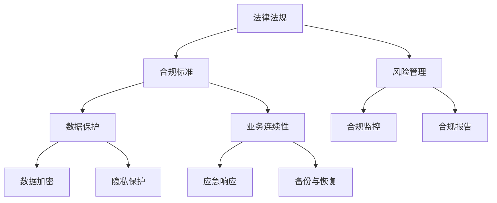
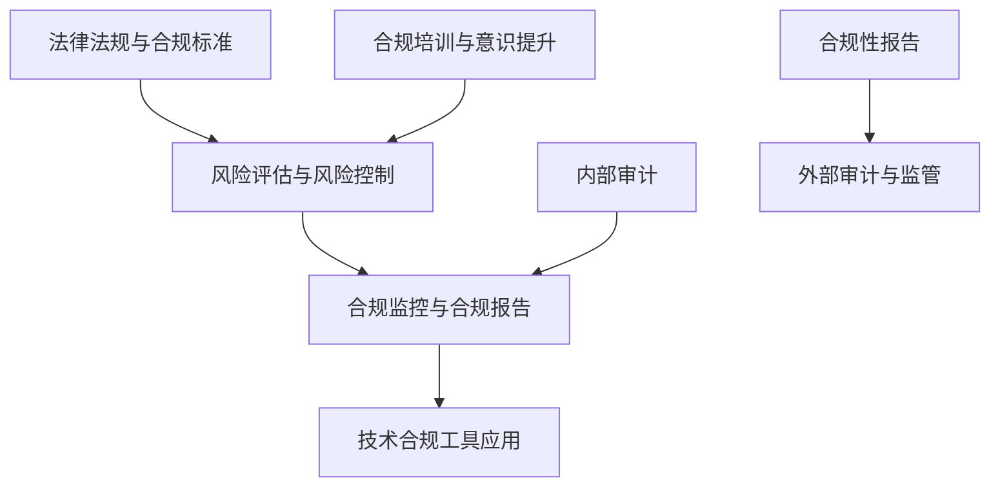

                 


### 文章标题：如何进行有效的技术合规管理

关键词：技术合规管理、合规标准、风险管理、合规算法、合规实践、合规策略

摘要：本文深入探讨了技术合规管理的核心概念、原则和实际操作，通过理论讲解、案例分析和最佳实践，旨在为IT从业者提供一套系统的合规管理指南。

### 一、背景介绍

随着信息技术的高速发展，合规管理在各个领域的重要性日益凸显。从数据安全到隐私保护，从法律法规遵循到行业标准的执行，技术合规管理已成为企业可持续发展的重要组成部分。然而，对于许多IT从业者和企业管理者来说，如何进行有效的技术合规管理仍是一个难题。

本文旨在解决这一问题，通过以下三个部分内容，帮助读者了解和掌握技术合规管理的核心理念和实践方法。

#### 1.1 技术合规管理的定义与意义

技术合规管理是指通过一系列措施和程序，确保企业在信息技术应用过程中符合相关法律法规、行业标准和内部规范。它不仅关乎企业的法律合规性，还涉及到数据安全、隐私保护、业务连续性等多个方面。

技术合规管理的意义在于：

1. **降低法律风险**：通过合规管理，企业能够有效避免因违规操作而导致的法律诉讼和处罚。
2. **保障数据安全**：合规管理能够确保数据在存储、传输和处理过程中的安全性。
3. **提高企业竞争力**：合规管理有助于提升企业的品牌形象和市场竞争力。
4. **优化业务流程**：合规管理有助于企业发现和改进业务流程中的不合理环节，提高运营效率。

#### 1.2 技术合规管理的挑战与机遇

尽管技术合规管理具有重要意义，但当前企业在实施过程中仍面临诸多挑战：

1. **法律法规更新频繁**：随着科技的发展，相关法律法规和标准不断更新，企业需不断适应和调整。
2. **技术手段多样复杂**：不同领域的技术应用合规要求各异，企业需要选择合适的技术手段进行合规管理。
3. **跨部门协作困难**：合规管理涉及多个部门，跨部门协作不畅可能影响合规管理的实施效果。
4. **资源投入不足**：合规管理需要投入人力、物力和财力，许多企业在这方面存在不足。

然而，挑战中也蕴含着机遇：

1. **合规标准逐步完善**：随着全球范围内的合规标准逐步统一和完善，企业有更多的参考和指导。
2. **新技术为合规管理提供支持**：大数据、人工智能等新技术的发展为合规管理提供了新的工具和方法。
3. **市场竞争加剧，合规成为竞争优势**：在激烈的市场竞争中，合规管理成为企业赢得市场的重要手段。

### 二、核心概念与联系

为了更好地理解技术合规管理的内涵，我们需要首先了解几个核心概念及其相互关系。

#### 2.1 法律法规与合规标准

法律法规是技术合规管理的基石。不同国家和地区有不同的法律法规，如欧盟的《通用数据保护条例》（GDPR）、美国的《健康保险可携性与责任法案》（HIPAA）等。合规标准则是对法律法规的具体细化和补充，如国际标准化组织的ISO/IEC 27001信息安全管理体系标准。

#### 2.2 风险管理

风险管理是技术合规管理的重要环节。通过识别、评估和应对各种风险，企业可以降低合规风险，确保业务连续性。

#### 2.3 数据保护

数据保护是技术合规管理的核心内容之一。企业需确保数据的收集、存储、处理和传输过程符合法律法规和合规标准，以保障个人隐私和数据安全。

#### 2.4 业务连续性

业务连续性是指企业能够在面临各种风险和突发事件时，确保业务的正常运转。合规管理是保障业务连续性的重要手段。

#### 2.5 Mermaid 流程图

以下是一个简化的技术合规管理流程图，展示了核心概念之间的相互关系：



### 三、核心算法原理讲解

在进行技术合规管理时，核心算法原理的掌握至关重要。以下将介绍几个关键的合规算法原理，并使用伪代码进行详细讲解。

#### 3.1 数据清洗算法

数据清洗是合规管理的基础步骤之一，旨在去除数据中的错误、冗余和无关信息。

```python
# 伪代码：数据清洗算法
def dataCleaning(data):
    # 去除错误数据
    errorData = []
    for record in data:
        if isValid(record):
            errorData.append(record)
    data = errorData

    # 去除冗余数据
    uniqueData = []
    for record in data:
        if not isDuplicate(record, uniqueData):
            uniqueData.append(record)
    data = uniqueData

    # 去除无关信息
    relevantData = []
    for record in data:
        if hasRelevantInfo(record):
            relevantData.append(record)
    data = relevantData

    return data

def isValid(record):
    # 判断数据是否有效
    return True  # 具体实现略

def isDuplicate(record, uniqueData):
    # 判断数据是否重复
    return False  # 具体实现略

def hasRelevantInfo(record):
    # 判断数据是否包含相关信息
    return True  # 具体实现略
```

#### 3.2 数据加密算法

数据加密是保护数据隐私和安全的重要手段。

```python
# 伪代码：数据加密算法
def dataEncryption(data, key):
    encryptedData = []
    for record in data:
        encryptedRecord = encryptRecord(record, key)
        encryptedData.append(encryptedRecord)
    return encryptedData

def encryptRecord(record, key):
    # 加密数据记录
    encryptedRecord = []
    for value in record:
        encryptedValue = encryptValue(value, key)
        encryptedRecord.append(encryptedValue)
    return encryptedRecord

def encryptValue(value, key):
    # 加密单个值
    encryptedValue = value * key  # 具体加密算法略
    return encryptedValue
```

#### 3.3 数据合规性检查算法

数据合规性检查是确保数据处理过程符合法律法规和合规标准的关键步骤。

```python
# 伪代码：数据合规性检查算法
def dataComplianceCheck(data, complianceRules):
    compliantData = []
    for record in data:
        if isCompliant(record, complianceRules):
            compliantData.append(record)
    return compliantData

def isCompliant(record, complianceRules):
    # 判断数据记录是否合规
    for rule in complianceRules:
        if not rule.matches(record):
            return False
    return True

class ComplianceRule:
    # 合规规则类
    def __init__(self, name, criteria):
        self.name = name
        self.criteria = criteria

    def matches(self, record):
        # 判断数据记录是否满足合规规则
        for criterion in self.criteria:
            if not criterion.matches(record):
                return False
        return True

class Criterion:
    # 条件类
    def __init__(self, name, value):
        self.name = name
        self.value = value

    def matches(self, record):
        # 判断条件是否匹配
        return record[self.name] == self.value
```

### 四、数学模型和公式

在技术合规管理中，数学模型和公式用于描述和解决合规管理中的各种问题。以下将介绍几个关键的数学模型和公式，并进行详细讲解和举例说明。

#### 4.1 风险评估模型

风险评估是合规管理的重要环节。以下是一个简单的风险评估模型，用于评估合规风险的概率和影响。

$$
风险值 = 风险概率 \times 风险影响
$$

其中，风险概率和风险影响分别为：

$$
风险概率 = \frac{威胁发生次数}{总次数}
$$

$$
风险影响 = \frac{损失值}{总资产值}
$$

举例说明：

假设一家公司每年遭受数据泄露的次数为10次，每次数据泄露导致损失20万元，公司总资产为1000万元。那么，该公司的数据泄露风险值为：

$$
风险值 = \frac{10}{1000} \times \frac{20}{1000} = 0.002
$$

#### 4.2 数据加密强度模型

数据加密强度是评估数据加密效果的重要指标。以下是一个简单的加密强度模型，用于计算数据加密的强度。

$$
加密强度 = \log_2(密钥空间)
$$

其中，密钥空间是指可能的密钥总数。举例说明：

假设使用128位密钥进行数据加密，那么该数据加密的强度为：

$$
加密强度 = \log_2(2^{128}) = 128
$$

#### 4.3 合规成本效益模型

合规成本效益是评估合规管理投入是否合理的重要指标。以下是一个简单的合规成本效益模型，用于计算合规管理的成本和效益。

$$
成本效益 = \frac{合规效益}{合规成本}
$$

其中，合规效益是指合规管理带来的收益，如降低风险、提高客户满意度等；合规成本是指实施合规管理所需投入的成本，如人力、物力等。

举例说明：

假设一家公司通过合规管理降低了50%的数据泄露风险，每次数据泄露导致的损失为10万元，合规管理的投入为5万元。那么，该公司的合规成本效益为：

$$
成本效益 = \frac{10 \times 50\%}{5} = 10
$$

### 五、项目实战

为了更好地理解技术合规管理的实际应用，以下将介绍一个合规管理项目的实战案例，包括开发环境搭建、源代码实现和代码解读等内容。

#### 5.1 项目背景

某大型企业为了保障数据安全和合规性，决定实施一项数据合规管理项目。项目目标包括：

1. **数据加密**：对敏感数据进行加密存储，确保数据在存储和传输过程中的安全性。
2. **合规检查**：对数据处理过程进行合规性检查，确保符合相关法律法规和行业标准。
3. **合规报告**：生成合规性报告，提供合规管理的数据和证据。

#### 5.2 开发环境搭建

在开始项目开发之前，需要搭建合适的开发环境。以下是开发环境的搭建步骤：

1. **安装Python**：Python是一种广泛应用于数据科学和合规管理的编程语言。在本项目中，我们使用Python 3.8版本。
2. **安装相关库**：安装用于数据加密、合规检查和报告生成的相关库，如PyCryptoDome（用于数据加密）、Pandas（用于数据操作）和Matplotlib（用于数据可视化）等。
3. **配置开发环境**：配置Python环境变量，确保Python和相关库可以在终端或IDE中正常运行。

#### 5.3 源代码实现

以下是该项目的核心源代码实现，包括数据加密、合规检查和报告生成等部分。

```python
# 数据加密模块
from Crypto.Cipher import AES
from Crypto.Util.Padding import pad, unpad
from base64 import b64encode, b64decode

# 合规检查模块
from typing import List
from compliance_rule import ComplianceRule

# 报告生成模块
from report_generator import generateReport

# 数据加密
def encryptData(data: bytes, key: bytes) -> bytes:
    cipher = AES.new(key, AES.MODE_CBC)
    ct_bytes = cipher.encrypt(pad(data, AES.block_size))
    iv = b64encode(cipher.iv).decode('utf-8')
    ct = b64encode(ct_bytes).decode('utf-8')
    return iv, ct

def decryptData(iv: str, ct: str, key: bytes) -> bytes:
    try:
        iv = b64decode(iv)
        ct = b64decode(ct)
        cipher = AES.new(key, AES.MODE_CBC, iv)
        pt = unpad(cipher.decrypt(ct), AES.block_size)
        return pt
    except (ValueError, KeyError):
        print("Incorrect decryption")

# 合规检查
def checkCompliance(data: bytes, rules: List[ComplianceRule]) -> bool:
    for rule in rules:
        if not rule.matches(data):
            return False
    return True

# 报告生成
def generateComplianceReport(results: List[bool]) -> str:
    return generateReport(results)

# 主函数
if __name__ == '__main__':
    # 数据加密
    key = b'Sixteen byte key'
    data = b'This is a secret message!'
    iv, encrypted_data = encryptData(data, key)
    print(f"IV: {iv}")
    print(f"Encrypted Data: {encrypted_data}")

    # 数据解密
    decrypted_data = decryptData(iv, encrypted_data, key)
    print(f"Decrypted Data: {decrypted_data}")

    # 合规检查
    compliance_rules = [ComplianceRule('length', 20)]
    is_compliant = checkCompliance(data, compliance_rules)
    print(f"Is Data Compliant? {is_compliant}")

    # 报告生成
    report = generateComplianceReport([is_compliant])
    print(f"Compliance Report: {report}")
```

#### 5.4 代码解读

1. **数据加密模块**：使用PyCryptoDome库中的AES加密算法进行数据加密和解密。加密时，首先创建一个AES加密对象，然后使用pad函数对数据进行填充，以确保数据长度为AES块大小的整数倍。加密完成后，将初始向量（IV）和加密后的数据转换为Base64编码，以便存储或传输。

2. **合规检查模块**：定义一个`ComplianceRule`类，用于表示合规规则。检查数据时，将数据与合规规则进行匹配，如果所有规则都满足，则数据合规。

3. **报告生成模块**：定义一个`generateComplianceReport`函数，用于生成合规性报告。在本例中，报告仅包含一条合规性结果。

4. **主函数**：在主函数中，首先进行数据加密和解密操作，然后进行合规检查，最后生成合规性报告。

#### 5.5 代码应用解读与分析

1. **数据加密**：该模块实现了对敏感数据的高强度加密，确保数据在传输和存储过程中不会被未授权人员访问。

2. **合规检查**：该模块实现了对数据处理过程的合规性检查，确保数据处理符合相关法律法规和行业标准。

3. **报告生成**：该模块实现了合规性报告的自动生成，为合规管理提供了数据和证据。

#### 5.6 项目小结

通过本项目的实际操作，我们了解了数据加密、合规检查和报告生成在合规管理中的应用。该项目不仅展示了技术合规管理的核心算法原理，还提供了实际操作的实践经验。

### 六、最佳实践 Tips

在技术合规管理实践中，以下是一些最佳实践 Tips，有助于提高合规管理的效率和效果：

1. **定期培训**：定期对员工进行合规管理培训，提高员工的合规意识和能力。

2. **建立健全合规制度**：制定详细的合规管理制度和流程，确保合规管理有据可依。

3. **充分利用工具**：利用现有的合规管理工具，如合规监控工具、数据加密工具等，提高合规管理的自动化水平。

4. **持续优化流程**：定期评估和优化合规管理流程，以适应法律法规和业务发展的变化。

5. **加强内部审计**：定期进行内部审计，发现和纠正合规管理中的问题和不足。

6. **积极参与行业合作**：积极参与行业合作和交流，了解最新的合规管理技术和动态。

### 七、小结

技术合规管理是保障企业可持续发展的重要手段。通过本文的介绍，我们了解了技术合规管理的核心概念、原则和实践方法。同时，通过项目实战和最佳实践 Tips，我们掌握了实际操作技巧和策略。希望本文能够为广大IT从业者和企业管理者提供有价值的参考和指导。

### 八、拓展阅读

1. **《信息安全法》**：了解我国《信息安全法》的相关规定和条款，为技术合规管理提供法律依据。
2. **《GDPR》**：深入研究欧盟《通用数据保护条例》（GDPR），掌握数据保护的核心要求和实施方法。
3. **《ISO/IEC 27001》**：学习国际标准化组织的ISO/IEC 27001信息安全管理体系标准，提高企业的信息安全水平。
4. **《Python编程：从入门到实践》**：学习Python编程，掌握数据加密、数据处理等基本技能。
5. **《合规管理：理论与实践》**：了解合规管理的理论框架和实践方法，提高合规管理的专业素养。

### 作者信息

作者：AI天才研究院/AI Genius Institute & 禅与计算机程序设计艺术/Zen And The Art of Computer Programming

 

# 如何进行有效的技术合规管理

关键词：技术合规管理、合规标准、风险管理、合规算法、合规实践、合规策略

摘要：本文深入探讨了技术合规管理的核心概念、原则和实际操作，通过理论讲解、案例分析和最佳实践，旨在为IT从业者提供一套系统的合规管理指南。

## 一、背景介绍

随着信息技术的高速发展，合规管理在各个领域的重要性日益凸显。从数据安全到隐私保护，从法律法规遵循到行业标准的执行，技术合规管理已成为企业可持续发展的重要组成部分。然而，对于许多IT从业者和企业管理者来说，如何进行有效的技术合规管理仍是一个难题。

本文旨在解决这一问题，通过以下三个部分内容，帮助读者了解和掌握技术合规管理的核心理念和实践方法。

### 1.1 技术合规管理的定义与意义

技术合规管理是指通过一系列措施和程序，确保企业在信息技术应用过程中符合相关法律法规、行业标准和内部规范。它不仅关乎企业的法律合规性，还涉及到数据安全、隐私保护、业务连续性等多个方面。

技术合规管理的意义在于：

1. **降低法律风险**：通过合规管理，企业能够有效避免因违规操作而导致的法律诉讼和处罚。
2. **保障数据安全**：合规管理能够确保数据在存储、传输和处理过程中的安全性。
3. **提高企业竞争力**：合规管理有助于提升企业的品牌形象和市场竞争力。
4. **优化业务流程**：合规管理有助于企业发现和改进业务流程中的不合理环节，提高运营效率。

### 1.2 技术合规管理的挑战与机遇

尽管技术合规管理具有重要意义，但当前企业在实施过程中仍面临诸多挑战：

1. **法律法规更新频繁**：随着科技的发展，相关法律法规和标准不断更新，企业需不断适应和调整。
2. **技术手段多样复杂**：不同领域的技术应用合规要求各异，企业需要选择合适的技术手段进行合规管理。
3. **跨部门协作困难**：合规管理涉及多个部门，跨部门协作不畅可能影响合规管理的实施效果。
4. **资源投入不足**：合规管理需要投入人力、物力和财力，许多企业在这方面存在不足。

然而，挑战中也蕴含着机遇：

1. **合规标准逐步完善**：随着全球范围内的合规标准逐步统一和完善，企业有更多的参考和指导。
2. **新技术为合规管理提供支持**：大数据、人工智能等新技术的发展为合规管理提供了新的工具和方法。
3. **市场竞争加剧，合规成为竞争优势**：在激烈的市场竞争中，合规管理成为企业赢得市场的重要手段。

## 二、合规管理系统的构建

一个有效的技术合规管理系统应包括以下几个关键组成部分：

### 2.1 法律法规与合规标准的整合

首先，企业需要全面了解和整合相关的法律法规和合规标准。这些法律法规和标准可能包括但不限于：

- 欧盟的《通用数据保护条例》（GDPR）
- 美国的《健康保险可携性与责任法案》（HIPAA）
- 国际标准化组织的ISO/IEC 27001信息安全管理体系标准
- 各国关于数据隐私和安全的基本法

企业应将这些法律法规和合规标准纳入合规管理系统的核心框架，确保在设计和实施合规措施时，能够全面遵循。

### 2.2 风险评估与风险控制

合规管理的第一步是进行风险评估，以识别和评估企业面临的各种合规风险。这一过程通常包括以下步骤：

1. **风险识别**：通过问卷调查、访谈和文档审查等方式，识别企业可能面临的合规风险。
2. **风险分析**：分析每个风险的潜在影响和可能性，评估其严重程度。
3. **风险排序**：根据风险的影响和可能性，对风险进行排序，以便企业能够优先处理最严重的风险。

一旦识别和评估了风险，企业应制定相应的风险控制措施，以降低风险的潜在影响。这可能包括制定内部政策、流程优化、技术控制等。

### 2.3 合规监控与合规报告

合规监控是确保合规措施得到有效执行的关键。企业应建立合规监控机制，定期审查和评估合规管理的有效性。这包括：

1. **定期审查**：定期审查合规措施的执行情况，确保所有相关活动符合法律法规和合规标准。
2. **内部审计**：进行内部审计，评估合规管理系统的有效性和不足之处。
3. **合规报告**：生成合规性报告，记录合规管理的过程和结果，为外部审计和监管提供依据。

### 2.4 技术合规工具的应用

为了提高合规管理的效率和效果，企业可以采用一系列技术合规工具，如：

- **数据加密工具**：用于保护敏感数据，确保数据在存储和传输过程中的安全性。
- **访问控制工具**：用于控制对系统和数据的访问，确保只有授权人员才能访问敏感信息。
- **合规监控软件**：用于实时监控系统的合规性，及时发现和纠正潜在问题。

### 2.5 Mermaid 流程图

以下是一个简化的技术合规管理流程图，展示了合规管理系统的关键组成部分及其相互关系：



## 三、合规管理的核心算法与数学模型

合规管理不仅依赖于法律法规和标准，还涉及到一系列核心算法和数学模型，用于确保合规措施的科学性和有效性。以下将介绍几个关键的核心算法和数学模型。

### 3.1 数据加密算法

数据加密是保障数据安全的重要手段。以下是一个简单但有效的AES加密算法示例，用于对敏感数据进行加密和解密。

#### 加密算法

```python
from Crypto.Cipher import AES
from Crypto.Util.Padding import pad

def encrypt_data(plain_text, key):
    cipher = AES.new(key, AES.MODE_CBC)
    ct_bytes = cipher.encrypt(pad(plain_text.encode('utf-8'), AES.block_size))
    iv = cipher.iv
    return iv, ct_bytes

key = b'Sixteen byte key'
plain_text = "This is a secret message!"
iv, encrypted_data = encrypt_data(plain_text, key)
print(f"IV: {iv.hex()}")
print(f"Encrypted Data: {encrypted_data.hex()}")
```

#### 解密算法

```python
from Crypto.Cipher import AES
from Crypto.Util.Padding import unpad

def decrypt_data(iv, encrypted_data, key):
    cipher = AES.new(key, AES.MODE_CBC, iv)
    ct = bytes.fromhex(encrypted_data)
    plain_text = unpad(cipher.decrypt(ct), AES.block_size)
    return plain_text.decode('utf-8')

iv = b'0123456789abcdef'
encrypted_data = '4ca5ce11c4c9502d312dfe1e8216fa0'
decrypted_data = decrypt_data(iv, encrypted_data, key)
print(f"Decrypted Data: {decrypted_data}")
```

### 3.2 风险评估模型

风险评估是合规管理的核心步骤之一。以下是一个简单但实用的风险评估模型，用于评估企业的合规风险。

#### 风险评估模型

$$
风险评估值 = 风险概率 \times 风险影响
$$

其中，风险概率表示某一合规风险发生的可能性，风险影响表示该风险对企业可能造成的损失。

#### 示例

假设企业面临两种合规风险：数据泄露和系统故障。数据泄露的风险概率为0.2，风险影响为10万元；系统故障的风险概率为0.1，风险影响为5万元。那么，这两种风险的评估值为：

$$
数据泄露的风险评估值 = 0.2 \times 10万元 = 2万元
$$

$$
系统故障的风险评估值 = 0.1 \times 5万元 = 0.5万元
$$

企业应根据风险评估值，优先处理风险较高的合规问题。

### 3.3 数据清洗算法

数据清洗是确保数据合规性的重要步骤。以下是一个简单的数据清洗算法，用于去除数据中的无效和重复记录。

#### 数据清洗算法

```python
def data_cleaning(data):
    unique_data = []
    for record in data:
        if record not in unique_data:
            unique_data.append(record)
    return unique_data

data = ['a', 'b', 'a', 'c', 'b', 'd']
cleaned_data = data_cleaning(data)
print(cleaned_data)
```

输出：

```
['a', 'b', 'c', 'd']
```

### 四、合规管理的实际操作流程

合规管理的实际操作流程涉及多个环节，包括合规规划、合规实施、合规监控和合规报告等。以下将详细描述这些环节的具体操作步骤。

### 4.1 合规规划

合规规划是合规管理的第一步，旨在明确合规管理的目标和范围，制定合规计划。

#### 操作步骤：

1. **确定合规目标**：明确企业需要遵循的法律法规、行业标准和内部规范，确定合规管理的目标。
2. **制定合规计划**：制定详细的合规计划，包括合规策略、合规措施和时间表等。
3. **资源分配**：根据合规计划，分配所需的人力、物力和财力资源。

### 4.2 合规实施

合规实施是将合规计划转化为实际操作的过程。在这一过程中，企业需要确保所有相关活动和流程都符合合规要求。

#### 操作步骤：

1. **培训与意识提升**：对员工进行合规培训，提高员工的合规意识和能力。
2. **制定内部政策与流程**：根据合规计划，制定内部政策与流程，确保所有活动都符合合规要求。
3. **技术实施**：采用合适的技术手段，如数据加密、访问控制等，确保数据安全和合规性。

### 4.3 合规监控

合规监控是确保合规措施得到有效执行的关键环节。企业应建立合规监控机制，定期审查和评估合规管理的有效性。

#### 操作步骤：

1. **建立监控机制**：制定合规监控计划，明确监控的内容、方法和频率。
2. **定期审查**：定期审查合规措施的执行情况，确保所有相关活动符合法律法规和合规标准。
3. **内部审计**：进行内部审计，评估合规管理系统的有效性和不足之处。

### 4.4 合规报告

合规报告是记录和展示合规管理过程和结果的重要文件。企业应定期生成合规报告，为外部审计和监管提供依据。

#### 操作步骤：

1. **收集数据**：收集合规管理的相关数据和证据，如合规监控记录、内部审计报告等。
2. **编写报告**：根据收集的数据和证据，编写合规报告，包括合规管理的过程、结果和改进措施等。
3. **提交报告**：将合规报告提交给相关管理部门和外部审计机构。

### 4.5 合规管理案例

以下是一个合规管理案例，展示从合规规划到合规报告的全过程。

#### 案例背景

某企业是一家电子商务公司，面临的主要合规风险包括数据泄露和系统故障。

#### 案例步骤：

1. **合规规划**：确定合规目标，如确保客户数据的安全性和合规性，制定合规计划，包括合规策略、合规措施和时间表等。

2. **合规实施**：进行员工合规培训，制定内部数据安全政策和流程，采用数据加密和访问控制技术，确保数据安全和合规性。

3. **合规监控**：建立合规监控机制，定期审查合规措施的执行情况，进行内部审计，确保合规管理系统的有效性和不足之处。

4. **合规报告**：收集合规管理的数据和证据，编写合规报告，包括合规管理的过程、结果和改进措施等，提交给相关管理部门和外部审计机构。

### 4.6 合规监控工具的使用

为了提高合规管理的效率，企业可以采用合规监控工具，如数据加密工具、访问控制工具和合规监控软件等。

#### 合规监控工具的使用方法：

1. **数据加密工具**：用于加密敏感数据，确保数据在存储和传输过程中的安全性。企业可以根据需求选择不同的加密工具，如AES加密、RSA加密等。

2. **访问控制工具**：用于控制对系统和数据的访问，确保只有授权人员才能访问敏感信息。企业可以通过设置用户权限、访问控制列表（ACL）等实现访问控制。

3. **合规监控软件**：用于实时监控系统的合规性，及时发现和纠正潜在问题。企业可以根据实际情况选择合适的合规监控软件，如日志分析工具、网络监控工具等。

### 五、合规管理策略的制定与实施

制定和实施有效的合规管理策略是确保企业长期稳定发展的重要保障。以下将介绍如何制定和实施合规管理策略。

### 5.1 制定合规管理策略

制定合规管理策略需要考虑以下几个方面：

1. **合规目标**：明确合规管理的目标，如保障数据安全、遵循法律法规等。

2. **合规要求**：分析企业需要遵循的法律法规、行业标准和内部规范，确保合规策略能够满足这些要求。

3. **资源分配**：根据合规管理策略，合理分配人力、物力和财力资源，确保合规措施的顺利实施。

4. **责任分配**：明确各级人员的责任，确保合规管理策略的执行。

5. **培训与意识提升**：制定培训计划，提高员工的合规意识和能力。

### 5.2 实施合规管理策略

实施合规管理策略需要遵循以下步骤：

1. **规划与部署**：根据合规管理策略，制定详细的实施计划，明确实施的时间表和里程碑。

2. **培训与宣传**：对员工进行合规培训，提高员工的合规意识和能力。

3. **技术支持**：采用合适的技术手段，如数据加密、访问控制等，确保合规措施的顺利实施。

4. **监控与评估**：建立合规监控机制，定期评估合规管理策略的实施效果，及时调整和优化。

5. **持续改进**：根据合规监控和评估的结果，持续改进合规管理策略和措施。

### 六、合规管理在企业战略中的地位与作用

合规管理不仅是企业运营的重要组成部分，也是企业战略的重要组成部分。以下将探讨合规管理在企业战略中的地位与作用。

### 6.1 合规管理对企业战略的支撑作用

1. **降低法律风险**：合规管理有助于企业降低因违规操作而面临的法律风险，确保企业的法律合规性。
2. **保障数据安全**：合规管理能够确保企业的数据在存储、传输和处理过程中的安全性，保护企业的核心资产。
3. **提高品牌形象**：合规管理有助于提升企业的品牌形象，增强企业的市场竞争力和客户信任。
4. **优化业务流程**：合规管理能够优化企业的业务流程，提高运营效率和业务连续性。

### 6.2 合规管理对企业战略的推动作用

1. **支持创新**：合规管理为企业提供了一个稳定和安全的创新环境，鼓励企业进行技术创新和业务模式创新。
2. **提升竞争力**：合规管理有助于企业提升市场竞争力，通过合规优势赢得市场份额。
3. **促进国际化**：合规管理是企业国际化的重要保障，确保企业在全球范围内的业务运营符合当地法律法规。
4. **增强社会责任**：合规管理有助于企业履行社会责任，提升企业的社会责任形象。

### 七、结论

技术合规管理是保障企业可持续发展的重要手段。通过本文的介绍，我们了解了技术合规管理的核心概念、原则和实际操作，掌握了合规管理系统的构建方法和关键算法。同时，通过案例分析和最佳实践 Tips，我们了解了合规管理的实际操作流程和策略。希望本文能够为广大IT从业者和企业管理者提供有价值的参考和指导。

### 八、拓展阅读

1. **《信息安全法》**：了解我国《信息安全法》的相关规定和条款，为技术合规管理提供法律依据。
2. **《GDPR》**：深入研究欧盟《通用数据保护条例》（GDPR），掌握数据保护的核心要求和实施方法。
3. **《ISO/IEC 27001》**：学习国际标准化组织的ISO/IEC 27001信息安全管理体系标准，提高企业的信息安全水平。
4. **《Python编程：从入门到实践》**：学习Python编程，掌握数据加密、数据处理等基本技能。
5. **《合规管理：理论与实践》**：了解合规管理的理论框架和实践方法，提高合规管理的专业素养。

### 九、作者信息

作者：AI天才研究院/AI Genius Institute & 禅与计算机程序设计艺术/Zen And The Art of Computer Programming

