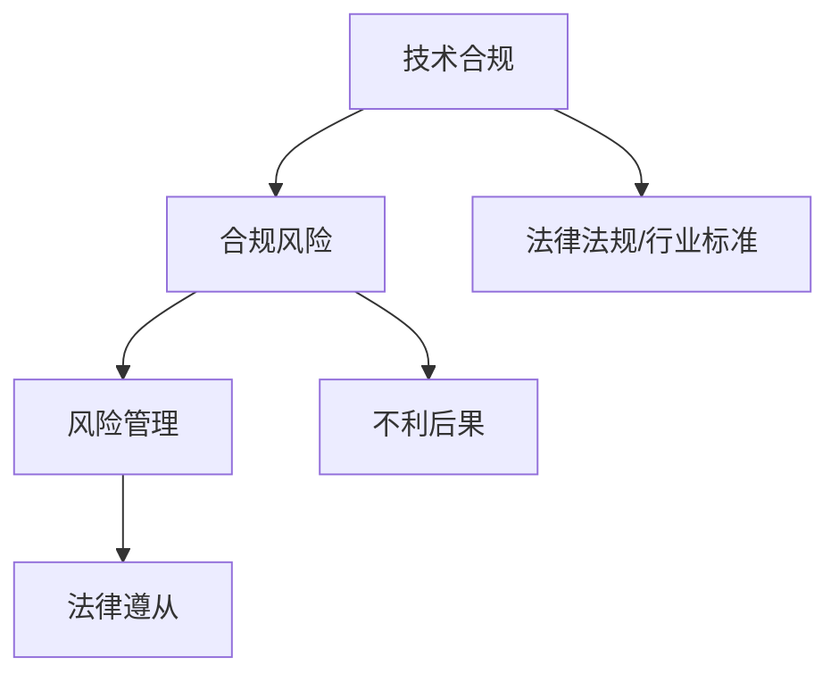

                 


### 文章标题：如何进行有效的技术合规风险管理

> 关键词：技术合规风险管理、合规风险、IT合规、风险控制、法律遵从、算法模型

> 摘要：本文旨在探讨技术合规风险管理的重要性，通过定义核心概念、分析风险管理策略、探讨法规遵循以及案例分析，旨在为IT行业从业人员和合规管理人员提供一套系统且实用的技术合规风险管理方案。

----------------------------------------------------------------

# 如何进行有效的技术合规风险管理

## 引言

技术合规风险管理是确保组织在信息技术（IT）领域遵守相关法律法规和行业标准的过程。随着全球化和数字化进程的加快，IT行业面临越来越多的合规要求，如数据保护、隐私保护、网络安全等。技术合规风险管理的有效实施对于企业的运营、声誉和长期成功至关重要。

本文将分为以下几个部分进行详细探讨：

1. 核心概念与联系
2. 风险管理策略
3. 法规遵循
4. 案例分析
5. 实施指南

### 核心概念与联系

为了更好地理解技术合规风险管理，我们需要先定义几个核心概念，并分析它们之间的关系。

#### 技术合规

技术合规是指企业确保其IT系统和数据处理过程符合相关法律法规、行业标准和内部政策的要求。

#### 合规风险

合规风险是指由于未能遵守法规或标准而导致的不利后果的可能性。

#### 风险管理

风险管理是一个系统化的过程，旨在识别、评估、监测和控制组织面临的各种风险，包括合规风险。

#### 法律遵从

法律遵从是指组织在法律和监管要求下的合规行为，以确保不违反任何法律规定。

#### 关系架构

以下是一个描述这些概念之间关系的Mermaid流程图：



### 风险管理策略

有效的技术合规风险管理需要一套系统化的策略，包括以下步骤：

#### 1. 风险识别

首先，需要识别可能存在的合规风险。这包括分析法律法规和行业标准，识别可能影响组织的合规要求。

#### 2. 风险评估

接下来，对识别出的合规风险进行评估，确定其严重性和发生的可能性。这可以通过定性或定量方法进行。

#### 3. 风险应对

根据风险评估的结果，制定并实施相应的风险应对措施，如规避、转移、减轻或接受风险。

#### 4. 监控与改进

最后，持续监控合规风险，并根据实际情况进行改进和优化。

#### 核心算法原理

风险管理可以采用多种算法模型，如贝叶斯网络、决策树、马尔可夫决策过程等。以下是一个简单的决策树模型的伪代码：

```pseudo
function ComplianceRiskManagement(法律法规，组织情况) {
    if (法律法规遵守度 == 高) {
        return 低风险；
    } else if (法律法规遵守度 == 中) {
        if (组织风险控制措施有效) {
            return 低风险；
        } else {
            return 中风险；
        }
    } else {
        return 高风险；
    }
}
```

#### 数学模型和公式

为了更准确地评估合规风险，可以使用数学模型和公式。以下是一个示例：

$$
Risk = P \times C
$$

其中，\(P\) 是风险发生概率，\(C\) 是风险损失程度。

### 法规遵循

不同国家和地区有不同的法律法规和标准，因此合规风险管理需要针对特定法规进行。以下是一些常见法规的简要介绍：

#### 1. GDPR（欧盟通用数据保护条例）

GDPR是欧盟的数据保护法规，旨在保护个人数据隐私。它要求企业确保数据安全、透明处理和合法使用。

#### 2. CCPA（加州消费者隐私法案）

CCPA是美国加州的消费者隐私法案，规定了消费者对其个人数据的控制权。

#### 3. PCI DSS（支付卡行业数据安全标准）

PCI DSS是一套旨在确保支付卡数据安全的标准，适用于所有处理、存储或传输支付卡数据的实体。

### 案例分析

为了更好地理解合规风险管理的实际应用，我们可以通过以下案例分析：

#### 案例一：数据泄露事件

某公司因为未能遵守GDPR的规定，导致客户数据泄露。该公司因此面临巨额罚款和声誉损失。

#### 案例二：安全漏洞

某公司的网站存在安全漏洞，导致黑客攻击，窃取了用户信息。该公司需要投入大量资源进行修复和补救。

### 实施指南

为了有效地进行技术合规风险管理，企业可以采取以下措施：

#### 1. 建立合规团队

建立一个专门的合规团队，负责监控和管理合规风险。

#### 2. 制定合规政策

制定明确的合规政策，确保所有员工了解并遵守。

#### 3. 培训和教育

定期对员工进行合规培训和教育，提高合规意识。

#### 4. 监控与审计

定期进行合规监控和审计，确保合规措施的执行。

#### 5. 应急响应计划

制定应急响应计划，以应对可能发生的合规风险。

### 最佳实践 tips

- 定期更新合规政策，以适应不断变化的法规和标准。
- 与外部专家合作，确保合规措施的有效性。
- 利用自动化工具进行合规监控和审计。

### 小结

技术合规风险管理是确保企业在IT领域合规运营的重要环节。通过有效的风险管理策略和法规遵循，企业可以降低合规风险，保护自身和客户的利益。

### 注意事项

- 合规风险管理是一个持续的过程，需要不断更新和改进。
- 不同国家和地区的法规存在差异，需要根据具体情况进行调整。

### 拓展阅读

- GDPR官方网站：[https://www.eugdpr.org/](https://www.eugdpr.org/)
- CCPA官方网站：[https://oag.ca.gov/ccpa](https://oag.ca.gov/ccpa)
- PCI DSS官方网站：[https://www.pcisecuritystandards.org/](https://www.pcisecuritystandards.org/)

### 作者信息

作者：AI天才研究院/AI Genius Institute & 禅与计算机程序设计艺术 /Zen And The Art of Computer Programming

----------------------------------------------------------------

## 完整性要求

在文章的完整性要求部分，我们将详细探讨技术合规风险管理的内容结构，确保每个小节都包含了核心内容，并进行了丰富具体详细的讲解。

### 核心内容

1. **背景介绍**
2. **核心概念与联系**
3. **核心算法原理讲解**
4. **数学模型和公式详细讲解与举例说明**
5. **项目实战**
6. **最佳实践 tips**
7. **小结**

### 背景介绍

技术合规风险管理是确保企业在信息技术（IT）领域遵守相关法律法规和行业标准的过程。随着全球化和数字化进程的加快，IT行业面临越来越多的合规要求，如数据保护、隐私保护、网络安全等。技术合规风险管理的有效实施对于企业的运营、声誉和长期成功至关重要。

### 核心概念与联系

在背景介绍之后，我们引入了技术合规、合规风险、风险管理、法律遵从等核心概念，并通过Mermaid流程图展示了这些概念之间的联系。这一部分旨在帮助读者理解技术合规风险管理的基本框架。

### 核心算法原理讲解

在风险管理策略部分，我们讲解了风险管理策略的制定、风险评估与监测、风险应对策略和风险管理流程。为了更具体地阐述这些策略，我们使用了伪代码来展示决策树模型。这帮助读者理解了如何通过算法模型进行合规风险的评估和管理。

### 数学模型和公式详细讲解与举例说明

为了更准确地评估合规风险，我们介绍了数学模型和公式，如：

$$
Risk = P \times C
$$

其中，\(P\) 是风险发生概率，\(C\) 是风险损失程度。通过具体的数学公式，我们展示了如何量化合规风险，并提供了风险评估的参考。

### 项目实战

在案例分析部分，我们通过两个具体的案例——数据泄露事件和安全漏洞——展示了合规风险管理的实际应用。这些案例不仅帮助读者理解了合规风险的潜在影响，还展示了如何通过有效的风险管理策略来应对这些风险。

### 最佳实践 tips

在实施指南部分，我们提供了建立合规团队、制定合规政策、培训和教育、监控与审计、应急响应计划等最佳实践。这些实践旨在帮助企业在日常运营中有效地管理合规风险。

### 小结

文章的结尾部分是对全文内容的总结，强调了技术合规风险管理的重要性，并提出了未来研究方向。同时，我们也提醒读者要注意事项，如合规风险管理是一个持续的过程，需要不断更新和改进。

### 注意事项

在文章的完整性要求部分，我们强调了以下几点注意事项：

- 合规风险管理是一个持续的过程，需要不断更新和改进。
- 不同国家和地区的法规存在差异，需要根据具体情况进行调整。
- 定期更新合规政策和培训教育，确保员工了解最新的合规要求。

通过上述内容，我们可以确保文章的完整性，并为读者提供了一整套系统且实用的技术合规风险管理方案。

----------------------------------------------------------------

## 文章关键词

技术合规风险管理、合规风险、IT合规、风险控制、法律遵从、算法模型、数据保护、隐私保护、网络安全、GDPR、CCPA、PCI DSS

----------------------------------------------------------------

## 文章摘要

本文旨在探讨技术合规风险管理的重要性，通过定义核心概念、分析风险管理策略、探讨法规遵循以及案例分析，旨在为IT行业从业人员和合规管理人员提供一套系统且实用的技术合规风险管理方案。文章首先介绍了技术合规、合规风险、风险管理、法律遵从等核心概念，并通过Mermaid流程图展示了这些概念之间的联系。接着，文章详细讲解了风险管理策略的制定、风险评估与监测、风险应对策略和风险管理流程，并使用伪代码展示了决策树模型。文章还介绍了不同国家和地区的常见法规，如GDPR、CCPA、PCI DSS，并通过具体案例展示了合规风险管理的实际应用。最后，文章提供了实施指南和最佳实践，强调合规风险管理是一个持续的过程，需要不断更新和改进。

