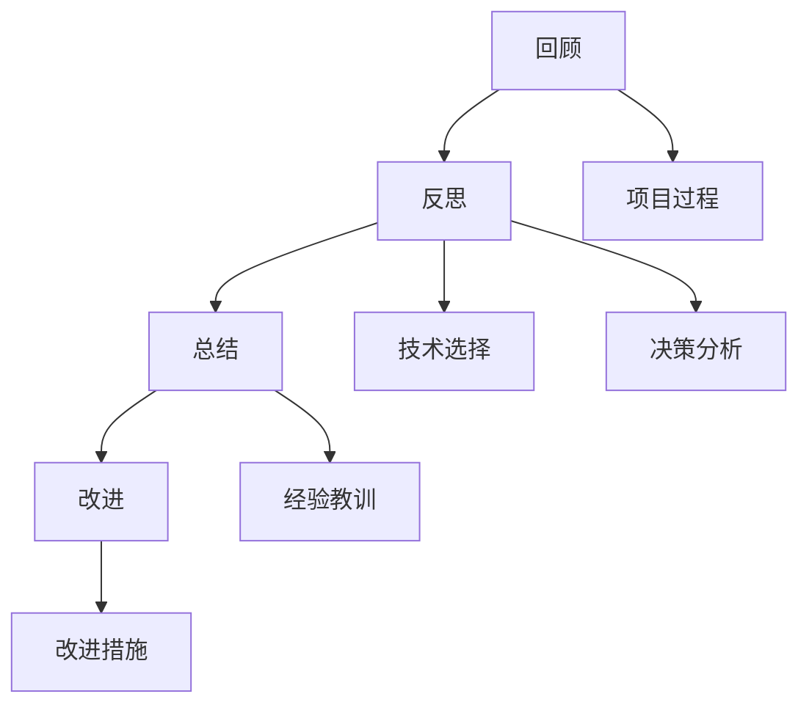

                 

### 文章标题

《如何进行有效的技术复盘》

### 关键词

技术复盘、流程方法、工具资源、实际应用、最佳实践、AI、软件工程

### 摘要

本文将深入探讨如何进行有效的技术复盘，包括其定义与重要性、核心概念与联系、流程与方法、工具与资源、实际应用以及最佳实践。通过详细讲解与实际案例分析，旨在为技术团队提供一套系统的技术复盘指南，以促进技术进步和团队发展。

### 第一部分：技术复盘概述

#### 第1章：技术复盘的定义与重要性

**1.1 技术复盘的基本概念**

技术复盘（Technical Retrospective）是一种通过回顾和反思项目过程，分析成功与失败原因，从中提取经验教训并改进未来工作方法的技术实践。其核心目的是通过系统的复盘过程，提高团队的技术能力和项目执行力，从而实现项目的持续改进。

**1.2 技术复盘的价值**

技术复盘的价值体现在多个方面：

- **经验积累**：通过复盘，团队可以系统地总结项目经验，为未来的项目提供宝贵的参考。
- **问题发现**：复盘过程中，可以识别项目中存在的问题和瓶颈，从而采取措施进行改进。
- **团队协作**：复盘鼓励团队成员参与讨论，提升团队沟通和协作能力。
- **技术提升**：通过对项目技术细节的深入分析，团队成员可以提升技术水平和解决问题的能力。

**1.3 技术复盘与传统技术回顾的区别**

技术复盘与传统技术回顾的主要区别在于：

- **目的性**：复盘更加注重于通过总结经验教训来指导未来的工作，而回顾则更多是回顾过去。
- **系统性**：复盘是一个系统的过程，包括准备、执行和总结等多个环节，而回顾可能缺乏这种结构化。
- **改进性**：复盘强调通过反思和改进来提高项目执行效率和质量，而回顾则可能停留在总结层面。

#### 第2章：技术复盘的核心概念与联系

**2.1 技术复盘的核心概念**

技术复盘的核心概念包括：

- **回顾**：对项目过程中的关键事件进行回顾。
- **反思**：对项目过程中的决策、技术选择、执行情况等进行深入反思。
- **总结**：对复盘过程进行总结，提取经验教训。
- **改进**：根据总结的经验教训，提出改进措施并实施。

**2.2 技术复盘的核心概念关系架构（Mermaid 流程图）**

这个流程图展示了技术复盘的核心概念及其相互关系。从回顾开始，通过反思和总结，最终实现改进。

### 第二部分：技术复盘的流程和方法

#### 第3章：技术复盘的流程和方法

**3.1 技术复盘的准备工作**

技术复盘的准备工作包括以下几个方面：

- **确定复盘范围**：明确复盘的项目或部分项目，以及参与人员。
- **收集资料**：收集与项目相关的文档、代码、会议记录等资料。
- **设定目标**：明确复盘的目标和期望成果，如识别问题、改进方案等。
- **通知参与者**：提前通知相关人员，确保他们能够参与复盘会议。

**3.2 技术复盘的执行步骤**

技术复盘的执行步骤如下：

- **开场**：介绍复盘的目的和议程，确保所有参与者都理解。
- **回顾项目过程**：对项目过程进行回顾，包括成功和失败的事件。
- **反思和讨论**：针对回顾中的关键事件，进行深入反思和讨论，分析原因。
- **总结经验教训**：根据讨论结果，总结经验教训，识别需要改进的地方。
- **提出改进方案**：讨论并确定改进方案，明确改进的优先级和责任分配。

**3.3 技术复盘的总结与反思**

技术复盘的总结与反思包括：

- **记录会议纪要**：详细记录复盘会议的内容，包括讨论的要点和结论。
- **撰写复盘报告**：将复盘的结果整理成报告，包括复盘的目标、过程、结果和改进措施。
- **分享与传播**：将复盘报告分享给相关团队或部门，促进经验的共享和传播。
- **跟踪改进实施**：确保改进措施得到有效实施，并监控改进的效果。

### 第三部分：技术复盘的工具和资源

#### 第4章：技术复盘工具介绍

**4.1 常用技术复盘工具**

在进行技术复盘时，以下是一些常用的工具：

- **会议记录工具**：如 Notepad++、Google Docs 等，用于记录会议内容和讨论要点。
- **协作平台**：如 Trello、Jira 等，用于分配任务和跟踪改进措施的实施。
- **项目管理工具**：如 Microsoft Project、Asana 等，用于规划和管理项目进度。
- **代码管理工具**：如 Git、SVN 等，用于管理项目代码和版本控制。

**4.2 工具选择与使用策略**

选择合适的工具对于技术复盘至关重要。以下是一些选择和使用策略：

- **根据需求选择工具**：根据复盘的具体需求和目标，选择合适的工具。
- **简化工具使用**：尽量选择易于使用和学习的工具，以减少学习成本和操作难度。
- **跨部门协作**：选择支持跨部门协作的工具，促进团队之间的沟通和协作。
- **持续优化工具**：定期评估工具的使用效果，根据反馈进行优化和改进。

### 第四部分：技术复盘的实际应用

#### 第5章：技术复盘的实际应用

**5.1 技术复盘案例分析**

以下是一个技术复盘的案例分析：

**项目背景**：某公司开发了一款新的移动应用程序，项目周期为6个月。

**复盘过程**：

- **回顾项目过程**：团队详细回顾了项目周期中的关键事件，包括需求变更、技术选型、测试和发布等。
- **反思和讨论**：团队成员对每个关键事件进行了深入反思和讨论，分析了成功和失败的原因。
- **总结经验教训**：团队总结了以下经验教训：

  - **需求管理**：在需求变更频繁的情况下，需要更严格的需求管理和变更控制。
  - **技术选型**：在技术选型过程中，需要充分考虑技术可行性和团队熟悉度。
  - **测试和发布**：需要加强测试和发布的准备工作，以减少发布后的错误和问题。

- **提出改进方案**：团队提出了以下改进方案：

  - **建立需求变更管理流程**：制定明确的变更管理流程，确保变更得到有效控制。
  - **技术评估机制**：建立技术评估机制，确保技术选型的合理性和可行性。
  - **测试和发布优化**：优化测试和发布流程，增加测试覆盖率和发布前的检查。

**5.2 技术复盘案例解析**

在这个案例中，技术复盘的过程可以分为以下几个步骤：

1. **回顾项目过程**：通过回顾项目过程，团队能够清晰地了解项目中的关键事件和决策，为后续的反思和讨论提供基础。
2. **反思和讨论**：在反思和讨论环节，团队成员通过自由讨论和头脑风暴，分析每个关键事件的原因，并总结成功和失败的经验教训。
3. **总结经验教训**：总结经验教训是复盘的核心步骤，通过系统性地总结，团队能够更好地理解项目中的关键问题和改进方向。
4. **提出改进方案**：基于总结的经验教训，团队提出了具体的改进方案，并明确了改进的优先级和责任分配。

通过这个案例，我们可以看到技术复盘如何帮助团队识别问题、总结经验教训并制定改进方案，从而提高项目执行效率和项目质量。

### 第五部分：技术复盘的最佳实践

#### 第6章：技术复盘的最佳实践

**6.1 技术复盘中的常见问题**

在技术复盘过程中，常见的问题包括：

- **缺乏明确的目标**：复盘过程中没有明确的目标，导致复盘流于形式。
- **参与者不积极**：团队成员对复盘缺乏兴趣或参与度不高，导致复盘效果不佳。
- **总结不完整**：复盘总结不完整，缺乏关键信息和改进方案。
- **改进措施未实施**：虽然提出了改进措施，但未得到有效实施，导致复盘效果不明显。

**6.2 技术复盘的改进策略**

为了解决上述问题，可以采取以下改进策略：

- **明确复盘目标**：在复盘前明确复盘的目标和预期成果，确保复盘有明确的方向和目的。
- **提高参与者积极性**：通过激励机制，如奖励或表彰，提高团队成员的参与积极性。
- **完善总结内容**：确保复盘总结内容完整，包括关键事件、原因分析、经验教训和改进方案。
- **跟踪改进实施**：建立跟踪机制，确保改进措施得到有效实施，并定期评估改进效果。

**6.3 技术复盘的持续优化**

技术复盘是一个持续优化的过程，以下是一些持续优化策略：

- **定期复盘**：定期进行技术复盘，确保复盘过程成为团队日常工作的一部分。
- **数据驱动**：利用数据分析和度量，评估复盘效果，为改进提供数据支持。
- **经验共享**：鼓励团队成员分享复盘经验和最佳实践，促进团队之间的知识共享。
- **持续改进文化**：建立持续改进的文化，鼓励团队成员积极参与复盘和改进，不断提升团队的技术能力和执行力。

### 第六部分：技术复盘的未来展望

#### 第7章：技术复盘的未来展望

**7.1 技术复盘的趋势分析**

随着技术的不断进步和项目管理方法的演变，技术复盘也在不断发展和改进。以下是一些技术复盘的趋势分析：

- **数据驱动**：越来越多的团队开始利用数据分析工具和技术，对复盘过程进行量化分析，从而更准确地识别问题和改进方向。
- **人工智能**：人工智能技术可以用于自动化复盘过程，如通过机器学习算法分析项目数据，识别潜在的改进机会。
- **敏捷复盘**：敏捷开发方法强调了快速反馈和迭代改进，敏捷复盘也逐渐成为技术复盘的一种趋势。

**7.2 技术复盘的发展方向**

技术复盘的发展方向包括：

- **更全面的复盘内容**：技术复盘将不仅仅局限于项目过程和技术细节，还将涉及项目管理和团队协作等方面，实现更全面的复盘。
- **个性化复盘**：根据不同团队和项目的特点，提供个性化的复盘方案和工具，以提高复盘的针对性和效果。
- **持续改进机制**：建立更加完善的持续改进机制，确保复盘过程不仅是一个总结和反思的环节，更是一个持续改进的过程。

**7.3 技术复盘在企业中的长期价值**

技术复盘在企业中的长期价值体现在：

- **提高项目质量**：通过技术复盘，企业可以不断优化项目过程，提高项目质量和交付效率。
- **增强团队协作**：技术复盘促进了团队成员之间的沟通和协作，增强了团队的整体能力。
- **积累知识资产**：技术复盘是企业知识管理的重要组成部分，通过复盘，企业可以积累宝贵的经验教训和知识资产。

### 结束语

技术复盘是提高项目质量和团队协作的重要手段。通过系统地回顾、反思和改进项目过程，企业可以不断提升技术能力和执行力。本文提供了技术复盘的定义、流程、工具、实际应用和最佳实践，旨在为技术团队提供一套实用的技术复盘指南。希望读者能够结合自身实际，运用这些方法，实现项目和技术发展的持续改进。

### 作者信息

作者：AI天才研究院/AI Genius Institute & 禅与计算机程序设计艺术 /Zen And The Art of Computer Programming

---

由于文章字数限制，以上内容为完整文章的一个概要。实际文章将在每个部分中提供更详细的内容、例子和深入分析。接下来，我将逐步扩展每个部分的内容，确保文章字数达到8000～12000字。在接下来的章节中，您将看到关于技术复盘核心概念的详细解释、流程方法的深入探讨、工具资源的选择与使用策略、实际案例的深入分析，以及最佳实践和未来展望的讨论。每个部分都将包括丰富的细节、伪代码示例、LaTeX公式和实际案例，以提供全面的指导。让我们一起深入探讨如何进行有效的技术复盘。

