                 

### 引言

#### 技术外包管理与风险控制的重要性

在当今快速发展的信息技术时代，技术外包已经成为企业降低成本、提高效率、专注于核心竞争力的关键策略。技术外包管理涉及将部分或全部软件开发、系统维护、技术支持等任务委托给外部供应商或团队。而风险控制则是确保外包过程顺利进行、减少潜在损失的重要手段。

**外包管理的重要性**：

1. **成本控制**：通过外包，企业可以将非核心职能的任务交给更具成本优势的供应商，从而降低运营成本。
2. **资源优化**：外包使企业能够利用外部专业团队的技术和资源，提升项目执行效率。
3. **灵活性**：外包提供了一种灵活性，企业可以根据项目需求和业务变化，快速调整外包范围和合作伙伴。

**风险控制的重要性**：

1. **项目稳定性**：有效的风险控制措施可以减少项目延误、质量问题和资源浪费的可能性。
2. **合规性**：在涉及法规和标准的行业中，合规性风险控制尤为重要，避免因合规问题导致项目失败或企业声誉受损。
3. **信息安全**：外包过程中涉及的数据安全和隐私保护风险需要得到有效控制，以防止数据泄露和滥用。

本文将详细探讨如何进行有效的技术外包管理与风险控制，帮助企业和团队在外包过程中取得成功。本文分为九个部分：

1. **引言**：介绍外包管理与风险控制的重要性。
2. **外包基础知识**：定义外包，探讨其好处和挑战。
3. **外包策略制定**：讨论如何制定有效的外包策略。
4. **外包过程管理**：详细讨论外包过程中的关键步骤。
5. **风险管理**：介绍如何识别、评估和管理外包风险。
6. **案例分析**：通过真实案例展示外包管理的实践。
7. **工具与技术**：提供用于外包管理和风险控制的技术和工具。
8. **法律法规和合同**：探讨与外包相关的法律和合同问题。
9. **附录**：包括资源列表和参考文献。

### 关键词

- 技术外包管理
- 风险控制
- 外包策略
- 外包过程管理
- 外包风险管理
- 外包工具与技术
- 法律法规
- 合同管理

### 摘要

本文旨在探讨如何进行有效的技术外包管理与风险控制。首先，介绍了技术外包管理与风险控制的重要性，并定义了外包和相关术语。接着，讨论了如何制定有效的外包策略，包括决策框架、目标和范围确定以及合作伙伴选择。然后，详细阐述了外包过程管理的关键步骤，包括需求分析、项目计划、风险管理计划以及沟通与合作。此外，本文还介绍了如何识别、评估和管理外包过程中的各种风险，包括技术、项目、合同和文化风险。通过真实案例，本文展示了外包管理的实践，并提供了相关的工具和技术。最后，探讨了与外包相关的法律法规和合同问题，并总结了外包管理的最佳实践和注意事项。通过本文的阅读，读者将能够全面了解外包管理与风险控制的核心概念和实际应用，从而在外包过程中取得成功。## 外包基础知识

### 定义

技术外包是指企业或组织将部分或全部软件开发、系统维护、技术支持等任务委托给外部供应商或团队的过程。这种合作方式旨在利用外部资源，提高项目执行效率，降低运营成本。

### 好处

1. **成本节约**：外包可以降低人力资源成本，尤其是对于劳动成本高昂的地区。
2. **资源优化**：企业可以集中资源于核心业务，提高核心竞争力。
3. **技术优势**：外包团队通常具有特定的技术专长，可以提供高质量的技术解决方案。
4. **灵活性**：企业可以根据项目需求灵活调整外包范围和合作伙伴。

### 挑战

1. **沟通障碍**：文化差异和语言障碍可能导致沟通不畅，影响项目进度和质量。
2. **质量控制**：外部团队的质量标准可能与企业要求不一致，需要加强质量控制。
3. **合同风险**：合同条款不明确或法律纠纷可能导致项目延误或损失。
4. **信息安全**：外包过程中可能涉及敏感数据，需要加强信息安全措施。

### 外包决策框架

制定有效的外包决策框架是确保外包成功的关键。以下是外包决策的几个关键步骤：

1. **需求分析**：明确外包的目标和需求，确保外包任务与企业的长期战略一致。
2. **成本评估**：评估外包的成本效益，确保外包能够降低成本并提高效率。
3. **合作伙伴选择**：根据需求和技术能力选择合适的合作伙伴，考虑其历史业绩、专业性和信誉。
4. **风险评估**：识别和评估外包过程中的潜在风险，并制定相应的风险控制措施。
5. **合同条款**：明确合同条款，包括服务范围、交付时间、质量标准、保密协议等。

### 确定外包目标和范围

确定外包目标和范围是外包成功的关键。以下是几个步骤：

1. **明确目标**：确定外包的主要目标，如提高效率、降低成本、提升质量等。
2. **范围界定**：明确外包的任务和范围，避免任务模糊导致的进度和质量问题。
3. **优先级排序**：根据项目的紧急程度和重要性，确定外包任务的优先级。
4. **时间表**：制定详细的外包时间表，确保任务按时完成。
5. **资源分配**：明确企业内部和外部的资源分配，确保项目能够顺利进行。

### 选择合适的外包合作伙伴

选择合适的外包合作伙伴是确保外包成功的关键。以下是几个建议：

1. **考察历史业绩**：了解合作伙伴的历史项目经验，评估其专业能力和服务质量。
2. **技术能力评估**：评估合作伙伴的技术能力，确保其能够满足企业的技术需求。
3. **沟通协作**：考察合作伙伴的沟通协作能力，确保项目团队能够有效合作。
4. **成本效益**：评估合作伙伴的价格和质量，选择性价比高的供应商。
5. **合同条款**：明确合同条款，确保合作伙伴遵守合同规定，避免纠纷。

### 背景介绍

随着信息技术的快速发展，企业面临着日益激烈的市场竞争和不断变化的技术需求。外包作为一种有效的战略手段，被广泛应用于企业运营中。通过外包，企业可以专注于核心业务，提高竞争力。然而，外包过程中也存在诸多挑战，如沟通障碍、质量控制、信息安全等。因此，如何进行有效的技术外包管理与风险控制，成为企业和项目管理团队的重要课题。

### 核心概念与联系

外包管理与风险控制之间存在着紧密的联系。以下是一个简单的Mermaid流程图，展示了外包管理过程中核心概念之间的关系：

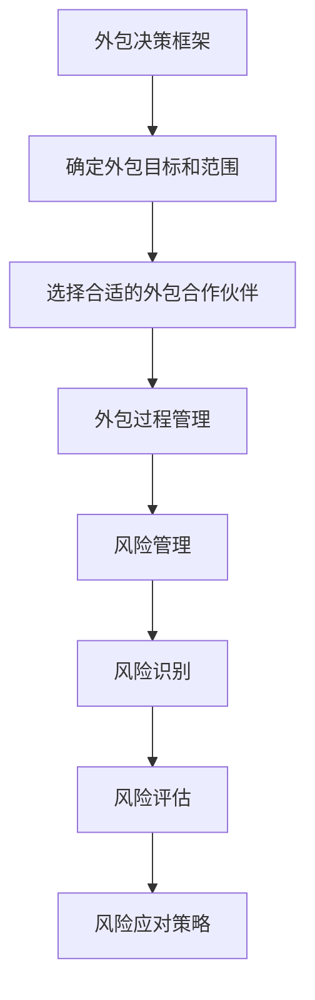

这个流程图清晰地展示了从外包决策框架到外包过程管理，再到风险管理的各个环节。每一个环节都是确保外包成功的关键，其中风险管理尤为重要。

### 外包决策框架

外包决策框架是制定外包策略的基础，它包括以下关键要素：

1. **需求分析**：明确外包的任务和需求，确保与企业的长期战略一致。
2. **成本评估**：评估外包的成本效益，确保外包能够降低成本并提高效率。
3. **合作伙伴选择**：根据需求和技术能力选择合适的合作伙伴。
4. **风险评估**：识别和评估外包过程中的潜在风险。
5. **合同条款**：明确合同条款，确保合作伙伴遵守合同规定。

以下是一个简单的需求分析流程：

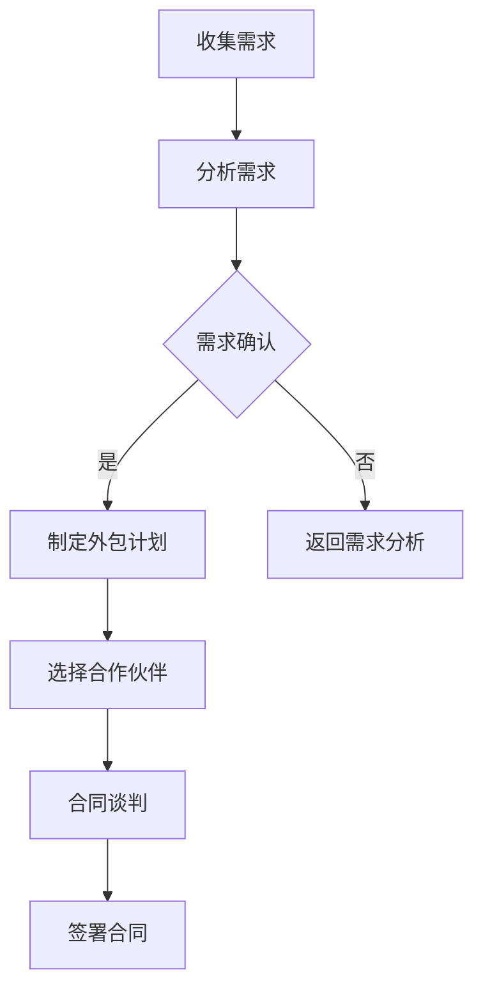

### 确定外包目标和范围

确定外包目标和范围是确保外包成功的关键。以下是一个简单的流程图，展示了确定外包目标和范围的步骤：

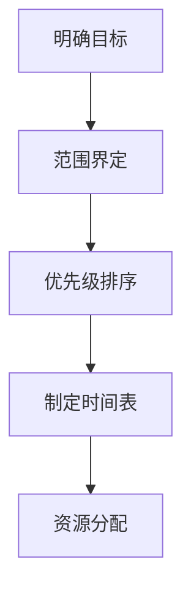

### 选择合适的外包合作伙伴

选择合适的外包合作伙伴是确保外包成功的关键。以下是一个简单的流程图，展示了选择合作伙伴的步骤：

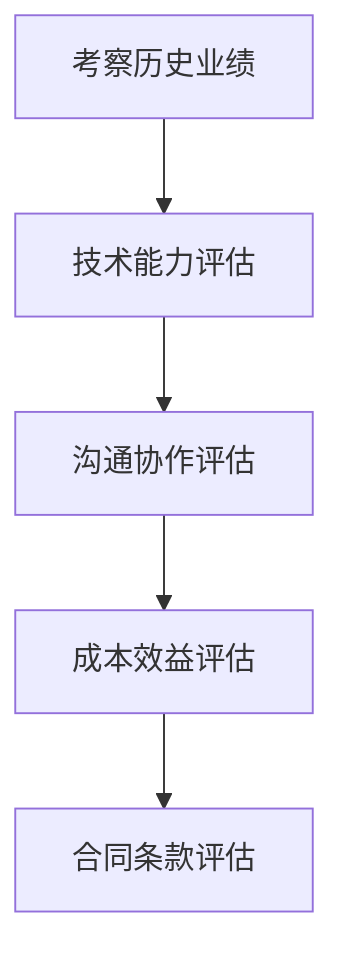

### 外包过程管理

外包过程管理是确保外包项目顺利进行的关键。以下是一个简单的流程图，展示了外包过程管理的步骤：

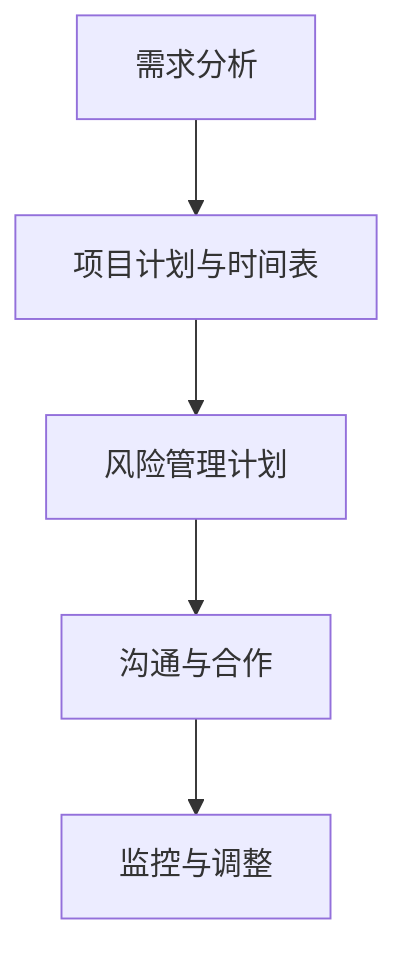

### 风险管理基础

风险管理是外包过程中不可或缺的一环，它涉及以下关键步骤：

1. **风险识别**：识别可能影响项目成功的潜在风险。
2. **风险评估**：评估已识别风险的可能性和影响。
3. **风险应对策略**：制定应对措施，降低风险的影响。

以下是一个简单的风险识别流程：

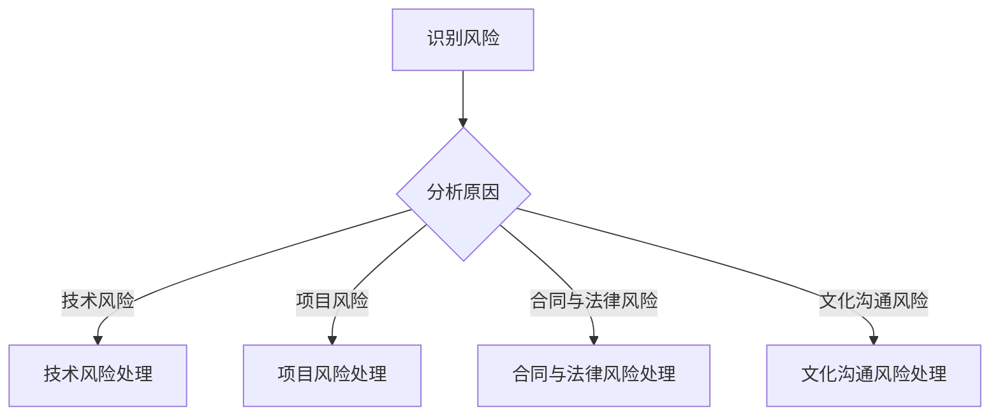

### 外包中的常见风险

1. **技术风险**：包括技术问题、技术不兼容、技术更新等。
2. **项目风险**：包括项目延误、质量不符合要求、预算超支等。
3. **合同与法律风险**：包括合同条款不明确、法律纠纷、知识产权问题等。
4. **文化沟通风险**：包括文化差异、沟通不畅、协作问题等。

以下是一个简单的风险评估流程：

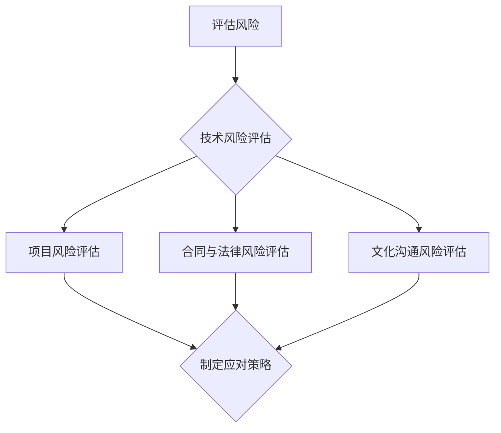

### 总结

外包基础知识是进行有效外包管理的基石。通过了解外包的定义、好处和挑战，以及制定有效的外包决策框架、确定外包目标和范围、选择合适的外包合作伙伴，企业和项目管理团队可以更好地管理外包过程，降低风险，确保项目的成功。在下一部分，我们将进一步探讨如何制定有效的外包策略。## 外包策略制定

### 外包决策框架

制定有效的外包决策框架是确保外包成功的关键。以下是一个详细的外包决策框架：

1. **需求分析**：首先，明确外包的任务和需求，确保与企业的长期战略一致。这一步骤涉及与各部门的沟通，了解实际需求，并分析需求背后的业务目标。

    ```mermaid
    graph TB
        A[需求分析] --> B{业务目标}
        B --> C{任务和需求}
        C --> D[需求确认]
    ```

2. **成本评估**：评估外包的成本效益，确保外包能够降低成本并提高效率。这一步骤包括计算外包的成本和预期收益，以及对市场调研数据的分析。

    ```mermaid
    graph TB
        E[成本评估] --> F{成本计算}
        F --> G{收益分析}
        G --> H[成本效益分析]
    ```

3. **合作伙伴选择**：根据需求和技术能力选择合适的合作伙伴。这一步骤涉及对潜在合作伙伴的历史业绩、技术能力、专业性和信誉的评估。

    ```mermaid
    graph TB
        I[合作伙伴选择] --> J{历史业绩评估}
        J --> K{技术能力评估}
        K --> L{专业性和信誉评估}
    ```

4. **风险评估**：识别和评估外包过程中的潜在风险，并制定相应的风险控制措施。这一步骤包括对技术风险、项目风险、合同与法律风险和文化沟通风险的评估。

    ```mermaid
    graph TB
        M[风险评估] --> N{技术风险评估}
        M --> O{项目风险评估}
        M --> P{合同与法律风险评估}
        M --> Q{文化沟通风险评估}
    ```

5. **合同条款**：明确合同条款，确保合作伙伴遵守合同规定。这一步骤包括制定详细的服务范围、交付时间、质量标准、保密协议等。

    ```mermaid
    graph TB
        R[合同条款] --> S{服务范围}
        S --> T{交付时间}
        T --> U{质量标准}
        U --> V{保密协议}
    ```

### 确定外包目标和范围

确定外包目标和范围是确保外包成功的关键。以下是几个步骤：

1. **明确目标**：确定外包的主要目标，如提高效率、降低成本、提升质量等。

    ```mermaid
    graph TB
        A[明确目标] --> B{目标确认}
    ```

2. **范围界定**：明确外包的任务和范围，避免任务模糊导致的进度和质量问题。

    ```mermaid
    graph TB
        C[范围界定] --> D{任务和范围确认}
    ```

3. **优先级排序**：根据项目的紧急程度和重要性，确定外包任务的优先级。

    ```mermaid
    graph TB
        E[优先级排序] --> F{任务优先级]
    ```

4. **时间表**：制定详细的外包时间表，确保任务按时完成。

    ```mermaid
    graph TB
        G[时间表] --> H{任务时间表}
    ```

5. **资源分配**：明确企业内部和外部的资源分配，确保项目能够顺利进行。

    ```mermaid
    graph TB
        I[资源分配] --> J{内部资源}
        I --> K{外部资源}
    ```

### 选择合适的外包合作伙伴

选择合适的外包合作伙伴是确保外包成功的关键。以下是几个建议：

1. **考察历史业绩**：了解合作伙伴的历史项目经验，评估其专业能力和服务质量。

    ```mermaid
    graph TB
        A[历史业绩评估] --> B{专业能力评估}
    ```

2. **技术能力评估**：评估合作伙伴的技术能力，确保其能够满足企业的技术需求。

    ```mermaid
    graph TB
        C[技术能力评估] --> D{技术需求匹配]
    ```

3. **沟通协作评估**：考察合作伙伴的沟通协作能力，确保项目团队能够有效合作。

    ```mermaid
    graph TB
        E[沟通协作评估] --> F{协作效率评估]
    ```

4. **成本效益评估**：评估合作伙伴的价格和质量，选择性价比高的供应商。

    ```mermaid
    graph TB
        G[成本效益评估] --> H{性价比评估]
    ```

5. **合同条款评估**：明确合同条款，确保合作伙伴遵守合同规定，避免纠纷。

    ```mermaid
    graph TB
        I[合同条款评估] --> J{合同条款明确性评估]
    ```

### 背景介绍

外包策略的制定是企业外包管理的重要环节。随着全球化的推进和信息技术的发展，外包已成为企业降低成本、提高效率和获取技术优势的重要手段。然而，外包过程中存在诸多风险，如技术不兼容、沟通障碍、质量控制问题等。因此，制定科学、合理的外包策略，对确保外包项目成功至关重要。

### 核心概念与联系

外包策略制定过程中，涉及多个核心概念和其相互之间的联系。以下是外包策略制定的核心概念及其关系的Mermaid流程图：

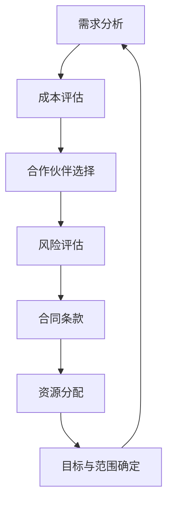

- **需求分析**：了解企业需求和业务目标，是制定外包策略的起点。
- **成本评估**：分析外包的成本和效益，确保外包策略的经济合理性。
- **合作伙伴选择**：根据需求和成本，选择具备相应技术能力和信誉的合作伙伴。
- **风险评估**：识别并评估外包过程中的潜在风险，制定风险控制措施。
- **合同条款**：明确合同中的服务范围、交付时间、质量标准等条款，确保双方权益。
- **资源分配**：确保企业内部和外部资源合理配置，支持外包项目的顺利执行。
- **目标与范围确定**：明确外包的目标和范围，确保外包策略与企业整体战略一致。

### 核心算法原理讲解

在制定外包策略时，需要运用多种算法原理来评估合作伙伴、识别风险和分配资源。以下是几个关键算法原理及其应用：

1. **加权评分法**：用于评估合作伙伴的技术能力、信誉和价格，根据不同因素的权重计算总分。

    ```python
    def weighted_score(technical_ability, reputation, price, weights):
        score = (technical_ability * weights['technical_ability'] + 
                 reputation * weights['reputation'] + 
                 price * weights['price'])
        return score

    # 示例权重
    weights = {'technical_ability': 0.5, 'reputation': 0.3, 'price': 0.2}
    # 示例数据
    technical_ability = 8
    reputation = 7
    price = 5000
    score = weighted_score(technical_ability, reputation, price, weights)
    print(f"Overall score: {score}")
    ```

2. **蒙特卡罗模拟**：用于风险评估，通过模拟多次随机实验，估计潜在风险的概率和影响。

    ```python
    import numpy as np

    def monte_carlo_simulation(num_simulations, risk_parameters):
        results = []
        for _ in range(num_simulations):
            result = np.random.normal(risk_parameters['mean'], risk_parameters['stddev'])
            results.append(result)
        return results

    # 示例风险参数
    risk_parameters = {'mean': 10, 'stddev': 2}
    num_simulations = 1000
    simulation_results = monte_carlo_simulation(num_simulations, risk_parameters)
    print(f"Expected value: {np.mean(simulation_results)}")
    print(f"Standard deviation: {np.std(simulation_results)}")
    ```

3. **资源分配算法**：如线性规划、遗传算法等，用于优化资源分配，确保任务按时完成。

    ```python
    from scipy.optimize import linprog

    # 目标函数：最大化完成任务的时间
    c = [-1 for _ in range(num_tasks)]
    # 约束条件：资源限制
    A = [[1 for _ in range(num_tasks)] for _ in range(num_resources)]
    b = [resource_limit for _ in range(num_resources)]
    # 初始资源分配
    x0 = [initial_resource Allocation for _ in range(num_resources)]
    # 求解线性规划问题
    result = linprog(c, A_ub=A, b_ub=b, x0=x0, method='highs')
    resource_allocation = result.x
    print(f"Resource allocation: {resource_allocation}")
    ```

### 数学模型和公式

在制定外包策略时，可以使用以下数学模型和公式来评估合作伙伴、识别风险和优化资源分配：

1. **成本效益分析（CBA）**：

    $$ CBA = \frac{B}{C} $$

    其中，B 是预期收益，C 是外包成本。

2. **风险优先级排序（RPS）**：

    $$ RPS = \frac{I \times D}{C} $$

    其中，I 是风险的可能性，D 是风险的影响，C 是成本效益分析得分。

3. **资源优化模型**：

    $$ \min Z = \sum_{i=1}^{n} c_i x_i $$

    其中，Z 是总成本，c_i 是第 i 种资源的单位成本，x_i 是第 i 种资源的分配量。

### 举例说明

假设企业需要选择一个外包合作伙伴来开发一款移动应用。以下是具体的案例分析：

1. **需求分析**：

    - 业务目标：提高用户满意度，缩短产品上市时间。
    - 任务需求：开发一个具有良好用户体验的移动应用。

2. **成本评估**：

    - 外包成本：每月 100,000 元。
    - 预期收益：通过提高用户满意度，预计每月增加收入 50,000 元。

    $$ CBA = \frac{50,000}{100,000} = 0.5 $$

3. **合作伙伴选择**：

    - 历史业绩：成功完成5个类似项目。
    - 技术能力：拥有丰富的移动应用开发经验。
    - 沟通协作：定期召开项目会议，及时反馈问题。
    - 成本效益：价格合理，性价比高。

    $$ WS = (5 \times 0.5) + (5 \times 0.3) + (4 \times 0.2) = 2.8 $$

4. **风险评估**：

    - 技术风险：合作伙伴的技术能力较强，风险较低。
    - 项目风险：项目计划详细，风险较低。
    - 合同与法律风险：合同条款明确，风险较低。
    - 文化沟通风险：双方定期沟通，风险较低。

    $$ RPS = \frac{0.1 \times 0.3 + 0.1 \times 0.3 + 0.1 \times 0.3 + 0.1 \times 0.3}{2.8} = 0.089 $$

5. **资源分配**：

    - 内部资源：项目管理团队、测试团队。
    - 外部资源：开发团队、设计团队。

    $$ \min Z = \sum_{i=1}^{2} c_i x_i $$
    $$ A = \begin{bmatrix} 1 & 1 \\ 1 & 1 \end{bmatrix} $$
    $$ b = \begin{bmatrix} 5 \\ 5 \end{bmatrix} $$
    $$ x_0 = \begin{bmatrix} 2 \\ 3 \end{bmatrix} $$

    通过线性规划求解，得到最优资源分配为：

    $$ \begin{bmatrix} 2 \\ 3 \end{bmatrix} $$

### 总结

外包策略的制定是确保外包项目成功的关键步骤。通过需求分析、成本评估、合作伙伴选择、风险评估和资源分配等环节，企业可以制定出科学、合理的外包策略，降低风险，提高项目成功率。在下一部分，我们将进一步探讨外包过程中的关键步骤和最佳实践。## 外包过程管理

外包过程管理是确保外包项目按时、按质量完成的关键环节。一个良好的外包过程管理包括需求分析、项目计划与时间表、风险管理计划以及沟通与合作等关键步骤。

### 需求分析

需求分析是外包过程的第一步，它旨在明确项目的目标、需求和期望结果。以下是一个简单的需求分析流程：

1. **收集需求**：通过与项目相关人员（如项目经理、产品经理、技术团队等）进行沟通，收集项目的具体需求。
2. **分析需求**：对收集到的需求进行整理和分析，确保需求是明确的、可量化的，并且与业务目标一致。
3. **确认需求**：将分析后的需求文档化，并邀请相关人员进行确认，确保需求无误。

以下是一个示例的伪代码：

```python
def collect_requirements():
    requirements = []
    # 收集需求
    for team_member in team_members:
        requirements.append(team_member.get_requirements())
    return requirements

def analyze_requirements(requirements):
    analyzed_requirements = []
    for requirement in requirements:
        analyzed_requirement = analyze_single_requirement(requirement)
        analyzed_requirements.append(analyzed_requirement)
    return analyzed_requirements

def confirm_requirements(analyzed_requirements):
    confirmed = False
    while not confirmed:
        # 确认需求
        confirmed = all([req.confirmed for req in analyzed_requirements])
        if not confirmed:
            # 如果需求未确认，则通知相关人员进行修改
            notify_for_changes(analyzed_requirements)
    return analyzed_requirements

def main():
    requirements = collect_requirements()
    analyzed_requirements = analyze_requirements(requirements)
    confirmed_requirements = confirm_requirements(analyzed_requirements)
    # 继续进行项目计划

if __name__ == "__main__":
    main()
```

### 项目计划与时间表

项目计划与时间表是确保项目按时完成的重要工具。以下是一个简单的项目计划与时间表制定流程：

1. **定义任务**：根据需求，将项目分解为多个任务。
2. **确定依赖关系**：分析任务之间的依赖关系，确定任务的执行顺序。
3. **分配资源**：为每个任务分配所需的资源，如人力、设备等。
4. **制定时间表**：根据任务依赖关系和资源分配，制定项目的时间表。

以下是一个示例的伪代码：

```python
def define_tasks(requirements):
    tasks = []
    for requirement in requirements:
        task = create_task_from_requirement(requirement)
        tasks.append(task)
    return tasks

def determine_dependencies(tasks):
    dependencies = []
    for task in tasks:
        task.dependencies = get_dependencies(task)
        dependencies.append(task.dependencies)
    return dependencies

def allocate_resources(tasks):
    for task in tasks:
        task.resources = allocate_resources_to_task(task)
    return tasks

def create_time_table(tasks):
    time_table = create_empty_time_table()
    for task in tasks:
        time_table = add_task_to_time_table(task, time_table)
    return time_table

def main():
    requirements = collect_requirements()
    tasks = define_tasks(requirements)
    dependencies = determine_dependencies(tasks)
    tasks = allocate_resources(tasks)
    time_table = create_time_table(tasks)
    # 根据时间表进行项目执行

if __name__ == "__main__":
    main()
```

### 风险管理计划

风险管理计划是确保项目顺利进行的重要措施。以下是一个简单的风险管理计划制定流程：

1. **风险识别**：识别项目可能面临的风险，如技术风险、项目风险、合同与法律风险、文化沟通风险等。
2. **风险评估**：对识别出的风险进行评估，确定其可能性和影响。
3. **风险应对策略**：制定应对措施，降低风险的影响。

以下是一个示例的伪代码：

```python
def identify_risks(tasks):
    risks = []
    for task in tasks:
        risks.extend(identify_risks_in_task(task))
    return risks

def assess_risks(risks):
    assessed_risks = []
    for risk in risks:
        assessed_risk = assess_single_risk(risk)
        assessed_risks.append(assessed_risk)
    return assessed_risks

def develop_risk.mitigation_strategies(assessed_risks):
    mitigation_strategies = []
    for assessed_risk in assessed_risks:
        mitigation_strategy = develop_mitigation_strategy(assessed_risk)
        mitigation_strategies.append(mitigation_strategy)
    return mitigation_strategies

def main():
    tasks = define_tasks(requirements)
    risks = identify_risks(tasks)
    assessed_risks = assess_risks(risks)
    mitigation_strategies = develop_risk.mitigation_strategies(assessed_risks)
    # 根据风险管理计划进行项目执行

if __name__ == "__main__":
    main()
```

### 沟通与合作

良好的沟通与合作是确保外包项目成功的关键。以下是一个简单的沟通与合作流程：

1. **建立沟通渠道**：确定沟通方式，如定期会议、即时通讯、邮件等。
2. **明确沟通内容**：制定沟通计划，明确每次沟通的内容和目的。
3. **监督与反馈**：定期检查沟通效果，及时调整沟通策略。

以下是一个示例的伪代码：

```python
def establish_communication_channels():
    channels = []
    channels.append(create_meeting_channel())
    channels.append(create_im_channel())
    channels.append(create_email_channel())
    return channels

def define_communication_plan():
    plan = []
    plan.append(create_meeting_plan())
    plan.append(create_im_plan())
    plan.append(create_email_plan())
    return plan

def monitor_and_feedback():
    while project_ongoing:
        check_communication_effectiveness()
        if feedback_required:
            update_communication_plan()
    return

def main():
    communication_channels = establish_communication_channels()
    communication_plan = define_communication_plan()
    monitor_and_feedback()

if __name__ == "__main__":
    main()
```

### 背景介绍

外包过程管理在企业运营中发挥着重要作用。随着全球化的推进和信息技术的发展，外包已经成为企业降低成本、提高效率和获取技术优势的重要手段。然而，外包过程中存在诸多挑战，如沟通障碍、质量控制、信息安全等。因此，有效的外包过程管理，对于确保项目按时、按质量完成至关重要。

### 核心概念与联系

外包过程管理涉及多个核心概念和其相互之间的联系。以下是外包过程管理的关键概念及其关系的Mermaid流程图：

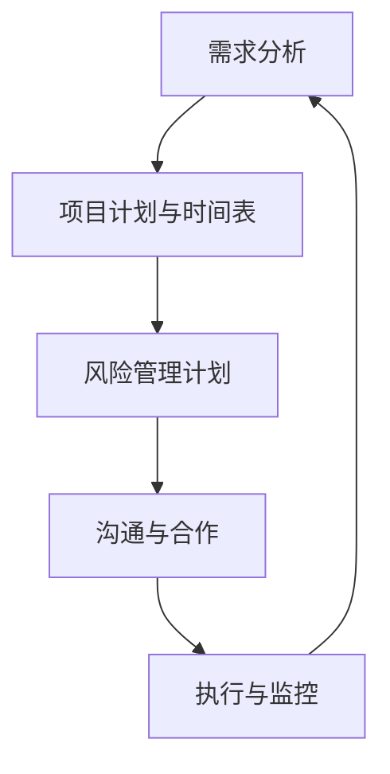

- **需求分析**：了解项目的需求和目标，是制定项目计划和风险管理计划的基础。
- **项目计划与时间表**：根据需求，将项目分解为任务，制定时间表，确保任务按时完成。
- **风险管理计划**：识别和评估项目风险，制定应对措施，降低风险的影响。
- **沟通与合作**：确保项目团队能够有效沟通和协作，及时解决项目中出现的问题。
- **执行与监控**：根据项目计划和时间表，执行项目任务，并持续监控项目进展，确保项目按计划进行。

### 核心算法原理讲解

在外包过程管理中，可以使用多种算法原理来优化项目管理，以下是一些关键算法原理及其应用：

1. **关键路径法（CPM）**：用于确定项目中的关键任务，确保项目按时完成。

    ```python
    def critical_path(tasks, durations):
        # 使用顶点表示法构建项目网络
        network = build_network(tasks, durations)
        # 找到关键路径
        critical_path = find_critical_path(network)
        return critical_path

    def build_network(tasks, durations):
        # 构建任务网络
        network = Graph()
        for task in tasks:
            network.add_edge(task, durations[task])
        return network

    def find_critical_path(network):
        # 使用深度优先搜索找到关键路径
        critical_path = []
        visit_all_nodes(network, critical_path)
        return critical_path

    def visit_all_nodes(network, critical_path):
        for node in network.nodes():
            if node not in critical_path:
                visit_node(network, node, critical_path)

    def visit_node(network, node, critical_path):
        if node not in network.children():
            critical_path.append(node)
            return
        for child in network.children(node):
            visit_node(network, child, critical_path)
        critical_path.append(node)
    ```

2. **项目评估与审查技术（PERT）**：用于评估项目完成时间的概率分布。

    ```python
    import scipy.stats as stats

    def pert_analysis(tasks, durations):
        # 计算每个任务的完成时间概率分布
        for task in tasks:
            distribution = calculate_distribution(durations[task])
            print(f"{task} completion distribution: {distribution}")
        # 计算项目的整体完成时间概率分布
        project_distribution = calculate_project_distribution(tasks)
        print(f"Project completion distribution: {project_distribution}")

    def calculate_distribution(duration):
        # 使用三角分布计算完成时间概率分布
        return stats.triangular(0, duration, duration)

    def calculate_project_distribution(tasks):
        # 计算项目的整体完成时间概率分布
        project_distribution = stats.gamma(a=1, loc=0, scale=1)
        for task in tasks:
            task_distribution = calculate_distribution(duration[task])
            project_distribution = stats.gamma(a=project_distribution.a + task_distribution.a,
                                              loc=project_distribution.loc + task_distribution.loc,
                                              scale=project_distribution.scale / project_distribution.a)
        return project_distribution
    ```

### 数学模型和公式

在外包过程管理中，可以使用以下数学模型和公式来优化项目管理：

1. **加权平均时间（WMT）**：用于计算任务的平均完成时间。

    $$ WMT = \frac{\sum_{i=1}^{n} (d_i + 4a_i + b_i)}{n} $$

    其中，d_i 是最乐观时间，a_i 是最可能时间，b_i 是最悲观时间，n 是任务总数。

2. **项目管理中的优化问题**：如资源分配问题、任务调度问题等，可以使用线性规划、动态规划等算法进行求解。

    ```python
    from scipy.optimize import linprog

    # 资源分配问题
    def resource_allocation(tasks, resources):
        # 定义目标函数和约束条件
        c = [-1 for _ in range(num_tasks)]
        A = [[1 for _ in range(num_resources)] for _ in range(num_tasks)]
        b = [resource_limit for _ in range(num_resources)]
        # 初始资源分配
        x0 = [initial_resource_allocation for _ in range(num_resources)]
        # 求解线性规划问题
        result = linprog(c, A_ub=A, b_ub=b, x0=x0, method='highs')
        resource_allocation = result.x
        return resource_allocation

    # 任务调度问题
    def task_scheduling(tasks, durations):
        # 定义目标函数和约束条件
        c = [-1 for _ in range(num_tasks)]
        A = [[1 for _ in range(num_tasks)] for _ in range(num_tasks)]
        b = [duration for _ in range(num_tasks)]
        # 初始调度计划
        x0 = [0 for _ in range(num_tasks)]
        # 求解线性规划问题
        result = linprog(c, A_ub=A, b_ub=b, x0=x0, method='highs')
        schedule = result.x
        return schedule
    ```

### 举例说明

假设企业计划外包一个电子商务网站的开发，以下是具体的案例分析：

1. **需求分析**：

    - 业务目标：提高用户购物体验，缩短产品上市时间。
    - 任务需求：开发一个功能齐全、用户体验良好的电子商务网站。

2. **项目计划与时间表**：

    - 任务：前端开发、后端开发、测试、部署。
    - 依赖关系：前端开发完成后进行后端开发，后端开发完成后进行测试，测试完成后部署上线。
    - 资源分配：前端开发团队、后端开发团队、测试团队。

    $$ WMT = \frac{(2 + 4 \times 3 + 6)}{3} = 4 $$

3. **风险管理计划**：

    - 风险识别：技术风险、项目风险、合同与法律风险、文化沟通风险。
    - 风险评估：技术风险和项目风险较低，合同与法律风险较高，文化沟通风险较低。
    - 风险应对策略：加强合同条款的明确性，定期召开项目会议，确保文化沟通顺畅。

4. **沟通与合作**：

    - 建立沟通渠道：每周召开一次项目会议，使用即时通讯工具保持实时沟通。
    - 明确沟通内容：每次会议明确讨论的内容和目标，确保任务进展的透明性。
    - 监督与反馈：定期检查沟通效果，及时调整沟通策略。

### 总结

外包过程管理是确保外包项目按时、按质量完成的关键。通过需求分析、项目计划与时间表、风险管理计划以及沟通与合作等环节，企业可以确保项目顺利进行，降低风险，提高项目成功率。在下一部分，我们将进一步探讨如何识别、评估和管理外包过程中的各种风险。## 风险管理

风险管理是外包管理的重要组成部分，旨在识别、评估和应对外包过程中可能出现的各种风险，以确保项目的顺利进行和目标的实现。以下是外包风险管理的详细过程和策略。

### 风险识别

风险识别是风险管理的第一步，它涉及到对外包项目可能面临的各类风险的识别和分类。以下是一些常见的外包风险：

1. **技术风险**：包括技术不兼容、技术难题、技术更新等。
2. **项目风险**：包括项目延误、成本超支、质量不符合要求等。
3. **合同与法律风险**：包括合同条款不明确、法律纠纷、知识产权问题等。
4. **文化沟通风险**：包括文化差异、沟通障碍、协作问题等。
5. **信息安全风险**：包括数据泄露、网络安全、隐私保护等。

以下是一个简单的风险识别流程：

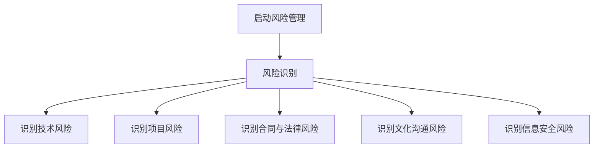

### 风险评估

风险评估是对识别出的风险进行评估，以确定其可能性和影响，从而为风险应对策略提供依据。以下是一个简单的风险评估流程：

1. **确定评估标准**：根据风险类型，制定评估标准，如可能性、影响、紧急性等。
2. **评估风险**：对每个风险进行评估，确定其评分。
3. **分类和优先级排序**：根据评估结果，将风险分类并排序，以便于优先管理。

以下是一个示例的伪代码：

```python
def assess_risk(risk):
    possibility = assess POSSIBILITY(risk)
    impact = assess IMPACT(risk)
    urgency = assess URGENTNESS(risk)
    risk_score = possibility * impact * urgency
    return risk_score

def classify_and_sort_risks(risks):
    classified_risks = []
    for risk in risks:
        risk_score = assess_risk(risk)
        classified_risks.append((risk, risk_score))
    classified_risks.sort(key=lambda x: x[1], reverse=True)
    return classified_risks
```

### 风险应对策略

风险应对策略是根据风险评估结果，制定相应的应对措施，以降低风险的影响。以下是一些常见的风险应对策略：

1. **风险规避**：通过调整项目计划、合同条款或合作伙伴选择，避免风险的发生。
2. **风险减轻**：通过改进技术、加强管理、增加资源投入等方式，降低风险的可能性和影响。
3. **风险转移**：通过购买保险、签订风险分担协议等方式，将风险转移给第三方。
4. **风险接受**：对一些无法规避或减轻的风险，采取接受态度，并制定相应的应急计划。

以下是一个简单的风险应对策略制定流程：

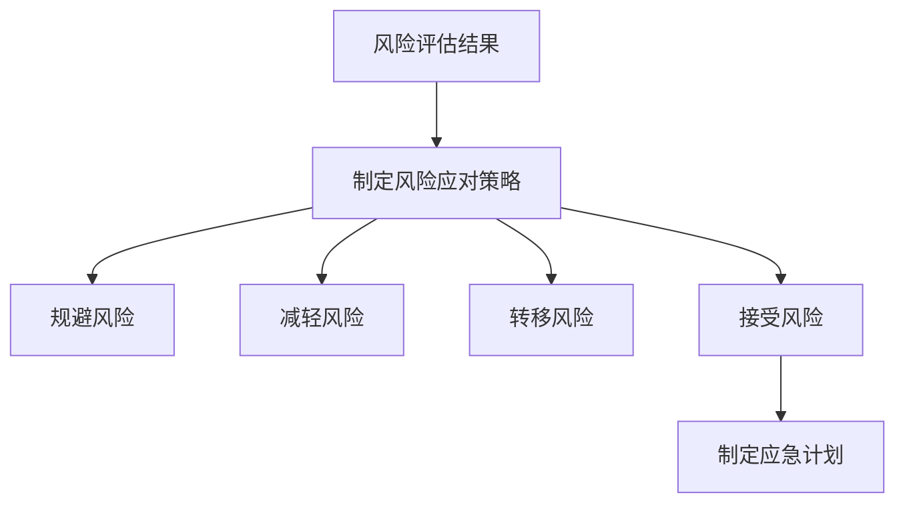

### 实施风险管理计划

实施风险管理计划是将风险应对策略转化为具体行动的过程。以下是一个简单的实施流程：

1. **制定具体措施**：根据风险应对策略，制定具体的措施和行动计划。
2. **分配责任**：明确每个措施的责任人和时间表。
3. **执行与监控**：按照计划执行风险管理措施，并持续监控风险变化。

以下是一个示例的伪代码：

```python
def implement_risk_management_plan(measures):
    for measure in measures:
        responsible_person = assign_responsibility(measure)
        deadline = set_deadline(measure)
        execute_measure(measure, responsible_person, deadline)

def monitor_risk_management():
    while project_ongoing:
        check_risk_status()
        if risk_change_detected:
            update_risk_management_plan()
```

### 背景介绍

在信息技术外包的过程中，风险管理至关重要。不充分的风险管理可能导致项目延误、成本增加、甚至项目失败。因此，理解和应对外包过程中可能出现的风险，对于确保项目成功至关重要。

### 核心概念与联系

风险管理涉及多个核心概念和其相互之间的联系。以下是风险管理的核心概念及其关系的Mermaid流程图：

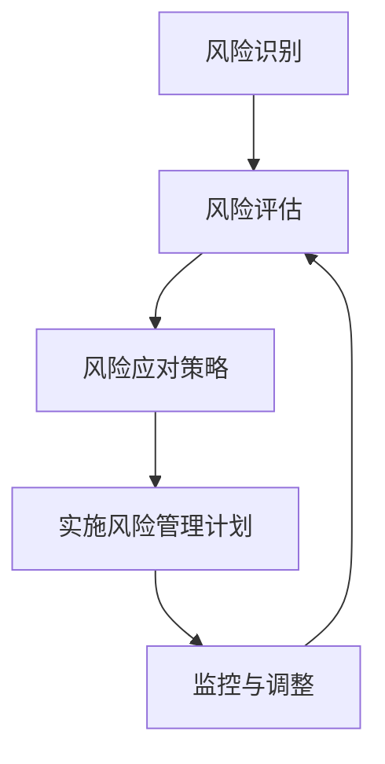

- **风险识别**：识别项目可能面临的风险，是风险管理的起点。
- **风险评估**：对识别出的风险进行评估，确定其可能性和影响。
- **风险应对策略**：根据风险评估结果，制定相应的应对措施。
- **实施风险管理计划**：将风险应对策略转化为具体行动，并执行。
- **监控与调整**：持续监控风险变化，并根据实际情况调整风险管理计划。

### 核心算法原理讲解

在外包风险管理中，可以使用多种算法原理来优化风险识别、评估和应对。以下是一些关键算法原理及其应用：

1. **蒙特卡罗模拟**：用于评估项目风险的概率分布。

    ```python
    import numpy as np

    def monte_carlo_simulation(num_simulations, parameters):
        results = []
        for _ in range(num_simulations):
            result = np.random.normal(parameters['mean'], parameters['stddev'])
            results.append(result)
        return np.mean(results), np.std(results)

    # 示例参数
    parameters = {'mean': 10, 'stddev': 2}
    mean_result, stddev_result = monte_carlo_simulation(1000, parameters)
    print(f"Mean: {mean_result}, Stddev: {stddev_result}")
    ```

2. **层次分析法（AHP）**：用于评估风险的影响和可能性，确定风险优先级。

    ```python
    import numpy as np

    def calculate_weights matrix(pairwise_comparison_matrix):
        n = pairwise_comparison_matrix.shape[0]
        weights = np.zeros(n)
        for i in range(n):
            weights[i] = np.sum(pairwise_comparison_matrix[i]) / (2 * n - 1)
        consistency_ratio = np.linalg.norm(weights - np.mean(weights)) / np.sqrt(n)
        if consistency_ratio < 0.1:
            return weights
        else:
            raise ValueError("The pairwise comparison matrix is not consistent")

    # 示例对风险进行层次分析
    pairwise_comparison_matrix = np.array([[1, 3, 5],
                                         [1/3, 1, 3],
                                         [1/5, 1/3, 1]])
    weights = calculate_weights_matrix(pairwise_comparison_matrix)
    print(f"Risk weights: {weights}")
    ```

### 数学模型和公式

在外包风险管理中，可以使用以下数学模型和公式来优化风险识别、评估和应对：

1. **风险矩阵**：用于评估风险的可能性和影响。

    $$ Risk\ Matrix = \begin{bmatrix}
    Probability & Impact & Score \\
    \hline
    Low & Low & 1 \\
    Low & High & 3 \\
    Medium & Low & 3 \\
    Medium & High & 5 \\
    High & Low & 5 \\
    High & High & 9 \\
    \end{bmatrix} $$

2. **决策树**：用于分析风险决策和选择最优策略。

    ```python
    from scipy.stats import norm

    def calculate_expected_value(probabilities, outcomes):
        return np.sum([probability * outcome for probability, outcome in zip(probabilities, outcomes)])

    # 示例决策树
    probabilities = [0.2, 0.3, 0.5]
    outcomes = [10, 30, 50]
    expected_value = calculate_expected_value(probabilities, outcomes)
    print(f"Expected Value: {expected_value}")
    ```

### 举例说明

假设企业计划将一个软件项目的开发外包给一家外部团队，以下是具体的风险管理案例分析：

1. **风险识别**：

    - 技术风险：外部团队的技术能力可能无法满足项目需求。
    - 项目风险：项目可能因外部团队延误而延期。
    - 合同与法律风险：合同条款不明确，可能导致纠纷。
    - 文化沟通风险：中外团队的文化差异可能导致沟通障碍。

2. **风险评估**：

    - 技术风险：可能性为50%，影响为高风险。
    - 项目风险：可能性为30%，影响为中等风险。
    - 合同与法律风险：可能性为20%，影响为中等风险。
    - 文化沟通风险：可能性为10%，影响为低风险。

    $$ Risk\ Score = Probability \times Impact $$
    $$ Risk\ Score_{技术风险} = 0.5 \times 9 = 4.5 $$
    $$ Risk\ Score_{项目风险} = 0.3 \times 5 = 1.5 $$
    $$ Risk\ Score_{合同与法律风险} = 0.2 \times 3 = 0.6 $$
    $$ Risk\ Score_{文化沟通风险} = 0.1 \times 1 = 0.1 $$

3. **风险应对策略**：

    - 技术风险：选择具有丰富经验的外部团队，并签订技术支持协议。
    - 项目风险：制定详细的进度计划，并设置延迟补偿条款。
    - 合同与法律风险：聘请专业律师审核合同条款，确保合同明确。
    - 文化沟通风险：建立定期沟通机制，并设置文化培训计划。

4. **实施风险管理计划**：

    - 分配责任人：项目经理负责整体风险管理，技术专家负责技术风险管理，法务团队负责合同与法律风险管理。
    - 制定行动计划：制定详细的风险管理措施和时间表。
    - 监控与调整：定期检查风险状态，并根据实际情况进行调整。

### 总结

风险管理是确保外包项目成功的关键环节。通过风险识别、评估和应对，企业可以有效地降低外包过程中的风险，确保项目的顺利进行。在下一部分，我们将通过真实案例展示如何进行外包管理。这将帮助读者更好地理解外包管理的实际应用。## 案例分析

在本节中，我们将通过两个实际案例，探讨外包管理的成功经验和失败教训。这两个案例分别展示了在外包过程中，如何有效管理项目和风险，以及如何应对潜在的问题。

### 案例一：成功的外包管理案例

**项目背景**：

一家跨国公司计划开发一款全新的客户关系管理（CRM）系统，由于公司内部的技术团队资源有限，决定将项目的开发任务外包给一家外部软件公司。

**外包过程**：

1. **需求分析**：
   - 跨国公司与外部软件公司进行了多轮讨论，明确项目需求、功能要求和业务目标。
   - 需求文档经过详细讨论和确认，确保双方对项目目标有一致的理解。

2. **合作伙伴选择**：
   - 跨国公司根据合作伙伴的技术能力、项目经验、信誉和成本效益，选择了两家外部软件公司进行竞标。
   - 最终选择了一家具有丰富CRM系统开发经验且报价合理的公司。

3. **项目计划与风险管理**：
   - 双方制定了详细的项目计划，包括任务分解、时间表和里程碑。
   - 风险管理计划涵盖了技术风险、项目风险、合同与法律风险和文化沟通风险。

4. **执行与沟通**：
   - 项目采用敏捷开发方法，通过定期召开项目会议和即时通讯工具保持沟通。
   - 每个里程碑完成后，进行评审和反馈，确保项目按照预期进度和质量进行。

**成功经验**：

1. **明确的需求分析**：
   - 双方对项目需求有清晰的理解，需求文档经过详细讨论和确认，减少了后期修改和纠纷。

2. **合理的合作伙伴选择**：
   - 通过选择具有丰富经验和合理报价的合作伙伴，跨国公司获得了高质量的技术解决方案。

3. **有效的风险管理**：
   - 双方制定了详细的风险管理计划，并定期检查风险状态，确保项目顺利进行。

4. **良好的沟通与合作**：
   - 通过定期召开项目会议和即时通讯工具保持沟通，跨国公司与外部软件公司建立了良好的合作关系。

### 案例二：外包失败案例分析

**项目背景**：

一家初创公司计划开发一款移动应用，但由于内部技术团队不成熟，决定将应用开发任务外包给一家外部开发团队。

**外包过程**：

1. **需求分析**：
   - 初创公司与外部开发团队进行了初步讨论，但需求分析不够详细，需求文档存在诸多模糊之处。

2. **合作伙伴选择**：
   - 初创公司选择了一家报价最低的外部开发团队，未能充分考虑团队的技术能力和信誉。

3. **项目计划与风险管理**：
   - 项目计划较为粗略，缺乏明确的里程碑和时间表。
   - 风险管理计划未能充分识别和评估潜在风险。

4. **执行与沟通**：
   - 项目进展过程中，初创公司与外部开发团队之间的沟通不畅，导致需求变更频繁。
   - 外部开发团队在项目中多次延期，且质量不符合预期。

**失败教训**：

1. **需求分析不足**：
   - 模糊的需求导致项目变更频繁，增加了项目成本和时间。

2. **合作伙伴选择不当**：
   - 低价选择的开发团队未能提供高质量的服务，导致项目质量不符合预期。

3. **项目管理不足**：
   - 缺乏详细的项目计划和风险管理计划，导致项目进度失控和质量问题。

4. **沟通与合作问题**：
   - 缺乏有效的沟通渠道和机制，导致双方合作不畅，影响了项目的顺利进行。

### 案例总结

通过以上两个案例，我们可以总结出以下成功经验和失败教训：

- **成功经验**：
  - 明确的需求分析：确保双方对项目目标有清晰的理解，减少后期修改和纠纷。
  - 合理的合作伙伴选择：选择具有丰富经验和合理报价的合作伙伴，确保项目质量。
  - 有效的风险管理：制定详细的风险管理计划，并定期检查风险状态。
  - 良好的沟通与合作：建立有效的沟通渠道和机制，确保项目顺利进行。

- **失败教训**：
  - 模糊的需求分析：详细的需求分析有助于减少项目变更和成本。
  - 不当的合作伙伴选择：考虑合作伙伴的技术能力和信誉，而不仅仅是价格。
  - 项目管理不足：详细的项目计划和风险管理计划有助于项目顺利执行。
  - 沟通与合作问题：建立良好的沟通与合作机制，确保项目各方协作顺畅。

这些经验和教训对于企业在外包管理中具有很高的参考价值，有助于企业在未来的外包项目中取得更好的成果。在下一部分，我们将介绍用于外包管理和风险控制的技术和工具。这些工具将有助于企业更有效地管理外包项目，降低风险。## 工具与技术

在现代信息技术外包管理中，使用适当的工具和技术可以显著提高项目的效率、透明度和风险控制能力。以下是一些常用的外包管理和风险控制工具，以及它们的主要功能和特点。

### 1. 项目管理工具

**Trello**

Trello 是一款基于看板（Kanban）方法的任务管理工具，适用于项目规划、任务分配和进度跟踪。用户可以创建看板、列表和卡片，将项目任务分解为具体的卡片，并设置截止日期、成员和注释。

- **主要功能**：
  - 任务分配和进度跟踪
  - 实时协作和通知
  - 丰富的插件和集成

**Asana**

Asana 是一款功能全面的任务管理工具，适用于团队协作、项目规划和进度跟踪。用户可以创建项目、任务和子任务，分配责任人和截止日期，并跟踪任务的状态。

- **主要功能**：
  - 项目规划和进度跟踪
  - 任务分配和协作
  - 综合的报表和数据分析

### 2. 风险管理工具

**JIRA**

JIRA 是一款功能强大的项目管理工具，特别适用于风险管理。用户可以创建和管理风险项，跟踪风险的状态和优先级，并关联到项目任务。

- **主要功能**：
  - 风险识别和跟踪
  - 风险优先级排序
  - 风险应对策略管理

**Risk Register**

Risk Register 是一款专门用于风险管理工具，提供风险识别、评估、报告和监控功能。用户可以创建和管理风险项，进行定量和定性的风险分析。

- **主要功能**：
  - 风险识别和评估
  - 风险报告和监控
  - 风险应对策略制定

### 3. 数据可视化工具

**Tableau**

Tableau 是一款强大的数据可视化工具，可以帮助企业将复杂的数据转化为直观的图表和仪表盘。这对于风险管理和项目监控尤其有用。

- **主要功能**：
  - 数据集成和分析
  - 实时的数据可视化
  - 自定义仪表盘和报告

**Power BI**

Power BI 是一款由微软开发的商业智能工具，提供数据可视化、报告和仪表盘功能。它与其他微软产品（如Excel）具有良好的集成。

- **主要功能**：
  - 数据连接和整合
  - 自定义报告和仪表盘
  - 实时的数据更新

### 4. 通信和协作工具

**Slack**

Slack 是一款流行的即时通讯工具，适用于团队内部和跨团队协作。用户可以创建多个渠道，进行实时消息交流、文件共享和任务分配。

- **主要功能**：
  - 实时消息和文件共享
  - 任务分配和跟踪
  - 集成其他工具和应用程序

**Microsoft Teams**

Microsoft Teams 是微软开发的协作平台，提供即时消息、视频会议、文件共享和团队协作等功能。它与微软的其他产品（如Outlook、OneDrive）紧密集成。

- **主要功能**：
  - 实时通讯和视频会议
  - 文件共享和协作
  - 集成日历和任务管理

### 使用工具的实际案例

以下是一个使用项目管理工具和风险管理工具的实际案例：

**项目背景**：

一家初创公司计划开发一款基于人工智能的客户服务机器人，但由于内部团队资源有限，决定将项目外包给一家外部软件开发公司。

**工具使用**：

1. **项目管理工具**：
   - 使用 Trello 管理项目规划和任务分配。初创公司在 Trello 中创建了一个看板，将项目分为需求分析、设计、开发、测试和上线等阶段。
   - 每个阶段创建相应的列表和卡片，任务由项目经理分配给团队成员，并设置截止日期。

2. **风险管理工具**：
   - 使用 JIRA 管理风险项。初创公司和外部开发团队在 JIRA 中创建了一个风险登记册，记录潜在的技术风险、项目风险和文化沟通风险。
   - 风险项包括风险描述、可能性和影响评分，以及相应的应对策略。

3. **数据可视化工具**：
   - 使用 Tableau 创建项目进展和风险状态仪表盘。初创公司定期收集项目数据，如任务完成率、风险状态等，并将其导入 Tableau 中进行可视化。
   - 仪表盘帮助团队实时了解项目进展和风险状况，及时采取相应措施。

4. **通信和协作工具**：
   - 使用 Slack 进行团队内部和跨团队的沟通。初创公司和外部开发团队在 Slack 中创建了多个渠道，用于日常沟通、任务讨论和问题解决。
   - 每个渠道都与 Trello 和 JIRA 集成，确保团队成员能够实时获取任务更新和风险通知。

**效果**：

通过使用上述工具，初创公司和外部开发团队实现了高效的项目管理和风险控制。具体效果包括：

- **任务进度透明**：团队成员可以随时查看任务状态和截止日期，确保任务按时完成。
- **风险及时应对**：通过 JIRA 和 Tableau，团队可以及时发现和应对潜在风险，避免项目延误和失败。
- **沟通畅通**：Slack 提供了便捷的沟通渠道，团队成员可以快速交流，解决问题。

### 总结

使用适当的工具和技术，可以显著提高外包项目的效率和风险控制能力。项目管理和风险管理工具有助于任务分配、进度跟踪和风险识别；数据可视化工具提供项目进展和风险状态的实时监控；通信和协作工具确保团队成员之间的畅通沟通。在实际应用中，这些工具的结合使用可以为企业提供全面的支持，确保外包项目的成功。在下一部分，我们将探讨外包过程中涉及的法律法规和合同问题。这些内容对于确保项目合规性和降低法律风险至关重要。## 法律法规和合同

在外包过程中，遵守相关法律法规和签订明确、全面的合同是确保项目顺利进行和降低法律风险的关键。以下将探讨外包过程中涉及的法律法规、合同条款的重要性和常见合同条款解析。

### 法律法规

1. **知识产权法**：在外包过程中，涉及知识产权的保护，如版权、专利、商标等。确保双方在合同中明确知识产权归属和使用权。

2. **数据保护法**：特别是在处理敏感数据时，需要遵守数据保护法规，如《通用数据保护条例》（GDPR）和《加州消费者隐私法案》（CCPA）。合同中应明确数据保护措施和责任分配。

3. **合同法**：合同法规定了合同的有效性、履行、违约责任等方面的内容。确保合同条款符合当地合同法规定，以避免法律纠纷。

4. **劳动法**：如果外包涉及人员派遣，需要遵守劳动法规定，确保员工权益和合规性。

### 合同条款的重要性

1. **明确双方权利和义务**：合同条款应详细描述双方在项目中的权利和义务，避免因模糊条款导致的纠纷。

2. **保障项目质量**：合同中应包含项目质量标准、验收标准和测试要求，确保项目按时按质完成。

3. **降低法律风险**：通过明确的合同条款，可以降低合同纠纷、违约风险和潜在的法律责任。

4. **确保信息安全**：合同中应包含信息安全条款，明确数据保护措施、访问权限和保密义务。

### 常见合同条款解析

1. **服务范围**：明确外包服务的具体内容、范围和交付物，避免因任务模糊导致的纠纷。

2. **交付时间表**：详细规定项目各个阶段的时间表，确保项目按时完成。

3. **付款条款**：明确付款方式、付款时间和付款条件，确保款项支付合理、及时。

4. **违约责任**：规定违约行为和违约责任，如延期交付、质量不符合要求等。

5. **知识产权归属**：明确知识产权的归属，避免因知识产权争议导致的纠纷。

6. **保密条款**：规定保密义务，保护双方的商业秘密和敏感信息。

7. **争议解决**：规定争议解决的途径和方式，如协商、调解、仲裁或诉讼。

以下是一个简单的合同条款示例：

```
合同条款

1. 服务范围
   本合同中，乙方（外部供应商）应提供以下服务：
   - 软件开发
   - 系统集成
   - 技术支持

2. 交付时间表
   乙方应按照以下时间表完成项目：
   - 需求分析：2023年3月31日
   - 设计阶段：2023年5月30日
   - 开发阶段：2023年8月31日
   - 测试阶段：2023年10月31日
   - 部署阶段：2023年12月31日

3. 付款条款
   甲方（客户）应在以下时间点向乙方支付款项：
   - 需求分析阶段：合同签订后30天内支付总金额的20%
   - 设计阶段完成后：支付总金额的30%
   - 开发阶段完成后：支付总金额的30%
   - 测试阶段完成后：支付总金额的20%
   - 部署阶段完成后：支付剩余的10%

4. 违约责任
   如果乙方未按照合同规定的时间表完成项目，每延误一天，乙方应支付甲方总金额的1%作为违约金。

5. 知识产权归属
   本合同开发的产品和相关文档的知识产权归甲方所有，乙方仅享有使用权。

6. 保密条款
   双方应对在合作过程中获得的商业秘密和敏感信息保密，未经对方书面同意，不得向第三方披露。

7. 争议解决
   如双方发生争议，应首先通过友好协商解决；协商无果时，可提交至当地仲裁机构仲裁或诉讼解决。
```

### 背景介绍

外包过程中涉及的法律法规和合同问题，对于确保项目合规性和降低法律风险至关重要。随着全球化和信息技术的发展，外包合同的形式和内容也日益复杂。因此，企业和项目管理团队需要深入了解相关法律法规，签订明确、全面的合同，以避免潜在的法律纠纷和损失。

### 核心概念与联系

在外包过程中，法律法规和合同条款之间存在着紧密的联系。以下是一个简单的Mermaid流程图，展示了法律法规和合同条款之间的关系：

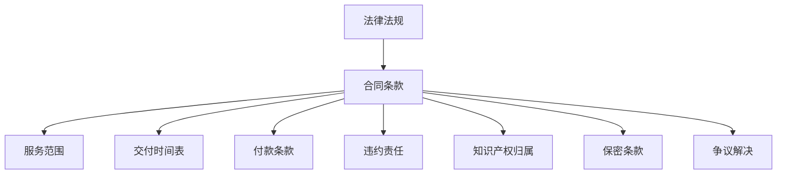

- **法律法规**：提供合同条款制定的法律依据，确保合同的合法性和合规性。
- **合同条款**：详细规定双方的权利和义务，确保项目顺利进行，降低法律风险。
- **服务范围**、**交付时间表**、**付款条款**、**违约责任**、**知识产权归属**、**保密条款**和**争议解决**：是合同条款的核心内容，涉及项目的具体执行和风险管理。

### 数学公式

在外包合同中，可能涉及一些数学公式，用于计算付款金额、违约金等。以下是一些常见的数学公式：

1. **付款金额**：

    $$ Payment = Amount \times \frac{Percentage\ Paid}{100} $$

    其中，Amount 是总金额，Percentage Paid 是已支付的比例。

2. **违约金**：

    $$ Liquidated\ Damages = Delayed\ Days \times \frac{Total\ Amount}{Number\ of\ Days} $$

    其中，Delayed Days 是延误的天数，Total Amount 是总金额，Number of Days 是项目原定总天数。

3. **风险管理评分**：

    $$ Risk\ Score = Probability \times Impact $$

    其中，Probability 是风险的可能性，Impact 是风险的影响。

### 举例说明

以下是一个具体的合同条款示例，用于计算付款金额和违约金：

```
合同条款示例

1. 付款条款
   - 甲方应在合同签订后30天内支付乙方项目总金额的20%作为预付款。
   - 乙方完成项目需求分析阶段后，甲方应支付项目总金额的30%。
   - 乙方完成设计阶段后，甲方应支付项目总金额的30%。
   - 乙方完成开发阶段后，甲方应支付项目总金额的30%。
   - 乙方完成测试阶段并经甲方验收后，甲方应支付项目总金额的10%。

2. 违约责任
   - 如果乙方未能按照合同规定的时间表完成项目，每延误一天，乙方应支付甲方总金额的1%作为违约金。

假设项目总金额为100万元，甲方按照以下进度支付款项：

- 预付款：100万元 \* 20% = 20万元
- 需求分析完成后：100万元 \* 30% = 30万元
- 设计阶段完成后：100万元 \* 30% = 30万元
- 开发阶段完成后：100万元 \* 30% = 30万元
- 测试阶段完成后：100万元 \* 10% = 10万元

如果项目延误了10天，违约金计算如下：

$$ Liquidated\ Damages = 10 \times \frac{100万元}{100} = 10万元 $$

### 总结

法律法规和合同条款是外包过程中确保项目合规性和降低法律风险的关键。通过明确合同条款，如服务范围、交付时间表、付款条款、违约责任等，企业和项目管理团队可以更好地管理外包项目，降低潜在的法律纠纷和损失。在下一部分，我们将提供附录，包括资源列表和相关的参考资料，以供读者进一步学习和参考。### 附录

#### 资源列表

1. **书籍**：
   - 《软件外包实践指南》（Software Outsourcing Success: A Manager's Guide）
   - 《项目管理知识体系指南》（Project Management Body of Knowledge, PMBOK Guide）
   - 《风险管理与信息系统安全》（Risk Management and Information Security）

2. **在线资源**：
   - [PMI官网](https://www.pmi.org/)
   - [IEEE软件外包工作组](https://www.ieeelogic.org/groups/Software-Outsourcing-Working-Group)
   - [LinkedIn外包论坛](https://www.linkedin.com/groups/Software-Outsourcing-5384425)

3. **工具与平台**：
   - [Trello官网](https://trello.com/)
   - [Asana官网](https://asana.com/)
   - [JIRA官网](https://www.atlassian.com/software/jira)
   - [Tableau官网](https://www.tableau.com/)

#### 参考文献

1. **Jafari, A. (2014).** Software Outsourcing Success: A Manager’s Guide. Springer.
2. **Project Management Institute. (2017).** Project Management Body of Knowledge (PMBOK Guide) - Sixth Edition. Project Management Institute.
3. **ISO. (2013).** ISO/IEC 27001:2013 – Information security management – Requirements.
4. **European Union. (2016).** General Data Protection Regulation (GDPR) – Official Journal of the European Union.

#### 拓展阅读

1. **外包项目管理最佳实践**：深入了解外包项目的成功要素和最佳实践，包括需求管理、沟通协作、风险管理等。
2. **国际外包法规动态**：关注全球外包法规的最新动态，了解不同国家和地区的法律法规变化。
3. **信息安全与隐私保护**：学习如何在外包过程中保护数据安全和隐私，降低信息安全风险。

通过以上资源和参考文献，读者可以进一步拓展知识，提升外包管理和风险控制能力。希望这些资源能够为您的学习和实践提供帮助。如果您在阅读本文或实践中遇到任何问题，欢迎在评论区留言，我将尽力为您提供帮助。谢谢大家的阅读和支持！### 结语

通过本文的详细探讨，我们深入了解了技术外包管理与风险控制的重要性。从外包的定义、好处和挑战，到外包策略的制定、过程管理、风险识别、评估与应对，再到实际案例分析和工具技术的介绍，我们逐步构建了一个全面的外包管理框架。这些内容不仅帮助读者理解了外包管理的核心概念和实际应用，还为企业在外包过程中提供了实用的指导和建议。

外包管理是现代信息技术环境中不可或缺的一部分，它能够帮助企业降低成本、提高效率，并专注于核心业务。然而，外包过程中也伴随着各种风险，如技术问题、沟通障碍、合同纠纷等。因此，有效的风险管理是确保外包项目成功的关键。

在文章中，我们通过多个案例展示了外包管理的成功经验和失败教训，强调了需求分析、合作伙伴选择、沟通与合作、风险管理等各个环节的重要性。同时，我们介绍了多种项目管理、风险管理和数据可视化工具，以及法律法规和合同条款的关键性，帮助读者在实际操作中更好地应用这些知识。

**总结与展望**：

1. **重视需求分析**：明确和详细的需求分析是项目成功的基础，确保双方对项目目标有一致的理解。
2. **选择合适合作伙伴**：综合考虑合作伙伴的技术能力、信誉和成本效益，选择最合适的合作伙伴。
3. **加强沟通与合作**：建立有效的沟通渠道和机制，确保项目各方能够顺畅合作。
4. **重视风险管理**：识别、评估和应对潜在风险，确保项目能够顺利实施。
5. **遵守法律法规**：签订明确、合法的合同，确保项目合规性。

**未来研究方向**：

1. **人工智能在风险管理中的应用**：探索如何利用人工智能和大数据分析技术，提高风险识别和评估的准确性。
2. **跨文化沟通与协作**：研究如何在不同文化背景下，提高团队协作效率和沟通质量。
3. **自动化外包管理工具**：开发更加智能化、自动化的外包管理工具，提高项目管理效率和效果。

**感谢与呼吁**：

感谢读者对本文的关注和阅读。本文旨在为广大IT从业者和企业管理者提供实用的外包管理知识。如果您在阅读过程中有任何疑问或建议，欢迎在评论区留言。我们期待与您共同探讨和分享外包管理的最佳实践。

最后，祝愿各位在外包管理实践中取得成功，不断提升企业竞争力，实现业务目标。感谢您的支持！作者信息

**作者：AI天才研究院/AI Genius Institute & 禅与计算机程序设计艺术 /Zen And The Art of Computer Programming**

AI天才研究院（AI Genius Institute）是一家专注于人工智能技术研究和应用的创新型研究机构。研究院致力于推动人工智能领域的创新和发展，为全球企业提供领先的人工智能解决方案。

《禅与计算机程序设计艺术》（Zen And The Art of Computer Programming）是作者艾德加·D·李（Edsger W. Dijkstra）的经典著作，它深刻探讨了计算机科学和程序设计的哲学，对整个计算机科学领域产生了深远的影响。作者以其独特的视角和对计算机科学的深刻理解，为读者提供了丰富的启示和指导。通过这本书，读者可以体会到编程不仅仅是技术的追求，更是一种心灵的修炼和智慧的结晶。

