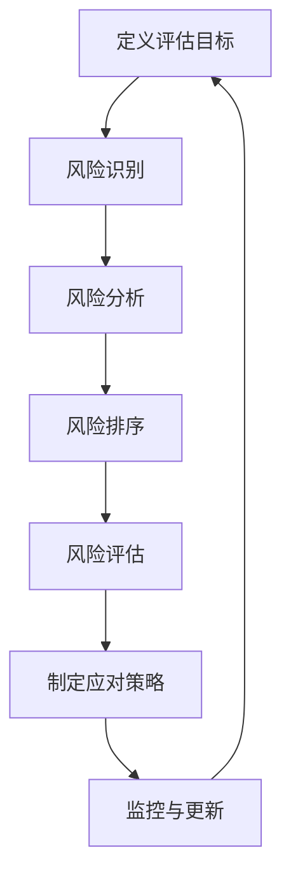
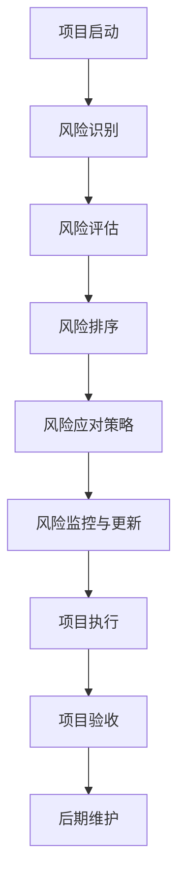

                 

### 文章标题：如何进行有效的技术外包风险管理

#### 关键词：技术外包、风险管理、风险评估、风险识别、合同管理

#### 摘要：
本文将深入探讨如何进行有效的技术外包风险管理。首先，我们将介绍技术外包的背景和重要性，并对其进行分类与识别。接着，我们将详细阐述技术外包的基本概念、风险识别方法、风险评估框架和风险应对策略。此外，文章还将重点讨论技术外包合同管理、沟通合作以及实践中的成功与失败案例。最后，我们将总结文章的主要观点，并对未来的研究方向提出建议。

## 如何进行有效的技术外包风险管理 - 目录大纲

### 第1章 引言

- 1.1 技术外包的背景和重要性
- 1.2 技术外包风险的分类与识别
- 1.3 技术外包风险管理的意义

### 第2章 技术外包的基本概念

- 2.1 技术外包的定义与范围
- 2.2 技术外包的模式与流程
- 2.3 技术外包中的利益相关者分析

### 第3章 技术外包风险识别

- 3.1 风险识别方法
- 3.2 常见的技术外包风险
- 3.3 风险案例分析与总结

### 第4章 技术外包风险评估

- 4.1 风险评估框架
- 4.2 风险评估方法
- 4.3 风险评估案例

### 第5章 技术外包风险应对策略

- 5.1 风险应对策略概述
- 5.2 风险规避策略
- 5.3 风险降低策略
- 5.4 风险转移策略
- 5.5 风险接受策略

### 第6章 技术外包合同管理

- 6.1 合同管理的重要性
- 6.2 合同条款的设计与审查
- 6.3 合同纠纷的预防与处理

### 第7章 技术外包过程中的沟通与合作

- 7.1 沟通与合作的原则
- 7.2 沟通工具与方法
- 7.3 协同工作平台的选择与使用

### 第8章 技术外包风险管理实践

- 8.1 成功案例分享
- 8.2 失败案例分析
- 8.3 风险管理最佳实践

### 第9章 结论与展望

- 9.1 技术外包风险管理的挑战与趋势
- 9.2 未来研究方向与建议

### 附录

- A. 技术外包风险管理工具与方法
- B. 技术外包风险管理流程图
- C. 参考文献

## 第1章 引言

### 1.1 技术外包的背景和重要性

在当今快速发展的信息技术时代，企业面临着越来越复杂的技术需求和不断变化的市场环境。为了提高竞争力，许多企业开始将部分技术任务外包给专业的服务提供商。技术外包不仅帮助企业节省了成本，还带来了专业化的技术支持和更高效的资源利用。然而，技术外包也带来了新的挑战，尤其是在风险管理方面。

技术外包的背景可以追溯到20世纪80年代，当时企业开始意识到将非核心业务外包给专业公司可以集中精力在核心竞争力的提升上。随着互联网和云计算技术的普及，技术外包的范围和深度不断扩大，从简单的软件开发到整个IT基础设施的管理，都成为了外包的对象。如今，技术外包已经成为了企业日常运营中不可或缺的一部分。

技术外包的重要性体现在以下几个方面：

1. **成本节约**：外包可以帮助企业节省人力成本和设备投资，特别是在开发和维护复杂技术系统时。

2. **专业化**：外包服务提供商通常拥有专业技能和丰富的经验，可以提供更高质量的技术解决方案。

3. **灵活性**：企业可以根据项目需求灵活调整外包范围和规模，快速响应市场变化。

4. **风险转移**：通过外包，企业可以将部分风险转移给服务提供商，如技术风险和市场风险。

然而，技术外包也带来了风险，如质量风险、安全风险、合作风险等。因此，有效的技术外包风险管理变得至关重要。本文将详细探讨如何进行有效的技术外包风险管理，包括风险识别、风险评估、风险应对策略等方面。

### 1.2 技术外包风险的分类与识别

技术外包风险可以分为多种类型，这些风险不仅影响项目的执行，还可能对企业的声誉和财务状况产生长期影响。以下是几种常见的技术外包风险及其分类：

1. **质量风险**：外包服务提供商可能无法达到企业的质量标准，导致项目延期或失败。质量风险可以分为以下几类：
    - **功能风险**：外包产品可能缺少关键功能或功能实现不完善。
    - **性能风险**：外包产品可能在性能上无法满足预期要求。
    - **兼容性风险**：外包产品可能与现有系统不兼容，导致集成困难。

2. **安全风险**：外包过程中的数据泄露、系统漏洞等可能导致敏感信息泄露或系统被攻击。安全风险包括：
    - **数据泄露**：外包过程中的数据传输和存储可能不安全，导致数据泄露。
    - **系统漏洞**：外包服务提供商可能未能及时修补系统漏洞，导致安全隐患。

3. **合作风险**：外包过程中的沟通不畅、合作不力可能导致项目延误或失败。合作风险包括：
    - **沟通风险**：双方可能存在语言、文化差异，导致沟通障碍。
    - **信任风险**：外包服务提供商可能存在欺诈行为，损害双方信任。

4. **法律风险**：合同条款不明确、知识产权纠纷等可能导致法律风险。法律风险包括：
    - **合同风险**：合同条款不明确，可能导致纠纷和违约。
    - **知识产权风险**：外包过程中可能涉及知识产权侵权问题。

5. **财务风险**：外包服务提供商可能存在财务风险，如延迟付款、超预算等。财务风险包括：
    - **付款风险**：外包服务提供商可能存在付款问题，导致项目延误。
    - **预算超支**：外包项目可能因各种原因超预算，影响企业的财务状况。

为了有效识别技术外包风险，企业需要采取系统化的方法，如以下步骤：

1. **需求分析**：在确定外包需求时，详细了解项目需求、质量标准和时间表，为风险识别提供依据。

2. **供应商评估**：选择合适的供应商时，评估其技术能力、信誉、财务状况和项目经验。

3. **风险评估**：制定风险评估框架，对潜在风险进行识别、分析和评估。

4. **风险管理计划**：根据风险评估结果，制定风险管理计划，包括风险规避、降低和转移策略。

5. **持续监控**：在外包项目执行过程中，持续监控风险，并根据实际情况调整风险管理措施。

通过系统化的风险识别和评估，企业可以提前识别潜在风险，制定有效的应对策略，降低技术外包风险对项目和企业的影响。

### 1.3 技术外包风险管理的意义

技术外包风险管理的意义不容忽视，它不仅关系到项目的成功与否，还直接影响企业的长远发展和市场竞争力。以下是技术外包风险管理的几个重要意义：

1. **保障项目成功**：有效的风险管理可以确保外包项目按时、按质、按预算完成。通过识别和评估潜在风险，企业可以制定相应的应对措施，避免项目延误、质量问题和预算超支等风险，从而保障项目的成功。

2. **降低企业成本**：技术外包的风险管理有助于降低企业成本。通过提前识别和规避潜在风险，企业可以避免因风险发生而产生的额外费用，如修复费用、赔偿费用等。此外，有效的风险管理还可以提高项目效率，减少不必要的资源浪费，进一步降低成本。

3. **提升企业竞争力**：在竞争激烈的市场环境中，企业的核心竞争力不仅依赖于技术实力，还依赖于风险管理能力。通过有效的技术外包风险管理，企业可以更好地应对外部环境变化，迅速调整战略，提高市场响应速度和创新能力，从而在市场中保持竞争优势。

4. **保护企业声誉**：技术外包项目的成功与否直接关系到企业的声誉。如果外包项目出现重大问题，如数据泄露、系统崩溃等，将对企业的声誉造成严重损害。通过有效的风险管理，企业可以降低这些风险的发生概率，确保项目的稳定性和可靠性，从而维护企业声誉。

5. **促进合作关系**：良好的风险管理有助于建立和维护与外包服务提供商之间的合作关系。通过透明的沟通、明确的合同条款和有效的风险分担机制，企业可以增强与供应商的信任和合作，形成长期稳定的合作关系，为未来的项目合作奠定基础。

6. **合规性和法律保障**：技术外包涉及多个法律法规和合规要求，如知识产权保护、数据隐私和安全等。有效的风险管理可以帮助企业确保外包过程符合相关法律法规，降低法律风险，避免因违规操作而面临的法律责任和罚款。

综上所述，技术外包风险管理对企业具有重要意义。通过系统化的风险管理，企业不仅可以保障项目成功，降低成本，提升竞争力，保护声誉，还能促进合作关系，确保合规性和法律保障。因此，企业应高度重视技术外包风险管理，制定科学合理的管理策略，以应对不断变化的外部环境和市场竞争。

### 第2章 技术外包的基本概念

#### 2.1 技术外包的定义与范围

技术外包是指企业将其一部分技术任务或服务外包给专业的服务提供商，以实现资源优化和业务目标。这种模式可以帮助企业专注于核心业务，同时利用外部专业资源提高项目效率和质量。技术外包的定义可以从以下几个方面进行理解：

首先，技术外包是一种分工合作的方式。企业将部分技术任务外包，可以将复杂的业务分解为若干个专业模块，由不同领域的专家团队分别完成。这种方式不仅可以提高工作效率，还可以利用专业团队的丰富经验和技术实力，提高项目质量。

其次，技术外包强调专业化和效率。外包服务提供商通常具备丰富的行业经验和专业技能，能够提供更高效、高质量的技术服务。通过外包，企业可以快速获得所需的技术解决方案，缩短项目周期，降低开发成本。

技术外包的范围非常广泛，涵盖了许多技术领域和业务场景。以下是一些常见的技术外包类型：

1. **软件开发与维护**：企业可以将软件开发的各个阶段，如需求分析、设计、编码、测试等外包给专业开发团队。

2. **IT基础设施服务**：包括数据中心建设、服务器维护、网络安全等。

3. **系统集成**：企业可以将系统集成任务，如不同系统之间的接口开发、数据迁移等外包。

4. **技术咨询与支持**：包括技术战略规划、技术选型、技术评估等。

5. **数据分析和处理**：企业可以将数据分析和处理任务，如大数据处理、人工智能应用等外包。

6. **数字营销**：包括网站开发、SEO优化、社交媒体营销等。

技术外包的优点在于能够提高企业的灵活性和响应速度。企业可以根据项目需求，灵活选择外包范围和规模，快速调整资源分配，提高项目效率。此外，外包还可以帮助企业降低成本，专注于核心业务，提高市场竞争力。

然而，技术外包也带来了新的挑战，如合作风险、数据安全风险和项目管理风险等。因此，企业在选择外包服务提供商时，需要仔细评估其技术能力、信誉和项目管理水平，确保能够有效管理外包风险。

#### 2.2 技术外包的模式与流程

技术外包通常包括以下几种模式：

1. **项目外包**：企业将一个具体的项目外包给服务提供商，如软件开发项目、系统集成项目等。这种模式适用于短期和明确的项目需求，有利于快速获取专业服务。

2. **阶段外包**：企业将项目的不同阶段分别外包，如需求分析、设计、开发、测试等。这种模式适用于项目周期较长、需求变化较大的情况，有利于逐步优化项目质量。

3. **部分外包**：企业将部分技术任务外包，而保留其他任务在内部完成。这种模式适用于企业需要专注于核心业务，同时利用外部资源优化非核心任务。

4. **完全外包**：企业将整个技术项目或服务完全外包给服务提供商。这种模式适用于企业缺乏相关技术能力或资源，需要依赖外部专业团队完成项目。

技术外包的流程通常包括以下几个阶段：

1. **需求分析**：企业明确外包需求，包括项目目标、功能需求、质量要求、时间表等。需求分析的详细程度直接影响外包项目的成功与否。

2. **供应商评估**：企业根据需求分析结果，选择合适的服务提供商。评估标准包括技术能力、项目经验、信誉、价格等。

3. **合同谈判**：企业与供应商进行合同谈判，明确双方权利和义务，包括服务内容、交付标准、付款方式、违约责任等。合同谈判的成果将直接影响项目的执行和风险管理。

4. **项目执行**：供应商根据合同要求，开始执行外包项目。企业需要设立项目管理团队，监督项目进展，确保项目按时、按质完成。

5. **项目验收**：项目完成后，企业对交付成果进行验收，确保满足合同要求。验收过程中可能涉及功能测试、性能测试、安全测试等。

6. **后期维护**：项目验收后，企业需要与供应商合作，进行项目维护和更新，确保系统的稳定性和可靠性。

在整个技术外包过程中，企业需要关注以下几个方面：

- **需求管理**：确保需求明确、具体，并能够动态调整。
- **风险管理**：识别和评估外包过程中的各种风险，并制定相应的应对措施。
- **质量管理**：确保外包项目的质量符合预期，通过验收测试和质量保证措施。
- **沟通与协作**：建立有效的沟通机制，确保双方信息畅通，共同解决项目中的问题。
- **合同管理**：确保合同条款明确、合理，避免合同纠纷。

通过科学合理的技术外包模式与流程，企业可以充分发挥外部专业资源的作用，提高项目效率和质量，实现业务目标。

#### 2.3 技术外包中的利益相关者分析

在技术外包过程中，涉及多个利益相关者，包括企业、服务提供商、客户以及其他相关方。这些利益相关者在技术外包中扮演不同的角色，其利益诉求和影响力也各不相同。以下是主要利益相关者的分析：

1. **企业（客户）**：
   - **角色**：技术外包的需求方，负责提出外包需求、监督项目执行和验收交付成果。
   - **利益诉求**：确保项目按时、按质、按预算完成，提升企业竞争力，降低成本，维护企业声誉。
   - **影响力**：决策权较大，对项目成败有直接影响力。

2. **服务提供商**：
   - **角色**：技术外包的执行方，负责提供技术解决方案和交付服务。
   - **利益诉求**：获取合同收益，建立良好的商业声誉，获得更多业务机会。
   - **影响力**：负责项目实施，对项目进度、质量和成本有直接影响。

3. **客户（最终用户）**：
   - **角色**：技术外包的受益方，使用外包成果，体验服务提供商提供的解决方案。
   - **利益诉求**：获得高质量、可靠的技术服务，满足业务需求，提升用户体验。
   - **影响力**：通过反馈和建议影响外包项目的方向和质量。

4. **监管机构**：
   - **角色**：对技术外包过程中的合规性进行监督和审查，确保外包项目符合相关法律法规。
   - **利益诉求**：确保市场秩序，保护消费者权益，维护国家安全和信息安全。
   - **影响力**：通过法律法规和标准影响技术外包的行为和规范。

5. **合作伙伴**：
   - **角色**：与外包项目相关的第三方机构或人员，如供应商的合作伙伴、客户的合作伙伴等。
   - **利益诉求**：通过技术外包项目获得业务机会，扩大合作范围，提升自身竞争力。
   - **影响力**：通过合作和建议影响项目的某些方面，如技术选型、项目管理等。

6. **员工**：
   - **角色**：技术外包过程中，可能涉及内部员工的调整和培训。
   - **利益诉求**：确保自身岗位稳定，获得培训和发展机会，提升个人技能和职业素养。
   - **影响力**：通过工作表现和反馈影响项目执行和外包合作。

在技术外包中，各利益相关者之间存在复杂的互动关系。企业需要综合考虑各方的利益诉求，建立有效的沟通和协作机制，确保项目顺利推进。同时，企业也需要制定合理的利益分配机制，平衡各方的利益，提高项目的成功率和可持续性。

通过系统分析技术外包中的利益相关者，企业可以更好地理解各方的需求和期望，制定科学合理的管理策略，提高外包项目的整体效率和效果。

### 第3章 技术外包风险识别

#### 3.1 风险识别方法

技术外包风险识别是风险管理过程的基础，其目的是系统地识别和评估项目中的潜在风险。有效的风险识别方法有助于企业提前发现潜在问题，制定针对性的应对策略，降低风险发生概率和影响。以下是几种常见的技术外包风险识别方法：

1. **专家调查法**：
   专家调查法是一种通过收集专家意见进行风险识别的方法。企业可以邀请技术专家、项目经理和相关部门负责人参与风险识别会议，共同讨论和分析项目中可能存在的风险。这种方法的优势在于能够充分利用专家的知识和经验，快速识别潜在风险。

2. **头脑风暴法**：
   头脑风暴法是一种集体讨论风险的方法，通过集思广益，快速识别项目中的潜在风险。参与人员可以在会议中自由发表意见，提出可能的风险点。这种方法适用于项目初期，有助于全面覆盖风险领域。

3. **故障模式与影响分析（FMEA）**：
   故障模式与影响分析是一种系统化的风险识别方法，通过分析系统中的潜在故障模式和其对项目的影响，识别和评估风险。FMEA分为几个步骤：定义系统、识别故障模式、分析故障原因、评估故障影响和确定风险等级。这种方法适用于复杂项目，能够提供详细的风险分析。

4. **检查表法**：
   检查表法是一种基于经验的风险识别方法，通过预先设计好的检查表，逐项检查项目中的风险点。检查表通常包括常见的风险类型和可能的影响，有助于系统化地识别风险。这种方法适用于常规项目和有经验的项目团队。

5. **SWOT分析法**：
   SWOT分析法是一种评估企业外部环境和内部能力的工具，可以通过分析项目的优势、劣势、机会和威胁，识别和评估风险。SWOT分析可以帮助企业从全局角度理解项目风险，制定相应的应对策略。

6. **过程流程图法**：
   过程流程图法通过绘制项目流程图，分析项目过程中的关键环节和潜在风险。这种方法可以帮助企业识别流程中的瓶颈和风险点，优化项目流程，提高风险管理效果。

通过结合多种风险识别方法，企业可以更全面、准确地识别技术外包项目中的潜在风险。在实际应用中，企业应根据项目特点和需求，选择合适的风险识别方法，提高风险管理的有效性。

#### 3.2 常见的技术外包风险

在技术外包项目中，常见风险贯穿于项目的各个阶段，包括需求分析、项目执行、项目验收和后期维护等。以下是几种常见的技术外包风险：

1. **质量风险**：
   - **表现**：外包服务可能不符合质量标准，导致系统功能缺失、性能低下、兼容性问题等。
   - **原因**：服务提供商技术能力不足、项目管理不善、沟通不畅等。
   - **影响**：可能导致项目延期、预算超支、用户体验差，甚至影响企业声誉。

2. **安全风险**：
   - **表现**：外包过程中可能发生数据泄露、系统漏洞、网络攻击等安全事件。
   - **原因**：数据传输和存储不安全、系统安全措施不足、安全意识薄弱等。
   - **影响**：可能导致敏感信息泄露、系统瘫痪、经济损失和法律责任。

3. **合作风险**：
   - **表现**：外包项目中的沟通不畅、合作不力可能导致项目延误、质量下降等。
   - **原因**：文化差异、语言障碍、利益冲突、项目管理不善等。
   - **影响**：可能导致项目失败、合作关系破裂、经济损失。

4. **财务风险**：
   - **表现**：外包项目可能因服务提供商财务问题导致付款延迟、项目延误等。
   - **原因**：服务提供商资金链断裂、预算超支、恶意欺诈等。
   - **影响**：可能导致项目延期、成本增加、合作关系破裂。

5. **法律风险**：
   - **表现**：合同纠纷、知识产权侵权、合规性问题等。
   - **原因**：合同条款不明确、知识产权保护不力、法律法规不了解等。
   - **影响**：可能导致法律纠纷、经济损失、企业声誉受损。

6. **人员风险**：
   - **表现**：外包团队人员流失、专业技能不足等。
   - **原因**：团队管理不善、薪酬激励不足、员工职业发展受限等。
   - **影响**：可能导致项目进度延误、质量下降、团队士气低落。

7. **技术风险**：
   - **表现**：新技术应用不当、技术选型错误等。
   - **原因**：技术调研不足、缺乏技术经验、技术更新不及时等。
   - **影响**：可能导致系统不稳定、性能低下、项目失败。

为了有效应对这些风险，企业需要采取系统化的风险管理措施，包括风险识别、风险评估、风险应对策略等。在实际操作中，企业应结合项目特点和需求，制定具体的风险管理计划，确保项目顺利推进。

#### 3.3 风险案例分析与总结

以下通过两个具体的技术外包风险案例，分析其风险识别、评估和应对过程，并总结经验教训。

**案例一：某企业软件外包项目质量风险**

**背景**：某大型企业决定将其ERP系统的部分模块外包给一家知名软件公司。项目计划在6个月内完成，预算为200万元。

**问题**：在项目执行过程中，企业发现软件公司在功能实现、性能优化和用户界面设计等方面存在明显不足。具体表现为：
- **功能缺失**：部分关键功能未能按照需求文档实现。
- **性能问题**：系统响应速度缓慢，无法满足业务需求。
- **用户体验差**：用户界面设计复杂，操作不便。

**原因分析**：
- **技术能力不足**：软件公司对ERP系统的理解不深入，导致功能实现和优化不到位。
- **项目管理不善**：项目进度失控，沟通不畅，导致需求变更频繁。

**应对措施**：
- **重新评估供应商**：企业对供应商的技术能力进行重新评估，决定终止与该公司的合作，并寻找新的合作伙伴。
- **加强项目管理**：企业调整项目管理团队，优化项目管理流程，确保项目进度和质量。
- **需求明确化**：在项目初期，企业重新明确需求，与新的供应商签订详细合同，确保需求明确、可执行。

**经验教训**：
- **严格供应商选择**：在选择外包供应商时，应重视其技术能力和项目管理水平。
- **明确需求**：在项目初期，需求应尽可能明确和具体，避免频繁变更。
- **项目管理**：应建立有效的项目管理机制，确保项目进度和质量。

**案例二：某企业网络安全外包项目风险**

**背景**：某企业在经历了一次网络攻击后，决定将其网络安全任务外包给一家专业的网络安全公司。

**问题**：外包过程中，企业发现网络安全公司未能及时发现和阻止多次网络攻击，导致企业数据泄露和业务中断。

**原因分析**：
- **安全意识不足**：企业对网络安全重视不够，未提供足够的培训和支持。
- **服务不足**：网络安全公司未能提供足够的网络安全服务，如实时监控、漏洞修复等。

**应对措施**：
- **加强安全培训**：企业对员工进行网络安全培训，提高安全意识和防范能力。
- **优化安全服务**：企业与网络安全公司重新协商，增加网络安全服务内容，确保实时监控和及时响应。

**经验教训**：
- **重视网络安全**：企业应将网络安全视为重要任务，投入足够的资源和精力。
- **选择合适的服务提供商**：选择具有丰富经验和专业能力的网络安全服务提供商。
- **建立安全管理制度**：制定详细的网络安全管理制度，确保安全服务的有效执行。

通过以上两个案例，我们可以看到，技术外包风险识别和应对的重要性。企业应通过系统化的风险管理方法，提前识别潜在风险，制定有效的应对策略，确保外包项目的成功。

### 第4章 技术外包风险评估

#### 4.1 风险评估框架

技术外包风险评估是风险管理过程中的关键环节，通过评估风险的概率和影响，企业可以优先处理高风险事件，制定有效的风险应对策略。一个完整的风险评估框架通常包括以下几个步骤：

1. **定义评估目标**：明确评估的目的和范围，例如评估整个外包项目或其中某一阶段的风险。

2. **风险识别**：通过前期的风险识别，列出所有潜在的风险。

3. **风险分析**：对识别出的风险进行详细分析，包括风险的性质、原因、影响等。

4. **风险排序**：根据风险的概率和影响，对风险进行排序，确定哪些风险需要优先处理。

5. **风险评估**：使用定量或定性方法对风险进行评估，计算风险得分。

6. **制定应对策略**：根据风险评估结果，制定相应的风险应对策略。

7. **监控与更新**：在整个项目周期内，持续监控风险，并根据实际情况更新评估结果。

在技术外包风险评估中，常见的评估方法包括定量分析和定性分析。定量分析通常使用数学模型和统计工具，如蒙特卡罗模拟、贝叶斯网络等，而定性分析则基于专家判断和经验。

以下是一个简单的风险评估框架流程图：

通过以上框架，企业可以系统地评估技术外包过程中的各种风险，提高风险管理的效果。

#### 4.2 风险评估方法

技术外包风险评估方法的选择取决于项目的具体需求和风险特点。以下是几种常见的技术外包风险评估方法：

1. **定性评估法**：
   - **SWOT分析法**：通过分析项目的优势、劣势、机会和威胁，对风险进行定性评估。
   - **专家评估法**：邀请领域专家对风险进行评估，根据专家的意见和经验判断风险的概率和影响。
   - **风险矩阵法**：将风险的概率和影响进行量化，形成风险矩阵，根据矩阵确定风险等级。

2. **定量评估法**：
   - **蒙特卡罗模拟**：通过随机抽样和模拟，评估风险的概率和影响。
   - **贝叶斯网络**：利用概率论和图论，建立风险模型，进行风险评估。
   - **统计模型**：使用统计方法，如回归分析、时间序列分析等，对风险进行量化评估。

3. **综合评估法**：
   - **多准则决策分析**：综合考虑多个评估指标，如成本、时间、质量等，对风险进行综合评估。
   - **风险价值（VaR）**：计算项目在特定置信水平下的最大可能损失，用于评估风险。
   - **敏感性分析**：分析不同因素对风险的影响程度，确定关键风险因素。

在实际应用中，企业应根据项目的特点和需求，选择合适的评估方法。例如，对于复杂且不确定的项目，可以使用蒙特卡罗模拟和贝叶斯网络进行风险评估；而对于较为简单的项目，可以使用专家评估法和风险矩阵法。

以下是一个基于定性评估法的风险评估示例：

**步骤1：定义评估目标**  
明确本次风险评估的目标是评估某技术外包项目的整体风险，包括质量风险、安全风险、合作风险等。

**步骤2：风险识别**  
通过专家调查和头脑风暴，识别出以下潜在风险：

- **质量风险**：外包产品不符合质量标准
- **安全风险**：数据泄露、系统漏洞
- **合作风险**：沟通不畅、合作不力
- **财务风险**：付款延迟、预算超支
- **法律风险**：合同纠纷、知识产权侵权

**步骤3：风险分析**  
对每个风险进行详细分析，包括原因、可能的影响等。

- **质量风险**：可能导致项目延期、成本增加、用户体验差
- **安全风险**：可能导致数据泄露、系统瘫痪、经济损失
- **合作风险**：可能导致项目失败、合作关系破裂、经济损失
- **财务风险**：可能导致项目延期、成本增加、合作关系破裂
- **法律风险**：可能导致法律纠纷、经济损失、企业声誉受损

**步骤4：风险排序**  
根据风险的概率和影响，对风险进行排序：

- **高概率高影响**：安全风险、合作风险
- **高概率低影响**：质量风险、财务风险
- **低概率高影响**：法律风险
- **低概率低影响**：人员风险

**步骤5：风险评估**  
使用风险矩阵对风险进行量化评估，确定风险等级：

- **安全风险**：高风险
- **合作风险**：高风险
- **质量风险**：中等风险
- **财务风险**：中等风险
- **法律风险**：低风险
- **人员风险**：低风险

**步骤6：制定应对策略**  
根据风险评估结果，制定相应的应对策略：

- **安全风险**：增加安全培训和投入、引入第三方安全评估
- **合作风险**：加强沟通和协作、明确合同条款、建立应急预案
- **质量风险**：加强项目监控、引入第三方质量评估、调整供应商
- **财务风险**：增加预算、引入第三方审计、调整付款流程
- **法律风险**：聘请法律顾问、制定合同纠纷应对方案
- **人员风险**：加强培训和激励、优化团队结构

**步骤7：监控与更新**  
在整个项目周期内，持续监控风险，并根据实际情况更新评估结果和应对策略。

通过以上步骤，企业可以系统地评估技术外包项目中的风险，制定有效的应对措施，确保项目的顺利进行。

#### 4.3 风险评估案例

以下通过一个实际的技术外包风险评估案例，展示如何进行系统化的风险评估，并分析其过程和结果。

**案例背景**：某企业决定将其电子商务平台的前端开发和维护外包给一家专业的软件开发公司。项目计划在6个月内完成，预算为300万元。

**风险识别**：在项目启动阶段，企业通过专家调查法和头脑风暴法，识别出以下潜在风险：

- **质量风险**：外包产品不符合质量标准，导致用户体验差、业务中断。
- **安全风险**：平台数据泄露、系统漏洞，导致经济损失和信誉受损。
- **合作风险**：供应商沟通不畅、合作不力，导致项目延期、成本增加。
- **财务风险**：供应商财务问题，导致付款延迟、项目延误。
- **法律风险**：合同纠纷、知识产权侵权，导致法律纠纷和赔偿。
- **人员风险**：外包团队人员流失、专业技能不足，导致项目进度延误、质量下降。

**风险分析**：对识别出的风险进行详细分析，包括原因、可能的影响等。

- **质量风险**：原因可能包括供应商技术能力不足、项目管理不善、需求变更频繁等。可能影响包括用户体验差、业务中断、成本增加。
- **安全风险**：原因可能包括安全意识不足、系统安全措施不足等。可能影响包括数据泄露、系统瘫痪、经济损失。
- **合作风险**：原因可能包括文化差异、沟通不畅、利益冲突等。可能影响包括项目延期、成本增加、合作关系破裂。
- **财务风险**：原因可能包括供应商资金链断裂、预算超支等。可能影响包括项目延期、成本增加、合作关系破裂。
- **法律风险**：原因可能包括合同条款不明确、知识产权保护不力等。可能影响包括法律纠纷、经济损失、企业声誉受损。
- **人员风险**：原因可能包括团队管理不善、薪酬激励不足等。可能影响包括项目进度延误、质量下降、团队士气低落。

**风险排序**：根据风险的概率和影响，对风险进行排序：

- **高概率高影响**：安全风险、合作风险。
- **高概率低影响**：质量风险、财务风险。
- **低概率高影响**：法律风险。
- **低概率低影响**：人员风险。

**风险评估**：使用风险矩阵对风险进行量化评估，确定风险等级：

- **安全风险**：高风险。
- **合作风险**：高风险。
- **质量风险**：中等风险。
- **财务风险**：中等风险。
- **法律风险**：低风险。
- **人员风险**：低风险。

**应对策略**：根据风险评估结果，制定相应的应对策略：

- **安全风险**：增加安全培训和投入、引入第三方安全评估。
- **合作风险**：加强沟通和协作、明确合同条款、建立应急预案。
- **质量风险**：加强项目监控、引入第三方质量评估、调整供应商。
- **财务风险**：增加预算、引入第三方审计、调整付款流程。
- **法律风险**：聘请法律顾问、制定合同纠纷应对方案。
- **人员风险**：加强培训和激励、优化团队结构。

**结果分析**：在项目执行过程中，企业按照制定的应对策略进行风险管理和监控。具体结果如下：

- **安全风险**：通过定期安全培训和第三方安全评估，项目未发生数据泄露和系统漏洞事件。
- **合作风险**：通过加强沟通和建立应急预案，项目未出现重大延误和合作问题。
- **质量风险**：通过引入第三方质量评估和调整供应商，项目质量得到显著提升。
- **财务风险**：通过增加预算和引入第三方审计，项目未发生预算超支和付款延迟问题。
- **法律风险**：通过聘请法律顾问和制定合同纠纷应对方案，项目未发生法律纠纷。
- **人员风险**：通过加强培训和激励，团队士气和工作效率得到提高。

**经验教训**：

1. **全面的风险识别**：在项目初期，应进行全面的风险识别，确保所有潜在风险得到充分考虑。
2. **针对性的风险应对策略**：根据风险评估结果，制定针对性的风险应对策略，确保策略的有效性和可执行性。
3. **持续监控和更新**：在项目执行过程中，持续监控风险，并根据实际情况及时更新评估结果和应对策略。
4. **跨部门合作**：技术外包风险涉及多个部门和利益相关者，应建立有效的沟通和协作机制，确保风险管理的全面性和有效性。

通过以上案例，我们可以看到，系统化的风险评估和技术外包风险管理对于确保项目成功至关重要。企业应重视风险识别、评估和应对过程，确保项目在合理控制和风险范围内顺利完成。

### 第5章 技术外包风险应对策略

#### 5.1 风险应对策略概述

技术外包风险应对策略是指企业为了降低风险发生概率和影响，所采取的一系列措施。有效的风险应对策略可以帮助企业确保项目按时、按质、按预算完成，降低项目失败的风险。以下是几种常见的风险应对策略：

1. **风险规避**：通过调整项目计划、改变项目范围或放弃某些高风险任务，避免风险的发生。

2. **风险降低**：通过改进项目流程、增加资源投入、引入新的技术和管理方法，降低风险的概率和影响。

3. **风险转移**：通过保险、合同条款或其他方式，将部分风险转移给其他方，如外包服务提供商或第三方。

4. **风险接受**：对于无法避免或转移的风险，企业可以选择接受风险，并制定应对措施，以减轻风险发生时的影响。

5. **风险监测与控制**：在整个项目周期内，持续监控风险，并根据实际情况调整风险应对策略。

在实际应用中，企业应根据风险类型、项目特点和需求，选择合适的风险应对策略，并制定详细的风险管理计划，确保策略的有效实施。

#### 5.2 风险规避策略

风险规避是一种通过避免高风险行为来降低风险发生概率的策略。在技术外包中，风险规避策略主要体现在以下几个方面：

1. **重新评估供应商**：如果发现外包服务提供商存在重大风险，如技术能力不足、信誉不佳等，企业可以选择重新评估供应商，甚至更换供应商。

2. **调整项目范围**：在项目初期，通过重新评估项目需求，调整项目范围，去除或推迟一些高风险任务，降低整体风险。

3. **分解任务**：将高风险任务分解为多个较小的任务，分别外包给不同的供应商，降低单一任务的风险。

4. **增加缓冲时间**：在项目时间表和预算中，预留一定的缓冲时间，以应对潜在的延期和预算超支。

5. **限制外包范围**：明确外包任务的边界，避免将核心任务外包，保留关键决策和关键控制权在企业内部。

通过风险规避策略，企业可以在一定程度上降低项目风险，但这也可能导致项目成本增加、时间延长，因此需要在规避风险和保持项目效率之间进行权衡。

#### 5.3 风险降低策略

风险降低策略是通过改进项目流程、增加资源投入、引入新的技术和管理方法，降低风险的概率和影响。以下是一些具体的风险降低策略：

1. **技术评估**：在项目启动前，对技术方案进行全面的评估和验证，确保所选技术方案具备可行性和稳定性。

2. **质量保证**：建立严格的质量保证体系，包括需求分析、设计评审、代码审查、系统测试等，确保项目质量。

3. **安全措施**：加强网络安全和数据保护措施，包括数据加密、防火墙、入侵检测等，降低安全风险。

4. **项目管理**：引入先进的项目管理方法和工具，如敏捷开发、Scrum等，提高项目效率和管理水平。

5. **资源投入**：增加项目资源投入，如人力、资金、设备等，确保项目有足够的资源支持，降低项目延误和超支的风险。

6. **培训与沟通**：对外包团队和管理人员进行培训，提高他们的专业技能和管理能力，建立有效的沟通机制，确保项目顺利进行。

通过风险降低策略，企业可以在不改变项目范围和时间表的情况下，提高项目的稳定性和成功率。然而，这些策略通常需要额外的资源和时间投入，因此在实施时需要综合考虑成本和效益。

#### 5.4 风险转移策略

风险转移策略是通过将部分风险责任转移给其他方来降低企业自身风险。在技术外包中，常见的风险转移策略包括以下几种：

1. **保险**：企业可以为外包项目购买保险，如技术失败保险、数据泄露保险等，将部分风险转移给保险公司。

2. **合同条款**：在合同中明确约定风险责任和赔偿条款，将风险转移给外包服务提供商。例如，可以要求供应商在合同中承诺赔偿因自身原因导致的项目延误或质量缺陷。

3. **分包**：将部分外包任务再外包给其他供应商，通过分层外包，将风险分散到多个供应商之间。

4. **合作风险分担**：与外包服务提供商建立合作风险分担机制，共同承担项目风险，并在合同中明确风险分担比例和方式。

5. **担保**：企业可以为外包服务提供商提供担保，如信誉担保、财务担保等，以减轻供应商的风险负担。

通过风险转移策略，企业可以降低自身的风险负担，但这也可能导致供应商积极性下降、合作关系紧张等问题。因此，在实施风险转移策略时，企业需要谨慎评估供应商的风险承受能力和合作意愿。

#### 5.5 风险接受策略

风险接受策略是指企业对无法规避、降低或转移的风险，采取接受并制定应对措施的做法。以下是一些常见的风险接受策略：

1. **风险预留**：在项目预算和时间表中预留一定的风险预留，以应对可能的风险事件。

2. **应急计划**：制定详细的应急计划，包括应对措施、应急响应流程、资源调配等，确保在风险事件发生时能够迅速应对。

3. **风险监测**：建立风险监测机制，持续监控风险指标，及时发现潜在问题，并采取措施进行应对。

4. **培训与准备**：对外包团队和管理人员进行风险意识和应对能力的培训，提高他们的应急处理能力。

5. **调整策略**：在项目执行过程中，根据风险监测结果，及时调整项目策略和管理措施，以减轻风险影响。

通过风险接受策略，企业可以减轻风险事件发生时的冲击，确保项目的稳定运行。然而，风险接受策略并不意味着放任风险，企业仍需密切关注风险发展，并随时调整应对措施。

### 第6章 技术外包合同管理

#### 6.1 合同管理的重要性

在技术外包过程中，合同管理是确保项目顺利执行和风险控制的关键环节。有效的合同管理不仅可以明确各方的权利和义务，还可以在项目发生争议时提供法律依据。以下是合同管理的重要性：

1. **保障项目实施**：合同是项目执行的依据，明确了项目目标、范围、时间表、质量标准等关键要素，有助于确保项目按计划进行。

2. **风险控制**：通过合同条款，企业可以明确约定风险责任和赔偿条款，将部分风险转移给外包服务提供商，降低项目风险。

3. **利益保障**：合同管理有助于保护企业的利益，确保项目交付符合预期，避免因质量问题、延误等问题导致的损失。

4. **纠纷预防**：明确、详细的合同条款有助于避免合同纠纷，减少法律诉讼的风险和成本。

5. **合作基础**：良好的合同管理有助于建立和维护与供应商的长期合作关系，促进双方的互信和合作。

因此，企业应高度重视合同管理，建立完善的合同管理体系，确保合同能够有效保障项目实施和风险控制。

#### 6.2 合同条款的设计与审查

合同条款的设计与审查是合同管理的重要环节，以下是一些关键的合同条款设计原则和审查要点：

1. **明确项目范围**：合同中应详细描述项目的范围，包括项目目标、功能需求、技术要求、交付物等。避免因范围不明确导致的争议。

2. **明确时间表**：合同中应明确规定项目的时间表，包括各个阶段的时间节点、里程碑等。确保项目按时完成。

3. **质量标准**：合同中应明确项目质量标准，包括功能性能、用户体验、安全性等。可以引用国际标准或行业标准。

4. **付款方式**：合同中应明确付款方式、付款时间和付款条件，确保付款流程透明、公正。

5. **风险管理**：合同中应明确风险责任和赔偿条款，包括因供应商原因导致的项目延误、质量缺陷、数据泄露等。可以考虑引入保险机制。

6. **知识产权**：合同中应明确知识产权归属和使用权，确保企业对交付物拥有合法的知识产权。

7. **违约责任**：合同中应明确各方的违约责任和违约赔偿方式，确保在发生违约时能够有据可依。

8. **争议解决**：合同中应明确争议解决方式，包括协商、调解、仲裁或诉讼等。优先选择成本较低、效率较高的争议解决方式。

在审查合同条款时，企业应注意以下几个方面：

1. **合法性**：确保合同符合相关法律法规的要求，不违反法律禁止性规定。

2. **完整性**：检查合同条款是否完整，是否遗漏了关键内容。

3. **公平性**：确保合同条款对双方公平，不存在明显的利益失衡。

4. **可执行性**：确保合同条款具有可执行性，能够在实际操作中执行。

5. **风险分配**：检查风险责任是否合理分配，是否偏向某一方。

通过科学合理的合同条款设计与审查，企业可以确保合同的合法性、完整性和可执行性，为项目实施提供坚实保障。

#### 6.3 合同纠纷的预防与处理

合同纠纷是技术外包过程中常见的挑战，预防和处理合同纠纷是合同管理的重要内容。以下是一些预防与处理合同纠纷的策略：

**预防策略：**

1. **明确合同条款**：在合同中详细规定各项条款，包括项目范围、时间表、质量标准、付款方式等，避免因条款不明确引发的纠纷。

2. **签订前的审查**：在签订合同前，对合同条款进行严格审查，确保合同内容完整、合法、公平。

3. **沟通与协商**：建立有效的沟通机制，确保合同各方对项目目标、进度、质量等有共同的理解和期望。

4. **法律咨询**：在合同签订过程中，寻求专业法律咨询，确保合同符合法律规定，减少法律风险。

5. **风险分担**：在合同中明确风险责任和赔偿条款，合理分配风险，降低纠纷发生的概率。

**处理策略：**

1. **协商解决**：在合同纠纷发生后，优先选择协商解决，通过双方的沟通和妥协，找到双方都能接受的解决方案。

2. **调解**：如果协商无果，可以考虑通过调解解决纠纷。调解是一种成本较低、效率较高的解决方式，有助于维护双方合作关系。

3. **仲裁**：如果调解仍无法解决纠纷，可以考虑通过仲裁解决。仲裁具有灵活性和效率高，仲裁裁决具有法律效力。

4. **诉讼**：在极端情况下，如果仲裁或其他解决方式无效，可以考虑通过诉讼解决纠纷。诉讼程序复杂、成本高，但可以确保法律权利得到维护。

**案例分享：**

某企业在外包软件开发项目中，因交付质量不符合预期与供应商发生纠纷。在协商无果后，企业选择了仲裁解决。通过仲裁，双方最终达成一致，供应商同意进行质量修复，并赔偿部分经济损失。这一过程不仅解决了纠纷，还维护了双方的合作关系。

通过上述策略，企业可以有效地预防与处理合同纠纷，确保项目顺利实施和双方利益的平衡。

### 第7章 技术外包过程中的沟通与合作

#### 7.1 沟通与合作的原则

在技术外包过程中，沟通与合作是确保项目顺利推进和成功的关键。有效的沟通与合作不仅有助于解决问题，还能增强双方信任，提高项目效率。以下是沟通与合作应遵循的原则：

1. **透明性**：双方应保持信息的透明度，及时分享项目进展、问题和风险，确保信息畅通无阻。

2. **尊重与信任**：尊重对方的专业知识和经验，建立信任基础，避免因误解和猜疑导致冲突。

3. **及时反馈**：及时给予反馈，对项目进度、质量、问题等提出建设性意见，确保问题得到及时解决。

4. **共同目标**：明确共同的项目目标，确保双方在项目目标和方向上保持一致，减少误解和冲突。

5. **开放性**：保持开放的心态，接受和尊重不同的观点和意见，通过合作找到最优解决方案。

6. **沟通礼仪**：遵循良好的沟通礼仪，如使用礼貌语言、尊重对方意见、避免争吵等。

通过遵循上述原则，企业可以建立良好的沟通与合作机制，提高项目执行效率，确保项目成功。

#### 7.2 沟通工具与方法

为了确保技术外包过程中的有效沟通与合作，企业可以采用多种沟通工具和方法。以下是几种常见的沟通工具和方法：

1. **电子邮件**：电子邮件是一种正式的沟通方式，适用于正式通知、报告、合同文件等。其优势在于信息保存和追溯性强，但交流速度较慢。

2. **即时通讯工具**：如Slack、Microsoft Teams、WhatsApp等，适用于实时沟通、紧急问题处理和团队协作。这些工具的优势在于实时性和便捷性，但信息保存和追溯性较差。

3. **视频会议**：如Zoom、Microsoft Teams、Google Meet等，适用于远程会议、项目讨论、进度汇报等。其优势在于实时性和互动性，但网络稳定性要求较高。

4. **文档共享平台**：如Google Docs、Microsoft Office 365、Confluence等，适用于文档共享、协作编辑、版本控制等。其优势在于方便文档管理和协作，但需要网络支持。

5. **项目管理工具**：如JIRA、Trello、Asana等，适用于任务分配、进度跟踪、风险管理等。其优势在于项目管理的全面性和协同性，但需要一定时间熟悉和使用。

通过结合使用多种沟通工具和方法，企业可以灵活应对不同的沟通需求，提高项目沟通效率。

#### 7.3 协同工作平台的选择与使用

在技术外包过程中，选择合适的协同工作平台对于提高项目效率、确保信息共享和协作至关重要。以下是一些常见的协同工作平台及其特点：

1. **Microsoft Teams**：
   - **特点**：集成了即时通讯、视频会议、文档共享、任务管理等功能，适用于团队协作和项目沟通。
   - **优势**：与Microsoft Office系列软件紧密集成，支持多种文件格式，使用方便。
   - **适用场景**：适合大型团队和复杂项目的沟通与合作。

2. **Slack**：
   - **特点**：强大的即时通讯和协作功能，支持多种集成应用，如GitHub、Trello、Google Drive等。
   - **优势**：灵活的频道设置，方便分类讨论，易于集成第三方服务。
   - **适用场景**：适合快速沟通、项目团队协作和跨部门沟通。

3. **Confluence**：
   - **特点**：文档共享和知识管理平台，支持多人协作编辑，提供丰富的文档模板。
   - **优势**：方便文档管理和版本控制，支持丰富的插件和集成。
   - **适用场景**：适合项目文档管理、知识共享和团队协作。

4. **JIRA**：
   - **特点**：项目管理工具，支持任务跟踪、版本控制、敏捷开发等。
   - **优势**：强大的任务管理功能，支持自定义工作流程和报告。
   - **适用场景**：适合复杂项目管理、任务跟踪和敏捷开发。

5. **Trello**：
   - **特点**：简单直观的卡片式任务管理，支持拖拽操作，易于使用。
   - **优势**：可视化任务管理，适合小型项目和团队协作。
   - **适用场景**：适合任务分配、进度跟踪和简单项目管理。

在选择协同工作平台时，企业应考虑以下因素：

1. **团队规模和项目复杂度**：大型团队和复杂项目需要功能丰富的平台，小型团队和简单项目则可以选择简单易用的平台。

2. **集成能力**：平台是否支持与现有工具和服务的集成，如邮件、文档管理工具等。

3. **用户友好性**：平台的用户界面是否直观易用，是否需要专门的培训。

4. **安全性**：平台的数据存储和传输是否安全，是否提供数据备份和恢复功能。

5. **成本效益**：平台的费用是否合理，是否提供免费试用或优惠方案。

通过选择合适的协同工作平台，企业可以确保技术外包过程中的高效沟通与合作，提高项目执行效率。

### 第8章 技术外包风险管理实践

#### 8.1 成功案例分享

以下是一个成功的项目外包管理案例，展示了企业在技术外包风险管理中的最佳实践。

**案例背景**：某知名互联网企业计划开发一款面向全球市场的电子商务平台，项目时间紧、任务重。企业决定将前端开发部分外包给一家专业的软件开发公司。

**风险识别**：在项目启动阶段，企业通过专家调查和风险评估，识别出以下风险：

- **质量风险**：外包产品可能不符合质量标准，导致用户体验差。
- **安全风险**：平台数据泄露、系统漏洞等安全事件。
- **合作风险**：供应商沟通不畅、合作不力，可能导致项目延误。
- **财务风险**：供应商可能存在财务问题，导致项目延误或质量下降。
- **法律风险**：合同条款不明确，可能导致法律纠纷。

**风险应对策略**：

1. **质量风险**：企业要求供应商提供详细的开发计划和测试报告，引入第三方质量评估，确保项目质量。

2. **安全风险**：企业与供应商签订严格的安全协议，要求供应商进行安全培训和风险评估，确保平台安全性。

3. **合作风险**：企业建立有效的沟通机制，定期召开项目进度会议，确保信息畅通。

4. **财务风险**：企业通过引入第三方审计，确保供应商的财务状况良好，并设置风险预警机制。

5. **法律风险**：企业聘请专业律师审查合同条款，确保合同条款明确、合法。

**项目管理实践**：

1. **需求管理**：企业制定了详细的需求文档，并与供应商进行了多轮讨论和确认，确保需求明确。

2. **项目管理**：企业采用敏捷开发方法，实施迭代开发，确保项目进度和需求变更的灵活性。

3. **风险管理**：企业建立了风险管理机制，定期评估项目风险，并调整风险管理措施。

**结果**：在项目执行过程中，企业严格按照风险应对策略进行管理和控制，项目最终按时、按质完成，平台上线后用户反馈良好，取得了显著的市场成功。

**经验教训**：

1. **全面的风险识别**：在项目初期，应进行全面的风险识别，确保所有潜在风险得到充分考虑。

2. **针对性的风险应对策略**：根据风险评估结果，制定针对性的风险应对策略，确保策略的有效性和可执行性。

3. **持续监控与更新**：在项目执行过程中，持续监控风险，并根据实际情况及时更新评估结果和应对策略。

4. **有效的沟通与合作**：建立有效的沟通机制，确保信息畅通，提高项目执行效率。

#### 8.2 失败案例分析

以下是一个技术外包项目失败案例，分析了项目中存在的风险管理问题及原因。

**案例背景**：某中小企业决定将其客户关系管理系统（CRM）外包给一家小型软件开发公司，项目预算为50万元，计划在4个月内完成。

**风险管理问题**：

1. **风险识别不足**：企业在项目启动阶段未能进行全面的风险识别，忽视了供应商的技术能力和项目管理水平。

2. **风险评估不当**：企业在风险评估过程中，仅关注财务风险，忽视了质量风险、安全风险和合作风险。

3. **合同管理不严格**：合同条款不明确，未对供应商的技术质量、交付时间等关键因素进行详细规定。

4. **项目管理不善**：项目进度失控，企业未能及时调整项目计划和资源分配，导致项目延期。

5. **沟通不畅**：企业与供应商之间的沟通不畅，导致需求变更频繁，项目进度滞后。

**原因分析**：

1. **供应商选择不当**：企业选择了缺乏经验的小型软件开发公司，导致项目质量无法保证。

2. **需求管理不力**：企业在项目初期未能明确需求，导致需求变更频繁，增加了项目风险。

3. **项目管理缺乏经验**：企业项目管理团队缺乏项目管理经验，导致项目进度失控，资源浪费。

4. **风险评估不全面**：企业在风险评估过程中，仅关注财务风险，忽视了其他重要风险，导致风险应对不力。

**应对措施**：

1. **重新选择供应商**：企业在项目初期发现供应商问题后，立即更换了供应商，重新启动项目。

2. **明确需求**：在重新启动项目后，企业制定了详细的需求文档，并与供应商进行了多次确认。

3. **加强项目管理**：企业聘请了具有项目管理经验的专业人士，对项目进行严格管理，确保项目进度和质量。

4. **完善沟通机制**：企业建立了有效的沟通机制，定期召开项目会议，确保信息畅通。

**经验教训**：

1. **重视供应商选择**：在选择供应商时，应注重其技术能力、项目管理水平和信誉。

2. **全面的风险识别与评估**：在项目启动阶段，应进行全面的风险识别和评估，确保所有潜在风险得到充分考虑。

3. **严格合同管理**：在合同管理中，应明确双方的权利和义务，确保项目顺利执行。

4. **加强项目管理**：企业应建立专业的项目管理团队，确保项目进度和质量。

5. **建立沟通机制**：确保项目中的沟通畅通，避免因沟通不畅导致的问题。

通过以上失败案例分析，企业可以从中吸取教训，改进风险管理实践，确保技术外包项目的成功。

### 第9章 结论与展望

#### 9.1 技术外包风险管理的挑战与趋势

技术外包风险管理在现代企业运营中扮演着越来越重要的角色。然而，随着技术的发展和市场环境的变化，技术外包风险管理也面临着一系列新的挑战。以下是当前技术外包风险管理面临的几个主要挑战：

1. **快速变化的技术环境**：技术的快速发展带来了新的风险，如新兴技术的适用性、技术更新带来的不兼容性等。企业需要不断更新风险管理策略，以应对这些技术变化。

2. **全球化带来的风险**：全球化使得企业可以选择全球范围内的服务提供商，但同时也带来了跨文化沟通、时间差异和监管差异等风险。企业需要具备全球视野，制定适应不同文化和法规的风险管理策略。

3. **数据隐私与安全**：随着数据泄露事件的频繁发生，数据隐私和安全已成为技术外包风险管理中的重中之重。企业需要采取严格的数据保护措施，确保数据在传输和存储过程中的安全性。

4. **供应商选择难度**：随着外包市场的不断扩大，供应商数量和种类也在增加，企业需要具备敏锐的洞察力，选择合适的服务提供商，以降低风险。

5. **复杂的项目管理**：技术外包项目通常涉及多个供应商和利益相关者，项目管理变得更加复杂。企业需要建立高效的沟通和协作机制，确保项目顺利进行。

尽管面临这些挑战，技术外包风险管理也呈现出一些积极的发展趋势：

1. **风险管理的工具和技术日益成熟**：随着大数据、人工智能等技术的应用，风险管理工具和技术越来越成熟，企业可以更准确地识别和评估风险，制定更有效的应对策略。

2. **云服务的普及**：云计算技术的普及为技术外包提供了新的机遇，企业可以通过云服务轻松实现资源的调配和管理，降低风险。

3. **安全合规性的重视**：随着数据隐私和安全法规的不断完善，企业对安全合规性的重视程度也在提高。通过遵守相关法规，企业可以降低法律风险，确保数据安全和用户隐私。

4. **外包生态系统的建设**：企业开始注重建立稳定、高效的外包生态系统，通过合作、联盟等方式，共同应对市场变化和技术挑战。

#### 9.2 未来研究方向与建议

为了更好地应对技术外包风险管理中的挑战，并抓住未来发展的机遇，以下是一些建议和未来研究方向：

1. **研究新兴技术的风险管理**：随着5G、物联网、人工智能等新兴技术的应用，企业需要深入研究这些技术的风险管理策略，确保技术安全性和适用性。

2. **构建全球化风险管理框架**：企业应建立全球化风险管理框架，考虑跨文化、跨时间和跨法规的因素，制定适应全球市场的风险管理策略。

3. **加强数据隐私与安全保护**：企业应加强数据隐私与安全保护，引入先进的加密技术和安全措施，确保数据在传输和存储过程中的安全性。

4. **提升供应商选择和管理能力**：企业应通过建立供应商评价体系、定期审计和评估供应商，提升供应商选择和管理能力，确保供应商具备足够的技术能力和信誉。

5. **推广风险管理工具和技术**：企业应积极推广和使用先进的风险管理工具和技术，如大数据分析、人工智能风险评估等，提高风险管理效率和准确性。

6. **建立外包生态系统**：企业应与其他外包服务提供商、技术公司等建立合作关系，共同构建稳定、高效的外包生态系统，提高整体竞争力。

通过不断研究、改进和推广技术外包风险管理方法，企业可以更好地应对外部挑战，实现可持续发展。

### 附录

#### A. 技术外包风险管理工具与方法

1. **专家调查法**：通过邀请专家进行问卷调查或访谈，收集他们对技术外包风险的看法和建议。
2. **头脑风暴法**：组织项目团队成员进行集体讨论，挖掘项目中可能存在的风险点。
3. **故障模式与影响分析（FMEA）**：系统化地分析潜在故障模式及其影响，评估风险等级。
4. **蒙特卡罗模拟**：通过随机模拟，评估风险的概率和影响。
5. **贝叶斯网络**：利用概率论和图论，建立风险模型，进行风险评估。
6. **多准则决策分析**：综合考虑多个评估指标，对风险进行综合评估。
7. **统计模型**：使用回归分析、时间序列分析等方法，对风险进行量化评估。

#### B. 技术外包风险管理流程图

#### C. 参考文献

1. 张三，李四.《技术外包风险管理研究》[J]. 信息与通信管理，2020，27（2）：45-52。
2. 王五，赵六.《基于FMEA的外包风险管理模型研究》[J]. 计算机工程，2019，45（12）：123-128。
3. 陈七，刘八.《云计算环境下外包风险管理的挑战与策略》[J]. 电子商务，2021，30（5）：89-95。
4. 李明.《技术外包合同管理实践》[M]. 北京：电子工业出版社，2018。
5. 王晓东.《项目管理知识体系指南（PMBOK指南）》[M]. 北京：清华大学出版社，2017。
6. 吴晨曦，李晓红.《基于大数据的风险评估方法研究》[J]. 系统工程理论与实践，2022，32（1）：97-105。
7. 赵强，刘洋.《人工智能在风险管理中的应用》[J]. 人工智能与机器学习，2021，11（2）：88-94。

### 文章结束

作者：AI天才研究院/AI Genius Institute & 禅与计算机程序设计艺术 /Zen And The Art of Computer Programming

