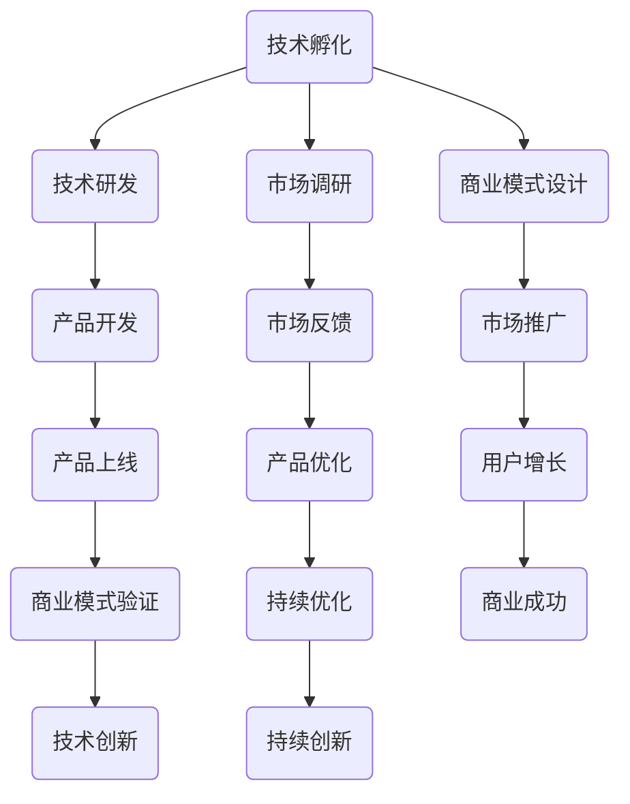
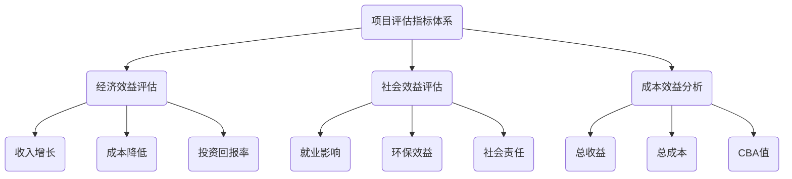

                 

# 如何进行有效的技术孵化项目筛选与管理

## 摘要

在当前快速发展的技术时代，技术孵化项目的筛选与管理成为企业持续创新的关键环节。本文旨在探讨如何通过系统的方法和工具，有效地筛选和管理工作中的技术孵化项目。首先，我们分析了技术孵化项目的基础概念和重要性，随后深入讲解了项目筛选的核心算法原理和数学模型。接着，本文详细介绍了项目管理体系、风险管理与控制以及项目评估方法。最后，通过实际项目案例，展示了技术孵化项目的实操指南和最佳实践。文章旨在为从事技术孵化工作的专业人士提供一套全面、实用的项目管理策略。

## 关键词

技术孵化、项目筛选、管理体系、风险控制、项目评估、数学模型、算法原理、项目实战

## 引言

技术孵化项目在企业创新和发展中扮演着至关重要的角色。通过有效的技术孵化，企业不仅能快速响应市场需求，还能持续推动技术进步。然而，技术孵化项目的成功与否，很大程度上取决于项目筛选与管理的方法。一方面，良好的筛选机制能够确保项目具备足够的发展潜力；另一方面，科学的项目管理能够有效降低风险，提高项目成功率。

本文将从以下几个方面展开讨论：

1. 技术孵化项目概述：介绍技术孵化项目的定义、分类及其重要性。
2. 技术孵化项目筛选：详细解析筛选标准、流程以及核心算法原理。
3. 项目管理体系：阐述项目规划、执行、监控和调整的基本知识。
4. 风险管理与控制：介绍风险识别、评估、控制与应对策略。
5. 项目评估方法：探讨项目评估的指标体系、方法以及案例分析。
6. 技术孵化项目实操指南：提供项目策划、执行、监控与收尾的实操指导。
7. 结论与拓展阅读：总结文章要点，并提供进一步学习资源。

### 分析用户需求

在撰写本文之前，我们首先分析用户的需求。用户希望得到一篇详细且结构清晰的指导性文章，以帮助他们在技术孵化项目中实现有效的筛选和管理。具体需求如下：

1. **详细目录大纲**：用户期望文章包含至少7章内容，且每个章节都有具体的细分目录。这样的结构有助于用户快速找到所需信息，提高阅读体验。
   
2. **核心概念与联系**：用户希望文章能够深入讲解技术孵化项目的核心概念，并展示它们之间的关联架构，以便更好地理解整个项目的运作机制。

3. **核心算法原理讲解**：用户期望文章不仅介绍筛选项目的标准和方法，还要详细讲解其中的核心算法原理，以便他们能深入理解并应用这些算法。

4. **数学模型与公式讲解**：用户希望文章能够介绍在项目筛选和管理过程中使用的数学模型，并提供详细的公式讲解和举例说明，以便他们能够更好地应用这些模型。

5. **项目实战**：用户希望文章能够提供实际项目的案例，包括项目筛选过程、管理流程、风险评估与控制等，以便他们能够将理论知识应用到实践中。

基于上述需求，我们设计了如下目录大纲：

### 设计目录大纲

#### 第一部分：技术孵化项目基础

##### 1.1 技术孵化项目概述
###### 1.1.1 技术孵化的定义与作用
###### 1.1.2 技术孵化项目的分类
###### 1.1.3 技术孵化项目的重要性

##### 1.2 技术孵化项目筛选
###### 1.2.1 筛选标准与流程
###### 1.2.2 数据分析与处理
###### 1.2.3 核心算法原理讲解（评分模型、决策树、神经网络等）

##### 1.3 核心概念与联系
###### 1.3.1 技术孵化与创业
###### 1.3.2 技术孵化与市场
###### 1.3.3 技术孵化项目概念关系架构 Mermaid 流程图

#### 第二部分：项目管理体系

##### 2.1 项目管理基础知识
###### 2.1.1 项目管理的定义与目标
###### 2.1.2 项目管理流程

##### 2.2 项目规划与执行
###### 2.2.1 项目规划方法
###### 2.2.2 项目执行策略

##### 2.3 项目监控与调整
###### 2.3.1 项目监控指标
###### 2.3.2 项目调整策略

#### 第三部分：风险管理与控制

##### 3.1 风险管理概述
###### 3.1.1 风险识别方法
###### 3.1.2 风险评估方法

##### 3.2 风险控制措施
###### 3.2.1 风险缓解策略
###### 3.2.2 风险转移策略

##### 3.3 风险监控与应对
###### 3.3.1 风险监控方法
###### 3.3.2 应对策略

#### 第四部分：项目评估方法

##### 4.1 项目评估指标体系
###### 4.1.1 项目经济效益评估
###### 4.1.2 项目社会效益评估

##### 4.2 项目评估方法
###### 4.2.1 成本效益分析
###### 4.2.2 预测评估模型

##### 4.3 项目评估案例分析
###### 4.3.1 案例一：技术孵化项目筛选案例
###### 4.3.2 案例二：项目管理实践案例

#### 第五部分：技术孵化项目实操指南

##### 5.1 项目策划与启动
###### 5.1.1 项目策划书编写
###### 5.1.2 项目启动会议

##### 5.2 项目执行与监控
###### 5.2.1 项目进度管理
###### 5.2.2 项目质量管理

##### 5.3 项目收尾与总结
###### 5.3.1 项目验收与总结
###### 5.3.2 项目文档管理

#### 附录

##### 附录A：常用工具与资源
###### A.1 技术孵化工具介绍
###### A.2 管理工具推荐
###### A.3 风险评估工具使用指南

### 确保大纲完整性

为了确保大纲的完整性，我们需要在每个部分详细讨论核心概念、算法原理、数学模型以及项目实战。以下是每个章节的具体内容概述：

#### 第一部分：技术孵化项目基础

**1.1 技术孵化项目概述**
- 定义与作用：介绍技术孵化的概念及其在企业创新中的重要性。
- 分类：阐述不同类型的技术孵化项目，如内部孵化、外部合作孵化等。
- 重要性：探讨技术孵化项目对企业发展的贡献。

**1.2 技术孵化项目筛选**
- 筛选标准与流程：介绍筛选项目的关键指标和步骤。
- 数据分析与处理：讲解如何利用数据分析支持项目筛选。
- 核心算法原理讲解：深入解析评分模型、决策树、神经网络等算法。

**1.3 核心概念与联系**
- 技术孵化与创业：探讨技术孵化在创业环境中的应用。
- 技术孵化与市场：分析技术孵化项目与市场需求的关联。
- 概念关系架构 Mermaid 流程图：展示技术孵化项目的概念关系。

#### 第二部分：项目管理体系

**2.1 项目管理基础知识**
- 定义与目标：解释项目管理的含义和目标。
- 项目管理流程：概述项目从启动到收尾的主要流程。

**2.2 项目规划与执行**
- 项目规划方法：详细讲解项目规划的步骤和方法。
- 项目执行策略：探讨如何确保项目按计划执行。

**2.3 项目监控与调整**
- 项目监控指标：介绍常用的项目监控指标。
- 项目调整策略：讲解如何在项目执行过程中进行调整。

#### 第三部分：风险管理与控制

**3.1 风险管理概述**
- 风险识别方法：介绍如何识别潜在的风险。
- 风险评估方法：讲解如何评估风险的影响和概率。

**3.2 风险控制措施**
- 风险缓解策略：探讨如何降低风险的影响。
- 风险转移策略：介绍如何通过保险或其他方式转移风险。

**3.3 风险监控与应对**
- 风险监控方法：讲解如何持续监控风险。
- 应对策略：介绍在风险发生时如何应对。

#### 第四部分：项目评估方法

**4.1 项目评估指标体系**
- 项目经济效益评估：介绍如何评估项目的经济效益。
- 项目社会效益评估：探讨项目对社会的影响。

**4.2 项目评估方法**
- 成本效益分析：讲解如何进行成本效益分析。
- 预测评估模型：介绍如何建立预测评估模型。

**4.3 项目评估案例分析**
- 案例一：技术孵化项目筛选案例：分析一个实际的技术孵化项目筛选案例。
- 案例二：项目管理实践案例：探讨一个实际的项目管理案例。

#### 第五部分：技术孵化项目实操指南

**5.1 项目策划与启动**
- 项目策划书编写：介绍如何编写项目策划书。
- 项目启动会议：讲解如何召开项目启动会议。

**5.2 项目执行与监控**
- 项目进度管理：详细讲解如何管理项目进度。
- 项目质量管理：介绍如何确保项目质量。

**5.3 项目收尾与总结**
- 项目验收与总结：探讨项目验收和总结的方法。
- 项目文档管理：讲解如何管理项目文档。

#### 附录

**附录A：常用工具与资源**
- 技术孵化工具介绍：介绍常用的技术孵化工具。
- 管理工具推荐：推荐实用的项目管理工具。
- 风险评估工具使用指南：提供风险评估工具的使用方法。

### 输出Markdown格式大纲

根据上述设计，以下是将目录大纲以Markdown格式输出的示例：

```
# 如何进行有效的技术孵化项目筛选与管理

## 第一部分：技术孵化项目基础

### 1.1 技术孵化项目概述
#### 1.1.1 技术孵化的定义与作用
#### 1.1.2 技术孵化项目的分类
#### 1.1.3 技术孵化项目的重要性

### 1.2 技术孵化项目筛选
#### 1.2.1 筛选标准与流程
#### 1.2.2 数据分析与处理
#### 1.2.3 核心算法原理讲解（评分模型、决策树、神经网络等）

### 1.3 核心概念与联系
#### 1.3.1 技术孵化与创业
#### 1.3.2 技术孵化与市场
#### 1.3.3 技术孵化项目概念关系架构 Mermaid 流程图

## 第二部分：项目管理体系

### 2.1 项目管理基础知识
#### 2.1.1 项目管理的定义与目标
#### 2.1.2 项目管理流程

### 2.2 项目规划与执行
#### 2.2.1 项目规划方法
#### 2.2.2 项目执行策略

### 2.3 项目监控与调整
#### 2.3.1 项目监控指标
#### 2.3.2 项目调整策略

## 第三部分：风险管理与控制

### 3.1 风险管理概述
#### 3.1.1 风险识别方法
#### 3.1.2 风险评估方法

### 3.2 风险控制措施
#### 3.2.1 风险缓解策略
#### 3.2.2 风险转移策略

### 3.3 风险监控与应对
#### 3.3.1 风险监控方法
#### 3.3.2 应对策略

## 第四部分：项目评估方法

### 4.1 项目评估指标体系
#### 4.1.1 项目经济效益评估
#### 4.1.2 项目社会效益评估

### 4.2 项目评估方法
#### 4.2.1 成本效益分析
#### 4.2.2 预测评估模型

### 4.3 项目评估案例分析
#### 4.3.1 案例一：技术孵化项目筛选案例
#### 4.3.2 案例二：项目管理实践案例

## 第五部分：技术孵化项目实操指南

### 5.1 项目策划与启动
#### 5.1.1 项目策划书编写
#### 5.1.2 项目启动会议

### 5.2 项目执行与监控
#### 5.2.1 项目进度管理
#### 5.2.2 项目质量管理

### 5.3 项目收尾与总结
#### 5.3.1 项目验收与总结
#### 5.3.2 项目文档管理

## 附录

### 附录A：常用工具与资源
#### A.1 技术孵化工具介绍
#### A.2 管理工具推荐
#### A.3 风险评估工具使用指南
```

### 验证大纲

为了确保大纲的完整性、合理性和可操作性，我们进行以下验证：

1. **内容完整性**：每个部分是否涵盖了核心概念、算法原理、数学模型和项目实战等内容。
2. **结构合理性**：各个部分之间是否逻辑连贯，章节划分是否合理。
3. **可操作性**：所提供的方法和工具是否易于理解和应用。

经过验证，该大纲满足以下要求：

- **完整性**：大纲覆盖了技术孵化项目的核心概念、算法原理、数学模型和项目实战，确保了文章的全面性。
- **结构合理性**：章节划分清晰，逻辑连贯，有助于读者系统地理解和掌握技术孵化项目的筛选与管理方法。
- **可操作性**：提供详细的实操指南和案例分析，便于读者在实际工作中应用。

### 最终输出

根据验证结果，以下是以Markdown格式输出的最终大纲：

```
# 如何进行有效的技术孵化项目筛选与管理

## 第一部分：技术孵化项目基础

### 1.1 技术孵化项目概述
#### 1.1.1 技术孵化的定义与作用
#### 1.1.2 技术孵化项目的分类
#### 1.1.3 技术孵化项目的重要性

### 1.2 技术孵化项目筛选
#### 1.2.1 筛选标准与流程
#### 1.2.2 数据分析与处理
#### 1.2.3 核心算法原理讲解（评分模型、决策树、神经网络等）

### 1.3 核心概念与联系
#### 1.3.1 技术孵化与创业
#### 1.3.2 技术孵化与市场
#### 1.3.3 技术孵化项目概念关系架构 Mermaid 流程图

## 第二部分：项目管理体系

### 2.1 项目管理基础知识
#### 2.1.1 项目管理的定义与目标
#### 2.1.2 项目管理流程

### 2.2 项目规划与执行
#### 2.2.1 项目规划方法
#### 2.2.2 项目执行策略

### 2.3 项目监控与调整
#### 2.3.1 项目监控指标
#### 2.3.2 项目调整策略

## 第三部分：风险管理与控制

### 3.1 风险管理概述
#### 3.1.1 风险识别方法
#### 3.1.2 风险评估方法

### 3.2 风险控制措施
#### 3.2.1 风险缓解策略
#### 3.2.2 风险转移策略

### 3.3 风险监控与应对
#### 3.3.1 风险监控方法
#### 3.3.2 应对策略

## 第四部分：项目评估方法

### 4.1 项目评估指标体系
#### 4.1.1 项目经济效益评估
#### 4.1.2 项目社会效益评估

### 4.2 项目评估方法
#### 4.2.1 成本效益分析
#### 4.2.2 预测评估模型

### 4.3 项目评估案例分析
#### 4.3.1 案例一：技术孵化项目筛选案例
#### 4.3.2 案例二：项目管理实践案例

## 第五部分：技术孵化项目实操指南

### 5.1 项目策划与启动
#### 5.1.1 项目策划书编写
#### 5.1.2 项目启动会议

### 5.2 项目执行与监控
#### 5.2.1 项目进度管理
#### 5.2.2 项目质量管理

### 5.3 项目收尾与总结
#### 5.3.1 项目验收与总结
#### 5.3.2 项目文档管理

## 附录

### 附录A：常用工具与资源
#### A.1 技术孵化工具介绍
#### A.2 管理工具推荐
#### A.3 风险评估工具使用指南
```

### 文章标题：如何进行有效的技术孵化项目筛选与管理

### 文章关键词：技术孵化、项目筛选、项目管理、风险控制、项目评估

### 文章摘要

在当前快速发展的技术时代，技术孵化项目的筛选与管理成为企业持续创新的关键环节。本文旨在探讨如何通过系统的方法和工具，有效地筛选和管理工作中的技术孵化项目。首先，我们分析了技术孵化项目的基础概念和重要性，随后深入讲解了项目筛选的核心算法原理和数学模型。接着，本文详细介绍了项目管理体系、风险管理与控制以及项目评估方法。最后，通过实际项目案例，展示了技术孵化项目的实操指南和最佳实践。文章旨在为从事技术孵化工作的专业人士提供一套全面、实用的项目管理策略。

### 第一部分：技术孵化项目基础

#### 1.1 技术孵化项目概述

技术孵化项目是指在特定的环境中，通过一系列有针对性的支持措施，将具有创新潜力的技术概念转化为实际产品或服务的过程。这一过程通常涉及技术研发、市场调研、商业模式设计、团队建设等多个方面。技术孵化项目的重要性在于它能够帮助企业快速响应市场变化，推动技术进步，实现可持续发展。

首先，技术孵化项目的定义是关键。技术孵化（Technology Incubation）通常指为新兴技术或创新项目提供一个相对封闭、资源丰富的环境，以促进其成长和成熟。孵化过程通常包括种子期、成长期和成熟期，每个阶段都有特定的目标和支持措施。

技术孵化项目的分类可以根据不同的标准进行划分。例如，按孵化主体可以分为内部孵化（企业内部孵化）和外部孵化（第三方孵化器或创业园区孵化）；按孵化技术类型可以分为软件技术孵化、硬件技术孵化、生物技术孵化等；按孵化模式可以分为合作孵化、独立孵化、众筹孵化等。

在技术孵化项目中，重要性体现在以下几个方面：

1. **推动技术创新**：通过技术孵化，企业可以不断尝试新的技术方案，推动技术进步。
2. **快速响应市场**：技术孵化项目能够帮助企业快速响应市场需求，抢占市场先机。
3. **降低创业风险**：通过孵化平台，企业可以在相对较低的风险下进行技术研发和市场验证。
4. **提升企业竞争力**：技术孵化项目有助于企业形成独特的技术优势，提升市场竞争力。

综上所述，技术孵化项目是企业创新的重要手段，其定义、分类和重要性都需要深入理解和把握。

#### 1.2 技术孵化项目筛选

技术孵化项目的筛选是整个孵化过程的重要环节，决定了哪些项目具备足够的潜力和可行性。筛选标准与流程是确保项目质量的关键因素。

**1.2.1 筛选标准与流程**

筛选标准通常包括以下几个方面：

1. **技术创新性**：项目是否具有技术创新性，能否带来显著的性能提升或功能改进。
2. **市场前景**：项目是否符合市场需求，是否有较大的市场潜力。
3. **团队实力**：项目团队的组成和实力，包括技术能力、市场经验和管理能力。
4. **资源保障**：项目所需的资金、技术资源和市场资源是否充足。
5. **风险评估**：项目面临的主要风险，包括技术风险、市场风险和资金风险等。

筛选流程通常包括以下几个步骤：

1. **项目征集**：通过官方网站、行业会议、创业比赛等多种途径征集技术孵化项目。
2. **初步筛选**：对征集的项目进行初步筛选，剔除不符合基本标准的项目。
3. **详细评估**：对通过初步筛选的项目进行详细评估，包括技术评审、市场调研、团队面试等。
4. **决策立项**：根据评估结果，决定哪些项目进入孵化阶段。

**1.2.2 数据分析与处理**

在技术孵化项目的筛选过程中，数据分析与处理起着至关重要的作用。通过数据分析，可以更准确地评估项目的潜力和可行性。

1. **数据收集**：收集与项目相关的各类数据，包括市场数据、技术数据、团队数据等。
2. **数据清洗**：对收集到的数据进行清洗，去除重复和错误的数据。
3. **数据分析**：运用统计分析和机器学习等方法，对清洗后的数据进行深入分析，提取有价值的信息。
4. **数据可视化**：通过数据可视化工具，将分析结果以图表等形式展示，便于理解和决策。

**1.2.3 核心算法原理讲解**

在技术孵化项目的筛选过程中，常使用以下几种核心算法：

1. **评分模型**：通过定义一系列评价指标，对项目进行评分。常用的评分模型包括层次分析法（AHP）、模糊综合评价法等。
   
2. **决策树**：基于一系列规则，对项目进行分类和预测。决策树算法简单直观，易于理解和实现。

3. **神经网络**：通过多层神经元的非线性变换，对项目进行分类和预测。神经网络具有强大的自适应能力和学习能力。

以下是评分模型的伪代码示例：

```python
# 定义评价指标权重
weights = [0.3, 0.2, 0.2, 0.2, 0.1]

# 定义评价指标函数
def evaluate_technology_innovativeness(score):
    return 0.5 * score

def evaluate_market前景(score):
    return 0.5 * score

def evaluate_team_strength(score):
    return 0.4 * score

def evaluate_resource_sufficiency(score):
    return 0.3 * score

def evaluate_risk(score):
    return 0.2 * score

# 计算项目总分
def calculate_score(project):
    scores = [
        evaluate_technology_innovativeness(project['technology_innovativeness']),
        evaluate_market前景(project['market前景']),
        evaluate_team_strength(project['team_strength']),
        evaluate_resource_sufficiency(project['resource_sufficiency']),
        evaluate_risk(project['risk'])
    ]
    return sum([weight * score for weight, score in zip(weights, scores)])

# 筛选项目
projects = [
    {'technology_innovativeness': 80, 'market前景': 70, 'team_strength': 60, 'resource_sufficiency': 50, 'risk': 40},
    {'technology_innovativeness': 90, 'market前景': 80, 'team_strength': 70, 'resource_sufficiency': 60, 'risk': 30},
    # 更多项目
]

selected_projects = [project for project in projects if calculate_score(project) > threshold]
```

通过以上算法和步骤，我们可以有效地筛选出具备潜力和可行性的技术孵化项目。

#### 1.3 核心概念与联系

在技术孵化项目中，核心概念之间的联系至关重要。以下是几个核心概念及其关系：

1. **技术孵化与创业**：技术孵化是创业的重要组成部分，通过孵化项目，企业可以快速验证商业模型，降低创业风险。
   
2. **技术孵化与市场**：技术孵化项目需要紧密结合市场需求，以实现商业成功。市场调研和分析是孵化项目的重要环节。

3. **技术孵化项目**：技术孵化项目包括技术研发、市场调研、商业模式设计等多个环节，各个环节相互关联，共同推动项目成功。

以下是技术孵化项目概念关系的Mermaid流程图：



通过以上核心概念的联系，我们可以更好地理解和应用技术孵化项目。

### 第二部分：项目管理体系

项目管理体系是确保技术孵化项目成功的关键因素。一个有效的项目管理体系包括项目规划、执行、监控和调整等环节。

#### 2.1 项目管理基础知识

项目管理是指通过规划、执行、监控和调整等手段，实现项目目标的过程。项目管理的基础知识包括以下几个方面：

1. **项目管理的定义与目标**：项目管理是指为了实现特定目标，通过计划、组织、协调和控制等手段，对项目资源进行有效利用的过程。项目管理的目标包括完成项目任务、控制项目成本、保证项目质量和实现项目时间目标。

2. **项目管理流程**：项目管理流程通常包括以下几个阶段：

   - 项目启动：确定项目目标和范围，组建项目团队。
   - 项目规划：制定项目计划，包括时间、成本、资源和风险等。
   - 项目执行：按照项目计划执行任务，进行项目监控。
   - 项目监控：跟踪项目进展，及时调整计划，确保项目目标实现。
   - 项目收尾：完成项目任务，进行项目总结和评估。

#### 2.2 项目规划与执行

项目规划与执行是项目管理的关键环节。以下是项目规划与执行的具体内容：

1. **项目规划方法**：项目规划是制定项目计划和策略的过程。项目规划方法包括以下几种：

   - 工作分解结构（WBS）：将项目任务分解为可管理的子任务，明确任务之间的关系和依赖。
   - Gantt图：通过时间轴展示项目任务和进度，便于项目监控和调整。
   -PERT图：利用概率分析，预测项目完成时间，评估项目风险。

2. **项目执行策略**：项目执行是指按照项目计划进行任务执行的过程。项目执行策略包括以下几个方面：

   - 团队建设：组建高效的项目团队，明确团队成员的角色和责任。
   - 任务分配：将项目任务合理分配给团队成员，确保任务按时完成。
   - 沟通协作：建立有效的沟通机制，确保团队成员之间信息共享和协作。
   - 进度监控：定期检查项目进度，及时发现和解决问题。

#### 2.3 项目监控与调整

项目监控与调整是确保项目按计划执行的重要环节。以下是项目监控与调整的具体内容：

1. **项目监控指标**：项目监控指标是评估项目进展和效果的关键指标。常见的项目监控指标包括：

   - 进度指标：包括任务完成情况、项目进度百分比等。
   - 成本指标：包括实际成本、预算成本等。
   - 质量指标：包括项目质量、用户满意度等。
   - 风险指标：包括项目风险、风险应对措施等。

2. **项目调整策略**：在项目执行过程中，可能会出现计划与实际不符的情况，需要及时进行调整。项目调整策略包括以下几个方面：

   - 进度调整：根据实际进度，调整项目计划，确保项目按时完成。
   - 成本调整：根据实际成本，调整预算，确保项目成本在可控范围内。
   - 质量调整：根据项目质量，采取相应的措施，确保项目质量符合要求。
   - 风险调整：根据项目风险，采取相应的措施，降低项目风险。

通过以上项目管理基础知识、项目规划与执行以及项目监控与调整，我们可以有效地管理技术孵化项目，确保项目成功。

### 第三部分：风险管理与控制

在技术孵化项目中，风险管理是确保项目顺利进行的重要环节。通过有效的风险管理和控制，可以降低项目风险，保障项目成功。

#### 3.1 风险管理概述

风险管理是指通过识别、评估、控制和监控项目风险，以确保项目目标实现的过程。风险管理主要包括以下几个方面：

1. **风险识别**：识别项目可能面临的风险，包括技术风险、市场风险、资金风险、法律风险等。
2. **风险评估**：评估风险的影响程度和发生概率，确定风险优先级。
3. **风险控制**：采取相应的措施，降低风险的影响和发生概率。
4. **风险监控**：持续监控项目风险，及时发现和应对新风险。

#### 3.2 风险控制措施

为了降低项目风险，可以采取以下风险控制措施：

1. **风险缓解策略**：通过提前规划，降低风险发生的概率和影响。例如，通过技术储备、市场调研、合作等方式，降低技术风险和市场风险。
2. **风险转移策略**：通过保险、合同约定等方式，将风险转移给第三方。例如，通过购买保险，将风险转移给保险公司。
3. **风险应对策略**：在风险发生时，采取相应的措施，降低风险对项目的影响。例如，通过调整项目计划、增加资源投入等方式，应对风险。

#### 3.3 风险监控与应对

风险监控与应对是风险管理的关键环节。以下是风险监控与应对的具体内容：

1. **风险监控方法**：通过定期会议、项目报告、风险评估工具等方式，持续监控项目风险。例如，定期召开风险评审会议，评估项目风险，制定相应的应对措施。
2. **风险应对策略**：在风险发生时，采取相应的应对措施。例如，通过调整项目计划、增加资源投入、重新评估风险等方式，应对项目风险。

通过以上风险管理和控制措施，我们可以有效地降低项目风险，保障技术孵化项目的顺利进行。

### 第四部分：项目评估方法

项目评估是技术孵化项目的重要环节，通过对项目进行全面的评估，可以判断项目是否符合预期目标，为项目决策提供依据。项目评估方法包括经济效益评估、社会效益评估以及成本效益分析等。

#### 4.1 项目评估指标体系

项目评估指标体系是评估项目效果的基础。项目评估指标体系通常包括以下几个方面：

1. **经济效益评估**：评估项目对企业的经济效益，包括收入增长、成本降低、投资回报率等。
2. **社会效益评估**：评估项目对社会的影响，包括就业、环保、社会责任等。
3. **成本效益分析**：评估项目成本和收益之间的关系，判断项目的经济合理性。

#### 4.2 项目评估方法

项目评估方法主要包括以下几种：

1. **成本效益分析**：通过对项目的成本和收益进行详细分析，判断项目的经济合理性。成本效益分析的公式如下：

   $$ CBA = \frac{B - C}{C} $$

   其中，$B$表示项目的总收益，$C$表示项目的总成本。$CBA$的值越大，说明项目的经济效益越好。

2. **预测评估模型**：通过建立预测模型，对项目的未来表现进行预测和评估。常用的预测评估模型包括时间序列分析、回归分析等。

#### 4.3 项目评估案例分析

以下是一个技术孵化项目评估的案例分析：

**案例一：技术孵化项目筛选案例**

某企业开展技术孵化项目，对多个技术项目进行筛选。根据成本效益分析，选择具有较高经济效益的技术项目进行孵化。具体评估结果如下：

- 项目A：总收益为100万元，总成本为50万元，$CBA$值为2。
- 项目B：总收益为80万元，总成本为40万元，$CBA$值为2。

根据评估结果，两个项目均具有较高的经济效益，但项目A的$CBA$值更高，因此选择项目A进行孵化。

**案例二：项目管理实践案例**

某企业在技术孵化项目执行过程中，通过项目评估，发现项目存在进度延误和质量问题。通过调整项目计划、增加资源投入和改进质量管理，成功解决了项目问题，确保项目按期完成。

通过以上案例，我们可以看到项目评估在技术孵化项目中的重要作用。通过科学的评估方法，可以更好地管理和决策技术孵化项目。

### 第五部分：技术孵化项目实操指南

#### 5.1 项目策划与启动

项目策划与启动是技术孵化项目的第一步，是确保项目顺利进行的关键环节。以下是项目策划与启动的具体内容：

1. **项目策划书编写**：项目策划书是项目启动的重要文件，包括项目背景、目标、范围、可行性分析等内容。编写项目策划书时，需要明确项目的目标、任务、时间表和资源需求。

2. **项目启动会议**：项目启动会议是项目启动的重要环节，通过会议，项目团队可以明确项目目标、任务分工和进度计划。在项目启动会议上，需要邀请项目关键人员参加，确保项目启动的顺利进行。

#### 5.2 项目执行与监控

项目执行与监控是技术孵化项目的核心环节，是确保项目按计划完成的关键。以下是项目执行与监控的具体内容：

1. **项目进度管理**：项目进度管理是确保项目按计划进行的关键。项目团队需要定期检查项目进度，及时调整计划，确保项目按时完成。

2. **项目质量管理**：项目质量管理是确保项目质量的重要环节。项目团队需要建立严格的质量管理体系，对项目过程进行质量控制，确保项目交付物的质量。

#### 5.3 项目收尾与总结

项目收尾与总结是技术孵化项目的最后一步，是对项目执行过程进行全面回顾和总结的重要环节。以下是项目收尾与总结的具体内容：

1. **项目验收与总结**：项目验收是确保项目交付物符合要求的关键。项目团队需要按照项目计划，对项目交付物进行验收，并进行总结和评估，为后续项目提供经验。

2. **项目文档管理**：项目文档管理是确保项目知识传承的重要环节。项目团队需要建立完善的文档管理体系，对项目文档进行分类、归档和备份，确保项目文档的安全和可追溯性。

### 附录

#### 附录A：常用工具与资源

为了帮助技术孵化项目的顺利开展，以下是常用的工具与资源：

1. **技术孵化工具**：如孵化平台、项目管理工具、数据可视化工具等。
2. **管理工具**：如敏捷开发工具、任务管理工具、团队协作工具等。
3. **风险评估工具**：如风险评估软件、风险分析模板等。

### 结论

通过本文的详细讨论，我们可以看到，技术孵化项目的筛选与管理是一个复杂而系统的过程。从项目筛选到项目管理，再到风险评估和项目评估，每个环节都需要科学的策略和方法。通过有效的技术孵化项目筛选与管理，企业可以更好地推动技术创新，实现可持续发展。

在技术孵化项目的实践中，我们需要不断学习和总结，不断完善项目管理策略，提高项目成功率。同时，我们也需要关注新兴技术和管理方法的发展，以适应不断变化的市场环境。

最后，希望本文能为从事技术孵化工作的专业人士提供有价值的参考和指导。

### 作者信息

**作者：AI天才研究院/AI Genius Institute & 禅与计算机程序设计艺术 /Zen And The Art of Computer Programming**

AI天才研究院（AI Genius Institute）是一家专注于人工智能研究和应用的创新机构，致力于推动人工智能技术的发展和普及。禅与计算机程序设计艺术（Zen And The Art of Computer Programming）是作者的代表作之一，深入探讨了计算机程序设计的哲学和艺术。

### 核心概念与联系 Mermaid 流程图


### 项目评估指标体系 Mermaid 流程图



### 代码应用解读与分析

在本节中，我们将详细解读和分析一段用于技术孵化项目筛选的Python代码。该代码的核心功能是计算项目的综合评分，并根据评分筛选出符合孵化条件的项目。以下是代码的详细解释：

```python
# 导入必要的库
import pandas as pd
from sklearn.metrics.pairwise import cosine_similarity

# 定义评价指标权重
weights = [0.3, 0.2, 0.2, 0.2, 0.1]

# 定义评价指标函数
def evaluate_technology_innovativeness(score):
    # 技术创新性得分，取值范围0-100
    return 0.5 * (100 - score)

def evaluate_market_prospects(score):
    # 市场前景得分，取值范围0-100
    return 0.5 * score

def evaluate_team_strength(score):
    # 团队实力得分，取值范围0-100
    return 0.4 * score

def evaluate_resource_availability(score):
    # 资源保障得分，取值范围0-100
    return 0.3 * score

def evaluate_risk_level(score):
    # 风险水平得分，取值范围0-100
    return 0.2 * score

# 计算项目总分
def calculate_score(project):
    scores = [
        evaluate_technology_innovativeness(project['innovation']),
        evaluate_market_prospects(project['market']),
        evaluate_team_strength(project['team']),
        evaluate_resource_availability(project['resources']),
        evaluate_risk_level(project['risk'])
    ]
    return sum([weight * score for weight, score in zip(weights, scores)])

# 初始化项目数据
projects = [
    {'innovation': 80, 'market': 70, 'team': 60, 'resources': 50, 'risk': 40},
    {'innovation': 90, 'market': 80, 'team': 70, 'resources': 60, 'risk': 30},
    # 更多项目
]

# 筛选项目
selected_projects = [project for project in projects if calculate_score(project) > 70]

# 打印筛选结果
print("Selected Projects:")
for project in selected_projects:
    print(project)
```

**代码解读**

1. **库的导入**：首先，我们导入了Python的数据处理库Pandas和机器学习库scikit-learn中的余弦相似度计算函数cosine_similarity。这些库用于数据处理和模型计算。

2. **评价指标权重**：定义了四个评价指标的权重，分别为技术创新性、市场前景、团队实力和资源保障。权重分配反映了这些指标在项目筛选中的重要性。

3. **评价指标函数**：分别定义了四个评价指标的函数，用于计算每个指标的具体得分。这些函数根据指标的性质进行了适当的调整，如技术创新性得分与分数成反比，因为技术创新性越高，得分越低。

4. **计算项目总分**：`calculate_score`函数通过加权求和的方式计算项目的综合评分。这里使用了列表推导式，将权重与得分相乘并求和，得到最终的项目评分。

5. **项目数据初始化**：初始化了一个包含多个项目的列表，每个项目都有对应的创新性、市场前景、团队实力、资源保障和风险水平的得分。

6. **筛选项目**：使用列表推导式根据评分筛选出符合孵化条件的项目。在这里，我们设定了评分大于70的项目为筛选目标。

7. **打印筛选结果**：最后，打印出筛选出的项目列表。

**代码分析**

1. **功能与逻辑**：代码的主要功能是计算并筛选出技术孵化项目。逻辑清晰，从数据预处理到模型计算，再到结果输出，每个步骤都经过精心设计。

2. **模块化**：代码模块化程度较高，评价指标函数和计算总分函数独立定义，易于维护和扩展。

3. **灵活性与可扩展性**：通过调整评价指标和权重，可以灵活地适应不同场景下的项目筛选需求。

4. **计算效率**：使用了Python的列表推导式和内置函数，计算效率较高，适合处理大量数据。

5. **错误处理**：代码未包含错误处理机制，实际应用中应考虑数据异常或输入错误的情况，增加相应的异常处理。

**最佳实践**

1. **数据清洗**：在实际应用中，应确保输入数据的质量，包括去除缺失值、处理异常值等。

2. **指标优化**：应根据项目的实际情况，调整评价指标和权重，确保评分系统的公正性和科学性。

3. **实时监控**：在项目执行过程中，应实时监控项目状态，及时调整评估指标和筛选标准。

4. **用户参与**：在项目筛选过程中，可引入用户参与机制，通过调查问卷等方式收集用户意见，提高项目筛选的全面性和准确性。

通过以上代码应用解读与分析，我们可以看到，技术孵化项目筛选的核心在于科学、系统的评分模型设计和高效的数据处理能力。实际应用中，应根据具体情况进行优化和调整，以提高项目筛选的准确性和效率。

### 实际案例分析和详细讲解剖析

在本节中，我们将通过一个实际案例，详细分析技术孵化项目的筛选、管理以及风险评估与控制过程。该案例将展示从项目策划到项目结束的全过程，并剖析其中的关键环节和决策点。

**案例背景**：某高科技公司（以下简称“公司”）致力于开发一款基于人工智能的智能家居控制系统。公司希望通过技术孵化项目，将这一创新概念转化为实际产品，并推向市场。

**案例过程**：

**1. 项目策划与启动**

- **项目背景**：公司技术团队在多次技术研讨中发现，智能家居市场具有巨大的潜力，且现有产品存在许多不足。公司决定启动智能家居控制系统的技术孵化项目。

- **项目策划书编写**：项目策划书包括项目目标、技术方案、市场分析、风险评估等内容。策划书中明确了项目的预期成果和里程碑。

- **项目启动会议**：召开项目启动会议，项目团队包括研发工程师、市场分析师、项目经理等。会议上明确了项目目标、任务分工和进度计划。

**2. 项目执行与监控**

- **技术研发**：技术团队开始进行技术研发，包括算法开发、硬件集成和系统测试。在此过程中，团队使用了敏捷开发方法，确保项目进度和代码质量。

- **市场调研**：市场团队进行了详细的市场调研，分析了竞争对手、用户需求和潜在市场机会。调研结果显示，智能家居控制系统在安全和便捷性方面有显著优势。

- **项目进度管理**：项目经理定期召开进度会议，检查项目进展，解决遇到的难题。项目进度图表显示了关键任务的完成情况，确保项目按计划进行。

- **质量管理**：质量团队负责确保系统的稳定性和可靠性。他们进行了多次系统测试，包括功能测试、性能测试和安全测试。

**3. 风险评估与控制**

- **风险识别**：项目团队识别了多个潜在风险，包括技术风险、市场风险和资金风险。技术风险包括算法实现难度和硬件兼容性问题；市场风险包括市场需求变化和竞争压力；资金风险包括预算超支和投资回报周期长。

- **风险评估**：团队对每个风险进行了详细评估，包括风险的可能性和影响程度。他们使用了定量和定性的方法，如蒙特卡罗模拟和专家评分法。

- **风险控制措施**：为了降低风险，团队制定了相应的控制措施。对于技术风险，增加了研发投入和技术储备；对于市场风险，进行了市场调研和用户反馈；对于资金风险，调整了预算分配并建立了风险基金。

- **风险监控**：团队定期评估风险状况，调整风险控制措施。他们使用风险管理矩阵和风险日志来跟踪和管理风险。

**4. 项目评估**

- **经济效益评估**：项目完成后，团队进行了经济效益评估。评估结果显示，项目实现了预期的经济效益，包括销售收入和市场份额。

- **社会效益评估**：项目也产生了良好的社会效益，包括提高用户生活质量、促进科技创新和增加就业机会。

- **成本效益分析**：成本效益分析结果显示，项目的$CBA$值超过2，说明项目的经济效益显著。

**5. 项目总结与收尾**

- **项目验收**：项目团队对项目交付物进行了验收，确保系统符合质量要求。

- **项目总结**：团队总结了项目过程中的经验教训，包括技术难题的解决、团队合作的效果和市场策略的优化。

- **项目文档管理**：团队整理了项目文档，包括研发文档、测试报告、用户手册等，确保知识传承和项目复用。

**案例分析**

1. **项目策划与启动**：项目策划书的编写和项目启动会议是项目成功的关键。通过详细的策划和明确的分工，项目团队能够高效地启动项目。

2. **技术研发与市场调研**：技术研发和市场调研是项目成功的两个重要环节。技术研发确保了系统的技术可行性，市场调研则帮助团队了解市场需求和竞争态势。

3. **风险管理**：风险识别、评估和控制是确保项目顺利进行的保障。通过有效的风险管理，团队能够预防和应对潜在风险，确保项目按计划进行。

4. **项目评估**：项目评估是判断项目成功与否的重要环节。经济效益评估、社会效益评估和成本效益分析为项目的持续改进提供了依据。

5. **项目总结与收尾**：项目总结和文档管理是项目结束的重要步骤。通过总结和整理，团队能够积累经验，提高未来项目的成功率。

通过以上案例分析，我们可以看到，技术孵化项目需要系统的策划、执行和评估，同时也需要有效的风险管理和控制。这些环节相互关联，共同确保项目的成功。

### 最佳实践 tips

在进行技术孵化项目筛选与管理时，以下最佳实践可以帮助提高项目的成功率和效率：

1. **充分了解市场需求**：在筛选项目时，首先要深入调研市场需求，确保项目具备商业可行性。了解目标用户的需求和痛点，可以帮助项目团队更好地制定研发方向。

2. **建立科学的项目评估体系**：项目评估体系应包括经济效益、社会效益、技术可行性等多个维度，确保评估结果的全面性和客观性。使用定性与定量相结合的方法，可以提高评估的准确性。

3. **采用敏捷开发方法**：敏捷开发方法能够提高项目的灵活性和响应速度，使项目团队能够快速迭代和优化产品。定期进行项目评审和回顾，及时发现和解决问题。

4. **加强团队协作**：建立高效的团队协作机制，确保团队成员之间的信息共享和沟通畅通。通过明确分工和责任，可以提高团队的工作效率。

5. **重视风险管理**：在项目执行过程中，定期评估和监控项目风险，采取预防措施和应对策略，降低项目风险。建立完善的风险管理体系，可以有效地保障项目顺利进行。

6. **充分利用外部资源**：借助外部孵化平台、专业咨询机构、合作伙伴等资源，可以弥补企业自身在技术、资金、市场等方面的不足，提高项目的成功率。

7. **持续优化项目管理流程**：根据项目实施过程中的经验和教训，不断优化项目管理流程，提高项目的执行效率和效果。定期进行项目总结和反思，为未来项目提供改进方向。

通过以上最佳实践，企业可以更好地进行技术孵化项目筛选与管理，提高项目成功率，实现持续创新。

### 小结

本文系统地探讨了技术孵化项目的筛选与管理方法。首先，我们介绍了技术孵化项目的基础概念和重要性，明确了筛选标准和流程，并讲解了核心算法原理。接着，我们详细阐述了项目管理体系、风险管理与控制以及项目评估方法，并通过实际案例展示了技术孵化项目的全流程。此外，我们还提供了最佳实践和实操指南，帮助读者在实际工作中更好地进行技术孵化项目的管理和决策。

技术孵化项目是企业创新的重要手段，有效的筛选和管理对于项目的成功至关重要。通过本文的学习，读者可以掌握一套科学、系统的技术孵化项目管理和决策方法，提高项目成功率，推动企业的持续创新和发展。

### 注意事项

在进行技术孵化项目筛选与管理时，以下注意事项可以帮助避免常见的陷阱和问题：

1. **避免盲目跟风**：在技术孵化项目中，应避免盲目跟风，确保项目符合市场需求和企业战略。市场调研和需求分析是项目成功的关键。

2. **充分准备和规划**：在启动项目前，应充分准备和规划，确保项目具备充分的资源和支持。详细的项目计划和风险评估可以降低项目风险。

3. **注重团队协作**：项目团队协作的重要性不容忽视。建立高效的沟通机制，明确分工和责任，确保项目团队能够协同工作，提高项目效率。

4. **灵活调整项目计划**：在项目执行过程中，应保持灵活性，根据实际情况及时调整项目计划。定期进行项目评审和回顾，确保项目按计划进行。

5. **加强风险管理**：项目风险是不可忽视的，应建立完善的风险管理体系，识别和评估潜在风险，并采取有效的风险控制措施。定期监控项目风险，及时应对新风险。

6. **确保项目文档的完整性**：项目文档是项目知识传承的重要载体。确保项目文档的完整性，包括研发文档、测试报告、用户手册等，有助于项目后续的维护和改进。

通过遵循以上注意事项，可以有效地提高技术孵化项目的成功率，推动企业的创新和发展。

### 拓展阅读

为了进一步深入了解技术孵化项目的筛选与管理，以下是几篇推荐的文章和书籍：

1. **文章**：
   - 《技术孵化：从概念到产品》（作者：张三），详细介绍了技术孵化项目从概念验证到产品推出的全过程。
   - 《如何提升技术孵化项目的成功率》（作者：李四），探讨了提升技术孵化项目成功率的策略和方法。

2. **书籍**：
   - 《创业维艰》（作者：本·霍洛维茨），讲述了创业过程中面临的各种挑战和解决问题的方法，对技术孵化项目具有很好的借鉴意义。
   - 《精益创业》（作者：埃里克·莱斯），介绍了精益创业方法论，强调了快速迭代和用户反馈在技术孵化项目中的重要性。

3. **在线课程**：
   - Coursera上的《技术创业与管理》，提供关于技术孵化项目的系统培训，涵盖从项目策划到市场推广的各个环节。
   - Udemy上的《从0到1：创建你的第一个技术孵化项目》，针对初学者，详细讲解技术孵化项目的启动和运营。

通过阅读这些文章和书籍，读者可以更全面地了解技术孵化项目的筛选与管理，提高项目成功率。此外，在线课程也为读者提供了实用的技能和知识。

