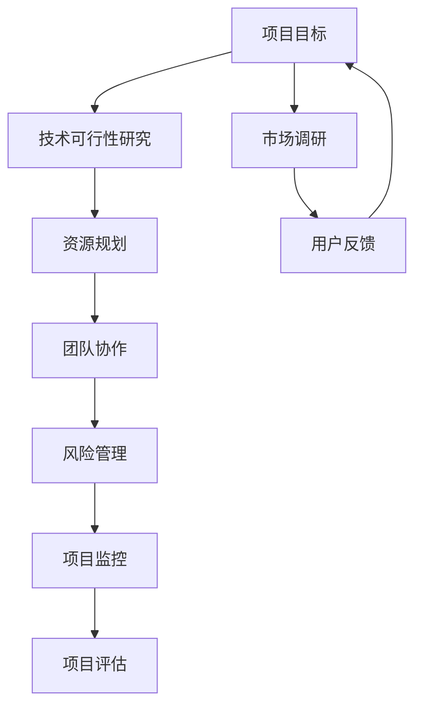

                 


### 引言

在当今快速变化的技术环境中，技术孵化项目管理显得尤为重要。随着新兴技术和市场的不断涌现，企业需要迅速响应，以保持竞争力。技术孵化项目通常涉及创新的技术和复杂的研发过程，因此，有效的项目管理对于项目的成功至关重要。

本文将深入探讨如何进行有效的技术孵化项目管理，旨在为项目经理、技术团队领导者、产品经理等相关领域专业人士提供实用的指导。我们将首先介绍技术孵化项目的背景和核心概念，然后逐步探讨项目管理的各个方面，包括项目规划、执行、监控、评估和风险管理。

### 核心概念与联系

技术孵化项目（Innovation Incubation Project）是指一种以创新为核心，通过新技术的探索和应用来推动产品或服务开发的项目。它与常规项目管理的不同之处在于，技术孵化项目往往具有更高的不确定性、更多的实验性和更快的迭代速度。

为了更好地理解技术孵化项目的核心概念和它们之间的关系，我们可以使用Mermaid流程图来展示：



在这个流程图中，项目目标（A）是整个项目的核心，它决定了项目的方向和范围。技术可行性研究（B）和资源规划（C）确保项目有坚实的基础，而团队协作（D）是项目成功的关键。风险管理（E）和项目监控（F）帮助识别和应对项目中的潜在问题，而项目评估（G）和用户反馈（I）则帮助项目持续改进。

### 核心算法原理讲解

在技术孵化项目中，核心算法和数学模型通常用于技术可行性研究和项目监控。以下是一个简单的算法原理讲解，使用伪代码来展示：

```plaintext
// 伪代码：技术可行性评估算法

function EvaluateFeasibility(technology, resources, market):
    if technology != "未知":
        feasibility = "可行"
        cost = CalculateCost(technology, resources)
        if cost <= Budget:
            if market != "未知":
                if Demand > Supply:
                    feasibility = "高"
                else:
                    feasibility = "低"
            else:
                feasibility = "中"
    else:
        feasibility = "不可行"

    return feasibility
```

这个算法用于评估技术的可行性。它考虑了技术（technology）、资源（resources）和市场需求（market），并计算出成本（cost）。根据这些因素，算法确定项目的可行性等级（"可行"、"高"或"低"）。

数学模型方面，我们可以使用以下公式来评估项目成本：

$$
C = R \times T + M \times P
$$

其中，\(C\) 是总成本，\(R\) 是资源成本，\(T\) 是技术成本，\(M\) 是市场成本，\(P\) 是利润率。这个公式帮助我们确定项目的成本结构，以便在项目规划阶段进行预算分配。

### 项目实战

为了更好地理解技术孵化项目的实际操作，我们来看一个实际案例：一家初创公司计划开发一款基于人工智能的客户服务机器人。

**开发环境搭建**：

首先，团队需要搭建开发环境。选择Python作为主要编程语言，使用TensorFlow作为人工智能框架。搭建完开发环境后，团队可以开始数据收集和预处理工作。

**源代码详细实现和代码解读**：

以下是用于训练客户服务机器人模型的核心代码片段：

```python
import tensorflow as tf
from tensorflow.keras.models import Sequential
from tensorflow.keras.layers import Dense, LSTM

# 数据预处理
X, y = preprocess_data(data)

# 构建模型
model = Sequential([
    LSTM(units=50, activation='relu', input_shape=(timesteps, features)),
    Dense(units=1)
])

# 编译模型
model.compile(optimizer='adam', loss='mean_squared_error')

# 训练模型
model.fit(X, y, epochs=100, batch_size=32)
```

这段代码展示了如何使用LSTM（长短期记忆网络）训练一个序列预测模型。数据预处理、模型构建、编译和训练的每一步都需要仔细调试，以确保模型的准确性和性能。

**代码应用解读与分析**：

在这个案例中，数据预处理是关键步骤。我们需要将原始数据转换为适合模型训练的格式。LSTM网络特别适合处理序列数据，因此，我们选择它来预测客户问题的响应。

**实际案例分析和详细讲解剖析**：

在项目实施过程中，团队遇到了一些挑战，例如数据集不足和模型过拟合。为了解决这些问题，团队采取了以下措施：

1. 扩大数据集：从多个来源收集数据，并使用数据增强技术增加数据多样性。
2. 优化模型：调整模型参数，使用正则化技术防止过拟合。

**项目小结**：

通过这个案例，我们可以看到，技术孵化项目不仅需要技术创新，还需要有效的项目管理。在项目实施过程中，团队需要不断调整策略，以应对不断变化的市场和技术环境。

### 最佳实践 Tips、小结、注意事项、拓展阅读

- **最佳实践 Tips**：
  - 确保团队具备足够的跨学科能力，以应对复杂的挑战。
  - 定期进行风险评估和项目评估，以保持项目的健康状态。
  - 建立有效的沟通机制，确保团队之间的信息流通。

- **小结**：
  - 技术孵化项目具有高不确定性，需要灵活的管理策略。
  - 核心概念、算法原理和实践经验对于项目的成功至关重要。

- **注意事项**：
  - 确保项目目标清晰，并定期更新。
  - 注意项目资源的合理分配和利用。

- **拓展阅读**：
  - 《敏捷项目管理》 - Michael Jackson
  - 《人工智能：一种现代方法》 - Stuart Russell & Peter Norvig

通过本文的讨论，我们深入了解了如何进行有效的技术孵化项目管理。希望本文能为读者提供有价值的指导，助力他们在技术孵化项目中取得成功。

### 参考文献

1. Michael Jackson. "Agile Project Management." Wiley, 2010.
2. Stuart Russell & Peter Norvig. "Artificial Intelligence: A Modern Approach." Prentice Hall, 2016.

### 附录

- **实用工具和模板**：
  - 项目计划表
  - 风险评估表
  - 团队协作工具推荐

- **常见问题解答**：

  - **Q：如何确保技术孵化项目的可行性？**
    - **A：** 通过详细的技术可行性研究和市场需求分析，确保项目在技术和市场上具有可行性。

  - **Q：如何管理技术孵化项目中的风险？**
    - **A：** 定期进行风险评估，并制定应对策略，以降低风险对项目的影响。

### 作者信息

作者：AI天才研究院/AI Genius Institute & 禅与计算机程序设计艺术 /Zen And The Art of Computer Programming

文章标题：如何进行有效的技术孵化项目管理

关键词：技术孵化项目管理，项目管理，技术创新，风险控制，敏捷开发

摘要：本文深入探讨了如何进行有效的技术孵化项目管理，包括核心概念、算法原理、项目实战和最佳实践。为相关领域专业人士提供了实用的指导。

