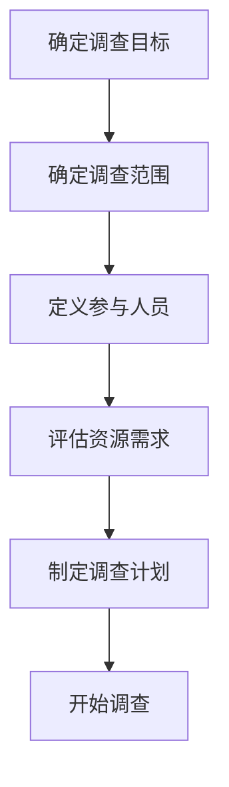

                 


### 第一部分：技术尽职调查概述

#### 第1章：技术尽职调查的基本概念与重要性

##### 1.1 技术尽职调查的定义

技术尽职调查（Technical Due Diligence，TDD）是指在进行企业并购、投资、项目合作或其他商业活动之前，对目标对象的技术能力、技术水平、技术架构、技术安全、技术负债等方面进行全面、深入的调查和评估。其核心目的是识别潜在的技术风险，确保目标对象的技术状况符合预期，从而为投资决策提供依据。

##### 1.2 技术尽职调查的目的

1. **风险识别与评估**：通过技术尽职调查，识别目标对象可能存在的技术漏洞、技术债务、技术陈旧等问题，评估其对业务的影响程度，以便采取相应的风险控制措施。
   
2. **技术能力评估**：评估目标对象的技术实力、技术水平、技术团队素质等，为投资决策提供依据。
   
3. **技术架构分析**：分析目标对象的技术架构，了解其技术栈、技术组件、技术流程等，为后续整合提供参考。
   
4. **技术安全评估**：评估目标对象的技术安全措施，确保其能够抵御外部攻击、数据泄露等风险。

##### 1.3 技术尽职调查的关键要素

1. **需求分析**：明确技术尽职调查的目标和范围，确定需要调查的具体技术领域。
   
2. **资料收集**：收集目标对象的相关技术文档、代码、系统配置等信息，为后续分析提供基础数据。
   
3. **数据分析**：对收集到的资料进行详细分析，识别潜在的技术问题和风险。
   
4. **风险评估**：对识别出的技术问题和风险进行评估，确定其影响程度和优先级。
   
5. **报告撰写**：撰写技术尽职调查报告，总结调查结果、分析发现和风险评估，为决策提供参考。

#### 第2章：技术尽职调查的流程与方法

##### 2.1 技术尽职调查的流程

1. **需求分析**：明确技术尽职调查的目标和范围，确定需要调查的具体技术领域。
   
2. **资料收集**：收集目标对象的相关技术文档、代码、系统配置等信息，为后续分析提供基础数据。
   
3. **数据分析**：对收集到的资料进行详细分析，识别潜在的技术问题和风险。
   
4. **风险评估**：对识别出的技术问题和风险进行评估，确定其影响程度和优先级。
   
5. **报告撰写**：撰写技术尽职调查报告，总结调查结果、分析发现和风险评估，为决策提供参考。

##### 2.2 技术尽职调查的方法

1. **文档审核**：通过审核目标对象的技术文档，了解其技术架构、技术组件、技术流程等。
   
2. **现场考察**：实地考察目标对象的技术环境、技术团队、技术设备等，了解其技术实力。
   
3. **沟通访谈**：与目标对象的技术人员、管理层进行沟通，了解其技术策略、技术规划、技术难题等。
   
4. **系统测试**：对目标对象的技术系统进行功能测试、性能测试、安全测试等，评估其技术状况。

在下一步，我们将详细探讨技术尽职调查的具体流程和方法，以及如何通过这些方法来识别和评估潜在的技术风险。敬请期待。让我们一步一步分析推理思考，深入探讨技术尽职调查的方方面面。

## 第1章：技术尽职调查的基本概念与重要性

### 1.1 技术尽职调查的定义

技术尽职调查（Technical Due Diligence，简称TDD）是一个专业术语，常用于企业并购、投资、项目合作等商业活动中。其定义相对宽泛，但核心目标是一致的：通过对目标对象（如公司、项目、产品等）的技术能力和状况进行全面、深入的调查和评估，以识别潜在的技术风险，为决策提供依据。

具体来说，技术尽职调查主要包括以下几个方面：

1. **技术能力评估**：评估目标对象的技术团队、技术架构、技术水平等，了解其是否具备实现项目目标的能力。
   
2. **技术债务评估**：识别目标对象在技术开发过程中可能累积的技术债务，评估其对后续开发的影响。
   
3. **技术漏洞与安全评估**：检查目标对象的技术系统是否存在安全漏洞，是否能够保障数据安全。
   
4. **技术陈旧与升级评估**：评估目标对象的技术架构是否过时，是否需要升级或更换。

### 1.2 技术尽职调查的目的

技术尽职调查的目的主要有以下几个方面：

1. **风险识别与评估**：通过技术尽职调查，识别目标对象可能存在的技术风险，如技术漏洞、技术债务、技术陈旧等，评估其对业务的影响程度，以便采取相应的风险控制措施。

2. **技术能力评估**：评估目标对象的技术实力、技术水平、技术团队素质等，为投资决策提供依据。

3. **技术架构分析**：分析目标对象的技术架构，了解其技术栈、技术组件、技术流程等，为后续整合提供参考。

4. **技术安全评估**：评估目标对象的技术安全措施，确保其能够抵御外部攻击、数据泄露等风险。

### 1.3 技术尽职调查的关键要素

进行技术尽职调查时，需要关注以下几个关键要素：

1. **需求分析**：明确技术尽职调查的目标和范围，确定需要调查的具体技术领域。

2. **资料收集**：收集目标对象的相关技术文档、代码、系统配置等信息，为后续分析提供基础数据。

3. **数据分析**：对收集到的资料进行详细分析，识别潜在的技术问题和风险。

4. **风险评估**：对识别出的技术问题和风险进行评估，确定其影响程度和优先级。

5. **报告撰写**：撰写技术尽职调查报告，总结调查结果、分析发现和风险评估，为决策提供参考。

在接下来的章节中，我们将详细探讨技术尽职调查的具体流程、方法以及如何应对其中的关键问题。通过逐步分析推理，我们希望帮助读者更好地理解技术尽职调查的实质和重要性。

### 1.3 技术尽职调查的关键要素

技术尽职调查的成功依赖于多个关键要素的准确执行。以下是对这些要素的详细讨论：

#### 1.3.1 需求分析

**背景介绍**

需求分析是技术尽职调查的起点，也是至关重要的一步。在进行需求分析时，我们需要明确以下几个关键问题：

- 调查的目标是什么？例如，是为了评估技术团队的能力，还是为了检查技术系统的安全性。
- 需要调查的范围和深度如何？例如，是否需要对所有代码库进行全面审查，还是仅关注某些关键模块。
- 参与人员有哪些？包括内部人员、外部顾问、技术专家等。

**核心概念与联系**

在需求分析过程中，核心概念之间的联系非常重要。以下是几个关键联系：

- **业务需求**与**技术需求**：业务需求通常描述了公司希望实现的具体目标，而技术需求则详细说明了为实现这些目标所需的技术支持和解决方案。
- **技术能力**与**风险评估**：了解目标对象的技术能力有助于识别潜在的风险。例如，如果技术团队缺乏某些关键技能，那么可能会增加项目延迟或失败的风险。
- **调查范围**与**资源分配**：调查范围决定了所需的资源和时间。合理的范围可以确保调查的深度和广度，同时避免资源浪费。

**流程图**

以下是一个简单的 Mermaid 流程图，展示了需求分析的关键步骤：



**伪代码**

```python
def analyze_requirements():
    target = get_survey_target()
    scope = define_survey_scope(target)
    stakeholders = identify_stakeholders()
    resource需求的 = assess_resource_requirements(scope, stakeholders)
    survey_plan = create_survey_plan(target, scope, stakeholders, resource需求的)
    start_survey(survey_plan)
```

#### 1.3.2 资料收集

**背景介绍**

资料收集是技术尽职调查的核心步骤之一。通过收集和分析相关资料，我们可以深入了解目标对象的技术状况。以下是收集资料时需要考虑的关键点：

- **技术文档**：包括项目规划、设计文档、用户手册、操作手册等。
- **代码库**：包括源代码、配置文件、依赖库等。
- **系统配置**：包括网络配置、服务器配置、数据库配置等。
- **日志文件**：包括系统日志、错误日志、审计日志等。

**核心概念与联系**

在资料收集过程中，核心概念之间的联系如下：

- **技术文档**与**代码库**：技术文档通常描述了代码的功能和实现方式，而代码库则包含了实际的代码实现。
- **系统配置**与**性能监控**：系统配置文件决定了系统的运行状态，而性能监控可以提供系统运行的实时数据。
- **日志文件**与**安全审查**：日志文件可以记录系统运行中的异常情况，有助于识别潜在的安全问题。

**伪代码**

```python
def collect_documents():
    documents = []
    for doc_type in ["project规划", "设计文档", "用户手册", "操作手册"]:
        documents.extend(find_documents(doc_type))
    return documents

def collect_codebases():
    codebases = []
    for code_type in ["源代码", "配置文件", "依赖库"]:
        codebases.extend(find_codebases(code_type))
    return codebases

def collect_system_configurations():
    configurations = {}
    configurations["网络配置"] = get_network_configurations()
    configurations["服务器配置"] = get_server_configurations()
    configurations["数据库配置"] = get_database_configurations()
    return configurations

def collect_logs():
    logs = {}
    logs["系统日志"] = get_system_logs()
    logs["错误日志"] = get_error_logs()
    logs["审计日志"] = get_audit_logs()
    return logs
```

#### 1.3.3 数据分析

**背景介绍**

数据分析是技术尽职调查的关键环节。通过对收集到的资料进行详细分析，我们可以识别潜在的技术问题和风险。以下是数据分析时需要考虑的关键点：

- **代码质量**：检查代码是否符合最佳实践，是否存在漏洞。
- **系统性能**：分析系统的性能指标，如响应时间、吞吐量等。
- **安全漏洞**：使用工具扫描系统，识别可能的安全漏洞。
- **技术债务**：识别项目中累积的技术债务，评估其对后续开发的影响。

**核心概念与联系**

在数据分析过程中，核心概念之间的联系如下：

- **代码质量**与**安全漏洞**：高质量的代码通常更难被攻击者利用，从而减少安全漏洞。
- **系统性能**与**用户体验**：高性能的系统可以提供更好的用户体验，从而提高用户满意度。
- **技术债务**与**项目风险**：技术债务可能会导致项目延迟或失败，因此需要及时识别和解决。

**数学模型与公式**

在数据分析中，我们可能会使用一些数学模型和公式来评估技术风险。以下是一个简单的示例：

- **代码缺陷密度**：$$D = \frac{N_{bugs}}{N_{lines}}$$
- **安全漏洞评分**：$$S = \frac{N_{vulnerabilities}}{N_{components}}$$
- **技术债务评估**：$$R = \frac{D_{debt}}{T_{deadline}}$$

**伪代码**

```python
def analyze_data(documents, codebases, configurations, logs):
    code质量问题 = analyze_code_quality(codebases)
    system性能问题 = analyze_system_performance(configurations, logs)
    security漏洞 = analyze_security_vulnerabilities(configurations, logs)
    technical债务 = analyze_technical_debt(codebases)
    return {
        "代码质量": code质量问题,
        "系统性能": system性能问题,
        "安全漏洞": security漏洞,
        "技术债务": technical债务
    }
```

#### 1.3.4 风险评估

**背景介绍**

风险评估是技术尽职调查的关键步骤之一。通过对识别出的技术问题和风险进行评估，我们可以确定其影响程度和优先级，从而为决策提供依据。以下是风险评估时需要考虑的关键点：

- **风险识别**：识别技术尽职调查过程中发现的所有风险。
- **风险评估**：对识别出的风险进行定量和定性评估，确定其影响程度和优先级。
- **风险应对**：制定相应的风险应对策略，以降低风险的影响。

**核心概念与联系**

在风险评估过程中，核心概念之间的联系如下：

- **风险识别**与**风险评估**：风险识别是评估的前提，而风险评估则是风险识别的深化和具体化。
- **风险应对**与**决策制定**：风险应对策略直接影响决策制定，因此需要综合考虑。

**伪代码**

```python
def assess_risks(technical_issues):
    risks = []
    for issue in technical_issues:
        impact = assess_impact(issue)
        probability = assess_probability(issue)
        risk = {
            "问题": issue,
            "影响": impact,
            "概率": probability,
            "等级": calculate_risk_level(impact, probability)
        }
        risks.append(risk)
    return risks

def calculate_risk_level(impact, probability):
    if impact == "重大" and probability == "高":
        return "严重"
    elif impact == "重大" or probability == "高":
        return "重要"
    else:
        return "一般"
```

#### 1.3.5 报告撰写

**背景介绍**

报告撰写是技术尽职调查的最后一个关键步骤。通过撰写详细的技术尽职调查报告，我们可以总结调查结果、分析发现和风险评估，为决策提供全面、准确的参考。以下是撰写报告时需要考虑的关键点：

- **报告结构**：报告应包括摘要、目录、引言、需求分析、资料收集、数据分析、风险评估、结论和建议等部分。
- **内容详实**：报告应详细描述技术尽职调查的流程、方法、分析结果和风险评估，确保内容详实、准确。
- **建议明确**：报告应提出明确的改进建议和风险应对措施，以便决策者参考。

**核心概念与联系**

在报告撰写过程中，核心概念之间的联系如下：

- **摘要**与**引言**：摘要应简明扼要地概括报告的主要内容，引言则应详细描述技术尽职调查的背景和目的。
- **数据分析**与**风险评估**：数据分析是风险评估的基础，而风险评估则是数据分析的具体应用。
- **结论和建议**与**决策制定**：结论和建议应基于数据分析与风险评估的结果，为决策者提供明确的决策依据。

**伪代码**

```python
def write_report(summary, introduction, analysis_results, risk_assessments, conclusions, recommendations):
    report = {
        "摘要": summary,
        "目录": create_table_of_contents(),
        "引言": introduction,
        "需求分析": analysis_requirements(),
        "资料收集": collect_documents(),
        "数据分析": analyze_data(),
        "风险评估": assess_risks(),
        "结论": conclusions,
        "建议": recommendations
    }
    return report
```

通过上述关键要素的详细讨论，我们希望读者能够对技术尽职调查的基本概念和重要性有更深入的理解。在下一章，我们将进一步探讨技术尽职调查的具体流程和方法，以及如何应对其中的关键问题。敬请期待。

### 2.1 技术尽职调查的流程

技术尽职调查是一个系统化的过程，涉及多个关键步骤。以下是对这些步骤的详细说明，以及每个步骤在实际操作中的注意事项。

#### 2.1.1 需求分析

**步骤说明**

需求分析是技术尽职调查的第一步，其目标是明确调查的目标和范围。具体步骤如下：

1. **确定调查目标**：明确技术尽职调查的目的，例如评估技术团队的能力、检查技术系统的安全性、评估技术债务等。
2. **定义调查范围**：根据调查目标，确定需要调查的具体技术领域，如代码库、技术文档、系统配置等。
3. **确定参与人员**：明确参与技术尽职调查的人员，包括内部人员、外部顾问、技术专家等。
4. **评估资源需求**：根据调查范围和目标，评估所需的资源和时间，如人力资源、技术工具等。
5. **制定调查计划**：制定详细的调查计划，包括调查时间表、调查方法、调查内容等。

**注意事项**

- **明确目标**：确保调查目标具体、明确，避免在调查过程中偏离重点。
- **合理分配资源**：根据调查范围和目标，合理分配资源和时间，确保调查能够按时、高质量完成。
- **涉及多方**：确保调查计划得到所有相关人员的认可和参与，以避免调查结果的偏见。

#### 2.1.2 资料收集

**步骤说明**

资料收集是技术尽职调查的核心步骤，其目标是获取目标对象的相关信息。具体步骤如下：

1. **确定收集内容**：根据需求分析的结果，确定需要收集的资料类型，如技术文档、代码库、系统配置等。
2. **获取资料**：通过目标对象的文档、代码库、服务器等获取所需资料。
3. **整理资料**：对收集到的资料进行整理和分类，确保资料的完整性和可读性。
4. **验证资料**：验证资料的准确性和完整性，确保资料的真实性和可靠性。

**注意事项**

- **确保完整性**：收集资料时，要确保收集到的资料覆盖所有相关领域，避免遗漏关键信息。
- **保护隐私**：在收集和处理资料时，要注意保护隐私和敏感信息，避免泄露。
- **及时更新**：在调查过程中，要及时更新收集到的资料，确保其时效性和准确性。

#### 2.1.3 数据分析

**步骤说明**

数据分析是对收集到的资料进行详细分析，以识别潜在的技术问题和风险。具体步骤如下：

1. **审查技术文档**：分析技术文档，了解目标对象的技术架构、技术组件、技术流程等。
2. **审查代码库**：分析代码库，识别代码质量、潜在漏洞、技术债务等。
3. **审查系统配置**：分析系统配置，了解系统的运行状态、性能指标等。
4. **审查日志文件**：分析日志文件，识别系统异常、安全事件等。
5. **进行数据对比**：将收集到的数据与行业标准、最佳实践等进行对比，评估目标对象的技术水平。

**注意事项**

- **全面分析**：对收集到的资料进行全面分析，避免因局部分析导致的结果偏差。
- **关注细节**：在分析过程中，要关注细节，如代码注释、配置参数等，以确保分析结果的准确性。
- **多方验证**：在分析过程中，可以邀请外部专家进行验证，以增加分析结果的可靠性。

#### 2.1.4 风险评估

**步骤说明**

风险评估是对识别出的技术问题和风险进行评估，以确定其影响程度和优先级。具体步骤如下：

1. **识别风险**：根据数据分析的结果，识别目标对象可能面临的技术风险。
2. **评估风险**：对识别出的风险进行定量和定性评估，确定其影响程度和优先级。
3. **制定应对策略**：根据风险评估的结果，制定相应的风险应对策略，以降低风险的影响。
4. **更新调查报告**：将风险评估的结果纳入调查报告，为决策提供依据。

**注意事项**

- **科学评估**：风险评估应基于数据和事实，避免主观判断和偏见。
- **合理应对**：制定的风险应对策略应切实可行，并能够有效降低风险的影响。
- **及时更新**：在风险评估过程中，要密切关注风险变化，及时更新评估结果和应对策略。

#### 2.1.5 报告撰写

**步骤说明**

报告撰写是对技术尽职调查过程和结果的总结，其目标是提供决策依据。具体步骤如下：

1. **编写报告大纲**：根据调查内容和结果，编写报告大纲，确保报告结构清晰、逻辑严密。
2. **撰写报告正文**：根据大纲，撰写报告正文，包括需求分析、资料收集、数据分析、风险评估等内容。
3. **添加结论和建议**：总结调查结果，提出结论和建议，为决策者提供参考。
4. **审稿与修改**：对报告进行审稿，确保报告内容准确、完整、逻辑清晰。
5. **定稿**：完成报告定稿，确保报告格式规范、排版美观。

**注意事项**

- **内容准确**：报告内容应准确反映调查结果和分析结论，避免误导决策者。
- **逻辑清晰**：报告应结构清晰，逻辑严密，确保读者能够快速理解调查过程和结果。
- **格式规范**：报告格式应规范，包括标题、摘要、目录、正文、参考文献等。

通过上述详细步骤的说明，我们希望读者能够对技术尽职调查的流程有更深入的理解。在下一章，我们将探讨技术尽职调查的具体方法，包括文档审核、现场考察、沟通访谈和系统测试等。敬请期待。

### 2.2 技术尽职调查的方法

技术尽职调查的方法多种多样，每种方法都有其独特的优势和应用场景。以下是对文档审核、现场考察、沟通访谈和系统测试这四种主要方法的详细探讨。

#### 2.2.1 文档审核

**背景介绍**

文档审核是技术尽职调查中最基本的方法之一。通过审核目标对象的技术文档，可以初步了解其技术架构、开发流程、团队组织结构等。这种方法的优点在于操作简单、成本低，且可以快速获得大量信息。

**核心概念与联系**

- **技术文档**：包括项目规划文档、设计文档、用户手册、操作手册等。
- **文档质量**：技术文档的质量直接影响项目开发的效果和效率。

**具体步骤**

1. **确定审核范围**：根据需求分析的结果，确定需要审核的技术文档类型和具体内容。
2. **查阅文档**：查阅相关技术文档，了解目标对象的技术架构、开发流程、团队组织结构等。
3. **评估文档质量**：评估技术文档的完整性、准确性和一致性，发现潜在的问题和风险。

**优点与局限性**

- **优点**：操作简单、成本低，可以快速获取大量信息。
- **局限性**：只能提供初步的信息，无法深入分析技术细节。

#### 2.2.2 现场考察

**背景介绍**

现场考察是一种深入调查的方法，通过实地考察目标对象的技术环境、技术团队、技术设备等，可以更全面地了解其技术状况。这种方法适用于对目标对象的技术实力和技术环境有较高要求的调查。

**核心概念与联系**

- **技术环境**：包括开发环境、测试环境、生产环境等。
- **技术团队**：包括团队成员的技能水平、工作经验、团队协作等。

**具体步骤**

1. **预约考察时间**：与目标对象预约考察时间，确保在合适的时间和环境下进行考察。
2. **进行现场考察**：实地考察目标对象的技术环境、技术团队、技术设备等。
3. **收集信息**：通过观察和与技术人员交流，收集有关目标对象的技术信息。
4. **评估技术实力**：根据收集到的信息，评估目标对象的技术实力和技术环境。

**优点与局限性**

- **优点**：可以更全面地了解目标对象的技术状况，提高调查的深度。
- **局限性**：需要耗费较多时间和资源，且受时间和地点的限制。

#### 2.2.3 沟通访谈

**背景介绍**

沟通访谈是一种通过与目标对象的技术人员、管理层等进行面对面的交流，获取详细技术信息的方法。这种方法适用于需要深入了解目标对象的技术策略、技术规划和技术难题的情况。

**核心概念与联系**

- **技术策略**：包括技术路线、技术发展方向、技术投入等。
- **技术规划**：包括技术开发计划、技术预算、技术目标等。

**具体步骤**

1. **确定访谈对象**：根据需求分析的结果，确定需要访谈的技术人员和管理层。
2. **预约访谈时间**：与访谈对象预约访谈时间，确保在合适的时间和环境下进行访谈。
3. **进行访谈**：与访谈对象进行面对面的交流，获取有关技术信息。
4. **记录访谈内容**：详细记录访谈内容，确保信息的准确性和完整性。

**优点与局限性**

- **优点**：可以深入了解目标对象的技术策略、技术规划和技术难题，获取详细的信息。
- **局限性**：需要耗费较多时间和人力资源，且受访谈对象的个人经验和主观判断的影响。

#### 2.2.4 系统测试

**背景介绍**

系统测试是一种通过对目标对象的技术系统进行功能测试、性能测试、安全测试等，评估其技术状况的方法。这种方法适用于对目标对象的技术性能和安全有较高要求的调查。

**核心概念与联系**

- **功能测试**：验证技术系统的功能是否符合设计要求。
- **性能测试**：评估技术系统的响应时间、吞吐量、并发处理能力等性能指标。
- **安全测试**：检测技术系统的安全漏洞，评估其安全性。

**具体步骤**

1. **确定测试范围**：根据需求分析的结果，确定需要测试的技术系统功能、性能和安全指标。
2. **准备测试环境**：搭建测试环境，确保测试的公正性和准确性。
3. **进行功能测试**：验证技术系统的功能是否符合设计要求。
4. **进行性能测试**：评估技术系统的响应时间、吞吐量、并发处理能力等性能指标。
5. **进行安全测试**：检测技术系统的安全漏洞，评估其安全性。

**优点与局限性**

- **优点**：可以全面评估目标对象的技术系统，发现问题并提供改进建议。
- **局限性**：需要具备相应的测试工具和技能，且测试过程可能需要较长的时间和资源。

通过上述对四种方法的详细探讨，我们希望读者能够了解技术尽职调查的各种方法及其适用场景，从而选择合适的方法进行调查。在下一章，我们将通过实际案例来具体展示如何进行技术尽职调查，并分享经验和教训。敬请期待。

### 3.1 技术尽职调查中的关键问题与应对策略

技术尽职调查过程中，可能会遇到多种关键问题，这些问题不仅影响调查的准确性，还可能对后续的投资决策产生重大影响。以下是一些常见的关键问题及其应对策略。

#### 3.1.1 技术漏洞

**背景介绍**

技术漏洞是指在软件开发过程中，由于设计缺陷、编码错误或配置不当等原因，导致系统存在可被攻击者利用的安全漏洞。技术尽职调查过程中，识别技术漏洞是确保系统安全的重要环节。

**具体问题**

- **未修补的已知漏洞**：目标对象可能存在已知的漏洞，但未及时修补。
- **潜在的安全漏洞**：目标对象的技术系统可能存在潜在的安全漏洞，这些漏洞可能在特定条件下被利用。

**应对策略**

1. **漏洞扫描**：使用自动化工具对目标对象的技术系统进行漏洞扫描，识别已知漏洞。
2. **代码审查**：对目标对象的代码库进行详细审查，识别潜在的漏洞。
3. **安全培训**：对目标对象的技术团队进行安全培训，提高其对安全漏洞的认识和应对能力。

#### 3.1.2 技术债务

**背景介绍**

技术债务是指在软件开发过程中，为了快速推进项目进度，采取的某些妥协或简化的方案。这些方案可能会在后续开发中导致一系列问题，从而影响项目的质量和效率。

**具体问题**

- **遗留问题**：目标对象的技术系统中可能存在遗留的问题，这些问题可能会影响系统的稳定性和性能。
- **不兼容的组件**：目标对象的技术系统可能包含不兼容的组件，导致系统出现故障。

**应对策略**

1. **代码审查**：对目标对象的代码库进行详细审查，识别技术债务。
2. **技术评估**：评估目标对象的技术架构，确定其是否存在技术债务。
3. **改进计划**：制定技术债务的改进计划，逐步解决遗留问题。

#### 3.1.3 技术陈旧

**背景介绍**

技术陈旧是指目标对象的技术系统或技术组件已经过时，无法满足当前的业务需求或技术发展要求。技术尽职调查中，识别技术陈旧对于确保系统的可持续性和创新能力至关重要。

**具体问题**

- **旧的技术架构**：目标对象可能使用过时的技术架构，导致系统性能低下。
- **不兼容的技术组件**：目标对象的技术系统中可能存在不兼容的技术组件，影响系统的稳定性和扩展性。

**应对策略**

1. **技术评估**：对目标对象的技术架构和技术组件进行评估，确定其陈旧程度。
2. **技术升级**：根据评估结果，制定技术升级计划，逐步替换陈旧的技术组件。
3. **技术培训**：对目标对象的技术团队进行技术培训，提高其对新技术和最佳实践的认识。

#### 3.1.4 技术能力不足

**背景介绍**

技术能力不足是指目标对象的技术团队在技能、经验、知识等方面无法满足项目需求。技术尽职调查中，识别技术能力不足对于确保项目的成功实施至关重要。

**具体问题**

- **技能不足**：目标对象的技术团队可能缺乏某些关键技术技能，导致项目进度延误。
- **经验不足**：目标对象的技术团队可能缺乏相关项目经验，无法有效应对项目中的挑战。

**应对策略**

1. **能力评估**：对目标对象的技术团队进行能力评估，识别其技术能力不足的领域。
2. **培训与招聘**：根据能力评估结果，制定培训计划或招聘计划，提高技术团队的整体能力。
3. **项目支持**：为技术团队提供必要的项目支持和资源，确保项目能够顺利推进。

通过上述关键问题的详细讨论，我们希望读者能够对技术尽职调查中的常见问题及其应对策略有更深入的理解。在下一章，我们将通过实际案例来具体展示技术尽职调查的过程和方法。敬请期待。

### 3.2 风险评估与应对

#### 3.2.1 风险评估方法

风险评估是技术尽职调查的重要组成部分，旨在识别和评估目标对象在技术方面可能面临的风险，为决策提供依据。以下是一些常见的风险评估方法：

1. **定性风险评估**：
   - **风险矩阵**：通过构建风险矩阵，将风险的发生概率和影响程度进行量化，评估风险的总得分，从而确定风险的优先级。
   - **专家评审**：邀请技术专家对识别出的风险进行评审，根据专家的经验和判断，确定风险的程度和优先级。

2. **定量风险评估**：
   - **概率风险评估**：通过历史数据和统计分析，计算风险发生的概率和潜在影响，评估风险的总得分。
   - **蒙特卡洛模拟**：使用蒙特卡洛模拟等方法，模拟风险发生的情景，评估风险的潜在影响。

3. **综合风险评估**：
   - **多维度评估**：综合考虑风险的发生概率、影响程度、可接受性等多个维度，评估风险的整体状况。
   - **层次分析法**（AHP）：将风险因素分解为多个层次，通过专家评分和计算，确定各个风险因素的权重，评估整体风险。

#### 3.2.2 风险等级划分

在完成风险评估后，需要对识别出的风险进行等级划分，以便于后续的风险应对和管理。常见的风险等级划分方法如下：

1. **五级风险划分**：
   - **一级风险**：高风险，可能导致重大损失或业务中断。
   - **二级风险**：中高风险，可能导致较大损失或业务影响。
   - **三级风险**：中风险，可能导致一定损失或业务影响。
   - **四级风险**：低风险，可能导致较小损失或业务影响。
   - **五级风险**：低风险，可能导致轻微损失或业务影响。

2. **四级风险划分**：
   - **一级风险**：致命风险，可能导致业务完全中断或重大损失。
   - **二级风险**：严重风险，可能导致业务严重中断或重大损失。
   - **三级风险**：一般风险，可能导致业务中断或一定损失。
   - **四级风险**：轻微风险，可能导致业务影响或轻微损失。
   - **五级风险**：可接受风险，对业务几乎没有影响。

#### 3.2.3 应对策略

针对不同等级的风险，需要采取相应的应对策略。以下是一些常见的风险应对策略：

1. **一级和二级风险**：
   - **风险规避**：通过调整业务策略，避免与高风险相关的业务活动。
   - **风险转移**：通过购买保险或签订合同，将风险转移给第三方。
   - **风险减轻**：通过改进技术架构、加强安全措施等，降低风险的发生概率和影响程度。

2. **三级和四级风险**：
   - **风险监控**：通过监控系统运行状态，及时发现和应对风险。
   - **风险缓解**：通过改进技术流程、优化系统配置等，降低风险的发生概率和影响程度。
   - **风险接受**：对于一些低风险且无法避免的风险，采取接受的态度，制定相应的应急响应计划。

3. **五级风险**：
   - **风险记录**：对于一些对业务几乎没有影响的五级风险，记录并监控其变化，以便在风险升级时及时应对。
   - **风险告知**：向相关利益相关者告知风险的存在，提高其风险意识。

通过上述风险评估与应对策略的详细说明，我们希望读者能够更好地理解和应用这些方法，在实际的技术尽职调查过程中有效地识别和应对风险。在下一章，我们将通过实际案例来进一步展示风险评估的应用和效果。敬请期待。

### 4.1 案例分析

#### 4.1.1 案例一：软件安全尽职调查

**背景介绍**

在一次企业并购项目中，收购方是一家全球领先的科技公司，其目标对象是一家专注于软件开发的初创公司。收购方担心目标公司的软件产品存在安全漏洞，可能会影响其品牌声誉和业务运营，因此决定进行一次软件安全尽职调查。

**调查步骤**

1. **需求分析**：明确调查目标，即评估目标公司的软件产品是否存在安全漏洞。
2. **资料收集**：收集目标公司的软件代码、安全测试报告、用户手册等。
3. **数据分析**：对收集到的资料进行详细分析，识别潜在的安全漏洞。
4. **风险评估**：对识别出的漏洞进行风险评估，确定其影响程度和优先级。
5. **报告撰写**：撰写详细的调查报告，包括漏洞列表、风险评估结果和改进建议。

**调查结果**

通过调查，发现目标公司的软件产品存在以下几类安全漏洞：

- **SQL注入**：在数据库查询过程中，未对用户输入进行充分验证，可能导致恶意数据注入。
- **跨站脚本攻击（XSS）**：在用户界面中，未对用户输入进行转义处理，可能导致攻击者在用户浏览器中执行恶意脚本。
- **不安全的文件上传**：在文件上传功能中，未对文件类型和大小进行限制，可能导致恶意文件上传和执行。

**风险评估**

- **SQL注入**：风险等级为高，可能导致敏感数据泄露和业务中断。
- **XSS攻击**：风险等级为中，可能导致用户信息泄露和业务中断。
- **不安全的文件上传**：风险等级为中，可能导致恶意代码执行和业务中断。

**应对策略**

- **SQL注入**：建议对数据库查询进行参数化处理，确保输入验证。
- **XSS攻击**：建议对用户输入进行转义处理，防止恶意脚本执行。
- **不安全的文件上传**：建议对文件类型和大小进行限制，防止恶意文件上传。

#### 4.1.2 案例二：IT系统整合尽职调查

**背景介绍**

在一次企业合并项目中，合并双方都是大型企业，各自拥有复杂的IT系统。合并后，双方计划整合IT系统，以实现业务流程的优化和成本节约。由于IT系统之间的兼容性和数据安全性问题，双方决定进行一次IT系统整合尽职调查。

**调查步骤**

1. **需求分析**：明确调查目标，即评估IT系统之间的兼容性、数据安全性和性能。
2. **资料收集**：收集双方企业的IT系统文档、配置文件、系统日志等。
3. **数据分析**：对收集到的资料进行详细分析，识别潜在的系统整合问题。
4. **风险评估**：对识别出的整合问题进行风险评估，确定其影响程度和优先级。
5. **报告撰写**：撰写详细的调查报告，包括整合问题、风险评估结果和改进建议。

**调查结果**

通过调查，发现以下几类整合问题：

- **系统兼容性问题**：双方IT系统的技术架构和组件不兼容，导致数据交换和功能调用困难。
- **数据安全性问题**：双方IT系统的安全策略和措施不一致，可能导致数据泄露和违规操作。
- **性能瓶颈问题**：双方IT系统的性能指标不一致，可能导致业务运行不稳定。

**风险评估**

- **系统兼容性问题**：风险等级为高，可能导致业务中断和效率降低。
- **数据安全性问题**：风险等级为中，可能导致数据泄露和业务中断。
- **性能瓶颈问题**：风险等级为中，可能导致业务运行不稳定。

**应对策略**

- **系统兼容性问题**：建议进行系统架构调整，确保双方系统之间的兼容性。
- **数据安全性问题**：建议制定统一的安全策略，确保双方系统的数据安全性。
- **性能瓶颈问题**：建议进行系统性能优化，提高系统的稳定性和响应速度。

#### 4.1.3 案例三：云计算服务尽职调查

**背景介绍**

在一次企业数字化转型项目中，企业计划采用云计算服务。由于云计算服务的可靠性和安全性对企业业务至关重要，企业决定进行一次云计算服务尽职调查。

**调查步骤**

1. **需求分析**：明确调查目标，即评估云计算服务的可靠性、安全性和性能。
2. **资料收集**：收集云计算服务提供商的文档、服务合同、安全报告等。
3. **数据分析**：对收集到的资料进行详细分析，识别潜在的服务问题。
4. **风险评估**：对识别出的服务问题进行风险评估，确定其影响程度和优先级。
5. **报告撰写**：撰写详细的调查报告，包括服务问题、风险评估结果和改进建议。

**调查结果**

通过调查，发现以下几类服务问题：

- **可靠性问题**：云计算服务提供商的硬件设备和网络存在故障，可能导致服务中断。
- **安全性问题**：云计算服务提供商的安全措施不足，可能导致数据泄露和恶意攻击。
- **性能问题**：云计算服务的响应时间和吞吐量不稳定，可能导致业务运行不稳定。

**风险评估**

- **可靠性问题**：风险等级为高，可能导致业务中断和客户投诉。
- **安全性问题**：风险等级为中，可能导致数据泄露和业务中断。
- **性能问题**：风险等级为中，可能导致业务运行不稳定。

**应对策略**

- **可靠性问题**：建议云计算服务提供商增加硬件设备和网络冗余，提高服务的可靠性。
- **安全性问题**：建议云计算服务提供商加强安全措施，确保数据的安全性。
- **性能问题**：建议云计算服务提供商优化资源配置，提高服务的性能。

通过上述案例的分析，我们可以看到技术尽职调查在实际应用中的重要性。通过详细的需求分析、资料收集、数据分析、风险评估和报告撰写，可以有效地识别和解决潜在的技术问题和风险，为投资决策提供可靠的依据。

### 4.2 经验分享

#### 4.2.1 成功的尽职调查实践

在技术尽职调查中，成功的实践往往依赖于以下几个方面：

1. **全面的需求分析**：成功的尽职调查始于明确的需求分析。在分析过程中，不仅要关注技术方面的问题，还要综合考虑业务需求、市场环境等因素，确保调查目标全面、具体。

2. **合理的资源分配**：成功的尽职调查需要合理的资源分配，包括人力资源、技术工具和时间等。在资源有限的情况下，应优先考虑关键技术和高风险领域的调查。

3. **科学的评估方法**：采用科学、合理的评估方法，如定量评估、专家评审等，可以提高风险评估的准确性和可靠性。同时，评估过程中要充分考虑不同风险因素的权重和相互作用。

4. **及时的反馈与调整**：在调查过程中，要密切关注评估结果，及时反馈和调整调查策略。例如，如果发现新的技术漏洞或风险，应立即进行深入分析和评估，制定相应的应对措施。

5. **有效的沟通与协作**：尽职调查是一个跨部门、跨领域的合作过程，需要各方的有效沟通与协作。通过建立良好的沟通机制，确保调查过程透明、高效，有助于提高调查质量。

#### 4.2.2 失败的尽职调查教训

尽管技术尽职调查在许多项目中取得了成功，但也存在一些失败的案例。以下是一些失败的教训：

1. **忽视细节**：在尽职调查过程中，忽视细节可能导致重要问题的遗漏。例如，未对代码进行详细审查，可能导致隐藏的安全漏洞未被发现。

2. **评估不准确**：不准确的评估可能导致决策失误。例如，对技术债务的评估过于乐观，未能准确预测其对项目进度和成本的影响。

3. **缺乏独立性**：尽职调查团队如果缺乏独立性，可能受到目标对象的影响，导致评估结果失真。例如，目标对象可能提供虚假信息或隐瞒关键问题。

4. **时间紧迫**：在时间紧迫的情况下，尽职调查可能被简化，导致调查深度不足。例如，未能进行全面的技术测试，可能导致潜在的问题未被及时发现。

5. **忽视合规性**：技术尽职调查不仅涉及技术问题，还涉及合规性审查。忽视合规性可能导致法律风险和业务风险。

#### 4.2.3 技术尽职调查的最佳实践

基于成功的经验和失败的教训，以下是一些技术尽职调查的最佳实践：

1. **制定详细的调查计划**：在开始尽职调查前，制定详细的调查计划，明确调查目标、范围、方法和时间安排。

2. **组建专业的调查团队**：组建由不同领域专家组成的调查团队，确保具备全面的技术知识和丰富的实践经验。

3. **采用多种调查方法**：结合文档审核、现场考察、沟通访谈、系统测试等多种调查方法，提高调查的深度和广度。

4. **建立科学的评估体系**：建立科学的评估体系，包括定量评估和定性评估方法，确保评估结果的准确性和可靠性。

5. **确保调查过程的独立性**：确保尽职调查过程的独立性，避免受到目标对象的影响，确保评估结果的客观公正。

6. **及时更新调查资料**：在调查过程中，及时更新调查资料，确保资料的时效性和准确性。

7. **制定详细的报告**：撰写详细的尽职调查报告，包括调查结果、分析发现、风险评估和改进建议，为决策提供全面、准确的参考。

通过上述经验分享和最佳实践，我们希望读者能够更好地理解和应用技术尽职调查的方法和策略，在实际项目中取得成功。

### 5.1 自动化工具概述

自动化工具在技术尽职调查中起着至关重要的作用，能够显著提高调查的效率和准确性。以下是对自动化工具的概述，以及它们在技术尽职调查中的应用。

#### 5.1.1 自动化工具的作用

自动化工具能够实现以下作用：

1. **提高效率**：自动化工具可以自动执行重复性、繁琐的任务，如代码扫描、漏洞检测等，从而节省调查人员的时间和精力。
   
2. **减少错误**：自动化工具能够减少人工调查中的疏漏和错误，提高调查的准确性。例如，自动化测试工具可以模拟各种场景，发现潜在的问题。

3. **统一标准**：自动化工具可以确保调查过程遵循统一的标准和方法，减少主观判断的影响，提高调查的一致性。

4. **实时监控**：自动化工具可以实时监控系统的运行状态，及时发现异常情况，提高问题识别的速度。

#### 5.1.2 常用自动化工具介绍

在技术尽职调查中，常用的自动化工具有以下几类：

1. **代码审查工具**：
   - **SonarQube**：一款开源的代码质量平台，能够检测代码中的漏洞、编码规范问题和代码质量。
   - **Checkmarx**：一款专业的代码安全扫描工具，可以识别各种安全漏洞，如SQL注入、XSS等。

2. **漏洞扫描工具**：
   - **Nessus**：一款广泛使用的漏洞扫描工具，能够发现系统中的安全漏洞，并提供详细的修复建议。
   - **OpenVAS**：一款开源的漏洞扫描平台，具备强大的漏洞检测能力。

3. **性能测试工具**：
   - **JMeter**：一款开源的性能测试工具，可以模拟大量用户同时访问系统，评估系统的性能。
   - **LoadRunner**：一款专业的性能测试工具，适用于各种复杂场景的性能测试。

4. **安全测试工具**：
   - **Burp Suite**：一款全面的安全测试工具，包括代理服务器、漏洞扫描、攻击模拟等功能。
   - **OWASP ZAP**：一款开源的Web应用安全扫描工具，能够检测Web应用中的常见漏洞。

5. **文档审查工具**：
   - **Doxygen**：一款用于生成代码文档的工具，能够自动生成详细的代码文档。
   - **Jenkins**：一款开源的持续集成工具，可以自动化构建、测试和部署代码。

通过上述自动化工具的介绍，我们可以看到自动化工具在技术尽职调查中具有广泛的应用。在下一节，我们将进一步探讨如何应用这些自动化工具进行数据收集、风险分析和报告生成。敬请期待。

### 5.2 自动化工具的应用

自动化工具在技术尽职调查中的应用大大提高了效率和准确性。以下将详细介绍自动化工具在数据收集、风险分析和报告生成中的具体应用。

#### 5.2.1 自动化数据收集

自动化数据收集是技术尽职调查的重要环节。通过自动化工具，可以高效地收集目标对象的技术数据，如代码库、配置文件、日志文件等。以下是一些具体的自动化数据收集方法：

1. **代码库扫描**：使用代码审查工具（如SonarQube、Checkmarx）自动扫描代码库，识别潜在的安全漏洞和编码问题。这些工具通常具有API接口，可以通过脚本自动化执行扫描任务。

2. **配置文件提取**：使用自动化工具（如Jenkins、Ansible）提取目标对象的配置文件，包括网络配置、服务器配置、数据库配置等。这些工具能够批量处理配置文件，确保数据收集的完整性和一致性。

3. **日志文件分析**：使用日志分析工具（如ELK Stack、Grok）自动收集和分析日志文件，识别系统异常和潜在的安全事件。这些工具能够实时监控日志文件，发现并及时响应异常情况。

#### 5.2.2 自动化风险分析

自动化风险分析能够显著提高技术尽职调查的效率和准确性。以下是一些自动化风险分析的方法：

1. **漏洞检测**：使用漏洞扫描工具（如Nessus、OpenVAS）自动检测目标对象的技术系统中的安全漏洞。这些工具通常具有预定义的漏洞库，可以快速识别已知的漏洞，并提供修复建议。

2. **代码质量评估**：使用代码审查工具（如SonarQube、Checkmarx）自动评估代码库的质量，识别潜在的编码问题、技术债务和安全漏洞。这些工具可以根据预设的规则和标准进行评估，确保代码质量。

3. **性能测试**：使用性能测试工具（如JMeter、LoadRunner）自动模拟用户负载，评估系统的性能表现。这些工具可以生成详细的性能测试报告，包括响应时间、吞吐量、并发处理能力等指标。

4. **安全测试**：使用安全测试工具（如Burp Suite、OWASP ZAP）自动进行安全测试，识别Web应用中的常见漏洞。这些工具可以通过模拟攻击和漏洞利用，发现系统的安全弱点。

#### 5.2.3 自动化报告生成

自动化报告生成是技术尽职调查的最后一个环节，通过自动化工具可以快速生成详细的尽职调查报告。以下是一些自动化报告生成的方法：

1. **模板生成**：使用文档生成工具（如Doxygen、JasperReports）根据预设的模板生成尽职调查报告。这些工具可以将收集到的数据和评估结果自动填充到模板中，生成格式统一的报告。

2. **自动化脚本**：编写自动化脚本，根据调查结果和评估数据生成报告。这些脚本可以使用多种编程语言（如Python、JavaScript）编写，灵活地处理数据和分析结果。

3. **持续集成**：使用持续集成工具（如Jenkins、GitLab CI/CD）将数据收集、风险分析和报告生成集成到自动化流程中。这些工具可以自动触发调查流程，确保报告的及时性和准确性。

通过上述自动化工具的应用，技术尽职调查可以更加高效、准确地进行。自动化不仅提高了调查的效率，减少了人工错误，还确保了调查的一致性和可靠性。在下一节，我们将探讨技术尽职调查的法律与合规问题。敬请期待。

### 6.1 法律合规要求

技术尽职调查不仅涉及技术层面的评估，还必须考虑法律和合规问题。以下是对相关法律法规的要求以及合规风险评估的介绍。

#### 6.1.1 相关法律法规概述

在进行技术尽职调查时，必须遵守一系列的法律法规，包括但不限于以下内容：

1. **数据保护法**：如《通用数据保护条例》（GDPR）和《加州消费者隐私法》（CCPA）。这些法律要求企业在处理个人数据时必须采取适当的保护措施，确保数据的隐私和安全。

2. **知识产权法**：包括专利法、版权法、商标法等。这些法律保护企业的创新成果和商业标识，确保其知识产权不受侵犯。

3. **合同法**：涉及合同条款的合法性、有效性以及合同履行的合规性。技术尽职调查需要审查相关合同，确保其符合法律法规的要求。

4. **信息安全法**：如《美国联邦信息安全管理法》（FISMA）和《欧盟网络与信息安全指令》（NIS Directive）。这些法律要求企业建立和维护适当的信息安全措施，保护其信息系统和数据免受攻击。

5. **行业标准**：一些行业（如金融、医疗）有特定的行业标准，企业必须遵守。这些标准通常涵盖了数据安全、隐私保护、风险管理等方面。

#### 6.1.2 合规风险评估

合规风险评估是技术尽职调查的重要组成部分，旨在识别目标对象可能违反的法律和合规要求，评估其对业务的影响。以下是一些关键步骤：

1. **法规识别**：首先，识别目标对象可能涉及的所有相关法律法规。这可以通过查阅法律数据库、咨询法律顾问或参考行业指南来完成。

2. **合规性评估**：对目标对象的技术系统、业务流程和合同进行合规性评估，检查其是否符合相关法律法规的要求。例如，检查数据保护措施的落实情况、合同条款的合法性等。

3. **风险评估**：对识别出的合规问题进行风险评估，确定其严重程度和影响范围。可以使用定性或定量方法进行评估，如使用风险矩阵或计算合规风险的得分。

4. **制定改进计划**：根据风险评估的结果，制定改进计划，解决合规性问题。这可能包括修改合同条款、加强数据保护措施或调整业务流程等。

5. **持续监控**：合规风险评估不是一次性任务，而是一个持续的过程。企业需要定期评估其合规性，确保遵守最新的法律法规要求。

通过上述法律合规要求的概述和合规风险评估的介绍，我们可以看到法律和合规问题在技术尽职调查中的重要性。在下一节，我们将探讨如何应对这些法律和合规问题。敬请期待。

### 6.2 法律合规应对策略

在技术尽职调查过程中，法律和合规问题不仅影响企业的运营风险，还可能对企业的声誉和财务状况产生重大影响。因此，制定和实施有效的法律合规应对策略至关重要。以下是一些关键步骤和策略：

#### 6.2.1 法律合规审查

**背景介绍**

法律合规审查是确保目标对象遵守相关法律法规的初步步骤。通过审查，可以识别潜在的法律和合规风险，为后续的应对措施提供依据。

**具体步骤**

1. **法规识别**：首先，需要识别并理解所有适用的法律法规，包括数据保护法、知识产权法、合同法、信息安全法以及行业标准等。

2. **合同审查**：审查目标对象的合同文件，确保其条款符合法律法规的要求。特别关注数据保护条款、知识产权归属、保密协议等关键部分。

3. **业务流程审查**：审查目标对象的业务流程，检查其是否符合法律法规的要求。例如，检查数据处理流程是否符合数据保护法规，是否存在违反行业标准的操作。

4. **法律意见书**：在必要时，咨询法律顾问或专业律师，获取其对法律合规性的意见。法律意见书可以为企业的法律合规决策提供专业支持。

**优点与局限性**

- **优点**：通过法律合规审查，可以提前识别并解决潜在的法律问题，减少法律风险。
- **局限性**：法律合规审查可能需要大量时间和资源，且无法完全消除法律风险。

#### 6.2.2 合规风险管理

**背景介绍**

合规风险管理是技术尽职调查中不可或缺的一部分，旨在通过系统的风险管理方法，降低法律和合规风险对企业运营的影响。

**具体策略**

1. **风险识别**：在法律合规审查的基础上，进一步识别潜在的法律和合规风险。可以使用定性和定量方法进行风险识别，如访谈、问卷调查、数据分析等。

2. **风险评估**：对识别出的风险进行评估，确定其严重程度和发生的可能性。可以使用风险矩阵等工具，将风险分类并优先处理高优先级的风险。

3. **风险控制**：根据风险评估的结果，制定并实施风险控制措施。这可能包括：

   - **风险规避**：通过调整业务策略，避免与高风险相关的活动。
   - **风险转移**：通过购买保险或签订合同，将风险转移给第三方。
   - **风险减轻**：采取内部控制措施，降低风险的发生概率或影响程度。

4. **监控与改进**：建立合规监控机制，定期审查和评估合规措施的执行效果。根据监控结果，及时调整和改进合规策略。

**优点与局限性**

- **优点**：通过合规风险管理，可以系统化地降低法律和合规风险，提高企业的合规水平。
- **局限性**：合规风险管理需要持续的时间和资源投入，且无法完全消除法律风险。

#### 6.2.3 合规管理策略

**背景介绍**

合规管理策略是企业长期遵守法律法规和行业标准的重要保障。通过制定和实施合规管理策略，企业可以建立一套系统的合规框架，确保持续合规。

**具体策略**

1. **建立合规文化**：培养企业内部的法律和合规意识，确保员工了解并遵守相关法律法规和行业标准。

2. **制定合规政策**：制定明确的合规政策，包括数据保护、知识产权保护、信息安全等方面的要求。这些政策应得到高层管理者的批准，并传达至全体员工。

3. **合规培训**：定期组织法律和合规培训，提高员工的法律意识和合规技能。培训内容应包括最新的法律法规、合规最佳实践等。

4. **内部审计**：建立内部审计机制，定期审查企业的合规情况。内部审计可以发现问题，提供改进建议，确保合规措施的有效执行。

5. **外部审计**：在必要时，邀请外部专业机构进行合规审计，确保企业的合规水平符合行业标准和法律法规的要求。

**优点与局限性**

- **优点**：通过建立合规文化和管理策略，可以确保企业长期遵守法律法规，减少法律风险。
- **局限性**：合规管理策略需要持续的投资和资源，且可能面临外部环境变化带来的挑战。

通过上述法律合规应对策略的详细讨论，我们可以看到，技术尽职调查不仅涉及技术问题，还必须考虑法律和合规问题。有效的法律合规应对策略可以降低法律风险，确保企业的持续合规运营。在下一节，我们将探讨技术尽职调查的未来趋势与发展方向。敬请期待。

### 7.1 技术尽职调查的未来趋势与发展方向

技术尽职调查作为企业投资决策的重要环节，正随着技术的不断进步而演变。未来，技术尽职调查将面临新的挑战和机遇，以下是一些关键趋势和发展方向。

#### 7.1.1 技术发展趋势分析

1. **云计算与大数据**：云计算和大数据技术的发展，使得企业可以更便捷地获取和处理海量数据。这为技术尽职调查提供了更多数据支持和分析工具，提高了调查的深度和广度。

2. **人工智能与机器学习**：人工智能和机器学习技术在技术尽职调查中的应用，将进一步提升调查效率和准确性。通过自动化分析和预测模型，可以更快速地识别潜在风险和问题。

3. **区块链技术**：区块链技术的去中心化、不可篡改特性，为技术尽职调查提供了新的手段。在资产评估、知识产权保护等方面，区块链技术具有显著优势。

4. **物联网（IoT）**：物联网技术的广泛应用，使得设备间的互联互通成为可能。在技术尽职调查中，物联网设备的数据收集和分析将成为重要内容。

5. **5G通信技术**：5G通信技术的快速发展，将提高数据传输速度和稳定性，为远程技术尽职调查提供更好的支持。

#### 7.1.2 技术尽职调查的演变

1. **自动化与智能化**：随着自动化和智能化技术的应用，技术尽职调查将更加高效和精准。自动化工具和人工智能将替代部分人工工作，减少人为错误，提高调查效率。

2. **数据驱动**：技术尽职调查将更加依赖数据驱动的方法。通过大数据分析和机器学习模型，可以更准确地评估风险和问题。

3. **合规性增强**：随着法律法规的不断完善，技术尽职调查将更加注重合规性。企业需要不断更新合规策略，确保技术尽职调查符合法律法规的要求。

4. **全球性扩展**：随着全球化的深入，技术尽职调查将面临更多跨国合作和投资机会。企业需要具备处理全球性问题的能力，确保技术尽职调查的全面性和一致性。

#### 7.1.3 未来技术尽职调查的愿景

1. **全面性**：未来的技术尽职调查将涵盖更广泛的技术领域，包括云计算、大数据、人工智能、区块链、物联网等，确保调查的全面性和深度。

2. **实时性**：技术尽职调查将实现实时监控和预警，通过自动化工具和实时数据流，快速识别和响应潜在风险。

3. **智能化**：技术尽职调查将利用人工智能和机器学习技术，实现智能分析和预测，提高调查的准确性和效率。

4. **全球化**：技术尽职调查将具备全球视野，能够应对跨国投资和合作中的各种挑战。

5. **合规性**：技术尽职调查将高度重视合规性，确保调查结果符合法律法规和行业标准，降低法律风险。

通过上述分析，我们可以看到，技术尽职调查在未来将迎来新的发展机遇。随着技术的不断进步，技术尽职调查将更加智能化、实时化和全球化，为企业的投资决策提供更加全面和准确的支持。在技术不断演进的时代，企业需要不断适应和应对新的挑战，以确保技术尽职调查的持续有效性。

### 7.2 技术尽职调查的未来挑战与机遇

在技术迅速发展的背景下，技术尽职调查（TDD）不仅面临越来越多的挑战，同时也带来了新的机遇。以下是对这些挑战和机遇的详细探讨。

#### 7.2.1 挑战

1. **技术复杂性增加**：随着云计算、大数据、人工智能、区块链等新兴技术的广泛应用，技术系统的复杂性不断增加。这要求技术尽职调查团队具备更广泛的技术知识和更深入的洞察力，以便有效地评估潜在风险。

2. **数据隐私与安全**：数据隐私和安全问题是当前技术尽职调查中的一个重大挑战。随着法规（如GDPR和CCPA）的日益严格，企业在处理个人数据时必须确保合规。技术尽职调查需要重点关注数据保护措施、安全漏洞和合规风险。

3. **合规要求不断演变**：随着全球化和法规的不断更新，技术尽职调查必须应对不断变化的合规要求。企业需要在投资决策前确保目标对象符合所有相关法律法规和行业标准。

4. **跨领域合作与整合**：技术尽职调查不再局限于单一领域，而是涉及多个技术领域和业务流程。这要求尽职调查团队能够跨领域协作，整合来自不同领域的专业知识。

5. **资源与时间限制**：在进行技术尽职调查时，企业通常面临资源和时间的限制。如何在不影响调查质量的情况下高效地完成尽职调查，是一个重要的挑战。

#### 7.2.2 机遇

1. **自动化与智能化**：自动化和智能化技术的应用为技术尽职调查提供了新的工具和方法。通过利用机器学习、自然语言处理和自动化测试工具，企业可以显著提高尽职调查的效率和准确性。

2. **数据驱动的决策**：随着大数据和分析技术的发展，技术尽职调查可以更加依赖数据驱动的决策。通过收集和分析大量数据，企业可以更准确地评估技术风险和机会。

3. **新兴技术带来的创新**：随着新兴技术的不断发展，如区块链、物联网、5G等，技术尽职调查可以在这些领域中探索新的应用场景和商业模式。这为企业提供了新的投资机会和业务增长点。

4. **全球化视野**：全球化的趋势使得企业有机会参与跨国投资和合作。技术尽职调查可以帮助企业更好地了解目标市场的技术环境、法规政策和市场趋势，从而做出更明智的投资决策。

5. **合规性风险管理**：随着合规要求的提高，技术尽职调查在合规性风险管理方面也面临着新的机遇。通过全面的合规性审查和风险评估，企业可以降低法律和合规风险，确保业务的稳健发展。

综上所述，技术尽职调查在未来将面临诸多挑战，但同时也充满机遇。企业需要不断适应新技术、新趋势，并运用先进的工具和方法，以应对不断变化的市场环境和法规要求。通过有效的技术尽职调查，企业可以更好地管理风险，抓住机遇，实现可持续发展。

### 结论

本文详细探讨了如何进行有效的技术尽职调查，从基本概念、流程方法、关键问题、自动化工具到法律合规，全面阐述了技术尽职调查的各个方面。通过一步一步的分析推理，我们深入了解了技术尽职调查的实质和重要性。

首先，技术尽职调查的定义和目的是识别潜在的技术风险，评估目标对象的技术能力和状况，为投资决策提供依据。其关键要素包括需求分析、资料收集、数据分析、风险评估和报告撰写。

接着，我们详细介绍了技术尽职调查的流程，包括需求分析、资料收集、数据分析、风险评估和报告撰写，并探讨了各种调查方法，如文档审核、现场考察、沟通访谈和系统测试。

随后，我们分析了技术尽职调查中常见的关键问题，如技术漏洞、技术债务和技术陈旧，并提出了相应的应对策略。通过风险评估，我们可以有效地识别和应对风险。

此外，我们介绍了自动化工具在技术尽职调查中的应用，包括数据收集、风险分析和报告生成，以提高效率和准确性。

最后，我们探讨了技术尽职调查的法律与合规问题，强调了合规审查和风险管理的重要性。

总之，技术尽职调查是一项复杂但至关重要的工作，通过系统的流程和方法，企业可以更全面、准确地评估技术风险，为投资决策提供可靠依据。随着技术的不断进步，技术尽职调查将变得更加智能化、实时化和全球化，企业需要不断适应新的趋势和挑战。

**注意事项**：
1. 技术尽职调查应重点关注目标对象的技术架构、代码质量和安全措施。
2. 需要合理分配资源和时间，确保调查的深度和广度。
3. 调查过程中应保持独立性，避免受到目标对象的影响。
4. 定期更新调查资料，确保信息的时效性和准确性。
5. 在调查报告中，应详细描述调查结果、分析发现和风险评估，为决策提供全面、准确的参考。

**拓展阅读**：
- [技术尽职调查的最佳实践](https://www.robusttechhouse.com/technical-due-diligence/)
- [技术尽职调查指南](https://www.linkedin.com/pulse/technical-due-diligence-guide-fundamentals-essential-metrics)
- [自动化工具在技术尽职调查中的应用](https://www.gartner.com/documents/3843757)
- [数据隐私与安全法律合规](https://www.eugdpr.org/)
- [云计算与大数据技术在尽职调查中的应用](https://www.datamation.com/cloud-computing/how-big-data-and-cloud-computing-change-the-role-of-the-ciso/)

通过本文的深入探讨，希望读者能够更好地理解技术尽职调查的实质和重要性，并在实际项目中有效应用。作者：AI天才研究院/AI Genius Institute & 禅与计算机程序设计艺术/Zen And The Art of Computer Programming。

