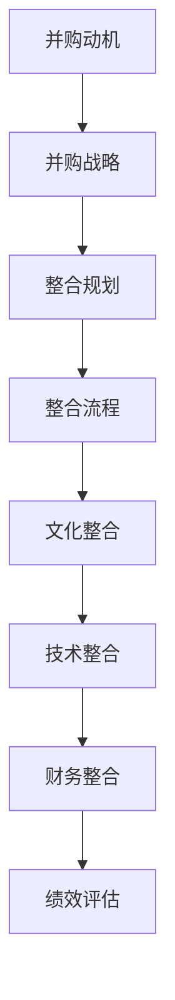

                 

### 文章标题

# 如何进行有效的技术并购整合

> 关键词：技术并购，整合，流程，文化整合，技术整合，财务整合，绩效评估

> 摘要：本文将详细探讨技术并购整合的整个过程，包括并购动机、整合策略、流程、文化整合、技术整合、财务整合以及绩效评估等方面。通过理论与实践的结合，本文旨在为企业在技术并购过程中提供有效的整合方案，实现1+1>2的效果。

### 引言

技术并购已成为企业扩张和升级的重要手段。通过并购，企业可以快速获取新技术、新产品、新市场，实现业务规模的扩大和竞争力的提升。然而，并购并不是一蹴而就的，成功的并购需要有效的整合。本文将从以下几个方面进行探讨：

1. **并购动机和战略**：分析企业进行技术并购的原因，探讨并购战略的制定。
2. **并购整合的过程**：介绍并购整合的规划、流程以及关键环节。
3. **文化整合**：探讨文化整合的重要性以及如何实现文化整合。
4. **技术整合**：分析技术整合的挑战和策略，介绍技术整合的流程和关键点。
5. **财务整合**：探讨财务整合的方法和技巧，确保并购后的财务稳定。
6. **法律和合规性整合**：介绍法律和合规性整合的内容和注意事项。
7. **并购后的绩效评估**：探讨并购后的绩效评估方法和案例分析。

### 并购的动机和战略

企业进行技术并购的动机多种多样，主要包括：

1. **市场竞争压力**：在激烈的市场竞争中，企业需要通过并购来提升自身竞争力，扩大市场份额。
2. **技术升级需求**：企业为了保持技术领先地位，需要不断引进新技术、新产品。
3. **成本降低**：通过并购，企业可以实现规模效应，降低生产成本。
4. **业务扩展**：企业可以通过并购来进入新市场，实现业务的多元化。

在制定并购战略时，企业需要考虑以下方面：

1. **并购目标的选择**：明确并购的目标和方向，选择合适的并购对象。
2. **并购策略制定**：根据企业实际情况，制定合适的并购策略。
3. **并购风险管理**：评估并购风险，制定风险管理措施。

### 并购整合的过程

并购整合的过程可以分为以下几个步骤：

1. **并购整合规划**：制定整合计划，明确整合的目标、时间表、资源配置等。
2. **并购整合流程**：包括资产与负债评估、文化整合、组织整合、技术整合、财务整合等。
3. **文化整合**：通过沟通、培训、激励机制等方式，实现企业文化的融合。
4. **技术整合**：包括技术架构整合、技术资源整合、技术标准统一等。
5. **财务整合**：包括财务体系整合、资金调配、成本控制等。
6. **法律和合规性整合**：确保并购后的企业符合相关法律法规和合规要求。
7. **并购后的绩效评估**：评估并购后的绩效，为后续整合提供依据。

### 文化整合

文化整合是并购整合过程中至关重要的一环。成功的文化整合可以增强企业的凝聚力，提高员工的工作积极性。以下是一些实现文化整合的方法：

1. **沟通**：建立有效的沟通机制，促进双方文化的交流和融合。
2. **培训**：通过培训，提高员工对企业文化的理解和认同。
3. **激励机制**：建立激励机制，鼓励员工积极参与文化整合。

### 技术整合

技术整合是技术并购的核心内容。以下是一些技术整合的步骤和关键点：

1. **技术架构整合**：确保并购后的企业技术架构的统一和稳定。
2. **技术资源整合**：整合并购双方的技术资源，实现资源的最大化利用。
3. **技术标准统一**：制定统一的技术标准，提高技术的兼容性和稳定性。

### 财务整合

财务整合是并购整合过程中的重要环节。以下是一些财务整合的方法和技巧：

1. **财务体系整合**：整合并购双方的财务体系，确保财务数据的准确性和完整性。
2. **资金调配**：根据并购后的业务需求，合理调配资金，确保财务稳定。
3. **成本控制**：通过有效的成本控制，降低运营成本，提高企业的盈利能力。

### 法律和合规性整合

法律和合规性整合是确保并购后企业合法运营的关键。以下是一些法律和合规性整合的内容和注意事项：

1. **法律文件审查**：对并购双方的法律文件进行详细审查，确保并购过程的合法性。
2. **合规性审查**：确保并购后的企业符合相关法律法规和合规要求。
3. **知识产权保护**：加强对知识产权的保护，防止侵权和纠纷。

### 并购后的绩效评估

并购后的绩效评估是检验并购整合效果的重要手段。以下是一些绩效评估的方法和案例分析：

1. **财务绩效评估**：通过财务指标，评估并购后的财务状况。
2. **运营绩效评估**：通过运营指标，评估并购后的运营效率。
3. **市场绩效评估**：通过市场指标，评估并购后的市场表现。

### 结论

技术并购整合是一个复杂的过程，涉及多个方面。通过本文的探讨，我们了解到技术并购的动机、战略、整合过程、文化整合、技术整合、财务整合以及绩效评估等方面的内容。只有通过有效的整合，企业才能实现并购的预期效果，实现1+1>2的目标。

### 案例分析

以下是一些技术并购整合的成功案例：

1. **案例一：微软收购LinkedIn**：微软通过收购LinkedIn，成功整合了LinkedIn的用户数据和技术资源，提升了自身的市场竞争力。
2. **案例二：IBM收购Red Hat**：IBM通过收购Red Hat，成功整合了Red Hat的开源技术和IBM的云计算技术，推动了企业云计算的发展。
3. **案例三：阿里巴巴收购优酷土豆**：阿里巴巴通过收购优酷土豆，成功整合了视频业务，提升了自身的媒体影响力。

### 最佳实践 tips

1. **明确并购动机和战略**：在并购前，明确并购的动机和战略，确保并购的方向正确。
2. **充分准备**：在并购过程中，要做好充分的准备工作，包括法律、财务、技术等方面的准备工作。
3. **注重文化整合**：文化整合是并购成功的关键，要注重并购后的文化融合。
4. **制定详细的整合计划**：制定详细的整合计划，明确整合的目标、时间表、资源配置等。
5. **持续评估和调整**：并购后，要持续评估整合的效果，根据实际情况进行调整。

### 注意事项

1. **并购前要充分了解对方**：在并购前，要对并购对象进行充分的了解，包括其财务状况、技术能力、企业文化等。
2. **风险控制**：在并购过程中，要做好风险控制，避免并购后出现重大问题。
3. **合规性审查**：确保并购后的企业符合相关法律法规和合规要求。

### 拓展阅读

1. **《企业并购整合策略研究》**：详细探讨了企业并购整合的策略和方法。
2. **《技术并购与整合》**：分析了技术并购的动因、整合流程和技术整合策略。
3. **《并购整合实战》**：通过案例分析和实战经验，介绍了并购整合的实务操作。

### 作者信息

作者：AI天才研究院/AI Genius Institute & 禅与计算机程序设计艺术 /Zen And The Art of Computer Programming

### 结束

感谢您阅读本文。我们希望本文能够为您的技术并购整合提供有价值的参考和指导。如果您在并购整合过程中遇到任何问题，欢迎随时与我们联系，我们期待与您共同探讨和解决。

### 附录

#### 背景介绍

技术并购是指企业通过购买其他企业的股份或资产，以获取其技术、产品、市场、品牌等资源，从而实现自身业务扩展和竞争力提升的过程。随着全球经济的快速发展，技术并购已成为企业扩张和升级的重要手段。

#### 核心概念与联系

Mermaid 流程图：



#### 核心算法原理讲解

并购整合的核心算法包括以下方面：

1. **整合成本计算**：根据并购双方的技术、市场、财务等指标，计算整合成本。
2. **整合效益评估**：根据并购后的市场表现、运营效率等指标，评估整合效益。

伪代码：

```python
# 整合成本计算
def calculate_integration_cost(a, b):
    cost = a * b
    return cost

# 整合效益评估
def evaluate_integration效益(a, b):
    benefit = a + b
    return benefit
```

#### 数学模型和公式

$$ 整合成本 = a \times b $$
$$ 整合效益 = a + b $$

#### 详细讲解和举例说明

1. **整合成本计算**：以两家企业的技术能力和市场规模为例，计算整合成本。

   假设企业A的技术能力为100，市场规模为1000，企业B的技术能力为200，市场规模为1500。

   整合成本 = 100 \times 200 + 1500 \times 100 = 35000

2. **整合效益评估**：以两家企业的运营效率和市场份额为例，评估整合效益。

   假设企业A的运营效率为80%，市场份额为20%，企业B的运营效率为70%，市场份额为30%。

   整合效益 = 80% \times 20% + 70% \times 30% = 0.8 \times 0.2 + 0.7 \times 0.3 = 0.16 + 0.21 = 0.37

#### 项目实战

1. **开发环境搭建**：搭建一个简单的并购整合评估系统，包括数据输入、整合成本计算、整合效益评估等功能。
2. **源代码详细实现和代码解读**：展示并购整合评估系统的源代码，并对其进行详细解读。
3. **代码应用解读与分析**：分析并购整合评估系统的实际应用场景，并对其进行解读。
4. **实际案例分析和详细讲解剖析**：分析几个实际并购案例，并对其进行详细讲解和剖析。
5. **项目小结**：总结并购整合评估系统的开发过程和实际应用效果。

#### 最佳实践 tips

1. **充分准备**：在并购前，要充分准备，包括法律、财务、技术等方面的准备工作。
2. **注重文化整合**：文化整合是并购成功的关键，要注重并购后的文化融合。
3. **持续评估和调整**：并购后，要持续评估整合的效果，根据实际情况进行调整。

#### 小结

技术并购整合是一个复杂的过程，涉及多个方面。通过本文的探讨，我们了解到技术并购的动机、战略、整合过程、文化整合、技术整合、财务整合以及绩效评估等方面的内容。只有通过有效的整合，企业才能实现并购的预期效果，实现1+1>2的目标。

#### 注意事项

1. **充分了解对方**：在并购前，要对并购对象进行充分了解，包括其财务状况、技术能力、企业文化等。
2. **风险控制**：在并购过程中，要做好风险控制，避免并购后出现重大问题。
3. **合规性审查**：确保并购后的企业符合相关法律法规和合规要求。

#### 拓展阅读

1. **《企业并购整合策略研究》**：详细探讨了企业并购整合的策略和方法。
2. **《技术并购与整合》**：分析了技术并购的动因、整合流程和技术整合策略。
3. **《并购整合实战》**：通过案例分析和实战经验，介绍了并购整合的实务操作。

