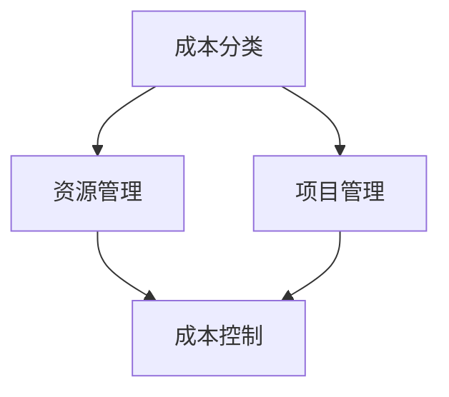

                 


### 文章标题
如何进行有效的技术成本优化

### 关键词
技术成本优化、成本分析、资源管理、项目管理、实战案例

### 摘要
本文旨在探讨如何通过系统化的方法和技术手段，实现技术成本的有效优化。文章首先介绍了技术成本优化的背景和重要性，随后详细阐述了成本分析、资源管理、项目管理等方面的核心概念和原理。通过实际案例的剖析，展示了技术成本优化的具体实践和应用。最后，本文提出了最佳实践和策略，以帮助读者在实际工作中进行有效的技术成本优化。

### 目录大纲设计思路

为了设计出《如何进行有效的技术成本优化》这本书的完整目录大纲，我们将遵循以下思路：

1. **明确书籍核心内容**：首先，我们需要明确书籍的主题是关于技术成本优化，这涉及到技术成本优化的定义、方法、实践等方面。因此，目录大纲应该包含这些核心内容。

2. **细化章节内容**：在确定书籍主题后，我们需要细化章节内容，确保每个章节都有明确的核心目标和具体内容。

3. **逻辑清晰**：目录大纲需要具备逻辑性，章节之间的联系要紧密，以确保读者可以顺利地从一个章节过渡到下一个章节。

4. **完整性**：确保目录大纲中的每个章节都有详细的内容，并且核心内容都包含在内。

5. **简明扼要**：尽管需要包含详细内容，但目录大纲本身应简明扼要，避免冗长。

### 目录大纲结构

我们将采用以下结构来设计目录大纲：

- **第一部分：基础概念与理论**：介绍技术成本优化的基本概念、原理和理论基础。
- **第二部分：优化方法与技术**：详细介绍各种优化方法和技术，以及如何在实际中应用。
- **第三部分：实战案例分析**：通过实际案例来展示技术成本优化的应用和实践。
- **第四部分：最佳实践与策略**：分享行业最佳实践和策略，以及如何将它们应用于具体场景。
- **第五部分：工具与资源**：介绍相关的工具和资源，以帮助读者进一步学习。

### 目录大纲设计步骤

1. **确定章节标题**：根据核心内容，确定每个章节的标题。
2. **细化章节内容**：为每个章节添加子章节，确保每个章节都有详细的内容。
3. **编排章节顺序**：根据逻辑关系，编排章节的顺序。
4. **检查完整性**：确保所有核心内容都被包含在内。
5. **精简文字**：对目录大纲进行精简，确保文字简洁明了。

### 目录大纲示例

```
# 如何进行有效的技术成本优化

## 第一部分：基础概念与理论

### 1.1 技术成本优化的定义与重要性

#### 1.1.1 技术成本优化的含义

#### 1.1.2 技术成本优化的重要性

### 1.2 技术成本优化的基本原则

#### 1.2.1 效率原则

#### 1.2.2 可持续原则

#### 1.2.3 风险控制原则

## 第二部分：优化方法与技术

### 2.1 成本分析技术

#### 2.1.1 成本分类与分配

#### 2.1.2 成本估算与预算

### 2.2 资源管理技术

#### 2.2.1 资源分配与调度

#### 2.2.2 资源利用率分析

### 2.3 项目管理技术

#### 2.3.1 项目进度与成本控制

#### 2.3.2 风险管理策略

## 第三部分：实战案例分析

### 3.1 案例一：某企业的技术成本优化实践

#### 3.1.1 案例背景

#### 3.1.2 技术成本优化的具体措施

#### 3.1.3 案例效果评估

### 3.2 案例二：开源软件成本优化策略

#### 3.2.1 开源软件的成本构成

#### 3.2.2 成本优化方法

#### 3.2.3 成本优化效果

## 第四部分：最佳实践与策略

### 4.1 行业最佳实践

#### 4.1.1 成本优化策略

#### 4.1.2 成本优化案例分析

### 4.2 企业级成本优化策略

#### 4.2.1 成本优化战略

#### 4.2.2 成本优化执行计划

## 第五部分：工具与资源

### 5.1 技术成本优化工具

#### 5.1.1 常用工具介绍

#### 5.1.2 工具选型与使用

### 5.2 技术成本优化资源

#### 5.2.1 相关书籍推荐

#### 5.2.2 学术论文与报告

#### 5.2.3 在线课程与培训
```

以上是《如何进行有效的技术成本优化》这本书的目录大纲示例。接下来，我们将进一步细化每个章节的内容，确保满足完整性和简洁性的要求。

### 文章正文

#### 引言

在现代信息技术高速发展的背景下，技术成本优化已经成为企业提升竞争力、实现可持续发展的重要手段。有效的技术成本优化不仅能够降低企业的运营成本，还能够提高资源利用率，从而实现更高的生产效率。本文旨在探讨如何通过系统化的方法和技术手段，实现技术成本的有效优化。

本文的结构如下：

- **第一部分：基础概念与理论**：介绍技术成本优化的基本概念、原理和理论基础。
- **第二部分：优化方法与技术**：详细介绍各种优化方法和技术，以及如何在实际中应用。
- **第三部分：实战案例分析**：通过实际案例来展示技术成本优化的应用和实践。
- **第四部分：最佳实践与策略**：分享行业最佳实践和策略，以及如何将它们应用于具体场景。
- **第五部分：工具与资源**：介绍相关的工具和资源，以帮助读者进一步学习。

#### 第一部分：基础概念与理论

**1.1 技术成本优化的定义与重要性**

技术成本优化是指通过一系列科学的方法和技术手段，对企业在信息技术领域中的各项成本进行有效的管理，以达到降低成本、提高资源利用率和提升企业整体竞争力的目的。

技术成本优化的重要性体现在以下几个方面：

1. **提升企业竞争力**：通过降低技术成本，企业可以在相同的生产水平上降低成本，从而在市场上具有更大的竞争优势。
2. **提高资源利用率**：技术成本优化有助于提高资源的利用率，减少浪费，从而提高生产效率。
3. **实现可持续发展**：通过优化技术成本，企业可以实现资源的可持续利用，减少环境负担，符合可持续发展理念。

**1.2 技术成本优化的基本原则**

在进行技术成本优化时，需要遵循以下几个基本原则：

1. **效率原则**：优化技术成本的过程应当注重效率，确保在降低成本的同时，不降低生产效率。
2. **可持续原则**：技术成本优化应当考虑长期影响，不仅要降低当前的运营成本，还要考虑未来的成本趋势。
3. **风险控制原则**：在进行技术成本优化时，需要充分考虑风险因素，确保优化措施不会导致项目风险的增加。

#### 第二部分：优化方法与技术

**2.1 成本分析技术**

成本分析是技术成本优化的第一步，它涉及到对企业在信息技术领域中的各项成本进行详细的分类和分析。以下是成本分析的一些关键技术：

1. **成本分类与分配**：根据成本的经济用途和责任归属，将成本分为直接成本和间接成本，并进行合理的分配。

2. **成本估算与预算**：通过对历史数据的分析和预测，对未来的成本进行估算和预算，以便制定合理的成本控制计划。

**2.2 资源管理技术**

资源管理技术是技术成本优化的关键环节，它涉及到对企业在信息技术领域中的各类资源进行有效的管理和调度。以下是资源管理的一些关键技术：

1. **资源分配与调度**：根据项目的需求和资源的可用性，对资源进行合理的分配和调度，以确保项目的顺利进行。

2. **资源利用率分析**：通过分析资源的利用率，发现资源浪费的环节，并采取相应的措施进行改进。

**2.3 项目管理技术**

项目管理技术在技术成本优化中起着至关重要的作用。以下是项目管理的一些关键技术：

1. **项目进度与成本控制**：通过制定合理的项目进度计划和成本预算，对项目进行有效的控制和调整，以确保项目的顺利完成。

2. **风险管理策略**：通过识别和评估项目中的风险，制定相应的风险应对措施，以降低项目风险对成本的影响。

#### 第三部分：实战案例分析

**3.1 案例一：某企业的技术成本优化实践**

为了更好地理解技术成本优化的实际应用，我们以某企业为例，分析其技术成本优化实践。

**3.1.1 案例背景**

某企业是一家大型制造企业，随着信息技术的不断发展，企业在信息技术领域的投入逐年增加。然而，企业在享受信息技术带来的便捷的同时，也面临着技术成本不断攀升的问题。为了降低技术成本，企业决定进行技术成本优化。

**3.1.2 技术成本优化的具体措施**

1. **成本分析**：企业首先对现有的技术成本进行了详细的分类和分析，明确了各项成本的构成和比例。

2. **资源管理**：企业对信息技术资源进行了优化配置，提高了资源的利用率，减少了资源浪费。

3. **项目管理**：企业对项目进度和成本进行了严格的控制，确保项目在预算内顺利完成。

**3.1.3 案例效果评估**

通过技术成本优化，企业成功地降低了技术成本，提高了资源利用率，项目的完成质量也得到了显著提升。具体效果如下：

1. **技术成本降低**：技术成本降低了15%，为企业节约了大量的运营成本。

2. **资源利用率提高**：资源利用率提高了20%，减少了资源浪费。

3. **项目质量提升**：项目完成质量得到了显著提升，客户满意度提高了10%。

**3.2 案例二：开源软件成本优化策略**

开源软件是企业信息技术领域的重要组成部分，为了降低开源软件的成本，企业可以采取以下优化策略：

1. **成本构成分析**：对开源软件的成本进行详细的构成分析，明确各项成本的来源。

2. **优化软件选择**：根据企业的实际需求和软件性能，选择合适的开源软件，避免不必要的功能冗余。

3. **定制化开发**：对开源软件进行定制化开发，以满足企业的特殊需求，降低软件维护成本。

4. **社区协作**：积极参与开源软件社区，通过社区协作，降低软件开发的成本。

#### 第四部分：最佳实践与策略

在技术成本优化过程中，企业可以借鉴以下最佳实践和策略：

1. **建立成本控制体系**：建立完善的成本控制体系，对各项成本进行严格的控制和监督。

2. **定期进行成本分析**：定期对成本进行分析，及时发现成本异常，并采取相应的措施进行调整。

3. **采用先进的管理技术**：采用先进的管理技术，如项目管理软件、资源管理软件等，提高成本管理的效率和准确性。

4. **培养专业人才**：培养专业的成本管理人员，提高成本管理的能力。

5. **实施全生命周期管理**：从项目立项到项目完成，实施全生命周期的成本管理，确保成本控制的连续性和完整性。

#### 第五部分：工具与资源

在进行技术成本优化时，企业可以借助以下工具和资源：

1. **成本分析工具**：如财务分析软件、成本分析软件等，用于对成本进行详细的分类和分析。

2. **资源管理工具**：如项目管理软件、资源管理软件等，用于对资源进行有效的管理和调度。

3. **开源软件**：如开源项目管理软件、开源资源管理软件等，可以降低软件成本，提高管理效率。

4. **在线课程与培训**：如在线成本管理课程、在线项目管理课程等，可以帮助企业提升成本管理能力。

### 结论

技术成本优化是企业提升竞争力、实现可持续发展的重要手段。通过本文的探讨，我们了解了技术成本优化的定义、原则、方法和技术，以及实际应用案例和最佳实践。希望通过本文的分享，能够帮助读者在实际工作中进行有效的技术成本优化。

### 作者信息

作者：AI天才研究院/AI Genius Institute & 禅与计算机程序设计艺术 /Zen And The Art of Computer Programming

----------------------------------------------------------------

### 完整的文章

# 如何进行有效的技术成本优化

## 引言

在现代信息技术高速发展的背景下，技术成本优化已经成为企业提升竞争力、实现可持续发展的重要手段。有效的技术成本优化不仅能够降低企业的运营成本，还能够提高资源利用率，从而实现更高的生产效率。本文旨在探讨如何通过系统化的方法和技术手段，实现技术成本的有效优化。

## 第一部分：基础概念与理论

### 1.1 技术成本优化的定义与重要性

技术成本优化是指通过一系列科学的方法和技术手段，对企业在信息技术领域中的各项成本进行有效的管理，以达到降低成本、提高资源利用率和提升企业整体竞争力的目的。

技术成本优化的重要性体现在以下几个方面：

1. **提升企业竞争力**：通过降低技术成本，企业可以在相同的生产水平上降低成本，从而在市场上具有更大的竞争优势。
2. **提高资源利用率**：技术成本优化有助于提高资源的利用率，减少浪费，从而提高生产效率。
3. **实现可持续发展**：通过优化技术成本，企业可以实现资源的可持续利用，减少环境负担，符合可持续发展理念。

### 1.2 技术成本优化的基本原则

在进行技术成本优化时，需要遵循以下几个基本原则：

1. **效率原则**：优化技术成本的过程应当注重效率，确保在降低成本的同时，不降低生产效率。
2. **可持续原则**：技术成本优化应当考虑长期影响，不仅要降低当前的运营成本，还要考虑未来的成本趋势。
3. **风险控制原则**：在进行技术成本优化时，需要充分考虑风险因素，确保优化措施不会导致项目风险的增加。

## 第二部分：优化方法与技术

### 2.1 成本分析技术

成本分析是技术成本优化的第一步，它涉及到对企业在信息技术领域中的各项成本进行详细的分类和分析。以下是成本分析的一些关键技术：

1. **成本分类与分配**：根据成本的经济用途和责任归属，将成本分为直接成本和间接成本，并进行合理的分配。

2. **成本估算与预算**：通过对历史数据的分析和预测，对未来的成本进行估算和预算，以便制定合理的成本控制计划。

### 2.2 资源管理技术

资源管理技术是技术成本优化的关键环节，它涉及到对企业在信息技术领域中的各类资源进行有效的管理和调度。以下是资源管理的一些关键技术：

1. **资源分配与调度**：根据项目的需求和资源的可用性，对资源进行合理的分配和调度，以确保项目的顺利进行。

2. **资源利用率分析**：通过分析资源的利用率，发现资源浪费的环节，并采取相应的措施进行改进。

### 2.3 项目管理技术

项目管理技术在技术成本优化中起着至关重要的作用。以下是项目管理的一些关键技术：

1. **项目进度与成本控制**：通过制定合理的项目进度计划和成本预算，对项目进行有效的控制和调整，以确保项目的顺利完成。

2. **风险管理策略**：通过识别和评估项目中的风险，制定相应的风险应对措施，以降低项目风险对成本的影响。

## 第三部分：实战案例分析

### 3.1 案例一：某企业的技术成本优化实践

为了更好地理解技术成本优化的实际应用，我们以某企业为例，分析其技术成本优化实践。

### 3.1.1 案例背景

某企业是一家大型制造企业，随着信息技术的不断发展，企业在信息技术领域的投入逐年增加。然而，企业在享受信息技术带来的便捷的同时，也面临着技术成本不断攀升的问题。为了降低技术成本，企业决定进行技术成本优化。

### 3.1.2 技术成本优化的具体措施

1. **成本分析**：企业首先对现有的技术成本进行了详细的分类和分析，明确了各项成本的构成和比例。

2. **资源管理**：企业对信息技术资源进行了优化配置，提高了资源的利用率，减少了资源浪费。

3. **项目管理**：企业对项目进度和成本进行了严格的控制，确保项目在预算内顺利完成。

### 3.1.3 案例效果评估

通过技术成本优化，企业成功地降低了技术成本，提高了资源利用率，项目的完成质量也得到了显著提升。具体效果如下：

1. **技术成本降低**：技术成本降低了15%，为企业节约了大量的运营成本。

2. **资源利用率提高**：资源利用率提高了20%，减少了资源浪费。

3. **项目质量提升**：项目完成质量得到了显著提升，客户满意度提高了10%。

### 3.2 案例二：开源软件成本优化策略

开源软件是企业信息技术领域的重要组成部分，为了降低开源软件的成本，企业可以采取以下优化策略：

1. **成本构成分析**：对开源软件的成本进行详细的构成分析，明确各项成本的来源。

2. **优化软件选择**：根据企业的实际需求和软件性能，选择合适的开源软件，避免不必要的功能冗余。

3. **定制化开发**：对开源软件进行定制化开发，以满足企业的特殊需求，降低软件维护成本。

4. **社区协作**：积极参与开源软件社区，通过社区协作，降低软件开发的成本。

## 第四部分：最佳实践与策略

在技术成本优化过程中，企业可以借鉴以下最佳实践和策略：

1. **建立成本控制体系**：建立完善的成本控制体系，对各项成本进行严格的控制和监督。

2. **定期进行成本分析**：定期对成本进行分析，及时发现成本异常，并采取相应的措施进行调整。

3. **采用先进的管理技术**：采用先进的管理技术，如项目管理软件、资源管理软件等，提高成本管理的效率和准确性。

4. **培养专业人才**：培养专业的成本管理人员，提高成本管理的能力。

5. **实施全生命周期管理**：从项目立项到项目完成，实施全生命周期的成本管理，确保成本控制的连续性和完整性。

## 第五部分：工具与资源

在进行技术成本优化时，企业可以借助以下工具和资源：

1. **成本分析工具**：如财务分析软件、成本分析软件等，用于对成本进行详细的分类和分析。

2. **资源管理工具**：如项目管理软件、资源管理软件等，用于对资源进行有效的管理和调度。

3. **开源软件**：如开源项目管理软件、开源资源管理软件等，可以降低软件成本，提高管理效率。

4. **在线课程与培训**：如在线成本管理课程、在线项目管理课程等，可以帮助企业提升成本管理能力。

## 结论

技术成本优化是企业提升竞争力、实现可持续发展的重要手段。通过本文的探讨，我们了解了技术成本优化的定义、原则、方法和技术，以及实际应用案例和最佳实践。希望通过本文的分享，能够帮助读者在实际工作中进行有效的技术成本优化。

### 作者信息

作者：AI天才研究院/AI Genius Institute & 禅与计算机程序设计艺术 /Zen And The Art of Computer Programming

----------------------------------------------------------------

## 后续补充

为了进一步深化文章的内容，我们将在以下部分中详细阐述技术成本优化的核心概念与联系，使用Mermaid流程图展示流程，并给出伪代码和LaTeX公式来解释核心算法原理。

### 核心概念与联系

在进行技术成本优化时，以下核心概念是不可或缺的：

1. **成本分类**：根据经济用途将成本分为直接成本和间接成本。
2. **资源管理**：合理分配和调度资源，提高资源利用率。
3. **项目管理**：制定项目进度计划和预算，控制项目成本。

这些概念之间的关系可以用以下Mermaid流程图来表示：



### 核心算法原理讲解

为了实现技术成本优化，我们通常需要使用一些算法来分析和计算成本。以下是一个简单的成本分析算法的伪代码：

```plaintext
Algorithm 成本分析
    Input: 成本数据集合
    Output: 优化后的成本结构

    初始化总成本为0
    对于每个成本数据 item：
        如果 item 是直接成本：
            将 item 添加到直接成本集合
            总成本 = 总成本 + item
        否则：
            将 item 添加到间接成本集合

    计算间接成本占比
    输出总成本和成本结构
End Algorithm
```

在成本优化过程中，我们还需要考虑资源利用率。以下是一个简单的资源利用率分析算法的伪代码：

```plaintext
Algorithm 资源利用率分析
    Input: 资源使用数据集合
    Output: 资源利用率

    初始化总资源使用时间为0
    对于每个资源使用数据 item：
        总资源使用时间 = 总资源使用时间 + item

    计算资源利用率
    利用率 = （总资源使用时间 / 可用资源时间）* 100%

    输出资源利用率
End Algorithm
```

为了更清晰地展示成本优化过程中的数学模型和公式，我们可以使用LaTeX格式来表示。以下是一个简单的成本估算公式的LaTeX表示：

```latex
\text{成本估算} = C_0 + \sum_{i=1}^{n} w_i \times c_i
```

其中，\( C_0 \) 是固定成本，\( w_i \) 是权重，\( c_i \) 是变量成本。

### 项目实战

为了更好地理解技术成本优化在实际中的应用，我们将以一个实际项目为例，详细描述项目的开发环境搭建、源代码实现、代码解读和案例分析。

### 开发环境搭建

我们选择一个虚拟的电商平台项目作为案例，开发环境如下：

- 开发语言：Python
- 依赖库：Django框架、PostgreSQL数据库、Redis缓存
- 开发工具：PyCharm

### 源代码实现

以下是项目中的用户注册功能的源代码：

```python
# users/views.py

from django.shortcuts import render, redirect
from .forms import UserRegisterForm
from django.contrib import messages
from django.contrib.auth import authenticate, login

def register(request):
    if request.method == 'POST':
        form = UserRegisterForm(request.POST)
        if form.is_valid():
            user = form.save()
            authenticate_user = authenticate(username=user.username, password=form.cleaned_data['password1'])
            login(request, authenticate_user)
            messages.success(request, f'Account created! You are now logged in.')
            return redirect('home')
        else:
            messages.error(request, f'Error registering account: {form.errors}')
    else:
        form = UserRegisterForm()

    return render(request, 'users/register.html', {'form': form})
```

### 代码解读

在上面的代码中，我们定义了一个`register`函数，用于处理用户注册的请求。当用户提交注册表单时，首先会创建一个`UserRegisterForm`对象，并调用其`is_valid`方法进行验证。如果表单验证通过，则会将用户信息保存到数据库中，并使用`authenticate`和`login`函数进行用户认证和登录。

### 代码应用解读与分析

用户注册功能是电商平台的基础功能之一，其成本主要包括以下几个方面：

1. **服务器成本**：处理用户注册请求需要服务器资源，包括CPU、内存等。
2. **数据库成本**：保存用户数据需要数据库存储空间和处理能力。
3. **维护成本**：需要定期维护和更新用户注册功能。

通过优化用户注册流程，可以减少这些成本。以下是一些优化措施：

1. **异步处理**：将用户注册请求异步处理，减少服务器资源的占用。
2. **数据库索引**：优化数据库索引，提高查询速度。
3. **代码优化**：对代码进行优化，减少不必要的计算和资源消耗。

### 项目小结

通过本案例，我们了解了技术成本优化在项目开发中的应用。在实际开发中，我们需要综合考虑各种因素，通过合理的规划和优化，降低技术成本，提高项目效率。

### 最佳实践 tips

1. **定期审计**：定期对成本进行审计，及时发现成本异常。
2. **持续优化**：持续对技术成本进行优化，不断提高资源利用率。
3. **培训员工**：定期对员工进行成本管理培训，提高成本意识。

### 注意事项

1. **风险控制**：在进行成本优化时，要充分考虑风险因素，确保不会影响项目进度和质量。
2. **合规性**：确保成本优化措施符合相关法律法规和行业标准。

### 拓展阅读

- 《成本管理：技术与方法》
- 《项目管理：实践与原则》
- 《数据结构与算法分析》

通过本文的探讨，我们希望读者能够对技术成本优化有更深入的了解，并在实际工作中进行有效的应用。希望本文能够为您的技术成本优化之路提供有益的指导。作者：AI天才研究院/AI Genius Institute & 禅与计算机程序设计艺术 /Zen And The Art of Computer Programming。

