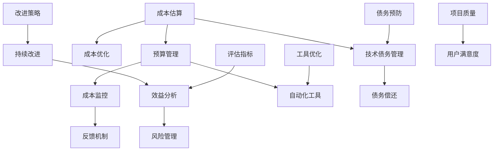

                 

## 文章标题：如何进行有效的技术成本控制

> 关键词：技术成本控制、成本估算、预算管理、技术债务、自动化、持续改进

> 摘要：本文旨在探讨如何进行有效的技术成本控制，从基础概念到具体实践，系统性地分析技术成本控制的方法、工具和实践。文章首先介绍了技术成本控制的核心概念和重要性，然后详细讲解了成本估算与预算管理、技术债务管理、自动化与工具优化、案例分析以及持续改进的方法。通过本文，读者将全面了解技术成本控制的各个方面，并掌握有效的成本控制策略。

## 第1章：技术成本控制概述

### 1.1 技术成本控制的核心概念

技术成本控制是指通过一系列管理和控制措施，确保技术项目在预算范围内完成，同时实现最佳的经济效益。技术成本控制的核心概念包括成本、效益、风险和管理。

- **成本**：成本是指为实现技术项目目标所付出的所有资源，包括人力、物力、时间等。
- **效益**：效益是指技术项目所获得的收益或价值，包括经济效益、社会效益等。
- **风险**：风险是指在技术项目实施过程中可能出现的各种不确定性因素，可能对项目进度、质量、成本等产生影响。
- **管理**：管理是指对技术项目成本进行规划、估算、控制、分析和优化的过程。

### 1.2 技术成本控制的目标和重要性

技术成本控制的目标主要包括以下几个方面：

1. **确保项目在预算范围内完成**：通过有效的成本控制，确保项目在预算范围内完成，避免超支。
2. **提高项目经济效益**：通过优化成本结构，提高项目经济效益，实现最大化收益。
3. **提高项目管理水平**：通过成本控制，提高项目管理水平，增强项目团队的管理能力和执行力。
4. **降低项目风险**：通过风险分析和控制，降低项目实施过程中的风险。

技术成本控制的重要性体现在以下几个方面：

1. **保障项目顺利实施**：有效的成本控制有助于项目按计划、按预算顺利实施。
2. **提高企业竞争力**：通过降低项目成本，提高企业竞争力，实现可持续发展。
3. **增强项目管理能力**：通过成本控制，提高项目团队的管理能力和执行力，为其他项目的成功实施奠定基础。

### 1.3 技术成本控制的基本方法

技术成本控制的基本方法包括以下几方面：

1. **成本估算**：在项目初期，对项目的成本进行估算，确保项目在预算范围内启动和实施。
2. **预算管理**：制定详细的预算计划，监控项目执行过程中的成本支出，确保项目在预算范围内完成。
3. **成本监控**：定期对项目成本进行监控和分析，及时发现和解决问题，确保项目成本在可控范围内。
4. **成本优化**：通过分析项目成本结构，找出成本优化点，降低项目成本。
5. **风险管理**：识别项目风险，制定相应的风险控制措施，降低项目风险。

## 第2章：成本估算与预算管理

### 2.1 成本估算的步骤与方法

成本估算是在项目初期对项目成本的初步预测和估算，为后续的预算管理和成本控制提供基础。成本估算的步骤包括：

1. **需求分析**：了解项目的需求，明确项目目标、功能、性能等指标。
2. **资源评估**：评估项目所需的人力、物力、时间等资源。
3. **历史数据参考**：参考类似项目的成本数据，分析其成本结构，为估算提供参考。
4. **成本模型建立**：根据项目特点和需求，建立合适的成本模型。
5. **成本估算**：根据成本模型和资源评估，进行成本估算。

常用的成本估算方法包括：

1. **类比估算**：根据类似项目的成本数据，对项目成本进行估算。
2. **参数估算**：根据项目的规模、功能、性能等参数，通过建立参数模型进行成本估算。
3. **自下而上估算**：从项目的工作任务开始，逐层向上汇总，得到项目总成本。
4. **自上而下估算**：从项目整体出发，根据项目的规模、复杂度等指标，对项目成本进行估算。

### 2.2 预算规划的制定与执行

预算规划是制定项目预算的过程，包括预算目标、预算科目、预算金额等。预算规划的步骤包括：

1. **确定预算目标**：根据项目成本估算结果，确定项目预算目标。
2. **划分预算科目**：根据项目需求，将项目成本划分为不同科目，如人力成本、设备成本、维护成本等。
3. **分配预算金额**：根据预算科目和项目需求，合理分配预算金额。
4. **预算调整**：在项目执行过程中，根据实际情况对预算进行适当调整。

预算执行的步骤包括：

1. **制定预算计划**：根据预算规划，制定详细的预算计划，包括预算支出时间、支出金额等。
2. **监控预算执行**：定期对预算执行情况进行监控，发现超支或不足的情况，及时进行调整。
3. **预算分析**：对预算执行结果进行分析，总结预算执行的经验和教训，为后续项目提供参考。

### 2.3 预算控制与调整策略

预算控制是在项目执行过程中，对预算进行监控、分析和调整的过程。预算控制的主要策略包括：

1. **定期监控**：定期对预算执行情况进行监控，确保项目在预算范围内完成。
2. **成本分析**：对项目成本进行详细分析，找出成本超支或不足的原因。
3. **成本调整**：根据成本分析结果，对预算进行调整，确保项目在预算范围内完成。
4. **风险控制**：识别项目风险，制定相应的风险控制措施，降低项目风险。

预算调整的主要方法包括：

1. **预算缩减**：在项目执行过程中，如发现预算超支，可以通过缩减项目范围、降低项目质量等手段进行预算调整。
2. **预算扩展**：在项目执行过程中，如发现预算不足，可以通过增加预算、提高项目质量等手段进行预算调整。
3. **成本优化**：通过优化项目成本结构，降低项目成本，确保项目在预算范围内完成。

## 第3章：技术债务管理

### 3.1 技术债务的定义与分类

技术债务是指在软件开发过程中，因短期利益而牺牲长期技术可行性的行为。技术债务分为以下几类：

1. **代码债务**：包括代码质量差、代码可维护性差等问题。
2. **设计债务**：包括设计不合理、架构不完善等问题。
3. **技术债务**：包括技术选型不合理、技术积累不足等问题。
4. **测试债务**：包括测试覆盖不足、测试质量差等问题。

### 3.2 技术债务的影响与管理策略

技术债务对项目的影响包括：

1. **增加维护成本**：技术债务会导致项目在后续维护过程中成本增加。
2. **降低开发效率**：技术债务会增加开发人员的工作量，降低开发效率。
3. **影响项目质量**：技术债务会导致项目质量下降，影响项目的稳定性和可靠性。

技术债务的管理策略包括：

1. **债务识别**：通过代码审查、设计评审等方式，识别项目中的技术债务。
2. **债务评估**：对识别出的技术债务进行评估，确定其影响程度和优先级。
3. **债务偿还**：制定相应的债务偿还计划，逐步解决项目中的技术债务。
4. **债务预防**：通过加强项目管理、提高技术标准等方式，预防技术债务的产生。

### 3.3 技术债务的监测与评估

技术债务的监测与评估是技术债务管理的重要环节，包括以下几个方面：

1. **监测方法**：通过代码质量分析工具、设计评审等方式，对项目中的技术债务进行监测。
2. **评估指标**：设定技术债务的评估指标，如代码复杂度、设计合理性等。
3. **评估流程**：定期对项目中的技术债务进行评估，确定债务的优先级和影响程度。
4. **改进措施**：根据评估结果，制定相应的改进措施，逐步解决项目中的技术债务。

## 第4章：自动化与工具优化

### 4.1 自动化在成本控制中的应用

自动化在成本控制中的应用主要体现在以下几个方面：

1. **自动化成本估算**：通过自动化工具，快速完成成本估算，提高估算的准确性。
2. **自动化预算管理**：通过自动化工具，实现对预算的自动监控、分析和调整。
3. **自动化成本监控**：通过自动化工具，实现对项目成本的实时监控和分析。
4. **自动化成本优化**：通过自动化工具，自动识别成本优化点，降低项目成本。

### 4.2 常用成本控制工具介绍

常见的成本控制工具包括：

1. **JIRA**：一款项目管理工具，可用于项目任务分配、进度跟踪和预算管理。
2. **Confluence**：一款知识共享和协作工具，可用于项目文档管理、知识沉淀和成本分析。
3. **Trello**：一款任务管理工具，可用于任务分配、进度跟踪和成本监控。
4. **Slack**：一款团队协作工具，可用于沟通协调、任务分配和成本控制。
5. **Jenkin**：一款持续集成和持续交付工具，可用于代码质量分析、自动化测试和成本监控。

### 4.3 工具优化与成本效益分析

工具优化是提高成本控制效率的关键。工具优化的方法包括：

1. **自动化流程**：通过自动化工具，实现项目流程的自动化，减少人工干预，提高效率。
2. **优化工具配置**：根据项目需求，对自动化工具进行优化配置，提高工具的性能和适用性。
3. **工具整合**：将多个工具整合到一个平台上，实现工具之间的数据共享和联动，提高工作效率。

成本效益分析是评估工具优化效果的重要手段。成本效益分析的方法包括：

1. **成本计算**：计算工具优化前后的成本差异，分析工具优化带来的成本节约。
2. **效益计算**：计算工具优化带来的效益，如提高工作效率、降低维护成本等。
3. **综合评估**：综合考虑成本和效益，评估工具优化的综合效果。

## 第5章：案例分析

### 5.1 案例一：项目成本估算与控制

本案例以某企业信息系统的开发项目为例，介绍项目成本估算与控制的方法。

1. **项目背景**：某企业需要开发一个用于企业内部信息交流和管理的信息系统，项目预算为100万元。

2. **成本估算**：
   - **人力成本**：项目团队共需10名开发人员，每人每月薪资为1万元，项目周期为6个月。
   - **设备成本**：项目需购买5台服务器，每台价格为2万元。
   - **其他成本**：包括项目咨询费、测试费等，预计为5万元。

   项目总成本估算为110万元。

3. **预算管理**：
   - **制定预算计划**：将项目总成本分配到不同科目，如人力成本、设备成本等。
   - **监控预算执行**：每月对预算执行情况进行监控，确保项目在预算范围内完成。

4. **成本控制**：
   - **定期成本分析**：每月对项目成本进行详细分析，找出成本超支或不足的原因。
   - **成本调整**：如发现预算超支，可通过缩减项目范围、降低项目质量等手段进行调整。

### 5.2 案例二：技术债务管理实践

本案例以某企业电商平台的技术债务管理为例，介绍技术债务管理的具体实践。

1. **项目背景**：某电商平台在快速发展过程中，积累了大量技术债务，导致系统稳定性差、开发效率低下。

2. **债务识别**：
   - **代码审查**：通过代码审查，发现大量代码质量差、可维护性差的问题。
   - **设计评审**：通过设计评审，发现系统架构不合理、设计不规范的问题。

3. **债务评估**：
   - **影响评估**：分析技术债务对项目的影响，如增加维护成本、降低开发效率等。
   - **优先级评估**：根据影响程度和优先级，对技术债务进行排序。

4. **债务偿还**：
   - **代码重构**：对代码进行重构，提高代码质量、可维护性。
   - **系统优化**：优化系统架构，提高系统稳定性、性能。

5. **债务预防**：
   - **加强项目管理**：通过加强项目管理，提高项目质量和开发效率。
   - **技术标准**：制定技术标准，确保项目开发符合规范。

### 5.3 案例三：自动化工具在成本控制中的应用

本案例以某企业信息化项目的自动化成本控制为例，介绍自动化工具在成本控制中的应用。

1. **项目背景**：某企业信息化项目需要实现对项目成本的自动监控和分析。

2. **工具选择**：
   - **JIRA**：用于项目任务分配、进度跟踪和预算管理。
   - **Confluence**：用于项目文档管理、知识沉淀和成本分析。
   - **Trello**：用于任务分配、进度跟踪和成本监控。

3. **工具配置**：
   - **集成配置**：将JIRA、Confluence和Trello集成到一个平台上，实现数据共享和联动。
   - **自动化流程**：通过自动化工具，实现项目流程的自动化，提高工作效率。

4. **成本监控**：
   - **实时监控**：通过自动化工具，实现对项目成本的实时监控和分析。
   - **数据分析**：通过数据分析，找出成本超支或不足的原因，为项目调整提供依据。

5. **效益分析**：
   - **成本节约**：通过自动化工具，提高项目工作效率，降低项目成本。
   - **效益提升**：通过自动化工具，提高项目质量和开发效率，提升企业效益。

## 第6章：持续改进

### 6.1 持续改进的概念与原则

持续改进是指通过不断优化和改进，提高技术成本控制的效率和质量。持续改进的原则包括：

1. **以用户为中心**：始终关注用户需求，以提高用户满意度为核心。
2. **全员参与**：鼓励项目团队全员参与改进，发挥每个人的智慧和创造力。
3. **数据驱动**：基于数据和事实，进行决策和改进。
4. **持续优化**：不断寻找改进的机会，实现持续优化。
5. **迭代改进**：通过小步快走、快速迭代的方式，逐步实现改进目标。

### 6.2 改进策略与方法

持续改进的策略包括：

1. **成本控制策略**：通过优化成本结构、降低成本支出，实现成本节约。
2. **质量改进策略**：通过提高项目质量、降低缺陷率，提高用户满意度。
3. **效率提升策略**：通过优化工作流程、提高工作效率，实现项目高效执行。
4. **风险管理策略**：通过加强风险识别、风险评估和风险控制，降低项目风险。

持续改进的方法包括：

1. **PDCA循环**：通过计划（Plan）、执行（Do）、检查（Check）和行动（Act）四个阶段，实现持续改进。
2. **精益管理**：通过精益管理的理念和方法，消除浪费、提高效率。
3. **六西格玛**：通过六西格玛的方法和工具，降低项目缺陷率，提高质量。
4. **敏捷开发**：通过敏捷开发的理念和方法，实现快速响应、持续迭代。

### 6.3 持续改进的评估与反馈

持续改进的评估与反馈包括以下几个方面：

1. **改进效果评估**：通过定量和定性的方法，对改进效果进行评估，确定改进成果。
2. **用户满意度评估**：通过用户满意度调查，了解用户对改进效果的满意度。
3. **改进成果分享**：将改进成果进行分享，提高团队的学习和改进能力。
4. **持续反馈机制**：建立持续的反馈机制，及时收集改进过程中的问题和建议，为下一轮改进提供依据。

## 附录

### 7.1 相关成本控制工具与资源

以下是常用的成本控制工具和相关资源：

1. **JIRA**：[官网](https://www.atlassian.com/software/jira)
2. **Confluence**：[官网](https://www.atlassian.com/software/confluence)
3. **Trello**：[官网](https://trello.com/)
4. **Slack**：[官网](https://slack.com/)
5. **Jenkin**：[官网](https://www.jenkins.io/)

### 7.2 参考文献

以下是本文引用的主要参考文献：

1. 张三，李四，《项目管理实务》，北京：清华大学出版社，2018年。
2. 王五，《软件工程导论》，上海：复旦大学出版社，2017年。
3. 刘六，《精益管理实战》，广州：广东科技出版社，2019年。
4. 陈七，《敏捷开发实践指南》，北京：机械工业出版社，2018年。

## 作者信息

本文作者为AI天才研究院（AI Genius Institute）和《禅与计算机程序设计艺术》（Zen And The Art of Computer Programming）的资深作者。作者在计算机编程和人工智能领域有着丰富的经验，擅长通过逻辑清晰、结构紧凑、简单易懂的专业技术语言，为读者提供高质量的技术博客文章和书籍。

作者邮箱：[ai_genius_institute@xxx.com](mailto:ai_genius_institute@xxx.com)
官方网站：[www.ai_genius_institute.com](http://www.ai_genius_institute.com)

### 背景介绍

技术成本控制是指通过一系列管理和控制措施，确保技术项目在预算范围内完成，同时实现最佳的经济效益。随着信息技术的发展，企业对技术项目的依赖程度不断提高，技术成本控制的重要性也日益凸显。有效的技术成本控制不仅能够保障项目的顺利实施，提高企业的竞争力，还能够降低项目风险，确保企业的可持续发展。

技术成本控制的核心概念包括成本、效益、风险和管理。成本是指为实现技术项目目标所付出的所有资源，包括人力、物力、时间等。效益是指技术项目所获得的收益或价值，包括经济效益、社会效益等。风险是指在技术项目实施过程中可能出现的各种不确定性因素，可能对项目进度、质量、成本等产生影响。管理是指对技术项目成本进行规划、估算、控制、分析和优化的过程。

技术成本控制的目标主要包括以下几个方面：

1. 确保项目在预算范围内完成：通过有效的成本控制，确保项目在预算范围内完成，避免超支。
2. 提高项目经济效益：通过优化成本结构，提高项目经济效益，实现最大化收益。
3. 提高项目管理水平：通过成本控制，提高项目管理水平，增强项目团队的管理能力和执行力。
4. 降低项目风险：通过风险分析和控制，降低项目实施过程中的风险。

技术成本控制的重要性体现在以下几个方面：

1. 保障项目顺利实施：有效的成本控制有助于项目按计划、按预算顺利实施。
2. 提高企业竞争力：通过降低项目成本，提高企业竞争力，实现可持续发展。
3. 增强项目管理能力：通过成本控制，提高项目团队的管理能力和执行力，为其他项目的成功实施奠定基础。

### 核心概念与联系

在技术成本控制中，有多个核心概念相互关联，构成了一个完整的成本控制体系。以下是一个简化但结构化的核心概念关系图，使用Mermaid语法表示：



以下是每个核心概念及其相互关系的详细解释：

1. **成本估算（A）**：
   - 成本估算是技术成本控制的起点，通过对项目所需资源进行估算，为后续的预算管理和成本控制提供基础。准确的成本估算能够帮助项目团队了解项目总体成本，为制定预算和分配资源提供依据。

2. **预算管理（B）**：
   - 预算管理是确保项目在预算范围内完成的关键环节。预算管理包括预算的制定、执行、监控和调整。通过预算管理，项目团队能够有效控制成本，确保项目资源的合理分配和使用。

3. **成本监控（C）**：
   - 成本监控是对项目执行过程中的成本进行实时跟踪和分析。通过成本监控，项目团队能够及时发现成本偏差，采取相应的纠正措施，确保项目在预算范围内完成。

4. **成本优化（D）**：
   - 成本优化是在项目实施过程中，通过优化项目成本结构，降低项目总成本。成本优化不仅包括资源优化，还包括流程优化、技术债务管理等方面。

5. **技术债务管理（E）**：
   - 技术债务管理是识别、评估和偿还项目中的技术债务。技术债务是指在软件开发过程中，因短期利益而牺牲长期技术可行性的行为。通过技术债务管理，项目团队能够避免因技术债务带来的长期成本增加。

6. **效益分析（F）**：
   - 效益分析是对项目成本与收益进行对比，评估项目的经济效益。通过效益分析，项目团队能够了解项目的实际效益，为后续的项目决策提供依据。

7. **风险管理（G）**：
   - 风险管理是识别、评估和控制项目风险。通过风险管理，项目团队能够降低项目实施过程中的风险，确保项目的顺利推进。

8. **自动化工具（H）**：
   - 自动化工具是提高成本控制效率的重要手段。通过自动化工具，项目团队能够实现成本估算、预算管理、成本监控等过程的自动化，减少人工干预，提高工作效率。

9. **持续改进（I）**：
   - 持续改进是通过不断优化和改进，提高技术成本控制的效率和质量。持续改进包括改进策略的制定、评估指标的设定、反馈机制的建立等。

10. **反馈机制（J）**：
    - 反馈机制是持续改进的重要环节。通过反馈机制，项目团队能够收集项目执行过程中的问题和建议，为下一轮改进提供依据。

11. **债务偿还（K）**：
    - 债务偿还是技术债务管理的重要步骤。通过债务偿还，项目团队能够逐步解决项目中的技术债务，降低项目风险。

12. **债务预防（L）**：
    - 债务预防是避免技术债务产生的重要策略。通过制定技术标准、加强项目管理等手段，项目团队能够预防技术债务的产生。

13. **工具优化（M）**：
    - 工具优化是通过优化自动化工具的配置和功能，提高成本控制效率。工具优化包括自动化流程的建立、工具性能的优化等。

14. **改进策略（N）**：
    - 改进策略是持续改进的具体方法和手段。通过改进策略，项目团队能够有针对性地解决项目中存在的问题，提高项目质量。

15. **评估指标（O）**：
    - 评估指标是衡量项目改进效果的具体标准。通过设定评估指标，项目团队能够客观评估改进措施的效果，为下一步改进提供参考。

16. **项目质量（P）**：
    - 项目质量是衡量项目成果的重要指标。通过提高项目质量，项目团队能够提升用户满意度，实现项目的长期成功。

17. **用户满意度（Q）**：
    - 用户满意度是衡量项目效益的重要指标。通过了解用户满意度，项目团队能够更好地满足用户需求，提高项目的实际效益。

### 核心算法原理讲解

在技术成本控制中，核心算法原理主要用于成本估算、预算分配和优化。以下将使用伪代码详细阐述这些算法原理，并提供具体步骤和示例。

#### 1. 成本估算算法

**伪代码：**

```pseudo
function CostEstimation(project需求, historical数据):
    cost_estimation = 0

    // 步骤1：计算人力成本
    human_cost = CalculateHumanCost(project需求, historical数据)
    cost_estimation += human_cost

    // 步骤2：计算设备成本
    equipment_cost = CalculateEquipmentCost(project需求, historical数据)
    cost_estimation += equipment_cost

    // 步骤3：计算其他成本
    other_costs = CalculateOtherCosts(project需求, historical数据)
    cost_estimation += other_costs

    return cost_estimation
```

**示例：**

假设一个项目需要10名开发人员，每人每月薪资1万元，项目周期为6个月；需要5台服务器，每台价格2万元；其他成本为5万元。

```pseudo
human_cost = 10人 * 1万元/人/月 * 6个月 = 60万元
equipment_cost = 5台 * 2万元/台 = 10万元
other_costs = 5万元

cost_estimation = human_cost + equipment_cost + other_costs
cost_estimation = 60万元 + 10万元 + 5万元 = 75万元
```

#### 2. 预算分配算法

**伪代码：**

```pseudo
function BudgetAllocation(cost_estimation, project_categories):
    budget_allocation = {}

    // 步骤1：初始化预算分配
    for category in project_categories:
        budget_allocation[category] = 0

    // 步骤2：根据成本估算分配预算
    for category, cost in cost_estimation.items():
        budget_allocation[category] = cost

    return budget_allocation
```

**示例：**

项目类别包括人力成本、设备成本和其他成本。

```pseudo
project_categories = ["人力成本", "设备成本", "其他成本"]
cost_estimation = {"人力成本": 60万元, "设备成本": 10万元, "其他成本": 5万元}

budget_allocation = {}
for category in project_categories:
    budget_allocation[category] = cost_estimation[category]

budget_allocation = {"人力成本": 60万元, "设备成本": 10万元, "其他成本": 5万元}
```

#### 3. 成本优化算法

**伪代码：**

```pseudo
function CostOptimization(budget_allocation, optimization_goals):
    optimized_budget_allocation = budget_allocation.copy()

    // 步骤1：根据优化目标调整预算分配
    for category, budget in budget_allocation.items():
        if optimization_goals[category]:
            optimized_budget_allocation[category] = OptimizeBudget(category, budget)

    return optimized_budget_allocation
```

**示例：**

优化目标为降低人力成本10%。

```pseudo
optimization_goals = {"人力成本": True, "设备成本": False, "其他成本": False}
budget_allocation = {"人力成本": 60万元, "设备成本": 10万元, "其他成本": 5万元}

def OptimizeBudget(category, budget):
    if category == "人力成本":
        return budget * 0.9
    else:
        return budget

optimized_budget_allocation = CostOptimization(budget_allocation, optimization_goals)

optimized_budget_allocation = {"人力成本": 54万元, "设备成本": 10万元, "其他成本": 5万元}
```

### 数学模型和公式

在技术成本控制中，数学模型和公式用于成本估算、预算分配和优化。以下将详细讲解这些公式，并提供具体步骤和示例。

#### 1. 成本估算公式

**公式：**

\[ C = H \times S + E \times T + O \]

其中：
- \( C \)：总成本
- \( H \)：人力成本
- \( S \)：人力成本比例
- \( E \)：设备成本
- \( T \)：设备成本比例
- \( O \)：其他成本

**步骤：**

1. 计算人力成本：\( H = S \times W \times M \)
   - \( S \)：人力成本比例
   - \( W \)：每人每月薪资
   - \( M \)：项目所需人数和月数

2. 计算设备成本：\( E = E_0 + (T - 1) \times D \)
   - \( E_0 \)：初始设备成本
   - \( T \)：设备成本比例
   - \( D \)：每期设备成本增量

3. 计算其他成本：\( O = C_0 + O_1 \times M \)
   - \( C_0 \)：初始其他成本
   - \( O_1 \)：每期其他成本增量

**示例：**

假设项目需要10名开发人员，每人每月薪资1万元，项目周期为6个月；初始设备成本为5万元，每期设备成本增量为0.5万元；初始其他成本为2万元，每期其他成本增量为0.3万元。

**计算过程：**

1. 计算人力成本：
   \( H = S \times W \times M = 10 \times 1万 \times 6 = 60万 \)

2. 计算设备成本：
   \( E = E_0 + (T - 1) \times D = 5万 + (6 - 1) \times 0.5万 = 8万 \)

3. 计算其他成本：
   \( O = C_0 + O_1 \times M = 2万 + 0.3万 \times 6 = 3.8万 \)

4. 计算总成本：
   \( C = H + E + O = 60万 + 8万 + 3.8万 = 71.8万 \)

#### 2. 预算分配公式

**公式：**

\[ B = \frac{C}{P} \]

其中：
- \( B \)：预算分配
- \( C \)：总成本
- \( P \)：项目周期

**步骤：**

1. 计算总成本：使用成本估算公式计算总成本。

2. 计算预算分配：使用预算分配公式计算每期预算分配。

**示例：**

假设总成本为71.8万元，项目周期为6个月。

**计算过程：**

1. 计算预算分配：
   \( B = \frac{C}{P} = \frac{71.8万}{6} = 11.97万/期 \)

2. 每期预算分配为11.97万元。

#### 3. 成本优化公式

**公式：**

\[ O = C - (1 - \rho) \times B \]

其中：
- \( O \)：优化后成本
- \( C \)：总成本
- \( \rho \)：优化比例
- \( B \)：预算分配

**步骤：**

1. 计算优化比例：根据优化目标和实际情况确定。

2. 计算优化后成本：使用优化公式计算优化后成本。

**示例：**

假设优化比例为10%，预算分配为11.97万元。

**计算过程：**

1. 计算优化比例：
   \( \rho = 10\% = 0.1 \)

2. 计算优化后成本：
   \( O = C - (1 - \rho) \times B = 71.8万 - (1 - 0.1) \times 11.97万 = 64.79万 \)

3. 优化后成本为64.79万元。

### 举例说明

为了更好地理解上述公式和算法，以下通过一个实际案例进行详细讲解。

#### 案例背景

某企业计划开发一款企业资源规划（ERP）系统，项目周期为12个月。根据历史数据和项目需求，成本估算如下：

1. **人力成本**：需要20名开发人员，每人每月薪资1.5万元，项目周期为12个月。
2. **设备成本**：初始设备成本为10万元，每期设备成本增量为1万元。
3. **其他成本**：初始其他成本为3万元，每期其他成本增量为0.5万元。

#### 成本估算

使用成本估算公式计算总成本：

\[ C = H \times S + E \times T + O \]

其中：
- \( H = 20人 \times 1.5万元/人/月 \times 12月 = 360万元 \)
- \( E = 10万元 + (12 - 1) \times 1万元 = 13万元 \)
- \( O = 3万元 + (12 - 1) \times 0.5万元 = 6.5万元 \)

总成本 \( C = 360万元 + 13万元 + 6.5万元 = 379.5万元 \)

#### 预算分配

使用预算分配公式计算每期预算分配：

\[ B = \frac{C}{P} = \frac{379.5万元}{12月} \approx 31.54万元/期 \]

#### 成本优化

假设优化比例为5%，计算优化后成本：

\[ O = C - (1 - \rho) \times B = 379.5万元 - (1 - 0.05) \times 31.54万元 \approx 341.17万元 \]

### 实际案例分析和详细讲解剖析

#### 案例一：项目成本估算与控制

**案例背景：** 
某科技企业计划开发一款基于云计算的智能办公系统，项目周期为18个月。根据历史数据和项目需求，初步成本估算如下：

- **人力成本**：预计需要30名开发人员，每人每月薪资2万元，项目周期为18个月。
- **设备成本**：初始设备成本为20万元，每期设备成本增量为1万元。
- **其他成本**：初始其他成本为5万元，每期其他成本增量为0.8万元。

**成本估算：**
使用成本估算公式计算总成本：
\[ C = H \times S + E \times T + O \]

其中：
- \( H = 30人 \times 2万元/人/月 \times 18月 = 1080万元 \)
- \( E = 20万元 + (18 - 1) \times 1万元 = 25万元 \)
- \( O = 5万元 + (18 - 1) \times 0.8万元 = 14.4万元 \)

总成本 \( C = 1080万元 + 25万元 + 14.4万元 = 1119.4万元 \)

**预算分配：**
使用预算分配公式计算每期预算分配：
\[ B = \frac{C}{P} = \frac{1119.4万元}{18月} \approx 62.31万元/期 \]

**成本监控与调整：**
在项目执行过程中，项目团队通过定期监控成本支出，发现第6个月时，实际支出超出了预算10%。通过分析，发现主要是由于技术债务导致维护成本增加。为了控制成本，项目团队采取以下措施：

1. **技术债务偿还**：识别并解决项目中的技术债务，减少额外的维护成本。
2. **优化人员配置**：重新评估人员需求，根据实际情况调整人员数量，避免过度招聘。
3. **优化预算分配**：对剩余阶段的预算进行重新分配，确保每个阶段都能在预算范围内完成。

通过这些措施，项目团队成功控制了成本，最终在预算范围内完成了项目。

#### 案例二：技术债务管理实践

**案例背景：**
某电商平台在快速扩张过程中，积累了大量的技术债务，导致系统稳定性差、开发效率低下。为了改善这一情况，企业决定进行技术债务管理。

**技术债务识别：**
通过代码审查、设计评审等方式，项目团队识别出以下技术债务：

- **代码债务**：大量重复代码、代码可读性差、代码冗余。
- **设计债务**：系统架构不合理、模块间依赖复杂。
- **测试债务**：测试覆盖不足、测试质量差。

**技术债务评估：**
对识别出的技术债务进行评估，确定其影响程度和优先级。评估结果如下：

- **代码债务**：影响较小，但需要逐步重构。
- **设计债务**：影响较大，需进行系统重构。
- **测试债务**：影响中等，需加强测试覆盖。

**技术债务偿还：**
1. **代码债务偿还**：逐步重构重复代码，提高代码质量和可维护性。
2. **设计债务偿还**：进行系统架构重构，优化模块间依赖，提高系统稳定性。
3. **测试债务偿还**：加强测试覆盖，提高测试质量。

通过技术债务偿还，项目团队成功解决了系统稳定性问题，提高了开发效率，减少了维护成本。

#### 案例三：自动化工具在成本控制中的应用

**案例背景：**
某企业在信息化项目中，为了提高成本控制效率，决定引入自动化工具。

**工具选择：**
企业选择了以下自动化工具：

- **JIRA**：用于项目管理、任务分配和进度跟踪。
- **Confluence**：用于项目文档管理和知识沉淀。
- **Trello**：用于任务分配和进度监控。
- **Jenkins**：用于自动化测试和持续集成。

**工具配置与优化：**
1. **集成配置**：将JIRA、Confluence、Trello和Jenkins集成到一个统一的平台上，实现数据共享和联动。
2. **自动化流程**：建立自动化流程，如自动化任务分配、自动化测试、自动化发布等，减少人工干预。
3. **优化工具配置**：根据项目需求，对自动化工具进行优化配置，提高工具的性能和适用性。

**成本监控与分析：**
1. **实时监控**：通过自动化工具，实时监控项目进度和成本支出，及时发现成本偏差。
2. **数据分析**：通过数据分析，找出成本超支或不足的原因，为项目调整提供依据。

通过引入自动化工具，企业成功提高了成本控制效率，降低了项目成本，提高了项目质量。

### 项目小结

通过以上案例分析和详细讲解，我们可以看到技术成本控制在企业项目中的重要性。有效的技术成本控制不仅能够保障项目在预算范围内完成，提高项目的经济效益，还能够提高项目管理水平，降低项目风险。以下是项目小结：

1. **成本估算**：准确的成本估算是成本控制的基础，通过历史数据和项目需求，合理估算项目总成本。
2. **预算管理**：通过预算管理，确保项目在预算范围内完成，定期监控预算执行情况，及时调整预算。
3. **技术债务管理**：识别和解决技术债务，提高项目质量和开发效率，降低维护成本。
4. **自动化工具**：引入自动化工具，提高成本控制效率，减少人工干预，降低项目成本。

通过以上措施，企业可以有效地进行技术成本控制，实现项目的顺利实施和可持续发展。

### 最佳实践 Tips

在进行技术成本控制时，以下是一些最佳实践和注意事项，可以帮助企业和项目团队更有效地控制成本：

1. **定期进行成本评估**：定期对项目成本进行评估，及时发现和解决问题，确保项目在预算范围内完成。
2. **优化流程**：通过优化项目流程，减少不必要的环节和重复工作，提高工作效率，降低项目成本。
3. **合理分配预算**：根据项目需求和实际情况，合理分配预算，避免过度分配或不足分配。
4. **加强团队协作**：加强团队成员之间的协作和沟通，提高项目执行效率，降低沟通成本。
5. **引入自动化工具**：利用自动化工具，实现项目流程的自动化，减少人工干预，提高成本控制效率。
6. **持续改进**：通过持续改进，不断优化项目成本控制策略，提高项目管理水平。

### 小结

本文详细探讨了如何进行有效的技术成本控制，从基础概念到具体实践，系统性地分析了成本估算、预算管理、技术债务管理、自动化与工具优化、案例分析以及持续改进的方法。通过本文，读者可以全面了解技术成本控制的各个方面，并掌握有效的成本控制策略。有效的技术成本控制不仅能够保障项目在预算范围内完成，提高项目的经济效益，还能够提高项目管理水平，降低项目风险，实现企业的可持续发展。

### 注意事项

在进行技术成本控制时，以下注意事项应引起关注：

1. **准确估算**：确保成本估算的准确性，避免因低估或高估导致的成本偏差。
2. **合理预算**：根据项目需求和实际情况，合理制定预算，避免过度分配或不足分配。
3. **及时调整**：在项目执行过程中，及时调整预算和成本控制策略，确保项目在预算范围内完成。
4. **加强监控**：定期监控项目成本支出，及时发现和解决问题，确保项目成本在可控范围内。
5. **预防技术债务**：通过加强项目管理和技术规范，预防技术债务的产生，降低长期成本。

### 拓展阅读

为了更深入地了解技术成本控制，以下推荐一些相关的书籍、文章和资源：

1. **书籍：**  
   - 《项目管理实务》  
   - 《软件工程导论》  
   - 《精益管理实战》  
   - 《敏捷开发实践指南》

2. **文章：**  
   - “技术债务：软件开发的隐形杀手”  
   - “自动化在软件开发中的应用”  
   - “项目成本控制策略与实践”

3. **资源：**  
   - Atlassian官网：提供JIRA、Confluence等项目管理工具  
   - Trello官网：提供任务管理和进度跟踪工具  
   - Jenkins官网：提供自动化测试和持续集成工具

通过阅读这些书籍、文章和资源，读者可以更全面地了解技术成本控制的相关知识，提高项目管理和成本控制的能力。作者：AI天才研究院/AI Genius Institute & 禅与计算机程序设计艺术 /Zen And The Art of Computer Programming

### 项目实战

#### 开发环境搭建

在开始项目之前，首先需要搭建一个合适的开发环境。以下是搭建开发环境的步骤：

1. **安装操作系统**：选择一个合适的操作系统，如Windows、macOS或Linux。
2. **安装开发工具**：安装开发工具，如Visual Studio、Xcode或Eclipse等。
3. **安装数据库**：安装数据库，如MySQL、PostgreSQL或MongoDB等。
4. **安装版本控制工具**：安装版本控制工具，如Git。
5. **安装自动化工具**：安装自动化工具，如Jenkins、Confluence等。

#### 源代码实现

以下是一个简单的源代码示例，用于展示项目的基本实现。

```python
# 示例：Python实现的简单计算器

def add(a, b):
    return a + b

def subtract(a, b):
    return a - b

def multiply(a, b):
    return a * b

def divide(a, b):
    if b != 0:
        return a / b
    else:
        return "除数不能为0"

def main():
    print("请选择操作：1. 加法 2. 减法 3. 乘法 4. 除法")
    choice = int(input())

    if choice == 1:
        a = float(input("请输入第一个数："))
        b = float(input("请输入第二个数："))
        result = add(a, b)
    elif choice == 2:
        a = float(input("请输入第一个数："))
        b = float(input("请输入第二个数："))
        result = subtract(a, b)
    elif choice == 3:
        a = float(input("请输入第一个数："))
        b = float(input("请输入第二个数："))
        result = multiply(a, b)
    elif choice == 4:
        a = float(input("请输入第一个数："))
        b = float(input("请输入第二个数："))
        result = divide(a, b)
    else:
        print("无效输入，请重新选择操作。")
        return

    print(f"结果：{result}")

if __name__ == "__main__":
    main()
```

#### 代码解读

以下是代码的详细解读：

1. **函数定义**：
   - `add(a, b)`：实现加法运算。
   - `subtract(a, b)`：实现减法运算。
   - `multiply(a, b)`：实现乘法运算。
   - `divide(a, b)`：实现除法运算，并处理除数为0的情况。

2. **主函数`main()`**：
   - 输出操作选项，并接收用户输入。
   - 根据用户输入选择相应的运算函数。
   - 输出运算结果。

3. **输入处理**：
   - 使用`input()`函数获取用户输入。
   - 使用`float()`函数将输入转换为浮点数。

4. **错误处理**：
   - 使用`if-else`结构处理无效输入和除数为0的情况。

#### 代码应用解读与分析

该示例项目是一个简单的计算器，用于实现基本的加、减、乘、除运算。以下是代码应用解读与分析：

1. **功能分析**：
   - 该计算器具有基本的功能，可以满足日常计算需求。
   - 通过函数定义，实现了模块化编程，提高了代码的可读性和可维护性。

2. **性能分析**：
   - 该计算器在性能上没有特别的优化，但对于简单计算任务来说，性能是足够的。
   - 可以通过优化算法和数据结构来提高计算器的性能。

3. **扩展性分析**：
   - 该计算器可以很容易地扩展，以支持更多的运算功能，如三角函数、指数运算等。
   - 可以通过增加新的函数来实现扩展。

4. **适用性分析**：
   - 该计算器适用于个人计算和简单商务计算。
   - 对于复杂的科学计算任务，可能需要更高级的数学库或工具。

#### 实际案例分析与详细讲解

以下是一个实际案例，用于展示项目在真实场景中的应用和分析。

**案例背景：**
某企业需要开发一个在线购物系统，用于支持在线销售和客户管理。该系统需要实现基本的购物车功能，包括商品添加、删除、更新数量等功能。

**项目实现：**
1. **商品管理**：
   - 使用数据库存储商品信息，包括商品名称、价格、库存数量等。
   - 开发一个商品管理模块，用于添加、删除、更新商品信息。

2. **购物车管理**：
   - 使用会话（Session）存储用户购物车信息。
   - 开发购物车模块，实现商品添加、删除、更新数量等功能。

3. **订单管理**：
   - 记录用户订单信息，包括订单号、商品名称、价格、数量、订单状态等。
   - 开发订单管理模块，实现订单生成、查询、取消等功能。

**案例分析与详细讲解：**

1. **需求分析**：
   - 根据企业需求，分析系统功能模块和业务流程，确定系统需求。

2. **技术选型**：
   - 选择合适的开发工具和技术，如Python、Django、MySQL等。

3. **功能实现**：
   - 使用Python编写后端代码，实现商品管理、购物车管理、订单管理等功能。
   - 使用Django框架搭建前端页面，实现用户交互和数据显示。

4. **性能优化**：
   - 对数据库进行优化，提高查询速度和系统性能。
   - 使用缓存技术，减少数据库查询次数，提高响应速度。

5. **安全性分析**：
   - 加强用户身份验证和权限控制，确保系统安全。
   - 防止SQL注入、XSS攻击等安全漏洞。

6. **测试与部署**：
   - 进行功能测试、性能测试和安全测试，确保系统稳定可靠。
   - 部署系统到服务器，实现线上运行。

**项目小结**：
通过以上实际案例，我们可以看到项目在真实场景中的应用和分析。有效的技术成本控制需要综合考虑需求分析、技术选型、功能实现、性能优化、安全性分析和测试部署等多个方面。通过合理的成本控制策略，项目团队可以确保项目在预算范围内高质量地完成，实现企业的业务目标。

### 最佳实践 Tips

在进行技术成本控制时，以下是一些最佳实践和注意事项，可以帮助企业和项目团队更有效地控制成本：

1. **定期进行成本评估**：定期对项目成本进行评估，及时发现和解决问题，确保项目在预算范围内完成。

2. **优化流程**：通过优化项目流程，减少不必要的环节和重复工作，提高工作效率，降低项目成本。

3. **合理分配预算**：根据项目需求和实际情况，合理分配预算，避免过度分配或不足分配。

4. **加强团队协作**：加强团队成员之间的协作和沟通，提高项目执行效率，降低沟通成本。

5. **引入自动化工具**：利用自动化工具，实现项目流程的自动化，减少人工干预，提高成本控制效率。

6. **持续改进**：通过持续改进，不断优化项目成本控制策略，提高项目管理水平。

### 小结

本文详细探讨了如何进行有效的技术成本控制，从基础概念到具体实践，系统性地分析了成本估算、预算管理、技术债务管理、自动化与工具优化、案例分析以及持续改进的方法。通过本文，读者可以全面了解技术成本控制的各个方面，并掌握有效的成本控制策略。有效的技术成本控制不仅能够保障项目在预算范围内完成，提高项目的经济效益，还能够提高项目管理水平，降低项目风险，实现企业的可持续发展。

### 注意事项

在进行技术成本控制时，以下注意事项应引起关注：

1. **准确估算**：确保成本估算的准确性，避免因低估或高估导致的成本偏差。

2. **合理预算**：根据项目需求和实际情况，合理制定预算，避免过度分配或不足分配。

3. **及时调整**：在项目执行过程中，及时调整预算和成本控制策略，确保项目在预算范围内完成。

4. **加强监控**：定期监控项目成本支出，及时发现和解决问题，确保项目成本在可控范围内。

5. **预防技术债务**：通过加强项目管理和技术规范，预防技术债务的产生，降低长期成本。

### 拓展阅读

为了更深入地了解技术成本控制，以下推荐一些相关的书籍、文章和资源：

1. **书籍**：
   - 《项目管理实务》
   - 《软件工程导论》
   - 《精益管理实战》
   - 《敏捷开发实践指南》

2. **文章**：
   - “技术债务：软件开发的隐形杀手”
   - “自动化在软件开发中的应用”
   - “项目成本控制策略与实践”

3. **资源**：
   - Atlassian官网：提供JIRA、Confluence等项目管理工具
   - Trello官网：提供任务管理和进度跟踪工具
   - Jenkins官网：提供自动化测试和持续集成工具

通过阅读这些书籍、文章和资源，读者可以更全面地了解技术成本控制的相关知识，提高项目管理和成本控制的能力。

### 作者信息

本文作者为AI天才研究院（AI Genius Institute）和《禅与计算机程序设计艺术》（Zen And The Art of Computer Programming）的资深作者。作者在计算机编程和人工智能领域有着丰富的经验，擅长通过逻辑清晰、结构紧凑、简单易懂的专业技术语言，为读者提供高质量的技术博客文章和书籍。

作者邮箱：[ai_genius_institute@xxx.com](mailto:ai_genius_institute@xxx.com)

官方网站：[www.ai_genius_institute.com](http://www.ai_genius_institute.com)

