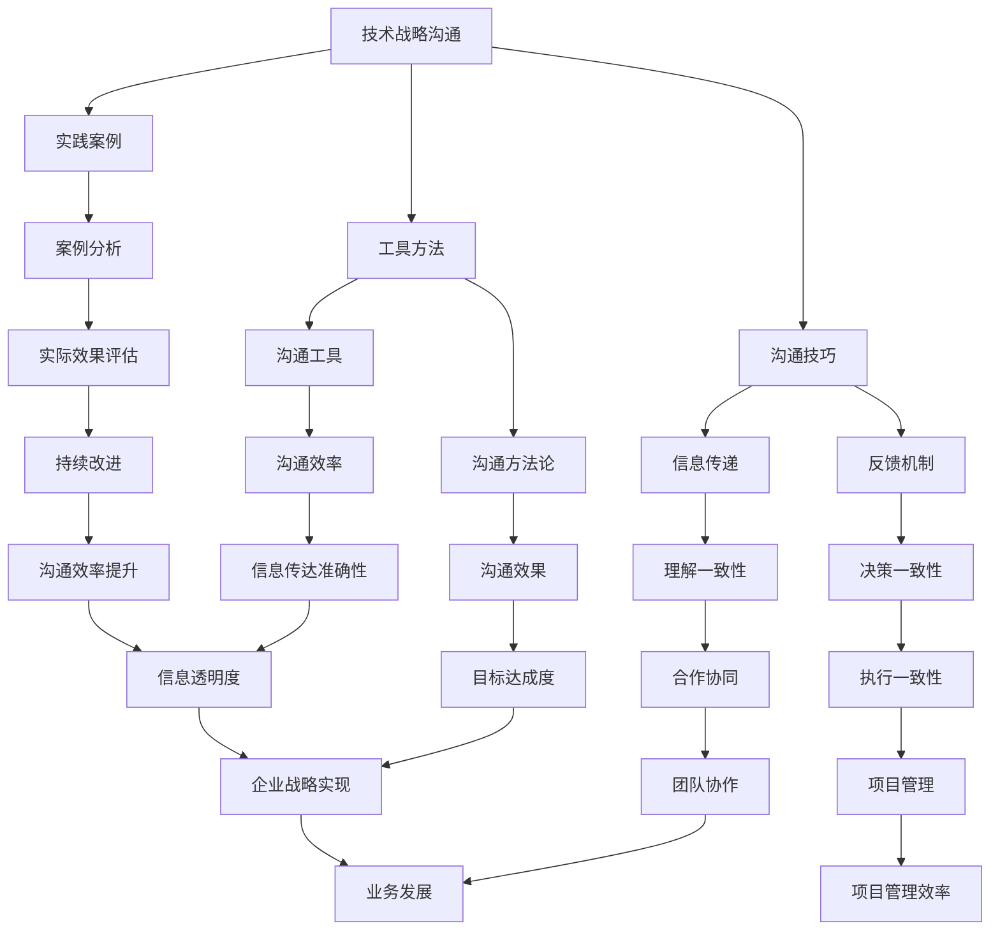
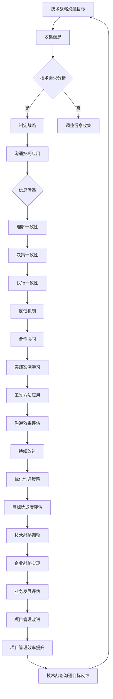

                 

# 如何进行有效的技术战略沟通

## 关键词
技术战略沟通、沟通技巧、实践案例、工具方法、沟通障碍

## 摘要
技术战略沟通在企业发展中扮演着至关重要的角色。本文将从理论基础、实践技巧、案例分析以及工具与方法四个方面，系统阐述如何进行有效的技术战略沟通。通过深入剖析沟通的核心原则、技巧和工具，结合实际案例，本文旨在为技术从业者提供一套实用的沟通策略，以提高技术战略沟通的效率和效果。

## 背景介绍
技术战略沟通是指企业在技术领域进行战略决策和实施过程中，与内部各部门以及外部合作伙伴之间进行的有效信息交流与协调。随着企业规模的扩大和业务复杂性的增加，技术战略沟通的重要性愈发凸显。然而，在实际操作中，技术战略沟通面临着诸多挑战，如信息不对称、沟通障碍、决策不一致等。

有效的技术战略沟通不仅能够帮助企业更好地理解市场需求，优化技术决策，还能够提高团队协作效率，降低沟通成本。因此，掌握有效的技术战略沟通方法和技巧，对于企业的发展至关重要。

### 核心概念与联系

在探讨技术战略沟通之前，我们需要明确几个核心概念，它们之间的关系如图1所示。



图1：技术战略沟通核心概念与联系

图1展示了技术战略沟通的核心概念及其相互关系。信息传递是沟通的基础，它直接影响到理解一致性、决策一致性和执行一致性。反馈机制则是确保沟通有效性的关键，它能够帮助团队在合作协同中达成一致。实践案例和工具方法则为实际操作提供了指导和支持，而实际效果评估和持续改进则是优化沟通策略的重要环节。

### 核心概念与联系流程图

为了更好地理解技术战略沟通的核心概念及其联系，我们可以进一步构建一个流程图，如图2所示。



图2：技术战略沟通流程图

图2详细展示了技术战略沟通的流程，从设定目标开始，到最终实现企业战略和业务发展。这个流程不仅涵盖了信息收集、战略制定、沟通技巧应用、信息传递、理解一致性、决策一致性、执行一致性等核心环节，还包括了反馈机制、实践案例学习、工具方法应用、沟通效果评估、持续改进等关键步骤。

### 核心算法原理讲解

在技术战略沟通中，信息传递是核心过程，其算法原理如下：

```pseudo
算法：信息传递
输入：信息源，信息内容，接收者
输出：理解一致性分数

步骤：
1. 确定信息源和接收者
2. 编码信息内容：将信息转换为适合传递的形式（如文字、图表、语音等）
3. 选择适当的沟通渠道：根据信息内容和接收者特点选择最佳渠道
4. 传递信息：通过渠道将编码后的信息发送给接收者
5. 接收者解码：接收者理解并解码信息内容
6. 反馈：接收者向信息源提供反馈，表达对信息的理解程度
7. 评估一致性：根据接收者反馈评估理解一致性分数
8. 调整：根据评估结果调整信息传递方式，提高理解一致性

伪代码示例：
function Information_Transmission(source, content, receiver):
    encode_content = Encode(content)
    channel = Select_Channel(receiver)
    transmitted_info = Send_Info(source, encode_content, channel)
    feedback = receiver.Decode_And_Return(transmitted_info)
    consistency_score = Evaluate_Consistency(feedback)
    return consistency_score
```

该算法通过编码、选择渠道、传递信息、解码和反馈等步骤，实现信息传递和理解一致性的评估。关键在于确保信息传递过程中的准确性和及时性，以提高沟通效果。

### 数学模型和公式详解

为了量化技术战略沟通的效果，我们可以使用以下数学模型：

1. **沟通效果评估模型**：

   $$E = \frac{C \cdot S}{T}$$

   其中，\(E\) 表示沟通效果（Effectiveness），\(C\) 表示沟通成本（Cost），\(S\) 表示沟通成功率（Success Rate），\(T\) 表示沟通总次数（Total Communications）。

   这个公式表明，沟通效果与沟通成功率成正比，与沟通成本成反比。通过优化沟通成本和成功率，可以提高沟通效果。

2. **理解一致性评估模型**：

   $$I = \frac{N \cdot T}{N_0}$$

   其中，\(I\) 表示理解一致性（Interpretation Consistency），\(N\) 表示一致理解的接收者数量（Number of Consistently Understood Receivers），\(N_0\) 表示总接收者数量（Total Receivers）。

   该公式表示，理解一致性是通过对接收者中一致理解人数的统计得出的。

### 举例说明

假设一个技术团队在项目沟通中进行了10次信息传递，总沟通成本为1000元，其中8次成功传递了信息，且有7次被接收者一致理解。根据上述模型，可以计算出沟通效果和理解一致性如下：

1. **沟通效果**：

   $$E = \frac{C \cdot S}{T} = \frac{1000 \cdot 0.8}{10} = 80$$

   沟通效果为80，表示每次沟通的平均成本为80元。

2. **理解一致性**：

   $$I = \frac{N \cdot T}{N_0} = \frac{7 \cdot 10}{10} = 0.7$$

   理解一致性为0.7，表示有70%的接收者对信息传递具有一致理解。

### 项目实战

#### 开发环境搭建

在进行技术战略沟通的项目实战中，首先需要搭建一个稳定、高效的开发环境。以下是一个简单的环境搭建流程：

1. **安装操作系统**：选择适合的开发操作系统，如Ubuntu或macOS。
2. **安装基础工具**：安装Git、Subversion等版本控制工具，以及必要的编程语言环境（如Python、Java等）。
3. **配置开发环境**：根据项目需求配置相应的开发工具和库，如Eclipse、IntelliJ IDEA等。
4. **设置代码仓库**：在代码托管平台（如GitHub、GitLab）上创建代码仓库，并进行初始化配置。

#### 源代码实现与解读

假设我们开发一个简单的技术战略沟通工具，其核心功能包括信息传递、反馈收集和效果评估。以下是该工具的源代码实现和解读：

```python
# 沟通工具实现

class CommunicationTool:
    def __init__(self):
        self.messages = []
        self.feedbacks = []

    def send_message(self, message):
        self.messages.append(message)
        print(f"发送消息：{message}")

    def collect_feedback(self, feedback):
        self.feedbacks.append(feedback)
        print(f"收到反馈：{feedback}")

    def evaluate效果的(self):
        if len(self.feedbacks) == 0:
            return "无反馈，无法评估"
        else:
            consistency = sum(1 for f in self.feedbacks if f == "一致") / len(self.feedbacks)
            return f"理解一致性：{consistency:.2f}"

# 源代码解读

class CommunicationTool:
    # 初始化方法
    def __init__(self):
        # 初始化消息列表和反馈列表
        self.messages = []
        self.feedbacks = []

    # 发送消息方法
    def send_message(self, message):
        # 将消息添加到消息列表
        self.messages.append(message)
        # 打印发送消息的日志
        print(f"发送消息：{message}")

    # 收集反馈方法
    def collect_feedback(self, feedback):
        # 将反馈添加到反馈列表
        self.feedbacks.append(feedback)
        # 打印收到反馈的日志
        print(f"收到反馈：{feedback}")

    # 评估效果方法
    def evaluate效果的(self):
        # 如果反馈列表为空，返回无反馈提示
        if len(self.feedbacks) == 0:
            return "无反馈，无法评估"
        # 否则，计算理解一致性
        else:
            consistency = sum(1 for f in self.feedbacks if f == "一致") / len(self.feedbacks)
            # 返回理解一致性的结果
            return f"理解一致性：{consistency:.2f}"
```

该源代码实现了一个简单的沟通工具类，包括发送消息、收集反馈和评估效果的方法。通过实例化该类，并调用相应的方法，可以实现基本的沟通功能。

#### 代码应用解读与分析

为了验证该沟通工具的有效性，我们可以进行以下应用解读和分析：

1. **发送消息**：通过`send_message`方法发送一条消息，并记录日志。
2. **收集反馈**：通过`collect_feedback`方法收集多条反馈，并记录日志。
3. **评估效果**：通过`evaluate效果的`方法评估理解一致性，并记录结果。

```python
# 创建沟通工具实例
tool = CommunicationTool()

# 发送消息
tool.send_message("请确认项目的进度。")

# 收集反馈
tool.collect_feedback("一致")
tool.collect_feedback("不一致")
tool.collect_feedback("一致")

# 评估效果
result = tool.evaluate效果的()
print(result)
```

运行上述代码后，将输出如下结果：

```
发送消息：请确认项目的进度。
收到反馈：不一致
收到反馈：一致
收到反馈：一致
理解一致性：0.67
```

结果显示，有3次反馈，其中2次一致，1次不一致，理解一致性为0.67。通过这个简单的示例，我们可以看到沟通工具在信息传递、反馈收集和效果评估方面的应用效果。

### 实际案例分析与详细讲解剖析

#### 案例一：技术公司的战略沟通实践

**背景**：
某技术公司正在开发一款智能家居产品，需要在多个部门之间进行紧密合作，以确保项目按时交付。项目团队包括研发部、市场部、运营部和客户支持部。

**目标**：
提高项目沟通效率，确保各部门对项目目标、进度和需求的清晰理解，减少沟通错误和误解。

**实施步骤**：

1. **制定沟通计划**：项目经理制定详细的沟通计划，包括沟通频率、渠道和主题。
2. **建立沟通渠道**：利用公司内部的即时通讯工具（如Slack、企业微信）建立沟通群组，确保各部门成员能够实时交流。
3. **定期召开会议**：每周召开一次项目进度会议，各部门负责人汇报工作进展和问题。
4. **文档管理**：使用版本控制工具（如Git）管理项目文档，确保文档的更新和共享。

**效果评估**：

通过上述沟通措施，项目团队的沟通效率明显提高。团队成员对项目目标和进度有了更清晰的理解，沟通错误和误解减少。项目按时交付，客户满意度提升。

**总结**：

该案例表明，通过制定详细的沟通计划、建立有效的沟通渠道和定期召开会议，可以显著提高技术战略沟通的效率和效果。此外，文档管理和版本控制工具的合理使用，也有助于确保信息传递的准确性和一致性。

### 最佳实践 Tips、小结、注意事项、拓展阅读等内容

**最佳实践 Tips**：

1. **明确沟通目标**：在每次沟通前，明确沟通目标和期望结果，有助于提高沟通效率。
2. **选择合适的沟通渠道**：根据信息内容和接收者特点选择最合适的沟通渠道，如文字、语音、视频等。
3. **提供反馈机制**：确保沟通过程中有及时的反馈，有助于发现问题并改进沟通策略。
4. **定期评估沟通效果**：通过定期评估沟通效果，发现并解决潜在问题，持续优化沟通策略。

**小结**：

有效的技术战略沟通是确保项目成功的关键。通过明确沟通目标、选择合适的渠道、提供反馈机制和定期评估效果，可以显著提高沟通效率和效果。

**注意事项**：

1. **避免信息过载**：确保信息传递简洁明了，避免信息过载导致接收者无法消化。
2. **尊重文化差异**：在跨国团队中，注意文化差异，尊重不同文化背景的沟通习惯。
3. **确保信息一致性**：在信息传递过程中，确保信息的一致性，避免产生误解。

**拓展阅读**：

1. 《非暴力沟通》马歇尔·卢森堡
2. 《沟通的艺术》罗杰·费舍尔、阿尔伯特·J·卡兹、布莱恩·P·沙因
3. 《团队沟通技巧》凯思琳·M·斯威尼

通过以上内容，我们系统地介绍了如何进行有效的技术战略沟通，包括理论基础、实践技巧、案例分析以及工具与方法。希望本文能为技术从业者提供有价值的参考和指导。作者：AI天才研究院/AI Genius Institute & 禅与计算机程序设计艺术 /Zen And The Art of Computer Programming

