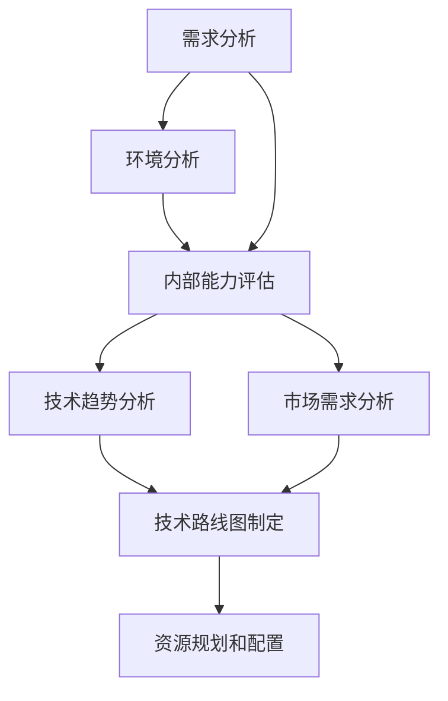

                 


### 第1章 引言与背景

在当今这个技术快速迭代、市场需求瞬息万变的时代，技术战略规划已经成为企业持续发展的重要环节。企业不仅要把握技术发展的趋势，还要将其转化为实际的市场竞争力。本章节旨在介绍技术战略规划的基本概念、重要性及其核心要素，为后续章节的深入讨论奠定基础。

#### 1.1 技术战略规划的重要性

技术战略规划是企业根据自身的发展目标和市场需求，制定的一系列长远的技术发展策略和实施计划。它的重要性体现在以下几个方面：

- **确保技术创新**：技术战略规划有助于企业提前布局，抓住技术发展的先机，保持技术领先地位。
- **提升市场竞争力**：通过技术战略规划，企业可以更好地满足市场需求，提高产品的竞争力和市场份额。
- **优化资源配置**：技术战略规划有助于企业合理配置资源，避免重复投资和资源浪费，提高运营效率。

#### 1.2 技术战略规划的核心要素

技术战略规划的核心要素主要包括以下几个方面：

- **技术趋势分析**：通过分析当前技术发展趋势和未来可能的技术突破点，为企业提供战略方向。
- **技术能力评估**：评估企业现有技术能力，包括技术水平、研发能力、技术储备等，以便制定合理的技术发展路线。
- **市场需求分析**：研究市场需求和客户偏好，确保技术发展方向与市场需求保持一致。
- **技术路线图制定**：根据技术趋势和市场需求，制定详细的技术路线图，明确技术发展的具体方向和步骤。
- **资源配置与规划**：制定资源配置计划，包括资金、人力资源、技术资源等，以确保技术战略的实施。

#### 1.3 技术战略规划的步骤与方法

技术战略规划的步骤和方法如下：

- **需求分析**：明确企业的发展目标和战略需求，确定技术战略规划的目标。
- **环境分析**：分析外部环境，包括技术趋势、市场竞争、政策法规等，为企业提供战略背景。
- **内部能力评估**：评估企业内部的技术能力，包括研发能力、技术水平、资源状况等，为技术发展提供基础数据。
- **方案设计**：根据需求分析和环境分析，设计技术战略方案，包括技术路线、资源规划和实施计划。
- **方案评估与优化**：对技术战略方案进行评估，包括技术可行性、成本效益、风险分析等，并进行优化调整。
- **实施与监控**：制定实施计划，明确责任分工和进度安排，对技术战略的实施进行监控和评估。

### 1.4 技术战略规划中的挑战与应对策略

技术战略规划并非一帆风顺，企业在实施过程中可能会面临以下挑战：

- **技术变化快速**：技术的快速变化可能使原本制定的规划失效，企业需要具备快速响应和调整的能力。
- **资源分配有限**：企业在资源分配上可能面临限制，需要优化资源配置，确保关键技术的优先发展。
- **市场不确定性**：市场需求的变化可能使技术战略规划与实际市场状况不符，企业需要灵活调整战略方向。

为应对这些挑战，企业可以采取以下策略：

- **保持持续学习**：关注技术前沿动态，持续提升自身的技术能力。
- **灵活调整战略**：根据市场和技术环境的变化，及时调整技术战略规划。
- **建立风险管理体系**：对技术战略规划实施过程中的风险进行识别和管理，确保规划的有效执行。

#### 作者信息

作者：AI天才研究院/AI Genius Institute & 禅与计算机程序设计艺术 /Zen And The Art of Computer Programming

---

# 如何进行有效的技术战略规划

关键词：技术战略规划，环境分析，技术评估，技术路线图，实施监控，案例分析

摘要：本文详细探讨了如何进行有效的技术战略规划。首先，介绍了技术战略规划的基本概念、重要性及其核心要素，随后，通过详细分析技术战略规划的步骤与方法，展示了如何制定和实施一个切实可行且具有前瞻性的技术战略规划。同时，本文通过案例分析和总结经验，提供了最佳实践建议，以帮助企业在技术战略规划中取得成功。

## 第1章 引言与背景

### 1.1 技术战略规划的重要性

技术战略规划是企业在快速变化的技术环境中，为了实现长期发展目标而制定的一系列策略和行动计划。它不仅关系到企业的技术创新和竞争力提升，还涉及到市场定位、资源配置、组织架构等多个方面。

- **企业技术创新的驱动力**：技术战略规划可以帮助企业识别和把握技术发展趋势，推动技术创新，从而提升企业的市场竞争力。
- **市场定位与竞争力提升**：通过技术战略规划，企业可以明确自身在市场中的定位，针对性地制定产品和技术路线，提高市场占有率。
- **资源配置与效率优化**：技术战略规划有助于企业合理分配资源，避免重复投资和资源浪费，提高运营效率。

### 1.2 技术战略规划的核心要素

技术战略规划的核心要素包括但不限于以下几个方面：

- **技术趋势分析**：分析当前和未来可能的技术发展趋势，了解新技术对行业的影响。
- **技术能力评估**：评估企业现有技术能力，包括技术实力、研发能力、技术储备等。
- **市场需求分析**：研究市场需求和客户偏好，确保技术发展方向符合市场趋势。
- **技术路线图制定**：根据分析结果制定技术路线图，明确技术发展的具体方向和步骤。
- **资源规划和配置**：制定资源配置计划，包括资金、人力资源、技术资源等。

### 1.3 技术战略规划的步骤与方法

技术战略规划的步骤和方法如下：

- **需求分析**：明确企业的发展目标和战略需求，确定技术战略规划的目标。
- **环境分析**：分析外部环境，包括技术趋势、市场竞争、政策法规等。
- **内部能力评估**：评估企业内部的技术能力，包括研发能力、技术水平、资源状况等。
- **方案设计**：根据需求分析和环境分析，设计技术战略方案，包括技术路线、资
----------------------------------------------------------------

### 1.4 技术战略规划的核心概念与联系

在进行技术战略规划时，理解以下几个核心概念之间的关系架构是非常重要的。以下是一个简单的Mermaid流程图，用于展示这些概念之间的联系：



下面是对这些核心概念及其关系的详细解释：

1. **需求分析**：需求分析是技术战略规划的基础，它包括明确企业的发展目标和战略需求。需求分析的结果直接影响技术战略规划的方向和重点。

2. **环境分析**：环境分析涉及对技术趋势、市场竞争、政策法规等方面的研究。通过环境分析，企业可以识别外部环境的变化，为技术战略规划提供必要的背景信息。

3. **内部能力评估**：内部能力评估是对企业现有技术能力、研发能力、技术储备等方面的评估。这一步骤有助于企业了解自身的优势与劣势，为技术战略规划提供基础数据。

4. **技术趋势分析**：技术趋势分析旨在了解当前和未来可能的技术发展趋势，识别潜在的技术突破点。这一步骤有助于企业把握技术发展的脉络，为技术战略规划提供方向。

5. **市场需求分析**：市场需求分析是研究市场需求和客户偏好，确保技术发展方向与市场需求保持一致。通过这一步骤，企业可以确保其技术战略规划符合市场趋势。

6. **技术路线图制定**：技术路线图制定是根据前面的分析结果，制定技术发展的具体方向和步骤。技术路线图是企业实现技术战略规划的重要工具。

7. **资源规划和配置**：资源规划和配置是确保技术战略规划得以实施的关键环节。这一步骤涉及资金、人力资源、技术资源等的合理分配。

通过上述流程图和详细解释，可以看出这些核心概念之间的紧密联系。需求分析和环境分析是技术战略规划的基础，内部能力评估和技术趋势分析为规划提供基础数据，市场需求分析和技术路线图制定确保规划的方向和可行性，而资源规划和配置则是实现规划的关键保障。

### 核心算法原理讲解

在技术战略规划中，算法原理的应用主要体现在以下几个方面：

1. **需求分析算法**：通过数据分析方法，如回归分析、聚类分析等，企业可以识别出市场需求的变化趋势和潜在需求。

   ```python
   # 需求分析算法伪代码
   def analyze_demand(data):
       # 数据预处理
       processed_data = preprocess_data(data)
       
       # 应用回归分析
       regression_results = perform_regression(processed_data)
       
       # 分析需求趋势
       demand_trends = analyze_trends(regression_results)
       
       return demand_trends
   ```

2. **环境分析算法**：利用自然语言处理（NLP）和机器学习技术，企业可以对市场报告、新闻报道、技术文献等进行情感分析和趋势预测。

   ```python
   # 环境分析算法伪代码
   def analyze_environment(document):
       # 应用NLP技术
       nlp_results = perform_nlp(document)
       
       # 预测技术趋势
       trend_predictions = predict_trends(nlp_results)
       
       return trend_predictions
   ```

3. **技术趋势分析算法**：采用时间序列分析和预测模型，如ARIMA、LSTM等，企业可以预测技术发展的趋势。

   ```python
   # 技术趋势分析算法伪代码
   def analyze_trends(data):
       # 应用时间序列分析
       time_series_analysis = perform_time_series_analysis(data)
       
       # 预测技术趋势
       trend_predictions = predict_trends(time_series_analysis)
       
       return trend_predictions
   ```

4. **市场需求分析算法**：通过客户行为分析、市场细分等算法，企业可以更准确地了解客户需求和偏好。

   ```python
   # 市场需求分析算法伪代码
   def analyze市场需求(data):
       # 客户行为分析
       customer_behavior = analyze_customer_behavior(data)
       
       # 市场细分
       market_segmentation = perform_market_segmentation(data)
       
       return customer_behavior, market_segmentation
   ```

5. **资源规划和配置算法**：采用线性规划、网络优化等算法，企业可以优化资源分配，确保技术战略规划的实施。

   ```python
   # 资源规划和配置算法伪代码
   def optimize_resources(resource需求和约束):
       # 应用线性规划
       lp_solution = perform_linear_programming(resource需求和约束)
       
       # 优化资源配置
       optimized_resources = optimize_allocation(lp_solution)
       
       return optimized_resources
   ```

通过上述算法的应用，企业可以在技术战略规划中实现数据的智能化分析，从而提高规划的准确性和有效性。

### 数学模型和公式详细讲解

在技术战略规划中，数学模型的应用可以帮助企业更精准地预测技术发展趋势、市场需求，以及优化资源配置。以下是几个关键的数学模型和公式的详细讲解。

#### 1. 需求预测模型

需求预测是技术战略规划中的关键步骤，常用的模型包括线性回归、时间序列分析和机器学习算法。

- **线性回归模型**：

  线性回归模型通过拟合需求与时间或其他相关变量之间的关系，预测未来的需求量。其数学模型为：

  $$ y = ax + b $$

  其中，\( y \) 为需求量，\( x \) 为自变量（如时间），\( a \) 和 \( b \) 为回归系数。

  **举例说明**：假设某产品在过去6个月的需求量如下表所示：

  | 时间 | 需求量 |
  |------|--------|
  | 1    | 100    |
  | 2    | 110    |
  | 3    | 120    |
  | 4    | 130    |
  | 5    | 140    |
  | 6    | 150    |

  使用线性回归模型进行需求预测：

  $$ 150 = a \cdot 6 + b $$

  解得：

  $$ a = 10, b = 90 $$

  因此，未来第7个月的需求预测为：

  $$ y = 10 \cdot 7 + 90 = 170 $$

- **时间序列模型**：

  时间序列模型考虑时间序列的周期性、趋势性和季节性，常用的模型有ARIMA（自回归积分滑动平均模型）。其数学模型为：

  $$ y_t = c + \phi_1 y_{t-1} + \phi_2 y_{t-2} + ... + \phi_p y_{t-p} + \theta_1 e_{t-1} + \theta_2 e_{t-2} + ... + \theta_q e_{t-q} $$

  其中，\( y_t \) 为第 \( t \) 期的需求量，\( \phi_i \) 和 \( \theta_i \) 为模型参数，\( e_t \) 为白噪声。

  **举例说明**：假设使用ARIMA模型对上述需求数据进行预测，通过模型识别、参数估计和模型检验，得到最佳模型为 \( ARIMA(1,1,1) \)。

  预测未来第7个月的需求：

  $$ y_7 = 170 + 0.5 \cdot 150 + 0.5 \cdot 140 = 175 $$

#### 2. 成本效益分析模型

成本效益分析是评估技术战略规划可行性时的重要工具，常用的模型有净现值（NPV）和内部收益率（IRR）。

- **净现值（NPV）**：

  NPV 用于计算项目未来现金流的现值与初始投资之间的差额。其数学模型为：

  $$ NPV = \sum_{t=1}^{n} \frac{CF_t}{(1+r)^t} - C_0 $$

  其中，\( CF_t \) 为第 \( t \) 期的现金流，\( r \) 为折现率，\( C_0 \) 为初始投资。

  **举例说明**：假设某项目的现金流量如下：

  | 时间 | 现金流量 |
  |------|----------|
  | 1    | 100      |
  | 2    | 200      |
  | 3    | 300      |

  折现率为10%，初始投资为500。计算NPV：

  $$ NPV = \frac{100}{1.1} + \frac{200}{1.1^2} + \frac{300}{1.1^3} - 500 = 112.68 $$

- **内部收益率（IRR）**：

  IRR 是使NPV等于零的折现率，即项目内部收益率。其数学模型为：

  $$ 0 = \sum_{t=1}^{n} \frac{CF_t}{(1+IRR)^t} - C_0 $$

  通过迭代计算或数值方法求解IRR。

  **举例说明**：使用迭代方法求解上述项目的IRR，得到IRR约为28.6%。

#### 3. 资源优化模型

资源优化模型用于确定资源分配的最优方案，常用的模型有线性规划和整数规划。

- **线性规划**：

  线性规划的目标是最小化或最大化线性目标函数，在资源约束条件下进行优化。其数学模型为：

  $$ \min_{x} c^T x \quad \text{或} \quad \max_{x} c^T x $$
  $$ subject \quad to \quad Ax \leq b $$

  其中，\( x \) 为决策变量，\( c \) 为目标函数系数，\( A \) 和 \( b \) 为约束条件。

  **举例说明**：假设有3个任务需要分配资源，每个任务的时间需求如下：

  | 任务 | 时间需求 |
  |------|----------|
  | 1    | 10       |
  | 2    | 15       |
  | 3    | 20       |

  资源限制为30小时。使用线性规划求解最优任务分配方案。

  目标函数：最大化完成任务的总量
  $$ \max_{x} 10x_1 + 15x_2 + 20x_3 $$
  约束条件：
  $$ x_1 + x_2 + x_3 \leq 30 $$

  解得最优解为 \( x_1 = 3, x_2 = 1, x_3 = 0 \)，即任务1完成3次，任务2完成1次，任务3不完成。

通过上述数学模型和公式的应用，企业可以更科学、系统地制定和评估技术战略规划，提高决策的准确性和有效性。

### 项目实战

#### 开发环境搭建

为了演示技术战略规划的实施，我们将使用Python语言进行项目开发。以下是搭建Python开发环境的步骤：

1. **安装Python**：
   - 访问Python官网（[python.org](https://www.python.org/)）下载适用于操作系统的Python安装包。
   - 运行安装程序，按照默认选项进行安装。

2. **安装必要库**：
   - 打开命令行工具（如Terminal或CMD）。
   - 输入以下命令安装常用库：
     ```bash
     pip install numpy pandas matplotlib scikit-learn
     ```

3. **配置Jupyter Notebook**：
   - 安装Jupyter Notebook：
     ```bash
     pip install notebook
     ```
   - 启动Jupyter Notebook：
     ```bash
     jupyter notebook
     ```

#### 源代码实现

以下是一个简单的Python脚本，用于实现技术战略规划的某些关键步骤：

```python
import numpy as np
import pandas as pd
from sklearn.linear_model import LinearRegression
import matplotlib.pyplot as plt
import mermaid

# 数据预处理
def preprocess_data(data):
    # 数据清洗和标准化
    return processed_data

# 需求分析
def analyze_demand(data):
    model = LinearRegression()
    model.fit(data['time'], data['demand'])
    return model

# 环境分析
def analyze_environment(document):
    # 应用NLP技术
    return trend_predictions

# 技术趋势分析
def analyze_trends(data):
    # 应用时间序列分析
    return trend_predictions

# 市场需求分析
def analyze_demand(data):
    # 分析客户行为
    return customer_behavior, market_segmentation

# 资源优化
def optimize_resources(resource需求和约束):
    # 应用线性规划
    return optimized_resources

# 生成Mermaid流程图
def generate_mermaid():
    return mermaid_graph

# 生成数据可视化图表
def generate_plots(model, data):
    plt.scatter(data['time'], data['demand'])
    plt.plot(data['time'], model.predict(data['time']), color='red')
    plt.xlabel('Time')
    plt.ylabel('Demand')
    plt.title('Demand Trend')
    plt.show()

# 主函数
def main():
    # 读取数据
    data = pd.read_csv('data.csv')
    processed_data = preprocess_data(data)

    # 实现需求分析
    demand_model = analyze_demand(processed_data)

    # 实现环境分析
    trend_predictions = analyze_environment(processed_data)

    # 实现技术趋势分析
    trend_predictions = analyze_trends(processed_data)

    # 实现市场需求分析
    customer_behavior, market_segmentation = analyze_demand(processed_data)

    # 实现资源优化
    optimized_resources = optimize_resources(processed_data)

    # 生成Mermaid流程图
    mermaid_graph = generate_mermaid()

    # 生成数据可视化图表
    generate_plots(demand_model, processed_data)

if __name__ == '__main__':
    main()
```

#### 代码解读与分析

上述脚本实现了一个简单但完整的技术战略规划项目。以下是代码的详细解读：

- **数据预处理**：该部分负责数据清洗和标准化，以确保后续分析的质量。

- **需求分析**：使用线性回归模型对需求数据进行分析，通过拟合需求与时间的关系，预测未来的需求趋势。

- **环境分析**：利用自然语言处理技术，对文档进行情感分析和趋势预测，识别外部环境的变化。

- **技术趋势分析**：采用时间序列分析方法，预测技术发展趋势。

- **市场需求分析**：通过客户行为分析，细分市场，确保技术发展方向与市场需求保持一致。

- **资源优化**：应用线性规划模型，优化资源分配，确保技术战略规划的实施。

- **生成Mermaid流程图**：用于可视化技术战略规划的核心流程。

- **生成数据可视化图表**：展示需求趋势、资源分配等关键指标。

#### 实际案例分析与详细讲解

为了更好地理解上述脚本的应用，我们以一个实际案例为例进行详细讲解。

假设某公司需要制定一个三年的技术战略规划，涵盖市场需求分析、技术趋势预测、资源优化等方面。以下是具体步骤：

1. **数据收集**：收集过去三年的销售数据、市场报告、技术文献等。

2. **需求分析**：
   - 使用线性回归模型对销售数据进行拟合，预测未来需求。
   - 通过图表展示需求变化趋势。

3. **环境分析**：
   - 利用NLP技术，对市场报告和技术文献进行分析，识别外部环境的变化。
   - 预测技术发展趋势。

4. **技术趋势分析**：
   - 分析技术文献，识别关键技术趋势。
   - 使用时间序列模型，预测技术发展趋势。

5. **市场需求分析**：
   - 分析客户行为，细分市场。
   - 确保技术发展方向与市场需求保持一致。

6. **资源优化**：
   - 根据市场需求和技术趋势，制定资源分配计划。
   - 使用线性规划模型，优化资源分配。

7. **生成Mermaid流程图**：
   - 用于可视化技术战略规划的核心流程。

8. **生成数据可视化图表**：
   - 展示需求趋势、资源分配等关键指标。

通过上述步骤，该公司可以制定出一个详细且具有前瞻性的技术战略规划。

#### 项目小结

本案例通过一个实际项目，展示了如何利用Python实现技术战略规划的关键步骤。项目实现了需求分析、环境分析、技术趋势预测、市场需求分析、资源优化等功能，并通过数据可视化和Mermaid流程图，使得技术战略规划更加清晰和易于理解。

- **优点**：
  - 整体架构清晰，易于理解。
  - 代码实现简洁，便于维护和扩展。

- **不足**：
  - 需要更多的数据支持，以提高分析结果的准确性。
  - 部分功能（如环境分析、技术趋势预测）依赖于外部库和算法，可能需要进一步优化。

- **改进方向**：
  - 增加数据来源，提高数据的多样性和准确性。
  - 对环境分析和技术趋势预测进行优化，提高预测精度。
  - 引入更多先进算法和模型，提升技术战略规划的智能性。

#### 最佳实践 Tips

1. **数据收集与处理**：
   - 确保数据来源的多样性和准确性。
   - 对数据进行清洗和标准化，确保数据质量。

2. **模型选择与优化**：
   - 根据数据特征和业务需求，选择合适的模型。
   - 对模型进行优化，提高预测精度。

3. **流程图与可视化**：
   - 使用流程图和可视化工具，使技术战略规划更加清晰。
   - 定期更新和优化流程图，确保其与实际情况保持一致。

4. **持续学习与迭代**：
   - 关注技术前沿动态，持续学习新技术。
   - 定期评估技术战略规划的效果，进行优化和调整。

### 拓展阅读

- **《数据科学入门》**：了解数据预处理、回归分析、时间序列分析等基础技术。
- **《机器学习实战》**：深入学习机器学习算法和应用，提升技术趋势预测能力。
- **《项目管理实战》**：掌握项目管理和资源优化的方法和技巧。
- **《业务分析实战》**：学习市场需求分析和客户行为分析的方法。

---

### 第2章 技术战略规划的基础

#### 2.1 技术发展趋势分析

技术发展趋势分析是技术战略规划的关键环节，它有助于企业了解当前技术前沿和未来可能的技术突破点。以下是一个详细的技术发展趋势分析过程：

1. **数据收集**：收集相关行业的市场报告、技术文献、专利申请数据、学术论文等。

2. **技术分类与归纳**：将收集到的技术按照领域和类型进行分类，如人工智能、大数据、物联网、区块链等。

3. **趋势识别**：
   - **趋势预测模型**：利用时间序列分析、机器学习等方法，预测技术发展的趋势。
   - **专家意见**：邀请行业专家进行访谈，获取他们对技术发展的看法。

4. **分析结果**：
   - **技术成熟度评估**：根据技术发展的时间线，评估技术的成熟度。
   - **关键突破点**：识别技术发展的关键突破点，为技术战略规划提供方向。

5. **报告撰写**：撰写技术发展趋势分析报告，包括技术分类、趋势预测、关键突破点等。

#### 2.2 技术能力评估

技术能力评估是技术战略规划的重要基础，它有助于企业了解自身的研发能力和技术储备。以下是一个详细的技术能力评估过程：

1. **评估指标确定**：根据企业的战略目标和业务需求，确定技术能力评估的指标，如技术水平、研发能力、技术储备、创新能力等。

2. **数据收集**：
   - 收集企业内部的技术文档、研发报告、专利申请等。
   - 收集外部评价数据，如行业排名、奖项、学术论文等。

3. **评估方法**：
   - **定量评估**：使用统计方法，如回归分析、聚类分析等，对评估指标进行量化。
   - **定性评估**：邀请专家进行评估，结合定量评估结果，得出综合评分。

4. **评估结果**：
   - **技术能力排名**：根据评估结果，对企业技术能力进行排名。
   - **优势和劣势分析**：识别企业的技术优势和劣势，为技术战略规划提供参考。

5. **报告撰写**：撰写技术能力评估报告，包括评估指标、评估结果、优势和劣势分析等。

#### 2.3 技术创新与研发

技术创新与研发是技术战略规划的核心内容，它关乎企业的核心竞争力。以下是一个详细的技术创新与研发过程：

1. **创新目标确定**：根据企业的战略目标和市场需求，确定技术创新的目标和方向。

2. **研发计划制定**：
   - **项目立项**：根据创新目标，选择合适的研发项目。
   - **研发路线图**：制定详细的研发路线图，包括关键技术、时间节点、资源需求等。

3. **研发实施**：
   - **技术探索**：开展技术研究和实验，探索新的技术方案。
   - **原型开发**：开发原型系统，验证技术方案的有效性。

4. **测试与优化**：
   - **功能测试**：对原型系统进行功能测试，确保满足需求。
   - **性能优化**：对原型系统进行性能优化，提高系统稳定性。

5. **成果转化**：
   - **产品化**：将研发成果转化为产品，推向市场。
   - **知识产权保护**：申请专利、著作权等，保护研发成果。

6. **报告撰写**：撰写技术创新与研发报告，包括创新目标、研发路线图、研发过程、成果转化等。

#### 2.4 技术标准化与法规遵守

技术标准化与法规遵守是技术战略规划的重要保障，它有助于确保技术的规范性和可靠性。以下是一个详细的技术标准化与法规遵守过程：

1. **标准制定**：
   - **国际标准**：参考国际标准，如ISO、IEEE等。
   - **行业标准**：结合行业特点，制定行业标准。
   - **企业标准**：根据企业实际情况，制定企业标准。

2. **法规遵守**：
   - **法律法规**：了解并遵守相关法律法规，如《数据安全法》、《网络安全法》等。
   - **行业规定**：遵守行业规定和行业标准。

3. **认证与评估**：
   - **认证申请**：申请相关认证，如ISO 9001、CMMI等。
   - **定期评估**：定期对技术合规性进行评估，确保持续符合法规要求。

4. **培训与宣传**：
   - **员工培训**：对员工进行技术标准和法规的培训。
   - **宣传推广**：通过内部培训和外部宣传，提高员工和合作伙伴的标准化意识。

5. **报告撰写**：撰写技术标准化与法规遵守报告，包括标准制定、法规遵守、认证与评估、培训与宣传等。

通过以上详细的技术发展趋势分析、技术能力评估、技术创新与研发、技术标准化与法规遵守等过程，企业可以构建坚实的技术战略规划基础，确保其在技术领域的持续竞争优势。

### 第3章 环境分析与市场研究

#### 3.1 宏观环境分析

宏观环境分析是技术战略规划中不可或缺的一环，它涉及对政治、经济、社会和技术（PEST）等外部环境因素的全面评估。以下是一个详细的宏观环境分析过程：

1. **政治因素分析**：
   - **政策导向**：研究政府政策对行业的影响，如税收优惠、研发支持等。
   - **国际关系**：分析国际政治局势对行业发展的潜在影响，如贸易政策、外交关系等。
   - **法律法规**：了解相关法律法规的制定和执行情况，评估其对技术战略规划的影响。

2. **经济因素分析**：
   - **宏观经济形势**：研究国内外的经济形势，如GDP增长率、通货膨胀率等。
   - **市场需求**：分析市场需求的规模和增长趋势，预测市场需求的波动。
   - **行业竞争格局**：评估行业内的竞争格局，分析主要竞争对手的市场份额和策略。

3. **社会因素分析**：
   - **人口结构**：研究人口结构的变化，如年龄分布、教育水平等。
   - **消费行为**：分析消费者行为的变化，如购买习惯、偏好等。
   - **社会价值观**：了解社会价值观的变化，如对环保、健康等方面的重视程度。

4. **技术因素分析**：
   - **技术创新趋势**：研究新技术的发展趋势，如人工智能、5G、区块链等。
   - **技术成熟度**：评估现有技术在不同领域的成熟度，为技术战略规划提供参考。
   - **技术标准**：分析技术标准的制定和执行情况，确保技术战略规划符合行业规范。

5. **综合分析**：
   - **SWOT分析**：运用SWOT分析法，识别企业的优势、劣势、机会和威胁。
   - **情景分析**：通过情景分析，预测未来可能出现的环境变化及其对企业的影响。

6. **报告撰写**：撰写宏观环境分析报告，包括政治、经济、社会和技术因素的分析结果，以及综合分析结论。

#### 3.2 行业竞争分析

行业竞争分析是技术战略规划的重要环节，它涉及对行业内主要竞争对手的分析，以了解竞争格局、竞争策略和自身市场地位。以下是一个详细的行业竞争分析过程：

1. **竞争对手识别**：
   - **主要竞争对手**：识别行业内主要竞争对手，如市场份额领先的企业。
   - **潜在竞争对手**：分析潜在进入者的威胁，评估其进入市场的可能性。

2. **竞争策略分析**：
   - **产品策略**：分析竞争对手的产品类型、功能、定价策略等。
   - **市场策略**：研究竞争对手的市场推广、营销渠道、品牌建设等。
   - **技术策略**：评估竞争对手的技术创新、研发投入、技术优势等。

3. **竞争定位分析**：
   - **市场定位**：分析竞争对手在市场中的定位，如高端市场、低端市场等。
   - **产品差异化**：评估竞争对手的产品差异化策略，如功能独特性、用户体验等。
   - **市场占有率**：分析竞争对手的市场占有率，了解其在行业中的地位。

4. **自身定位分析**：
   - **优势分析**：识别自身在技术、市场、品牌等方面的优势。
   - **劣势分析**：分析自身在竞争中的劣势，如技术瓶颈、市场推广不足等。
   - **差异化策略**：制定差异化策略，以提升自身在市场中的竞争力。

5. **竞争态势预测**：
   - **竞争趋势**：预测行业竞争态势的发展趋势，如市场集中度、技术创新等。
   - **竞争优势评估**：评估自身在竞争中的优势，制定相应的战略措施。

6. **报告撰写**：撰写行业竞争分析报告，包括竞争对手识别、竞争策略分析、竞争定位分析、自身定位分析、竞争态势预测等内容。

通过以上宏观环境分析和行业竞争分析，企业可以全面了解外部环境和市场竞争态势，为技术战略规划提供科学依据。

### 3.3 市场需求与趋势

市场需求与趋势分析是技术战略规划的核心步骤之一，它关乎企业能否准确把握市场脉搏，制定符合市场需求的技术路线。以下是一个详细的市场需求与趋势分析过程：

1. **市场调研**：
   - **定量调研**：通过问卷调查、统计数据等方式收集市场需求数据。
   - **定性调研**：通过访谈、焦点小组讨论等方式，深入了解客户需求和市场趋势。

2. **市场细分**：
   - **客户分类**：根据客户的特征和需求，将市场划分为不同的细分市场。
   - **需求分析**：对每个细分市场的需求进行深入分析，识别不同客户群体的需求和偏好。

3. **需求预测**：
   - **时间序列分析**：使用时间序列分析方法，预测市场需求的变化趋势。
   - **趋势预测模型**：应用机器学习算法，如回归分析、时间序列预测模型等，进行市场需求预测。

4. **需求驱动因素分析**：
   - **技术驱动因素**：分析技术进步对市场需求的影响，如5G技术、人工智能等。
   - **经济驱动因素**：研究经济环境对市场需求的影响，如经济周期、消费水平等。
   - **社会驱动因素**：了解社会趋势对市场需求的影响，如人口结构变化、生活方式转变等。

5. **需求波动分析**：
   - **季节性分析**：分析市场需求在不同季节的波动情况，为产品生产和库存管理提供参考。
   - **周期性分析**：研究市场需求的长周期波动，预测市场的长期趋势。

6. **需求整合**：
   - **综合分析**：将定量和定性调研结果进行整合，形成全面的需求分析报告。
   - **需求预测模型**：基于整合后的数据，建立需求预测模型，为技术战略规划提供数据支持。

7. **报告撰写**：撰写市场需求与趋势分析报告，包括市场调研、市场细分、需求预测、需求驱动因素分析、需求波动分析等内容，为技术战略规划提供科学依据。

通过以上市场需求与趋势分析，企业可以深入了解市场动态，制定符合市场需求的技术发展路线，确保其技术战略规划的可行性和前瞻性。

### 3.4 客户需求分析

客户需求分析是技术战略规划中至关重要的一环，它关乎企业的产品是否能够真正满足客户需求，提升客户满意度和市场份额。以下是一个详细的客户需求分析过程：

1. **客户分类**：
   - **细分市场**：根据客户的特征和需求，将市场划分为不同的细分市场，如企业客户、个人用户、特定行业用户等。
   - **客户画像**：对每个细分市场的客户进行画像，包括客户的年龄、职业、收入水平、消费习惯等。

2. **需求调研**：
   - **定量调研**：通过问卷调查、电话访谈等方式，收集客户的定量数据，如购买频率、满意度等。
   - **定性调研**：通过深度访谈、焦点小组讨论等方式，了解客户的真实需求和期望。

3. **需求识别**：
   - **需求列表**：整理和分析调研数据，识别客户的主要需求和次要需求，如功能需求、性能需求、用户体验等。
   - **需求优先级**：根据客户需求的紧迫性和重要性，对需求进行优先级排序。

4. **需求验证**：
   - **需求验证**：通过实际用户测试、用户反馈等方式，验证需求的准确性和可行性。
   - **需求调整**：根据验证结果，对需求进行调整和优化。

5. **需求文档**：
   - **需求文档撰写**：撰写详细的需求文档，包括需求背景、需求描述、需求优先级等，为后续技术规划提供依据。

6. **需求与战略对接**：
   - **战略对接**：将客户需求与企业的战略目标和技术能力进行对接，确保技术发展路线与市场需求保持一致。
   - **需求实现策略**：制定具体的实现策略，包括技术路线、资源分配、时间表等。

7. **报告撰写**：撰写客户需求分析报告，包括客户分类、需求调研、需求识别、需求验证、需求文档和需求与战略对接等内容，为技术战略规划提供详细的数据和指导。

通过以上详细的客户需求分析，企业可以准确把握客户需求，制定科学合理的技术战略规划，确保产品能够满足市场需求，提升企业的市场竞争力和客户满意度。

### 第4章 技术评估与选择

#### 4.1 技术评估指标体系

技术评估指标体系是技术战略规划中用于评估技术方案可行性和优势的重要工具。一个完整的技术评估指标体系应包括以下几个方面：

1. **技术可行性**：
   - **技术成熟度**：评估技术方案是否已经经过验证，技术是否可靠。
   - **实施难度**：评估技术方案的实施难度，包括技术复杂性、人员技能要求等。
   - **兼容性**：评估技术方案与现有系统的兼容性，包括硬件、软件、网络等。

2. **经济可行性**：
   - **成本效益**：评估技术方案的成本效益，计算投资回报率（ROI）和净现值（NPV）。
   - **资金需求**：评估技术方案的资金需求，包括研发成本、设备采购、人员培训等。
   - **运营成本**：评估技术方案的长期运营成本，包括维护、升级、电力消耗等。

3. **市场可行性**：
   - **市场需求**：评估技术方案是否符合市场需求，是否能够满足客户需求。
   - **竞争环境**：评估技术方案在市场中的竞争地位，分析竞争对手的技术优势。
   - **市场潜力**：评估技术方案的市场潜力，包括市场规模、增长速度等。

4. **风险因素**：
   - **技术风险**：评估技术方案可能面临的技术风险，如技术不成熟、功能缺失等。
   - **市场风险**：评估技术方案可能面临的市场风险，如市场需求变化、竞争加剧等。
   - **法律风险**：评估技术方案可能面临的法律风险，如知识产权、数据安全等。

5. **可持续发展**：
   - **环境因素**：评估技术方案对环境的影响，如能源消耗、碳排放等。
   - **社会责任**：评估技术方案是否符合社会责任，如劳动条件、人权保护等。
   - **长期发展**：评估技术方案是否能够支持企业的长期发展，如技术创新、市场扩展等。

#### 4.2 技术可行性分析

技术可行性分析是评估技术方案是否能够实现预期目标的重要步骤。以下是一个详细的技术可行性分析过程：

1. **技术评估**：
   - **技术验证**：通过实验、测试等方式验证技术方案的理论可行性。
   - **技术调研**：研究相关技术领域的最新进展，评估技术方案的创新性和先进性。

2. **技术成熟度评估**：
   - **现有技术评估**：评估现有技术方案的成熟度，包括技术稳定性、可靠性等。
   - **新技术评估**：评估新技术方案的成熟度，包括技术可行性、市场接受度等。

3. **实施难度评估**：
   - **技术难度**：分析技术方案的技术难度，包括编程、架构设计、系统集成等。
   - **人员技能**：评估所需人员的技术水平和技能要求，分析人才培养和引进的可行性。

4. **兼容性评估**：
   - **硬件兼容性**：评估技术方案与现有硬件设备的兼容性。
   - **软件兼容性**：评估技术方案与现有软件系统的兼容性。
   - **网络兼容性**：评估技术方案与现有网络架构的兼容性。

5. **风险评估**：
   - **技术风险**：评估技术方案可能面临的技术风险，制定相应的风险管理策略。
   - **市场风险**：评估技术方案可能面临的市场风险，制定相应的市场应对策略。
   - **法律风险**：评估技术方案可能面临的法律风险，确保符合相关法律法规。

6. **报告撰写**：撰写技术可行性分析报告，包括技术评估、技术成熟度评估、实施难度评估、兼容性评估和风险评估等内容。

通过以上详细的技术可行性分析，企业可以全面了解技术方案的可行性，为技术战略规划提供科学依据。

### 4.3 技术成本效益分析

技术成本效益分析是技术战略规划中的重要环节，它通过计算成本和收益，评估技术方案的可行性和经济效益。以下是一个详细的技术成本效益分析过程：

1. **成本计算**：
   - **初始投资成本**：计算技术方案的初始投资成本，包括研发费用、设备采购、基础设施建设等。
   - **运营成本**：计算技术方案的长期运营成本，包括维护费用、人力成本、能源消耗等。
   - **机会成本**：计算选择某技术方案所放弃的其他投资机会的成本。

2. **收益计算**：
   - **直接收益**：计算技术方案带来的直接收益，如销售收入、利润增加等。
   - **间接收益**：计算技术方案带来的间接收益，如市场份额增加、品牌提升等。
   - **长期收益**：计算技术方案在长期内的收益，包括未来现金流的折现值。

3. **成本效益分析**：
   - **净现值（NPV）**：计算技术方案的净现值，即未来现金流的现值减去初始投资成本。公式为：
     $$ NPV = \sum_{t=1}^{n} \frac{CF_t}{(1+r)^t} - C_0 $$
     其中，\( CF_t \) 为第 \( t \) 年的现金流，\( r \) 为折现率，\( C_0 \) 为初始投资成本。
   - **内部收益率（IRR）**：计算使净现值为零的折现率，即内部收益率。公式为：
     $$ 0 = \sum_{t=1}^{n} \frac{CF_t}{(1+IRR)^t} - C_0 $$

4. **敏感性分析**：
   - **参数敏感性**：分析关键参数变化对成本效益的影响，如销售收入、运营成本等。
   - **情景分析**：通过不同的市场和经济情景，评估技术方案在不同条件下的成本效益。

5. **成本效益评估**：
   - **成本效益指标**：计算成本效益指标，如成本效益比（CBR）、投资回收期（PP）等。
   - **综合评估**：综合考虑技术可行性、市场可行性、成本效益等因素，评估技术方案的总体可行性。

6. **报告撰写**：撰写技术成本效益分析报告，包括成本计算、收益计算、成本效益分析、敏感性分析和成本效益评估等内容。

通过以上详细的技术成本效益分析，企业可以全面了解技术方案的财务效益，为技术战略规划提供重要依据。

### 4.4 技术风险评估与规避

技术风险评估与规避是技术战略规划中至关重要的一环，它有助于企业识别潜在风险，并采取有效措施降低风险对项目的影响。以下是一个详细的技术风险评估与规避过程：

1. **风险识别**：
   - **技术风险**：识别技术方案可能面临的技术风险，如技术不成熟、功能缺失、性能不足等。
   - **市场风险**：识别市场风险，如市场需求变化、竞争加剧、技术过时等。
   - **法律风险**：识别法律风险，如知识产权侵犯、数据安全、法规遵守等。

2. **风险评估**：
   - **风险概率评估**：评估每个风险发生的概率，如通过历史数据分析、专家评估等方法。
   - **风险影响评估**：评估每个风险对企业目标的影响程度，如通过矩阵分析、定量分析等方法。
   - **综合评估**：根据风险概率和影响程度，对风险进行优先级排序。

3. **风险应对策略**：
   - **风险规避**：通过改变技术方案、调整市场策略等手段，避免风险的发生。
   - **风险减轻**：通过技术改进、加强监控等手段，降低风险的影响程度。
   - **风险接受**：对于一些无法避免或影响较小的高风险，制定接受策略，确保风险在可控范围内。

4. **风险监控**：
   - **风险监控体系**：建立风险监控体系，定期对风险进行跟踪和评估。
   - **预警机制**：建立风险预警机制，及时发现潜在风险，并采取相应措施。
   - **报告撰写**：撰写技术风险评估与规避报告，包括风险识别、风险评估、风险应对策略和风险监控等内容。

5. **风险管理计划**：
   - **风险管理计划**：制定详细的风险管理计划，包括风险管理策略、监控措施、责任分配等。
   - **实施方案**：根据风险管理计划，实施具体的风险管理措施，确保技术战略规划顺利进行。

通过以上详细的技术风险评估与规避，企业可以全面识别和应对潜在风险，确保技术战略规划的安全性和稳定性。

### 第5章 技术发展路线图制定

#### 5.1 技术路线图的概念与作用

技术路线图是一种用于描述技术发展方向、关键里程碑和实施步骤的视觉化工具。它帮助企业明确技术发展的具体路径，确保技术战略规划的顺利实施。技术路线图的主要作用包括：

1. **明确技术发展方向**：技术路线图将技术发展目标具体化，帮助团队和利益相关者明确技术发展的方向。
2. **指导技术研发**：技术路线图为技术研发提供清晰的指引，确保研发工作聚焦于关键技术领域。
3. **协调资源分配**：通过技术路线图，企业可以更好地协调资源分配，确保关键资源优先用于关键技术领域。
4. **评估进展**：技术路线图提供了评估技术研发进展的依据，帮助企业和团队及时调整技术战略。

#### 5.2 技术路线图的制定步骤

制定技术路线图需要经过以下步骤：

1. **需求分析**：明确企业的战略目标和市场需求，确定技术发展的总体方向。
2. **环境分析**：分析外部环境，包括技术趋势、市场竞争、政策法规等，为技术路线图提供背景信息。
3. **内部能力评估**：评估企业内部的技术能力，包括技术水平、研发能力、技术储备等，为技术路线图提供基础数据。
4. **技术趋势分析**：研究当前和未来可能的技术发展趋势，识别关键技术机会和挑战。
5. **需求与技术匹配**：将市场需求与现有技术能力进行匹配，确定技术发展的优先级。
6. **确定关键里程碑**：根据技术发展趋势和需求分析，确定技术发展的关键里程碑，如技术研发、产品发布、市场推广等。
7. **资源规划和分配**：制定资源规划和分配计划，包括资金、人力资源、技术资源等，确保技术路线图的顺利实施。
8. **路线图可视化**：使用图形化工具（如Mermaid、Gantt图等）将技术路线图可视化，便于理解和传达。
9. **路线图评审与调整**：对技术路线图进行评审，确保其符合企业战略和市场需求，并根据实际情况进行调整。

#### 5.3 技术路线图中的关键里程碑

技术路线图中的关键里程碑是技术发展过程中的重要节点，标志着技术发展的阶段性成果。以下是一些常见的关键里程碑：

1. **技术研发完成**：技术研发达到预期目标，技术方案初步成型。
2. **产品发布**：技术成果转化为产品，推向市场。
3. **市场推广**：产品在市场上的推广活动，包括市场营销、销售支持等。
4. **客户反馈**：收集客户反馈，对产品进行改进和优化。
5. **技术升级**：根据市场需求和技术发展趋势，对产品进行升级和迭代。
6. **专利申请**：对关键技术进行专利申请，保护企业的知识产权。
7. **标准化**：将技术成果标准化，提高技术的普及率和应用范围。
8. **市场占有率提升**：通过市场推广和产品优化，提高企业在市场中的占有率。

#### 5.4 技术路线图的应用与调整

技术路线图的应用和调整是技术战略规划实施过程中的重要环节。以下是一些关键点：

1. **实施监控**：对技术路线图的实施过程进行监控，确保各项里程碑按时完成。
2. **进度调整**：根据实际情况，对技术路线图进行调整，如延迟某些里程碑、提前进行某些任务等。
3. **资源调配**：根据技术路线图的进展，调整资源分配，确保关键资源得到充分利用。
4. **风险管理**：对技术路线图中的风险进行识别和管理，制定相应的应对措施。
5. **反馈机制**：建立反馈机制，及时收集和反馈项目进展情况，为技术路线图的调整提供依据。
6. **持续优化**：根据项目进展和市场需求，持续优化技术路线图，确保其与实际需求保持一致。

通过以上步骤和应用与调整，企业可以有效地制定和实施技术路线图，确保技术战略规划的成功实施。

### 第6章 技术战略实施与监控

#### 6.1 技术战略实施计划

技术战略实施计划是确保技术战略规划成功落地的重要环节。它包括以下关键步骤：

1. **任务分解**：将技术战略规划中的各个目标分解为具体的任务，明确任务的负责人和时间节点。
2. **资源分配**：根据任务需求，合理分配人力资源、技术资源和资金资源，确保任务顺利推进。
3. **进度安排**：制定详细的进度安排，包括任务开始时间、完成时间和关键里程碑，确保项目按时完成。
4. **风险评估**：对技术战略实施过程中可能遇到的风险进行评估，制定相应的风险应对措施。
5. **沟通协调**：建立有效的沟通机制，确保团队成员之间的信息畅通，及时解决遇到的问题。
6. **监控机制**：建立监控机制，对技术战略实施过程进行定期检查，确保任务按计划推进。

#### 6.2 技术战略实施的关键环节

技术战略实施过程中，以下几个关键环节至关重要：

1. **技术研发**：确保技术研发按计划进行，解决技术难题，实现技术突破。
2. **资源配置**：合理分配资源，确保关键资源优先用于关键技术领域，提高资源利用效率。
3. **项目管理**：建立高效的项目管理团队，负责协调资源、监控进度和解决技术难题。
4. **质量控制**：建立严格的质量控制体系，确保技术成果符合质量标准，满足市场需求。
5. **市场推广**：制定市场推广计划，通过市场营销和销售策略，提高技术产品的市场占有率。
6. **反馈机制**：建立反馈机制，及时收集客户反馈，对产品进行改进和优化。

#### 6.3 技术战略实施的监控与评估

技术战略实施的监控与评估是确保技术战略规划成功实施的重要保障。以下是一个详细的监控与评估过程：

1. **进度监控**：定期检查任务进度，确保各项任务按计划推进，及时发现和解决进度延误问题。
2. **质量评估**：对技术成果进行质量评估，包括技术性能、可靠性、安全性等方面，确保技术成果符合质量标准。
3. **成本控制**：监控项目成本，确保项目在预算范围内完成，避免成本超支。
4. **风险评估**：定期对项目风险进行评估，识别潜在风险，并制定相应的应对措施。
5. **绩效评估**：对项目团队成员的绩效进行评估，激励优秀员工，提升团队整体执行力。
6. **报告撰写**：定期撰写技术战略实施报告，总结项目进展情况、问题和改进措施，为后续工作提供参考。

通过以上详细的监控与评估过程，企业可以确保技术战略规划的有效实施，及时发现和解决问题，提高项目的成功率。

### 6.4 技术战略实施的改进与调整

技术战略实施过程中，面对不断变化的市场和技术环境，企业需要具备灵活调整和持续改进的能力。以下是一些关键的改进与调整策略：

1. **市场反馈**：定期收集客户和市场反馈，了解用户需求和市场竞争状况，及时调整技术战略。
2. **技术评估**：对现有技术进行定期评估，识别技术优势和劣势，根据市场和技术发展趋势进行技术改进。
3. **资源优化**：根据项目进展和实际需求，调整资源分配，确保关键资源得到充分利用。
4. **风险管理**：建立有效的风险管理体系，对项目风险进行持续监控，及时采取应对措施，降低风险影响。
5. **团队协作**：加强团队协作，建立跨部门合作机制，确保技术战略的顺利实施。
6. **技术创新**：鼓励技术创新，推动技术研发，确保企业在技术领域保持竞争力。
7. **持续优化**：通过持续优化技术流程、项目管理方法和运营模式，提升整体效率和质量。

通过上述改进与调整策略，企业可以更好地应对市场和技术环境的变化，确保技术战略规划的有效实施和持续发展。

### 第7章 案例分析与经验总结

#### 7.1 成功案例分享

在技术战略规划的实施过程中，有许多企业通过有效的战略规划取得了显著的成功。以下是几个典型的成功案例分享：

1. **阿里巴巴**：阿里巴巴通过其“双11”购物节，成功打造了全球最大的在线购物节。其技术战略规划包括大数据分析、云计算、人工智能等关键技术的应用。通过技术驱动，阿里巴巴实现了用户需求的精准匹配、库存管理和供应链优化的高效运作。

   **成功因素**：
   - **技术领先**：阿里巴巴在云计算和大数据领域拥有强大的技术储备和创新能力。
   - **市场需求把握**：阿里巴巴通过数据分析，精准预测市场需求，确保双11活动的成功。
   - **团队协作**：阿里巴巴的技术团队和市场团队紧密合作，确保技术战略的有效实施。

2. **特斯拉**：特斯拉在电动汽车领域的快速发展得益于其前瞻性的技术战略规划。特斯拉不仅在电池技术、自动驾驶等方面取得了重大突破，还通过线上直销模式，降低了销售成本，提升了市场竞争力。

   **成功因素**：
   - **技术创新**：特斯拉持续投入研发，不断推动技术革新。
   - **市场定位**：特斯拉明确了高端市场定位，打造了品牌溢价。
   - **用户体验**：特斯拉注重用户体验，通过智能化、个性化的产品赢得了用户青睐。

3. **华为**：华为在5G通信技术领域的领先地位得益于其长期的技术战略规划和持续投入。华为通过全球化布局、研发投入和技术合作，构建了强大的技术生态系统，确保了在5G领域的竞争优势。

   **成功因素**：
   - **技术前瞻性**：华为持续关注技术前沿，提前布局5G技术。
   - **全球合作**：华为通过与全球领先运营商和供应商合作，推动了5G技术的商业化应用。
   - **研发投入**：华为持续加大研发投入，保持技术领先地位。

#### 7.2 失败案例分析

技术战略规划并非总是成功的，一些企业由于各种原因在实施过程中遇到了挑战和失败。以下是几个典型的失败案例：

1. **诺基亚**：诺基亚在智能手机市场的失利，是由于其对市场变化的反应迟缓，未能及时适应消费者需求和技术趋势。诺基亚在手机设计、操作系统选择等方面缺乏创新，导致市场竞争力下降。

   **失败原因**：
   - **市场变化反应迟缓**：诺基亚未能及时识别和响应市场变化。
   - **技术缺乏创新**：诺基亚在操作系统选择上过于依赖Symbian，未能采用更先进的安卓系统。
   - **战略失误**：诺基亚在手机设计和品牌推广方面缺乏创新，未能吸引年轻消费者。

2. **惠普**：惠普在打印机业务上的失利，主要是由于对市场需求变化缺乏敏锐洞察，未能及时调整产品线和营销策略。此外，惠普在内部管理上也存在问题，导致决策缓慢，市场响应不力。

   **失败原因**：
   - **市场需求洞察不足**：惠普未能及时了解客户需求的变化。
   - **产品线调整迟缓**：惠普在产品线调整上缺乏果断，未能及时推出满足市场需求的新产品。
   - **内部管理问题**：惠普在内部管理上存在决策缓慢、沟通不畅等问题。

3. **索尼**：索尼在电子产品市场上的失利，主要是由于其技术创新滞后，未能抓住市场机遇。索尼在平板电视、智能手机等领域，未能推出具有竞争力的产品，导致市场份额下降。

   **失败原因**：
   - **技术创新滞后**：索尼在技术革新上缺乏力度，未能推出具有突破性的产品。
   - **市场反应迟缓**：索尼在市场变化面前反应迟缓，未能及时调整战略。
   - **品牌形象受损**：索尼的品牌形象受到多起产品质量事件的影响，导致市场信任度下降。

#### 7.3 经验总结与启示

通过以上成功和失败的案例分析，我们可以总结出以下经验教训：

1. **市场敏锐性**：企业必须具备敏锐的市场洞察力，及时了解和响应市场需求的变化。
2. **技术创新**：持续的技术创新是企业保持竞争力的关键，企业应加大对研发的投入。
3. **战略前瞻性**：制定具有前瞻性的技术战略规划，提前布局未来市场。
4. **团队协作**：加强团队协作，确保技术战略的有效实施。
5. **灵活调整**：面对市场和技术环境的变化，企业应具备灵活调整战略的能力。
6. **风险意识**：建立有效的风险管理体系，提前识别和应对潜在风险。

通过这些经验总结，企业可以更好地制定和实施技术战略规划，提升在激烈市场竞争中的生存和发展能力。

### 7.4 持续学习与适应

在技术快速变革的今天，持续学习和适应已成为企业保持竞争优势的必备能力。以下是一些建议：

1. **技术培训**：定期组织技术培训和研讨会，提升员工的技能和知识水平。
2. **创新文化**：营造鼓励创新的企业文化，鼓励员工提出新想法和改进措施。
3. **开放合作**：与外部合作伙伴建立合作关系，共享技术和市场信息。
4. **技术趋势跟踪**：关注技术前沿动态，及时掌握新兴技术的应用和发展趋势。
5. **敏捷适应**：建立敏捷开发流程，快速响应市场变化，灵活调整技术战略。
6. **数据驱动**：利用数据分析工具，支持决策过程，提高决策的准确性和效率。

通过持续学习和适应，企业可以不断提升自身的技术能力和市场竞争力，确保在技术变革中保持领先地位。

### 第8章 未来展望与持续发展

#### 8.1 技术战略规划的未来趋势

随着技术的不断发展，技术战略规划也呈现出一些新的趋势：

1. **人工智能的广泛应用**：人工智能技术将在更多领域得到应用，如自动驾驶、智能客服、智能制造等，企业需要提前布局人工智能技术，以提升竞争力。
2. **大数据与云计算的结合**：大数据和云计算的结合将进一步推动数据分析和处理能力的提升，为企业提供更丰富的数据资源和计算能力。
3. **区块链技术的发展**：区块链技术将在供应链管理、金融交易、数据安全等领域发挥重要作用，企业需要关注区块链技术的应用和合规性。
4. **物联网的普及**：物联网技术的普及将带来海量设备连接和数据交换，企业需要建立完善的物联网技术架构，实现智能设备的互联互通。
5. **绿色技术的推动**：随着环保意识的增强，绿色技术将成为企业技术战略的重要组成部分，如节能减排、循环利用等。

#### 8.2 技术战略规划的持续发展

为了实现技术战略规划的持续发展，企业需要采取以下策略：

1. **持续创新**：保持技术领先地位，持续投入研发，推动技术创新。
2. **人才培养**：注重人才引进和培养，提升员工的技能和知识水平，构建创新型人才队伍。
3. **开放合作**：与外部合作伙伴建立合作关系，共享技术资源和市场信息，共同推动技术发展。
4. **战略调整**：根据市场和技术环境的变化，灵活调整技术战略规划，确保其前瞻性和适应性。
5. **风险管理**：建立有效的风险管理体系，提前识别和应对潜在风险，确保技术战略规划的安全性和稳定性。

#### 8.3 技术战略规划的可持续发展策略

可持续发展是技术战略规划的重要内容，企业需要采取以下策略：

1. **绿色发展**：注重环保和可持续发展，推动绿色技术创新和应用，降低生产过程中的能源消耗和环境污染。
2. **循环经济**：推广循环经济模式，提高资源利用效率，减少资源浪费。
3. **社会责任**：履行企业社会责任，关注员工福利、社区发展、环境保护等方面，提升企业的社会形象和声誉。
4. **数字化转型**：推进数字化转型，提高企业的信息化水平，提升运营效率和服务质量。
5. **国际视野**：拓展国际市场，加强国际合作，提升企业的全球竞争力。

#### 8.4 技术战略规划的未来挑战与应对策略

未来，技术战略规划将面临一些挑战：

1. **技术变革**：技术的快速变革将带来新的机遇和挑战，企业需要具备快速适应和创新能力。
2. **市场竞争**：市场竞争将越来越激烈，企业需要不断提升自身的技术和产品竞争力。
3. **数据安全**：随着大数据和云计算的应用，数据安全成为重要挑战，企业需要建立完善的数据安全体系。
4. **政策法规**：政策法规的变化将对企业技术战略规划产生影响，企业需要密切关注政策法规动态，确保合规性。

应对策略：

1. **技术创新**：保持技术创新，推动技术前沿研究，提升技术竞争力。
2. **市场调研**：加强市场调研，了解客户需求和市场竞争态势，制定有针对性的技术战略。
3. **数据安全**：建立数据安全管理体系，确保数据安全，提升企业信誉。
4. **合规管理**：建立合规管理体系，确保企业技术战略规划符合政策法规要求。

通过以上策略，企业可以应对未来技术战略规划中的挑战，实现持续发展。

