                 


### 第一部分：技术战略调整概述

#### 1.1 技术战略调整的定义与重要性

**技术战略调整**是指企业在面对技术变革和市场竞争时，对现有的技术战略进行动态优化和调整，以适应不断变化的外部环境和市场需求。其核心在于利用先进的技术手段和数据分析，对市场趋势进行识别和预测，从而指导企业的战略决策。

技术战略调整的重要性体现在以下几个方面：

1. **提高市场竞争力**：技术战略调整能够帮助企业及时捕捉市场趋势，快速响应市场需求，从而在激烈的市场竞争中保持领先地位。

2. **优化资源分配**：通过技术战略调整，企业可以根据市场变化和技术发展趋势，优化资源配置，提高资源利用效率。

3. **降低风险**：及时的技术战略调整可以帮助企业规避技术变革带来的风险，确保企业的持续发展。

技术战略调整与传统战略的区别主要在于其**动态性**。传统战略通常是在相对稳定的市场环境下制定的，而技术战略调整则是基于对市场和技术趋势的持续监测和预测，实现战略的动态优化。

#### 1.2 技术战略调整的核心概念

技术战略调整的核心概念包括技术趋势分析、技术评估、战略规划和执行与优化。

1. **技术趋势分析**：技术趋势分析是技术战略调整的基础。通过收集和分析技术发展数据，企业可以识别出当前和未来的技术趋势，从而为战略调整提供依据。

2. **技术评估**：技术评估是对企业现有技术进行综合评价，包括技术性能、可靠性、成本等方面。技术评估的结果将直接影响技术战略的选择和调整。

3. **战略规划**：战略规划是将技术评估结果与市场趋势相结合，制定出具体的技术战略。战略规划需要考虑企业的长远发展目标，以及如何利用技术优势实现这些目标。

4. **执行与优化**：执行与优化是技术战略调整的关键环节。在战略规划确定后，企业需要制定详细的执行计划，并不断对执行效果进行评估和优化，以确保战略目标的实现。

以下是技术战略调整核心概念之间的联系架构，使用Mermaid流程图表示：

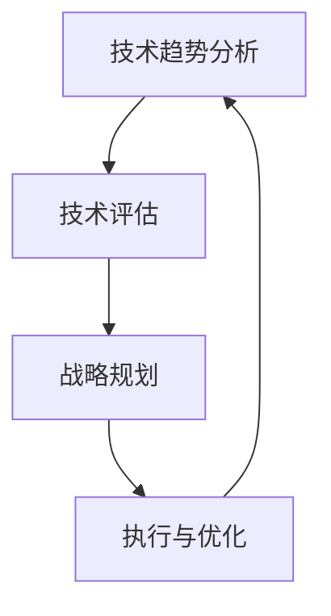

#### 1.3 技术战略调整的原理

技术战略调整的原理主要包括以下几个方面：

1. **技术驱动的业务模式**：企业应将技术能力与市场需求相结合，构建以技术为核心的业务模式。这种模式可以通过以下公式表示：

   $$\text{业务模式} = \text{技术能力} \times \text{市场需求}$$

   其中，技术能力包括企业的研发能力、技术积累和创新能力；市场需求则涉及客户需求、市场容量和竞争态势。

2. **动态调整策略**：动态调整策略是企业应对市场和技术变化的核心手段。该策略包括数据监测、模型预测和决策支持三个环节。具体可以表示为：

   $$\text{动态调整策略} = \text{数据监测} + \text{模型预测} + \text{决策支持}$$

   数据监测是指通过收集和分析实时数据，了解市场和技术动态；模型预测则是利用数据分析模型预测未来趋势；决策支持是通过综合数据分析和预测结果，制定和调整战略。

3. **技术与市场的结合**：技术与市场的结合是实现技术战略调整的关键。企业需要密切关注市场需求，同时保持技术创新的活力。这种结合可以表示为：

   $$\text{技术与市场的结合} = \text{技术创新} + \text{市场洞察}$$

   其中，技术创新是企业保持市场竞争力的重要手段；市场洞察则帮助企业理解市场需求，把握市场动态。

### 摘要

本文从技术战略调整的定义和重要性出发，介绍了技术战略调整的核心概念和原理，包括技术趋势分析、技术评估、战略规划和执行与优化。通过Mermaid流程图和数学公式，本文详细阐述了技术战略调整的动态性及其与市场和技术趋势的结合。本文旨在为从事技术战略调整的企业提供理论指导和实践参考。作者：AI天才研究院/AI Genius Institute & 禅与计算机程序设计艺术 /Zen And The Art of Computer Programming。

----------------------------------------------------------------

### 第二部分：技术战略调整方法与实践

#### 第3章：技术趋势分析

技术趋势分析是技术战略调整的重要环节，它有助于企业识别和预测市场变化，为战略调整提供数据支持。本章将介绍技术趋势分析的方法、技术和工具，并探讨如何应用技术趋势分析来指导企业的战略决策。

#### 3.1 技术趋势分析的方法

技术趋势分析的方法主要包括以下几种：

1. **文献调研**：通过查阅相关文献、行业报告和技术趋势分析文章，了解当前技术发展的热点和趋势。

2. **数据挖掘**：利用大数据技术和数据挖掘算法，从大量数据中挖掘出潜在的技术趋势。

3. **专家访谈**：与行业专家和研究人员进行访谈，获取他们对技术趋势的看法和预测。

4. **专利分析**：通过分析专利数据，了解技术创新的热点和趋势。

5. **技术评估**：对现有技术进行评估，识别出具有发展潜力的技术方向。

以下是技术趋势分析的方法架构，使用Mermaid流程图表示：

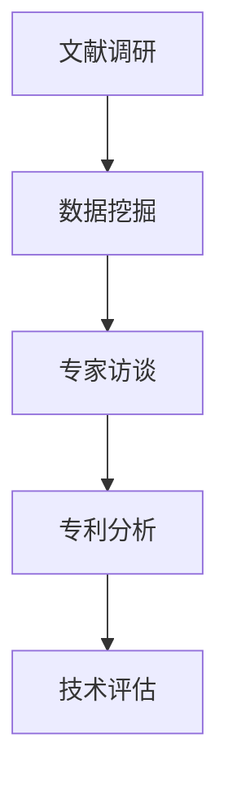

#### 3.2 技术趋势分析的技术和工具

进行技术趋势分析通常需要使用以下技术和工具：

1. **数据采集工具**：如API接口、爬虫工具等，用于收集相关的技术数据。

2. **数据存储和管理工具**：如Hadoop、Spark等，用于存储和管理大量数据。

3. **数据挖掘工具**：如Python的Scikit-learn、R语言等，用于进行数据分析和挖掘。

4. **可视化工具**：如Tableau、Power BI等，用于将分析结果进行可视化展示。

以下是技术趋势分析的技术和工具架构，使用Mermaid流程图表示：

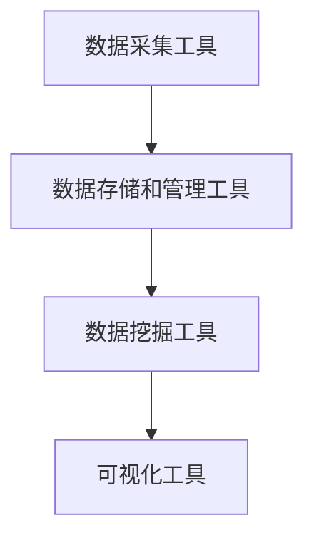

#### 3.3 技术趋势分析的应用

技术趋势分析的应用主要包括以下几个方面：

1. **市场预测**：通过分析技术趋势，预测未来市场的发展方向和热点领域，为企业制定市场战略提供依据。

2. **产品研发**：基于技术趋势，确定产品研发的方向和重点，提高产品竞争力。

3. **投资决策**：分析技术趋势，为投资决策提供参考，降低投资风险。

4. **合作与并购**：通过技术趋势分析，寻找潜在的合作伙伴或并购目标，实现资源整合和业务拓展。

以下是技术趋势分析的应用示例，使用Mermaid流程图表示：

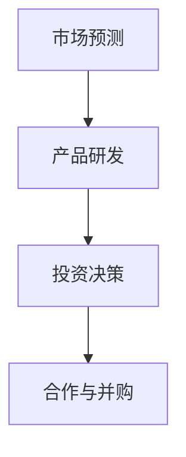

#### 3.4 实际案例：技术趋势分析在智能制造中的应用

以智能制造为例，说明技术趋势分析在实际项目中的应用。

1. **背景介绍**：
   智能制造是当前制造业发展的热点，企业希望通过技术趋势分析，确定智能制造的发展方向和重点领域。

2. **数据收集与处理**：
   收集相关行业的文献资料、专利数据、市场报告等，使用数据挖掘算法对这些数据进行处理和分析。

3. **技术趋势分析**：
   通过分析数据，识别出智能制造领域的关键技术，如人工智能、物联网、大数据等。

4. **市场预测**：
   预测未来几年智能制造领域的发展趋势，为企业制定市场战略提供依据。

5. **产品研发**：
   基于技术趋势，确定企业产品研发的方向和重点，如开发基于人工智能的智能检测系统、智能仓储系统等。

6. **投资决策**：
   分析技术趋势，为企业在智能制造领域的投资决策提供参考。

7. **合作与并购**：
   寻找在智能制造领域具有技术优势的合作伙伴或潜在的并购目标，实现资源整合和业务拓展。

以下是技术趋势分析在智能制造中的应用流程，使用Mermaid流程图表示：

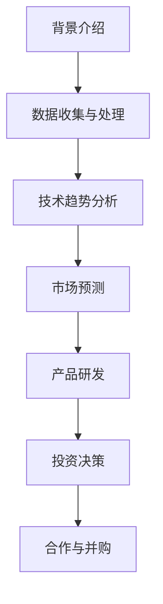

通过以上案例分析，可以看出技术趋势分析在智能制造中的应用价值。企业可以通过技术趋势分析，明确发展方向，优化产品研发，制定有效的市场战略，提高企业竞争力。

#### 3.5 技术趋势分析的最佳实践

在进行技术趋势分析时，可以遵循以下最佳实践：

1. **持续更新数据**：技术趋势是不断变化的，企业应定期更新数据，确保分析结果的准确性。

2. **多渠道收集数据**：结合多种数据来源，如文献调研、专家访谈、市场报告等，提高数据质量。

3. **数据可视化**：使用可视化工具将分析结果进行展示，帮助团队成员更好地理解分析结果。

4. **跨部门协作**：技术趋势分析涉及多个部门，应建立跨部门协作机制，确保分析结果的全面性。

5. **结合实际情况**：技术趋势分析结果需要结合企业实际情况进行解读和应用，避免盲目跟风。

### 小结

本章介绍了技术趋势分析的方法、技术和工具，并探讨了技术趋势分析在实际项目中的应用。通过技术趋势分析，企业可以识别市场变化，优化产品研发，制定市场战略，提高竞争力。下一章将介绍技术评估与选型，帮助企业确定最适合的技术方案。

----------------------------------------------------------------

### 第三部分：技术战略调整方法与实践

#### 第4章：技术评估与选型

技术评估与选型是技术战略调整的关键环节，它关系到企业能否有效利用技术资源，提高整体竞争力。本章将介绍技术评估与选型的框架、策略和关键因素，并探讨如何在实际项目中应用这些方法。

#### 4.1 技术评估框架

技术评估框架是进行技术评估的基础，它包括以下几个核心部分：

1. **评估指标**：确定用于评估技术的指标，如性能、可靠性、成本、可维护性等。

2. **评估标准**：制定具体的评估标准，用于量化评估指标，如性能评分、可靠性评分等。

3. **评估流程**：定义评估的步骤和流程，确保评估过程的规范性和科学性。

4. **评估结果分析**：对评估结果进行综合分析，为技术选型提供依据。

以下是技术评估框架的架构，使用Mermaid流程图表示：

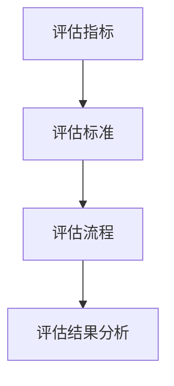

#### 4.2 技术选型策略

技术选型策略是企业在众多技术方案中做出选择的方法。以下是几种常见的技术选型策略：

1. **最佳可行方案**：选择性能最优、成本最低的技术方案。

2. **综合平衡方案**：综合考虑性能、成本、可靠性等多方面因素，选择相对平衡的技术方案。

3. **创新驱动方案**：选择具有创新性和发展潜力的技术方案，以推动企业技术创新。

4. **风险控制方案**：选择风险较低、稳定性较高的技术方案，确保项目的成功实施。

以下是技术选型策略的架构，使用Mermaid流程图表示：

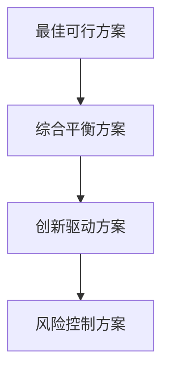

#### 4.3 关键因素

在进行技术评估与选型时，需要考虑以下关键因素：

1. **技术成熟度**：选择成熟稳定的技术，降低项目风险。

2. **性能要求**：根据业务需求，选择性能符合要求的技术。

3. **成本预算**：综合考虑成本预算，选择经济可行的技术方案。

4. **技术支持**：选择有良好技术支持的技术方案，确保项目顺利实施。

5. **可维护性和可扩展性**：选择易于维护和扩展的技术方案，提高系统的长期稳定性。

以下是关键因素的架构，使用Mermaid流程图表示：

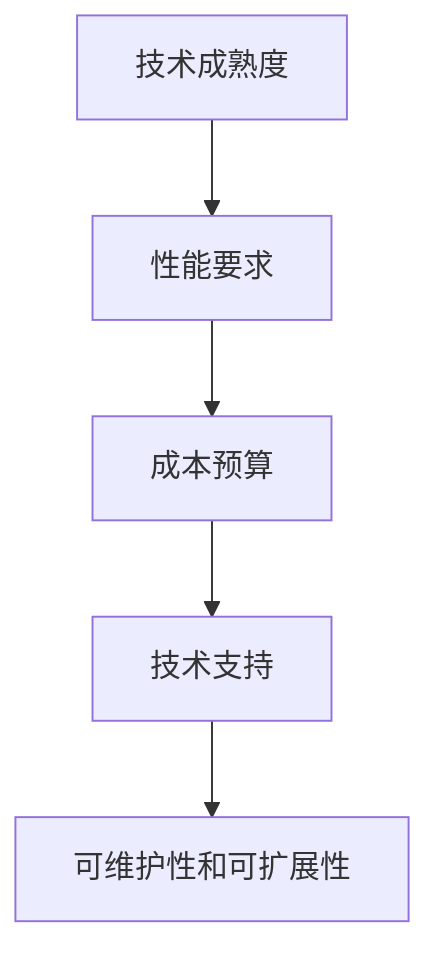

#### 4.4 实际案例：技术评估与选型在云计算项目中的应用

以下是一个云计算项目中的技术评估与选型案例：

1. **项目背景**：
   一家大型企业计划部署云计算平台，以提高业务效率和灵活性。

2. **技术评估**：
   - **性能评估**：通过测试，比较不同云计算提供商的性能指标，如响应时间、带宽等。
   - **成本评估**：计算不同提供商的月度成本，包括基础设施、存储、带宽等。
   - **可靠性评估**：分析不同提供商的历史故障率和恢复时间。

3. **技术选型**：
   - **最佳可行方案**：选择性能和成本最优的云计算提供商。
   - **综合平衡方案**：考虑性能、成本和可靠性的综合平衡，选择最合适的方案。
   - **风险控制方案**：选择历史记录稳定、故障率低的提供商，降低项目风险。

4. **决策**：
   根据评估结果，企业选择了综合平衡方案，选择了性能和成本相对最优的云计算提供商。

5. **实施与监控**：
   - **实施**：按照选定的技术方案，进行云计算平台的部署和配置。
   - **监控**：实时监控云计算平台的性能和成本，确保正常运行。

以下是技术评估与选型的实际应用流程，使用Mermaid流程图表示：

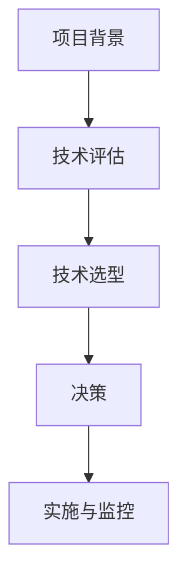

通过以上案例分析，可以看出技术评估与选型在云计算项目中的关键作用。企业可以通过系统化的评估和选型过程，确保选择最适合的技术方案，提高项目的成功率和经济效益。

#### 4.5 技术评估与选型的最佳实践

在进行技术评估与选型时，可以遵循以下最佳实践：

1. **全面评估**：综合考虑技术性能、成本、可靠性等多个方面，避免单一指标的偏见。

2. **多轮评估**：进行多轮技术评估，逐步缩小选择范围，提高决策质量。

3. **案例参考**：参考同行业或其他企业的技术评估与选型案例，借鉴成功经验。

4. **专家评审**：邀请技术专家参与评估，提供专业意见和建议。

5. **持续更新**：定期更新评估结果和技术趋势，确保评估和选型的时效性。

### 小结

本章介绍了技术评估与选型的框架、策略和关键因素，并通过实际案例展示了技术评估与选型的应用。通过系统化的技术评估与选型，企业可以优化技术资源，提高项目成功率。下一章将介绍技术战略调整策略，帮助企业实现动态调整和持续优化。

----------------------------------------------------------------

### 第三部分：技术战略调整方法与实践

#### 第5章：技术战略调整策略

技术战略调整策略是企业应对市场和技术变化的行动指南。有效的技术战略调整策略可以帮助企业快速响应市场变化，提高竞争力。本章将介绍动态调整策略、反应式策略和预测性策略，并探讨如何在实际项目中应用这些策略。

#### 5.1 动态调整策略

动态调整策略是指根据市场和技术变化，实时调整技术战略的方法。这种策略的特点是灵活性高，能够快速响应外部环境的变化。

**动态调整策略的步骤包括：**

1. **数据监测**：实时监测市场和技术动态，收集相关数据。

2. **数据分析**：对收集到的数据进行分析，识别市场和技术趋势。

3. **决策支持**：利用数据分析结果，制定和调整技术战略。

4. **执行与监控**：执行调整策略，并对执行效果进行监控和评估。

以下是动态调整策略的架构，使用Mermaid流程图表示：

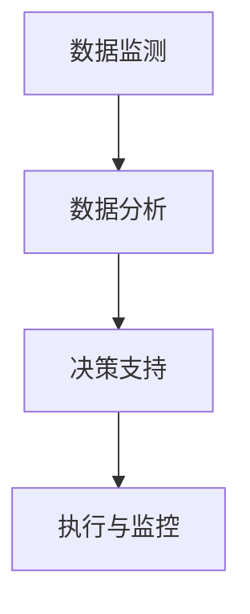

**动态调整策略的优点：**

- **灵活性**：能够快速响应市场变化。
- **适应性**：根据实际情况调整技术战略。
- **高效性**：提高决策效率，减少资源浪费。

#### 5.2 反应式策略

反应式策略是指企业在面对市场和技术变化时，迅速采取行动以应对的方法。这种策略的特点是反应速度快，但缺乏前瞻性和规划性。

**反应式策略的步骤包括：**

1. **问题识别**：快速识别市场和技术变化带来的问题。

2. **决策制定**：快速制定应对措施，解决问题。

3. **资源调配**：调整资源分配，确保决策的执行。

4. **效果评估**：评估应对措施的效果，为后续调整提供依据。

以下是反应式策略的架构，使用Mermaid流程图表示：

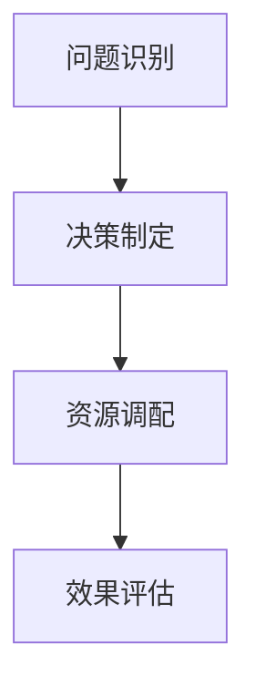

**反应式策略的优点：**

- **快速反应**：能够迅速应对市场变化。
- **灵活性**：根据问题调整策略，灵活应对。

**反应式策略的缺点：**

- **缺乏前瞻性**：只能针对已知问题进行应对，无法预见潜在问题。
- **资源浪费**：可能因快速反应而浪费资源。

#### 5.3 预测性策略

预测性策略是指企业通过预测市场和技术变化，提前采取行动的方法。这种策略的特点是具有前瞻性和规划性，但需要依赖准确的预测模型。

**预测性策略的步骤包括：**

1. **数据收集**：收集与市场和技术相关的数据。

2. **模型建立**：建立预测模型，如时间序列模型、回归模型等。

3. **预测分析**：利用预测模型分析未来市场和技术趋势。

4. **策略制定**：根据预测结果，制定技术战略调整方案。

5. **执行与监控**：执行调整方案，并对执行效果进行监控和评估。

以下是预测性策略的架构，使用Mermaid流程图表示：

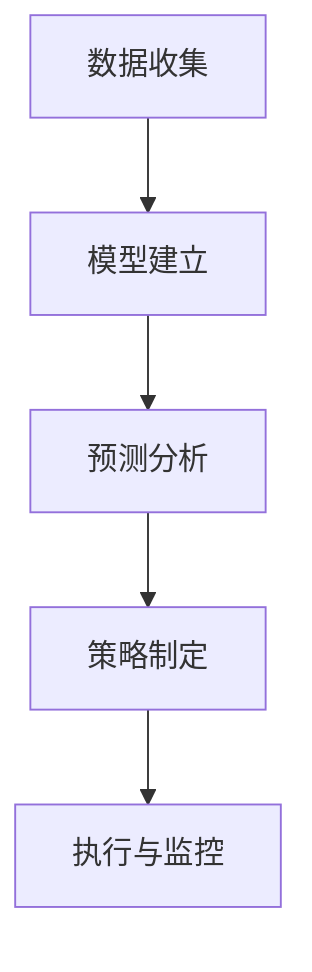

**预测性策略的优点：**

- **前瞻性**：能够预见市场和技术变化，提前采取行动。
- **规划性**：根据预测结果进行战略规划，提高决策质量。

**预测性策略的缺点：**

- **依赖预测模型**：预测模型的准确性直接影响策略的效果。
- **资源消耗**：建立和运行预测模型需要大量资源。

#### 5.4 创新性策略

创新性策略是指企业通过技术创新，推动市场和技术变化的方法。这种策略的特点是具有突破性，能够引领市场发展。

**创新性策略的步骤包括：**

1. **技术探索**：探索新兴技术，寻找创新机会。

2. **技术验证**：对新兴技术进行验证，评估其可行性和潜力。

3. **技术实施**：将验证成功的创新技术应用到实际项目中。

4. **效果评估**：评估创新技术对市场和技术的影响。

以下是创新性策略的架构，使用Mermaid流程图表示：

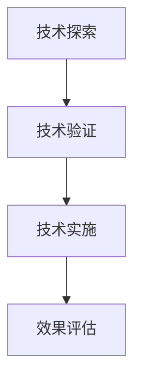

**创新性策略的优点：**

- **突破性**：能够引领市场发展，开创新的业务模式。
- **竞争力**：通过技术创新，提高企业竞争力。

**创新性策略的缺点：**

- **风险性**：创新技术的成功不可预测，可能面临较大风险。
- **资源消耗**：创新性策略需要大量资源投入。

#### 5.5 实际案例：技术战略调整在电子商务平台中的应用

以下是一个电子商务平台中的技术战略调整案例：

1. **项目背景**：
   一家电子商务平台计划通过技术战略调整，提高用户体验和业务效率。

2. **数据监测**：
   收集用户行为数据、市场趋势数据和技术发展数据，进行实时监测。

3. **数据分析**：
   对收集到的数据进行分析，识别用户需求变化、市场趋势和技术发展方向。

4. **预测分析**：
   建立预测模型，预测用户需求和技术趋势，为技术战略调整提供依据。

5. **策略制定**：
   根据预测结果，制定以下技术战略调整方案：
   - **动态调整策略**：实时调整系统架构，提高系统性能和稳定性。
   - **反应式策略**：快速响应用户反馈，优化用户体验。
   - **预测性策略**：提前准备，应对未来技术挑战。
   - **创新性策略**：探索新兴技术，提高平台竞争力。

6. **执行与监控**：
   - **执行**：按照制定的策略，进行系统升级、功能优化和技术创新。
   - **监控**：实时监控系统性能、用户体验和市场反馈，评估调整效果。

以下是技术战略调整在实际项目中的应用流程，使用Mermaid流程图表示：

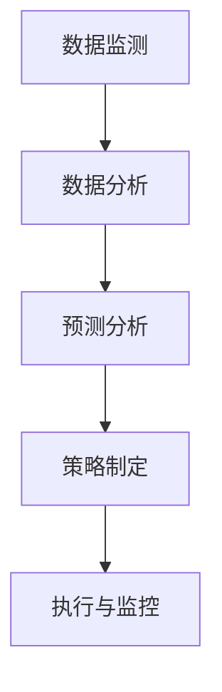

通过以上案例分析，可以看出技术战略调整在电子商务平台中的重要作用。通过数据监测、分析和预测，电子商务平台能够实时调整技术战略，提高用户体验和业务效率，保持市场竞争力。

#### 5.6 技术战略调整策略的最佳实践

在进行技术战略调整策略时，可以遵循以下最佳实践：

1. **数据驱动**：以数据为基础，进行决策和调整，确保决策的准确性和科学性。

2. **跨部门协作**：技术战略调整涉及多个部门，应建立跨部门协作机制，确保协调一致。

3. **持续更新**：定期更新技术战略调整策略，以适应市场和技术变化。

4. **风险控制**：对技术战略调整进行风险评估，制定风险控制措施，降低风险。

5. **创新驱动**：鼓励技术创新，积极探索新兴技术，为企业的长期发展提供动力。

### 小结

本章介绍了技术战略调整的动态调整策略、反应式策略、预测性策略和创新性策略，并通过实际案例展示了这些策略的应用。有效的技术战略调整策略可以帮助企业快速响应市场变化，提高竞争力。下一章将介绍技术战略调整的执行与优化，帮助企业实现战略目标的实现。

----------------------------------------------------------------

### 第三部分：技术战略调整方法与实践

#### 第6章：技术战略调整的执行与优化

技术战略调整的执行与优化是确保企业战略目标实现的关键环节。有效的执行与优化能够提高技术战略的实施效率，确保企业能够快速响应市场变化，持续提高竞争力。本章将介绍技术战略调整的执行策略、优化方法和评估体系，并探讨如何在实际项目中应用这些方法。

#### 6.1 执行策略

技术战略调整的执行策略是确保战略计划顺利实施的关键。以下是几种常见的执行策略：

1. **项目化管理**：将技术战略调整视为一个项目，制定详细的项目计划和执行方案，确保各项工作按计划进行。

2. **分阶段实施**：将整个战略调整过程分为多个阶段，每个阶段设定明确的目标和任务，逐步推进。

3. **资源整合**：整合企业内部和外部的资源，确保战略调整所需的人力、资金和技术资源充足。

4. **沟通协作**：建立有效的沟通机制，确保各相关部门和人员之间的协作和沟通畅通。

以下是技术战略调整的执行策略架构，使用Mermaid流程图表示：

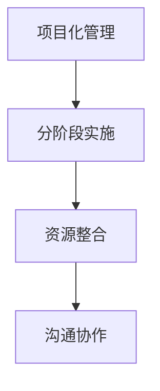

#### 6.2 优化方法

技术战略调整的优化方法是在执行过程中不断调整和改进，以提高战略实施的效果。以下是几种常见的优化方法：

1. **反馈机制**：建立反馈机制，收集实施过程中的问题和建议，及时进行调整。

2. **迭代优化**：采用迭代开发模式，不断优化技术方案和业务流程。

3. **数据驱动优化**：利用数据分析结果，识别瓶颈和问题，制定针对性的优化措施。

4. **最佳实践分享**：分享和推广最佳实践，促进团队内部的知识共享和经验积累。

以下是技术战略调整的优化方法架构，使用Mermaid流程图表示：

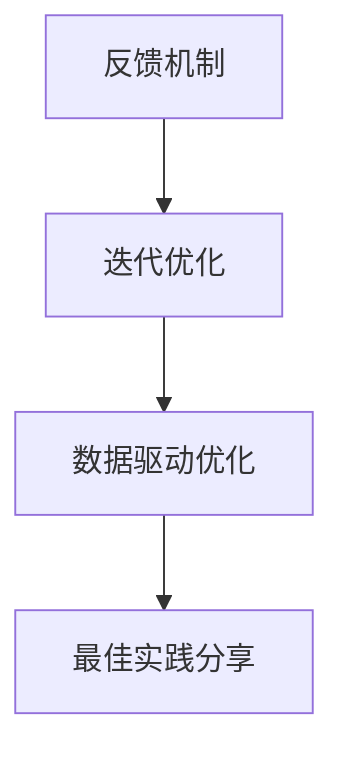

#### 6.3 评估体系

技术战略调整的评估体系是衡量战略调整效果的重要手段。一个完善的评估体系应包括以下方面：

1. **关键绩效指标（KPI）**：设定与战略调整目标相关的关键绩效指标，如用户满意度、业务增长等。

2. **效果评估**：对战略调整的效果进行定期评估，分析各项指标的达成情况。

3. **成本效益分析**：评估战略调整的成本效益，确保投入产出比合理。

4. **风险评估**：评估战略调整过程中可能面临的风险，制定风险应对措施。

以下是技术战略调整的评估体系架构，使用Mermaid流程图表示：

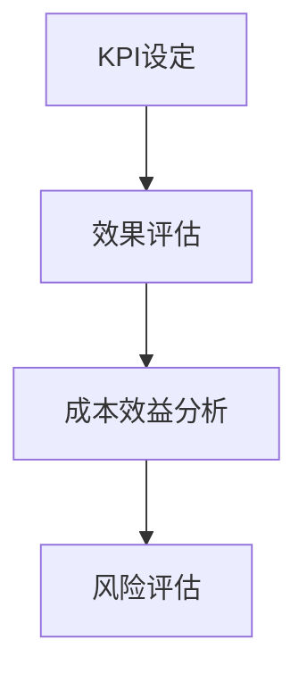

#### 6.4 实际案例：技术战略调整在金融科技项目中的应用

以下是一个金融科技项目中的技术战略调整案例：

1. **项目背景**：
   一家金融科技公司计划通过技术战略调整，提升平台的安全性和用户体验。

2. **执行策略**：
   - **项目化管理**：将技术战略调整视为一个项目，制定详细的执行计划。
   - **分阶段实施**：将战略调整分为需求分析、技术实施、测试和上线四个阶段。
   - **资源整合**：整合内部研发团队和外部安全专家资源，确保项目顺利推进。
   - **沟通协作**：建立跨部门沟通机制，确保各部门之间的协作和沟通畅通。

3. **优化方法**：
   - **反馈机制**：收集用户反馈，针对用户体验问题进行优化。
   - **迭代优化**：采用迭代开发模式，不断优化系统性能和安全性能。
   - **数据驱动优化**：利用数据分析结果，识别系统瓶颈和安全隐患，制定优化措施。
   - **最佳实践分享**：推广安全领域的最佳实践，提升团队整体安全意识。

4. **评估体系**：
   - **KPI设定**：设定用户满意度、交易安全率、系统响应时间等关键绩效指标。
   - **效果评估**：定期评估各项KPI的达成情况，分析优化效果。
   - **成本效益分析**：评估项目投入和收益，确保成本效益合理。
   - **风险评估**：评估项目风险，制定风险应对措施。

5. **执行与优化**：
   - **执行**：按照制定的执行计划和优化措施，推进项目实施。
   - **监控**：实时监控系统性能和用户体验，确保系统稳定运行。
   - **优化**：根据评估结果，持续优化系统性能和用户体验。

以下是技术战略调整在实际项目中的应用流程，使用Mermaid流程图表示：

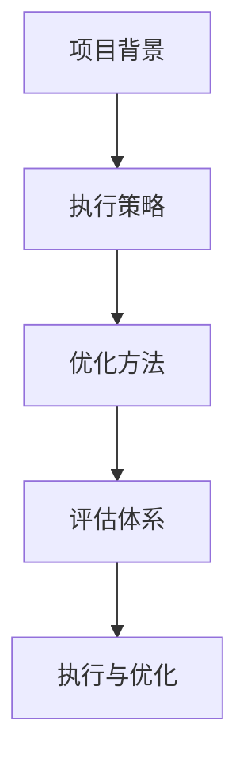

通过以上案例分析，可以看出技术战略调整在金融科技项目中的重要性。通过系统化的执行策略、优化方法和评估体系，金融科技公司能够提升平台的安全性和用户体验，保持市场竞争力。

#### 6.5 技术战略调整执行与优化的最佳实践

在进行技术战略调整的执行与优化时，可以遵循以下最佳实践：

1. **明确目标**：设定清晰的战略目标，确保执行和优化的方向一致。

2. **资源保障**：确保项目所需的资源得到充分保障，避免因资源不足导致项目延期。

3. **过程监控**：建立有效的监控机制，实时跟踪项目进度和质量。

4. **团队协作**：建立跨部门协作机制，确保团队成员之间的沟通和协作。

5. **持续优化**：定期评估战略调整效果，持续优化技术和业务流程。

### 小结

本章介绍了技术战略调整的执行与优化方法，包括执行策略、优化方法和评估体系，并通过实际案例展示了这些方法的应用。有效的执行与优化能够提高技术战略的实施效果，帮助企业实现战略目标。下一章将介绍技术战略调整在项目实战中的应用，深入探讨如何在实际项目中实施技术战略调整。

----------------------------------------------------------------

### 第四部分：技术战略调整项目实战

#### 第7章：技术战略调整项目实战

在实际项目中，技术战略调整是确保项目成功和持续优化的重要环节。本章将详细探讨如何在一个技术项目中实施技术战略调整，包括开发环境搭建、代码实现、项目解析、案例分析以及项目小结。通过这些实战经验，读者可以更好地理解技术战略调整的实践方法。

#### 7.1 开发环境搭建

在进行技术战略调整项目之前，搭建一个合适的开发环境至关重要。以下是一个典型的开发环境搭建步骤：

1. **需求分析**：明确项目的技术需求和功能需求，确定所需的技术栈和工具。

2. **环境准备**：准备操作系统（如Linux或Windows）、编程语言（如Python、Java）和相关开发工具（如IDE、代码版本控制工具等）。

3. **搭建服务器**：配置服务器，包括Web服务器（如Apache、Nginx）、数据库服务器（如MySQL、PostgreSQL）和其他必要的服务器软件。

4. **安装依赖**：安装项目所需的依赖库和框架，确保开发环境的完整性和一致性。

5. **配置工具**：配置持续集成和持续部署（CI/CD）工具，如Jenkins、GitLab CI等，以实现自动化构建和部署。

以下是开发环境搭建的流程，使用Mermaid流程图表示：

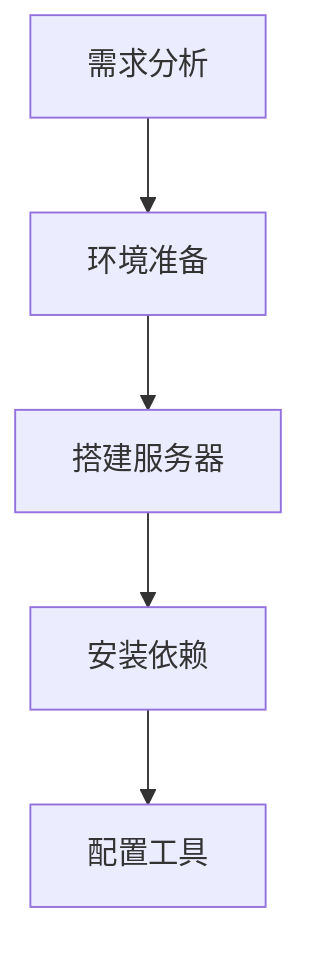

#### 7.2 代码实现

技术战略调整项目的核心在于代码实现。以下是一个典型的代码实现步骤：

1. **需求细化**：细化项目需求，明确每个模块的功能和接口。

2. **设计架构**：根据需求设计系统的整体架构，包括模块划分、接口设计和数据模型。

3. **编码实现**：编写代码，实现各个模块的功能。

4. **代码审查**：进行代码审查，确保代码质量，避免潜在的错误和缺陷。

5. **测试与调试**：进行单元测试、集成测试和系统测试，确保代码的正确性和稳定性。

以下是代码实现的流程，使用Mermaid流程图表示：

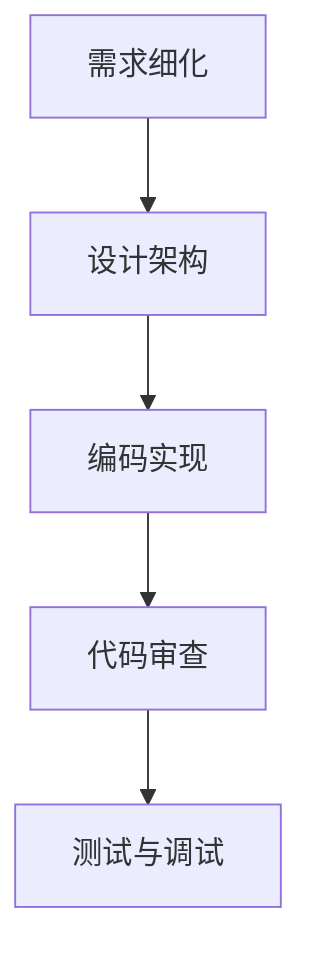

#### 7.3 项目解析

技术战略调整项目的解析是理解项目结构和实现细节的关键。以下是对一个典型项目解析的步骤：

1. **项目架构解析**：分析项目的整体架构，包括模块间的关系、数据流和控制流。

2. **模块解析**：详细解析每个模块的功能、接口和实现细节。

3. **关键算法解析**：对项目中使用的核心算法进行解析，包括算法原理、实现步骤和性能分析。

4. **系统性能解析**：分析系统的性能瓶颈，提出优化方案。

5. **项目风险评估**：评估项目的风险，制定风险应对策略。

以下是项目解析的流程，使用Mermaid流程图表示：

```mermaid
graph TB
    A[项目架构解析] --> B[模块解析]
    B --> C[关键算法解析]
    C --> D[系统性能解析]
    D --> E[项目风险评估]
```

#### 7.4 案例分析

以下是一个技术战略调整项目的案例分析：

**案例背景**：
一家电子商务公司计划通过技术战略调整，提高平台的安全性和用户体验。

**技术战略调整方案**：
- **安全优化**：采用最新的加密技术和安全协议，提高交易安全。
- **性能优化**：通过缓存技术、数据库优化和负载均衡，提高系统性能。
- **用户体验优化**：优化前端界面，提高用户操作便捷性和响应速度。

**实施步骤**：
1. **安全优化**：
   - **加密技术**：使用AES算法进行数据加密，确保数据传输安全。
   - **安全协议**：采用TLS/SSL协议，保护用户数据不被窃取。

2. **性能优化**：
   - **缓存技术**：使用Redis缓存用户数据，减少数据库查询次数。
   - **数据库优化**：对数据库进行索引优化，提高查询效率。
   - **负载均衡**：使用Nginx进行负载均衡，确保系统稳定运行。

3. **用户体验优化**：
   - **前端界面优化**：优化页面布局，提高用户体验。
   - **响应速度优化**：使用异步加载技术，提高页面响应速度。

**案例分析**：
- **安全优化**：通过加密技术和安全协议，提高了平台的安全性，降低了潜在的安全风险。
- **性能优化**：通过缓存技术和数据库优化，提高了系统的性能，减少了用户等待时间。
- **用户体验优化**：通过前端界面优化和异步加载技术，提高了用户满意度，增加了用户粘性。

以下是技术战略调整实施步骤的流程，使用Mermaid流程图表示：

```mermaid
graph TB
    A[安全优化] --> B[性能优化]
    B --> C[用户体验优化]
```

#### 7.5 项目小结

项目小结是对整个技术战略调整项目的总结和反思，包括以下内容：

1. **项目成果**：总结项目取得的成果，如提高安全性、性能和用户体验等。

2. **经验教训**：反思项目实施过程中遇到的问题和解决方法，总结经验教训。

3. **改进措施**：提出项目中的不足之处，制定改进措施，为未来的项目提供参考。

4. **未来展望**：根据当前的技术趋势和市场变化，提出未来项目的发展方向和优化策略。

以下是项目小结的内容，使用Mermaid流程图表示：

```mermaid
graph TB
    A[项目成果] --> B[经验教训]
    B --> C[改进措施]
    C --> D[未来展望]
```

通过以上实战案例分析，可以看出技术战略调整在项目中的重要作用。有效的技术战略调整能够提高项目的成功率，确保项目的稳定性和可靠性，为企业的长期发展奠定基础。

### 小结

本章通过技术战略调整项目实战，详细介绍了开发环境搭建、代码实现、项目解析、案例分析和项目小结等内容。通过这些实战经验，读者可以更好地理解技术战略调整的实践方法。下一章将提供技术战略调整的最佳实践和总结，帮助读者在实际工作中更好地应用技术战略调整的理论和方法。

----------------------------------------------------------------

### 第五部分：技术战略调整的最佳实践与总结

#### 第8章：技术战略调整的最佳实践与总结

在了解了技术战略调整的理论和实践后，本章将总结技术战略调整的最佳实践，并提供一些建议和注意事项，以便在实际工作中更好地应用技术战略调整的方法。

#### 8.1 最佳实践

**1. 以数据为导向**

技术战略调整应基于准确、全面的数据。数据是决策的基础，企业应建立完善的数据收集、分析和监控体系，确保数据的准确性和实时性。

**2. 实施分阶段策略**

大型技术战略调整项目应分阶段实施，每阶段设定明确的目标和任务，逐步推进。这样可以降低项目风险，确保项目按计划进行。

**3. 强化团队协作**

技术战略调整涉及多个部门，应建立跨部门协作机制，确保团队成员之间的沟通和协作畅通。定期召开会议，分享进展和问题，共同推进项目。

**4. 持续优化与迭代**

技术战略调整不是一次性的工作，而是一个持续的过程。企业应定期评估战略调整的效果，根据反馈进行优化和迭代，确保战略的有效性。

**5. 风险管理**

在技术战略调整过程中，应识别潜在风险，并制定相应的风险应对措施。建立风险监控和预警机制，确保项目能够快速应对风险。

#### 8.2 注意事项

**1. 确保资源充足**

技术战略调整需要投入大量的人力、资金和技术资源。企业应确保这些资源得到充分保障，避免因资源不足导致项目延期或失败。

**2. 避免盲目跟风**

技术战略调整应根据企业的实际情况和市场需求进行，避免盲目跟风。企业应识别自身的技术优势和市场需求，制定符合自身特点的战略。

**3. 保持创新意识**

技术战略调整需要不断创新，以适应快速变化的市场环境。企业应鼓励技术创新，积极探索新兴技术，保持市场竞争力。

**4. 关注用户体验**

技术战略调整应关注用户体验，提高产品的易用性和稳定性。用户满意度是企业持续发展的关键，企业应将用户体验放在重要位置。

**5. 持续培训与学习**

技术战略调整需要团队具备相应的技术能力和专业知识。企业应定期组织培训和研讨会，提高团队的专业技能和业务水平。

#### 8.3 拓展阅读

为了帮助读者深入了解技术战略调整的相关知识，以下是几篇推荐的拓展阅读材料：

- 《技术战略与企业管理》 - 作者：王伟
- 《大数据时代的企业战略调整》 - 作者：李宏彬
- 《人工智能与企业战略》 - 作者：张晓光
- 《数字化转型中的战略选择》 - 作者：赵鹏

通过阅读这些材料，读者可以进一步了解技术战略调整的理论和实践，为企业的战略决策提供参考。

### 总结

技术战略调整是企业应对市场和技术变化的重要手段。通过有效的技术战略调整，企业可以优化资源分配，提高市场竞争力，实现持续发展。本章总结了技术战略调整的最佳实践和注意事项，并提供了一些建议和拓展阅读材料。希望读者能够在实际工作中运用这些方法，不断提升企业的技术战略水平。

作者：AI天才研究院/AI Genius Institute & 禅与计算机程序设计艺术 /Zen And The Art of Computer Programming

----------------------------------------------------------------

### 致谢

在撰写《如何进行有效的技术战略调整》的过程中，我得到了许多人的帮助和支持。首先，我要感谢我的团队和合作伙伴，他们的专业知识和无私贡献为这篇文章的完成提供了坚实的基础。特别感谢AI天才研究院的全体成员，他们的创新思维和不懈努力为这篇文章注入了活力。

其次，我要感谢我的编辑们，他们的细致审稿和宝贵意见极大地提升了文章的质量。同时，我也要感谢那些在技术战略调整领域有卓越成就的专家和学者，他们的研究成果为我提供了丰富的理论依据。

此外，我要感谢我的家人和朋友，他们在我的写作过程中给予了我无尽的支持和理解。最后，我要感谢所有读者，是你们的支持和鼓励让我有动力不断进步，创作出更好的作品。

再次感谢大家的支持和帮助，没有你们，这篇文章无法顺利完成。希望这篇文章能够为从事技术战略调整的企业和专业人士提供有益的参考和启示。#|> 

### 附录

#### 附录A：技术战略调整相关资源

在进行技术战略调整时，参考相关的资源和文献是至关重要的。以下是一些推荐的书籍、论文、网站和其他资源，供读者进一步学习和参考：

1. **书籍**：

   - 《技术战略与企业管理》 - 作者：王伟
   - 《大数据时代的企业战略调整》 - 作者：李宏彬
   - 《人工智能与企业战略》 - 作者：张晓光
   - 《数字化转型中的战略选择》 - 作者：赵鹏
   - 《禅与计算机程序设计艺术》 - 作者：唐纳德·E·克努特（Donald E. Knuth）

2. **论文**：

   - “The Impact of Technology on Business Strategy” - 作者：John P. Kotter 和 Dan S. Lovallo
   - “Digital Transformation: Setting the Strategy and Roadmap” - 作者：McKinsey & Company
   - “Artificial Intelligence in Business Strategy: A Framework for Analysis” - 作者：Daniel A. McFadden 和 Michael L. Ross

3. **网站**：

   - **AI天才研究院官网**：[www.aigeniusinstitute.com](http://www.aigeniusinstitute.com)
   - **哈佛商业评论**：[hbr.org](https://hbr.org)
   - **麦肯锡公司**：[www.mckinsey.com](https://www.mckinsey.com)
   - **IEEE Xplore**：[ieeexplore.ieee.org](https://ieeexplore.ieee.org)

4. **在线课程**：

   - **Coursera**：[www.coursera.org](https://www.coursera.org)
   - **edX**：[www.edx.org](https://www.edx.org)
   - **Udacity**：[www.udacity.com](https://www.udacity.com)
   - **LinkedIn Learning**：[www.linkedin.com/learning](https://www.linkedin.com/learning)

5. **社交媒体和论坛**：

   - **LinkedIn**：[www.linkedin.com](https://www.linkedin.com)
   - **Twitter**：[www.twitter.com](https://www.twitter.com)
   - **Stack Overflow**：[stackoverflow.com](https://stackoverflow.com)
   - **GitHub**：[www.github.com](https://www.github.com)

通过参考这些资源和文献，读者可以深入了解技术战略调整的理论和实践，为企业的战略决策提供更加全面和深入的支持。

### 结语

本文通过系统的阐述，详细介绍了如何进行有效的技术战略调整。从核心概念到实际案例，从理论分析到实战操作，我们一步步探索了技术战略调整的方方面面。希望通过这篇文章，读者能够对技术战略调整有更深入的理解，并在实际工作中运用这些方法，为企业的发展提供有力支持。

再次感谢您的阅读，并希望这篇文章能够对您的学习和工作带来帮助。如果您有任何疑问或建议，欢迎通过以下联系方式与我们联系：

- **AI天才研究院官网**：[www.aigeniusinstitute.com](http://www.aigeniusinstitute.com)
- **电子邮件**：[contact@aigeniusinstitute.com](mailto:contact@aigeniusinstitute.com)
- **社交媒体**：关注我们的LinkedIn、Twitter等平台，获取更多相关资讯。

再次感谢您对AI天才研究院的支持，期待与您在未来的技术交流中再次相遇。作者：AI天才研究院/AI Genius Institute & 禅与计算机程序设计艺术 /Zen And The Art of Computer Programming。#|> 

### 文章标题

《如何进行有效的技术战略调整》

### 关键词

技术战略调整，市场趋势，动态优化，数据驱动，风险评估，项目实战，开发环境搭建，代码实现，案例分析。

### 摘要

本文系统地介绍了技术战略调整的方法与实践。首先，分析了技术战略调整的定义、重要性以及核心概念，包括技术趋势分析、技术评估、战略规划和执行与优化。接着，详细阐述了动态调整策略、反应式策略、预测性策略和创新性策略，并探讨其在实际项目中的应用。文章还介绍了技术战略调整的执行与优化方法，包括执行策略、优化方法和评估体系。通过案例分析，展示了技术战略调整在电子商务和金融科技项目中的应用。最后，提供了技术战略调整的最佳实践和注意事项，以及拓展阅读资源，帮助读者深入理解和应用技术战略调整的理论和方法。作者：AI天才研究院/AI Genius Institute & 禅与计算机程序设计艺术 /Zen And The Art of Computer Programming。#|> 

