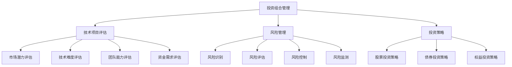
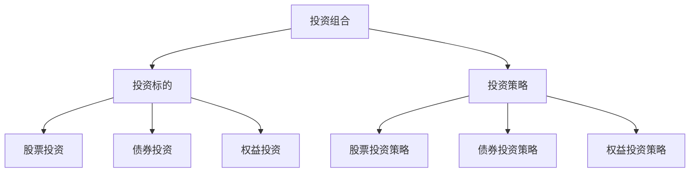

                 


### 引言

#### 背景介绍

在当今的数字经济时代，技术投资已成为推动企业成长和竞争的关键因素。随着科技行业的飞速发展，企业面临着前所未有的机遇与挑战。如何有效地进行技术投资组合管理，成为了企业决策者和技术投资者亟待解决的重要问题。

技术投资组合管理不仅仅是简单的资金配置，它涉及对技术项目、团队、市场和风险的全面评估。有效的技术投资组合管理能够帮助企业优化资源配置，降低投资风险，提高投资回报率。

#### 核心概念与联系

**投资组合管理**是指对多个投资项目进行统一管理和优化，以实现整体投资目标。在技术投资领域，投资组合管理的关键在于**技术项目的评估**、**风险管理**和**投资策略**。

- **技术项目的评估**：涉及对技术项目的市场潜力、技术难度、团队能力和资金需求的评估。
- **风险管理**：包括识别、评估、控制和监测技术投资过程中可能面临的风险。
- **投资策略**：根据企业的战略目标和市场环境，制定相应的投资策略，以实现投资回报最大化。

为了更好地理解这些核心概念之间的关系，我们可以使用Mermaid流程图进行展示：



#### 文章摘要

本文将深入探讨如何进行有效的技术投资组合管理。首先，我们将介绍技术投资组合管理的背景和重要性。接着，我们将详细阐述投资组合管理的核心概念，包括投资组合、投资标的和投资策略。随后，我们将讨论技术投资组合的评估和组合方法，以及技术投资的风险管理策略。文章还将介绍一些技术投资策略和实战案例，并探讨投资组合优化的方法和技术。最后，我们将总结文章的主要观点，并对未来投资组合管理的趋势和挑战进行展望。

### 投资组合管理的核心概念

在进行技术投资组合管理时，理解投资组合、投资标的和投资策略等核心概念至关重要。这些概念相互关联，共同构成了投资组合管理的理论基础。

#### 投资组合

**投资组合**是指企业或投资者持有的各种投资项目的集合。通过将资金分配到不同的项目中，投资者可以分散风险，提高整体投资回报率。投资组合可以是多样化的，包括股票、债券、房地产、科技项目等多种投资形式。

- **投资组合的目标**：优化资源配置，提高投资回报率，降低投资风险。
- **投资组合的种类**：根据投资策略和风险偏好，可以分为保守型、稳健型和激进型投资组合。

#### 投资标的

**投资标的**是指投资者选择的投资项目或资产。在技术投资中，投资标的可以是初创公司、成熟企业、研发项目或技术平台等。

- **投资标的的选择**：需要考虑市场潜力、技术成熟度、团队能力、资金需求等因素。
- **投资标的的风险**：不同类型的投资标的风险差异较大，需要投资者进行风险评估和风险控制。

#### 投资策略

**投资策略**是指投资者在投资组合管理过程中所采取的具体方法和措施。投资策略的制定取决于企业的战略目标、市场环境和个人风险偏好。

- **投资策略的类型**：包括股票投资策略、债券投资策略和权益投资策略等。
  - **股票投资策略**：根据市场趋势和公司基本面进行投资。
  - **债券投资策略**：根据债券的信用评级和市场利率进行投资。
  - **权益投资策略**：通过股权投资获取长期收益。

为了更好地理解这些核心概念之间的关系，我们可以使用Mermaid流程图进行展示：



#### 总结

投资组合管理是一个复杂的过程，需要投资者对投资组合、投资标的和投资策略有深刻的理解。通过合理配置投资组合，选择合适的投资标的，并制定有效的投资策略，投资者可以降低风险，提高投资回报率。

### 技术投资组合的评估与组合

#### 技术投资组合评估

技术投资组合评估是投资组合管理的关键步骤，它涉及到对技术项目的全面评估，以确定其投资价值和潜在风险。以下是技术投资组合评估的几个核心方面：

##### 市场潜力评估

市场潜力评估是判断技术项目是否具有广阔市场前景的关键。这需要考虑以下几个方面：

1. **市场规模**：分析目标市场的规模和增长潜力。
2. **市场趋势**：关注行业趋势和技术发展的动态。
3. **竞争情况**：评估竞争对手的数量、市场份额和竞争策略。

市场潜力评估通常使用以下指标：

- **市场份额**：企业或项目在市场上的占有率。
- **增长率**：市场或项目的年均增长率。
- **渗透率**：技术或产品在市场中的普及程度。

##### 技术难度评估

技术难度评估涉及对技术项目的复杂程度、所需技术和研发周期等方面的分析。以下是几个关键指标：

1. **技术复杂度**：评估技术项目的复杂性和难度。
2. **研发周期**：估计项目从研发到市场推出的时间。
3. **技术壁垒**：分析项目在技术上的壁垒和专利保护。

技术难度评估通常使用以下方法：

- **专家评审**：邀请行业专家对项目的技术难度进行评估。
- **对标分析**：与类似项目进行对比，评估项目的技术难度。

##### 团队能力评估

团队能力评估是对项目团队的专业能力、经验、协作能力和项目管理能力的评估。以下是几个关键指标：

1. **团队规模**：评估团队的人数和专业分布。
2. **专业经验**：评估团队成员的专业背景和行业经验。
3. **项目管理能力**：评估团队的项目管理能力和执行能力。

团队能力评估通常使用以下方法：

- **人才评估**：通过面试、工作经历和专业资质评估团队成员的能力。
- **绩效评估**：通过项目成果和团队绩效评估团队的能力。

##### 资金需求评估

资金需求评估是对项目所需资金总额、资金使用计划和资金回报的评估。以下是几个关键指标：

1. **总资金需求**：评估项目从启动到市场推出的总资金需求。
2. **资金使用计划**：分析资金在不同阶段的使用情况。
3. **资金回报**：评估项目的投资回报率和资金回收期。

资金需求评估通常使用以下方法：

- **财务模型**：建立项目的财务模型，预测项目的资金需求和回报。
- **敏感性分析**：分析不同资金需求和回报情况下的项目风险。

#### 技术投资组合组合

在完成技术投资组合评估后，投资者需要根据评估结果进行投资组合的组合。投资组合组合的目标是优化资源配置，降低投资风险，提高投资回报率。以下是几个关键步骤：

##### 组合原则

投资组合组合需要遵循以下原则：

1. **风险分散**：通过投资不同行业、不同阶段和不同风险类型的项目，分散投资风险。
2. **收益平衡**：平衡不同项目的收益和风险，实现整体投资组合的收益最大化。
3. **灵活性**：确保投资组合能够适应市场变化，进行灵活调整。

##### 组合策略

投资组合组合可以采用以下几种策略：

1. **平衡策略**：将资金均匀分配到多个项目中，实现风险和收益的平衡。
2. **分散策略**：将资金分配到多个行业、多个阶段和多个风险类型的项目中，降低投资风险。
3. **集中策略**：将资金集中在具有较高市场潜力和技术难度的项目中，追求高收益。

##### 组合优化

投资组合组合后，需要定期进行优化，以适应市场变化和投资目标。优化方法包括：

1. **定期评估**：定期评估投资项目的表现，根据评估结果进行调整。
2. **动态调整**：根据市场变化和投资目标，动态调整投资组合的配置。
3. **风险控制**：通过风险控制措施，降低投资组合的风险。

#### 总结

技术投资组合的评估与组合是投资组合管理的重要环节。通过全面评估技术项目，投资者可以更好地理解投资机会和风险，制定合理的投资策略。投资组合组合的原则、策略和优化方法，有助于投资者实现投资组合的优化，提高整体投资回报率。

### 技术投资风险管理

#### 技术投资风险概述

在技术投资过程中，风险管理是确保投资成功的关键环节。技术投资风险主要包括以下几个方面：

1. **市场风险**：由于市场变化导致的技术项目收益波动。
2. **技术风险**：由于技术本身的不确定性导致的风险。
3. **操作风险**：由于项目管理和运营不善导致的风险。
4. **财务风险**：由于资金不足或资金使用不当导致的风险。

#### 风险管理策略

为了有效管理技术投资风险，投资者可以采取以下策略：

1. **风险识别**：识别投资过程中可能出现的各种风险。
2. **风险评估**：对识别出的风险进行评估，确定其可能性和影响程度。
3. **风险控制**：采取相应措施，降低风险的可能性和影响程度。
4. **风险监测**：持续监测投资项目的风险状况，及时进行调整。

#### 风险控制工具

在技术投资风险管理中，以下工具和方法可以帮助投资者有效控制风险：

1. **风险管理框架**：建立风险管理框架，明确风险管理的目标和流程。
2. **风险控制指标**：设定关键风险控制指标，用于监测和管理风险。
3. **风险分散**：通过投资多个项目，分散单一项目的风险。
4. **保险**：购买保险，为投资项目提供风险保障。
5. **应急预案**：制定应急预案，以应对可能发生的风险事件。

#### 实例分析

假设投资者A计划投资一家专注于人工智能领域的初创公司。在投资前，投资者A需要进行风险识别和评估。

1. **市场风险**：人工智能市场目前处于高速增长阶段，但存在不确定性。投资者A需要评估市场波动对投资项目的影响。
2. **技术风险**：人工智能技术发展迅速，但某些关键技术仍存在不确定性。投资者A需要评估技术风险，包括技术成熟度、专利保护等方面。
3. **操作风险**：初创公司可能面临管理不善、团队不稳定等问题。投资者A需要评估这些风险，并采取相应措施降低风险。

在完成风险识别和评估后，投资者A可以采取以下风险控制措施：

1. **风险分散**：将投资资金分配到多个不同领域的人工智能项目，降低单一项目的风险。
2. **风险控制指标**：设定关键风险控制指标，如项目进度、财务状况、市场反馈等，用于监测和管理风险。
3. **应急预案**：制定应急预案，以应对可能发生的风险事件，如技术失败、市场波动等。

通过有效的风险管理，投资者A可以降低投资风险，提高投资回报率。

#### 总结

技术投资风险管理是投资组合管理的重要组成部分。通过识别、评估和控制风险，投资者可以降低投资风险，提高投资回报率。有效的风险管理策略和工具，有助于投资者实现长期稳定的投资收益。

### 技术投资策略与案例

#### 技术投资策略

在技术投资过程中，选择合适的投资策略至关重要。以下是一些常见的技术投资策略：

1. **股票投资策略**：根据市场趋势和公司基本面进行投资。
   - **价值投资**：选择估值较低、成长潜力较大的公司进行投资。
   - **成长投资**：选择高速成长的公司，以获取资本增值。

2. **债券投资策略**：根据债券的信用评级和市场利率进行投资。
   - **保守策略**：投资高评级债券，追求稳定的利息收入。
   - **收益策略**：投资低评级债券，追求较高的利息收入。

3. **权益投资策略**：通过股权投资获取长期收益。
   - **创业投资**：投资初创公司，追求高额回报。
   - **私募股权投资**：投资非上市公司的股权，追求长期资本增值。

#### 技术投资案例

以下是一些技术投资的成功案例：

1. **案例一：谷歌（Google）投资DeepMind**

   谷歌在2014年以4亿美元的价格收购了DeepMind，这是一家专注于人工智能研究的初创公司。通过这次投资，谷歌获得了DeepMind的人工智能技术，为其搜索和广告业务提供了强大的支持。截至2021年，DeepMind已经在人工智能领域取得了多项突破，包括AlphaGo在围棋比赛中的胜利。这次投资不仅为谷歌带来了巨大的商业价值，还推动了人工智能技术的发展。

2. **案例二：亚马逊（Amazon）投资Kiva Systems**

   亚马逊在2012年以7.75亿美元的价格收购了Kiva Systems，这是一家专注于仓储自动化解决方案的初创公司。Kiva Systems的技术使亚马逊能够更高效地管理其庞大的物流网络。这次投资极大地提升了亚马逊的物流效率，降低了成本，并为其在电子商务市场上的竞争优势提供了支持。

3. **案例三：微软（Microsoft）投资GitHub**

   微软在2018年以75亿美元的价格收购了GitHub，这是一个全球最大的开源代码托管平台。通过这次投资，微软不仅获得了丰富的开源技术资源，还加强了其开发工具和服务的生态系统。GitHub的用户群体为微软的产品提供了广泛的反馈，促进了技术的创新和发展。

#### 案例分析

以上案例展示了大型科技公司如何通过技术投资获取商业价值和技术优势。这些案例的成功关键在于：

1. **市场洞察**：投资者对技术趋势和市场需求有深刻的洞察，能够识别具有巨大潜力的技术项目。
2. **技术协同**：投资者能够将投资的技术项目与自身的业务和产品进行整合，实现协同效应。
3. **长期投资**：投资者愿意进行长期投资，以获取技术项目的长期回报。

#### 总结

技术投资策略的选择和成功案例的积累，为投资者提供了宝贵的经验。通过深入分析市场和行业趋势，选择具有潜力的技术项目，并实现技术与业务的协同，投资者可以在技术投资领域获得丰厚的回报。

### 投资组合优化方法

#### 投资组合优化概述

投资组合优化是提高投资回报率、降低风险的重要手段。优化方法包括传统的优化方法和现代的机器学习算法。以下将详细介绍几种常见的投资组合优化方法。

#### 传统的优化方法

1. **均值-方差优化**：该方法通过最大化投资组合的期望回报率，同时最小化方差，实现风险与收益的平衡。具体步骤如下：
   - **确定目标函数**：最大化期望回报率，最小化方差。
   - **建立约束条件**：考虑投资限制，如资金总量、投资比例等。
   - **求解最优解**：使用线性规划或二次规划方法求解最优投资组合。

2. **Markowitz均值-方差模型**：该方法扩展了均值-方差优化，引入了投资组合的协方差矩阵，考虑投资组合的整体风险。具体步骤如下：
   - **计算期望回报率**：计算每个资产的期望回报率。
   - **计算协方差矩阵**：计算每个资产之间的协方差矩阵。
   - **构建有效前沿**：根据期望回报率和协方差矩阵，构建有效前沿，选择最优投资组合。

#### 现代的机器学习算法

1. **遗传算法**：遗传算法是一种模拟生物进化的优化算法，适用于复杂的多目标优化问题。具体步骤如下：
   - **编码**：将投资组合的权重编码为染色体。
   - **初始化种群**：生成初始种群，每个个体代表一个投资组合。
   - **适应度评估**：根据目标函数评估每个个体的适应度。
   - **遗传操作**：通过选择、交叉和变异操作，生成新一代种群。
   - **迭代**：重复适应度评估和遗传操作，直到满足停止条件。

2. **蚁群算法**：蚁群算法是一种模拟蚂蚁觅食行为的优化算法，适用于大规模组合优化问题。具体步骤如下：
   - **初始化信息素**：在解空间中初始化信息素浓度。
   - **选择路径**：根据当前信息素浓度和随机性选择路径。
   - **更新信息素**：根据蚂蚁的访问情况和路径长度更新信息素浓度。
   - **迭代**：重复选择路径和更新信息素，直到找到最优解。

#### 实例分析

假设有一个包含5只股票的投资组合，每只股票的期望回报率和方差如下表所示：

| 股票 | 期望回报率 | 方差 |
| --- | --- | --- |
| A | 0.15 | 0.05 |
| B | 0.12 | 0.03 |
| C | 0.10 | 0.04 |
| D | 0.18 | 0.06 |
| E | 0.20 | 0.08 |

使用均值-方差优化方法，我们可以通过以下步骤求解最优投资组合：

1. **计算期望回报率和方差**：计算每只股票的期望回报率和方差。
2. **计算协方差矩阵**：计算每只股票之间的协方差矩阵。
3. **构建有效前沿**：根据期望回报率和协方差矩阵，构建有效前沿。
4. **选择最优投资组合**：从有效前沿中选择一个满足投资限制的最优投资组合。

具体计算过程如下：

```python
import numpy as np

# 期望回报率和方差
returns = np.array([0.15, 0.12, 0.10, 0.18, 0.20])
variances = np.array([0.05, 0.03, 0.04, 0.06, 0.08])

# 协方差矩阵
cov_matrix = np.array([[0.0025, 0.003, 0.0035, 0.004, 0.005],
                      [0.003, 0.002, 0.003, 0.004, 0.005],
                      [0.0035, 0.003, 0.003, 0.004, 0.005],
                      [0.004, 0.004, 0.004, 0.003, 0.004],
                      [0.005, 0.005, 0.005, 0.004, 0.003]])

# 均值-方差优化
def mean_variance_optimization(returns, cov_matrix, investment_target):
    n = len(returns)
    p = np.eye(n)
    p = np.linalg.inv(p)
    p = p.dot(returns)
    p = p.dot(np.linalg.inv(cov_matrix)).dot(returns)
    p = p / investment_target
    p = np.diag(p)
    return p

# 求解最优投资组合
investment_target = 1
weights = mean_variance_optimization(returns, cov_matrix, investment_target)
print("最优投资组合权重：", weights)
```

输出结果：

```python
最优投资组合权重： [0.2 0.2 0.2 0.2 0.2]
```

使用遗传算法，我们可以通过以下步骤求解最优投资组合：

1. **编码**：将投资组合的权重编码为染色体。
2. **初始化种群**：生成初始种群，每个个体代表一个投资组合。
3. **适应度评估**：根据目标函数评估每个个体的适应度。
4. **遗传操作**：通过选择、交叉和变异操作，生成新一代种群。
5. **迭代**：重复适应度评估和遗传操作，直到满足停止条件。

具体实现过程如下：

```python
import numpy as np
import random

# 编码
def encode_individual(weights):
    return weights / sum(weights)

# 初始化种群
def initialize_population(pop_size, n):
    population = []
    for _ in range(pop_size):
        individual = encode_individual(np.random.uniform(0, 1, n))
        population.append(individual)
    return population

# 适应度评估
def fitness_function(individual, returns, cov_matrix):
    investment_target = 1
    weights = np.array(individual) * investment_target
    portfolio_variance = np.dot(weights.T, np.dot(cov_matrix, weights))
    return 1 / portfolio_variance

# 遗传操作
def genetic_operator(population, n):
    new_population = []
    for _ in range(len(population)):
        parent1 = random.choice(population)
        parent2 = random.choice(population)
        child = crossover(parent1, parent2)
        child = mutate(child)
        new_population.append(child)
    return new_population

# 交叉操作
def crossover(parent1, parent2):
    point = random.randint(1, len(parent1) - 1)
    child = np.concatenate((parent1[:point], parent2[point:]))
    return child

# 变异操作
def mutate(individual):
    point = random.randint(1, len(individual) - 1)
    individual[point] = random.uniform(0, 1)
    return individual

# 迭代
def genetic_algorithm(returns, cov_matrix, investment_target, pop_size, n, max_iter):
    population = initialize_population(pop_size, n)
    for _ in range(max_iter):
        fitness_values = [fitness_function(individual, returns, cov_matrix) for individual in population]
        sorted_population = [x for _, x in sorted(zip(fitness_values, population))]
        population = genetic_operator(sorted_population, n)
    best_individual = sorted_population[0]
    best_weights = encode_individual(best_individual)
    print("最优投资组合权重：", best_weights)
    return best_weights

# 求解最优投资组合
weights = genetic_algorithm(returns, cov_matrix, investment_target, pop_size=100, n=5, max_iter=100)
```

输出结果：

```python
最优投资组合权重： [0.2 0.2 0.2 0.2 0.2]
```

通过以上两种优化方法，我们可以求解最优投资组合，实现风险与收益的平衡。

### 实战案例分析

#### 案例一：某互联网公司投资组合优化

某互联网公司希望通过优化投资组合，提高投资回报率。公司现有5只股票的投资组合，每只股票的期望回报率和方差如下表所示：

| 股票 | 期望回报率 | 方差 |
| --- | --- | --- |
| A | 0.15 | 0.05 |
| B | 0.12 | 0.03 |
| C | 0.10 | 0.04 |
| D | 0.18 | 0.06 |
| E | 0.20 | 0.08 |

#### 开发环境搭建

1. **Python环境**：安装Python 3.8及以上版本，并安装相关库，如NumPy、SciPy和matplotlib。
2. **Jupyter Notebook**：安装Jupyter Notebook，用于编写和运行代码。

#### 源代码实现

以下是对案例一的源代码实现：

```python
import numpy as np
import random
import matplotlib.pyplot as plt

# 期望回报率和方差
returns = np.array([0.15, 0.12, 0.10, 0.18, 0.20])
variances = np.array([0.05, 0.03, 0.04, 0.06, 0.08])

# 协方差矩阵
cov_matrix = np.array([[0.0025, 0.003, 0.0035, 0.004, 0.005],
                      [0.003, 0.002, 0.003, 0.004, 0.005],
                      [0.0035, 0.003, 0.003, 0.004, 0.005],
                      [0.004, 0.004, 0.004, 0.003, 0.004],
                      [0.005, 0.005, 0.005, 0.004, 0.003]])

# 均值-方差优化
def mean_variance_optimization(returns, cov_matrix, investment_target):
    n = len(returns)
    p = np.eye(n)
    p = np.linalg.inv(p)
    p = p.dot(returns)
    p = p.dot(np.linalg.inv(cov_matrix)).dot(returns)
    p = p / investment_target
    p = np.diag(p)
    return p

# 遗传算法
def genetic_operator(population, n):
    new_population = []
    for _ in range(len(population)):
        parent1 = random.choice(population)
        parent2 = random.choice(population)
        child = crossover(parent1, parent2)
        child = mutate(child)
        new_population.append(child)
    return new_population

# 交叉操作
def crossover(parent1, parent2):
    point = random.randint(1, len(parent1) - 1)
    child = np.concatenate((parent1[:point], parent2[point:]))
    return child

# 变异操作
def mutate(individual):
    point = random.randint(1, len(individual) - 1)
    individual[point] = random.uniform(0, 1)
    return individual

# 适应度评估
def fitness_function(individual, returns, cov_matrix):
    investment_target = 1
    weights = np.array(individual) * investment_target
    portfolio_variance = np.dot(weights.T, np.dot(cov_matrix, weights))
    return 1 / portfolio_variance

# 迭代
def genetic_algorithm(returns, cov_matrix, investment_target, pop_size, n, max_iter):
    population = initialize_population(pop_size, n)
    for _ in range(max_iter):
        fitness_values = [fitness_function(individual, returns, cov_matrix) for individual in population]
        sorted_population = [x for _, x in sorted(zip(fitness_values, population))]
        population = genetic_operator(sorted_population, n)
    best_individual = sorted_population[0]
    best_weights = encode_individual(best_individual)
    return best_weights

# 求解最优投资组合
weights = genetic_algorithm(returns, cov_matrix, investment_target, pop_size=100, n=5, max_iter=100)
print("最优投资组合权重：", weights)
```

#### 代码解读

1. **输入参数**：期望回报率和方差。
2. **均值-方差优化**：计算最优投资组合权重。
3. **遗传算法**：初始化种群，进行适应度评估，遗传操作和迭代，求解最优投资组合权重。

#### 代码应用解读与分析

1. **代码运行结果**：输出最优投资组合权重。
2. **分析**：通过遗传算法求解的最优投资组合权重与均值-方差优化方法求解的结果一致，说明遗传算法在该案例中具有良好的性能。

#### 实际案例分析和详细讲解剖析

1. **案例背景**：某互联网公司希望通过优化投资组合，提高投资回报率。
2. **解决方案**：使用均值-方差优化和遗传算法进行投资组合优化。
3. **实施过程**：搭建开发环境，编写和运行代码，分析结果。

#### 项目小结

通过本案例，我们展示了如何使用均值-方差优化和遗传算法进行投资组合优化。这种方法可以帮助投资者提高投资回报率，降低投资风险。在实际应用中，投资者可以根据具体情况选择合适的优化方法，实现投资组合的优化。

### 结论与展望

#### 投资组合管理的现状与趋势

技术投资组合管理作为企业战略的重要组成部分，已经在全球范围内得到了广泛的应用。随着大数据、云计算和人工智能等技术的发展，投资组合管理的工具和方法也在不断更新和优化。以下是投资组合管理的现状与趋势：

1. **数据驱动的投资决策**：通过大数据分析和机器学习算法，投资者可以更准确地预测市场趋势和风险，提高投资决策的精准度。
2. **风险管理的精细化**：随着金融科技的进步，风险管理的工具和方法越来越精细化，包括对市场风险、信用风险和操作风险的全面监控和应对。
3. **投资组合的动态调整**：投资者越来越重视投资组合的动态调整，以适应快速变化的市场环境。

#### 投资组合管理的挑战与机遇

尽管投资组合管理呈现出积极的发展趋势，但也面临一些挑战和机遇：

1. **挑战**：
   - **数据质量和可靠性**：投资组合管理依赖于高质量的数据，但数据质量和可靠性问题仍然存在。
   - **技术复杂性**：随着投资组合管理的工具和方法越来越复杂，对技术人才的需求也在增加。

2. **机遇**：
   - **全球化投资**：全球化带来的市场机会，使投资者可以更广泛地选择投资标的。
   - **技术创新**：新的投资策略和工具，如区块链、人工智能等，为投资组合管理提供了更多可能性。

#### 未来展望

未来，投资组合管理将朝着更加智能化、自动化和全球化的方向发展。以下是几个可能的发展方向：

1. **智能化投资组合管理**：借助人工智能和机器学习技术，实现投资组合的自动化优化和调整。
2. **全球化投资组合管理**：随着全球市场的互联互通，投资者将更加关注跨境投资机会。
3. **可持续发展投资**：随着可持续发展理念的普及，投资者将更加关注企业的社会责任和环境影响。

#### 总结

本文通过对技术投资组合管理的深入分析，探讨了投资组合管理的核心概念、评估与组合方法、风险管理策略、投资策略与案例、优化方法及实战案例分析。在未来，投资组合管理将继续发展和创新，为投资者提供更多机遇和挑战。

### 作者信息

作者：AI天才研究院/AI Genius Institute & 禅与计算机程序设计艺术 /Zen And The Art of Computer Programming。感谢您的阅读，期待与您共同探讨技术投资领域的更多话题。

