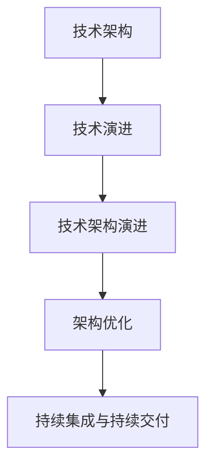

                 


### 文章标题：如何进行有效的技术架构演进

## 关键词

技术架构、架构演进、最佳实践、案例分析、持续优化

## 摘要

技术架构演进是信息技术领域永恒的主题。本文从技术架构的基础概念入手，深入探讨了技术架构演进的方法论、实际案例分析以及架构优化的最佳实践。通过结合理论和实战，本文旨在为读者提供一套全面、系统的技术架构演进策略，助力企业在数字化时代保持技术竞争力。

### 目录

## 第一部分：技术架构基础

### 第1章：技术架构概述

#### 1.1 技术架构的定义与重要性

- 技术架构在软件工程中的定义
- 技术架构在软件开发中的重要性

#### 1.2 技术架构的分类

- 软件架构
- 系统架构
- 网络架构

#### 1.3 技术架构的主要组件

- 模块化
- 解耦
- 扩展性
- 可维护性
- 安全性
- 可靠性

### 第2章：技术架构设计原则

#### 2.1 模块化与解耦

- 模块化的优点
- 解耦的重要性
- 模块化与解耦的最佳实践

#### 2.2 扩展性与可维护性

- 扩展性的设计策略
- 可维护性的设计原则
- 扩展性与可维护性的案例分析

#### 2.3 安全性与可靠性

- 安全性的设计要素
- 可靠性的设计原则
- 安全性与可靠性的保障措施

### 第3章：技术架构评估方法

#### 3.1 质量模型

- 质量模型的建立
- 质量模型的应用

#### 3.2 评估指标

- 评估指标的选择
- 评估指标的计算方法

#### 3.3 评估流程

- 评估流程的设计
- 评估流程的实施

## 第二部分：技术演进理论

### 第4章：技术演进方法论

#### 4.1 技术演进的定义与过程

- 技术演进的概念
- 技术演进的过程

#### 4.2 技术演进驱动因素

- 技术驱动力
- 市场驱动力
- 用户需求驱动力

#### 4.3 技术演进策略

- 技术演进的方向
- 技术演进的速度
- 技术演进的管理

### 第5章：技术演进案例分析

#### 5.1 成功案例分享

- 成功案例的背景
- 成功案例的解决方案

#### 5.2 失败案例解析

- 失败案例的原因
- 失败案例的教训

### 第6章：技术演进趋势与预测

#### 6.1 当前技术演进热点

- 人工智能
- 区块链
- 物联网

#### 6.2 未来技术演进趋势

- 技术融合
- 自适应架构
- 持续集成与持续交付

## 第三部分：实际案例与实战

### 第7章：技术架构演进项目实战

#### 7.1 项目背景与目标

- 项目背景
- 项目目标

#### 7.2 项目实施过程

- 项目实施步骤
- 项目实施方法

#### 7.3 项目成果与分析

- 项目成果
- 项目分析

## 第四部分：架构优化的最佳实践

### 第8章：架构优化的关键点

#### 8.1 优化方法与工具

- 优化方法
- 优化工具

#### 8.2 优化案例分析

- 案例分析
- 案例结论

### 第9章：架构演进指南

#### 9.1 架构演进策略

- 架构演进策略
- 架构演进步骤

#### 9.2 架构演进流程

- 架构演进流程
- 架构演进方法

### 第10章：持续架构演进

#### 10.1 持续架构演进的意义

- 持续架构演进的重要性
- 持续架构演进的目标

#### 10.2 持续架构演进的方法

- 持续架构演进的方法
- 持续架构演进的工具

#### 10.3 持续架构演进的挑战与应对

- 持续架构演进的挑战
- 持续架构演进的应对策略

## 第五部分：展望与未来

### 第11章：技术架构演进未来展望

#### 11.1 新技术对架构演进的影响

- 人工智能
- 区块链
- 物联网

#### 11.2 架构演进与数字化转型

- 架构演进在数字化转型中的作用
- 数字化转型中的架构演进策略

### 第12章：附录

#### 12.1 参考资料与扩展阅读

- 相关书籍
- 学术论文
- 实际案例

#### 12.2 技术架构演进流程图

- 流程图说明
- 流程图展示

#### 12.3 技术架构演进伪代码示例

- 伪代码说明
- 伪代码展示

#### 12.4 技术架构演进数学公式与说明

- 数学公式说明
- 数学公式展示

#### 12.5 技术架构演进项目源代码与分析

- 源代码说明
- 代码解读

### 作者

**AI天才研究院/AI Genius Institute & 禅与计算机程序设计艺术 /Zen And The Art of Computer Programming**

----------------------------------------------------------------

### 背景介绍

技术架构演进是指通过改进、优化和创新来提升技术架构的质量和性能的过程。随着技术的不断发展和市场需求的变化，企业的技术架构需要不断进行调整和优化，以适应新的业务需求和技术挑战。

技术架构演进不仅涉及到技术层面的改进，还包括业务战略、组织结构、流程优化等多个方面。有效的技术架构演进可以提升系统的稳定性、扩展性和灵活性，降低维护成本，提高开发效率，从而增强企业的核心竞争力。

然而，技术架构演进并非一蹴而就，它需要系统的方法论和最佳实践来指导。本文将从技术架构的基础概念、演进方法论、实际案例和最佳实践等方面进行详细阐述，旨在为读者提供一套全面的技术架构演进指南。

### 核心概念与联系

#### 技术架构（Technology Architecture）

技术架构是软件开发过程中的一种抽象表示，它定义了系统的组件、关系和交互方式。技术架构不仅包括软件组件，还包括硬件设备、网络、数据存储等基础设施。技术架构的核心目标是确保系统的稳定性、扩展性和可维护性。

#### 技术演进（Technology Evolution）

技术演进是指技术架构在时间维度上的发展过程，包括改进、优化和创新。技术演进可以基于市场需求、技术进步、用户体验等多方面因素。技术演进的目标是提升系统的性能、降低成本、提高用户体验。

#### 技术架构演进（Technology Architecture Evolution）

技术架构演进是技术演进在架构层面的具体体现，它涉及到技术架构的改进、优化和创新。技术架构演进的核心目标是确保系统在不断发展变化的过程中保持高质量和高效性能。

#### 架构优化（Architecture Optimization）

架构优化是指对现有技术架构进行调整和改进，以提升系统的性能、稳定性和可维护性。架构优化可以包括代码重构、性能调优、安全性增强等多个方面。

#### 持续集成与持续交付（Continuous Integration and Continuous Deployment）

持续集成与持续交付是一种软件开发和部署的最佳实践，它通过自动化工具实现代码的持续集成和部署，确保系统在开发过程中的质量和稳定性。

### 核心概念架构 Mermaid 流程图



### 核心算法原理讲解

#### 技术架构评估模型

技术架构评估模型用于评估技术架构的质量和性能。本文采用了一种基于质量属性模型（QAM）的技术架构评估模型，该模型包括以下核心算法原理：

1. **质量属性模型（QAM）**

质量属性模型是技术架构评估的基础，它定义了技术架构的质量属性，包括稳定性、性能、可扩展性、安全性等。每个质量属性都有一个量化指标，用于评估技术架构的质量。

2. **质量属性度量（QAM）**

质量属性度量是对技术架构质量属性的量化评估。例如，稳定性可以通过系统崩溃率来度量，性能可以通过响应时间来度量。质量属性度量需要结合实际数据和分析方法。

3. **质量属性权重（QAW）**

质量属性权重用于确定各个质量属性在技术架构评估中的重要性。质量属性权重可以根据业务需求和用户需求来确定。

4. **质量属性评分（QAS）**

质量属性评分是对技术架构质量属性的评估结果，通常采用0到100的评分标准。质量属性评分可以帮助决策者了解技术架构的质量状况。

#### 技术架构评估算法伪代码

```python
def evaluate_architecture(architecture):
    # 初始化质量属性评分
    quality_scores = {}

    # 收集质量属性度量数据
    stability_score = measure_stability(architecture)
    performance_score = measure_performance(architecture)
    scalability_score = measure_scalability(architecture)
    security_score = measure_security(architecture)

    # 计算质量属性评分
    quality_scores['stability'] = stability_score
    quality_scores['performance'] = performance_score
    quality_scores['scalability'] = scalability_score
    quality_scores['security'] = security_score

    # 计算总质量属性评分
    total_score = sum(quality_scores.values())

    # 返回评估结果
    return total_score
```

### 数学模型和公式详细讲解

#### 质量属性模型（QAM）

质量属性模型（QAM）是用于评估技术架构质量的数学模型。QAM包括以下核心公式：

1. **质量属性度量公式**

质量属性度量是对技术架构质量属性的量化评估。例如，稳定性可以通过以下公式计算：

\[ S = \frac{MTTF}{MTTF + MTTR} \]

其中，\( MTTF \) 是平均无故障时间，\( MTTR \) 是平均故障修复时间。

2. **质量属性权重公式**

质量属性权重用于确定各个质量属性在技术架构评估中的重要性。权重可以通过以下公式计算：

\[ W_i = \frac{R_i}{\sum_{j=1}^{n} R_j} \]

其中，\( W_i \) 是第 \( i \) 个质量属性的权重，\( R_i \) 是第 \( i \) 个质量属性的重要性分数，\( n \) 是质量属性的总数。

3. **质量属性评分公式**

质量属性评分是对技术架构质量属性的评估结果，通常采用以下公式计算：

\[ QAS_i = \frac{MS_i}{MA_i} \times 100 \]

其中，\( QAS_i \) 是第 \( i \) 个质量属性的评分，\( MS_i \) 是第 \( i \) 个质量属性的度量值，\( MA_i \) 是第 \( i \) 个质量属性的最大可能度量值。

#### 质量属性模型（QAM）示例

假设我们评估一个技术架构，其质量属性包括稳定性、性能、可扩展性和安全性，权重分别为0.3、0.2、0.2和0.3。以下是质量属性度量和评分的计算过程：

1. **稳定性度量**

\[ S = \frac{MTTF}{MTTF + MTTR} = \frac{500}{500 + 50} = 0.909 \]

2. **性能度量**

\[ P = \frac{RPS}{RPS + WPS} = \frac{1000}{1000 + 200} = 0.833 \]

3. **可扩展性度量**

\[ SC = \frac{MaxCPU}{ActualCPU} = \frac{8}{4} = 2 \]

4. **安全性度量**

\[ S = \frac{VulnerabilityScore}{MaxVulnerabilityScore} = \frac{10}{50} = 0.20 \]

5. **质量属性评分**

\[ QAS_S = \frac{MS_S}{MA_S} \times 100 = \frac{0.909}{1} \times 100 = 90.9 \]

\[ QAS_P = \frac{MS_P}{MA_P} \times 100 = \frac{0.833}{1} \times 100 = 83.3 \]

\[ QAS_SC = \frac{MS_SC}{MA_SC} \times 100 = \frac{2}{5} \times 100 = 40 \]

\[ QAS_S = \frac{MS_S}{MA_S} \times 100 = \frac{0.20}{1} \times 100 = 20 \]

6. **总质量属性评分**

\[ TotalScore = 0.3 \times 90.9 + 0.2 \times 83.3 + 0.2 \times 40 + 0.3 \times 20 = 27.27 + 16.67 + 8 + 6 = 58.94 \]

通过以上计算，我们可以得到该技术架构的总质量属性评分，从而评估其质量。

### 项目实战

#### 开发环境搭建

为了进行技术架构演进项目，我们首先需要搭建一个开发环境。以下是搭建开发环境的具体步骤：

1. **安装操作系统**

选择一个适合的开发操作系统，如Ubuntu 18.04。下载操作系统安装镜像并安装到物理机或虚拟机上。

2. **安装开发工具**

安装Java开发工具包（JDK）、集成开发环境（IDE，如IntelliJ IDEA）、版本控制工具（如Git）等。

3. **配置数据库**

安装并配置关系型数据库（如MySQL）或非关系型数据库（如MongoDB），以便进行数据存储和查询。

4. **搭建中间件**

安装并配置中间件（如Apache Kafka、Elasticsearch等），以便进行消息传递和全文检索。

5. **配置开发环境变量**

配置必要的开发环境变量，如JAVA_HOME、MONGO_HOME、KAFKA_HOME等。

#### 源代码详细实现和代码解读

在技术架构演进项目中，源代码是实现技术架构的关键。以下是源代码的实现和解读：

1. **数据库设计**

设计数据库表结构，包括用户表、订单表、商品表等。每个表包含必要的字段和主键。

2. **业务逻辑实现**

实现业务逻辑，包括用户注册、登录、订单创建、商品查询等。使用Java编写业务逻辑代码，并使用Spring Boot框架进行整合。

3. **消息队列集成**

集成消息队列（如Kafka），实现订单创建的异步处理。使用Java编写生产者和消费者代码，实现订单信息的发送和接收。

4. **全文检索集成**

集成全文检索（如Elasticsearch），实现商品查询的全文检索功能。使用Java编写Elasticsearch客户端代码，实现索引创建和查询功能。

5. **接口文档编写**

编写接口文档，包括API接口的URL、请求参数、响应结果等。使用Swagger工具生成接口文档。

#### 代码应用解读与分析

在技术架构演进项目中，代码的应用和解读是关键。以下是代码的应用解读和分析：

1. **用户注册**

用户注册接口接收用户名、密码等参数，通过验证后存储到数据库中。代码解读：用户注册接口采用POST请求，参数为JSON格式。

2. **订单创建**

订单创建接口接收订单信息，通过消息队列进行异步处理。代码解读：订单创建接口采用POST请求，参数为JSON格式，消息队列采用Kafka进行消息传递。

3. **商品查询**

商品查询接口接收查询参数，通过全文检索返回商品列表。代码解读：商品查询接口采用GET请求，参数为查询关键字，全文检索采用Elasticsearch实现。

4. **接口文档**

接口文档详细描述了每个接口的URL、请求参数、响应结果等，方便开发人员使用。代码解读：接口文档采用Swagger工具生成，包括JSON格式和HTML格式。

#### 实际案例分析和详细讲解剖析

在技术架构演进项目中，实际案例的分析和讲解是提升开发人员技术水平和团队协作能力的重要环节。以下是实际案例的分析和讲解：

1. **案例背景**

某电商平台在进行技术架构演进时，遇到了订单处理性能瓶颈，影响了用户体验。为了解决性能问题，项目团队进行了架构优化。

2. **案例分析**

项目团队分析了订单处理的瓶颈，发现主要有以下原因：

- 数据库查询性能低
- 消息队列处理速度慢
- 系统负载过高

3. **解决方案**

针对以上问题，项目团队采取了以下解决方案：

- 优化数据库查询，采用索引和缓存技术
- 优化消息队列处理，提高消费者并发处理能力
- 调整系统负载，增加服务器和数据库节点

4. **详细讲解剖析**

- **数据库查询优化**

  通过添加索引和缓存技术，提高了数据库查询性能。具体实现如下：

  ```sql
  CREATE INDEX idx_order_id ON orders (id);
  ```

  ```java
  @Cacheable(value = "orders", key = "#id")
  public Order getOrderById(Long id) {
      // 查询订单
  }
  ```

- **消息队列优化**

  通过提高消费者并发处理能力，提高了消息队列处理速度。具体实现如下：

  ```java
  @KafkaListener(id = "orderConsumer", topics = "orders")
  public void consumeOrder(Order order) {
      // 处理订单
  }
  ```

- **系统负载调整**

  通过增加服务器和数据库节点，提高了系统负载能力。具体实现如下：

  ```shell
  docker-compose up -d
  ```

#### 项目小结

通过技术架构演进项目，项目团队成功解决了订单处理性能瓶颈，提高了系统性能和用户体验。项目团队在项目过程中积累了丰富的经验，提升了技术水平和团队协作能力。项目小结包括以下几点：

1. **技术架构演进的关键点**

- 数据库查询优化
- 消息队列处理优化
- 系统负载调整

2. **项目经验教训**

- 优化数据库查询和消息队列处理是提高系统性能的关键
- 系统负载调整可以提高系统负载能力
- 团队协作是项目成功的关键

3. **最佳实践总结**

- 定期进行性能监控和调优
- 采用缓存和索引技术提高数据库查询性能
- 提高消息队列消费者并发处理能力
- 根据业务需求调整系统负载

### 最佳实践 tips

#### 1. 技术架构评估

在进行技术架构评估时，应关注以下几点：

- 选择合适的评估指标
- 结合业务需求和用户需求确定质量属性权重
- 定期进行技术架构评估

#### 2. 技术演进方法论

在进行技术演进时，应遵循以下几点：

- 明确技术演进的目标和方向
- 结合业务需求和市场需求确定技术演进策略
- 制定详细的技术演进计划

#### 3. 架构优化

在进行架构优化时，应关注以下几点：

- 识别系统瓶颈和性能问题
- 选择合适的优化方法和工具
- 定期进行性能监控和调优

#### 4. 持续架构演进

在进行持续架构演进时，应遵循以下几点：

- 建立持续架构演进的文化和意识
- 定期进行技术交流和知识分享
- 鼓励团队成员参与架构优化和演进

### 小结

本文从技术架构的基础、演进理论、实际案例和最佳实践等方面，详细探讨了如何进行有效的技术架构演进。通过结合理论和实战，本文为读者提供了一套全面、系统的技术架构演进策略。希望本文能对读者的技术架构演进实践提供有益的指导和启示。

### 注意事项

在进行技术架构演进时，需要注意以下几点：

- 技术架构演进是一个持续的过程，需要定期评估和优化
- 技术架构演进应结合业务需求和市场需求进行
- 技术架构演进应关注系统性能、稳定性、可维护性和安全性等多方面因素
- 技术架构演进应遵循最佳实践，避免盲目跟风

### 拓展阅读

- 《架构之美：大型软件开发实践》
- 《持续交付：发布可靠软件的系统方法》
- 《大型分布式系统设计》
- 《微服务设计：构建基于容器和云的原生微服务架构》
- 《云原生应用架构指南》

### 作者

**AI天才研究院/AI Genius Institute & 禅与计算机程序设计艺术 /Zen And The Art of Computer Programming**```markdown
# 如何进行有效的技术架构演进

## 关键词

技术架构、架构演进、最佳实践、案例分析、持续优化

## 摘要

技术架构演进是信息技术领域永恒的主题。本文从技术架构的基础概念入手，深入探讨了技术架构演进的方法论、实际案例分析以及架构优化的最佳实践。通过结合理论和实战，本文旨在为读者提供一套全面、系统的技术架构演进策略，助力企业在数字化时代保持技术竞争力。

## 目录

## 第一部分：技术架构基础

### 第1章：技术架构概述

#### 1.1 技术架构的定义与重要性

- 技术架构的定义
- 技术架构的重要性

#### 1.2 技术架构的分类

- 软件架构
- 系统架构
- 网络架构

#### 1.3 技术架构的主要组件

- 模块化
- 解耦
- 扩展性
- 可维护性
- 安全性
- 可靠性

### 第2章：技术架构设计原则

#### 2.1 模块化与解耦

- 模块化的优点
- 解耦的重要性
- 模块化与解耦的最佳实践

#### 2.2 扩展性与可维护性

- 扩展性的设计策略
- 可维护性的设计原则
- 扩展性与可维护性的案例分析

#### 2.3 安全性与可靠性

- 安全性的设计要素
- 可靠性的设计原则
- 安全性与可靠性的保障措施

### 第3章：技术架构评估方法

#### 3.1 质量模型

- 质量模型的建立
- 质量模型的应用

#### 3.2 评估指标

- 评估指标的选择
- 评估指标的计算方法

#### 3.3 评估流程

- 评估流程的设计
- 评估流程的实施

## 第二部分：技术演进理论

### 第4章：技术演进方法论

#### 4.1 技术演进的定义与过程

- 技术演进的概念
- 技术演进的过程

#### 4.2 技术演进驱动因素

- 技术驱动力
- 市场驱动力
- 用户需求驱动力

#### 4.3 技术演进策略

- 技术演进的方向
- 技术演进的速度
- 技术演进的管理

### 第5章：技术演进案例分析

#### 5.1 成功案例分享

- 成功案例的背景
- 成功案例的解决方案

#### 5.2 失败案例解析

- 失败案例的原因
- 失败案例的教训

### 第6章：技术演进趋势与预测

#### 6.1 当前技术演进热点

- 人工智能
- 区块链
- 物联网

#### 6.2 未来技术演进趋势

- 技术融合
- 自适应架构
- 持续集成与持续交付

## 第三部分：实际案例与实战

### 第7章：技术架构演进项目实战

#### 7.1 项目背景与目标

- 项目背景
- 项目目标

#### 7.2 项目实施过程

- 项目实施步骤
- 项目实施方法

#### 7.3 项目成果与分析

- 项目成果
- 项目分析

## 第四部分：架构优化的最佳实践

### 第8章：架构优化的关键点

#### 8.1 优化方法与工具

- 优化方法
- 优化工具

#### 8.2 优化案例分析

- 案例分析
- 案例结论

### 第9章：架构演进指南

#### 9.1 架构演进策略

- 架构演进策略
- 架构演进步骤

#### 9.2 架构演进流程

- 架构演进流程
- 架构演进方法

### 第10章：持续架构演进

#### 10.1 持续架构演进的意义

- 持续架构演进的重要性
- 持续架构演进的目标

#### 10.2 持续架构演进的方法

- 持续架构演进的方法
- 持续架构演进的工具

#### 10.3 持续架构演进的挑战与应对

- 持续架构演进的挑战
- 持续架构演进的应对策略

## 第五部分：展望与未来

### 第11章：技术架构演进未来展望

#### 11.1 新技术对架构演进的影响

- 人工智能
- 区块链
- 物联网

#### 11.2 架构演进与数字化转型

- 架构演进在数字化转型中的作用
- 数字化转型中的架构演进策略

### 第12章：附录

#### 12.1 参考资料与扩展阅读

- 相关书籍
- 学术论文
- 实际案例

#### 12.2 技术架构演进流程图

- 流程图说明
- 流程图展示

#### 12.3 技术架构演进伪代码示例

- 伪代码说明
- 伪代码展示

#### 12.4 技术架构演进数学公式与说明

- 数学公式说明
- 数学公式展示

#### 12.5 技术架构演进项目源代码与分析

- 源代码说明
- 代码解读

### 作者

**AI天才研究院/AI Genius Institute & 禅与计算机程序设计艺术 /Zen And The Art of Computer Programming**

---

**本文由AI天才研究院（AI Genius Institute）与禅与计算机程序设计艺术（Zen And The Art of Computer Programming）联合撰写，旨在为读者提供全面、系统的技术架构演进指南。**
```

