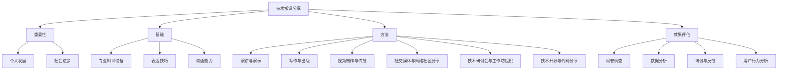

                 

# 如何进行有效的技术知识分享

> 关键词：技术知识分享，方法，技巧，效果评估

> 摘要：本文旨在探讨如何进行有效的技术知识分享，通过详细阐述分享的重要性、基础、方法和效果评估，为技术从业者提供一份全面的指导。文章将结合实际案例，从演讲与演示、写作与出版、视频制作与传播、社交媒体与网络社区分享、技术研讨会与工作坊组织、技术开源与代码分享等多个角度进行深入分析。

## 引言

在信息技术飞速发展的今天，技术知识已成为企业、个人和社会的核心竞争力。有效的技术知识分享不仅有助于个人职业发展，还能推动整个行业的技术进步和社会创新。然而，如何进行有效的技术知识分享，仍然是一个值得探讨的话题。本文将从以下几个方面展开：

1. 技术知识分享的重要性
2. 技术知识分享的基础
3. 技术知识分享的方法
4. 技术知识分享的效果评估

通过这四个方面的探讨，旨在为读者提供一份实用的技术知识分享指南。

## 第一部分：准备阶段

### 第1章：技术知识分享的重要性

### 1.1 技术知识分享的价值

技术知识分享对个人和社会都有着深远的影响。首先，对个人而言，技术知识分享有助于提升个人的知名度和影响力，增强个人在行业内的竞争力。通过分享自己的知识和经验，个人可以建立起自己的人脉网络，拓宽职业发展空间。同时，技术知识分享还能激发个人的学习兴趣，促使自己不断进步。

对整个社会而言，技术知识分享是推动技术创新和社会进步的重要动力。通过共享知识，社会可以快速积累和传播技术成果，缩短技术迭代周期，提升整个行业的创新能力和竞争力。此外，技术知识分享还能促进跨领域的交流与合作，推动科学技术的交叉融合，为社会发展注入新的活力。

### 1.2 技术知识分享的现状

当前，技术知识分享已逐渐成为信息技术行业的重要组成部分。随着互联网和社交媒体的普及，技术知识的传播速度和范围都得到了极大的提升。然而，现状仍然存在一些问题，如知识分享质量参差不齐、传播渠道有限等。因此，如何提升技术知识分享的质量和效果，成为当前亟待解决的问题。

### 1.3 技术知识分享的驱动力

技术知识分享的驱动力主要来自于以下几个方面：

1. **个人兴趣与职业发展**：许多技术从业者出于个人兴趣或职业发展需求，愿意分享自己的知识和经验。
2. **企业社会责任**：许多企业认识到技术知识分享对社会发展的重要性，将其作为企业社会责任的一部分。
3. **政府政策支持**：政府对技术知识分享的重视，通过政策和资金支持，推动技术知识分享的普及和发展。
4. **市场需求**：随着信息技术产业的快速发展，市场对技术知识的需求不断增长，推动技术知识分享的持续进行。

### 1.4 技术知识分享的目标与策略

技术知识分享的目标可以分为三个方面：

1. **传播知识**：将个人的技术知识和经验分享给更多的人，促进知识的传播和普及。
2. **提升技能**：通过分享和学习，提升个人的技术能力和水平。
3. **推动创新**：通过技术知识分享，激发创新思维，推动技术创新和社会进步。

为了实现这些目标，技术知识分享需要制定相应的策略：

1. **明确分享目标**：在分享前，明确自己的分享目标，确保分享内容具有针对性和实用性。
2. **选择合适平台**：根据分享内容和目标受众，选择合适的平台进行分享，如博客、社交媒体、技术论坛等。
3. **制定分享计划**：制定详细的分享计划，包括分享内容、时间、方式等。
4. **持续优化与改进**：通过收集反馈和评估分享效果，不断优化和改进分享策略。

### 1.5 技术知识分享的准备工作

在进行技术知识分享前，需要做好以下准备工作：

1. **整理知识体系**：对要分享的技术知识进行系统整理，确保知识结构的完整性和逻辑性。
2. **准备分享材料**：根据分享内容，准备相应的PPT、文档、视频等分享材料。
3. **选择合适的时间**：选择合适的时间进行分享，确保受众有足够的时间和精力参与。
4. **测试设备与环境**：确保分享设备和工作环境的正常运作，避免分享过程中出现意外。

### 1.6 技术知识分享的注意事项

在进行技术知识分享时，需要注意以下几点：

1. **尊重知识产权**：在分享过程中，要尊重他人的知识产权，避免侵犯他人的版权和专利。
2. **避免过度推销**：分享时，应避免过度推销自己的产品或服务，以免影响分享的客观性和可信度。
3. **关注受众需求**：在分享时，要关注受众的需求和兴趣，确保分享内容对受众具有实际价值。
4. **保持沟通与互动**：在分享过程中，要保持与受众的沟通和互动，回答受众的问题，收集反馈和改进分享内容。

### 第2章：技术知识分享的基础

#### 2.1 技术知识分享的基础

技术知识分享的基础包括以下几个方面：

1. **专业知识储备**：技术知识分享的前提是拥有扎实的专业知识储备，只有这样才能确保分享的内容具有实际价值和指导意义。
2. **表达技巧**：良好的表达技巧是技术知识分享的关键，包括语言表达能力、逻辑思维能力和演讲能力等。
3. **沟通能力**：技术知识分享不仅是单向的传递，还需要与受众进行有效的沟通和互动，了解受众的需求和反馈，及时调整分享内容和方式。
4. **时间管理**：在进行技术知识分享时，需要合理安排时间，确保分享的进度和效果。

#### 2.2 技术知识分享的平台与工具

技术知识分享的平台与工具丰富多样，主要包括以下几种：

1. **博客**：博客是技术知识分享的重要平台，具有信息发布、知识交流、互动评论等功能。
2. **社交媒体**：如微博、微信、知乎等，便于快速传播和广泛覆盖。
3. **技术论坛**：如CSDN、博客园等，是技术爱好者交流和分享的平台。
4. **视频平台**：如YouTube、Bilibili等，适合进行技术演示和讲解。
5. **开源社区**：如GitHub、GitLab等，便于代码分享和协作开发。
6. **在线教育平台**：如网易云课堂、慕课网等，适合进行系统的知识分享和教学。

#### 2.3 技术知识分享的流程

技术知识分享的流程通常包括以下几个步骤：

1. **选题与策划**：根据受众需求和自身知识储备，确定分享的主题和内容。
2. **内容创作**：撰写或录制分享内容，确保内容的准确性和实用性。
3. **平台发布**：选择合适的平台和工具，发布分享内容。
4. **互动与反馈**：与受众进行互动，收集反馈，不断优化和改进分享内容。
5. **效果评估**：通过数据分析和受众反馈，评估分享效果，总结经验教训。

### 第3章：技术知识分享的方法

#### 3.1 演讲与演示技巧

演讲与演示是技术知识分享的重要形式，以下是一些技巧：

1. **内容准备**：明确演讲主题，梳理内容结构，确保演讲的逻辑性和条理性。
2. **演讲技巧**：注重语速、语调、表情、姿态等，提高演讲的吸引力和表现力。
3. **演示工具**：熟练使用PPT、视频、动画等演示工具，增强演示效果。
4. **互动环节**：设置互动环节，与受众进行互动，提高参与度和互动性。

#### 3.2 写作与出版技巧

写作与出版是技术知识分享的重要方式，以下是一些技巧：

1. **选题与构思**：选择具有实际价值和指导意义的话题，构思独特的写作角度。
2. **写作技巧**：注重逻辑性、条理性和准确性，使用简洁明了的语言。
3. **编辑与排版**：进行仔细的编辑和排版，确保文章的格式规范、美观。
4. **出版与推广**：选择合适的出版平台，进行有效的推广和宣传。

#### 3.3 视频制作与传播技巧

视频制作与传播是技术知识分享的新兴方式，以下是一些技巧：

1. **内容创作**：注重视频内容的实用性和趣味性，提高观众的观看体验。
2. **视频剪辑**：使用视频剪辑工具，对视频进行剪辑和优化，提升视频质量。
3. **传播策略**：利用社交媒体、视频平台等渠道，进行有效的传播和推广。

#### 3.4 社交媒体与网络社区分享

社交媒体与网络社区是技术知识分享的重要渠道，以下是一些技巧：

1. **平台选择**：根据受众特点和内容类型，选择合适的社交媒体平台和网络社区。
2. **内容策略**：制定合理的内容策略，提高内容的吸引力和传播力。
3. **互动与反馈**：积极参与社区互动，收集反馈，不断优化内容。

#### 3.5 技术研讨会与工作坊组织

技术研讨会与工作坊是技术知识分享的有效形式，以下是一些技巧：

1. **主题策划**：确定有针对性的主题，吸引相关领域的专家和爱好者参与。
2. **组织与协调**：合理安排会议议程，确保会议的顺利进行。
3. **现场互动**：营造良好的互动氛围，促进参会者之间的交流与合作。

#### 3.6 技术开源与代码分享

技术开源与代码分享是技术知识分享的重要方式，以下是一些技巧：

1. **开源协议**：选择合适的开源协议，保护自己的知识产权，促进知识的共享和传播。
2. **代码文档**：编写详细的代码文档，提高代码的可读性和可维护性。
3. **代码审查**：进行严格的代码审查，确保代码的质量和安全性。
4. **社区互动**：积极参与开源社区，与其他开发者进行交流和合作。

### 第二部分：技术知识分享的方法（续）

#### 第4章：演讲与演示技巧（续）

4.1 演讲与演示的核心要素

演讲与演示的核心要素包括：

1. **内容结构**：确保演讲内容的逻辑清晰、结构紧凑，使听众容易理解和跟随。
2. **表达方式**：使用生动、简洁的语言，结合适当的故事、案例和比喻，提高演讲的吸引力和说服力。
3. **视觉辅助**：利用图表、图片、动画等视觉元素，增强演讲的表现力和记忆点。
4. **互动环节**：设置互动环节，如提问、讨论、小组活动等，提高听众的参与度和兴趣。

4.2 演讲与演示的技巧

以下是一些演讲与演示的技巧：

1. **开场白**：通过引人入胜的开场白，吸引听众的注意力，设定演讲的基调。
2. **故事讲述**：通过讲述故事，使抽象的概念和理论更加具体、形象，提高听众的理解和记忆。
3. **重点突出**：明确演讲的重点，使用强调的方式，使听众更容易记住关键信息。
4. **时间控制**：合理控制演讲时间，确保演讲内容在规定的时间内完成。
5. **应对突发情况**：在演讲过程中，可能会遇到突发情况，如设备故障、听众提问等，需要冷静应对，确保演讲的顺利进行。

4.3 演讲与演示的实际案例

以下是一个演讲与演示的实际案例：

假设您是一位技术专家，需要为一个技术会议做一场关于人工智能在医疗领域的应用的演讲。以下是一个可能的演讲结构与技巧：

1. **开场白**：以一个引人入胜的案例引入演讲主题，例如：“近年来，人工智能在医疗领域的应用日益广泛，例如，通过深度学习技术，AI可以辅助医生进行疾病诊断，提高诊断的准确性和效率。”
2. **内容结构**：
   - **背景介绍**：简要介绍人工智能在医疗领域的背景和发展趋势。
   - **核心技术**：详细讲解人工智能在医疗领域的关键技术，如深度学习、自然语言处理等。
   - **应用案例**：分享几个成功的人工智能在医疗领域的应用案例，分析其优势和应用前景。
   - **未来展望**：探讨人工智能在医疗领域的未来发展，提出可能面临的挑战和解决方案。
3. **表达方式**：结合实际案例和数据，使用简洁明了的语言进行讲解，突出重点，使听众容易理解和记忆。
4. **视觉辅助**：使用图表、图片和动画等视觉元素，展示人工智能在医疗领域的技术和应用。
5. **互动环节**：设置互动环节，如问答环节，邀请听众提问，解答他们的疑问，增强听众的参与感。
6. **结尾**：总结演讲要点，强调人工智能在医疗领域的重要性和未来前景，激励听众对人工智能在医疗领域的探索和应用。

通过以上案例，可以看到演讲与演示技巧在实际应用中的重要性。

#### 第5章：写作与出版技巧（续）

5.1 写作技巧

写作技巧是进行技术知识分享的重要基础，以下是一些写作技巧：

1. **明确主题**：在写作前，明确主题和目标，确保文章内容的集中和针对性。
2. **结构清晰**：合理规划文章结构，确保文章的逻辑性和条理性。
3. **语言简洁**：使用简洁明了的语言，避免冗长和复杂的句子结构。
4. **举例说明**：通过具体案例和实例，使文章内容更具说服力和可读性。
5. **专业术语**：恰当使用专业术语，提高文章的专业性和权威性。

5.2 出版技巧

出版技巧是进行技术知识分享的重要环节，以下是一些出版技巧：

1. **选择合适的出版平台**：根据文章主题和目标受众，选择合适的出版平台，如博客、书籍、杂志等。
2. **撰写出版提案**：向出版社或编辑提交详细的出版提案，包括文章主题、结构、预期读者等。
3. **编辑与校对**：认真进行编辑和校对，确保文章的格式规范、语言通顺、内容准确。
4. **推广与宣传**：通过社交媒体、邮件列表等渠道，进行有效的推广和宣传，吸引更多读者。

5.3 实际案例

以下是一个写作与出版实际案例：

假设您是一位技术专家，计划撰写一篇关于云计算在金融行业的应用的论文，并希望将其发表在一本知名的技术杂志上。以下是一个可能的写作与出版流程：

1. **确定主题**：明确主题为“云计算在金融行业的应用：挑战与机遇”。
2. **撰写论文大纲**：根据主题，规划论文结构，包括引言、背景、核心技术、应用案例、挑战与机遇、结论等部分。
3. **撰写初稿**：按照论文大纲，撰写初稿，确保内容的完整性和逻辑性。
4. **编辑与校对**：对初稿进行多次修改和校对，确保文章的语言通顺、格式规范、内容准确。
5. **撰写出版提案**：向目标杂志的编辑提交详细的出版提案，包括论文主题、结构、创新点、预期读者等。
6. **等待审核**：提交提案后，等待编辑的审核和反馈。
7. **修改与完善**：根据编辑的反馈，对论文进行修改和完善。
8. **发表与推广**：论文发表后，通过社交媒体、邮件列表等渠道，进行有效的推广和宣传，吸引更多读者。

通过以上案例，可以看到写作与出版技巧在实际应用中的重要性。

#### 第6章：视频制作与传播技巧（续）

6.1 视频制作的核心要素

视频制作是技术知识分享的重要形式，其核心要素包括：

1. **内容创作**：确保视频内容的实用性、趣味性和可看性，使观众愿意观看和分享。
2. **视频剪辑**：通过剪辑和特效，提高视频的观赏性和表现力，增强观众的观看体验。
3. **画面与音效**：合理运用画面和音效，增强视频的视觉和听觉效果，提高观众的注意力。
4. **字幕与注释**：为视频添加字幕和注释，提高视频的可读性和理解度，满足不同观众的需求。

6.2 视频制作的技巧

以下是一些视频制作的技巧：

1. **明确主题**：在制作视频前，明确主题和目标，确保视频内容的集中和针对性。
2. **规划内容结构**：合理规划视频内容结构，确保视频的逻辑性和条理性。
3. **选用合适的设备**：选择合适的摄像机、麦克风等设备，确保视频画面的清晰和音效的清晰。
4. **后期处理**：通过剪辑、特效、调色等后期处理，提高视频的质量和观赏性。

6.3 视频传播的技巧

以下是一些视频传播的技巧：

1. **选择合适的平台**：根据视频内容和目标受众，选择合适的视频平台，如YouTube、Bilibili等。
2. **优化视频内容**：对视频标题、描述、标签等进行优化，提高视频在搜索引擎和视频平台上的曝光率。
3. **互动与推广**：在视频发布后，与观众进行互动，如回复评论、发起讨论等，提高观众的参与度和忠诚度。
4. **合作推广**：与其他视频创作者或媒体进行合作，通过相互推广，扩大视频的影响力和覆盖面。

6.4 实际案例

以下是一个视频制作与传播实际案例：

假设您是一位技术专家，计划制作一段关于大数据在零售行业的应用的短视频，并希望通过社交媒体进行传播。以下是一个可能的视频制作与传播流程：

1. **确定主题**：明确主题为“大数据在零售行业的应用：如何提高销售额？”。
2. **规划内容结构**：根据主题，规划视频内容结构，包括背景介绍、核心概念、应用案例、总结等部分。
3. **拍摄与剪辑**：使用摄像机拍摄视频，通过剪辑和特效，提高视频的观赏性和表现力。
4. **后期处理**：对视频进行后期处理，包括调色、音效调整等，提高视频的质量。
5. **发布与推广**：在YouTube等视频平台发布视频，通过优化视频标题、描述、标签等，提高视频的曝光率。
6. **互动与推广**：在视频发布后，与观众进行互动，如回复评论、发起讨论等，提高观众的参与度和忠诚度。
7. **合作推广**：与其他视频创作者或媒体进行合作，通过相互推广，扩大视频的影响力和覆盖面。

通过以上案例，可以看到视频制作与传播技巧在实际应用中的重要性。

### 第三部分：技术知识分享的效果评估

#### 第7章：效果评估方法与工具

7.1 效果评估的重要性

效果评估是技术知识分享过程中至关重要的一环。通过效果评估，可以了解知识分享的成效，发现问题和不足，为后续的知识分享提供改进方向。

7.2 效果评估的方法

以下是一些效果评估的方法：

1. **问卷调查**：通过问卷调查，收集受众对知识分享的反馈，了解受众的满意度、收获和改进建议。
2. **数据分析**：通过数据统计和分析，了解知识分享的覆盖范围、受众群体、互动情况等，评估知识分享的效果。
3. **访谈与反馈**：通过与受众进行访谈，深入了解他们对知识分享的反馈和意见，获取更详细的效果评估信息。
4. **用户行为分析**：通过分析用户在知识分享平台上的行为数据，如浏览量、点赞数、评论数等，评估知识分享的吸引力和影响力。

7.3 效果评估的工具

以下是一些效果评估的工具：

1. **问卷调查工具**：如腾讯问卷、问卷星等，方便进行问卷设计、发布和数据分析。
2. **数据分析工具**：如Google Analytics、百度统计等，提供详细的网站访问数据和用户行为分析。
3. **访谈与反馈工具**：如Zoom、腾讯会议等，方便进行在线访谈和反馈收集。
4. **用户行为分析工具**：如Hotjar、ClickTale等，提供用户在网站或应用上的行为数据和热图分析。

#### 第8章：持续改进与反馈机制

8.1 持续改进的重要性

持续改进是技术知识分享过程中的关键，通过不断反思和调整，可以不断提高知识分享的质量和效果。

8.2 反馈机制的建立

以下是一些反馈机制的建立方法：

1. **定期反馈**：设立定期反馈机制，如每月或每季度进行一次效果评估和反馈收集，及时发现问题并进行改进。
2. **即时反馈**：在知识分享过程中，设立即时反馈渠道，如在线问卷、评论区等，方便受众随时反馈意见和建议。
3. **内部反馈**：建立内部反馈机制，如团队会议、工作坊等，促进团队成员之间的交流和反馈。
4. **外部反馈**：与外部专家、同行等进行交流，获取外部反馈和建议，为知识分享的改进提供参考。

8.3 改进措施的制定与实施

在获取反馈后，需要制定相应的改进措施，并确保其有效实施。以下是一些改进措施的制定与实施方法：

1. **分析反馈**：对收集到的反馈进行分析，找出问题和不足，确定改进方向。
2. **制定计划**：根据分析结果，制定详细的改进计划，包括改进措施、责任人和时间表等。
3. **实施改进**：按照改进计划，实施具体的改进措施，确保改进效果的落实。
4. **跟踪评估**：在改进措施实施后，进行跟踪评估，了解改进效果，根据评估结果进行进一步优化。

### 结论

技术知识分享是推动技术创新和社会进步的重要动力。通过有效的技术知识分享，个人可以提升自身的技术水平和知名度，企业可以增强核心竞争力，整个社会可以加速技术进步和社会发展。本文从技术知识分享的重要性、基础、方法和效果评估等方面进行了详细探讨，为技术从业者提供了全面的指导。在实际操作中，需要结合自身实际情况，灵活运用各种知识和方法，不断提高技术知识分享的质量和效果。只有通过持续的学习、实践和改进，才能在技术知识分享的道路上不断前进。

## 作者信息

作者：AI天才研究院/AI Genius Institute & 禅与计算机程序设计艺术 /Zen And The Art of Computer Programming

---

在撰写技术博客文章时，需要遵循以下步骤：

### 1. 文章结构设计

首先，需要设计文章的结构，确保内容逻辑清晰、易于阅读。文章结构通常包括：

- **引言**：简要介绍文章的主题和目的，吸引读者的兴趣。
- **正文**：按照文章主题，分章节详细阐述，每个章节包含小节，每个小节有明确的标题和内容。
- **结论**：总结文章的主要观点和收获，提供未来展望或建议。
- **参考文献**：列出文章中引用的文献，以支持文章的观点和论述。

### 2. 核心概念与联系

在文章中，需要明确核心概念，并展示它们之间的联系。可以使用**Mermaid 图**来表示概念之间的关系，例如：



### 3. 伪代码和数学模型

在解释核心算法原理时，需要使用**伪代码**来详细阐述算法的逻辑。例如：

```python
// 伪代码：快速排序算法
function quicksort(arr):
    if length(arr) <= 1:
        return arr
    
    pivot = arr[length(arr) / 2]
    left = []
    right = []
    
    for each element in arr:
        if element < pivot:
            left.append(element)
        else:
            right.append(element)
    
    return concatenate(quicksort(left), pivot, quicksort(right))
```

同时，需要使用**LaTeX 格式**展示数学模型和公式。例如：

```markdown
$$
E = mc^2
$$

$1 < 2$
```

### 4. 项目实战

在适当章节，需要包含项目实战，展示实际开发环境和代码实现。例如：

```markdown
### 项目实战：搭建一个简单的博客系统

#### 开发环境

- 编程语言：Python
- 依赖库：Flask、SQLite

#### 源代码解读

```python
# app.py

from flask import Flask, render_template, request

app = Flask(__name__)

@app.route('/')
def home():
    return render_template('home.html')

@app.route('/about')
def about():
    return render_template('about.html')

if __name__ == '__main__':
    app.run(debug=True)
```

#### 代码应用解读与分析

以上代码实现了一个简单的博客系统，包括首页和关于页面。读者可以进一步学习如何扩展该系统，添加文章发布、评论功能等。

### 5. 最佳实践 Tips、小结、注意事项、拓展阅读

在文章末尾，提供最佳实践 tips、小结、注意事项和拓展阅读，帮助读者更好地理解和应用文章内容。例如：

```markdown
### 最佳实践 Tips

- 在技术知识分享时，保持内容的简洁明了，避免过于复杂。
- 定期进行效果评估，及时调整和改进分享内容。
- 积极参与社区互动，了解受众需求和反馈。

### 小结

本文详细介绍了如何进行有效的技术知识分享，包括重要性、基础、方法和效果评估。通过实际案例和项目实战，读者可以更好地理解和应用这些方法。

### 注意事项

- 在分享过程中，注意保护个人和企业的知识产权。
- 确保分享内容具有实用性和针对性，满足受众需求。

### 拓展阅读

- [《禅与计算机程序设计艺术》](https://www.oreilly.com/library/view/zen-and-the-art-of/0201616148/)
- [《Effective Java》](https://www.oreilly.com/library/view/effective-java-2nd-edition/0321356683/)
```

通过以上步骤，可以撰写一篇逻辑清晰、内容丰富、具有实践价值的技术博客文章。在实际撰写过程中，需要不断反思和优化，确保文章的质量和效果。

