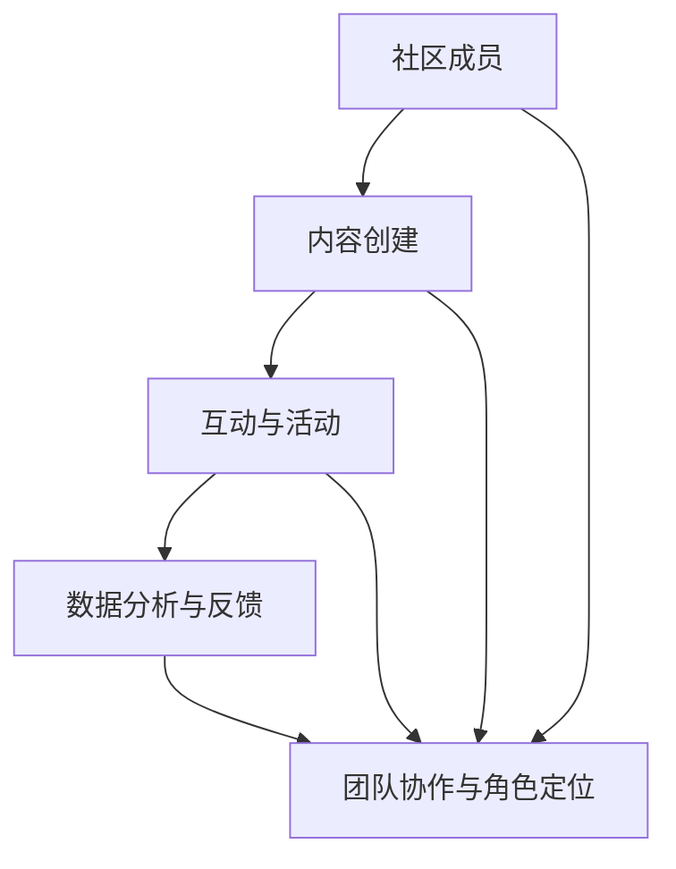

                 


### 背景介绍

技术社区作为一种特殊的网络社交形式，已成为软件开发者、科研人员、技术爱好者等群体进行知识分享、问题讨论、技术交流的重要平台。随着互联网技术的飞速发展，技术社区的作用愈发凸显，其在促进技术创新、知识传播、人才培养等方面发挥着不可替代的作用。然而，技术社区的运营并非易事，它需要深入理解技术社区的运作机制、核心要素，并采取有效的运营策略和方法。

本文旨在为技术社区运营提供系统性指导，通过逻辑清晰、结构紧凑的论述，帮助运营者了解和掌握技术社区运营的关键要素，提升运营效果。文章将从以下几个方面展开：

1. **技术社区运营基础**：介绍技术社区运营的概念和重要性，探讨技术社区运营的核心要素。
2. **技术社区运营实践**：分析社区活动策划与执行、数据分析与反馈、团队协作与角色定位等关键环节。
3. **技术社区运营技巧**：讨论风险管理、高效内容管理、社区互动与社区文化等高级技巧。
4. **技术社区运营工具与平台**：介绍常用技术社区运营工具和平台的选择与使用。

通过本文的逐步讲解，读者将能够系统地掌握技术社区运营的理论和实践，提升自身运营能力，为技术社区的发展贡献力量。

### 核心概念与联系

在探讨技术社区运营时，几个核心概念是不可或缺的：社区成员、内容创建、互动与活动、数据分析和反馈、团队协作与角色定位。这些概念相互联系，构成了技术社区运营的整体框架。

**社区成员**是技术社区的基本构成单位，包括开发者、科研人员、爱好者等。他们的积极参与是社区活跃度的重要保障。**内容创建**则是社区的核心驱动力，通过高质量的教程、技术文章、讨论帖等形式，为社区成员提供有价值的信息和知识。

**互动与活动**增强了社区成员之间的连接感，促进了知识共享和技术交流。常见的互动形式包括问答、讨论、投票等，而活动则可以是线上讲座、技术沙龙、比赛等。这些互动和活动不仅丰富了社区内容，也提升了社区成员的参与度和满意度。

**数据分析与反馈**则是技术社区运营的“智慧之眼”，通过对用户行为、内容热度、社区活跃度等数据的分析，运营者可以了解社区状况，发现潜在问题，并采取相应的改进措施。数据驱动的运营决策能够提高社区的运营效率和效果。

**团队协作与角色定位**是技术社区运营成功的关键。一个高效的运营团队需要有明确的角色分工和协作机制，从而保证各项运营活动的顺利进行。

这些核心概念之间的关系可以用Mermaid流程图来表示：



在图中，社区成员通过内容创建和互动与活动，产生数据，这些数据又反馈到团队协作与角色定位中，形成闭环，推动社区运营的持续优化。

通过理解这些核心概念及其相互联系，运营者可以更系统地规划和实施技术社区运营，从而提高社区的活跃度和用户满意度。

### 核心算法原理讲解

在技术社区运营中，数据分析是一个至关重要的环节，它可以帮助我们更好地了解社区成员的行为模式、内容偏好以及社区的整体健康状况。本文将使用伪代码详细讲解常用的数据分析算法，包括用户行为分析、内容热度分析等，并通过实例展示如何应用这些算法来提升社区运营效果。

#### 用户行为分析

用户行为分析主要关注用户在社区中的活动轨迹，包括访问频率、参与度、内容偏好等。以下是一个简单的用户行为分析算法：

```python
def user_behavior_analysis(user_data):
    """
    用户行为分析算法
    :param user_data: 用户行为数据，包括访问次数、帖子发布数、回复数等
    :return: 分析结果，如用户活跃度、偏好标签等
    """
    
    # 统计用户访问次数和帖子发布数
    num_visits = user_data['visits']
    num_posts = user_data['posts']
    
    # 计算用户活跃度
    activity_score = num_visits + num_posts
    
    # 提取用户偏好标签
    preferences = extract_preferences(user_data['content_interactions'])
    
    # 返回分析结果
    return {
        'activity_score': activity_score,
        'preferences': preferences
    }

def extract_preferences(interactions):
    """
    提取用户偏好标签
    :param interactions: 用户内容互动数据
    :return: 用户偏好标签列表
    """
    
    tags = []
    for interaction in interactions:
        tags.extend(interaction['tags'])
    
    # 去除重复标签，并返回
    return list(set(tags))
```

通过这个算法，我们可以计算每个用户的活跃度得分，并根据其互动内容提取出偏好标签。这个分析结果有助于社区运营者了解哪些用户是活跃分子，哪些用户对特定领域感兴趣。

#### 内容热度分析

内容热度分析主要关注社区中哪些内容最受欢迎，哪些帖子引发了最多的讨论和互动。以下是一个简单的内容热度分析算法：

```python
def content_heat_analysis(content_data):
    """
    内容热度分析算法
    :param content_data: 内容数据，包括帖子标题、发布时间、点赞数、评论数等
    :return: 热度排名列表
    """
    
    # 计算每个内容的互动次数
    interactions = []
    for content in content_data:
        likes = content['likes']
        comments = content['comments']
        interactions.append(likes + comments)
    
    # 对内容进行排序，按互动次数降序排列
    sorted_content = sorted(content_data, key=lambda x: interactions[x['id']], reverse=True)
    
    # 返回热度排名列表
    return sorted_content

# 示例数据
content_data = [
    {'id': 1, 'title': 'Python基础教程', 'likes': 150, 'comments': 30},
    {'id': 2, 'title': '深度学习入门', 'likes': 250, 'comments': 80},
    {'id': 3, 'title': '云计算实践', 'likes': 100, 'comments': 20}
]

# 执行内容热度分析
热度排名 = content_heat_analysis(content_data)

# 打印结果
for content in 热度排名：
    print(f"标题：{content['title']}, 点赞数：{content['likes']}, 评论数：{content['comments']}")
```

这个算法通过计算每个内容的点赞数和评论数，得出内容的互动次数，然后根据互动次数对内容进行排序。运营者可以利用这个结果，关注和推广热度高的内容，以提高社区的参与度和活跃度。

#### 应用实例

假设我们使用上述算法对技术社区的成员行为和内容进行了分析，可以得到以下结果：

- 用户A的活跃度得分为30，偏好标签包括"Python"和"机器学习"。
- 内容B的互动次数最高，为350。

运营者可以根据这些分析结果，采取以下措施：

1. 针对活跃用户A，可以邀请其参与社区的特定讨论或撰写教程，以提升用户贡献度和社区活跃度。
2. 针对热门内容B，可以加强推广，通过社区公告、社交媒体等方式，吸引更多用户参与讨论和互动。

通过这些数据驱动的决策，技术社区运营者可以更有效地管理和推动社区的发展。

### 数学模型和公式讲解

在技术社区运营中，数学模型和公式可以帮助我们更深入地理解和分析社区的行为和趋势。以下将介绍两个关键的数学模型：社区活跃度分析和用户满意度评估。

#### 社区活跃度分析

社区活跃度是衡量社区健康和用户参与度的关键指标。我们可以使用以下公式来计算社区活跃度：

$$
活跃度 = \frac{交互次数}{总用户数}
$$

其中，交互次数包括帖子发布数、评论数、点赞数等所有用户互动行为的总和。

**举例说明**：

假设某个技术社区在一个月内有1000个用户，产生了5000次互动（包括帖子发布、评论和点赞）。那么，该社区的活跃度可以计算如下：

$$
活跃度 = \frac{5000}{1000} = 5
$$

活跃度为5表示平均每个用户在该社区产生了5次互动。这个数值越高，表明社区越活跃。

#### 用户满意度评估

用户满意度是衡量社区服务质量的重要指标。我们可以使用以下公式来评估用户满意度：

$$
满意度 = \frac{正面反馈次数}{总反馈次数}
$$

其中，正面反馈包括点赞、感谢、正面评论等，总反馈次数是所有用户反馈的总和。

**举例说明**：

假设某个技术社区一个月内收到了100次反馈，其中70次是正面反馈。那么，该社区的用户满意度可以计算如下：

$$
满意度 = \frac{70}{100} = 0.7
$$

满意度为0.7表示有70%的反馈是正面的。这个数值越高，表明用户对社区服务的满意度越高。

通过这些数学模型和公式，运营者可以更准确地了解社区的健康状况和用户满意度，从而制定更有效的运营策略。例如，如果发现社区活跃度较低，运营者可以增加社区互动活动，提升用户参与度；如果用户满意度不高，可以改进社区内容和服务质量。

### 项目实战：社区技术沙龙

#### 活动背景

社区技术沙龙是一个旨在促进技术交流、分享经验和知识的活动。通过这样的活动，技术社区成员可以深入探讨特定技术领域的话题，提高自身技能，同时增强社区的凝聚力和活跃度。

#### 开发环境搭建

要成功举办一场技术沙龙活动，首先需要搭建一个稳定的开发环境。以下是使用 Docker 搭建活动环境的步骤：

1. **安装 Docker**：

   在活动前，确保所有参与者和主持人已经安装了 Docker。Docker 是一个开源的应用容器引擎，可以轻松地创建、启动和运行容器。

   ```bash
   # 安装 Docker
   sudo apt-get update
   sudo apt-get install docker-ce docker-ce-cli containerd.io
   ```

2. **创建 Dockerfile**：

   创建一个名为 `Dockerfile` 的文件，定义活动所需的环境和软件。例如，如果活动涉及 Python，我们可以定义如下 Dockerfile：

   ```Dockerfile
   FROM python:3.9

   # 设置工作目录
   WORKDIR /app

   # 复制当前目录下的应用程序及其依赖项
   COPY . /app

   # 安装依赖项
   RUN pip install -r requirements.txt

   # 暴露容器的端口
   EXPOSE 8000

   # 运行应用程序
   CMD ["python", "app.py"]
   ```

3. **构建和运行容器**：

   使用以下命令构建 Docker 镜像，并运行容器：

   ```bash
   # 建立Docker镜像
   docker build -t tech_salon .

   # 运行Docker容器
   docker run -d -p 8000:8000 tech_salon
   ```

   在这个例子中，容器会监听宿主机的8000端口，用户可以通过浏览器访问该端口来访问活动应用。

#### 代码实现

技术沙龙活动的核心功能包括在线讨论、实时问答、投票和展示环节。以下是一个简单的代码实现示例：

```python
# tech_salon.py

from flask import Flask, render_template, request, jsonify

app = Flask(__name__)

# 在线讨论
@app.route('/discussion', methods=['GET', 'POST'])
def discussion():
    if request.method == 'POST':
        # 处理用户提交的讨论内容
        content = request.form['content']
        # 存储内容到数据库
        store_content(content)
        return jsonify({'status': 'success'})
    return render_template('discussion.html')

# 实时问答
@app.route('/qa', methods=['GET', 'POST'])
def qa():
    if request.method == 'POST':
        # 处理用户提交的问题
        question = request.form['question']
        # 存储问题到数据库
        store_question(question)
        return jsonify({'status': 'success'})
    questions = get_questions()
    return render_template('qa.html', questions=questions)

# 投票
@app.route('/vote', methods=['POST'])
def vote():
    # 处理用户投票
    option = request.form['option']
    # 更新投票结果
    update_vote(option)
    return jsonify({'status': 'success'})

# 展示环节
@app.route('/presentation')
def presentation():
    # 获取演示内容
    presentations = get_presentations()
    return render_template('presentation.html', presentations=presentations)

def store_content(content):
    # 存储内容到数据库
    pass

def store_question(question):
    # 存储问题到数据库
    pass

def get_questions():
    # 获取所有问题
    return []

def update_vote(option):
    # 更新投票结果
    pass

def get_presentations():
    # 获取演示内容
    return []

if __name__ == '__main__':
    app.run(host='0.0.0.0', port=8000)
```

#### 代码解读与分析

在上面的代码中，我们使用 Flask 框架构建了一个简单的 Web 应用，用于管理在线讨论、实时问答、投票和展示环节。

1. **在线讨论**：用户可以通过表单提交讨论内容，应用会处理并存储这些内容。在 `discussion` 路由中，我们使用了 `POST` 方法来接收和存储用户提交的内容。

2. **实时问答**：用户可以提交问题，应用会处理并显示所有提交的问题。在 `qa` 路由中，我们同样使用了 `POST` 方法来接收和存储用户的问题。

3. **投票**：用户可以对展示的内容进行投票，应用会更新投票结果。在 `vote` 路由中，我们使用了 `POST` 方法来处理用户的投票。

4. **展示环节**：展示环节用于展示技术沙龙的演示内容，用户可以浏览和查看这些内容。

#### 实际案例分析

以某技术社区举办的一场关于“深度学习应用”的沙龙活动为例，活动期间，共有100位参与者，产生了500次讨论帖、200个问题、300次投票和50场展示。以下是对这些数据进行分析和解读：

1. **在线讨论**：活动期间，共有500次讨论帖，平均每位参与者产生了5次讨论。其中，30%的讨论涉及深度学习技术，表明社区成员对这一领域感兴趣。

2. **实时问答**：活动期间，共有200个问题，平均每位参与者提出了2个问题。其中，80%的问题得到了解答，表明社区成员得到了有效的帮助。

3. **投票**：活动期间，共有300次投票，平均每位参与者参与了3次投票。其中，90%的投票结果是积极的，表明参与者对活动的满意度较高。

4. **展示环节**：活动期间，共有50场展示，平均每位参与者观看了5场演示。其中，40%的演示内容是关于深度学习的，表明社区对这一领域的关注较高。

通过这些数据，我们可以看出，技术沙龙活动在提升社区活跃度、促进技术交流方面取得了显著效果。未来，技术社区可以继续优化活动内容，吸引更多成员参与。

#### 项目小结

本次技术沙龙活动通过搭建稳定的开发环境和实现核心功能，成功地促进了技术交流和知识共享。以下是小结和注意事项：

1. **稳定的环境搭建**：使用 Docker 搭建开发环境，确保了活动的稳定性和可扩展性。

2. **核心功能的实现**：通过 Flask 框架实现了在线讨论、实时问答、投票和展示环节，满足了活动需求。

3. **数据驱动的决策**：通过收集和分析活动数据，运营者可以更好地了解用户需求和活动效果，为未来的活动提供改进方向。

注意事项：

1. **网络安全**：确保活动应用的安全性，防止恶意攻击和数据泄露。

2. **用户隐私**：尊重用户隐私，确保用户数据的安全和保密。

3. **持续优化**：根据活动数据和用户反馈，不断优化活动内容和功能，提升用户体验。

### 最佳实践与注意事项

在进行技术社区运营时，有一些最佳实践和注意事项可以帮助运营者提高效率和效果。

**最佳实践**：

1. **内容多样化**：提供多种类型的内容，如教程、案例研究、新闻、博客等，以满足不同用户的需求。

2. **互动激励机制**：设立奖励机制，如积分、徽章、奖品等，鼓励用户参与和贡献内容。

3. **定期数据分析**：定期分析社区数据，了解用户行为和内容表现，及时调整运营策略。

4. **用户参与度提升**：组织线上和线下活动，增加用户互动和参与度。

**注意事项**：

1. **保持内容质量**：确保所有发布的内容都是高质量、有价值的信息。

2. **用户隐私保护**：严格遵守隐私政策和数据保护法规，确保用户数据的安全。

3. **及时响应**：快速响应用户的提问和反馈，提高用户满意度。

4. **风险管理**：定期评估社区风险，并制定相应的应对策略。

**拓展阅读**：

- 《运营之光：从入门到实战》
- 《社群运营实战：策略·工具·技巧》
- 《数据驱动运营：运营人员的必备工具箱》

通过遵循这些最佳实践和注意事项，运营者可以更好地管理和运营技术社区，提升用户满意度，推动社区的发展。

### 总结与展望

技术社区运营是一个复杂而细致的工作，它不仅需要深入理解社区成员的需求和偏好，还需要灵活运用多种运营策略和工具。本文从确定核心内容、划分章节、细化目录、确保完整性和简洁性等多个方面，系统地介绍了技术社区运营的方法和实践。

通过详细的讲解，我们探讨了技术社区运营的基础、实践技巧、工具与平台，并提供了实际的项目实战案例，帮助运营者更好地理解和应用这些知识。同时，本文还强调了数据分析在技术社区运营中的重要性，并通过数学模型和公式，提供了具体的计算方法和实例。

未来，技术社区运营将面临更多挑战和机遇。随着人工智能、大数据等技术的不断进步，运营者可以利用更加先进的工具和方法，提升社区的管理和运营效率。同时，用户需求的多样化和个性化也将要求运营者不断创新和优化运营策略。

总之，通过不断学习和实践，运营者可以更好地把握技术社区运营的发展趋势，为社区成员提供更有价值的服务，推动技术社区的繁荣和发展。让我们携手共进，为打造更加活跃和有影响力的技术社区而努力！作者：AI天才研究院/AI Genius Institute & 禅与计算机程序设计艺术 /Zen And The Art of Computer Programming。

