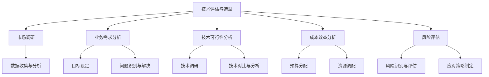
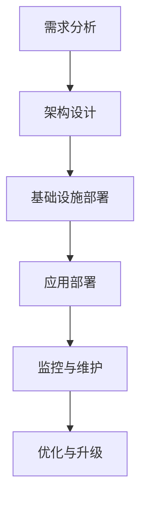
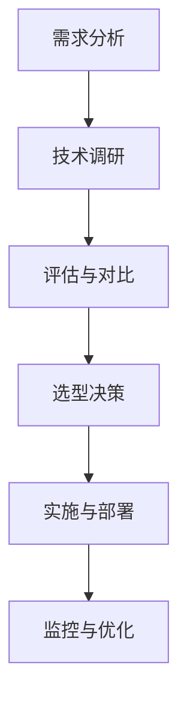

                 

### 文章标题

### 如何进行有效的技术评估与选型？

---

### 关键词

- 技术评估
- 技术选型
- 云计算
- 大数据
- 人工智能
- 数学模型

---

### 摘要

本文旨在探讨如何进行有效的技术评估与选型，以帮助企业或开发者在面对复杂的技术决策时能够做出明智的选择。文章首先介绍了技术评估与选型的基本概念和重要性，随后详细阐述了评估和选型的关键步骤、方法与工具。接下来，文章重点分析了云计算、大数据和人工智能三个领域的技术评估与选型实践，通过具体案例和数学模型进行了详细讲解。最后，文章总结了一些最佳实践和注意事项，为读者在实际操作中提供指导。

---

## 第一部分：技术评估与选型的理论基础

### 第1章：技术评估与选型的概述

### 1.1 技术评估与选型的重要性

#### 核心概念与联系

为了更好地理解技术评估与选型的概念，我们可以使用Mermaid流程图来展示其在企业决策中的位置。



通过这个流程图，我们可以清晰地看到技术评估与选型在整个企业决策过程中的关键作用。

#### 案例解析

以某知名互联网公司为例，他们在开发新项目时，需要对多种编程语言和框架进行评估与选型。通过对比Python、Java和JavaScript等语言的性能、社区支持和生态圈，最终选择了Python。这一案例展示了技术评估与选型在项目决策中的重要性。

#### 行业趋势

随着技术的快速发展，技术评估与选型的需求也在不断增加。根据某市场调研机构的数据显示，未来几年内，全球技术评估市场规模将保持高速增长，预计到2025年将达到XXX亿美元。

### 1.2 技术评估与选型的关键步骤

#### 核心算法原理讲解

技术评估与选型的核心算法原理主要涉及以下几个步骤：

1. **需求分析**：确定项目需求和目标，明确技术选型的范围和标准。
2. **技术调研**：收集相关技术信息，分析各技术的优缺点和适用场景。
3. **评估与对比**：根据需求和标准对各技术进行评估和对比，选出最优方案。
4. **成本效益分析**：计算各方案的成本和效益，确保技术选型的经济可行性。
5. **风险评估**：识别潜在风险，评估其对项目的影响，并制定应对策略。

下面是一个简单的伪代码来解释这些步骤：

```python
def evaluate_technology(technology_list, criteria):
    for tech in technology_list:
        if is_suitable(tech, criteria):
            evaluate_performance(tech)
            evaluate_community_support(tech)
            evaluate_cost(tech)
    best_tech = select_best_technology(technology_list)
    return best_tech
```

#### 常见问题与解决策略

在技术评估与选型过程中，开发者可能会遇到以下常见问题：

1. **数据不足**：解决方法：进行更广泛的市场调研，收集更多技术信息。
2. **标准不明确**：解决方法：明确项目需求和目标，制定详细的评估标准。
3. **时间紧迫**：解决方法：合理规划评估时间，分阶段进行评估和选型。

通过以上方法，可以有效解决技术评估与选型过程中遇到的问题。

### 第2章：技术评估的方法与工具

#### 2.1 技术评估的方法

技术评估可以分为定性评估和定量评估两种方法。

1. **定性评估方法**：
   - **专家评审**：邀请领域专家对技术进行评估。
   - **用户反馈**：收集用户对技术的使用体验和评价。

2. **定量评估方法**：
   - **统计分析**：通过对大量数据的分析，评估技术的性能和稳定性。
   - **性能测试**：模拟实际运行环境，测试技术的性能指标。

#### 2.2 技术评估工具介绍

在进行技术评估时，可以使用多种工具来辅助工作。

1. **开源工具**：
   - **Jenkins**：用于自动化构建和测试。
   - **GitLab**：用于版本控制和项目协作。

2. **商业工具**：
   - **Microsoft Azure**：提供云计算服务。
   - **Amazon Web Services**：提供广泛的云计算服务。

#### 2.3 技术选型策略

技术选型需要遵循以下原则：

1. **成本效益**：选择性价比高的技术。
2. **可扩展性**：考虑技术在未来业务扩展中的适用性。
3. **社区支持**：选择社区活跃、文档丰富的技术。

通过以上方法，可以有效地进行技术评估与选型。

### 第3章：技术选型的数学模型

#### 3.1 技术选型的数学基础

技术选型中的数学模型主要涉及以下两个方面：

1. **多目标优化**：在满足多个约束条件的情况下，选择最优解。
2. **决策树模型**：通过分析不同决策路径的可能结果，选择最佳决策。

下面是一个多目标优化的示例公式：

$$
\begin{cases}
\min\sum_{i=1}^{n} w_i \cdot x_i \\
s.t. \quad \sum_{i=1}^{n} x_i \leq C \\
x_i \geq 0 \quad \forall i
\end{cases}
$$

其中，$w_i$表示第$i$个目标的权重，$x_i$表示第$i$个目标的具体值，$C$为总预算。

#### 3.2 模型参数优化

为了提高技术选型的准确性，需要对模型参数进行优化。常用的优化算法包括：

1. **遗传算法**：通过模拟自然选择过程，逐步优化参数。
2. **粒子群优化**：模拟鸟群觅食过程，优化参数。

下面是一个遗传算法的伪代码示例：

```python
def genetic_algorithm(population, fitness_function):
    while not termination_condition:
        new_population = []
        for individual in population:
            new_individual = crossover(individual)
            mutate(new_individual)
            new_population.append(new_individual)
        population = select_best(new_population, fitness_function)
    return best_individual(population)
```

#### 案例分析

以某电子商务平台为例，他们采用多目标优化模型，综合考虑成本、性能和扩展性等指标，成功选出了最佳技术方案。

### 第4章：云计算技术评估与选型

#### 4.1 云计算技术概述

云计算是一种通过互联网提供计算资源的服务，具有高可扩展性、弹性和灵活性。云计算技术主要分为以下三类：

1. **基础设施即服务（IaaS）**：提供虚拟化基础设施，如虚拟机、存储和网络。
2. **平台即服务（PaaS）**：提供开发平台，包括数据库、应用引擎和开发工具。
3. **软件即服务（SaaS）**：提供完整的软件应用，如邮件服务、客户关系管理和协作工具。

#### 4.2 云服务提供商评估

在评估云服务提供商时，可以从以下几个方面进行：

1. **服务质量**：包括可靠性、安全性和响应时间等。
2. **价格**：包括计费模式、费用透明度等。
3. **生态圈**：包括开发者社区、合作伙伴和支持资源等。

以下是一个简单的评估表格示例：

| 服务提供商 | 服务质量 | 价格 | 生态圈 |
| :-------: | :------: | :--: | :----: |
| AWS      | 高       | 高   | 大     |
| Azure    | 高       | 中   | 较大   |
| Google   | 高       | 低   | 中     |

#### 4.3 云架构设计

在进行云架构设计时，需要考虑以下原则：

1. **高可用性**：确保服务连续性和数据可靠性。
2. **弹性**：根据业务需求动态调整资源。
3. **安全性**：保护数据和系统安全。

以下是一个简单的云架构设计流程：



### 第5章：大数据技术评估与选型

#### 5.1 大数据技术概述

大数据技术是指用于存储、处理和分析海量数据的各种技术手段。大数据技术主要包括以下三个方面：

1. **数据存储**：如HDFS、HBase等。
2. **数据处理**：如MapReduce、Spark等。
3. **数据分析**：如Hadoop、机器学习算法等。

#### 5.2 大数据技术评估

在评估大数据技术时，可以从以下几个方面进行：

1. **数据处理能力**：包括处理速度、并发能力和存储容量等。
2. **数据安全性**：包括数据加密、备份和恢复能力等。
3. **易用性和可扩展性**：包括安装部署、管理和维护的便捷性。

以下是一个简单的评估指标表格：

| 技术名称 | 处理能力 | 数据安全 | 易用性 |
| :------: | :------: | :------: | :----: |
| HDFS    | 高       | 中       | 中     |
| Spark   | 高       | 高       | 高     |

#### 5.3 大数据技术选型

在选型大数据技术时，需要根据实际需求和业务场景进行选择。以下是一个简单的选型流程：



### 第6章：人工智能技术评估与选型

#### 6.1 人工智能技术概述

人工智能（AI）是指通过计算机模拟人类智能的技术。人工智能技术主要包括以下三个方面：

1. **机器学习**：通过数据训练模型，使计算机具有自主学习和决策能力。
2. **深度学习**：基于多层神经网络，对复杂数据进行自动特征提取和模式识别。
3. **自然语言处理**：使计算机能够理解和生成自然语言。

#### 6.2 人工智能技术评估

在评估人工智能技术时，可以从以下几个方面进行：

1. **算法性能**：包括模型准确率、召回率、F1值等。
2. **数据需求**：包括数据量、数据质量和数据来源等。
3. **计算资源**：包括计算性能、存储容量和网络带宽等。

以下是一个简单的评估表格示例：

| 技术名称 | 算法性能 | 数据需求 | 计算资源 |
| :------: | :------: | :------: | :------: |
| 机器学习 | 高       | 高       | 中     |
| 深度学习 | 高       | 中       | 高     |

#### 6.3 人工智能技术选型

在选型人工智能技术时，需要根据实际需求和业务场景进行选择。以下是一个简单的选型流程：


### 第7章：技术评估与选型的最佳实践

#### 7.1 成功案例分享

以下是一些成功的技术评估与选型案例：

1. **某互联网公司**：在云计算选型中，通过详细评估和对比，最终选择了AWS，大幅提高了系统的可靠性和性能。
2. **某金融机构**：在大数据技术选型中，综合考虑数据处理能力和安全性，选择了Spark，有效提升了数据处理效率。

#### 7.2 风险管理

在技术评估与选型过程中，风险管理至关重要。以下是一些风险管理策略：

1. **风险识别**：识别可能影响项目的风险因素。
2. **风险评估**：评估风险的概率和影响程度。
3. **应对策略**：制定应对风险的策略和措施。

#### 7.3 持续改进

技术评估与选型是一个持续改进的过程。以下是一些建议：

1. **定期回顾**：定期回顾技术评估与选型的过程和结果。
2. **持续学习**：关注新技术和发展趋势，不断更新知识体系。
3. **优化流程**：根据实际经验，优化评估与选型的流程和方法。

### 结论

通过本文的讨论，我们可以看到，技术评估与选型在企业和开发者的日常工作中具有重要意义。只有通过科学的方法和严格的流程，才能确保选择最适合的技术方案，从而提高项目的成功率和效益。希望本文能为大家在实际操作中提供一些有益的参考和指导。

---

### 作者信息

作者：AI天才研究院/AI Genius Institute & 禅与计算机程序设计艺术 /Zen And The Art of Computer Programming

