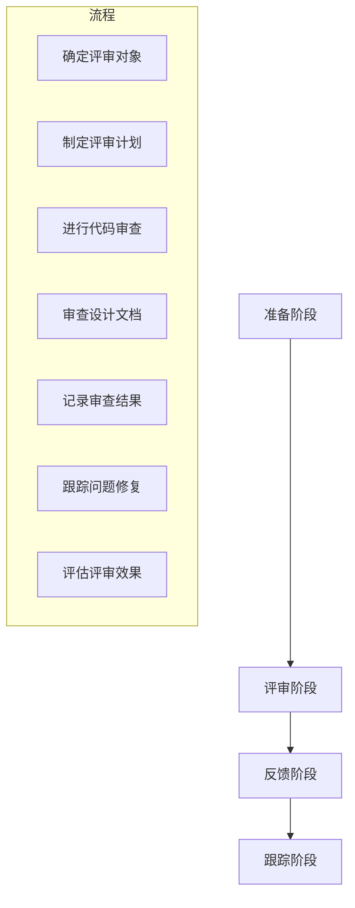

                 

### 文章标题
**如何进行有效的技术评审**

> 关键词：技术评审，代码审查，流程，算法，数学模型，项目实战

**摘要**：
本文将探讨如何进行有效的技术评审，从核心概念与联系、核心算法原理讲解、数学模型和数学公式，到项目实战，逐步解析技术评审的各个关键环节。通过详细的讲解和实例分析，帮助读者掌握技术评审的最佳实践，提高软件开发质量。

---

### 核心概念与联系
**1. 技术评审的定义与目的**
技术评审是一种系统性的检查方法，用于确保软件开发过程中的产品质量。其目的是通过检查代码、设计文档、测试用例等，识别和解决潜在的问题，减少开发成本和风险。

**2. 技术评审的流程与角色**
技术评审的流程通常包括以下几个阶段：准备阶段、评审阶段、反馈阶段和跟踪阶段。每个阶段都有不同的角色和任务。

**Mermaid流程图**


### 核心算法原理讲解
**1. 代码审查算法**
**伪代码：**
```python
function codeReview(code, rules):
    for rule in rules:
        if rule.matches(code):
            if rule.isWarning:
                print("Warning:", rule.message)
            else:
                print("Error:", rule.message)
                return False
    return True
```

**2. 项目风险评估算法**
**伪代码：**
```python
function riskAssessment(loss, gain):
    risk = loss / gain
    if risk > threshold:
        print("High Risk Detected")
    return risk
```

### 数学模型和数学公式
**1. 项目风险评估模型**
**公式：**
$$\text{风险} = \frac{\text{潜在损失}}{\text{潜在收益}}$$

**2. 代码质量评估模型**
**公式：**
$$\text{质量} = \frac{\text{代码行数}}{\text{缺陷数量}}$$

### 项目实战
**1. 项目背景**
在一个大型项目中，需要确保代码质量，降低缺陷率，提高开发效率。

**2. 项目目标**
- 实现代码质量的持续提升。
- 识别和解决关键代码缺陷。
- 提高团队的开发效率。

**3. 技术评审方法与结果**
- 采用代码审查和设计文档评审相结合的方式。
- 定期进行评审，记录审查结果，跟踪问题修复。

**4. 开发环境搭建**
- 使用Git进行版本控制。
- 配置持续集成工具，如Jenkins。

**5. 源代码实现与代码解读**
- 以一个具体的代码片段为例，展示代码审查的过程。
- 分析代码中的潜在问题和优化建议。

**6. 代码应用解读与分析**
- 通过具体案例，分析技术评审对项目质量的影响。

**7. 项目小结**
- 总结项目经验，提出改进措施。

### 最佳实践 tips
- 制定明确的评审计划，确保评审过程有序进行。
- 培养团队成员的评审技能，提高评审质量。
- 定期评估评审效果，持续优化评审流程。

### 小结
本文详细讲解了如何进行有效的技术评审，包括核心概念与联系、核心算法原理讲解、数学模型和数学公式，以及项目实战。通过本文的阅读，读者可以掌握技术评审的方法和技巧，提高软件开发质量。

### 注意事项
- 技术评审需要根据项目的具体情况进行调整。
- 评审过程中，要注意平衡评审质量和效率。

### 拓展阅读
- [代码审查的最佳实践](https://example.com/code-review-best-practices)
- [项目风险评估的方法](https://example.com/project-risk-assessment-methods)

---

**作者：AI天才研究院/AI Genius Institute & 禅与计算机程序设计艺术 /Zen And The Art of Computer Programming**

